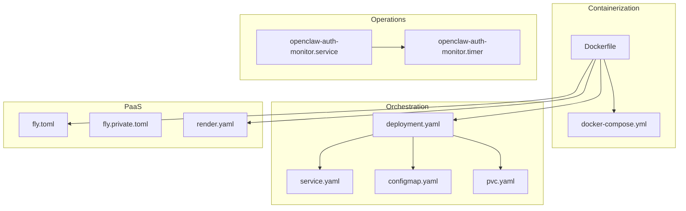
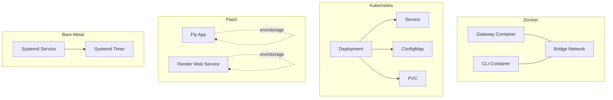
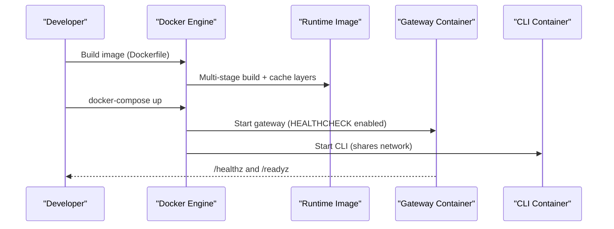
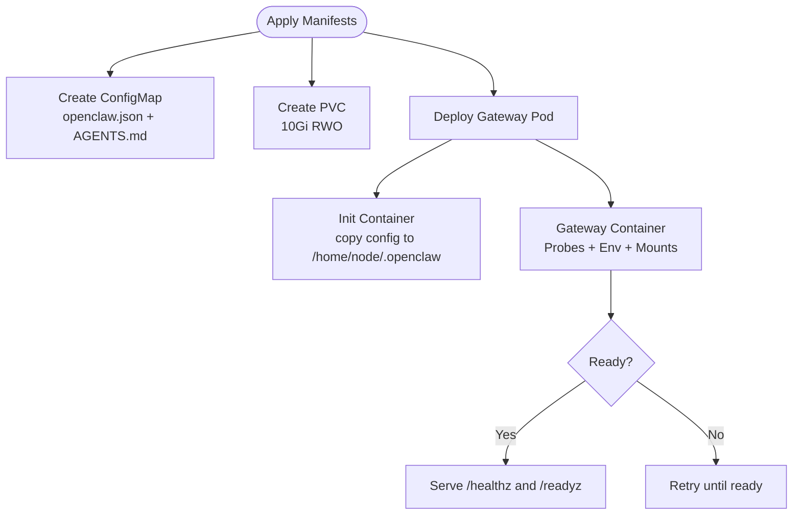
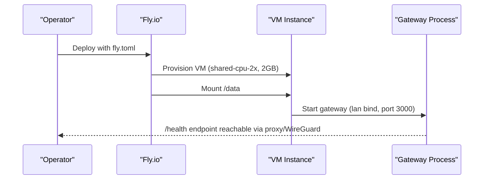
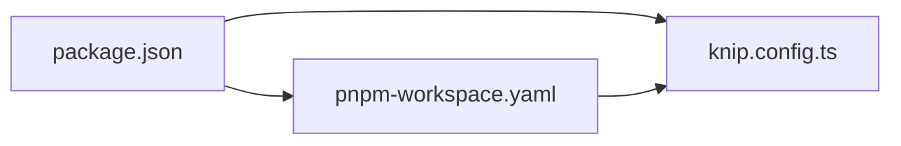
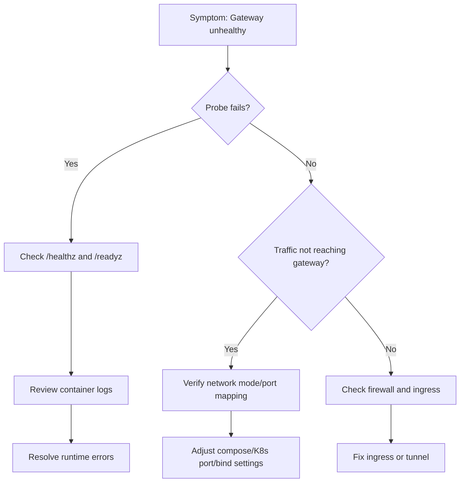

# Deployment & Operations

<cite>
**Referenced Files in This Document**
- [Dockerfile](file://Dockerfile)
- [docker-compose.yml](file://docker-compose.yml)
- [fly.toml](file://fly.toml)
- [fly.private.toml](file://fly.private.toml)
- [render.yaml](file://render.yaml)
- [deployment.yaml](file://scripts/k8s/manifests/deployment.yaml)
- [service.yaml](file://scripts/k8s/manifests/service.yaml)
- [configmap.yaml](file://scripts/k8s/manifests/configmap.yaml)
- [pvc.yaml](file://scripts/k8s/manifests/pvc.yaml)
- [openclaw-auth-monitor.service](file://scripts/systemd/openclaw-auth-monitor.service)
- [openclaw-auth-monitor.timer](file://scripts/systemd/openclaw-auth-monitor.timer)
- [package.json](file://package.json)
- [knip.config.ts](file://knip.config.ts)
- [pnpm-workspace.yaml](file://pnpm-workspace.yaml)
</cite>

## Table of Contents
1. [Introduction](#introduction)
2. [Project Structure](#project-structure)
3. [Core Components](#core-components)
4. [Architecture Overview](#architecture-overview)
5. [Detailed Component Analysis](#detailed-component-analysis)
6. [Dependency Analysis](#dependency-analysis)
7. [Performance Considerations](#performance-considerations)
8. [Troubleshooting Guide](#troubleshooting-guide)
9. [Conclusion](#conclusion)
10. [Appendices](#appendices)

## Introduction
This document provides comprehensive deployment and operations guidance for OpenClaw across Docker, Kubernetes, Platform-as-a-Service (PaaS), and traditional installations. It covers production deployment patterns, scaling considerations, infrastructure requirements, monitoring and logging, backup strategies, maintenance tasks, CI/CD pipeline examples, automated provisioning, performance optimization, resource management, capacity planning, troubleshooting, health monitoring, incident response, and operational excellence with security hardening.

## Project Structure
OpenClaw’s deployment assets are primarily defined by containerization and orchestration manifests:
- Container image build and runtime behavior are defined in the Dockerfile and supporting scripts.
- Orchestration manifests for Kubernetes are located under scripts/k8s/manifests/.
- PaaS configurations exist for Fly.io and Render.
- Compose-based local deployment is supported via docker-compose.yml.
- Systemd timers/services support periodic auth monitoring on bare-metal systems.

```mermaid
graph TB
subgraph "Containerization"
DF["Dockerfile"]
DC["docker-compose.yml"]
end
subgraph "Orchestration"
K8S_DEPLOY["deployment.yaml"]
K8S_SVC["service.yaml"]
K8S_CFG["configmap.yaml"]
K8S_PVC["pvc.yaml"]
end
subgraph "PaaS"
FLY["fly.toml"]
FLY_PRIV["fly.private.toml"]
REN["render.yaml"]
end
subgraph "Operations"
SYS_SVC["openclaw-auth-monitor.service"]
SYS_TIMER["openclaw-auth-monitor.timer"]
end
DF --> DC
DF --> K8S_DEPLOY
DF --> FLY
DF --> REN
K8S_DEPLOY --> K8S_SVC
K8S_DEPLOY --> K8S_CFG
K8S_DEPLOY --> K8S_PVC
SYS_SVC --> SYS_TIMER
```

**Diagram sources**
- [Dockerfile:1-250](file://Dockerfile#L1-L250)
- [docker-compose.yml:1-79](file://docker-compose.yml#L1-L79)
- [deployment.yaml:1-147](file://scripts/k8s/manifests/deployment.yaml#L1-L147)
- [service.yaml:1-16](file://scripts/k8s/manifests/service.yaml#L1-L16)
- [configmap.yaml:1-39](file://scripts/k8s/manifests/configmap.yaml#L1-L39)
- [pvc.yaml:1-13](file://scripts/k8s/manifests/pvc.yaml#L1-L13)
- [fly.toml:1-35](file://fly.toml#L1-L35)
- [fly.private.toml:1-40](file://fly.private.toml#L1-L40)
- [render.yaml:1-22](file://render.yaml#L1-L22)
- [openclaw-auth-monitor.service:1-15](file://scripts/systemd/openclaw-auth-monitor.service#L1-L15)
- [openclaw-auth-monitor.timer:1-11](file://scripts/systemd/openclaw-auth-monitor.timer#L1-L11)

**Section sources**
- [Dockerfile:1-250](file://Dockerfile#L1-L250)
- [docker-compose.yml:1-79](file://docker-compose.yml#L1-L79)
- [deployment.yaml:1-147](file://scripts/k8s/manifests/deployment.yaml#L1-L147)
- [service.yaml:1-16](file://scripts/k8s/manifests/service.yaml#L1-L16)
- [configmap.yaml:1-39](file://scripts/k8s/manifests/configmap.yaml#L1-L39)
- [pvc.yaml:1-13](file://scripts/k8s/manifests/pvc.yaml#L1-L13)
- [fly.toml:1-35](file://fly.toml#L1-L35)
- [fly.private.toml:1-40](file://fly.private.toml#L1-L40)
- [render.yaml:1-22](file://render.yaml#L1-L22)
- [openclaw-auth-monitor.service:1-15](file://scripts/systemd/openclaw-auth-monitor.service#L1-L15)
- [openclaw-auth-monitor.timer:1-11](file://scripts/systemd/openclaw-auth-monitor.timer#L1-L11)

## Core Components
- Gateway runtime: Node.js-based server exposing health and readiness probes, configurable via environment variables and mounted configuration.
- CLI entrypoint: Provides interactive and non-interactive operations, integrated into container images and compose stacks.
- Extension and skill packaging: Extensions and skills are included in the runtime image for channel integrations.
- Sandbox support: Optional Docker CLI installation enables agent sandboxing; optional Chromium installation optimizes browser automation startup.
- Health and readiness: Built-in HTTP probes (/healthz, /readyz) facilitate container health checks and orchestrator integration.

**Section sources**
- [Dockerfile:243-249](file://Dockerfile#L243-L249)
- [docker-compose.yml:24-50](file://docker-compose.yml#L24-L50)
- [deployment.yaml:106-123](file://scripts/k8s/manifests/deployment.yaml#L106-L123)

## Architecture Overview
OpenClaw supports multiple deployment topologies:
- Docker single-container: Gateway plus optional CLI container sharing the same network.
- Kubernetes: Stateless gateway managed by Deployment with ConfigMap-backed configuration and PVC-backed persistence.
- PaaS: Fly.io and Render configurations define runtime behavior, environment variables, and storage mounts.
- Bare metal: Systemd timer triggers periodic auth expiry monitoring script.

```mermaid
graph TB
subgraph "Docker"
D_GW["Gateway Container"]
D_CLI["CLI Container"]
D_NET["Bridge Network"]
D_GW --- D_NET
D_CLI --- D_NET
end
subgraph "Kubernetes"
K_DEP["Deployment"]
K_SVC["Service"]
K_CFG["ConfigMap"]
K_PVC["PVC"]
K_DEP --> K_SVC
K_DEP --> K_CFG
K_DEP --> K_PVC
end
subgraph "PaaS"
F_APP["Fly App"]
R_APP["Render Web Service"]
F_APP -. env/storage .-> F_APP
R_APP -. env/storage .-> R_APP
end
subgraph "Bare Metal"
S_SRV["Systemd Service"]
S_TMR["Systemd Timer"]
S_SRV --> S_TMR
end
```

**Diagram sources**
- [docker-compose.yml:1-79](file://docker-compose.yml#L1-L79)
- [deployment.yaml:1-147](file://scripts/k8s/manifests/deployment.yaml#L1-L147)
- [service.yaml:1-16](file://scripts/k8s/manifests/service.yaml#L1-L16)
- [configmap.yaml:1-39](file://scripts/k8s/manifests/configmap.yaml#L1-L39)
- [pvc.yaml:1-13](file://scripts/k8s/manifests/pvc.yaml#L1-L13)
- [fly.toml:1-35](file://fly.toml#L1-L35)
- [render.yaml:1-22](file://render.yaml#L1-L22)
- [openclaw-auth-monitor.service:1-15](file://scripts/systemd/openclaw-auth-monitor.service#L1-L15)
- [openclaw-auth-monitor.timer:1-11](file://scripts/systemd/openclaw-auth-monitor.timer#L1-L11)

## Detailed Component Analysis

### Docker Deployment
- Image build: Multi-stage build with extension dependency extraction, Node.js base image pinning, and slim variant support.
- Runtime image: Non-root user, health checks, and optional additions (Chromium, Docker CLI).
- Compose stack: Gateway and CLI containers with shared volumes, environment propagation, and health checks.

```mermaid
sequenceDiagram
participant Dev as "Developer"
participant Docker as "Docker Engine"
participant Image as "Runtime Image"
participant C_GW as "Gateway Container"
participant C_CLI as "CLI Container"
Dev->>Docker : Build image (Dockerfile)
Docker->>Image : Multi-stage build + cache layers
Dev->>Docker : docker-compose up
Docker->>C_GW : Start gateway (HEALTHCHECK enabled)
Docker->>C_CLI : Start CLI (shares network)
C_GW-->>Dev : /healthz and /readyz
```

**Diagram sources**
- [Dockerfile:1-250](file://Dockerfile#L1-L250)
- [docker-compose.yml:1-79](file://docker-compose.yml#L1-L79)

**Section sources**
- [Dockerfile:1-250](file://Dockerfile#L1-L250)
- [docker-compose.yml:1-79](file://docker-compose.yml#L1-L79)

### Kubernetes Deployment
- Deployment: Single-replica stateless gateway with init container to seed configuration and agent defaults.
- Probes: Liveness and readiness probes against built-in endpoints.
- Storage: PersistentVolumeClaim for state and workspace; ConfigMap for initial configuration.
- Security: Non-root user, read-only root filesystem, dropped capabilities, seccomp default profile.

```mermaid
flowchart TD
Start(["Apply Manifests"]) --> CM["Create ConfigMap<br/>openclaw.json + AGENTS.md"]
Start --> PVC["Create PVC<br/>10Gi RWO"]
Start --> Deploy["Deploy Gateway Pod"]
Deploy --> Init["Init Container<br/>copy config to /home/node/.openclaw"]
Deploy --> GW["Gateway Container<br/>Probes + Env + Mounts"]
GW --> Ready{"Ready?"}
Ready --> |Yes| Serve["Serve /healthz and /readyz"]
Ready --> |No| Retry["Retry until ready"]
```

**Diagram sources**
- [deployment.yaml:1-147](file://scripts/k8s/manifests/deployment.yaml#L1-L147)
- [configmap.yaml:1-39](file://scripts/k8s/manifests/configmap.yaml#L1-L39)
- [pvc.yaml:1-13](file://scripts/k8s/manifests/pvc.yaml#L1-L13)

**Section sources**
- [deployment.yaml:1-147](file://scripts/k8s/manifests/deployment.yaml#L1-L147)
- [service.yaml:1-16](file://scripts/k8s/manifests/service.yaml#L1-L16)
- [configmap.yaml:1-39](file://scripts/k8s/manifests/configmap.yaml#L1-L39)
- [pvc.yaml:1-13](file://scripts/k8s/manifests/pvc.yaml#L1-L13)

### PaaS Deployment (Fly.io)
- Public ingress: Standard http_service with forced HTTPS and minimum machine count.
- Private ingress: fly.private.toml disables public ingress; access via fly proxy, WireGuard, or SSH.
- Storage: Volume mount for persistent state.

```mermaid
sequenceDiagram
participant Ops as "Operator"
participant Fly as "Fly.io"
participant VM as "VM Instance"
participant GW as "Gateway Process"
Ops->>Fly : Deploy with fly.toml
Fly->>VM : Provision VM (shared-cpu-2x, 2GB)
Fly->>VM : Mount /data
VM->>GW : Start gateway (lan bind, port 3000)
GW-->>Ops : /health endpoint reachable via proxy/WireGuard
```

**Diagram sources**
- [fly.toml:1-35](file://fly.toml#L1-L35)
- [fly.private.toml:1-40](file://fly.private.toml#L1-L40)

**Section sources**
- [fly.toml:1-35](file://fly.toml#L1-L35)
- [fly.private.toml:1-40](file://fly.private.toml#L1-L40)

### PaaS Deployment (Render)
- Web service runtime with Docker, health check path, environment variables, and ephemeral disk mount.

**Section sources**
- [render.yaml:1-22](file://render.yaml#L1-L22)

### Bare Metal Operations (Systemd)
- One-shot service runs an auth expiry monitor script on a schedule.
- Environment variables configure warning thresholds and optional notifications.

**Section sources**
- [openclaw-auth-monitor.service:1-15](file://scripts/systemd/openclaw-auth-monitor.service#L1-L15)
- [openclaw-auth-monitor.timer:1-11](file://scripts/systemd/openclaw-auth-monitor.timer#L1-L11)

## Dependency Analysis
- Build-time dependencies: Node.js toolchain, Bun bootstrap, pnpm lockfile, and optional extension metadata.
- Runtime dependencies: Channel SDKs, model providers, and optional browser automation libraries.
- Workspace configuration: pnpm workspace and onlyBuiltDependencies define monorepo boundaries and native module handling.

```mermaid
graph LR
PJSON["package.json"]
WSPC["pnpm-workspace.yaml"]
KNIPT["knip.config.ts"]
PJSON --> WSPC
PJSON --> KNIPT
WSPC --> KNIPT
```

**Diagram sources**
- [package.json:1-481](file://package.json#L1-L481)
- [pnpm-workspace.yaml:1-18](file://pnpm-workspace.yaml#L1-L18)
- [knip.config.ts:1-106](file://knip.config.ts#L1-L106)

**Section sources**
- [package.json:1-481](file://package.json#L1-L481)
- [pnpm-workspace.yaml:1-18](file://pnpm-workspace.yaml#L1-L18)
- [knip.config.ts:1-106](file://knip.config.ts#L1-L106)

## Performance Considerations
- Memory tuning: NODE_OPTIONS and Fly/Render memory settings reduce GC pressure on constrained hosts.
- Startup optimization: Pre-installing Chromium avoids runtime downloads; Docker CLI enables sandbox container reuse.
- Resource requests/limits: Kubernetes Deployment defines baseline CPU and memory allocations.
- Image variants: slim base image reduces footprint; default image includes extra utilities.

**Section sources**
- [Dockerfile:166-222](file://Dockerfile#L166-L222)
- [deployment.yaml:99-105](file://scripts/k8s/manifests/deployment.yaml#L99-L105)
- [fly.toml:10-16](file://fly.toml#L10-L16)
- [render.yaml:8-16](file://render.yaml#L8-L16)

## Troubleshooting Guide
- Health endpoints: Use /healthz (liveness) and /readyz (readiness) to diagnose container status.
- Compose troubleshooting: Verify port bindings and environment propagation; confirm init container copied configuration.
- Kubernetes troubleshooting: Check init container logs for config copy errors; review liveness/readiness probe outcomes; validate PVC availability.
- PaaS troubleshooting: Confirm http_service settings and private ingress configuration; verify mount paths and environment variables.
- Auth expiry monitoring: Ensure systemd timer is enabled and service executes without errors.

```mermaid
flowchart TD
A["Symptom: Gateway unhealthy"] --> B{"Probe fails?"}
B --> |Yes| C["Check /healthz and /readyz"]
B --> |No| D{"Traffic not reaching gateway?"}
D --> |Yes| E["Verify network mode/port mapping"]
D --> |No| F["Check firewall and ingress"]
C --> G["Review container logs"]
E --> H["Adjust compose/K8s port/bind settings"]
F --> I["Fix ingress or tunnel"]
G --> J["Resolve runtime errors"]
```

**Diagram sources**
- [Dockerfile:243-249](file://Dockerfile#L243-L249)
- [docker-compose.yml:39-50](file://docker-compose.yml#L39-L50)
- [deployment.yaml:106-123](file://scripts/k8s/manifests/deployment.yaml#L106-L123)

**Section sources**
- [Dockerfile:243-249](file://Dockerfile#L243-L249)
- [docker-compose.yml:39-50](file://docker-compose.yml#L39-L50)
- [deployment.yaml:106-123](file://scripts/k8s/manifests/deployment.yaml#L106-L123)

## Conclusion
OpenClaw offers flexible deployment options tailored to different environments. Container-first design with health probes, robust configuration via ConfigMaps and environment variables, and optional sandboxing enable secure, scalable operations. Production-grade guidance emphasizes resource planning, persistent storage, monitoring, and security hardening across Docker, Kubernetes, PaaS, and bare-metal setups.

## Appendices

### Production Deployment Patterns
- Kubernetes: Use Deployment with ConfigMap for configuration and PVC for state; enable probes and non-root security posture.
- Docker: Use docker-compose for staging; validate health endpoints and environment propagation.
- PaaS: Choose public ingress for exposed gateways or private ingress for hidden deployments; ensure persistent storage mounts.
- Bare metal: Automate auth expiry checks with systemd timers.

**Section sources**
- [deployment.yaml:1-147](file://scripts/k8s/manifests/deployment.yaml#L1-L147)
- [docker-compose.yml:1-79](file://docker-compose.yml#L1-L79)
- [fly.toml:1-35](file://fly.toml#L1-L35)
- [fly.private.toml:1-40](file://fly.private.toml#L1-L40)
- [openclaw-auth-monitor.service:1-15](file://scripts/systemd/openclaw-auth-monitor.service#L1-L15)
- [openclaw-auth-monitor.timer:1-11](file://scripts/systemd/openclaw-auth-monitor.timer#L1-L11)

### Scaling Considerations
- Horizontal scaling: Stateless gateway replicas scale horizontally; ensure shared state is persisted externally (e.g., PVC or object storage).
- Vertical scaling: Increase CPU/memory requests/limits in Kubernetes; adjust Fly/Render VM sizes accordingly.
- Concurrency: Tune model provider rate limits and worker pools via environment variables.

**Section sources**
- [deployment.yaml:8-13](file://scripts/k8s/manifests/deployment.yaml#L8-L13)
- [fly.toml:28-31](file://fly.toml#L28-L31)
- [render.yaml:4-6](file://render.yaml#L4-L6)

### Infrastructure Requirements
- Compute: Minimum shared-cpu-2x on Fly/Render; adjust based on workload.
- Storage: 10Gi PVC for state and workspace; Render disk size configurable.
- Networking: Public ingress for exposed deployments; private ingress for hidden deployments.

**Section sources**
- [fly.toml:28-35](file://fly.toml#L28-L35)
- [render.yaml:18-22](file://render.yaml#L18-L22)
- [pvc.yaml:7-13](file://scripts/k8s/manifests/pvc.yaml#L7-L13)

### Monitoring, Logging, Backup, Maintenance
- Monitoring: Use built-in /healthz and /readyz; integrate with platform-specific dashboards.
- Logging: Capture container stdout/stderr; forward to centralized logging systems.
- Backup: Persist state directory to PVC or external storage; snapshot periodically.
- Maintenance: Rotate secrets, update images, and reconcile configuration via ConfigMaps.

**Section sources**
- [Dockerfile:243-249](file://Dockerfile#L243-L249)
- [deployment.yaml:106-123](file://scripts/k8s/manifests/deployment.yaml#L106-L123)
- [configmap.yaml:8-34](file://scripts/k8s/manifests/configmap.yaml#L8-L34)
- [pvc.yaml:7-13](file://scripts/k8s/manifests/pvc.yaml#L7-L13)

### CI/CD Pipelines and Automated Provisioning
- Build: Multi-stage Dockerfile with extension dependency extraction and caching.
- Test: Comprehensive test suites and Docker-based smoke tests.
- Provision: Kubernetes manifests applied via kubectl or GitOps; PaaS deployments via fly and Render tooling.

**Section sources**
- [Dockerfile:27-95](file://Dockerfile#L27-L95)
- [package.json:307-320](file://package.json#L307-L320)
- [deployment.yaml:1-147](file://scripts/k8s/manifests/deployment.yaml#L1-L147)
- [fly.toml:7-8](file://fly.toml#L7-L8)
- [render.yaml:2-5](file://render.yaml#L2-L5)

### Security Hardening
- Non-root execution, dropped capabilities, read-only root filesystem, and seccomp default profile in Kubernetes.
- Optional Chromium and Docker CLI installation controlled via build args.
- Token-based authentication and optional private ingress on PaaS.

**Section sources**
- [Dockerfile:230-233](file://Dockerfile#L230-L233)
- [Dockerfile:166-222](file://Dockerfile#L166-L222)
- [deployment.yaml:129-138](file://scripts/k8s/manifests/deployment.yaml#L129-L138)
- [fly.private.toml:27-31](file://fly.private.toml#L27-L31)