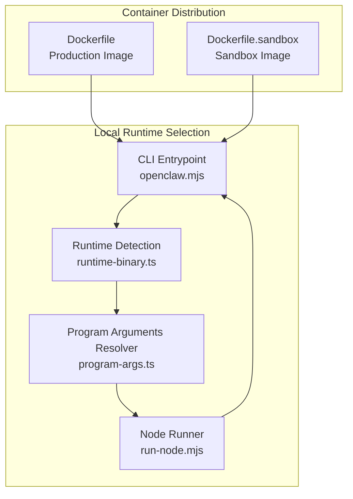
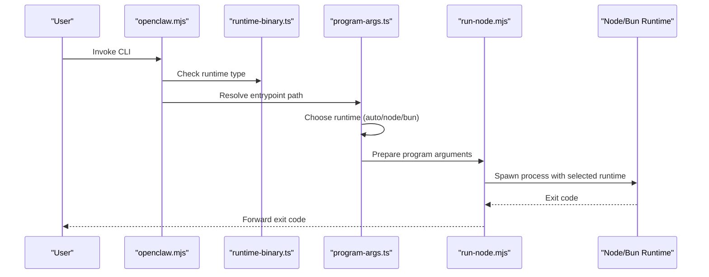
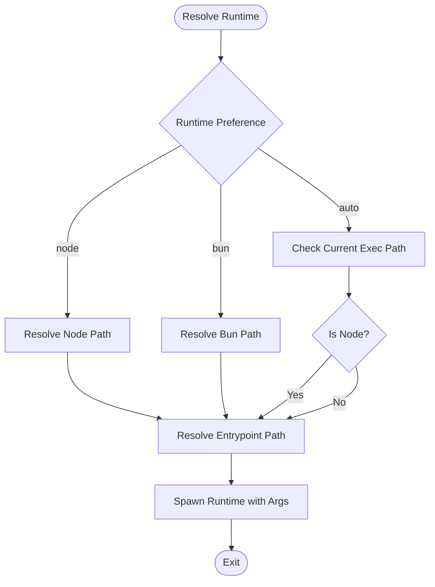
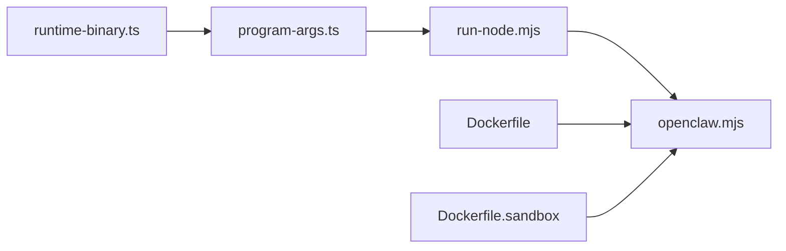

# Alternative Runtimes

<cite>
**Referenced Files in This Document**
- [package.json](file://package.json)
- [openclaw.mjs](file://openclaw.mjs)
- [scripts/run-node.mjs](file://scripts/run-node.mjs)
- [src/daemon/runtime-binary.ts](file://src/daemon/runtime-binary.ts)
- [src/daemon/program-args.ts](file://src/daemon/program-args.ts)
- [src/cli/argv.ts](file://src/cli/argv.ts)
- [extensions/matrix/src/matrix/client/runtime.ts](file://extensions/matrix/src/matrix/client/runtime.ts)
- [docs/install/bun.md](file://docs/install/bun.md)
- [docs/install/exe-dev.md](file://docs/install/exe-dev.md)
- [Dockerfile](file://Dockerfile)
- [Dockerfile.sandbox](file://Dockerfile.sandbox)
</cite>

## Table of Contents
1. [Introduction](#introduction)
2. [Project Structure](#project-structure)
3. [Core Components](#core-components)
4. [Architecture Overview](#architecture-overview)
5. [Detailed Component Analysis](#detailed-component-analysis)
6. [Dependency Analysis](#dependency-analysis)
7. [Performance Considerations](#performance-considerations)
8. [Troubleshooting Guide](#troubleshooting-guide)
9. [Conclusion](#conclusion)

## Introduction
This document explains how to operate OpenClaw using alternative runtime environments, focusing on:
- Bun runtime for CLI-only workflows and local development
- Standalone executable distribution and deployment using containerized runtime images

It covers runtime detection, invocation preferences, performance characteristics, compatibility caveats, and practical setup steps for both Bun and container-based distributions.

## Project Structure
OpenClaw exposes a CLI entrypoint that supports multiple runtime choices:
- Node.js (default)
- Bun (experimental for local dev and CLI)
- Container images for production distribution

Key elements:
- The CLI binary is declared in package metadata and points to a JavaScript entrypoint
- The entrypoint validates Node.js minimum version and delegates to compiled runtime code
- A Node runner script orchestrates builds, stamps, and process spawning
- Runtime selection logic chooses Node or Bun based on preference and environment
- Dockerfiles define production-ready runtime images

**Diagram sources**
- [openclaw.mjs:1-90](file://openclaw.mjs#L1-L90)
- [src/daemon/runtime-binary.ts:1-25](file://src/daemon/runtime-binary.ts#L1-L25)
- [src/daemon/program-args.ts:162-233](file://src/daemon/program-args.ts#L162-L233)
- [scripts/run-node.mjs:306-357](file://scripts/run-node.mjs#L306-L357)
- [Dockerfile:224-250](file://Dockerfile#L224-L250)
- [Dockerfile.sandbox:1-25](file://Dockerfile.sandbox#L1-L25)

**Section sources**
- [package.json:16-18](file://package.json#L16-L18)
- [openclaw.mjs:1-90](file://openclaw.mjs#L1-L90)
- [scripts/run-node.mjs:1-367](file://scripts/run-node.mjs#L1-L367)
- [src/daemon/runtime-binary.ts:1-25](file://src/daemon/runtime-binary.ts#L1-L25)
- [src/daemon/program-args.ts:1-281](file://src/daemon/program-args.ts#L1-L281)
- [Dockerfile:1-250](file://Dockerfile#L1-L250)
- [Dockerfile.sandbox:1-25](file://Dockerfile.sandbox#L1-L25)

## Core Components
- CLI Entrypoint: Validates Node.js version and loads compiled runtime code, with fallbacks for different distribution formats
- Runtime Detection: Determines whether the current process is Node or Bun
- Program Arguments Resolver: Chooses runtime and prepares arguments for Node or Bun invocation
- Node Runner: Orchestrates build/stamp/sync and spawns the CLI under the selected runtime
- Container Images: Produce minimal runtime images suitable for distribution and deployment

**Section sources**
- [openclaw.mjs:1-90](file://openclaw.mjs#L1-L90)
- [src/daemon/runtime-binary.ts:1-25](file://src/daemon/runtime-binary.ts#L1-L25)
- [src/daemon/program-args.ts:162-233](file://src/daemon/program-args.ts#L162-L233)
- [scripts/run-node.mjs:306-357](file://scripts/run-node.mjs#L306-L357)
- [Dockerfile:224-250](file://Dockerfile#L224-L250)

## Architecture Overview
The runtime architecture supports flexible invocation:
- Auto mode selects the current runtime or falls back to Node
- Node mode forces Node invocation
- Bun mode forces Bun invocation (useful for local dev and CLI)
- Container images embed the Node runtime and expose the CLI binary

**Diagram sources**
- [openclaw.mjs:1-90](file://openclaw.mjs#L1-L90)
- [src/daemon/runtime-binary.ts:1-25](file://src/daemon/runtime-binary.ts#L1-L25)
- [src/daemon/program-args.ts:162-233](file://src/daemon/program-args.ts#L162-L233)
- [scripts/run-node.mjs:306-357](file://scripts/run-node.mjs#L306-L357)

## Detailed Component Analysis

### Bun Runtime Usage (CLI-only)
Bun can be used for local development and CLI operations. It is experimental and not recommended for all channels (e.g., WhatsApp/Telegram) in gateway mode. The repository documents lifecycle script caveats and provides guidance for trust and lockfile behavior.

Key capabilities:
- Run TypeScript directly with Bun
- Use Bun watch for rapid iteration
- Trust specific lifecycle scripts when needed

Compatibility and caveats:
- Some scripts hardcode pnpm (e.g., docs build, UI tasks)
- Lifecycle scripts may be blocked by default; explicit trust may be required

Setup and usage:
- Install dependencies with Bun
- Build and test using Bun scripts
- Trust problematic lifecycle scripts if encountered

**Section sources**
- [docs/install/bun.md:1-60](file://docs/install/bun.md#L1-L60)

### Runtime Selection and Invocation
The program arguments resolver supports three runtime preferences:
- auto: detect current runtime or fall back to Node
- node: force Node invocation
- bun: force Bun invocation

Behavior highlights:
- Resolves CLI entrypoint path across multiple locations
- Detects Node/Bun runtime from exec path
- Supports dev mode with direct TypeScript entrypoint
- Throws helpful errors when required binaries are missing

**Diagram sources**
- [src/daemon/program-args.ts:162-233](file://src/daemon/program-args.ts#L162-L233)
- [src/daemon/runtime-binary.ts:1-25](file://src/daemon/runtime-binary.ts#L1-L25)

**Section sources**
- [src/daemon/program-args.ts:10-281](file://src/daemon/program-args.ts#L10-L281)
- [src/daemon/runtime-binary.ts:1-25](file://src/daemon/runtime-binary.ts#L1-L25)

### Node Runner and Build Orchestration
The Node runner coordinates:
- Determining whether a rebuild is needed
- Running the build pipeline
- Synchronizing runtime artifacts
- Spawning the CLI under the selected runtime

It also writes a build stamp to track freshness and supports environment overrides.

**Section sources**
- [scripts/run-node.mjs:1-367](file://scripts/run-node.mjs#L1-L367)

### CLI Entrypoint and Version Checks
The CLI entrypoint enforces a minimum Node.js version and enables compile cache when appropriate. It attempts to load compiled entry code with fallbacks and installs a process warning filter early.

**Section sources**
- [openclaw.mjs:1-90](file://openclaw.mjs#L1-L90)

### Platform-Specific Runtime Detection
Runtime detection logic recognizes standard Node and Bun binaries and handles variations in path and casing.

**Section sources**
- [src/daemon/runtime-binary.ts:1-25](file://src/daemon/runtime-binary.ts#L1-L25)

### CLI Flag and Root Option Parsing
CLI argument parsing includes help/version detection and root version alias handling, which can influence runtime behavior in conjunction with runtime preferences.

**Section sources**
- [src/cli/argv.ts:1-69](file://src/cli/argv.ts#L1-L69)

### Matrix Extension Runtime Detection
Matrix extension code includes a helper to detect Bun runtime via process.versions.

**Section sources**
- [extensions/matrix/src/matrix/client/runtime.ts:1-4](file://extensions/matrix/src/matrix/client/runtime.ts#L1-L4)

### Container-Based Distribution and Deployment
Two primary Dockerfiles define runtime images:
- Production image: minimal runtime with CLI binary exposed
- Sandbox image: hardened Debian-based image for agent sandboxing

Additional notes:
- The production image runs as a non-root user and exposes health probes
- The sandbox image installs common tools and runs as an unprivileged user

**Section sources**
- [Dockerfile:1-250](file://Dockerfile#L1-L250)
- [Dockerfile.sandbox:1-25](file://Dockerfile.sandbox#L1-L25)

## Dependency Analysis
The runtime system depends on:
- Runtime detection utilities
- Entrypoint resolution logic
- Build orchestration and artifact synchronization
- Container image definitions for distribution

**Diagram sources**
- [src/daemon/runtime-binary.ts:1-25](file://src/daemon/runtime-binary.ts#L1-L25)
- [src/daemon/program-args.ts:162-233](file://src/daemon/program-args.ts#L162-L233)
- [scripts/run-node.mjs:306-357](file://scripts/run-node.mjs#L306-L357)
- [openclaw.mjs:1-90](file://openclaw.mjs#L1-L90)
- [Dockerfile:224-250](file://Dockerfile#L224-L250)
- [Dockerfile.sandbox:1-25](file://Dockerfile.sandbox#L1-L25)

**Section sources**
- [src/daemon/runtime-binary.ts:1-25](file://src/daemon/runtime-binary.ts#L1-L25)
- [src/daemon/program-args.ts:162-233](file://src/daemon/program-args.ts#L162-L233)
- [scripts/run-node.mjs:306-357](file://scripts/run-node.mjs#L306-L357)
- [openclaw.mjs:1-90](file://openclaw.mjs#L1-L90)
- [Dockerfile:1-250](file://Dockerfile#L1-L250)
- [Dockerfile.sandbox:1-25](file://Dockerfile.sandbox#L1-L25)

## Performance Considerations
- Bun is documented as offering a faster local dev loop for TypeScript execution; however, compatibility caveats apply for certain channels
- Node.js runtime is the default and recommended for production stability
- Container images are optimized for minimal footprint and non-root execution
- Build orchestration uses build stamps and selective rebuilds to minimize startup overhead

[No sources needed since this section provides general guidance]

## Troubleshooting Guide
Common issues and resolutions:
- Node.js version mismatch: The CLI enforces a minimum version; install the required Node.js version and ensure it is active
- Missing runtime binaries: The resolver throws explicit errors when Node or Bun are not found in PATH; install the runtime or adjust PATH
- Lifecycle script blockers with Bun: Trust specific packages if lifecycle scripts are blocked
- Container permissions: Ensure proper ownership of mounted directories for non-root users

**Section sources**
- [openclaw.mjs:21-34](file://openclaw.mjs#L21-L34)
- [src/daemon/program-args.ts:141-160](file://src/daemon/program-args.ts#L141-L160)
- [docs/install/bun.md:43-59](file://docs/install/bun.md#L43-L59)
- [Dockerfile:230-233](file://Dockerfile#L230-L233)

## Conclusion
OpenClaw supports flexible runtime environments:
- Use Bun for faster local CLI workflows with awareness of channel-specific caveats
- Use Node for production stability and broad compatibility
- Distribute via container images for consistent, portable deployments

The runtime selection logic, build orchestration, and container images collectively enable efficient development and reliable distribution across diverse environments.