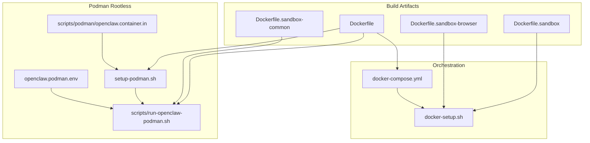
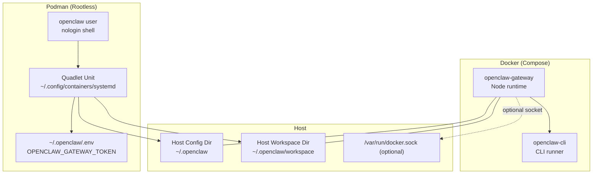
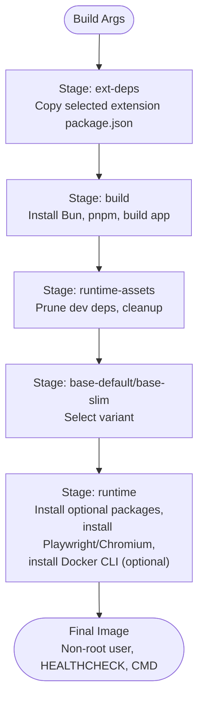
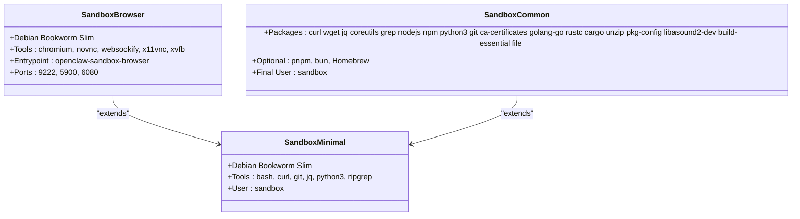
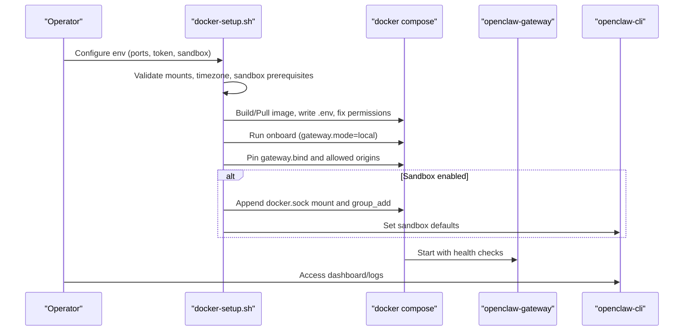
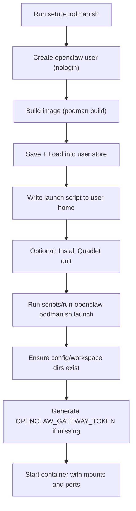
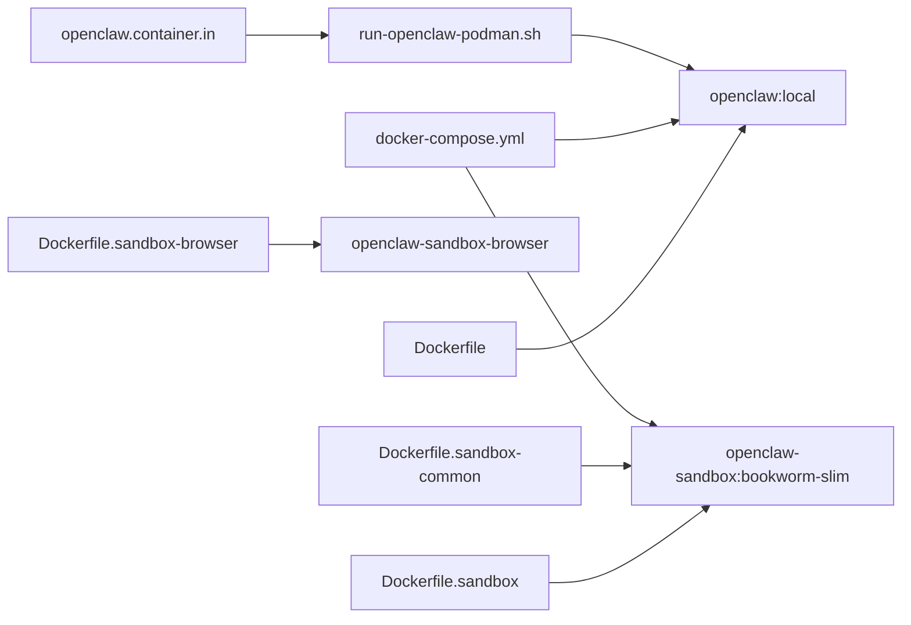

# Container Deployment

<cite>
**Referenced Files in This Document**
- [Dockerfile](file://Dockerfile)
- [Dockerfile.sandbox](file://Dockerfile.sandbox)
- [Dockerfile.sandbox-browser](file://Dockerfile.sandbox-browser)
- [Dockerfile.sandbox-common](file://Dockerfile.sandbox-common)
- [docker-compose.yml](file://docker-compose.yml)
- [docker-setup.sh](file://docker-setup.sh)
- [scripts/run-openclaw-podman.sh](file://scripts/run-openclaw-podman.sh)
- [setup-podman.sh](file://setup-podman.sh)
- [openclaw.podman.env](file://openclaw.podman.env)
- [scripts/podman/openclaw.container.in](file://scripts/podman/openclaw.container.in)
- [docs/install/podman.md](file://docs/install/podman.md)
</cite>

## Table of Contents
1. [Introduction](#introduction)
2. [Project Structure](#project-structure)
3. [Core Components](#core-components)
4. [Architecture Overview](#architecture-overview)
5. [Detailed Component Analysis](#detailed-component-analysis)
6. [Dependency Analysis](#dependency-analysis)
7. [Performance Considerations](#performance-considerations)
8. [Troubleshooting Guide](#troubleshooting-guide)
9. [Conclusion](#conclusion)
10. [Appendices](#appendices)

## Introduction
This document explains how to deploy OpenClaw in containers using Docker and Podman. It covers building the Docker image, orchestrating services with docker-compose, and setting up rootless Podman containers. It also documents persistent storage via bind mounts, environment variable configuration, network exposure, sandbox container variants for development/testing, security hardening, resource allocation, scaling, and troubleshooting.

## Project Structure
OpenClaw provides:
- A multi-stage Dockerfile for the main runtime image
- Sandbox variants for isolated tool execution
- A docker-compose stack for orchestrated deployment
- Scripts and templates for Podman rootless deployment

**Diagram sources**
- [Dockerfile:1-250](file://Dockerfile#L1-L250)
- [Dockerfile.sandbox:1-25](file://Dockerfile.sandbox#L1-L25)
- [Dockerfile.sandbox-browser:1-36](file://Dockerfile.sandbox-browser#L1-L36)
- [Dockerfile.sandbox-common:1-49](file://Dockerfile.sandbox-common#L1-L49)
- [docker-compose.yml:1-79](file://docker-compose.yml#L1-L79)
- [docker-setup.sh:1-617](file://docker-setup.sh#L1-L617)
- [setup-podman.sh:1-313](file://setup-podman.sh#L1-L313)
- [scripts/run-openclaw-podman.sh:1-232](file://scripts/run-openclaw-podman.sh#L1-L232)
- [openclaw.podman.env:1-25](file://openclaw.podman.env#L1-L25)
- [scripts/podman/openclaw.container.in:1-29](file://scripts/podman/openclaw.container.in#L1-L29)

**Section sources**
- [Dockerfile:1-250](file://Dockerfile#L1-L250)
- [docker-compose.yml:1-79](file://docker-compose.yml#L1-L79)
- [docker-setup.sh:1-617](file://docker-setup.sh#L1-L617)
- [setup-podman.sh:1-313](file://setup-podman.sh#L1-L313)
- [scripts/run-openclaw-podman.sh:1-232](file://scripts/run-openclaw-podman.sh#L1-L232)
- [openclaw.podman.env:1-25](file://openclaw.podman.env#L1-L25)
- [scripts/podman/openclaw.container.in:1-29](file://scripts/podman/openclaw.container.in#L1-L29)

## Core Components
- Main runtime image: multi-stage build with Node base, optional browser tooling, and a non-root runtime user
- Sandbox images: minimal Debian-based images for isolated tool execution; optionally with a browser stack
- Orchestration: docker-compose with gateway and CLI services, health checks, and optional sandbox socket mount
- Podman rootless: one-time setup to create a non-login user, build/load the image, and run via a launch script or Quadlet

Key capabilities:
- Persistent storage via bind mounts for configuration and workspace
- Environment-driven configuration (tokens, ports, timezone, provider keys)
- Health probes for readiness/liveness
- Optional sandboxing with Docker socket delegation for tool sandboxes

**Section sources**
- [Dockerfile:102-250](file://Dockerfile#L102-L250)
- [Dockerfile.sandbox:1-25](file://Dockerfile.sandbox#L1-L25)
- [Dockerfile.sandbox-browser:1-36](file://Dockerfile.sandbox-browser#L1-L36)
- [Dockerfile.sandbox-common:1-49](file://Dockerfile.sandbox-common#L1-L49)
- [docker-compose.yml:1-79](file://docker-compose.yml#L1-L79)
- [docker-setup.sh:498-605](file://docker-setup.sh#L498-L605)
- [setup-podman.sh:1-313](file://setup-podman.sh#L1-L313)
- [scripts/run-openclaw-podman.sh:1-232](file://scripts/run-openclaw-podman.sh#L1-L232)

## Architecture Overview
The containerized deployment centers on the gateway service, with optional CLI service and sandbox containers. Docker Compose manages the stack; Podman rootless uses a launch script or Quadlet.

**Diagram sources**
- [docker-compose.yml:1-79](file://docker-compose.yml#L1-L79)
- [Dockerfile:139-250](file://Dockerfile#L139-L250)
- [setup-podman.sh:1-313](file://setup-podman.sh#L1-L313)
- [scripts/run-openclaw-podman.sh:1-232](file://scripts/run-openclaw-podman.sh#L1-L232)
- [openclaw.podman.env:1-25](file://openclaw.podman.env#L1-L25)
- [scripts/podman/openclaw.container.in:1-29](file://scripts/podman/openclaw.container.in#L1-L29)

## Detailed Component Analysis

### Docker Image Build
- Multi-stage build with extension dependency extraction, Node-based build, and runtime pruning
- Runtime variants: default vs slim Debian Bookworm base images
- Optional additions:
  - System packages via build arg
  - Pre-installed Chromium/Xvfb for browser automation
  - Docker CLI for sandbox container management
- Non-root runtime user and health checks

**Diagram sources**
- [Dockerfile:1-250](file://Dockerfile#L1-L250)

**Section sources**
- [Dockerfile:1-250](file://Dockerfile#L1-L250)

### Sandbox Container Variants
- Minimal sandbox: Debian slim with common tools and a sandbox user
- Browser sandbox: adds Chromium, VNC/noVNC/websockify, Xvfb for headless browser testing
- Common sandbox: shared build steps for additional toolchains (pnpm, bun, Homebrew)

**Diagram sources**
- [Dockerfile.sandbox:1-25](file://Dockerfile.sandbox#L1-L25)
- [Dockerfile.sandbox-browser:1-36](file://Dockerfile.sandbox-browser#L1-L36)
- [Dockerfile.sandbox-common:1-49](file://Dockerfile.sandbox-common#L1-L49)

**Section sources**
- [Dockerfile.sandbox:1-25](file://Dockerfile.sandbox#L1-L25)
- [Dockerfile.sandbox-browser:1-36](file://Dockerfile.sandbox-browser#L1-L36)
- [Dockerfile.sandbox-common:1-49](file://Dockerfile.sandbox-common#L1-L49)

### Docker Compose Orchestration
- Services: gateway and CLI
- Persistence: bind mounts for config and workspace
- Ports: gateway and bridge mapped to host
- Optional: Docker socket mount for sandbox containers
- Health checks: liveness/readiness probes
- Security: capability drops and no-new-privileges

**Diagram sources**
- [docker-setup.sh:1-617](file://docker-setup.sh#L1-L617)
- [docker-compose.yml:1-79](file://docker-compose.yml#L1-L79)

**Section sources**
- [docker-compose.yml:1-79](file://docker-compose.yml#L1-L79)
- [docker-setup.sh:1-617](file://docker-setup.sh#L1-L617)

### Podman Rootless Setup
- One-time setup:
  - Creates a non-login user for the gateway
  - Builds the image and loads it into the user’s Podman store
  - Installs a launch script and optionally a Quadlet systemd unit
- Runtime:
  - Launch script ensures proper ownership, generates tokens, and starts the container
  - Supports SELinux mount labeling and user namespace alignment
  - Optional systemd Quadlet for auto-start and restarts

**Diagram sources**
- [setup-podman.sh:1-313](file://setup-podman.sh#L1-L313)
- [scripts/run-openclaw-podman.sh:1-232](file://scripts/run-openclaw-podman.sh#L1-L232)
- [openclaw.podman.env:1-25](file://openclaw.podman.env#L1-L25)
- [scripts/podman/openclaw.container.in:1-29](file://scripts/podman/openclaw.container.in#L1-L29)

**Section sources**
- [setup-podman.sh:1-313](file://setup-podman.sh#L1-L313)
- [scripts/run-openclaw-podman.sh:1-232](file://scripts/run-openclaw-podman.sh#L1-L232)
- [openclaw.podman.env:1-25](file://openclaw.podman.env#L1-L25)
- [scripts/podman/openclaw.container.in:1-29](file://scripts/podman/openclaw.container.in#L1-L29)
- [docs/install/podman.md:1-123](file://docs/install/podman.md#L1-L123)

## Dependency Analysis
- Images depend on Debian Bookworm base images pinned by digest
- Sandbox images depend on the common sandbox base
- Compose depends on environment variables for ports, token, and sandbox
- Podman depends on user namespaces and optional Quadlet for systemd integration

**Diagram sources**
- [Dockerfile:1-250](file://Dockerfile#L1-L250)
- [Dockerfile.sandbox:1-25](file://Dockerfile.sandbox#L1-L25)
- [Dockerfile.sandbox-browser:1-36](file://Dockerfile.sandbox-browser#L1-L36)
- [Dockerfile.sandbox-common:1-49](file://Dockerfile.sandbox-common#L1-L49)
- [docker-compose.yml:1-79](file://docker-compose.yml#L1-L79)
- [scripts/run-openclaw-podman.sh:1-232](file://scripts/run-openclaw-podman.sh#L1-L232)
- [scripts/podman/openclaw.container.in:1-29](file://scripts/podman/openclaw.container.in#L1-L29)

**Section sources**
- [Dockerfile:1-250](file://Dockerfile#L1-L250)
- [docker-compose.yml:1-79](file://docker-compose.yml#L1-L79)
- [scripts/run-openclaw-podman.sh:1-232](file://scripts/run-openclaw-podman.sh#L1-L232)

## Performance Considerations
- Image build caching: pnpm cache and apt caches are mounted to speed up builds
- Memory tuning: build-time Node heap limit is set to reduce OOM risk on small hosts
- Optional preinstallation: Chromium and Playwright reduce cold-start latency for browser automation
- Runtime pruning: dev dependencies removed in final image to minimize size and attack surface

Recommendations:
- Use slim base image for constrained environments
- Pin digests for deterministic builds
- Cache apt and package manager caches on CI runners
- Provision sufficient CPU/memory for concurrent agents and channels

**Section sources**
- [Dockerfile:66-94](file://Dockerfile#L66-L94)
- [Dockerfile:132-174](file://Dockerfile#L132-L174)
- [Dockerfile:181-190](file://Dockerfile#L181-L190)

## Troubleshooting Guide
Common issues and resolutions:

- Port conflicts
  - Change host port mappings via environment variables before starting the gateway
  - Verify no other service occupies the mapped ports

- Volume permission problems
  - Ensure host directories are writable by the container’s node user
  - Use the provided setup scripts to fix ownership

- Token or auth issues
  - Generate or set OPENCLAW_GATEWAY_TOKEN in the environment file
  - Confirm the token is present in the environment passed to the container

- Sandbox not working
  - Confirm Docker CLI is installed in the runtime image (build arg)
  - Ensure the Docker socket is accessible and mounted (only when sandbox is enabled)
  - Verify sandbox defaults were applied and the gateway restarted

- SELinux mount issues (Podman)
  - The launch script detects enforcing/permissive modes and applies relabeling options automatically
  - If manual mounts are used, append the appropriate relabel option

- Quadlet service not starting
  - Ensure cgroups v2 is available
  - Reload systemd units after editing the Quadlet file
  - Enable lingering for the openclaw user to allow rootless containers to start without login

- Health checks failing
  - Confirm gateway bind and allowed origins are configured for external access
  - Check readiness endpoint availability and token validity

**Section sources**
- [docker-setup.sh:449-464](file://docker-setup.sh#L449-L464)
- [docker-setup.sh:516-525](file://docker-setup.sh#L516-L525)
- [scripts/run-openclaw-podman.sh:186-200](file://scripts/run-openclaw-podman.sh#L186-L200)
- [docs/install/podman.md:111-119](file://docs/install/podman.md#L111-L119)

## Conclusion
OpenClaw offers a robust, secure, and flexible containerized deployment story:
- Use Docker Compose for orchestrated deployments with optional sandbox isolation
- Use Podman rootless for user-mode containers with systemd integration
- Persist configuration and workspace via bind mounts, secure the runtime with non-root execution, and tune performance with optional preinstalled tooling
- Follow the provided scripts and templates to streamline setup, scaling, and troubleshooting

## Appendices

### Environment Variables Reference
- Gateway token and optional provider keys
- Port mappings and bind mode
- Optional timezone and sandbox toggles

**Section sources**
- [docker-compose.yml:4-12](file://docker-compose.yml#L4-L12)
- [docker-compose.yml:60-69](file://docker-compose.yml#L60-L69)
- [openclaw.podman.env:1-25](file://openclaw.podman.env#L1-L25)
- [scripts/run-openclaw-podman.sh:103-104](file://scripts/run-openclaw-podman.sh#L103-L104)

### Network and Exposure
- Default bind to loopback for security; override to LAN with appropriate CORS/allowed origins
- Health endpoints for probes
- Optional host networking for development scenarios

**Section sources**
- [Dockerfile:235-248](file://Dockerfile#L235-L248)
- [docker-compose.yml:39-50](file://docker-compose.yml#L39-L50)
- [docker-setup.sh:102-124](file://docker-setup.sh#L102-L124)