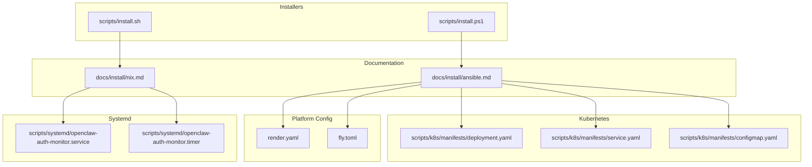
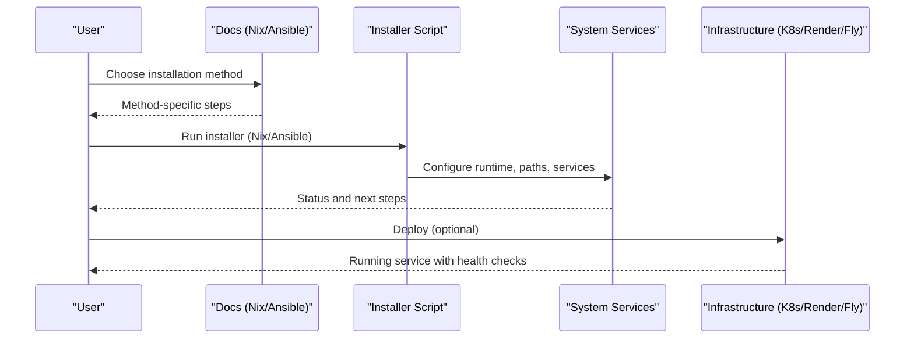
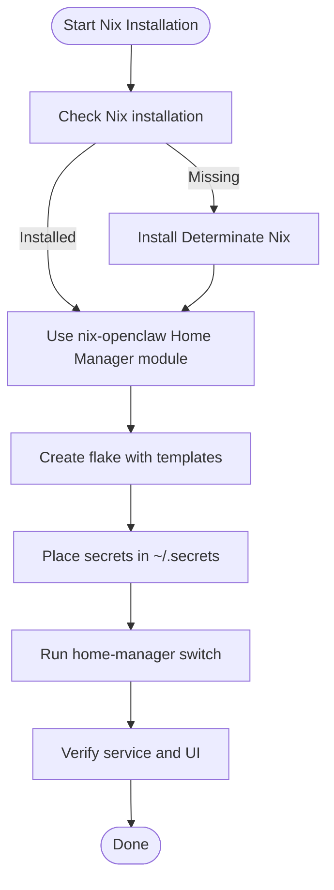
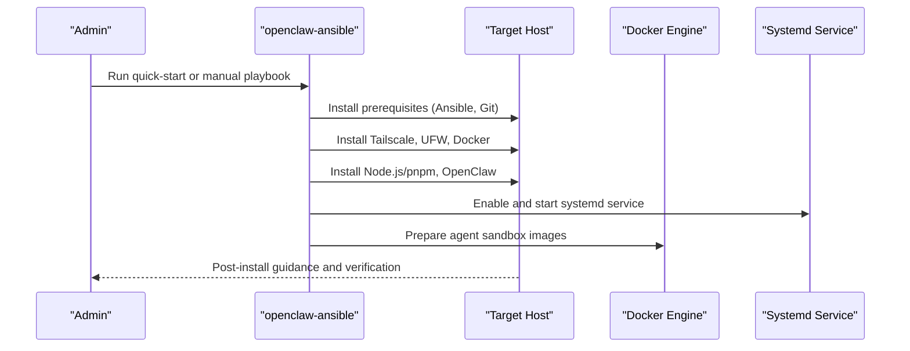
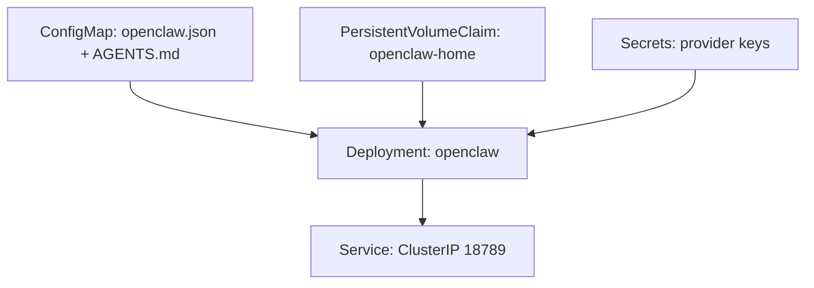
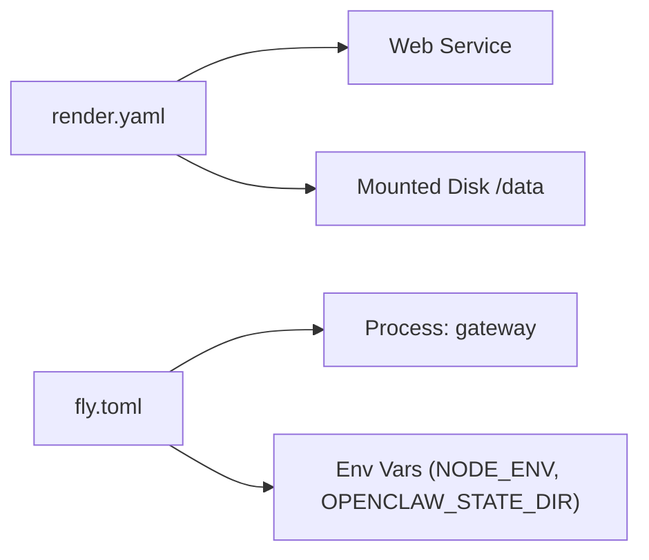
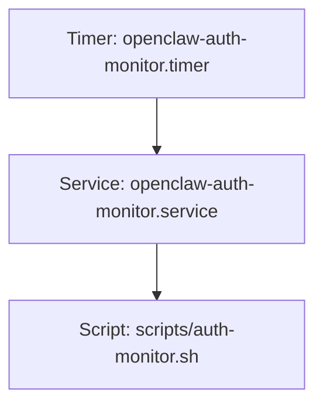
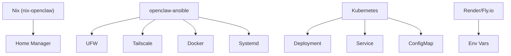

# Declarative Installation

<cite>
**Referenced Files in This Document**
- [nix.md](file://docs/install/nix.md)
- [ansible.md](file://docs/install/ansible.md)
- [install.sh](file://scripts/install.sh)
- [install.ps1](file://scripts/install.ps1)
- [deployment.yaml](file://scripts/k8s/manifests/deployment.yaml)
- [service.yaml](file://scripts/k8s/manifests/service.yaml)
- [configmap.yaml](file://scripts/k8s/manifests/configmap.yaml)
- [render.yaml](file://render.yaml)
- [fly.toml](file://fly.toml)
- [openclaw-auth-monitor.service](file://scripts/systemd/openclaw-auth-monitor.service)
- [openclaw-auth-monitor.timer](file://scripts/systemd/openclaw-auth-monitor.timer)
- [normalize-paths.ts](file://src/config/normalize-paths.ts)
- [test-helpers.mocks.ts](file://src/gateway/test-helpers.mocks.ts)
</cite>

## Table of Contents
1. [Introduction](#introduction)
2. [Project Structure](#project-structure)
3. [Core Components](#core-components)
4. [Architecture Overview](#architecture-overview)
5. [Detailed Component Analysis](#detailed-component-analysis)
6. [Dependency Analysis](#dependency-analysis)
7. [Performance Considerations](#performance-considerations)
8. [Troubleshooting Guide](#troubleshooting-guide)
9. [Conclusion](#conclusion)
10. [Appendices](#appendices)

## Introduction
This document explains declarative installation methods for OpenClaw with a focus on:
- Nix: reproducible, rollback-capable environments using flakes and Home Manager
- Ansible: automated, hardened fleet deployment with security-first architecture

It covers infrastructure-as-code principles, configuration management, system integration, and practical examples for customizing installations. It also includes troubleshooting guidance for common declarative installation issues.

## Project Structure
The repository provides:
- Documentation for Nix and Ansible installation flows
- Scripts for platform-specific installation and system integration
- Kubernetes manifests for containerized deployments
- Platform-specific configuration files for Render and Fly.io
- Systemd unit files for long-running services

**Diagram sources**
- [nix.md:1-99](file://docs/install/nix.md#L1-L99)
- [ansible.md:1-209](file://docs/install/ansible.md#L1-L209)
- [install.sh:1-800](file://scripts/install.sh#L1-L800)
- [install.ps1:1-360](file://scripts/install.ps1#L1-L360)
- [deployment.yaml:1-147](file://scripts/k8s/manifests/deployment.yaml#L1-L147)
- [service.yaml:1-16](file://scripts/k8s/manifests/service.yaml#L1-L16)
- [configmap.yaml:1-39](file://scripts/k8s/manifests/configmap.yaml#L1-L39)
- [render.yaml:1-22](file://render.yaml#L1-L22)
- [fly.toml:1-35](file://fly.toml#L1-L35)
- [openclaw-auth-monitor.service:1-15](file://scripts/systemd/openclaw-auth-monitor.service#L1-L15)
- [openclaw-auth-monitor.timer:1-11](file://scripts/systemd/openclaw-auth-monitor.timer#L1-L11)

**Section sources**
- [nix.md:1-99](file://docs/install/nix.md#L1-L99)
- [ansible.md:1-209](file://docs/install/ansible.md#L1-L209)

## Core Components
- Nix-based installation via nix-openclaw (Home Manager module) for deterministic, rollback-capable setups
- Ansible-based production deployment with firewall, VPN, Docker isolation, and systemd hardening
- Kubernetes manifests for containerized deployments with init containers, probes, and secrets
- Platform-as-a-Service configurations for Render and Fly.io
- Systemd units for long-running tasks and periodic monitoring

**Section sources**
- [nix.md:10-99](file://docs/install/nix.md#L10-L99)
- [ansible.md:10-209](file://docs/install/ansible.md#L10-L209)
- [deployment.yaml:1-147](file://scripts/k8s/manifests/deployment.yaml#L1-L147)
- [configmap.yaml:1-39](file://scripts/k8s/manifests/configmap.yaml#L1-L39)
- [render.yaml:1-22](file://render.yaml#L1-L22)
- [fly.toml:1-35](file://fly.toml#L1-L35)
- [openclaw-auth-monitor.service:1-15](file://scripts/systemd/openclaw-auth-monitor.service#L1-L15)
- [openclaw-auth-monitor.timer:1-11](file://scripts/systemd/openclaw-auth-monitor.timer#L1-L11)

## Architecture Overview
High-level flows for declarative installation:

[No sources needed since this diagram shows conceptual workflow, not actual code structure]

## Detailed Component Analysis

### Nix Installation
Nix enables reproducible, rollback-capable environments. The recommended approach uses nix-openclaw (Home Manager module) with:
- Deterministic pinning of dependencies
- Launchd service persistence
- Declarative plugin configuration
- Rollbacks via home-manager switch --rollback

Key behaviors:
- Nix mode disables auto-install/self-mutation and surfaces remediation messages
- Configuration and state paths are explicit and separate from the immutable store
- macOS packaging uses a deterministic Info.plist template for reproducibility

**Diagram sources**
- [nix.md:14-43](file://docs/install/nix.md#L14-L43)

Practical notes:
- Set OPENCLAW_NIX_MODE=1 or use macOS defaults to enable Nix mode
- Explicitly set OPENCLAW_CONFIG_PATH and OPENCLAW_STATE_DIR to Nix-managed locations
- Use the nix-openclaw repository for module options and advanced configuration

**Section sources**
- [nix.md:10-99](file://docs/install/nix.md#L10-L99)

### Ansible Fleet Deployment
The openclaw-ansible repository automates production-grade deployment with:
- Firewall-first security (UFW), Tailscale VPN, Docker isolation
- Systemd integration with hardening
- One-command setup and idempotent playbook re-runs

**Diagram sources**
- [ansible.md:12-53](file://docs/install/ansible.md#L12-L53)

Operational guidance:
- Use the quick-start script for one-command setup
- Re-run the playbook idempotently for configuration changes
- Verify firewall exposure and service status via systemd and journalctl

**Section sources**
- [ansible.md:10-209](file://docs/install/ansible.md#L10-L209)

### Kubernetes Deployment
Kubernetes manifests define a minimal, secure deployment:
- Init container to seed configuration and workspace
- Single-replica Deployment with liveness/readiness probes
- ConfigMap for default configuration and agent metadata
- Persistent storage for state and workspace
- Secrets injected for provider credentials

**Diagram sources**
- [deployment.yaml:1-147](file://scripts/k8s/manifests/deployment.yaml#L1-L147)
- [service.yaml:1-16](file://scripts/k8s/manifests/service.yaml#L1-L16)
- [configmap.yaml:1-39](file://scripts/k8s/manifests/configmap.yaml#L1-L39)

**Section sources**
- [deployment.yaml:1-147](file://scripts/k8s/manifests/deployment.yaml#L1-L147)
- [service.yaml:1-16](file://scripts/k8s/manifests/service.yaml#L1-L16)
- [configmap.yaml:1-39](file://scripts/k8s/manifests/configmap.yaml#L1-L39)

### Platform-as-a-Service Configurations
- Render: Defines a web service with mounted disk, environment variables, and generated secrets
- Fly.io: Specifies Docker build, environment variables, process configuration, and VM sizing

**Diagram sources**
- [render.yaml:1-22](file://render.yaml#L1-L22)
- [fly.toml:1-35](file://fly.toml#L1-L35)

**Section sources**
- [render.yaml:1-22](file://render.yaml#L1-L22)
- [fly.toml:1-35](file://fly.toml#L1-L35)

### Systemd Integration
Systemd units support long-running tasks and periodic monitoring:
- Service unit executes a monitoring script with environment variables for notifications
- Timer unit triggers the service periodically

**Diagram sources**
- [openclaw-auth-monitor.service:1-15](file://scripts/systemd/openclaw-auth-monitor.service#L1-L15)
- [openclaw-auth-monitor.timer:1-11](file://scripts/systemd/openclaw-auth-monitor.timer#L1-L11)

**Section sources**
- [openclaw-auth-monitor.service:1-15](file://scripts/systemd/openclaw-auth-monitor.service#L1-L15)
- [openclaw-auth-monitor.timer:1-11](file://scripts/systemd/openclaw-auth-monitor.timer#L1-L11)

## Dependency Analysis
Declarative installation components depend on:
- OS and package managers for prerequisite installation
- Container runtimes for sandboxing (when applicable)
- System service managers for persistence and monitoring
- Secret management for provider credentials

**Diagram sources**
- [nix.md:12-43](file://docs/install/nix.md#L12-L43)
- [ansible.md:26-53](file://docs/install/ansible.md#L26-L53)
- [deployment.yaml:1-147](file://scripts/k8s/manifests/deployment.yaml#L1-L147)
- [service.yaml:1-16](file://scripts/k8s/manifests/service.yaml#L1-L16)
- [configmap.yaml:1-39](file://scripts/k8s/manifests/configmap.yaml#L1-L39)
- [render.yaml:1-22](file://render.yaml#L1-L22)
- [fly.toml:1-35](file://fly.toml#L1-L35)

**Section sources**
- [nix.md:10-99](file://docs/install/nix.md#L10-L99)
- [ansible.md:10-209](file://docs/install/ansible.md#L10-L209)

## Performance Considerations
- Prefer deterministic environments (Nix) to avoid drift and reduce troubleshooting time
- Use containerized sandboxes (Docker) to isolate agent execution and limit resource contention
- Configure health checks and probes to ensure fast failure detection and recovery
- Size VMs and containers appropriately; monitor memory and CPU utilization
- Minimize unnecessary rebuilds by pinning versions and leveraging caches

[No sources needed since this section provides general guidance]

## Troubleshooting Guide
Common declarative installation issues and resolutions:

- Nix mode not enabled
  - Ensure OPENCLAW_NIX_MODE=1 or set macOS defaults for Nix mode
  - Verify configuration and state paths are set to Nix-managed locations

- Path resolution and configuration
  - Normalize "~" paths in configuration fields to ensure consistent behavior across config and environment overrides
  - Confirm that OPENCLAW_CONFIG_PATH and OPENCLAW_STATE_DIR are explicitly set in Nix mode

- Service startup failures
  - Check systemd status and journal logs for the service
  - Verify permissions and ownership of state directories
  - Manually start the process as the openclaw user to validate runtime

- Docker sandbox issues
  - Confirm Docker is running and accessible
  - Verify sandbox images exist or rebuild as needed
  - Check container logs for initialization errors

- Provider login failures
  - Ensure commands are executed as the openclaw user
  - Validate that secrets are correctly populated in the configuration

- Firewall and access
  - Confirm UFW rules and Tailscale connectivity
  - Limit external exposure to SSH and Tailscale UDP only

**Section sources**
- [nix.md:46-81](file://docs/install/nix.md#L46-L81)
- [normalize-paths.ts:54-69](file://src/config/normalize-paths.ts#L54-L69)
- [ansible.md:147-194](file://docs/install/ansible.md#L147-L194)
- [openclaw-auth-monitor.service:1-15](file://scripts/systemd/openclaw-auth-monitor.service#L1-L15)
- [openclaw-auth-monitor.timer:1-11](file://scripts/systemd/openclaw-auth-monitor.timer#L1-L11)

## Conclusion
Declarative installation of OpenClaw is achieved through:
- Nix for reproducible, rollback-capable environments with explicit path management
- Ansible for hardened fleet deployments with security-first defaults
- Kubernetes for containerized deployments with init containers and health checks
- Platform configurations for Render and Fly.io
- Systemd for persistent services and periodic monitoring

Adopting these methods ensures infrastructure-as-code compliance, idempotent provisioning, and robust operational practices.

[No sources needed since this section summarizes without analyzing specific files]

## Appendices

### Appendix A: Example Customizations
- Nix
  - Override module options via Home Manager to tailor package versions and plugin configurations
  - Pin OpenClaw to a specific revision for controlled rollouts
- Ansible
  - Extend the playbook to add custom users, firewall rules, or monitoring integrations
  - Parameterize secrets and environment variables for different environments
- Kubernetes
  - Adjust resource requests/limits and replica counts for scale
  - Inject additional environment variables or mounts via ConfigMaps/Secrets
- Render/Fly.io
  - Tune VM sizes and disk allocation based on workload
  - Add environment-specific variables and secrets

[No sources needed since this section provides general guidance]