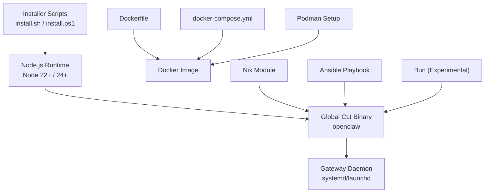
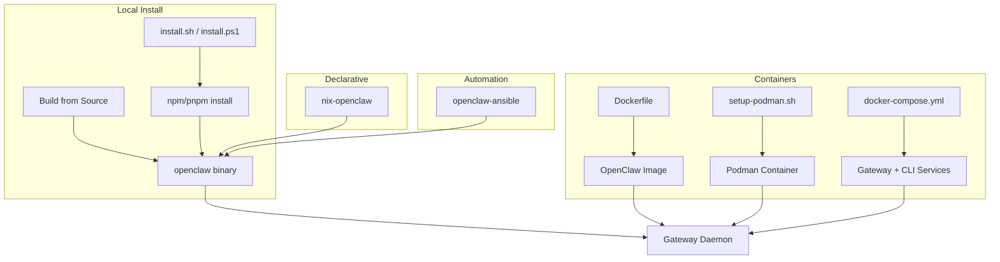
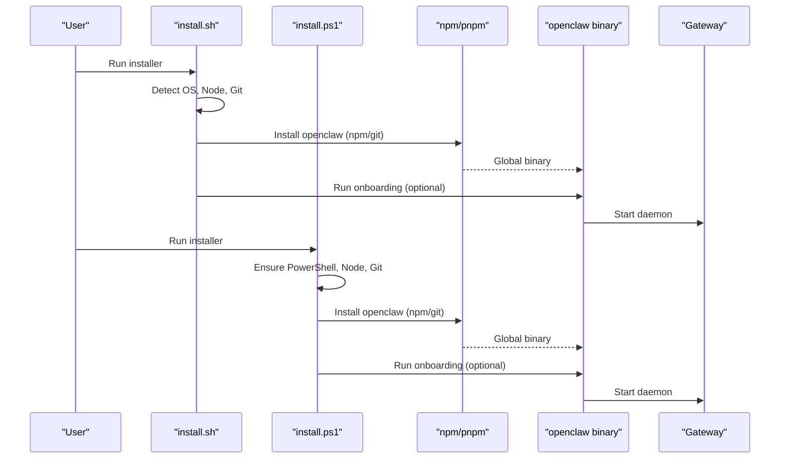
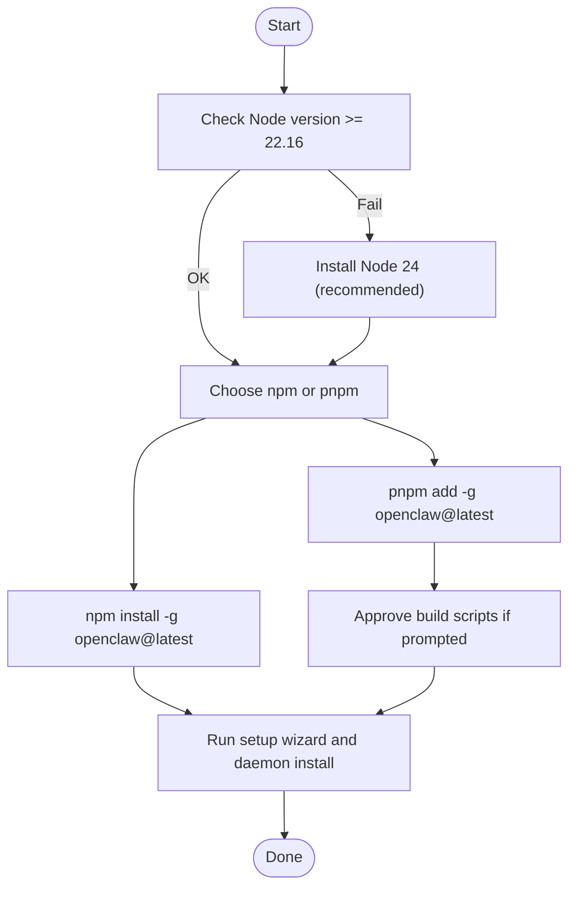
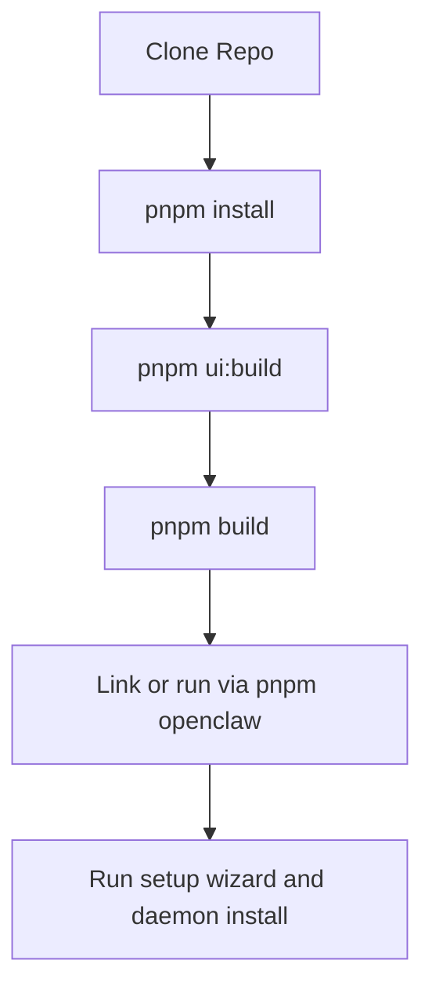
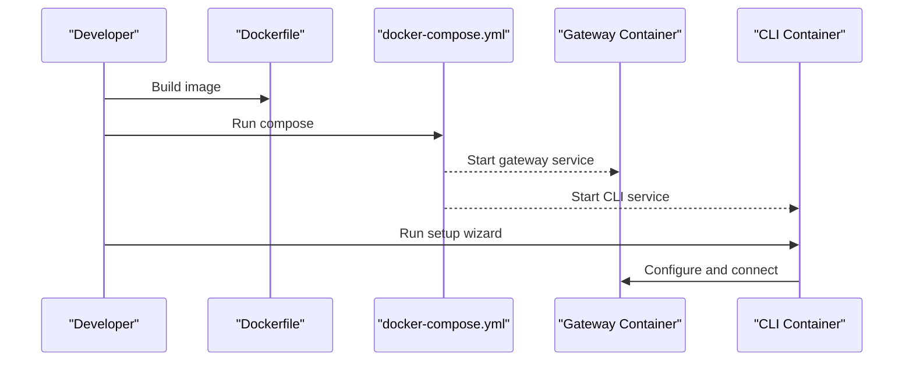
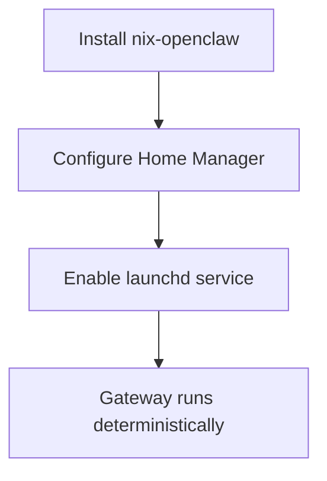
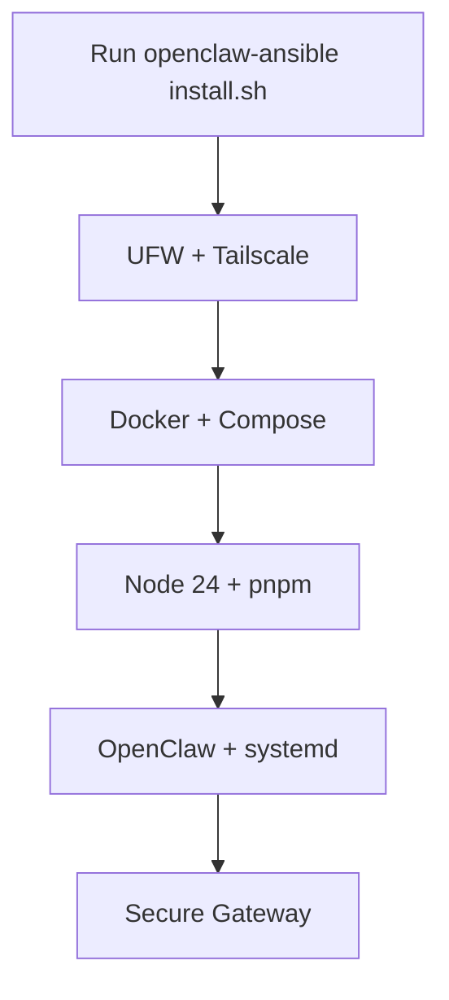
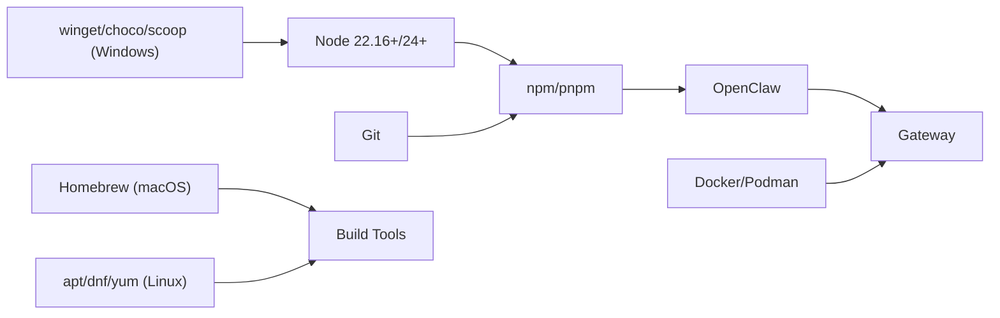

# Installation Methods

<cite>
**Referenced Files in This Document**
- [README.md](file://README.md)
- [install.sh](file://scripts/install.sh)
- [install.ps1](file://scripts/install.ps1)
- [package.json](file://package.json)
- [Dockerfile](file://Dockerfile)
- [docker-compose.yml](file://docker-compose.yml)
- [docker.md](file://docs/install/docker.md)
- [podman.md](file://docs/install/podman.md)
- [nix.md](file://docs/install/nix.md)
- [bun.md](file://docs/install/bun.md)
- [ansible.md](file://docs/install/ansible.md)
- [index.md](file://docs/install/index.md)
- [installer.md](file://docs/install/installer.md)
- [node.md](file://docs/install/node.md)
</cite>

## Table of Contents
1. [Introduction](#introduction)
2. [Project Structure](#project-structure)
3. [Core Components](#core-components)
4. [Architecture Overview](#architecture-overview)
5. [Detailed Component Analysis](#detailed-component-analysis)
6. [Dependency Analysis](#dependency-analysis)
7. [Performance Considerations](#performance-considerations)
8. [Troubleshooting Guide](#troubleshooting-guide)
9. [Conclusion](#conclusion)

## Introduction
This document consolidates all official installation methods for OpenClaw across platforms and deployment models. It covers:
- Installer scripts for macOS, Linux, and Windows
- Package manager installs via npm/pnpm
- Building from source
- Containerized deployments with Docker and Podman
- Declarative installation with Nix
- Automation with Ansible
- Experimental Bun usage
- Environment variables, system requirements, and troubleshooting

## Project Structure
OpenClaw provides a unified CLI and runtime with multiple installation pathways. The repository includes:
- Installer scripts for Unix-like and Windows environments
- A Node.js-based package definition and scripts
- Container images and orchestration manifests
- Comprehensive installation documentation

**Diagram sources**
- [install.sh:1-80](file://scripts/install.sh#L1-L80)
- [install.ps1:1-60](file://scripts/install.ps1#L1-L60)
- [package.json:16-18](file://package.json#L16-L18)
- [Dockerfile:1-40](file://Dockerfile#L1-L40)
- [docker-compose.yml:1-40](file://docker-compose.yml#L1-L40)
- [podman.md:1-40](file://docs/install/podman.md#L1-L40)
- [nix.md:1-40](file://docs/install/nix.md#L1-L40)
- [ansible.md:1-40](file://docs/install/ansible.md#L1-L40)
- [bun.md:1-40](file://docs/install/bun.md#L1-L40)

**Section sources**
- [README.md:20-35](file://README.md#L20-L35)
- [index.md:10-35](file://docs/install/index.md#L10-L35)

## Core Components
- Installer scripts:
  - install.sh: macOS/Linux/WSL installer with Node detection, optional Git, npm/git install methods, onboarding, and diagnostics.
  - install.ps1: Windows PowerShell installer with Node/npm/git detection and onboarding.
- Package manager installs:
  - npm/pnpm global installs with Node 22+ (24 recommended).
- Source builds:
  - pnpm install, UI build, and build steps to produce a runnable CLI.
- Containers:
  - Dockerfile multi-stage build and docker-compose orchestration.
  - Podman setup and systemd Quadlet integration.
- Declarative installs:
  - Nix module with pinned versions and Nix mode behavior.
- Automation:
  - Ansible playbook for hardened server deployment.
- Runtime:
  - Bun experimental usage for local TypeScript execution.

**Section sources**
- [install.sh:1-120](file://scripts/install.sh#L1-L120)
- [install.ps1:1-120](file://scripts/install.ps1#L1-L120)
- [package.json:16-18](file://package.json#L16-L18)
- [Dockerfile:1-120](file://Dockerfile#L1-L120)
- [docker-compose.yml:1-40](file://docker-compose.yml#L1-L40)
- [nix.md:10-40](file://docs/install/nix.md#L10-L40)
- [ansible.md:10-40](file://docs/install/ansible.md#L10-L40)
- [bun.md:9-40](file://docs/install/bun.md#L9-L40)

## Architecture Overview
The installation ecosystem supports both local and containerized deployments. The diagram below maps the primary installation paths to their outputs and runtime behavior.

**Diagram sources**
- [install.sh:60-120](file://scripts/install.sh#L60-L120)
- [install.ps1:200-260](file://scripts/install.ps1#L200-L260)
- [Dockerfile:39-120](file://Dockerfile#L39-L120)
- [docker-compose.yml:1-40](file://docker-compose.yml#L1-L40)
- [podman.md:17-50](file://docs/install/podman.md#L17-L50)
- [nix.md:10-40](file://docs/install/nix.md#L10-L40)
- [ansible.md:10-40](file://docs/install/ansible.md#L10-L40)

## Detailed Component Analysis

### Installer Script Approach (macOS, Linux, Windows)
- install.sh (Unix-like):
  - Detects OS, ensures Node 24 (fallback to Node 22 LTS), installs Git if missing, chooses npm or git install method, optionally runs onboarding, and performs diagnostics.
  - Supports flags for method selection, version/tag, onboarding toggles, dry-run, verbosity, and environment variables for automation.
- install.ps1 (Windows):
  - Ensures PowerShell, Node 24 (fallback to Node 22 LTS), optional Git, npm or git install method, onboarding, and PATH adjustments.

**Diagram sources**
- [install.sh:67-120](file://scripts/install.sh#L67-L120)
- [install.ps1:253-269](file://scripts/install.ps1#L253-L269)

**Section sources**
- [install.sh:67-120](file://scripts/install.sh#L67-L120)
- [install.sh:131-169](file://scripts/install.sh#L131-L169)
- [install.ps1:253-269](file://scripts/install.ps1#L253-L269)
- [installer.md:61-129](file://docs/install/installer.md#L61-L129)
- [installer.md:251-307](file://docs/install/installer.md#L251-L307)

### npm/pnpm Package Manager Installations
- Node requirement: Node 22.16+ (Node 24 recommended).
- npm:
  - Global install with optional SHARP_IGNORE_GLOBAL_LIBVIPS workaround for libvips conflicts.
- pnpm:
  - Requires explicit approval for packages with build scripts after encountering Ignored build scripts warning.

**Diagram sources**
- [node.md:10-25](file://docs/install/node.md#L10-L25)
- [index.md:72-114](file://docs/install/index.md#L72-L114)

**Section sources**
- [node.md:10-25](file://docs/install/node.md#L10-L25)
- [index.md:72-114](file://docs/install/index.md#L72-L114)

### Source Code Compilation from GitHub Repositories
- Clone the repository and build:
  - pnpm install
  - pnpm ui:build
  - pnpm build
- Link globally or run via pnpm openclaw ...

**Diagram sources**
- [index.md:117-146](file://docs/install/index.md#L117-L146)

**Section sources**
- [index.md:117-146](file://docs/install/index.md#L117-L146)

### Containerized Deployments (Docker and Podman)
- Docker:
  - Multi-stage Dockerfile builds a minimal runtime image, installs system utilities, and exposes health checks.
  - docker-compose orchestrates gateway and CLI services, with optional sandbox and extra mounts.
- Podman:
  - setup-podman.sh creates a dedicated user, builds the image, and provides a launch script.
  - Optional systemd Quadlet integration for user services.

**Diagram sources**
- [Dockerfile:39-120](file://Dockerfile#L39-L120)
- [docker-compose.yml:1-40](file://docker-compose.yml#L1-L40)
- [docker.md:35-84](file://docs/install/docker.md#L35-L84)

**Section sources**
- [Dockerfile:1-120](file://Dockerfile#L1-L120)
- [docker-compose.yml:1-40](file://docker-compose.yml#L1-L40)
- [docker.md:35-84](file://docs/install/docker.md#L35-L84)
- [podman.md:17-50](file://docs/install/podman.md#L17-L50)

### Nix Declarative Installation
- Use nix-openclaw for a Home Manager module with pinned versions, launchd service, and rollback capability.
- Nix mode disables auto-install flows and requires explicit config/state paths.

**Diagram sources**
- [nix.md:10-40](file://docs/install/nix.md#L10-L40)

**Section sources**
- [nix.md:10-40](file://docs/install/nix.md#L10-L40)

### Ansible Automation
- One-command installer for Debian/Ubuntu servers with Tailscale VPN, UFW firewall, Docker, Node 24, and systemd service.
- Gateway runs on host; agent sandboxes use Docker for isolation.

**Diagram sources**
- [ansible.md:10-50](file://docs/install/ansible.md#L10-L50)

**Section sources**
- [ansible.md:10-50](file://docs/install/ansible.md#L10-L50)

### Bun Runtime Usage (Experimental)
- Optional local runtime for TypeScript execution; not recommended for production due to channel-specific issues.
- Some lifecycle scripts may be blocked by default and require explicit trust.

**Section sources**
- [bun.md:9-60](file://docs/install/bun.md#L9-L60)

## Dependency Analysis
- Runtime dependencies:
  - Node 22.16+ (Node 24 recommended)
  - npm/pnpm for package management
  - Git for npm installs and source builds
- Container dependencies:
  - Docker/Podman engine and Compose
  - Optional Docker CLI in image for sandboxing
- OS-specific tooling:
  - macOS: Homebrew for tools
  - Linux: distro package managers for build tools
  - Windows: Node via winget/choco/scoop

**Diagram sources**
- [node.md:10-25](file://docs/install/node.md#L10-L25)
- [install.sh:569-621](file://scripts/install.sh#L569-L621)
- [install.ps1:102-149](file://scripts/install.ps1#L102-L149)

**Section sources**
- [node.md:10-25](file://docs/install/node.md#L10-L25)
- [install.sh:569-621](file://scripts/install.sh#L569-L621)
- [install.ps1:102-149](file://scripts/install.ps1#L102-L149)

## Performance Considerations
- Container builds:
  - Pin base images and cache dependency layers to speed up rebuilds.
  - Bake optional system packages and Playwright browsers into the image to avoid runtime overhead.
- Local installs:
  - Prefer Node 24 for optimal performance and compatibility.
  - Use pnpm for faster installs and reduced disk usage.
- Sandboxing:
  - Enable agent sandboxing for isolation; tune limits and networks per workload.

[No sources needed since this section provides general guidance]

## Troubleshooting Guide
- Node/npm PATH issues:
  - Ensure npm’s global prefix is on PATH; export PATH accordingly.
- Permission errors on Linux:
  - Switch npm prefix to a user-writable directory.
- sharp/libvips build errors:
  - Use SHARP_IGNORE_GLOBAL_LIBVIPS=1 or install build tools.
- Windows-specific:
  - Execution policy and Git availability; add npm prefix to PATH.
- Container permissions:
  - Ensure host bind mounts are owned by the container user (uid 1000).
- Gateway bind and access:
  - Use loopback vs lan bind modes; configure allowed origins for LAN exposure.

**Section sources**
- [index.md:191-214](file://docs/install/index.md#L191-L214)
- [node.md:89-139](file://docs/install/node.md#L89-L139)
- [installer.md:372-415](file://docs/install/installer.md#L372-L415)
- [docker.md:392-404](file://docs/install/docker.md#L392-L404)
- [docker.md:508-532](file://docs/install/docker.md#L508-L532)

## Conclusion
OpenClaw supports flexible installation paths tailored to different environments and operational needs. The installer scripts streamline setup across platforms, while package managers, containers, Nix, and Ansible enable repeatable, secure deployments. Follow the system requirements, verify environment variables, and consult the troubleshooting section for common issues.