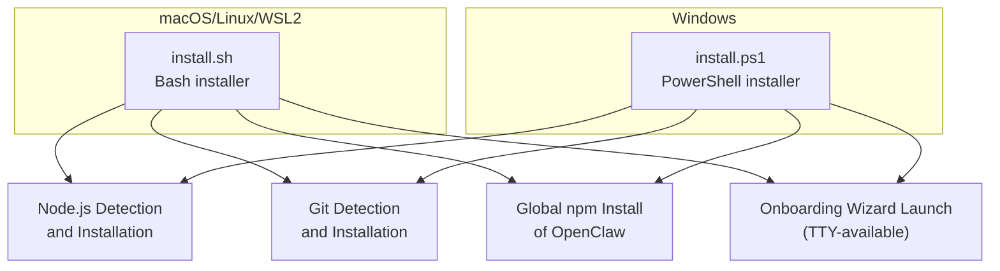
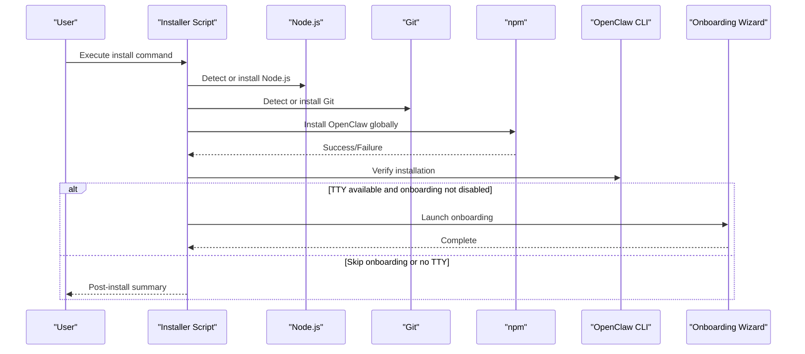
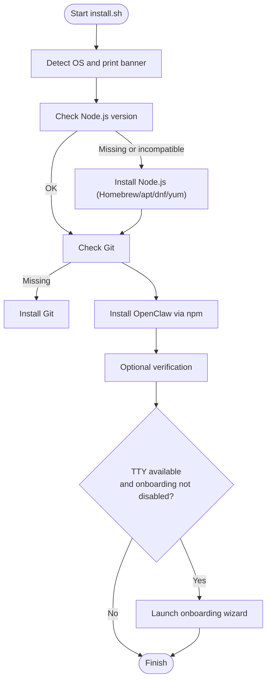
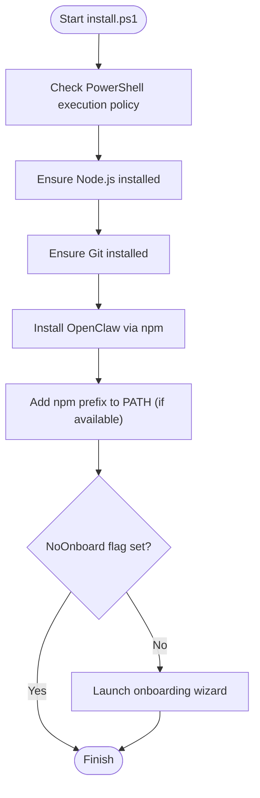
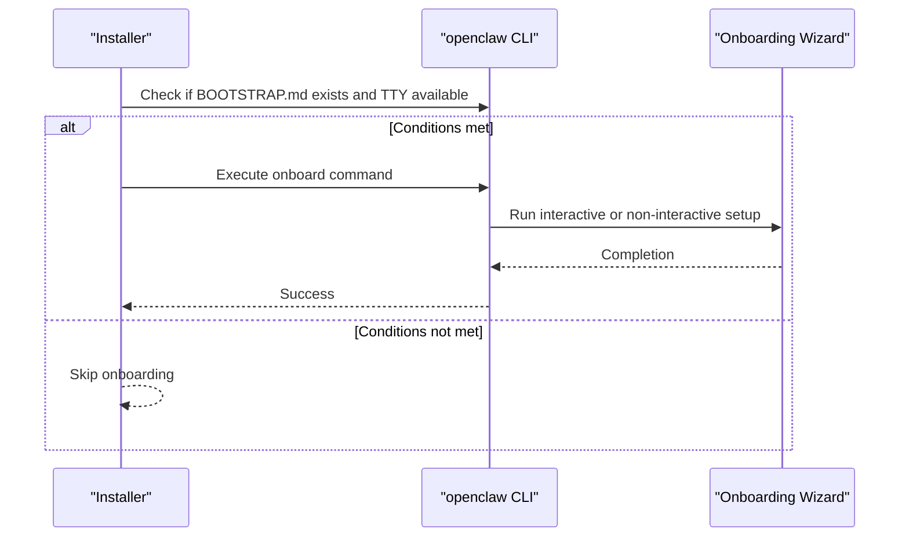
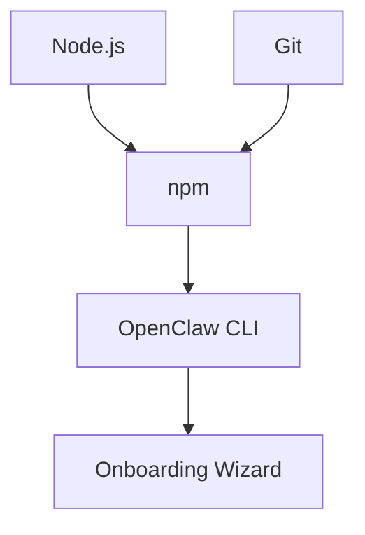

# Installer Script

<cite>
**Referenced Files in This Document**
- [install.sh](file://scripts/install.sh)
- [install.ps1](file://scripts/install.ps1)
- [installer.md](file://docs/install/installer.md)
- [onboard.ts](file://src/commands/onboard.ts)
- [register.onboard.ts](file://src/cli/program/register.onboard.ts)
- [onboard.md](file://docs/cli/onboard.md)
- [install.sh (verification):2246-2275](file://scripts/install.sh#L2246-L2275)
- [install.sh (onboarding):2093-2131](file://scripts/install.sh#L2093-L2131)
- [install.sh (post-install):2399-2572](file://scripts/install.sh#L2399-L2572)
- [install.sh (node detection):1262-1310](file://scripts/install.sh#L1262-L1310)
- [install.sh (npm install):675-840](file://scripts/install.sh#L675-L840)
- [install.ps1 (node detection):82-162](file://scripts/install.ps1#L82-L162)
- [install.ps1 (npm install):202-218](file://scripts/install.ps1#L202-L218)
</cite>

## Table of Contents
1. [Introduction](#introduction)
2. [Project Structure](#project-structure)
3. [Core Components](#core-components)
4. [Architecture Overview](#architecture-overview)
5. [Detailed Component Analysis](#detailed-component-analysis)
6. [Dependency Analysis](#dependency-analysis)
7. [Performance Considerations](#performance-considerations)
8. [Troubleshooting Guide](#troubleshooting-guide)
9. [Conclusion](#conclusion)
10. [Appendices](#appendices)

## Introduction
This document explains the automated installer script installation method for OpenClaw. It covers how the installer detects and installs Node.js, performs global CLI installation via npm, and launches the onboarding wizard when appropriate. It also documents the macOS/Linux/WSL2 installation using curl with bash execution and the Windows PowerShell installation using iwr and iex commands. Advanced options such as skipping onboarding, environment variables for CI/automation, and troubleshooting common installation issues are included, along with step-by-step verification instructions and an explanation of the script’s internal workflow.

## Project Structure
The installer consists of two primary scripts:
- A POSIX-compliant Bash script for macOS, Linux, and WSL2 environments.
- A Windows PowerShell script for Windows environments.

Both scripts share a common goal: ensuring Node.js and Git are available, installing OpenClaw globally, and optionally launching the onboarding wizard.

**Diagram sources**
- [install.sh:2278-2572](file://scripts/install.sh#L2278-L2572)
- [install.ps1:301-360](file://scripts/install.ps1#L301-L360)

**Section sources**
- [installer.md:12-18](file://docs/install/installer.md#L12-L18)

## Core Components
- Node.js detection and installation:
  - macOS/Linux/WSL2: Uses Homebrew or NodeSource repositories to install a compatible Node.js version.
  - Windows: Uses winget, Chocolatey, or Scoop to install Node.js if missing.
- Git detection and installation:
  - Ensures Git is available for both install methods.
- Global npm installation:
  - Installs the OpenClaw package globally and sets up the CLI wrapper.
- Onboarding wizard:
  - Automatically launches the wizard when appropriate (TTY available, no existing configuration, onboarding not disabled).
- Verification:
  - Optional post-install verification checks the CLI and related services.

**Section sources**
- [install.sh (node detection):1262-1310](file://scripts/install.sh#L1262-L1310)
- [install.sh (npm install):675-840](file://scripts/install.sh#L675-L840)
- [install.ps1 (node detection):82-162](file://scripts/install.ps1#L82-L162)
- [install.ps1 (npm install):202-218](file://scripts/install.ps1#L202-L218)
- [install.sh (onboarding):2093-2131](file://scripts/install.sh#L2093-L2131)
- [install.sh (verification):2246-2275](file://scripts/install.sh#L2246-L2275)

## Architecture Overview
The installer orchestrates a deterministic flow across platforms, with platform-specific steps and shared logic for dependency management and CLI installation.

**Diagram sources**
- [install.sh:2278-2572](file://scripts/install.sh#L2278-L2572)
- [install.ps1:301-360](file://scripts/install.ps1#L301-L360)

## Detailed Component Analysis

### macOS/Linux/WSL2 Installer (install.sh)
- Node.js detection and installation:
  - Detects Node.js version and ensures it meets the minimum requirement.
  - On macOS, installs Node via Homebrew; on Linux, uses NodeSource repository setup scripts.
  - Validates the active Node path and advises on PATH configuration if needed.
- Git detection and installation:
  - Detects Git availability and installs via the platform’s package manager if missing.
- Global npm installation:
  - Resolves the package install specification (supports dist-tags, explicit specs, and “main”).
  - Handles npm failure diagnostics, including build tool detection and retry logic.
  - Sets up the CLI wrapper and ensures PATH is configured for user installs on Linux.
- Onboarding wizard:
  - Automatically launches the wizard when appropriate (presence of BOOTSTRAP.md and TTY).
  - Can be skipped via the --no-onboard flag or OPENCLAW_NO_ONBOARD environment variable.
- Verification:
  - Optional verification checks the CLI version and gateway service health.

**Diagram sources**
- [install.sh:2278-2572](file://scripts/install.sh#L2278-L2572)

**Section sources**
- [install.sh (node detection):1262-1310](file://scripts/install.sh#L1262-L1310)
- [install.sh (npm install):675-840](file://scripts/install.sh#L675-L840)
- [install.sh (onboarding):2093-2131](file://scripts/install.sh#L2093-L2131)
- [install.sh (verification):2246-2275](file://scripts/install.sh#L2246-L2275)

### Windows Installer (install.ps1)
- Node.js detection and installation:
  - Detects Node.js and ensures a compatible version.
  - Attempts installation via winget, Chocolatey, or Scoop if missing.
- Git detection and installation:
  - Detects Git and installs Git for Windows if missing.
- Global npm installation:
  - Installs OpenClaw globally via npm with support for dist-tags and explicit specs.
- Onboarding wizard:
  - Optionally launches the wizard after successful installation.
- Execution policy handling:
  - Adjusts PowerShell execution policy for the current process if needed.

**Diagram sources**
- [install.ps1:301-360](file://scripts/install.ps1#L301-L360)

**Section sources**
- [install.ps1 (node detection):82-162](file://scripts/install.ps1#L82-L162)
- [install.ps1 (npm install):202-218](file://scripts/install.ps1#L202-L218)

### Onboarding Wizard Integration
- The installer conditionally launches the onboarding wizard when:
  - A BOOTSTRAP.md file exists in the workspace.
  - A TTY is available.
  - Onboarding is not disabled via flags or environment variables.
- The wizard is implemented as a CLI command and can be run non-interactively with explicit risk acknowledgment.

**Diagram sources**
- [install.sh (onboarding):2093-2131](file://scripts/install.sh#L2093-L2131)
- [onboard.ts:15-97](file://src/commands/onboard.ts#L15-L97)

**Section sources**
- [install.sh (onboarding):2093-2131](file://scripts/install.sh#L2093-L2131)
- [onboard.ts:15-97](file://src/commands/onboard.ts#L15-L97)
- [register.onboard.ts:50-81](file://src/cli/program/register.onboard.ts#L50-L81)
- [onboard.md:1-31](file://docs/cli/onboard.md#L1-L31)

## Dependency Analysis
- Installer dependencies:
  - Node.js: Required for npm and OpenClaw runtime.
  - Git: Required for both install methods; used to avoid spawn errors and for git-based installs.
  - npm: Used for global package installation.
  - pnpm: Used for development installs and builds.
- Cross-platform differences:
  - macOS: Uses Homebrew for Node.js and Git.
  - Linux: Uses NodeSource repository setup scripts and distro package managers.
  - Windows: Uses winget/choco/scoop for Node.js and Git for Windows.

**Diagram sources**
- [install.sh:2278-2572](file://scripts/install.sh#L2278-L2572)
- [install.ps1:301-360](file://scripts/install.ps1#L301-L360)

**Section sources**
- [install.sh:2278-2572](file://scripts/install.sh#L2278-L2572)
- [install.ps1:301-360](file://scripts/install.ps1#L301-L360)

## Performance Considerations
- Minimizing retries: The installer retries npm installs after fixing missing build tools to reduce manual intervention.
- Conditional steps: Steps like onboarding and verification are skipped when not applicable to reduce overhead.
- Non-interactive mode: CI environments benefit from disabling prompts and onboarding to streamline automation.

[No sources needed since this section provides general guidance]

## Troubleshooting Guide
Common issues and resolutions:
- Git required for npm installs:
  - Git is still checked/installed to avoid spawn errors when dependencies use git URLs.
- Linux npm permission errors:
  - The installer switches npm prefix to a user-writable directory and updates PATH.
- sharp/libvips issues:
  - The scripts default to ignoring global libvips to avoid native compilation issues.
- Windows Git not found:
  - Install Git for Windows and reopen PowerShell, then rerun the installer.
- Windows PATH not recognizing openclaw:
  - Add the npm prefix directory to user PATH and reopen PowerShell.
- Verbose diagnostics on Windows:
  - Use PowerShell tracing for script-level diagnostics.

**Section sources**
- [installer.md:372-415](file://docs/install/installer.md#L372-L415)

## Conclusion
The installer scripts provide a robust, cross-platform installation experience for OpenClaw. They handle Node.js and Git detection/installation, perform global npm installation, and intelligently launch the onboarding wizard when appropriate. Advanced options and environment variables enable automation-friendly installations, while built-in verification and troubleshooting guidance improve reliability.

[No sources needed since this section summarizes without analyzing specific files]

## Appendices

### Step-by-Step Verification Instructions
- Confirm installation:
  - Run the CLI version command to verify the installation.
  - If the gateway daemon is loaded, run a deep status check to ensure service health.
- Expected outcomes:
  - Successful version output indicates proper installation.
  - Healthy gateway status confirms service readiness.

**Section sources**
- [install.sh (verification):2246-2275](file://scripts/install.sh#L2246-L2275)

### Advanced Options and Environment Variables
- Flags and environment variables for non-interactive automation:
  - Disable prompts and onboarding for CI/automation.
  - Control install method, version/tag, and logging levels.
  - Configure npm prefix and libvips behavior.

**Section sources**
- [installer.md:131-169](file://docs/install/installer.md#L131-L169)
- [installer.md:342-368](file://docs/install/installer.md#L342-L368)