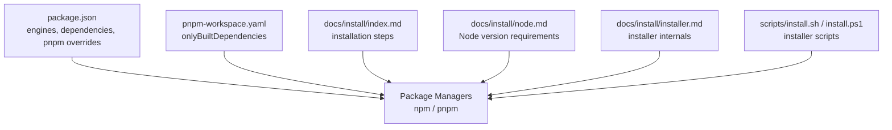
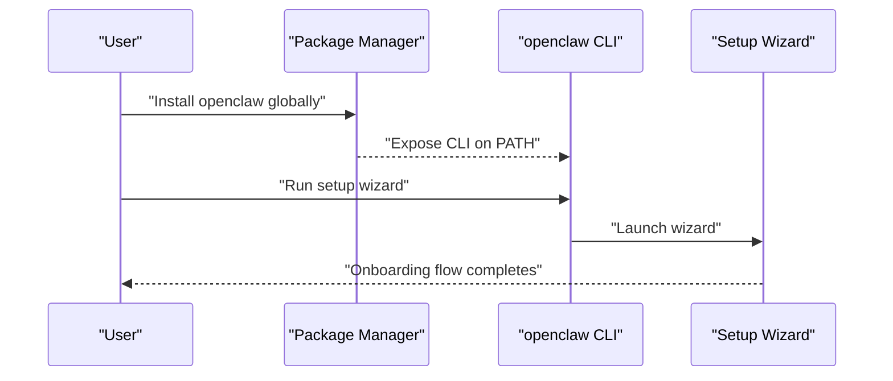
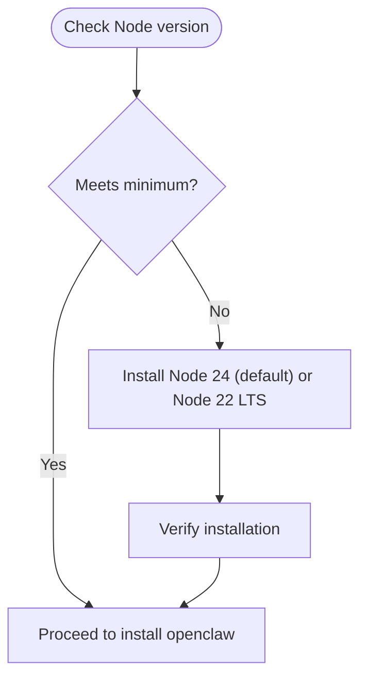
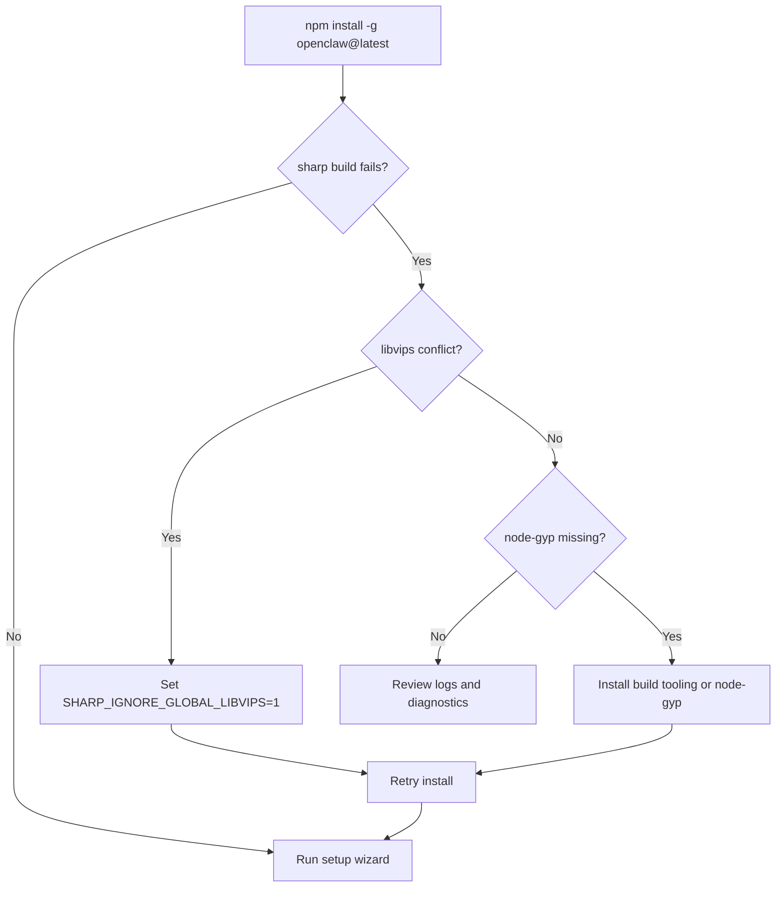
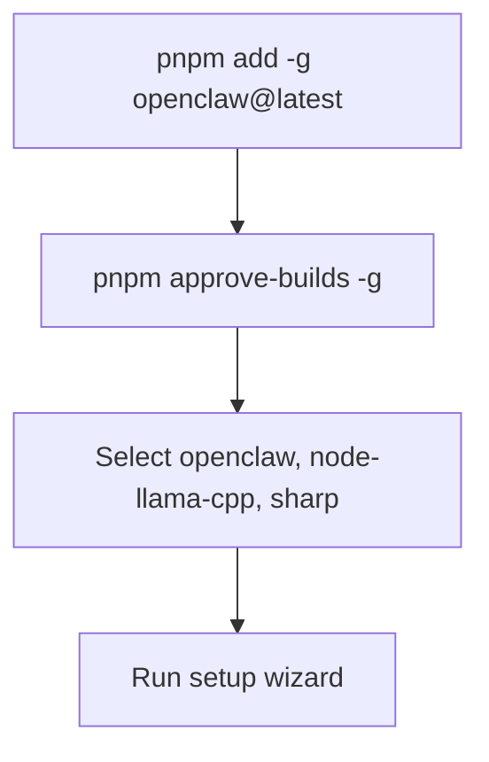
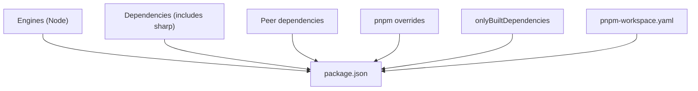

# Package Managers

<cite>
**Referenced Files in This Document**
- [package.json](file://package.json)
- [pnpm-workspace.yaml](file://pnpm-workspace.yaml)
- [docs/install/index.md](file://docs/install/index.md)
- [docs/install/node.md](file://docs/install/node.md)
- [docs/install/installer.md](file://docs/install/installer.md)
- [scripts/install.sh](file://scripts/install.sh)
- [scripts/install.ps1](file://scripts/install.ps1)
- [scripts/tsdown-build.mjs](file://scripts/tsdown-build.mjs)
- [scripts/runtime-postbuild.mjs](file://scripts/runtime-postbuild.mjs)
</cite>

## Table of Contents
1. [Introduction](#introduction)
2. [Project Structure](#project-structure)
3. [Core Components](#core-components)
4. [Architecture Overview](#architecture-overview)
5. [Detailed Component Analysis](#detailed-component-analysis)
6. [Dependency Analysis](#dependency-analysis)
7. [Performance Considerations](#performance-considerations)
8. [Troubleshooting Guide](#troubleshooting-guide)
9. [Conclusion](#conclusion)

## Introduction
This document explains how to install OpenClaw using npm and pnpm, including Node.js version requirements, global installation commands, and the setup wizard process. It also covers sharp build errors and their solutions, pnpm-specific approvals, GitHub repository installation for bleeding-edge builds, and platform-specific considerations for each package manager.

## Project Structure
OpenClaw is distributed as a JavaScript/TypeScript project with a primary package definition and a pnpm workspace configuration. The package metadata defines engines, dependencies, peer dependencies, and pnpm-specific overrides and only-built dependencies. The documentation pages describe supported installation methods and Node.js requirements.

**Diagram sources**
- [package.json](file://package.json)
- [pnpm-workspace.yaml](file://pnpm-workspace.yaml)
- [docs/install/index.md](file://docs/install/index.md)
- [docs/install/node.md](file://docs/install/node.md)
- [docs/install/installer.md](file://docs/install/installer.md)
- [scripts/install.sh](file://scripts/install.sh)
- [scripts/install.ps1](file://scripts/install.ps1)

**Section sources**
- [package.json](file://package.json)
- [pnpm-workspace.yaml](file://pnpm-workspace.yaml)
- [docs/install/index.md](file://docs/install/index.md)
- [docs/install/node.md](file://docs/install/node.md)
- [docs/install/installer.md](file://docs/install/installer.md)
- [scripts/install.sh](file://scripts/install.sh)
- [scripts/install.ps1](file://scripts/install.ps1)

## Core Components
- Node.js requirement: The project specifies a minimum Node version and recommends Node 24. The installer scripts enforce Node 24 by default and fall back to Node 22 LTS when necessary.
- Global installation:
  - npm: Install the openclaw package globally and run the setup wizard.
  - pnpm: Install globally, approve build scripts, then run the setup wizard.
- Setup wizard: The documentation describes running the setup wizard after a successful global install.
- Sharp and native builds:
  - The project depends on sharp, which may trigger native build scripts.
  - pnpm requires explicit approval for packages with build scripts.
  - The installer sets a default environment variable to avoid conflicts with system libvips.

**Section sources**
- [package.json](file://package.json)
- [docs/install/index.md](file://docs/install/index.md)
- [docs/install/node.md](file://docs/install/node.md)
- [docs/install/installer.md](file://docs/install/installer.md)
- [scripts/install.sh](file://scripts/install.sh)

## Architecture Overview
The installation pipeline varies slightly by package manager but converges on the same post-install steps: invoking the setup wizard and ensuring the CLI is available on PATH.

**Diagram sources**
- [docs/install/index.md](file://docs/install/index.md)
- [docs/install/installer.md](file://docs/install/installer.md)

## Detailed Component Analysis

### Node.js Version Requirements
- Minimum Node version: The project declares a minimum Node version in its engines field.
- Recommended Node: The documentation recommends Node 24; Node 22 LTS is still supported.
- Installer behavior: The installer scripts detect and install Node 24 by default, falling back to Node 22 LTS when necessary.

**Diagram sources**
- [package.json](file://package.json)
- [docs/install/node.md](file://docs/install/node.md)
- [docs/install/installer.md](file://docs/install/installer.md)

**Section sources**
- [package.json](file://package.json)
- [docs/install/node.md](file://docs/install/node.md)
- [docs/install/installer.md](file://docs/install/installer.md)

### npm Installation
- Global install command: Install the openclaw package globally using npm.
- Setup wizard: After installation, run the setup wizard to complete onboarding.
- sharp build errors:
  - If libvips is installed globally and sharp fails, use the documented environment variable to force prebuilt binaries.
  - If node-gyp is missing, install build tooling or use the environment variable workaround.

**Diagram sources**
- [docs/install/index.md](file://docs/install/index.md)
- [scripts/install.sh](file://scripts/install.sh)

**Section sources**
- [docs/install/index.md](file://docs/install/index.md)
- [scripts/install.sh](file://scripts/install.sh)

### pnpm Installation
- Global install command: Install the openclaw package globally using pnpm.
- Approve build scripts: Because pnpm ignores build scripts by default for safety, approve the required packages (including sharp and node-llama-cpp) using the documented command.
- Setup wizard: After approvals, run the setup wizard to complete onboarding.

**Diagram sources**
- [docs/install/index.md](file://docs/install/index.md)
- [pnpm-workspace.yaml](file://pnpm-workspace.yaml)

**Section sources**
- [docs/install/index.md](file://docs/install/index.md)
- [pnpm-workspace.yaml](file://pnpm-workspace.yaml)

### GitHub Repository Installation (Bleeding Edge)
- npm: Install directly from the GitHub main branch using an npm-compatible specifier.
- pnpm: Similarly, install from the GitHub main branch using a pnpm-compatible specifier.
- Notes: These methods bypass npm dist-tags and track the main branch head.

**Section sources**
- [docs/install/index.md](file://docs/install/index.md)

### Setup Wizard Process
- The documentation describes running the setup wizard after a successful global install.
- The installer scripts also integrate onboarding into the automated install flow.

**Section sources**
- [docs/install/index.md](file://docs/install/index.md)
- [docs/install/installer.md](file://docs/install/installer.md)

### Sharp Build Errors and Solutions
- libvips conflicts: When a system libvips is present, use the documented environment variable to force prebuilt binaries.
- node-gyp requirements: If node-gyp or native build tooling is missing, install the required toolchain or rely on the environment variable workaround.
- Installer assistance: The installer detects common native build failures and can attempt to install build tools automatically on supported platforms.

**Section sources**
- [docs/install/index.md](file://docs/install/index.md)
- [scripts/install.sh](file://scripts/install.sh)

### Platform-Specific Considerations
- macOS/Linux/WSL:
  - The installer detects OS and installs Node 24 by default, falls back to Node 22 LTS when needed.
  - The installer can auto-install build tools (make, cmake, etc.) when native builds fail.
- Windows:
  - The PowerShell installer checks and installs Node 24 by default, with Node 22 LTS fallback.
  - The installer can add the npm global prefix to PATH and supports git-based installs.

**Section sources**
- [docs/install/installer.md](file://docs/install/installer.md)
- [scripts/install.sh](file://scripts/install.sh)
- [scripts/install.ps1](file://scripts/install.ps1)

## Dependency Analysis
OpenClaw’s package metadata defines:
- Engines: Minimum Node version requirement.
- Dependencies: Includes sharp, which triggers native build scripts during installation.
- Peer dependencies: Optional integrations (e.g., node-llama-cpp).
- pnpm overrides and onlyBuiltDependencies: Ensures consistent dependency resolution and restricts which packages are built from source.

**Diagram sources**
- [package.json](file://package.json)
- [pnpm-workspace.yaml](file://pnpm-workspace.yaml)

**Section sources**
- [package.json](file://package.json)
- [pnpm-workspace.yaml](file://pnpm-workspace.yaml)

## Performance Considerations
- Prefer Node 24 for optimal performance and compatibility.
- Use the installer scripts to avoid manual environment setup and reduce misconfiguration risk.
- For pnpm, approve only the necessary build scripts to minimize unnecessary rebuilds.

## Troubleshooting Guide
- openclaw not found after install:
  - Ensure the npm global bin directory is on PATH.
  - On Windows, add the npm prefix directory to PATH.
- Permission errors on Linux:
  - Change npm’s global prefix to a user-writable directory and update PATH.
- Native build failures:
  - Install build tools (make, cmake, etc.) or use the documented environment variable to force prebuilt binaries.
  - On macOS, ensure Xcode Command Line Tools are installed; on Linux, install build-essential and Python.

**Section sources**
- [docs/install/index.md](file://docs/install/index.md)
- [docs/install/node.md](file://docs/install/node.md)
- [scripts/install.sh](file://scripts/install.sh)
- [scripts/install.ps1](file://scripts/install.ps1)

## Conclusion
For reliable installation, use the installer scripts to ensure the correct Node version and PATH configuration, then install openclaw via npm or pnpm. For pnpm, approve build scripts for packages like sharp and node-llama-cpp. When encountering sharp build errors, use the documented environment variable or install native build tooling. For bleeding-edge builds, install directly from the GitHub main branch using either npm or pnpm.