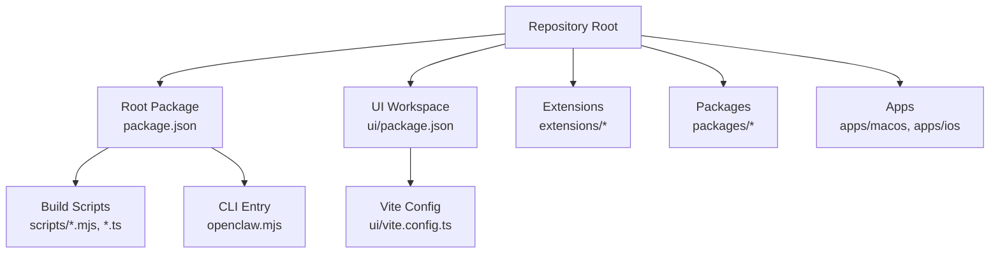
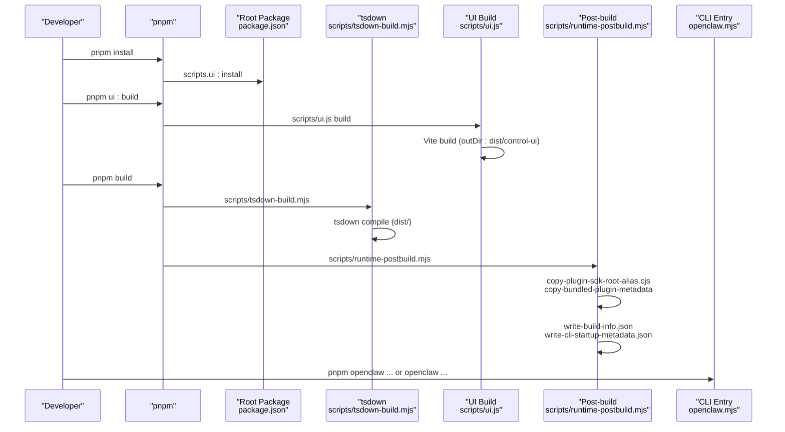
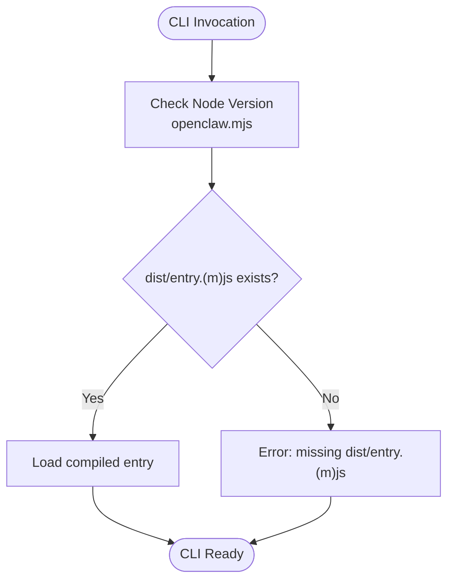
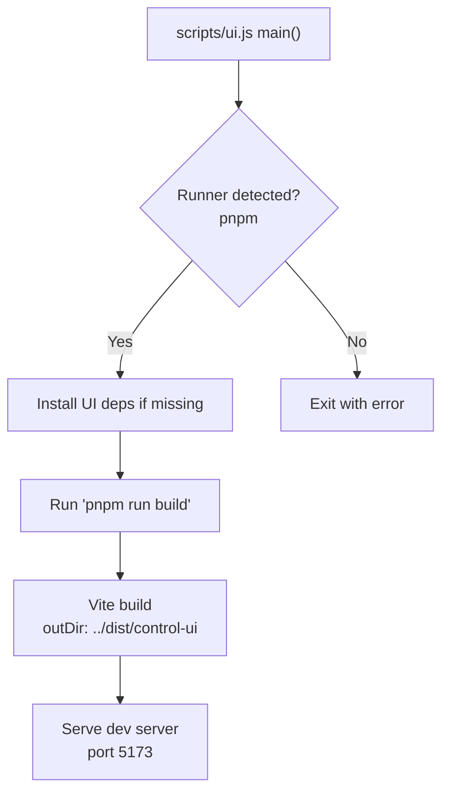
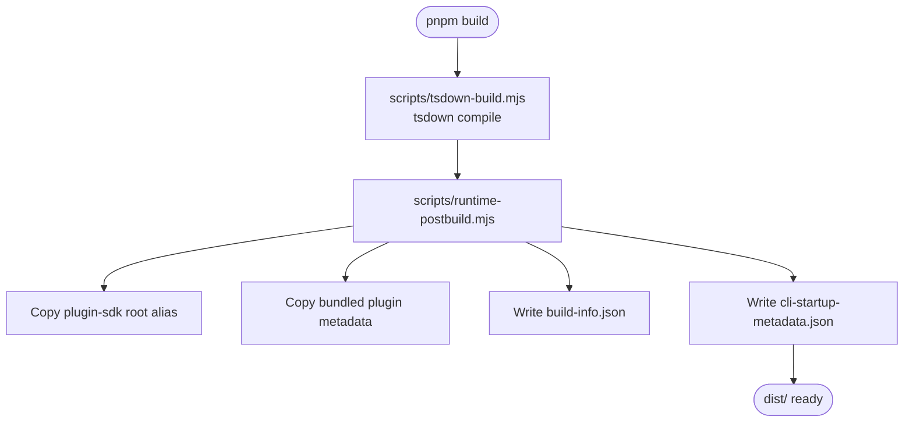
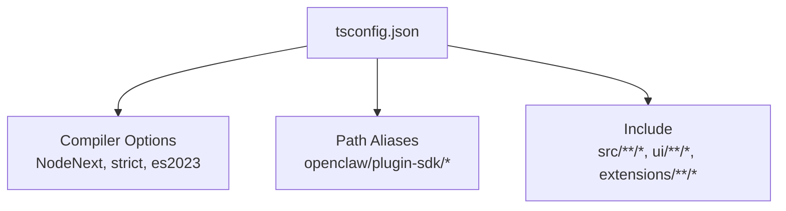
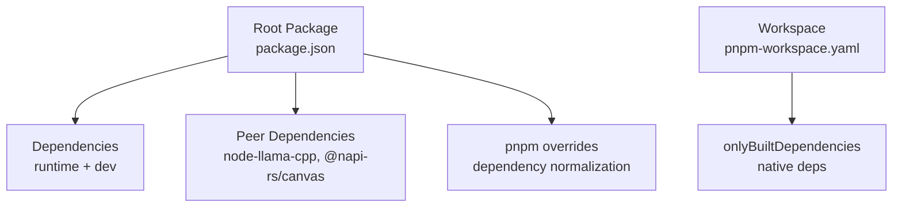

# Source Installation

<cite>
**Referenced Files in This Document**
- [README.md](file://README.md)
- [package.json](file://package.json)
- [pnpm-workspace.yaml](file://pnpm-workspace.yaml)
- [openclaw.mjs](file://openclaw.mjs)
- [ui/package.json](file://ui/package.json)
- [ui/vite.config.ts](file://ui/vite.config.ts)
- [scripts/ui.js](file://scripts/ui.js)
- [scripts/tsdown-build.mjs](file://scripts/tsdown-build.mjs)
- [scripts/runtime-postbuild.mjs](file://scripts/runtime-postbuild.mjs)
- [scripts/copy-bundled-plugin-metadata.mjs](file://scripts/copy-bundled-plugin-metadata.mjs)
- [scripts/copy-plugin-sdk-root-alias.mjs](file://scripts/copy-plugin-sdk-root-alias.mjs)
- [scripts/write-build-info.ts](file://scripts/write-build-info.ts)
- [scripts/write-cli-startup-metadata.ts](file://scripts/write-cli-startup-metadata.ts)
- [tsconfig.json](file://tsconfig.json)
</cite>

## Table of Contents
1. [Introduction](#introduction)
2. [Project Structure](#project-structure)
3. [Core Components](#core-components)
4. [Architecture Overview](#architecture-overview)
5. [Detailed Component Analysis](#detailed-component-analysis)
6. [Dependency Analysis](#dependency-analysis)
7. [Performance Considerations](#performance-considerations)
8. [Troubleshooting Guide](#troubleshooting-guide)
9. [Conclusion](#conclusion)

## Introduction
This document explains how to build OpenClaw from source, covering repository setup, UI build, main application compilation, and development workflow. It also describes the pnpm link mechanism for global CLI availability and alternative invocation via pnpm openclaw. The guide emphasizes development-specific considerations, build dependencies, and platform-specific requirements surfaced by the repository configuration.

## Project Structure
OpenClaw is a monorepo organized around a root package and several workspaces:
- Root package: orchestrates build scripts, CLI entry, and exports.
- UI workspace: Vite-based control UI built into dist/control-ui.
- Extensions and packages: distributed under extensions/* and packages/*.
- Swift-based macOS/iOS app sources under apps/macos and apps/ios.

Key characteristics:
- Monorepo managed by pnpm with a workspace configuration.
- Build pipeline driven by npm-style scripts in the root package.
- UI build configured via Vite with a dedicated output directory.
- TypeScript compiler configuration shared across workspaces.

**Diagram sources**
- [package.json:1-481](file://package.json#L1-L481)
- [pnpm-workspace.yaml:1-18](file://pnpm-workspace.yaml#L1-L18)
- [ui/package.json:1-29](file://ui/package.json#L1-L29)
- [ui/vite.config.ts:1-62](file://ui/vite.config.ts#L1-L62)
- [openclaw.mjs:1-90](file://openclaw.mjs#L1-L90)

**Section sources**
- [README.md:92-111](file://README.md#L92-L111)
- [package.json:1-481](file://package.json#L1-L481)
- [pnpm-workspace.yaml:1-18](file://pnpm-workspace.yaml#L1-L18)

## Core Components
- Root package: defines the CLI entry point, build scripts, exports, and engine requirements.
- UI workspace: Vite-based frontend with a dedicated output directory for the control UI.
- Build toolchain: TypeScript down-transpile via tsdown, post-build metadata generation, and plugin SDK packaging.
- CLI entry: validates Node.js version and loads the compiled runtime entry.

Key responsibilities:
- Root package: compile-time bundling, export mapping, and CLI distribution.
- UI workspace: build the control UI and serve during development.
- Build scripts: orchestrate TypeScript compilation, metadata generation, and packaging steps.

**Section sources**
- [package.json:16-34](file://package.json#L16-L34)
- [package.json:214-346](file://package.json#L214-L346)
- [ui/package.json:1-29](file://ui/package.json#L1-L29)
- [ui/vite.config.ts:21-62](file://ui/vite.config.ts#L21-L62)
- [openclaw.mjs:1-90](file://openclaw.mjs#L1-L90)

## Architecture Overview
The build and runtime architecture ties together the CLI entry, TypeScript compilation, UI build, and post-build metadata generation.

**Diagram sources**
- [package.json:214-346](file://package.json#L214-L346)
- [scripts/ui.js:162-194](file://scripts/ui.js#L162-L194)
- [ui/vite.config.ts:30-36](file://ui/vite.config.ts#L30-L36)
- [scripts/tsdown-build.mjs:1-21](file://scripts/tsdown-build.mjs#L1-L21)
- [scripts/runtime-postbuild.mjs:1-13](file://scripts/runtime-postbuild.mjs#L1-L13)
- [scripts/copy-plugin-sdk-root-alias.mjs:1-17](file://scripts/copy-plugin-sdk-root-alias.mjs#L1-L17)
- [scripts/copy-bundled-plugin-metadata.mjs:1-206](file://scripts/copy-bundled-plugin-metadata.mjs#L1-L206)
- [scripts/write-build-info.ts:1-48](file://scripts/write-build-info.ts#L1-L48)
- [scripts/write-cli-startup-metadata.ts:1-94](file://scripts/write-cli-startup-metadata.ts#L1-L94)
- [openclaw.mjs:1-90](file://openclaw.mjs#L1-L90)

## Detailed Component Analysis

### CLI Entry and Global Availability
The CLI entry validates Node.js version and dynamically loads the compiled runtime entry from dist/. It supports two executable forms:
- Direct invocation via the installed binary (global or local).
- Alternative invocation via pnpm openclaw, which runs TypeScript directly using tsx.

**Diagram sources**
- [openclaw.mjs:17-36](file://openclaw.mjs#L17-L36)
- [openclaw.mjs:70-90](file://openclaw.mjs#L70-L90)

**Section sources**
- [openclaw.mjs:1-90](file://openclaw.mjs#L1-L90)
- [package.json:16-18](file://package.json#L16-L18)
- [package.json:293-294](file://package.json#L293-L294)

### UI Build Pipeline
The UI build is orchestrated by a Node.js script that detects a pnpm runner, ensures dependencies are installed, and invokes Vite. The Vite configuration sets the output directory to dist/control-ui and exposes a development server with a stub middleware for local configuration.

**Diagram sources**
- [scripts/ui.js:162-194](file://scripts/ui.js#L162-L194)
- [ui/vite.config.ts:30-41](file://ui/vite.config.ts#L30-L41)
- [ui/package.json:5-10](file://ui/package.json#L5-L10)

**Section sources**
- [scripts/ui.js:1-204](file://scripts/ui.js#L1-L204)
- [ui/vite.config.ts:1-62](file://ui/vite.config.ts#L1-L62)
- [ui/package.json:1-29](file://ui/package.json#L1-L29)

### Main Application Build
The main application build is driven by a series of scripts:
- TypeScript compilation via tsdown.
- Post-build steps: copy plugin SDK root alias, copy bundled plugin metadata, write build info, and write CLI startup metadata.

**Diagram sources**
- [package.json:224-228](file://package.json#L224-L228)
- [scripts/tsdown-build.mjs:1-21](file://scripts/tsdown-build.mjs#L1-L21)
- [scripts/runtime-postbuild.mjs:1-13](file://scripts/runtime-postbuild.mjs#L1-L13)
- [scripts/copy-plugin-sdk-root-alias.mjs:1-17](file://scripts/copy-plugin-sdk-root-alias.mjs#L1-L17)
- [scripts/copy-bundled-plugin-metadata.mjs:1-206](file://scripts/copy-bundled-plugin-metadata.mjs#L1-L206)
- [scripts/write-build-info.ts:1-48](file://scripts/write-build-info.ts#L1-L48)
- [scripts/write-cli-startup-metadata.ts:1-94](file://scripts/write-cli-startup-metadata.ts#L1-L94)

**Section sources**
- [package.json:224-228](file://package.json#L224-L228)
- [scripts/tsdown-build.mjs:1-21](file://scripts/tsdown-build.mjs#L1-L21)
- [scripts/runtime-postbuild.mjs:1-13](file://scripts/runtime-postbuild.mjs#L1-L13)
- [scripts/copy-plugin-sdk-root-alias.mjs:1-17](file://scripts/copy-plugin-sdk-root-alias.mjs#L1-L17)
- [scripts/copy-bundled-plugin-metadata.mjs:1-206](file://scripts/copy-bundled-plugin-metadata.mjs#L1-L206)
- [scripts/write-build-info.ts:1-48](file://scripts/write-build-info.ts#L1-L48)
- [scripts/write-cli-startup-metadata.ts:1-94](file://scripts/write-cli-startup-metadata.ts#L1-L94)

### TypeScript Configuration and Path Mapping
The TypeScript configuration centralizes compiler options and path aliases for internal modules, ensuring consistent compilation across workspaces.

**Diagram sources**
- [tsconfig.json:1-30](file://tsconfig.json#L1-L30)

**Section sources**
- [tsconfig.json:1-30](file://tsconfig.json#L1-L30)

## Dependency Analysis
The root package declares runtime and development dependencies, peer dependencies, and pnpm overrides. The workspace configuration enumerates packages and onlyBuiltDependencies to streamline native dependency handling.

**Diagram sources**
- [package.json:347-481](file://package.json#L347-L481)
- [pnpm-workspace.yaml:1-18](file://pnpm-workspace.yaml#L1-L18)

**Section sources**
- [package.json:347-481](file://package.json#L347-L481)
- [pnpm-workspace.yaml:1-18](file://pnpm-workspace.yaml#L1-L18)

## Performance Considerations
- UI chunk size warning threshold is increased to accommodate the current control UI chunk sizes, keeping CI logs concise.
- Native dependencies are marked as onlyBuiltDependencies to avoid unnecessary rebuilds and improve install performance.
- TypeScript compilation leverages tsdown with a configurable log level controlled by an environment variable.

**Section sources**
- [ui/vite.config.ts:34-35](file://ui/vite.config.ts#L34-L35)
- [pnpm-workspace.yaml:7-17](file://pnpm-workspace.yaml#L7-L17)
- [scripts/tsdown-build.mjs:5-6](file://scripts/tsdown-build.mjs#L5-L6)

## Troubleshooting Guide
Common issues and resolutions derived from the repository configuration:

- Missing dist/entry.(m)js after build
  - Symptom: CLI reports missing compiled entry.
  - Cause: Build did not produce dist/entry.(m)js.
  - Resolution: Run the build scripts again and ensure tsdown completes successfully.
  - Section sources
    - [openclaw.mjs:83-89](file://openclaw.mjs#L83-L89)

- Node.js version mismatch
  - Symptom: CLI exits with a Node.js version requirement message.
  - Cause: Running on unsupported Node.js version.
  - Resolution: Use a supported version (≥22.12) via nvm.
  - Section sources
    - [openclaw.mjs:17-36](file://openclaw.mjs#L17-L36)

- UI dependencies not installed
  - Symptom: UI build fails due to missing Vite or related dependencies.
  - Cause: UI dependencies not present.
  - Resolution: Run the UI install script or ensure pnpm is available and run pnpm install.
  - Section sources
    - [scripts/ui.js:186-191](file://scripts/ui.js#L186-L191)

- Native dependencies and platform-specific compilation
  - Symptom: Failures during installation of native modules.
  - Cause: Native dependencies require specific toolchains.
  - Resolution: Ensure your platform toolchain matches the onlyBuiltDependencies list and pnpm overrides.
  - Section sources
    - [pnpm-workspace.yaml:7-17](file://pnpm-workspace.yaml#L7-L17)
    - [package.json:441-479](file://package.json#L441-L479)

- Build verbosity and logs
  - Tip: Set OPENCLAW_BUILD_VERBOSE to increase tsdown log level for verbose output.
  - Section sources
    - [scripts/tsdown-build.mjs:5-6](file://scripts/tsdown-build.mjs#L5-L6)

- Global CLI availability and alternative invocation
  - Global CLI: After building, the CLI binary is available globally via the installed package.
  - Alternative invocation: Use pnpm openclaw to run TypeScript directly via tsx.
  - Section sources
    - [package.json:16-18](file://package.json#L16-L18)
    - [package.json:293-294](file://package.json#L293-L294)

## Conclusion
Building OpenClaw from source involves installing dependencies, building the UI, and compiling the main application with a series of scripts. The CLI entry validates Node.js compatibility and loads the compiled runtime. The repository’s pnpm workspace and onlyBuiltDependencies streamline native dependency handling, while the UI build targets dist/control-ui. For development, use the documented scripts and environment variables to manage verbosity and platform-specific requirements.