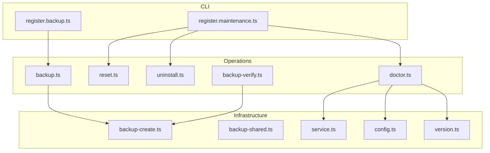
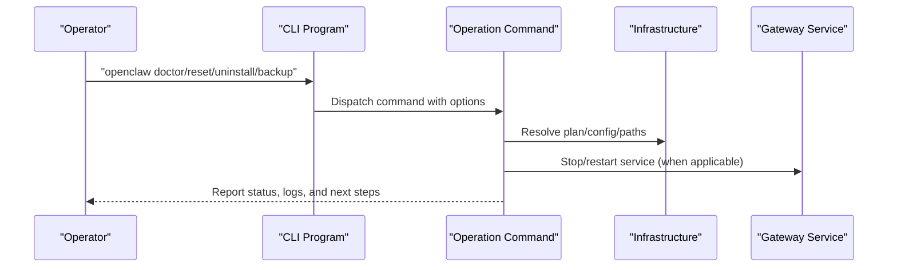
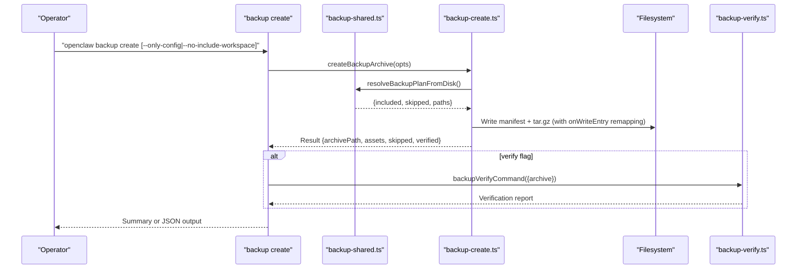
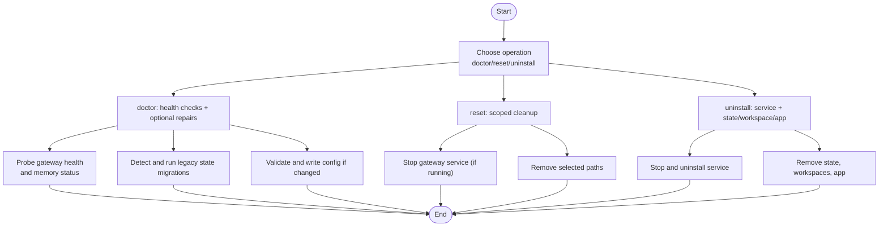
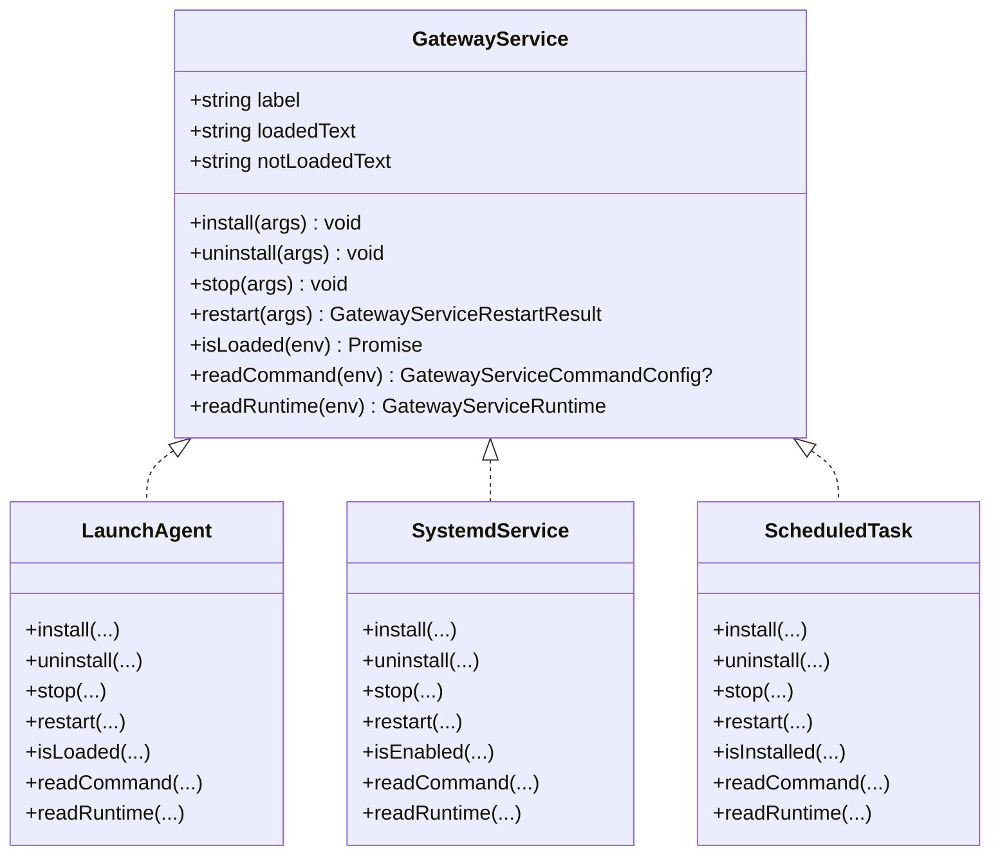
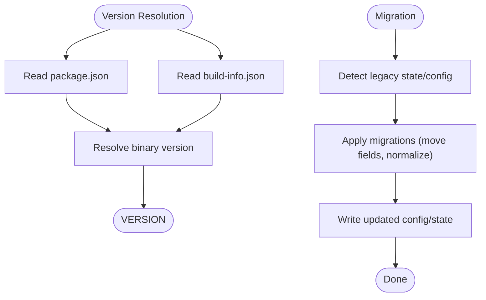
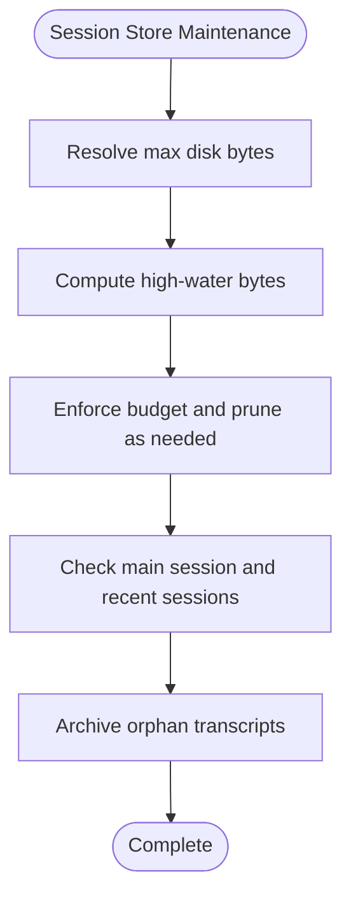
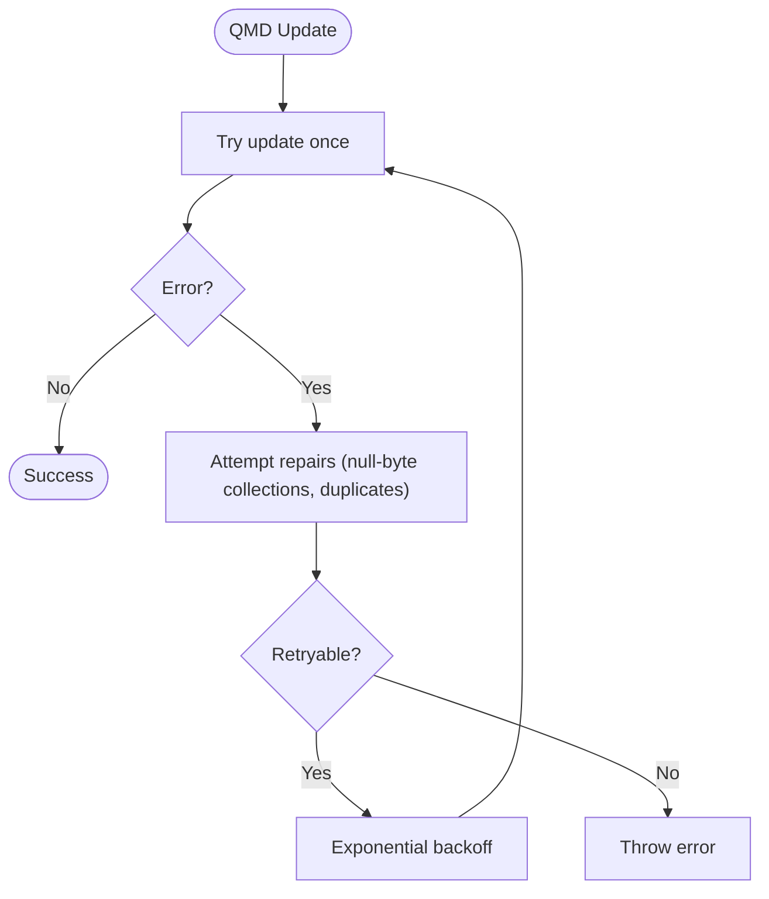
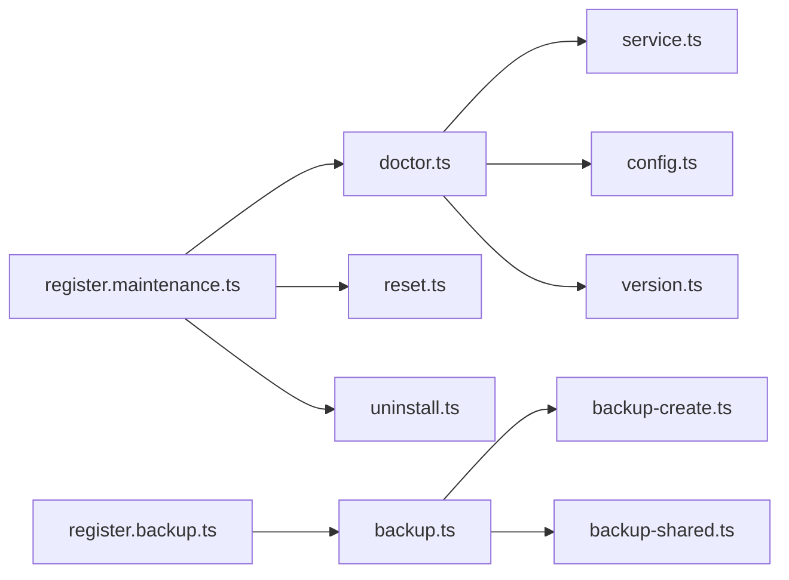

# Maintenance & Operations

<cite>
**Referenced Files in This Document**
- [src/version.ts](file://src/version.ts)
- [src/commands/backup.ts](file://src/commands/backup.ts)
- [src/commands/backup-verify.ts](file://src/commands/backup-verify.ts)
- [src/commands/backup-shared.ts](file://src/commands/backup-shared.ts)
- [src/infra/backup-create.ts](file://src/infra/backup-create.ts)
- [src/commands/reset.ts](file://src/commands/reset.ts)
- [src/commands/uninstall.ts](file://src/commands/uninstall.ts)
- [src/commands/doctor.ts](file://src/commands/doctor.ts)
- [src/commands/doctor-gateway-health.ts](file://src/commands/doctor-gateway-health.ts)
- [src/commands/doctor-state-integrity.ts](file://src/commands/doctor-state-integrity.ts)
- [src/daemon/service.ts](file://src/daemon/service.ts)
- [src/cli/program/register.maintenance.ts](file://src/cli/program/register.maintenance.ts)
- [src/cli/program/register.backup.ts](file://src/cli/program/register.backup.ts)
- [src/config/config.ts](file://src/config/config.ts)
- [src/config/sessions/store-maintenance.ts](file://src/config/sessions/store-maintenance.ts)
- [src/memory/qmd-manager.ts](file://src/memory/qmd-manager.ts)
- [src/config/legacy.migrations.part-1.ts](file://src/config/legacy.migrations.part-1.ts)
- [apps/android/app/src/main/res/xml/backup_rules.xml](file://apps/android/app/src/main/res/xml/backup_rules.xml)
- [docs/zh-CN/install/uninstall.md](file://docs/zh-CN/install/uninstall.md)
</cite>

## Table of Contents
1. [Introduction](#introduction)
2. [Project Structure](#project-structure)
3. [Core Components](#core-components)
4. [Architecture Overview](#architecture-overview)
5. [Detailed Component Analysis](#detailed-component-analysis)
6. [Dependency Analysis](#dependency-analysis)
7. [Performance Considerations](#performance-considerations)
8. [Troubleshooting Guide](#troubleshooting-guide)
9. [Conclusion](#conclusion)
10. [Appendices](#appendices)

## Introduction
This document provides comprehensive maintenance and operations guidance for the OpenClaw lifecycle. It covers update procedures, version migration strategies, backward compatibility considerations, system maintenance tasks, cleanup procedures, resource optimization, backup and restore operations, data migration processes, disaster recovery protocols, routine maintenance schedules, health checks, preventive care, troubleshooting, performance tuning, capacity planning, and system decommissioning with secure removal.

## Project Structure
OpenClaw’s maintenance and operations surface is primarily exposed via CLI commands and supporting infrastructure:
- CLI registration for maintenance and backup operations
- Commands for doctor, reset, uninstall, and backup/restore
- Infrastructure for backup creation and verification
- Gateway service abstraction across platforms
- Configuration and migration utilities
- Session store maintenance and legacy migrations

**Diagram sources**
- [src/cli/program/register.maintenance.ts:1-114](file://src/cli/program/register.maintenance.ts#L1-L114)
- [src/cli/program/register.backup.ts:1-93](file://src/cli/program/register.backup.ts#L1-L93)
- [src/commands/doctor.ts:1-370](file://src/commands/doctor.ts#L1-L370)
- [src/commands/reset.ts:1-152](file://src/commands/reset.ts#L1-L152)
- [src/commands/uninstall.ts:1-200](file://src/commands/uninstall.ts#L1-L200)
- [src/commands/backup.ts:1-32](file://src/commands/backup.ts#L1-L32)
- [src/commands/backup-verify.ts:121-140](file://src/commands/backup-verify.ts#L121-L140)
- [src/infra/backup-create.ts:1-369](file://src/infra/backup-create.ts#L1-L369)
- [src/commands/backup-shared.ts:1-255](file://src/commands/backup-shared.ts#L1-L255)
- [src/daemon/service.ts:1-147](file://src/daemon/service.ts#L1-L147)
- [src/config/config.ts:1-29](file://src/config/config.ts#L1-L29)
- [src/version.ts:1-129](file://src/version.ts#L1-L129)

**Section sources**
- [src/cli/program/register.maintenance.ts:1-114](file://src/cli/program/register.maintenance.ts#L1-L114)
- [src/cli/program/register.backup.ts:1-93](file://src/cli/program/register.backup.ts#L1-L93)
- [src/commands/doctor.ts:1-370](file://src/commands/doctor.ts#L1-L370)
- [src/commands/reset.ts:1-152](file://src/commands/reset.ts#L1-L152)
- [src/commands/uninstall.ts:1-200](file://src/commands/uninstall.ts#L1-L200)
- [src/commands/backup.ts:1-32](file://src/commands/backup.ts#L1-L32)
- [src/commands/backup-verify.ts:121-140](file://src/commands/backup-verify.ts#L121-L140)
- [src/infra/backup-create.ts:1-369](file://src/infra/backup-create.ts#L1-L369)
- [src/commands/backup-shared.ts:1-255](file://src/commands/backup-shared.ts#L1-L255)
- [src/daemon/service.ts:1-147](file://src/daemon/service.ts#L1-L147)
- [src/config/config.ts:1-29](file://src/config/config.ts#L1-L29)
- [src/version.ts:1-129](file://src/version.ts#L1-L129)

## Core Components
- Version resolution and runtime versioning
  - Centralized version resolution and runtime service version detection
  - Used to stamp backups and diagnose environment mismatches
- Backup subsystem
  - Archive creation, manifest generation, and verification
  - Plan resolution across state, config, credentials, and workspaces
- Maintenance commands
  - Doctor: health checks, gateway connectivity, memory search readiness, legacy state migrations, and optional repairs
  - Reset: scoped cleanup of config, credentials, sessions, and state/workspace
  - Uninstall: service removal and selective cleanup of state/workspace/app
- Gateway service abstraction
  - Cross-platform service control (launchd/systemd/Scheduled Tasks)
- Configuration and migrations
  - Configuration I/O, validation, and legacy migrations
- Session store maintenance
  - Disk budgeting and watermarks for session storage
- Memory search update resilience
  - Retryable update logic with repair steps for known transient errors

**Section sources**
- [src/version.ts:1-129](file://src/version.ts#L1-L129)
- [src/infra/backup-create.ts:1-369](file://src/infra/backup-create.ts#L1-L369)
- [src/commands/backup-shared.ts:1-255](file://src/commands/backup-shared.ts#L1-L255)
- [src/commands/doctor.ts:1-370](file://src/commands/doctor.ts#L1-L370)
- [src/commands/reset.ts:1-152](file://src/commands/reset.ts#L1-L152)
- [src/commands/uninstall.ts:1-200](file://src/commands/uninstall.ts#L1-L200)
- [src/daemon/service.ts:1-147](file://src/daemon/service.ts#L1-L147)
- [src/config/config.ts:1-29](file://src/config/config.ts#L1-L29)
- [src/config/sessions/store-maintenance.ts:80-124](file://src/config/sessions/store-maintenance.ts#L80-L124)
- [src/memory/qmd-manager.ts:1030-1068](file://src/memory/qmd-manager.ts#L1030-L1068)

## Architecture Overview
The maintenance and operations architecture centers around CLI programs that orchestrate commands backed by infrastructure modules. Doctor performs health checks and optional repairs, while reset and uninstall provide controlled cleanup. Backup creates archives with manifests and supports verification. The gateway service abstraction enables consistent service lifecycle management across platforms.

**Diagram sources**
- [src/cli/program/register.maintenance.ts:1-114](file://src/cli/program/register.maintenance.ts#L1-L114)
- [src/cli/program/register.backup.ts:1-93](file://src/cli/program/register.backup.ts#L1-L93)
- [src/commands/doctor.ts:1-370](file://src/commands/doctor.ts#L1-L370)
- [src/commands/reset.ts:1-152](file://src/commands/reset.ts#L1-L152)
- [src/commands/uninstall.ts:1-200](file://src/commands/uninstall.ts#L1-L200)
- [src/commands/backup.ts:1-32](file://src/commands/backup.ts#L1-L32)
- [src/daemon/service.ts:1-147](file://src/daemon/service.ts#L1-L147)

## Detailed Component Analysis

### Backup and Restore Operations
Backup and restore are implemented as a cohesive pipeline:
- Plan resolution identifies included/excluded assets based on configuration and filesystem presence
- Archive creation writes a gzipped tar with a manifest and handles cross-platform path encoding
- Verification validates the archive structure and manifest
- Optional post-creation verification ensures integrity

**Diagram sources**
- [src/cli/program/register.backup.ts:1-93](file://src/cli/program/register.backup.ts#L1-L93)
- [src/commands/backup.ts:1-32](file://src/commands/backup.ts#L1-L32)
- [src/commands/backup-shared.ts:1-255](file://src/commands/backup-shared.ts#L1-L255)
- [src/infra/backup-create.ts:1-369](file://src/infra/backup-create.ts#L1-L369)
- [src/commands/backup-verify.ts:121-140](file://src/commands/backup-verify.ts#L121-L140)

Operational guidance:
- Use the backup plan to preview inclusion and exclusions before writing archives
- Prefer verifying archives after creation to detect structural or manifest issues early
- For disaster recovery, restore the archive to a clean environment and re-run doctor to validate health

**Section sources**
- [src/commands/backup-shared.ts:106-255](file://src/commands/backup-shared.ts#L106-L255)
- [src/infra/backup-create.ts:272-369](file://src/infra/backup-create.ts#L272-L369)
- [src/commands/backup.ts:11-31](file://src/commands/backup.ts#L11-L31)
- [src/commands/backup-verify.ts:121-140](file://src/commands/backup-verify.ts#L121-L140)

### Doctor, Reset, and Uninstall Procedures
- Doctor
  - Runs preflight checks, detects legacy state, validates configuration, probes gateway health, and optionally repairs or migrates
  - Offers suggestions for workspace memory systems and security/prerequisite notes
- Reset
  - Scoped resets: config-only, config+credentials+sessions, or full state/workspace
  - Stops gateway service when appropriate and logs next steps
- Uninstall
  - Removes gateway service, state/config, workspace directories, and optionally the macOS app
  - Recommends creating backups prior to destructive operations

**Diagram sources**
- [src/commands/doctor.ts:73-370](file://src/commands/doctor.ts#L73-L370)
- [src/commands/doctor-gateway-health.ts:16-93](file://src/commands/doctor-gateway-health.ts#L16-L93)
- [src/commands/reset.ts:51-152](file://src/commands/reset.ts#L51-L152)
- [src/commands/uninstall.ts:100-200](file://src/commands/uninstall.ts#L100-L200)

**Section sources**
- [src/commands/doctor.ts:73-370](file://src/commands/doctor.ts#L73-L370)
- [src/commands/doctor-gateway-health.ts:16-93](file://src/commands/doctor-gateway-health.ts#L16-L93)
- [src/commands/reset.ts:51-152](file://src/commands/reset.ts#L51-L152)
- [src/commands/uninstall.ts:100-200](file://src/commands/uninstall.ts#L100-L200)

### Gateway Service Lifecycle Management
Cross-platform service control is abstracted behind a single interface:
- Install/uninstall, stop/restart, isLoaded, and runtime/command introspection
- Platform-specific implementations for Darwin (launchd), Linux (systemd), and Windows (Scheduled Tasks)

**Diagram sources**
- [src/daemon/service.ts:56-147](file://src/daemon/service.ts#L56-L147)

**Section sources**
- [src/daemon/service.ts:1-147](file://src/daemon/service.ts#L1-L147)

### Version Resolution and Migration Strategies
- Version resolution
  - Reads from package.json/build-info.json and environment markers
  - Provides a usable runtime service version with fallback handling
- Migration strategies
  - Legacy configuration migrations normalize deprecated fields and move values to new keys
  - Doctor detects and applies legacy state migrations during health checks

**Diagram sources**
- [src/version.ts:67-129](file://src/version.ts#L67-L129)
- [src/config/legacy.migrations.part-1.ts:68-95](file://src/config/legacy.migrations.part-1.ts#L68-L95)
- [src/commands/doctor.ts:199-220](file://src/commands/doctor.ts#L199-L220)

**Section sources**
- [src/version.ts:1-129](file://src/version.ts#L1-L129)
- [src/config/legacy.migrations.part-1.ts:60-95](file://src/config/legacy.migrations.part-1.ts#L60-L95)
- [src/commands/doctor.ts:199-220](file://src/commands/doctor.ts#L199-L220)

### Session Store Maintenance and Resource Optimization
- Disk budgeting
  - Compute high-water mark based on maximum disk bytes and a ratio
  - Parse human-friendly sizes and clamp to maximum bounds
- Cleanup procedures
  - Orphan transcript archiving and missing transcript remediation
  - Integrity checks for main session transcripts and recent sessions

**Diagram sources**
- [src/config/sessions/store-maintenance.ts:80-124](file://src/config/sessions/store-maintenance.ts#L80-L124)
- [src/commands/doctor-state-integrity.ts:698-800](file://src/commands/doctor-state-integrity.ts#L698-L800)

**Section sources**
- [src/config/sessions/store-maintenance.ts:80-124](file://src/config/sessions/store-maintenance.ts#L80-L124)
- [src/commands/doctor-state-integrity.ts:698-800](file://src/commands/doctor-state-integrity.ts#L698-L800)

### Memory Search Update Resilience
- Retryable update logic with exponential backoff
- Repair attempts for known transient errors before re-running update

**Diagram sources**
- [src/memory/qmd-manager.ts:1030-1068](file://src/memory/qmd-manager.ts#L1030-L1068)

**Section sources**
- [src/memory/qmd-manager.ts:1030-1068](file://src/memory/qmd-manager.ts#L1030-L1068)

### Android Full Backup Rules
- Full backup policy includes all files under the app’s data directory
- Impacts backup scope and restore behavior for Android deployments

**Section sources**
- [apps/android/app/src/main/res/xml/backup_rules.xml:1-4](file://apps/android/app/src/main/res/xml/backup_rules.xml#L1-L4)

## Dependency Analysis
The maintenance stack exhibits clear separation of concerns:
- CLI programs depend on commands
- Commands depend on infrastructure modules and configuration
- Infrastructure modules depend on versioning and platform abstractions
- Doctor orchestrates multiple subsystems and writes configuration when changes are made

**Diagram sources**
- [src/cli/program/register.maintenance.ts:1-114](file://src/cli/program/register.maintenance.ts#L1-L114)
- [src/cli/program/register.backup.ts:1-93](file://src/cli/program/register.backup.ts#L1-L93)
- [src/commands/doctor.ts:1-370](file://src/commands/doctor.ts#L1-L370)
- [src/commands/reset.ts:1-152](file://src/commands/reset.ts#L1-L152)
- [src/commands/uninstall.ts:1-200](file://src/commands/uninstall.ts#L1-L200)
- [src/commands/backup.ts:1-32](file://src/commands/backup.ts#L1-L32)
- [src/infra/backup-create.ts:1-369](file://src/infra/backup-create.ts#L1-L369)
- [src/commands/backup-shared.ts:1-255](file://src/commands/backup-shared.ts#L1-L255)
- [src/daemon/service.ts:1-147](file://src/daemon/service.ts#L1-L147)
- [src/config/config.ts:1-29](file://src/config/config.ts#L1-L29)
- [src/version.ts:1-129](file://src/version.ts#L1-L129)

**Section sources**
- [src/cli/program/register.maintenance.ts:1-114](file://src/cli/program/register.maintenance.ts#L1-L114)
- [src/cli/program/register.backup.ts:1-93](file://src/cli/program/register.backup.ts#L1-L93)
- [src/commands/doctor.ts:1-370](file://src/commands/doctor.ts#L1-L370)
- [src/commands/reset.ts:1-152](file://src/commands/reset.ts#L1-L152)
- [src/commands/uninstall.ts:1-200](file://src/commands/uninstall.ts#L1-L200)
- [src/commands/backup.ts:1-32](file://src/commands/backup.ts#L1-L32)
- [src/infra/backup-create.ts:1-369](file://src/infra/backup-create.ts#L1-L369)
- [src/commands/backup-shared.ts:1-255](file://src/commands/backup-shared.ts#L1-L255)
- [src/daemon/service.ts:1-147](file://src/daemon/service.ts#L1-L147)
- [src/config/config.ts:1-29](file://src/config/config.ts#L1-L29)
- [src/version.ts:1-129](file://src/version.ts#L1-L129)

## Performance Considerations
- Backup performance
  - Prefer excluding workspaces when backing up frequently to reduce archive size
  - Use dry-run to validate plan and estimate I/O before committing
- Gateway health checks
  - Adjust timeouts for remote gateways and constrained environments
- Session store
  - Monitor high-water marks and prune or archive orphans proactively
- Memory search updates
  - Leverage retryable update logic to minimize manual intervention during transient failures

[No sources needed since this section provides general guidance]

## Troubleshooting Guide
Common operational issues and remedies:
- Gateway not running
  - Use doctor to probe health and review connection details
  - Restart service via service abstraction if needed
- Cloud-synced or SD-backed state directories
  - Doctor warns about performance and durability risks; relocate state to local storage
- Missing or orphan session transcripts
  - Use doctor’s state integrity checks and follow remediation steps to prune or archive
- Backup verification failures
  - Re-run verification and inspect skipped assets; ensure output path is outside source paths
- Service uninstall issues
  - On Nix mode, service uninstall is disabled; remove manually per platform-specific instructions

**Section sources**
- [src/commands/doctor-gateway-health.ts:16-93](file://src/commands/doctor-gateway-health.ts#L16-L93)
- [src/commands/doctor-state-integrity.ts:496-800](file://src/commands/doctor-state-integrity.ts#L496-L800)
- [src/commands/backup-verify.ts:121-140](file://src/commands/backup-verify.ts#L121-L140)
- [src/daemon/service.ts:55-84](file://src/daemon/service.ts#L55-L84)
- [docs/zh-CN/install/uninstall.md:85-136](file://docs/zh-CN/install/uninstall.md#L85-L136)

## Conclusion
OpenClaw’s maintenance and operations model emphasizes safety-first workflows: plan-driven backups, guided health checks, scoped resets, and robust service lifecycle management. By leveraging the provided commands and infrastructure, operators can maintain reliability, optimize resources, and recover quickly from incidents while preserving backward compatibility through migrations and resilient update logic.

[No sources needed since this section summarizes without analyzing specific files]

## Appendices

### Routine Maintenance Schedules
- Weekly
  - Run doctor to validate gateway health, memory search readiness, and configuration
  - Review session store integrity and prune orphans as needed
- Monthly
  - Create full backup with verification
  - Review and adjust disk budgets for session storage
- Quarterly
  - Evaluate and relocate state directories away from cloud-synced or SD-backed storage
  - Confirm service configuration and platform-specific prerequisites

[No sources needed since this section provides general guidance]

### Disaster Recovery Protocols
- Preserve latest verified backup
- Restore archive to a clean environment
- Re-run doctor to validate gateway and configuration
- Recreate or restore credentials and sessions as needed

**Section sources**
- [src/commands/backup.ts:11-31](file://src/commands/backup.ts#L11-L31)
- [src/commands/backup-verify.ts:121-140](file://src/commands/backup-verify.ts#L121-L140)
- [src/commands/doctor.ts:316-335](file://src/commands/doctor.ts#L316-L335)

### Decommissioning and Secure Removal
- Uninstall gateway service and state/workspace/app as needed
- For manual service removal, follow platform-specific instructions
- After destructive operations, confirm cleanup and optionally back up remaining artifacts

**Section sources**
- [src/commands/uninstall.ts:100-200](file://src/commands/uninstall.ts#L100-L200)
- [docs/zh-CN/install/uninstall.md:85-136](file://docs/zh-CN/install/uninstall.md#L85-L136)