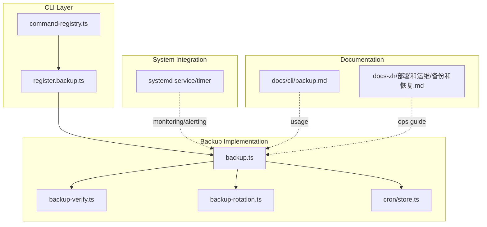
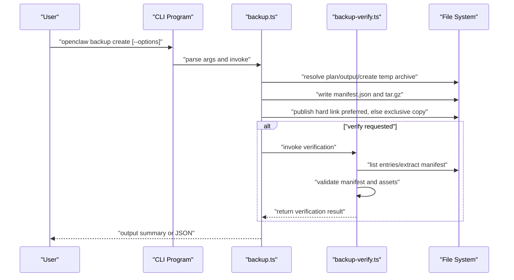
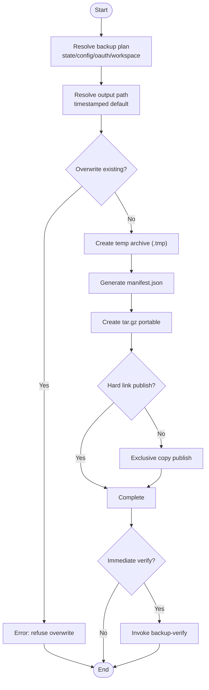
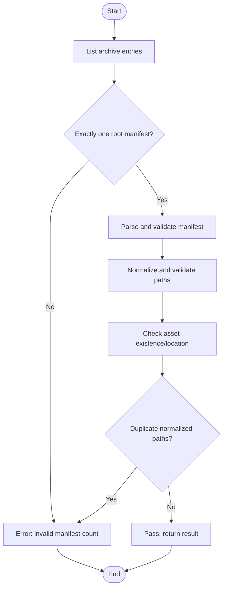
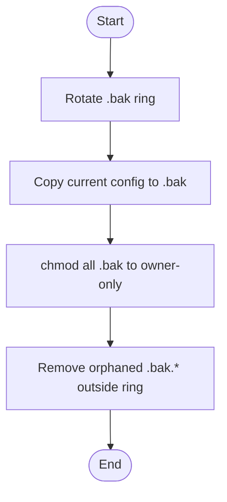
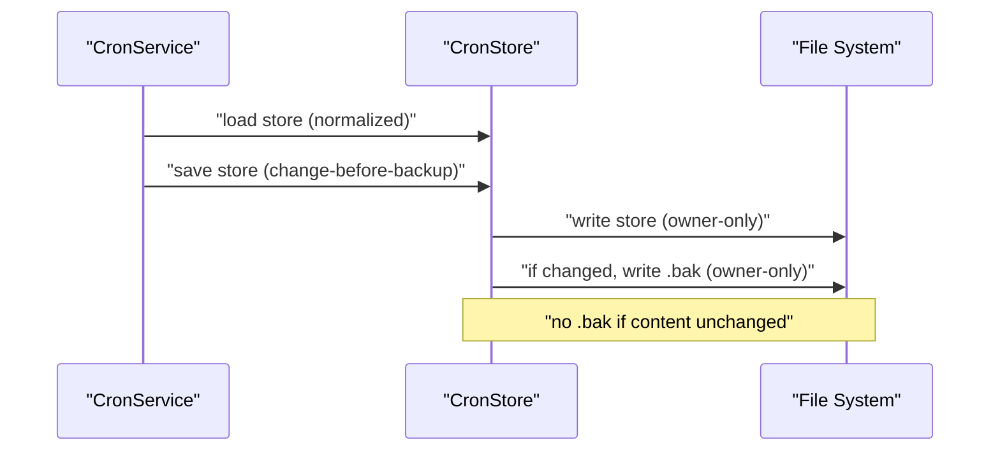
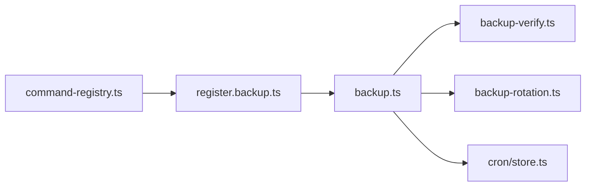

# Backup & Recovery

<cite>
**Referenced Files in This Document**
- [backup.ts](file://src/commands/backup.ts)
- [backup-verify.ts](file://src/commands/backup-verify.ts)
- [backup-shared.ts](file://src/commands/backup-shared.ts)
- [backup-rotation.ts](file://src/config/backup-rotation.ts)
- [store.ts](file://src/cron/store.ts)
- [backup.md](file://docs/cli/backup.md)
- [backup.md (Chinese)](file://docs-zh/部署和运维/备份和恢复.md)
- [agent-workspace.md](file://docs/concepts/agent-workspace.md)
- [index.md (Gateway Security)](file://docs/gateway/security/index.md)
- [openclaw-auth-monitor.service](file://scripts/systemd/openclaw-auth-monitor.service)
- [openclaw-auth-monitor.timer](file://scripts/systemd/openclaw-auth-monitor.timer)
</cite>

## Table of Contents
1. [Introduction](#introduction)
2. [Project Structure](#project-structure)
3. [Core Components](#core-components)
4. [Architecture Overview](#architecture-overview)
5. [Detailed Component Analysis](#detailed-component-analysis)
6. [Dependency Analysis](#dependency-analysis)
7. [Performance Considerations](#performance-considerations)
8. [Troubleshooting Guide](#troubleshooting-guide)
9. [Conclusion](#conclusion)
10. [Appendices](#appendices)

## Introduction
This document provides comprehensive backup and recovery guidance for OpenClaw production environments. It covers strategies for backing up configuration files, session data, credentials, and agent workspaces; outlines automated backup scheduling and retention; describes backup verification procedures; and details recovery procedures for disk corruption, accidental deletion, and system migration. It also includes disaster recovery planning, cross-region replication strategies, and business continuity procedures, along with encryption, secure storage requirements, and compliance considerations.

## Project Structure
OpenClaw’s backup and recovery capabilities are implemented primarily through:
- CLI commands for creating and verifying backups
- Shared utilities for building backup plans and archive layouts
- Verification logic for ensuring archive integrity
- Configuration backup rotation and permission hardening
- Cron store backup and secure file handling
- Documentation for CLI usage and operational procedures
- Security guidance for sensitive data on disk

**Diagram sources**
- [backup.ts](file://src/commands/backup.ts#L274-L383)
- [backup-verify.ts](file://src/commands/backup-verify.ts#L279-L325)
- [backup-rotation.ts](file://src/config/backup-rotation.ts#L16-L125)
- [store.ts](file://src/cron/store.ts#L63-L106)
- [openclaw-auth-monitor.service](file://scripts/systemd/openclaw-auth-monitor.service#L1-L15)
- [openclaw-auth-monitor.timer](file://scripts/systemd/openclaw-auth-monitor.timer#L1-L11)
- [backup.md](file://docs/cli/backup.md#L1-L77)
- [backup.md (Chinese)](file://docs-zh/部署和运维/备份和恢复.md#L54-L92)

**Section sources**
- [backup.ts](file://src/commands/backup.ts#L274-L383)
- [backup-verify.ts](file://src/commands/backup-verify.ts#L279-L325)
- [backup-rotation.ts](file://src/config/backup-rotation.ts#L16-L125)
- [store.ts](file://src/cron/store.ts#L63-L106)
- [backup.md](file://docs/cli/backup.md#L1-L77)
- [backup.md (Chinese)](file://docs-zh/部署和运维/备份和恢复.md#L44-L92)

## Core Components
- Backup archive creation and manifest generation
  - Builds a backup plan from state directory, config file, credentials directory, and optional workspaces
  - Writes a manifest and creates a portable tar.gz archive
  - Publishes via hard link when supported; otherwise exclusive copy
  - Supports dry-run, immediate verification, and selective inclusion/exclusion
- Archive verification
  - Validates manifest schema, archive root, and entry paths
  - Ensures assets exist in the payload and no duplicates
- Configuration backup rotation and permissions
  - Circular rotation of .bak and numbered .bak.1..N-1
  - Hardens permissions to owner-only on all .bak files
  - Cleans orphaned .bak.* files outside the rotation window
- Cron store backup and secure file handling
  - Creates .bak on change when content differs
  - Enforces owner-only permissions on store and .bak
  - Initializes directory permissions to owner-only
- CLI usage and operational guidance
  - Provides command-line options and usage patterns
  - Documents what is included/excluded and invalid config behavior

**Section sources**
- [backup.ts](file://src/commands/backup.ts#L20-L78)
- [backup.ts](file://src/commands/backup.ts#L80-L170)
- [backup.ts](file://src/commands/backup.ts#L192-L233)
- [backup.ts](file://src/commands/backup.ts#L274-L383)
- [backup-verify.ts](file://src/commands/backup-verify.ts#L14-L52)
- [backup-verify.ts](file://src/commands/backup-verify.ts#L62-L90)
- [backup-verify.ts](file://src/commands/backup-verify.ts#L218-L253)
- [backup-verify.ts](file://src/commands/backup-verify.ts#L279-L325)
- [backup-rotation.ts](file://src/config/backup-rotation.ts#L16-L62)
- [backup-rotation.ts](file://src/config/backup-rotation.ts#L72-L109)
- [backup-rotation.ts](file://src/config/backup-rotation.ts#L115-L125)
- [store.ts](file://src/cron/store.ts#L59-L75)
- [backup.md](file://docs/cli/backup.md#L1-L77)

## Architecture Overview
The backup and recovery pipeline integrates CLI invocation, archive creation, verification, and operational safeguards.

**Diagram sources**
- [backup.ts](file://src/commands/backup.ts#L274-L383)
- [backup-verify.ts](file://src/commands/backup-verify.ts#L279-L325)

**Section sources**
- [backup.ts](file://src/commands/backup.ts#L274-L383)
- [backup-verify.ts](file://src/commands/backup-verify.ts#L279-L325)

## Detailed Component Analysis

### Component A: Backup Archive Creation and Manifest
- Backup plan resolution
  - Resolves state directory, config path, OAuth directory, and workspace directories
  - Handles only-config mode and workspace exclusion
  - Canonicalizes paths and deduplicates overlapping sources
- Output path selection
  - Defaults to a timestamped archive in current working directory or home directory
  - Rejects writing inside any source path
- Temporary archive and publishing
  - Writes to a temporary file and publishes atomically
  - Prefers hard link; falls back to exclusive copy when hard links are unsupported
- Manifest generation
  - Captures schema version, creation time, archive root, runtime/platform/node versions, options, paths, assets, and skipped items

**Diagram sources**
- [backup.ts](file://src/commands/backup.ts#L80-L170)
- [backup.ts](file://src/commands/backup.ts#L192-L233)
- [backup.ts](file://src/commands/backup.ts#L274-L383)

**Section sources**
- [backup.ts](file://src/commands/backup.ts#L80-L170)
- [backup.ts](file://src/commands/backup.ts#L192-L233)
- [backup.ts](file://src/commands/backup.ts#L274-L383)
- [backup-shared.ts](file://src/commands/backup-shared.ts#L106-L254)

### Component B: Archive Verification
- Entry enumeration and manifest extraction
- Path normalization and validation
  - Relative paths, forward slashes, no traversal, and containment within archive root
- Asset existence checks
  - Every asset declared in the manifest must exist in the archive payload
- Duplicate detection and single-root manifest enforcement

**Diagram sources**
- [backup-verify.ts](file://src/commands/backup-verify.ts#L173-L183)
- [backup-verify.ts](file://src/commands/backup-verify.ts#L218-L253)
- [backup-verify.ts](file://src/commands/backup-verify.ts#L279-L325)

**Section sources**
- [backup-verify.ts](file://src/commands/backup-verify.ts#L14-L52)
- [backup-verify.ts](file://src/commands/backup-verify.ts#L62-L90)
- [backup-verify.ts](file://src/commands/backup-verify.ts#L218-L253)
- [backup-verify.ts](file://src/commands/backup-verify.ts#L279-L325)

### Component C: Configuration Backup Rotation and Permissions
- Circular rotation of .bak and numbered .bak.1..N-1
- Permission hardening to owner-only on all .bak files
- Cleanup of orphaned .bak.* files outside the managed rotation

**Diagram sources**
- [backup-rotation.ts](file://src/config/backup-rotation.ts#L16-L36)
- [backup-rotation.ts](file://src/config/backup-rotation.ts#L115-L125)

**Section sources**
- [backup-rotation.ts](file://src/config/backup-rotation.ts#L16-L62)
- [backup-rotation.ts](file://src/config/backup-rotation.ts#L72-L109)
- [backup-rotation.ts](file://src/config/backup-rotation.ts#L115-L125)

### Component D: Cron Store Backup and Secure File Handling
- Change-before-backup behavior
  - Creates .bak only when content differs
- Secure file modes
  - Store and .bak are set to owner-only
  - Directory permissions initialized to owner-only on first creation
- Atomic replacement with retries and fallbacks

**Diagram sources**
- [store.ts](file://src/cron/store.ts#L24-L53)
- [store.ts](file://src/cron/store.ts#L63-L75)
- [store.ts](file://src/cron/store.ts#L111-L131)

**Section sources**
- [store.ts](file://src/cron/store.ts#L59-L75)
- [store.ts](file://src/cron/store.ts#L111-L131)

### Component E: CLI Commands and Options
- backup create
  - Options: --output, --json, --dry-run, --verify, --only-config, --no-include-workspace
  - Behavior: resolve plan, output path, write manifest, pack, publish, optional verification
- backup verify
  - Options: --json
  - Behavior: validate manifest, paths, assets, duplicates

**Section sources**
- [backup.md](file://docs/cli/backup.md#L1-L77)

## Dependency Analysis
- CLI registration and dispatch
  - Centralized command registry delegates to backup-specific registration
- Backup implementation dependencies
  - backup.ts depends on shared utilities for plan resolution and archive layout
  - backup-verify.ts is independent but shares the manifest format
- Configuration rotation and cron store
  - backup-rotation.ts supports configuration write-back safety
  - cron/store.ts ensures secure persistence and backup of scheduled job store

**Diagram sources**
- [backup.ts](file://src/commands/backup.ts#L10-L17)
- [backup-verify.ts](file://src/commands/backup-verify.ts#L1-L5)
- [backup-rotation.ts](file://src/config/backup-rotation.ts#L1-L10)
- [store.ts](file://src/cron/store.ts#L1-L10)

**Section sources**
- [backup.ts](file://src/commands/backup.ts#L10-L17)
- [backup-verify.ts](file://src/commands/backup-verify.ts#L1-L5)
- [backup-rotation.ts](file://src/config/backup-rotation.ts#L1-L10)
- [store.ts](file://src/cron/store.ts#L1-L10)

## Performance Considerations
- Large workspaces dominate archive size; use --no-include-workspace or --only-config to reduce size
- Compression and I/O: gzip compression and portable packaging minimize cross-platform issues
- Publishing strategy: hard link preferred; exclusive copy fallback when hard links are unsupported
- Verification cost: --verify or backup verify re-scans the archive, adding CPU and I/O overhead
- Concurrency: avoid simultaneous large backups; ensure sufficient disk space and manage concurrent processes

**Section sources**
- [backup.md](file://docs/cli/backup.md#L63-L77)
- [backup.ts](file://src/commands/backup.ts#L359-L366)

## Troubleshooting Guide
Common errors and resolutions:
- Refuse to overwrite existing backup: change output path or remove existing archive
- Output path inside a source tree: select a different output directory or file path
- Empty archive: confirm included assets exist and are not filtered out
- Root manifest count != 1: inspect archive structure and manifest placement
- Path traversal or illegal paths: ensure entries are relative, use forward slashes, and do not traverse
- Missing assets: verify manifest declarations match archive payload
- Duplicate entries: eliminate duplicates prior to archiving

Operational checks:
- Use --dry-run and --json to preview backup plans
- Run backup verify on critical archives
- Confirm output directory permissions and available disk space
- Validate permission behavior differences across Windows/macOS/Linux

Configuration rotation and cron store:
- Confirm .bak and .bak.N exist and have correct permissions
- Verify orphaned .bak.* cleanup occurred
- Cron store: .bak created only when content changes; owner-only enforced

**Section sources**
- [backup.ts](file://src/commands/backup.ts#L115-L126)
- [backup.ts](file://src/commands/backup.ts#L290-L306)
- [backup-verify.ts](file://src/commands/backup-verify.ts#L284-L302)
- [backup-verify.ts](file://src/commands/backup-verify.ts#L312-L324)
- [backup-rotation.ts](file://src/config/backup-rotation.ts#L44-L62)
- [store.ts](file://src/cron/store.ts#L59-L75)

## Conclusion
OpenClaw provides robust local backup and recovery capabilities through CLI-driven archive creation, manifest-based verification, configuration rotation, and secure file handling. Combined with documented recovery procedures and operational guidance, these components enable reliable daily backups, disaster recovery, and multi-environment synchronization in production environments.

## Appendices

### A. Backup Strategies for Configuration, Sessions, Credentials, and Workspaces
- Configuration files
  - Use configuration rotation and permission hardening; selectively back up only the active config with --only-config
- Session data
  - Default inclusion of state directory; exclude workspaces for smaller archives with --no-include-workspace
- Credentials and OAuth
  - Backed up via state directory and credentials directory discovery; protect with owner-only permissions
- Agent workspaces
  - Included by default; exclude with --no-include-workspace; consider workspace-specific backup cadence

**Section sources**
- [backup.md](file://docs/cli/backup.md#L34-L47)
- [backup-shared.ts](file://src/commands/backup-shared.ts#L106-L254)
- [backup-rotation.ts](file://src/config/backup-rotation.ts#L16-L125)

### B. Automated Backup Scheduling and Retention
- Local automation
  - Use backup create with --dry-run, --verify, --output, and --only-config
  - Integrate into CI/CD or system scripts
- Systemd timers
  - Use authentication monitor service and timer for periodic checks and alerting
- Retention policy
  - Configuration rotation maintains N historical .bak files with owner-only permissions
  - Cron store maintains .bak on content changes with secure permissions

**Section sources**
- [backup.md](file://docs/cli/backup.md#L13-L31)
- [openclaw-auth-monitor.service](file://scripts/systemd/openclaw-auth-monitor.service#L1-L15)
- [openclaw-auth-monitor.timer](file://scripts/systemd/openclaw-auth-monitor.timer#L1-L11)
- [backup-rotation.ts](file://src/config/backup-rotation.ts#L16-L125)
- [store.ts](file://src/cron/store.ts#L63-L106)

### C. Backup Verification Procedures
- Immediate verification
  - Use --verify with backup create to validate after archive creation
- Post-facto verification
  - Use backup verify <archive> to validate manifest and payload integrity
- Validation coverage
  - Manifest schema and fields, archive root, path normalization, asset presence, and duplicate detection

**Section sources**
- [backup.md](file://docs/cli/backup.md#L25-L31)
- [backup-verify.ts](file://src/commands/backup-verify.ts#L218-L253)
- [backup-verify.ts](file://src/commands/backup-verify.ts#L279-L325)

### D. Recovery Procedures
- Complete recovery
  - Verify archive with backup verify; unpack manifest.json and payload to target environment
- Selective recovery
  - Restore only configuration (--only-config) or state directory; exclude workspaces as needed
- Version rollback
  - Use configuration rotation: .bak is the last write-back snapshot; numbered .bak.1..N-1 are historical versions
- Migration and multi-environment synchronization
  - Use archives as snapshots for environment transfers; consult session pruning and mirroring guidance for consistency

**Section sources**
- [backup-verify.ts](file://src/commands/backup-verify.ts#L279-L325)
- [backup-rotation.ts](file://src/config/backup-rotation.ts#L16-L125)
- [backup.md (Chinese)](file://docs-zh/部署和运维/备份和恢复.md#L469-L485)

### E. Disaster Recovery, Cross-Region Replication, and Business Continuity
- Disaster recovery
  - Restore from the latest valid archive; if config is damaged, restore configuration first with --only-config
- Cross-region replication
  - Transfer validated archives across regions; maintain manifest-driven layout for portability
- Business continuity
  - Combine frequent incremental backups with periodic full archive snapshots; schedule verification and rotation

**Section sources**
- [backup.md (Chinese)](file://docs-zh/部署和运维/备份和恢复.md#L469-L485)

### F. Encryption, Secure Storage, and Compliance
- Sensitive data on disk
  - Assume anything under the state directory may contain secrets; include tokens, provider settings, and private messages
- Secure storage requirements
  - Enforce owner-only permissions on files and directories
  - Use full-disk encryption on hosts
  - Prefer dedicated OS accounts for gateways on shared hosts
- Compliance considerations
  - Redact logs and transcripts where applicable
  - Apply retention policies aligned with organizational and regulatory requirements
  - Maintain audit trails for access and modifications

**Section sources**
- [index.md (Gateway Security)](file://docs/gateway/security/index.md#L827-L851)

### G. Additional Operational Guidance
- Workspace backup and migration
  - Treat workspace as private memory; use private repositories for git-based backup
  - Migrate workspaces by cloning the repository and pointing agents to the new workspace path
- Session data hygiene
  - Review session pruning and mirroring guidance to maintain consistency across environments

**Section sources**
- [agent-workspace.md](file://docs/concepts/agent-workspace.md#L119-L237)
- [backup.md (Chinese)](file://docs-zh/部署和运维/备份和恢复.md#L481-L485)