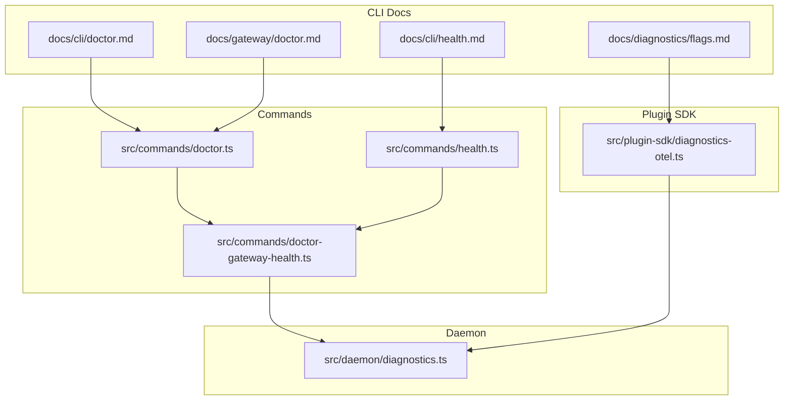
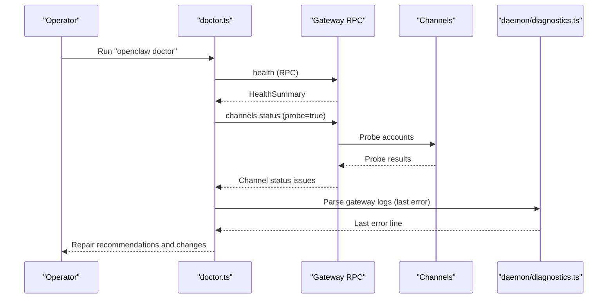
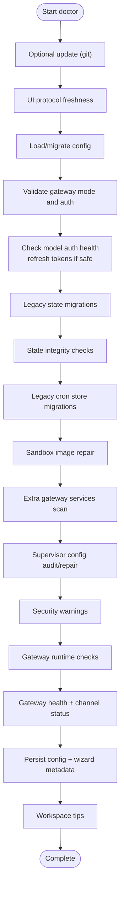
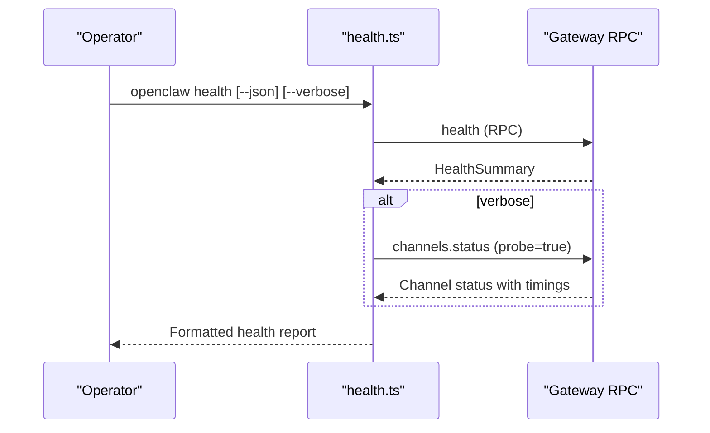
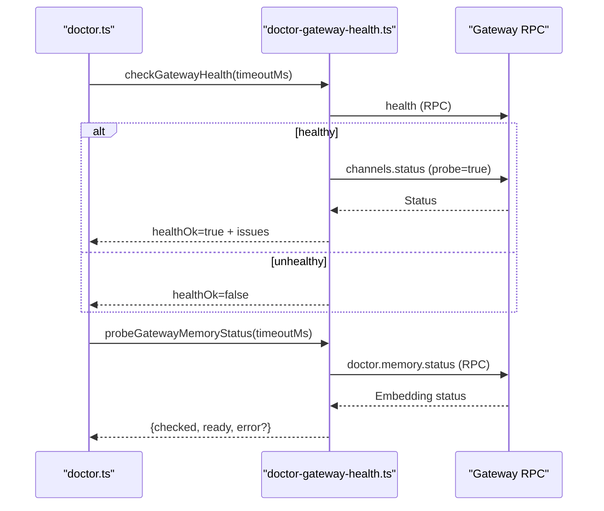
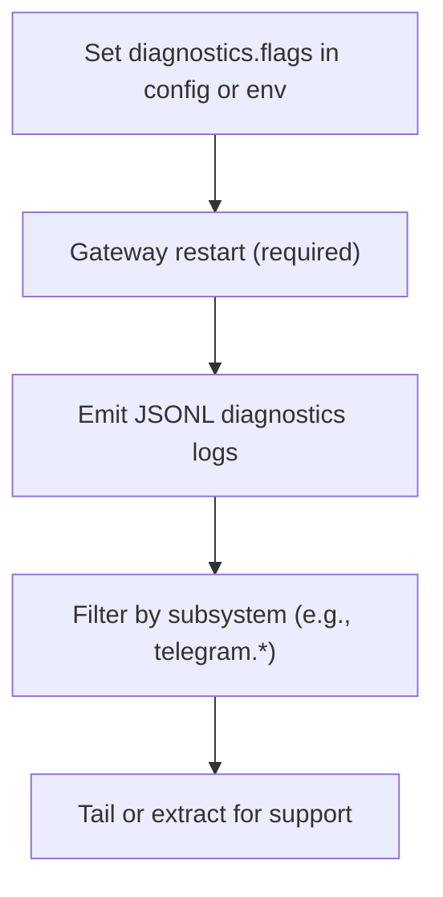
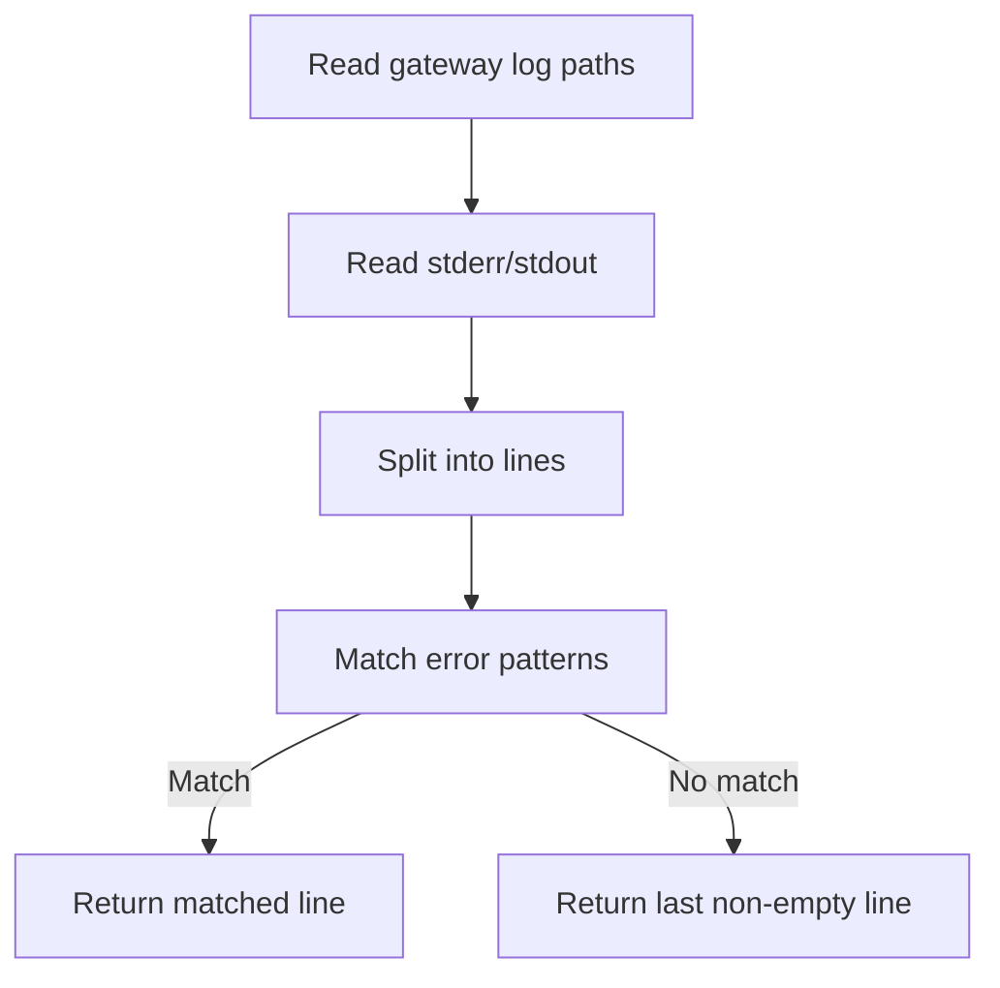
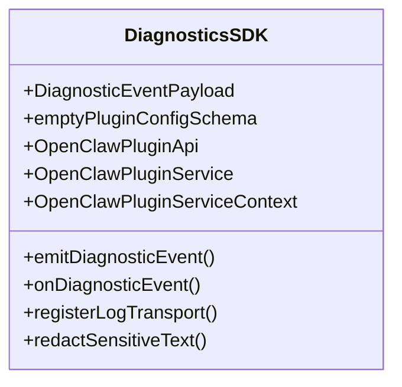
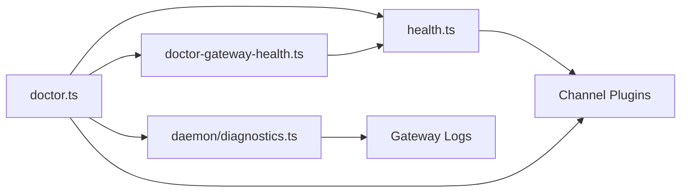

# Health Monitoring & Diagnostics

<cite>
**Referenced Files in This Document**
- [docs/cli/doctor.md](file://docs/cli/doctor.md)
- [docs/cli/health.md](file://docs/cli/health.md)
- [docs/diagnostics/flags.md](file://docs/diagnostics/flags.md)
- [docs/gateway/doctor.md](file://docs/gateway/doctor.md)
- [src/commands/doctor.ts](file://src/commands/doctor.ts)
- [src/commands/doctor-gateway-health.ts](file://src/commands/doctor-gateway-health.ts)
- [src/commands/health.ts](file://src/commands/health.ts)
- [src/daemon/diagnostics.ts](file://src/daemon/diagnostics.ts)
- [src/plugin-sdk/diagnostics-otel.ts](file://src/plugin-sdk/diagnostics-otel.ts)
</cite>

## Table of Contents
1. [Introduction](#introduction)
2. [Project Structure](#project-structure)
3. [Core Components](#core-components)
4. [Architecture Overview](#architecture-overview)
5. [Detailed Component Analysis](#detailed-component-analysis)
6. [Dependency Analysis](#dependency-analysis)
7. [Performance Considerations](#performance-considerations)
8. [Troubleshooting Guide](#troubleshooting-guide)
9. [Conclusion](#conclusion)
10. [Appendices](#appendices)

## Introduction
This document describes health monitoring and diagnostics for OpenClaw production systems. It focuses on the doctor command for automated health checks, configuration migrations, and repair procedures; the health command for runtime diagnostics; and supporting mechanisms for diagnostics flags, service probes, and operational observability. It also covers best practices for monitoring, alerting, and automated remediation grounded in the repository’s implementation and documentation.

## Project Structure
OpenClaw exposes CLI-driven health and diagnostics capabilities:
- CLI references define doctor and health usage and flags.
- Command implementations orchestrate health checks, channel probes, and gateway RPC calls.
- Daemon diagnostics assist in parsing gateway logs for common startup/runtime errors.
- Plugin SDK surfaces a narrow diagnostics interface for telemetry and logging transport.

**Diagram sources**
- [docs/cli/doctor.md](file://docs/cli/doctor.md#L1-L46)
- [docs/cli/health.md](file://docs/cli/health.md#L1-L22)
- [docs/diagnostics/flags.md](file://docs/diagnostics/flags.md#L1-L92)
- [docs/gateway/doctor.md](file://docs/gateway/doctor.md#L1-L331)
- [src/commands/doctor.ts](file://src/commands/doctor.ts#L1-L370)
- [src/commands/health.ts](file://src/commands/health.ts#L1-L752)
- [src/commands/doctor-gateway-health.ts](file://src/commands/doctor-gateway-health.ts#L1-L93)
- [src/daemon/diagnostics.ts](file://src/daemon/diagnostics.ts#L1-L45)
- [src/plugin-sdk/diagnostics-otel.ts](file://src/plugin-sdk/diagnostics-otel.ts#L1-L14)

**Section sources**
- [docs/cli/doctor.md](file://docs/cli/doctor.md#L1-L46)
- [docs/cli/health.md](file://docs/cli/health.md#L1-L22)
- [docs/diagnostics/flags.md](file://docs/diagnostics/flags.md#L1-L92)
- [docs/gateway/doctor.md](file://docs/gateway/doctor.md#L1-L331)
- [src/commands/doctor.ts](file://src/commands/doctor.ts#L1-L370)
- [src/commands/health.ts](file://src/commands/health.ts#L1-L752)
- [src/commands/doctor-gateway-health.ts](file://src/commands/doctor-gateway-health.ts#L1-L93)
- [src/daemon/diagnostics.ts](file://src/daemon/diagnostics.ts#L1-L45)
- [src/plugin-sdk/diagnostics-otel.ts](file://src/plugin-sdk/diagnostics-otel.ts#L1-L14)

## Core Components
- Doctor command orchestrates:
  - Optional preflight updates for git installs.
  - UI protocol freshness checks.
  - Health checks and restart prompts.
  - Skills status summaries.
  - Config normalization and legacy key migrations.
  - Legacy state migrations (sessions, agent dirs, WhatsApp auth).
  - Cron store migrations.
  - State integrity and permissions checks.
  - Model auth health (OAuth expiry, refresh).
  - Sandbox image repair.
  - Service migrations and extra gateway detection.
  - Security warnings and systemd linger checks.
  - Gateway runtime checks (best practices, port diagnostics).
  - Gateway auth readiness checks and token generation.
  - Channel status warnings via gateway RPC.
  - Supervisor config audit and repair.
  - Persistence of config changes and wizard metadata.
  - Workspace tips and memory system suggestions.
- Health command fetches and formats:
  - Gateway health via RPC.
  - Per-channel account probes (optional).
  - Agent heartbeat and session store summaries.
  - Formatted output with optional JSON and verbose modes.
- Daemon diagnostics:
  - Parses gateway logs to surface last error lines and common failure patterns.
- Diagnostics flags:
  - Targeted debug logging via config or environment.
  - JSONL log file emission with redaction controls.
- Plugin SDK diagnostics:
  - Exposes diagnostic event emission and log transport registration for telemetry plugins.

**Section sources**
- [src/commands/doctor.ts](file://src/commands/doctor.ts#L73-L370)
- [src/commands/health.ts](file://src/commands/health.ts#L525-L752)
- [src/commands/doctor-gateway-health.ts](file://src/commands/doctor-gateway-health.ts#L16-L93)
- [src/daemon/diagnostics.ts](file://src/daemon/diagnostics.ts#L27-L44)
- [docs/diagnostics/flags.md](file://docs/diagnostics/flags.md#L1-L92)
- [src/plugin-sdk/diagnostics-otel.ts](file://src/plugin-sdk/diagnostics-otel.ts#L1-L14)

## Architecture Overview
The health and diagnostics architecture integrates CLI commands, gateway RPC, and daemon-side log parsing.

**Diagram sources**
- [src/commands/doctor.ts](file://src/commands/doctor.ts#L316-L335)
- [src/commands/doctor-gateway-health.ts](file://src/commands/doctor-gateway-health.ts#L16-L65)
- [src/daemon/diagnostics.ts](file://src/daemon/diagnostics.ts#L27-L44)

## Detailed Component Analysis

### Doctor Command Workflow
The doctor command coordinates a series of checks and optional repairs. It:
- Initializes prompts and environment.
- Optionally updates git installations.
- Checks UI protocol freshness and source install issues.
- Loads and migrates configuration.
- Validates gateway mode and auth configuration.
- Repairs deprecated CLI auth profiles and OAuth profile IDs.
- Probes model auth health and refreshes expiring tokens when safe.
- Migrates legacy state and cron stores.
- Verifies state integrity and session locks.
- Checks sandbox images and platform-specific notes.
- Scans for extra gateway services and audits supervisor configs.
- Surfaces security warnings and systemd linger requirements.
- Runs gateway health and channel status probes.
- Optionally generates a gateway token when missing and SecretRef is not used.
- Persists configuration changes and records wizard metadata.
- Suggests workspace backup and memory system.

**Diagram sources**
- [src/commands/doctor.ts](file://src/commands/doctor.ts#L73-L370)

**Section sources**
- [src/commands/doctor.ts](file://src/commands/doctor.ts#L73-L370)
- [docs/gateway/doctor.md](file://docs/gateway/doctor.md#L14-L331)

### Health Command and Gateway Probes
The health command:
- Calls the running gateway via RPC to retrieve a HealthSummary.
- Supports JSON output and verbose mode to include per-account timings.
- Formats channel health lines, agent heartbeat intervals, and session store summaries.
- Uses channel plugins to probe enabled and configured accounts.
- Emits diagnostics in a readable or machine-readable format.

**Diagram sources**
- [src/commands/health.ts](file://src/commands/health.ts#L525-L752)

**Section sources**
- [src/commands/health.ts](file://src/commands/health.ts#L525-L752)
- [docs/cli/health.md](file://docs/cli/health.md#L1-L22)

### Gateway Health and Memory Status Probes
The gateway health module:
- Builds connection details and performs a health check.
- On success, probes channel status and collects issues.
- Attempts a memory readiness probe via a dedicated RPC method and reports embedding readiness.

**Diagram sources**
- [src/commands/doctor.ts](file://src/commands/doctor.ts#L316-L327)
- [src/commands/doctor-gateway-health.ts](file://src/commands/doctor-gateway-health.ts#L16-L93)

**Section sources**
- [src/commands/doctor-gateway-health.ts](file://src/commands/doctor-gateway-health.ts#L16-L93)

### Diagnostics Flags and Log Extraction
Diagnostics flags enable targeted debug logs without globally increasing verbosity:
- Flags are opt-in, case-insensitive, and support wildcards.
- Enable via config or environment override.
- Logs are written to a JSONL file with optional redaction.
- Provide extraction and filtering guidance for specific subsystems.

**Diagram sources**
- [docs/diagnostics/flags.md](file://docs/diagnostics/flags.md#L1-L92)

**Section sources**
- [docs/diagnostics/flags.md](file://docs/diagnostics/flags.md#L1-L92)

### Daemon Diagnostics: Parsing Gateway Logs
The daemon diagnostics utility:
- Reads gateway log paths from environment.
- Scans stderr/stdout for common error patterns indicating binding/auth/startup failures.
- Falls back to the last log line if no pattern match.

**Diagram sources**
- [src/daemon/diagnostics.ts](file://src/daemon/diagnostics.ts#L27-L44)

**Section sources**
- [src/daemon/diagnostics.ts](file://src/daemon/diagnostics.ts#L1-L45)

### Plugin SDK Diagnostics Surface
The diagnostics-otel plugin SDK exposes:
- Diagnostic event payload types and emitter.
- Event subscription mechanism.
- Log transport registration for telemetry plugins.
- Redaction utilities.
- Minimal plugin configuration schema.

**Diagram sources**
- [src/plugin-sdk/diagnostics-otel.ts](file://src/plugin-sdk/diagnostics-otel.ts#L1-L14)

**Section sources**
- [src/plugin-sdk/diagnostics-otel.ts](file://src/plugin-sdk/diagnostics-otel.ts#L1-L14)

## Dependency Analysis
- Doctor depends on:
  - Config loading and migration.
  - Gateway connection details and RPC calls.
  - Channel plugins for account probing.
  - Daemon service resolution and supervisor audits.
  - Platform-specific notes and sandbox checks.
- Health depends on:
  - Gateway RPC for HealthSummary.
  - Channel plugins for account probes.
  - Session store and heartbeat summaries.
- Daemon diagnostics depends on:
  - Gateway log paths derived from environment.
  - Pattern-based error detection.

**Diagram sources**
- [src/commands/doctor.ts](file://src/commands/doctor.ts#L1-L370)
- [src/commands/health.ts](file://src/commands/health.ts#L1-L752)
- [src/commands/doctor-gateway-health.ts](file://src/commands/doctor-gateway-health.ts#L1-L93)
- [src/daemon/diagnostics.ts](file://src/daemon/diagnostics.ts#L1-L45)

**Section sources**
- [src/commands/doctor.ts](file://src/commands/doctor.ts#L1-L370)
- [src/commands/health.ts](file://src/commands/health.ts#L1-L752)
- [src/commands/doctor-gateway-health.ts](file://src/commands/doctor-gateway-health.ts#L1-L93)
- [src/daemon/diagnostics.ts](file://src/daemon/diagnostics.ts#L1-L45)

## Performance Considerations
- Health checks are bounded by timeouts configurable per command.
- Verbose mode adds per-account channel probes, increasing latency.
- Memory readiness probe targets embedding subsystem health.
- Prefer non-verbose health checks for routine monitoring; reserve verbose for targeted investigations.
- Limit diagnostics flags to specific subsystems to reduce log volume.

[No sources needed since this section provides general guidance]

## Troubleshooting Guide
Common scenarios and remedies:
- Gateway not running:
  - Use doctor to check health and optionally restart the gateway.
  - Review last gateway error lines for binding/auth/startup issues.
- Channel connectivity problems:
  - Doctor surfaces channel status warnings with suggested fixes.
  - Use verbose health to see per-account timings and statuses.
- Configuration issues:
  - Run doctor with repair flags to normalize legacy keys and apply safe migrations.
  - Review wizard metadata and backups after changes.
- Authentication and OAuth:
  - Doctor checks model auth profiles and can refresh expiring tokens when safe.
  - For token-based auth, doctor can generate tokens when SecretRef is not used.
- Port conflicts:
  - Doctor detects port collisions and suggests causes (already running gateway, SSH tunnels).
- Security posture:
  - Doctor flags dangerous policies and open DM configurations.
- Systemd linger (Linux):
  - Doctor ensures lingering is enabled for user services to keep the gateway alive after logout.

**Section sources**
- [src/commands/doctor.ts](file://src/commands/doctor.ts#L316-L335)
- [src/commands/doctor-gateway-health.ts](file://src/commands/doctor-gateway-health.ts#L38-L62)
- [src/daemon/diagnostics.ts](file://src/daemon/diagnostics.ts#L27-L44)
- [docs/gateway/doctor.md](file://docs/gateway/doctor.md#L292-L331)

## Conclusion
OpenClaw’s health monitoring and diagnostics combine a robust doctor command for automated checks and repairs, a concise health command for runtime diagnostics, and complementary mechanisms for targeted logging and log parsing. Operators can maintain system reliability through regular doctor runs, targeted verbose health checks, and disciplined use of diagnostics flags and log extraction.

[No sources needed since this section summarizes without analyzing specific files]

## Appendices

### Health Check Endpoints and Probes
- HealthSummary RPC payload includes:
  - ok flag, timestamps, durations, channel maps, agent summaries, and session store details.
- Channel probes:
  - Enabled and configured accounts are probed; failures are surfaced with status and error details.
- Memory readiness:
  - Dedicated RPC returns embedding readiness and optional error details.

**Section sources**
- [src/commands/health.ts](file://src/commands/health.ts#L47-L72)
- [src/commands/health.ts](file://src/commands/health.ts#L427-L441)
- [src/commands/doctor-gateway-health.ts](file://src/commands/doctor-gateway-health.ts#L67-L93)

### Monitoring Best Practices
- Schedule periodic doctor runs in non-interactive mode for automation.
- Use verbose health during incident response to gather per-account timings.
- Apply diagnostics flags selectively to reduce noise and focus on suspected subsystems.
- Monitor gateway logs via the diagnostics utility for recurring startup or binding failures.

**Section sources**
- [docs/cli/doctor.md](file://docs/cli/doctor.md#L26-L34)
- [docs/cli/health.md](file://docs/cli/health.md#L18-L22)
- [docs/diagnostics/flags.md](file://docs/diagnostics/flags.md#L87-L92)
- [src/daemon/diagnostics.ts](file://src/daemon/diagnostics.ts#L27-L44)

### Alerting Strategies and Automated Remediation
- Alert on:
  - Persistent gateway unreachability.
  - Frequent channel probe failures.
  - Recurring last gateway error patterns.
- Remediate:
  - Automatically trigger doctor with repair flags upon detecting specific error patterns.
  - Rotate tokens or regenerate gateway tokens when auth health indicates expiration.
  - Enforce systemd linger for user services to prevent unintended shutdowns.

**Section sources**
- [src/commands/doctor.ts](file://src/commands/doctor.ts#L135-L196)
- [src/commands/doctor-gateway-health.ts](file://src/commands/doctor-gateway-health.ts#L38-L62)
- [src/daemon/diagnostics.ts](file://src/daemon/diagnostics.ts#L4-L10)