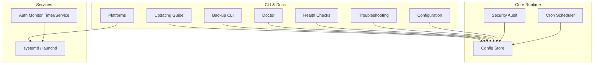
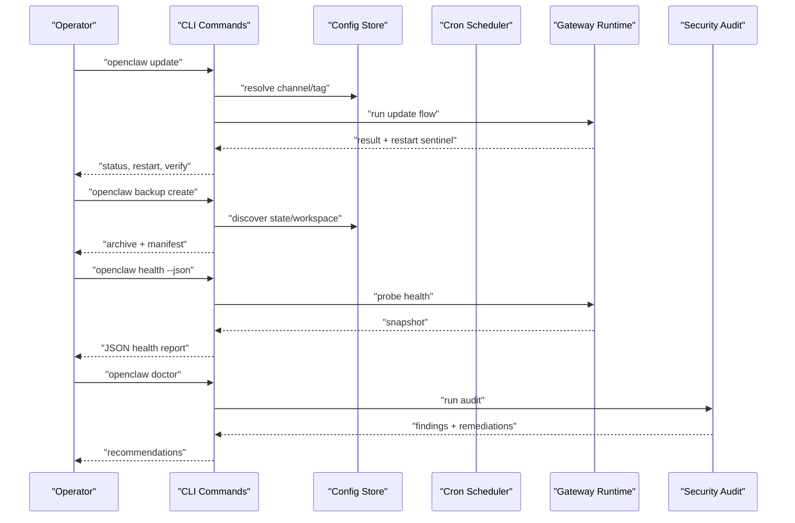
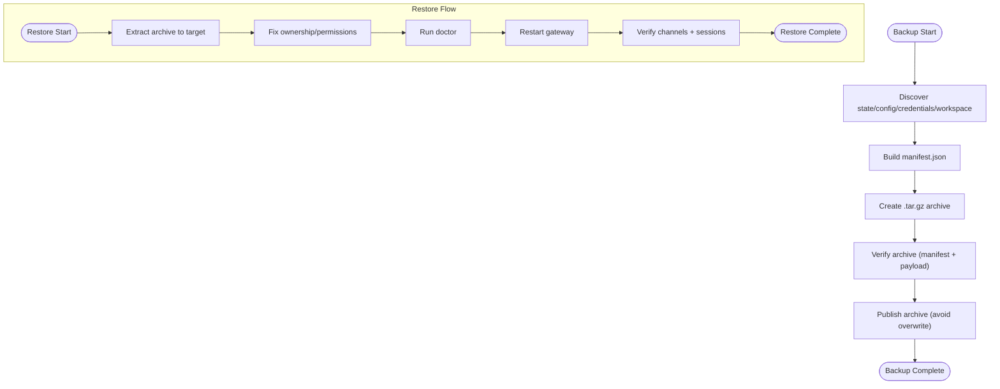
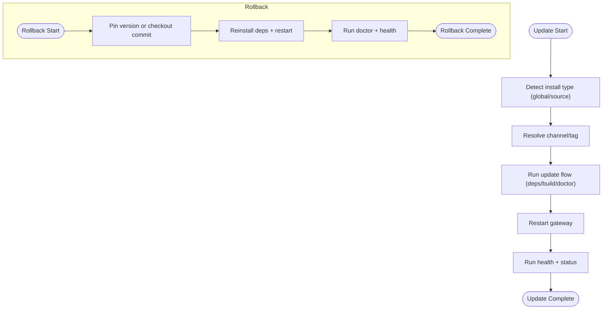
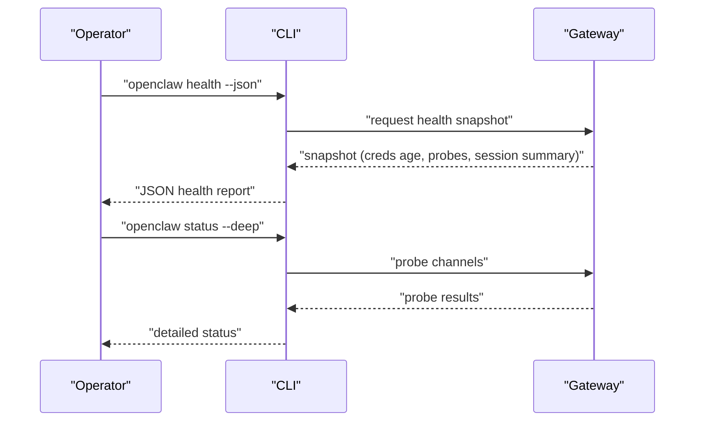
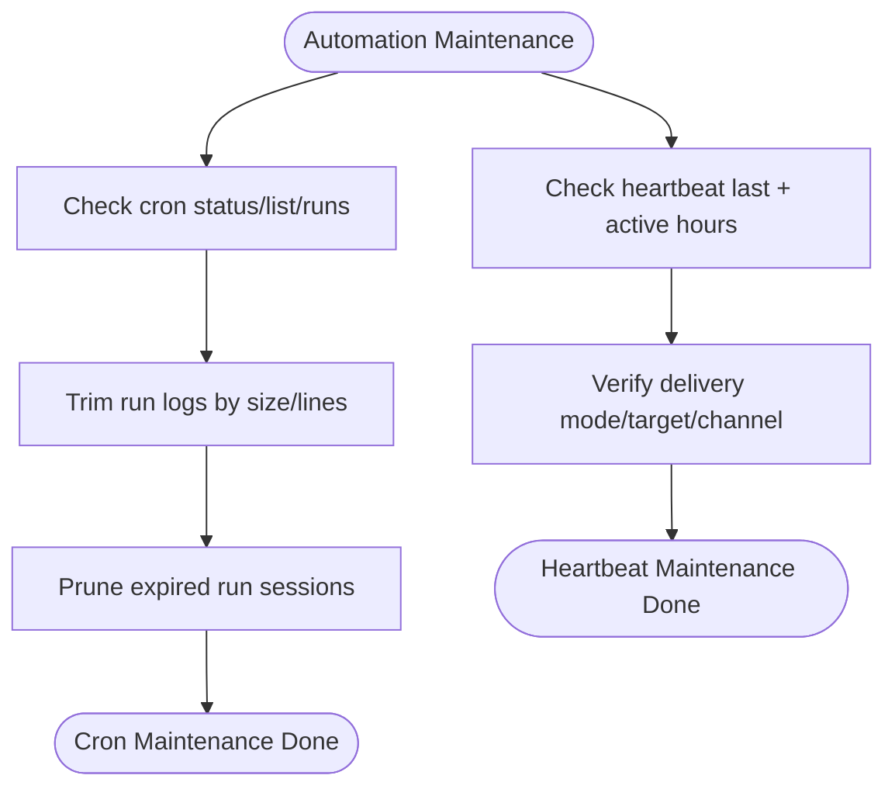
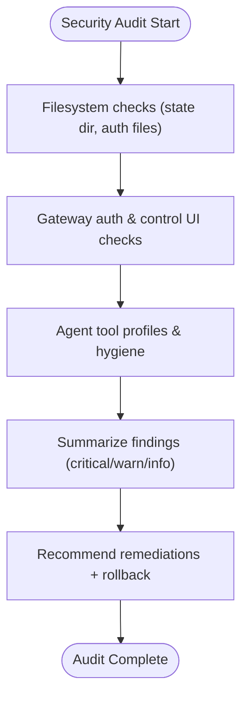
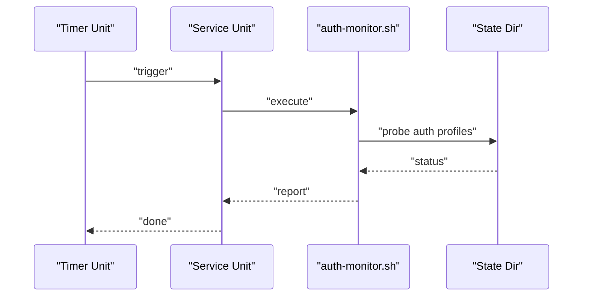
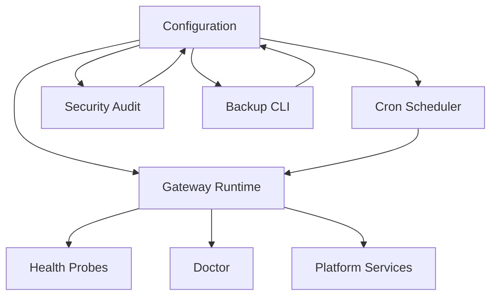

# Maintenance & Operations

<cite>
**Referenced Files in This Document**
- [updating.md](file://docs/install/updating.md)
- [migrating.md](file://docs/install/migrating.md)
- [backup.md](file://docs/cli/backup.md)
- [doctor.md](file://docs/gateway/doctor.md)
- [health.md](file://docs/gateway/health.md)
- [troubleshooting.md](file://docs/help/troubleshooting.md)
- [cron-jobs.md](file://docs/automation/cron-jobs.md)
- [automation-troubleshooting.md](file://docs/automation/troubleshooting.md)
- [configuration.md](file://docs/gateway/configuration.md)
- [platforms-index.md](file://docs/platforms/index.md)
- [SKILL.md](file://skills/healthcheck/SKILL.md)
- [backup-rotation.ts](file://src/config/backup-rotation.ts)
- [status.command.ts](file://src/cli/status.command.ts)
- [update-startup.ts](file://src/infra/update-startup.ts)
- [update-command.ts](file://src/cli/update-cli/update-command.ts)
- [audit.ts](file://src/security/audit.ts)
- [audit-extra.async.ts](file://src/security/audit-extra.async.ts)
- [audit-extra.sync.ts](file://src/security/audit-extra.sync.ts)
- [openclaw-auth-monitor.service](file://scripts/systemd/openclaw-auth-monitor.service)
- [openclaw-auth-monitor.timer](file://scripts/systemd/openclaw-auth-monitor.timer)
- [auth-monitor.sh](file://scripts/auth-monitor.sh)
</cite>

## Table of Contents
1. [Introduction](#introduction)
2. [Project Structure](#project-structure)
3. [Core Components](#core-components)
4. [Architecture Overview](#architecture-overview)
5. [Detailed Component Analysis](#detailed-component-analysis)
6. [Dependency Analysis](#dependency-analysis)
7. [Performance Considerations](#performance-considerations)
8. [Troubleshooting Guide](#troubleshooting-guide)
9. [Conclusion](#conclusion)
10. [Appendices](#appendices)

## Introduction
This document provides comprehensive maintenance and operations guidance for OpenClaw production systems. It covers routine maintenance, backup and restore, system updates, operational runbooks for common issues, performance tuning, capacity planning, automated maintenance tasks, health checks, diagnostics, disaster recovery, data migration, system hardening, operational security, access controls, and compliance monitoring.

## Project Structure
OpenClaw’s operational surface spans CLI commands, configuration, automation (cron/heartbeat), platform services (systemd/launchd), and security auditing. Operational tasks are documented across:
- Installation and update procedures
- Backup and restore strategies
- Migration between hosts
- Health checks and diagnostics
- Automation troubleshooting
- Security audits and hardening
- Platform-specific service installation and lifecycle

**Diagram sources**
- [updating.md](file://docs/install/updating.md#L1-L258)
- [backup.md](file://docs/cli/backup.md#L1-L77)
- [doctor.md](file://docs/gateway/doctor.md#L1-L331)
- [health.md](file://docs/gateway/health.md#L1-L36)
- [troubleshooting.md](file://docs/help/troubleshooting.md#L1-L298)
- [configuration.md](file://docs/gateway/configuration.md#L1-L547)
- [platforms-index.md](file://docs/platforms/index.md#L1-L54)
- [audit.ts](file://src/security/audit.ts#L87-L1129)

**Section sources**
- [updating.md](file://docs/install/updating.md#L1-L258)
- [backup.md](file://docs/cli/backup.md#L1-L77)
- [doctor.md](file://docs/gateway/doctor.md#L1-L331)
- [health.md](file://docs/gateway/health.md#L1-L36)
- [troubleshooting.md](file://docs/help/troubleshooting.md#L1-L298)
- [configuration.md](file://docs/gateway/configuration.md#L1-L547)
- [platforms-index.md](file://docs/platforms/index.md#L1-L54)

## Core Components
- Configuration and hot reload: centralized JSON5 configuration with strict validation and hot-reload modes.
- Automation: cron scheduler and heartbeat with diagnostics and troubleshooting.
- Health and diagnostics: CLI health snapshots, status summaries, and channel probes.
- Backup and restore: CLI backup creation and verification with manifest validation.
- Updates and rollbacks: installer-driven updates, channel switching, and rollback strategies.
- Security auditing: comprehensive audit with filesystem checks, channel security, and remediation guidance.
- Platform services: service installation and lifecycle across macOS/Linux/Windows environments.

**Section sources**
- [configuration.md](file://docs/gateway/configuration.md#L349-L447)
- [cron-jobs.md](file://docs/automation/cron-jobs.md#L449-L494)
- [health.md](file://docs/gateway/health.md#L1-L36)
- [backup.md](file://docs/cli/backup.md#L1-L77)
- [updating.md](file://docs/install/updating.md#L1-L258)
- [audit.ts](file://src/security/audit.ts#L87-L1129)

## Architecture Overview
Operational flows integrate CLI commands, configuration, automation, and platform services. Updates and backups leverage configuration and state directories; health and diagnostics probe runtime and channel connectivity; security audits validate configuration and filesystem state.

**Diagram sources**
- [updating.md](file://docs/install/updating.md#L113-L140)
- [backup.md](file://docs/cli/backup.md#L13-L21)
- [health.md](file://docs/gateway/health.md#L17-L36)
- [doctor.md](file://docs/gateway/doctor.md#L1-L331)

## Detailed Component Analysis

### Backup and Restore Strategies
- Backup creation: produces a timestamped archive with a manifest, includes state, config, credentials, and optionally workspace. Verification validates the manifest and payload integrity.
- Restore guidance: use the archived manifest to locate and extract assets; ensure correct ownership and permissions; run doctor to normalize config and repair services.
- Disaster recovery: maintain offsite encrypted archives; validate restore on a staging host before production; verify channel logins and session continuity.

**Diagram sources**
- [backup.md](file://docs/cli/backup.md#L13-L77)
- [migrating.md](file://docs/install/migrating.md#L68-L132)

**Section sources**
- [backup.md](file://docs/cli/backup.md#L1-L77)
- [migrating.md](file://docs/install/migrating.md#L1-L193)

### System Updates and Rollbacks
- Preferred update path: re-run installer to upgrade in place; supports global installs and source installs.
- Channel switching: update command supports stable/beta/dev channels; dry-run previews changes.
- Rollback: pin to a known-good version or checkout a historical commit; restart and run doctor.
- Post-update verification: run doctor, restart gateway, and health checks.

**Diagram sources**
- [updating.md](file://docs/install/updating.md#L113-L140)
- [update-startup.ts](file://src/infra/update-startup.ts#L156-L482)
- [update-command.ts](file://src/cli/update-cli/update-command.ts#L348-L679)

**Section sources**
- [updating.md](file://docs/install/updating.md#L1-L258)
- [update-startup.ts](file://src/infra/update-startup.ts#L156-L482)
- [update-command.ts](file://src/cli/update-cli/update-command.ts#L348-L679)

### Health Checks and Diagnostics
- CLI health: request a health snapshot from the running gateway; includes per-channel probes and session summaries.
- Status and deep diagnostics: status family commands provide runtime reachability, heartbeat, session store paths, and channel probe results.
- Channel-specific guidance: credentials age, session store presence, and relink flows for common failure modes.

**Diagram sources**
- [health.md](file://docs/gateway/health.md#L17-L36)
- [status.command.ts](file://src/cli/status.command.ts#L318-L358)

**Section sources**
- [health.md](file://docs/gateway/health.md#L1-L36)
- [status.command.ts](file://src/cli/status.command.ts#L318-L358)

### Automation Maintenance (Cron and Heartbeat)
- Cron maintenance: session retention pruning, run-log trimming, and performance tuning recommendations.
- Heartbeat and cron troubleshooting: diagnostics for disabled scheduler, timezone gotchas, and delivery suppression.
- Operational runbooks: step-by-step commands to diagnose and resolve automation issues.

**Diagram sources**
- [cron-jobs.md](file://docs/automation/cron-jobs.md#L449-L494)
- [automation-troubleshooting.md](file://docs/automation/troubleshooting.md#L14-L123)

**Section sources**
- [cron-jobs.md](file://docs/automation/cron-jobs.md#L449-L494)
- [automation-troubleshooting.md](file://docs/automation/troubleshooting.md#L1-L123)

### Security Auditing and Hardening
- Security audit: comprehensive checks including filesystem permissions, browser control UI, gateway auth, and agent tool profiles.
- Hardening guidance: align host posture to risk tolerance, preserve access, and provide remediation plans with rollback strategies.
- Compliance monitoring: use audit findings to track remediations and maintain posture reports.

**Diagram sources**
- [audit.ts](file://src/security/audit.ts#L87-L1129)
- [audit-extra.async.ts](file://src/security/audit-extra.async.ts#L1028-L1067)
- [audit-extra.sync.ts](file://src/security/audit-extra.sync.ts#L1070-L1105)
- [SKILL.md](file://skills/healthcheck/SKILL.md#L1-L175)

**Section sources**
- [audit.ts](file://src/security/audit.ts#L87-L1129)
- [audit-extra.async.ts](file://src/security/audit-extra.async.ts#L1028-L1067)
- [audit-extra.sync.ts](file://src/security/audit-extra.sync.ts#L1070-L1105)
- [SKILL.md](file://skills/healthcheck/SKILL.md#L1-L175)

### Automated Maintenance Tasks and Auth Monitoring
- Auth monitor timer/service: systemd-based timer triggers a monitoring script to validate authentication states and report anomalies.
- Best-effort backup maintenance: rotates config backups, creates .bak, hardens permissions, and prunes orphaned backups.

**Diagram sources**
- [openclaw-auth-monitor.timer](file://scripts/systemd/openclaw-auth-monitor.timer)
- [openclaw-auth-monitor.service](file://scripts/systemd/openclaw-auth-monitor.service)
- [auth-monitor.sh](file://scripts/auth-monitor.sh)
- [backup-rotation.ts](file://src/config/backup-rotation.ts#L16-L125)

**Section sources**
- [openclaw-auth-monitor.timer](file://scripts/systemd/openclaw-auth-monitor.timer)
- [openclaw-auth-monitor.service](file://scripts/systemd/openclaw-auth-monitor.service)
- [auth-monitor.sh](file://scripts/auth-monitor.sh)
- [backup-rotation.ts](file://src/config/backup-rotation.ts#L16-L125)

### Capacity Planning and Performance Tuning
- Cron footprint: tune session retention and run-log limits to control IO and cleanup overhead; monitor high-frequency schedulers.
- Heartbeat and automation: ensure active hours and timezone alignment; avoid delivery suppression due to quiet-hours or busy lanes.
- Platform sizing: choose appropriate VM/storage for state directories; avoid cloud-synced or SD/eMMC-backed paths for performance.

**Section sources**
- [cron-jobs.md](file://docs/automation/cron-jobs.md#L463-L478)
- [automation-troubleshooting.md](file://docs/automation/troubleshooting.md#L95-L123)
- [doctor.md](file://docs/gateway/doctor.md#L192-L198)

### Disaster Recovery Procedures
- Pre-recovery: stop the gateway, archive state and workspace, encrypt backups, and store offsite.
- Recovery: restore to a clean host, ensure correct ownership, run doctor, restart gateway, and verify channels and sessions.
- Secrets handling: treat backups as production secrets; rotate keys if exposure suspected.

**Section sources**
- [migrating.md](file://docs/install/migrating.md#L70-L132)
- [doctor.md](file://docs/gateway/doctor.md#L170-L184)

### Data Migration Strategies
- Identify state directory and workspace; preserve profiles and environment variables.
- Use rsync/scp or tarballs; verify hidden directories and ownership; run doctor on the new host.

**Section sources**
- [migrating.md](file://docs/install/migrating.md#L20-L132)

### Operational Security Measures, Access Controls, and Compliance Monitoring
- Access controls: enforce local token mode, SecretRef-aware repairs, and secure service installation.
- Compliance monitoring: use security audit to track posture, remediate findings, and maintain audit trails.

**Section sources**
- [configuration.md](file://docs/gateway/configuration.md#L285-L303)
- [audit.ts](file://src/security/audit.ts#L87-L1129)

## Dependency Analysis
Operational components depend on configuration, state directories, and platform services. Updates and backups depend on configuration validity; health and diagnostics depend on gateway reachability; automation depends on cron configuration and timezone settings.

**Diagram sources**
- [configuration.md](file://docs/gateway/configuration.md#L1-L547)
- [health.md](file://docs/gateway/health.md#L1-L36)
- [doctor.md](file://docs/gateway/doctor.md#L1-L331)
- [backup.md](file://docs/cli/backup.md#L1-L77)

**Section sources**
- [configuration.md](file://docs/gateway/configuration.md#L1-L547)
- [health.md](file://docs/gateway/health.md#L1-L36)
- [doctor.md](file://docs/gateway/doctor.md#L1-L331)
- [backup.md](file://docs/cli/backup.md#L1-L77)

## Performance Considerations
- Limit cron run logs and session retention to reduce IO overhead.
- Avoid excessive concurrent cron runs and noisy background jobs.
- Use appropriate storage for state directories; avoid cloud-synced or removable media.
- Align automation schedules with host timezone and active hours.

[No sources needed since this section provides general guidance]

## Troubleshooting Guide
- First 60 seconds ladder: status, gateway probe, gateway status, doctor, channels status, logs.
- Automation troubleshooting: cron status/list/runs, heartbeat last, active hours/timezone.
- Gateway service issues: service status, port collisions, and runtime diagnostics.
- Channel flow: pairing, allowlists, and mention gating.
- Node tools and browser tool failures: permission states, approvals, and executable paths.

**Section sources**
- [troubleshooting.md](file://docs/help/troubleshooting.md#L13-L298)
- [automation-troubleshooting.md](file://docs/automation/troubleshooting.md#L14-L123)

## Conclusion
OpenClaw’s operational model emphasizes safe updates, robust backups, comprehensive health checks, and security audits. By following the documented procedures for maintenance, automation, and hardening, operators can sustain reliable production deployments with clear runbooks for common issues and strong disaster recovery practices.

[No sources needed since this section summarizes without analyzing specific files]

## Appendices

### Appendix A: Platform Service Installation
- Install or repair the gateway service via wizard, CLI, or doctor; verify service labels per OS.

**Section sources**
- [platforms-index.md](file://docs/platforms/index.md#L41-L54)

### Appendix B: Configuration Hot Reload and Validation
- Strict JSON5 validation; hot reload modes; RPC rate limits for config updates.

**Section sources**
- [configuration.md](file://docs/gateway/configuration.md#L61-L73)
- [configuration.md](file://docs/gateway/configuration.md#L349-L447)