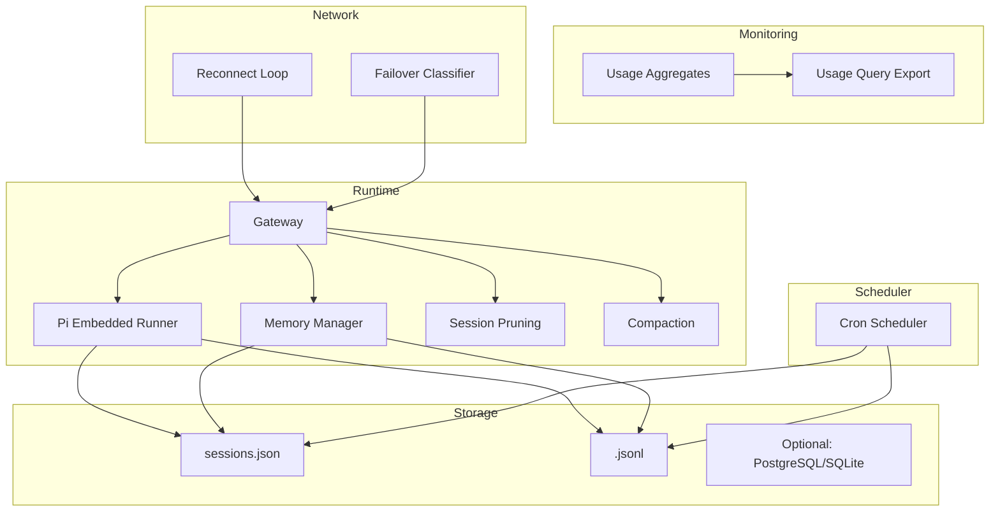
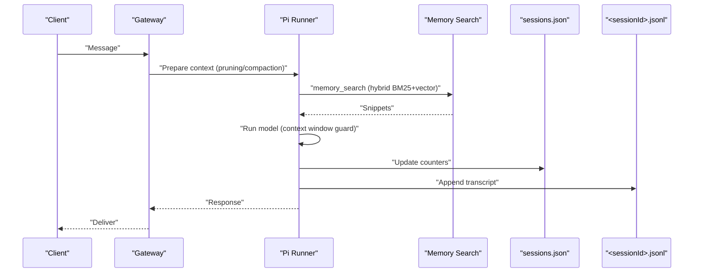
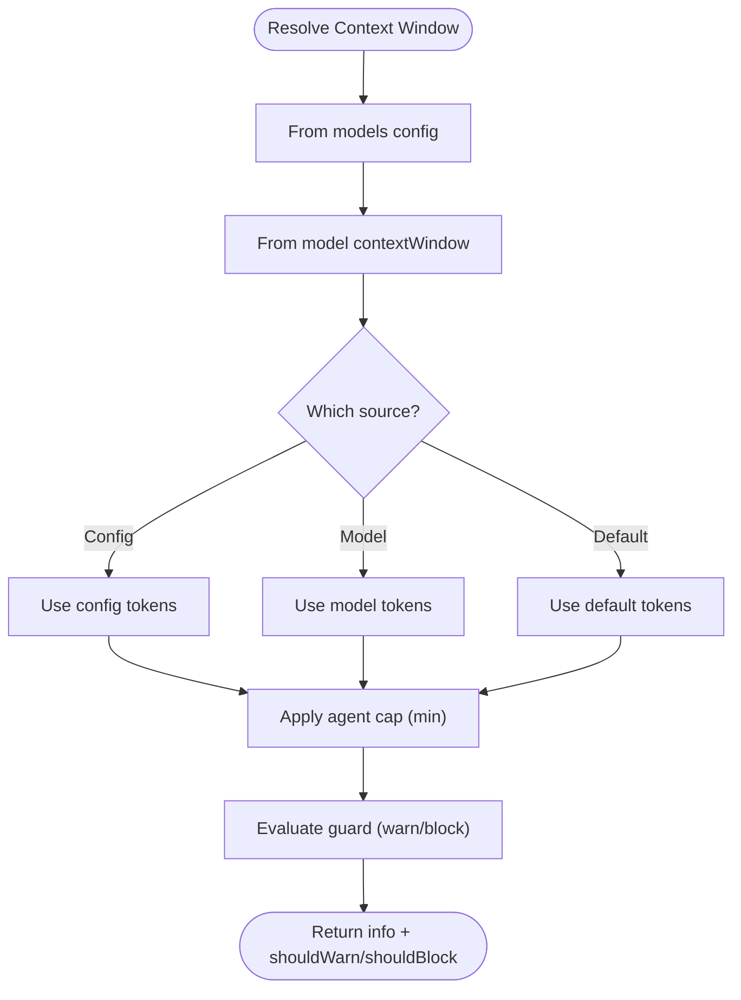
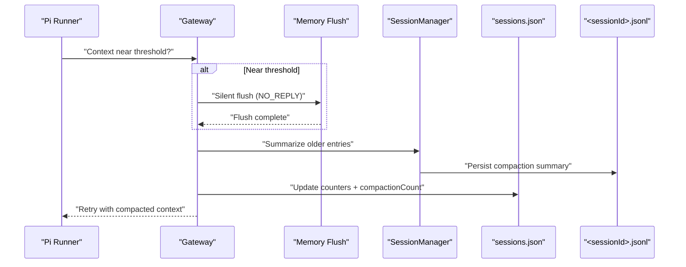
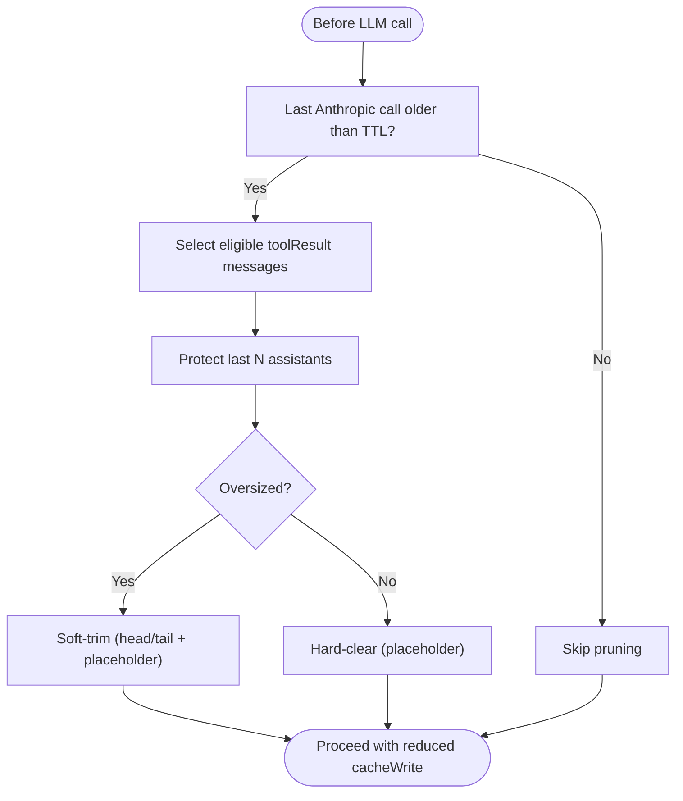
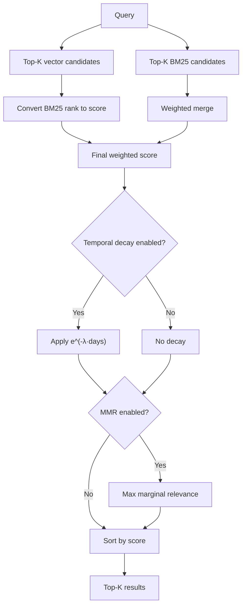
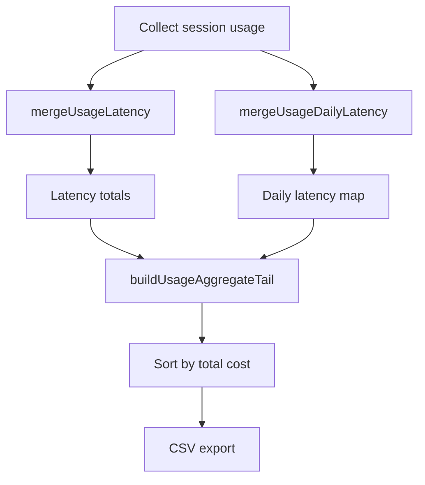
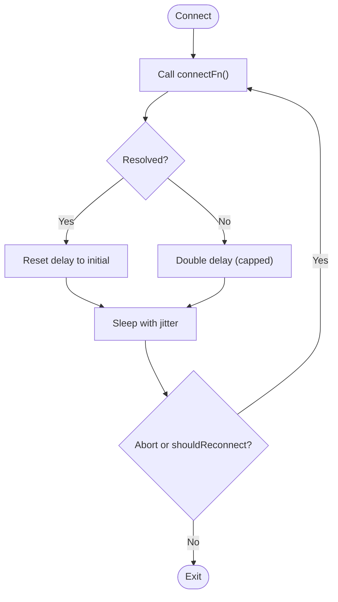
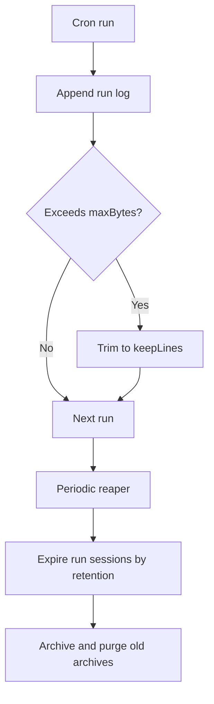
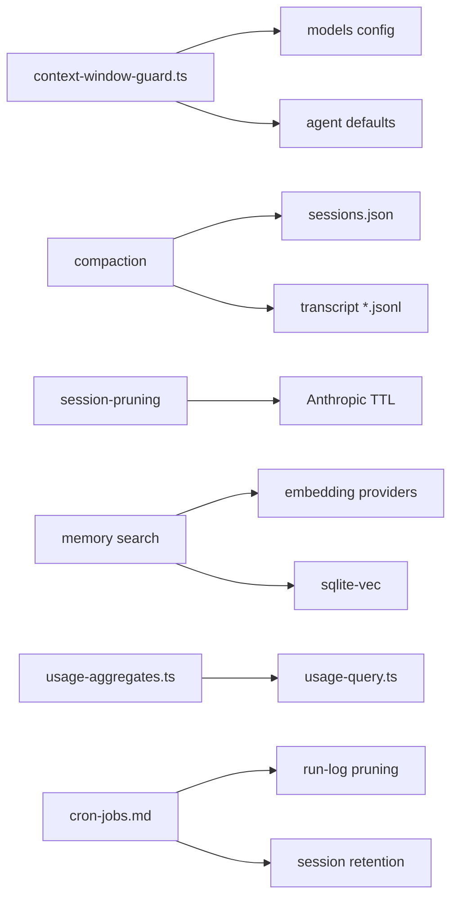

# Performance Tuning & Optimization

<cite>
**Referenced Files in This Document**
- [docs/concepts/memory.md](file://docs/concepts/memory.md)
- [docs/concepts/session-pruning.md](file://docs/concepts/session-pruning.md)
- [docs/concepts/compaction.md](file://docs/concepts/compaction.md)
- [docs/reference/session-management-compaction.md](file://docs/reference/session-management-compaction.md)
- [src/agents/context-window-guard.ts](file://src/agents/context-window-guard.ts)
- [src/agents/pi-embedded-runner/compact.ts](file://src/agents/pi-embedded-runner/compact.ts)
- [src/agents/pi-embedded-runner/run.ts](file://src/agents/pi-embedded-runner/run.ts)
- [src/auto-reply/reply/session-updates.ts](file://src/auto-reply/reply/session-updates.ts)
- [src/auto-reply/reply/reply-state.test.ts](file://src/auto-reply/reply/reply-state.test.ts)
- [src/shared/usage-aggregates.ts](file://src/shared/usage-aggregates.ts)
- [ui/src/ui/usage-query.ts](file://ui/src/ui/usage-query.ts)
- [ui/src/ui/usage-helpers.ts](file://ui/src/ui/usage-helpers.ts)
- [scripts/test-perf-budget.mjs](file://scripts/test-perf-budget.mjs)
- [extensions/mattermost/src/mattermost/reconnect.ts](file://extensions/mattermost/src/mattermost/reconnect.ts)
- [extensions/mattermost/src/mattermost/reconnect.test.ts](file://extensions/mattermost/src/mattermost/reconnect.test.ts)
- [src/agents/failover-error.ts](file://src/agents/failover-error.ts)
- [docs/automation/cron-jobs.md](file://docs/automation/cron-jobs.md)
- [docs/install/fly.md](file://docs/install/fly.md)
</cite>

## Table of Contents
1. [Introduction](#introduction)
2. [Project Structure](#project-structure)
3. [Core Components](#core-components)
4. [Architecture Overview](#architecture-overview)
5. [Detailed Component Analysis](#detailed-component-analysis)
6. [Dependency Analysis](#dependency-analysis)
7. [Performance Considerations](#performance-considerations)
8. [Troubleshooting Guide](#troubleshooting-guide)
9. [Conclusion](#conclusion)
10. [Appendices](#appendices)

## Introduction
This document provides production-focused performance tuning and optimization guidance for OpenClaw. It synthesizes repository-backed capabilities and operational patterns to help teams manage memory, context windows, compaction, pruning, storage, CPU/memory profiling, bottlenecks, scaling, network resilience, I/O, database query optimization, monitoring thresholds, baselines, and capacity planning.

## Project Structure
OpenClaw’s performance-relevant subsystems span:
- Memory and context management (workspace Markdown, vector memory, compaction, pruning)
- Session lifecycle and persistence (sessions.json, transcript JSONL, maintenance)
- Usage aggregation and UI query/export
- Network resilience and reconnection loops
- Cron scheduling and run-log maintenance
- Platform/container sizing and memory budgets

**Diagram sources**
- [docs/concepts/memory.md](file://docs/concepts/memory.md#L1-L741)
- [docs/concepts/session-pruning.md](file://docs/concepts/session-pruning.md#L1-L122)
- [docs/concepts/compaction.md](file://docs/concepts/compaction.md#L1-L105)
- [docs/reference/session-management-compaction.md](file://docs/reference/session-management-compaction.md#L1-L325)
- [src/shared/usage-aggregates.ts](file://src/shared/usage-aggregates.ts#L1-L109)
- [ui/src/ui/usage-query.ts](file://ui/src/ui/usage-query.ts#L100-L152)
- [extensions/mattermost/src/mattermost/reconnect.ts](file://extensions/mattermost/src/mattermost/reconnect.ts#L1-L103)
- [src/agents/failover-error.ts](file://src/agents/failover-error.ts#L151-L209)
- [docs/automation/cron-jobs.md](file://docs/automation/cron-jobs.md#L1-L686)

**Section sources**
- [docs/concepts/memory.md](file://docs/concepts/memory.md#L1-L741)
- [docs/concepts/session-pruning.md](file://docs/concepts/session-pruning.md#L1-L122)
- [docs/concepts/compaction.md](file://docs/concepts/compaction.md#L1-L105)
- [docs/reference/session-management-compaction.md](file://docs/reference/session-management-compaction.md#L1-L325)
- [src/shared/usage-aggregates.ts](file://src/shared/usage-aggregates.ts#L1-L109)
- [ui/src/ui/usage-query.ts](file://ui/src/ui/usage-query.ts#L100-L152)
- [extensions/mattermost/src/mattermost/reconnect.ts](file://extensions/mattermost/src/mattermost/reconnect.ts#L1-L103)
- [src/agents/failover-error.ts](file://src/agents/failover-error.ts#L151-L209)
- [docs/automation/cron-jobs.md](file://docs/automation/cron-jobs.md#L1-L686)

## Core Components
- Context window and guard: resolve model context window, enforce caps, and decide warnings/blocks.
- Compaction: summarize older history and persist summaries; pre-compaction memory flush; maintenance and eviction.
- Session pruning: transient trimming of tool results to reduce cache bloat for Anthropic TTL.
- Memory search: hybrid BM25/vector, temporal decay, MMR, embedding cache, sqlite-vec acceleration.
- Usage aggregation and UI export: latency, daily totals, cost, and CSV export.
- Network resilience: exponential backoff with jitter and abort handling.
- Cron maintenance: run-log pruning and session retention for high-volume schedulers.

**Section sources**
- [src/agents/context-window-guard.ts](file://src/agents/context-window-guard.ts#L21-L74)
- [docs/concepts/compaction.md](file://docs/concepts/compaction.md#L1-L105)
- [docs/reference/session-management-compaction.md](file://docs/reference/session-management-compaction.md#L68-L94)
- [docs/concepts/session-pruning.md](file://docs/concepts/session-pruning.md#L1-L122)
- [docs/concepts/memory.md](file://docs/concepts/memory.md#L376-L741)
- [src/shared/usage-aggregates.ts](file://src/shared/usage-aggregates.ts#L1-L109)
- [ui/src/ui/usage-query.ts](file://ui/src/ui/usage-query.ts#L100-L152)
- [extensions/mattermost/src/mattermost/reconnect.ts](file://extensions/mattermost/src/mattermost/reconnect.ts#L1-L103)
- [docs/automation/cron-jobs.md](file://docs/automation/cron-jobs.md#L445-L522)

## Architecture Overview
OpenClaw’s performance architecture centers on:
- Gateway-driven session state and persistence
- Embedded Pi runtime for agent execution and compaction
- Memory subsystem with vector and hybrid search
- Usage telemetry aggregation and UI export
- Resilient network connections and scheduler maintenance

**Diagram sources**
- [docs/concepts/session-pruning.md](file://docs/concepts/session-pruning.md#L13-L26)
- [docs/concepts/compaction.md](file://docs/concepts/compaction.md#L13-L26)
- [docs/concepts/memory.md](file://docs/concepts/memory.md#L386-L449)
- [docs/reference/session-management-compaction.md](file://docs/reference/session-management-compaction.md#L137-L181)

## Detailed Component Analysis

### Context Window and Guard
- Resolve context window from models config, model definition, or defaults.
- Enforce agent-level cap and emit warnings/blocks when approaching limits.
- Guard evaluation determines whether to warn or block based on thresholds.

**Diagram sources**
- [src/agents/context-window-guard.ts](file://src/agents/context-window-guard.ts#L21-L74)

**Section sources**
- [src/agents/context-window-guard.ts](file://src/agents/context-window-guard.ts#L21-L74)

### Compaction Lifecycle and Pre-Flush
- Auto-compaction triggers on overflow or when context usage exceeds a threshold.
- Pre-compaction memory flush writes durable memories to disk before summarization.
- Maintenance controls include eviction of archived artifacts, stale entries, and transcript files.

**Diagram sources**
- [docs/concepts/compaction.md](file://docs/concepts/compaction.md#L57-L68)
- [docs/reference/session-management-compaction.md](file://docs/reference/session-management-compaction.md#L283-L314)
- [src/agents/pi-embedded-runner/compact.ts](file://src/agents/pi-embedded-runner/compact.ts#L259-L277)

**Section sources**
- [docs/concepts/compaction.md](file://docs/concepts/compaction.md#L1-L105)
- [docs/reference/session-management-compaction.md](file://docs/reference/session-management-compaction.md#L68-L94)
- [docs/reference/session-management-compaction.md](file://docs/reference/session-management-compaction.md#L283-L314)
- [src/agents/pi-embedded-runner/compact.ts](file://src/agents/pi-embedded-runner/compact.ts#L259-L277)

### Session Pruning (Anthropic TTL-aware)
- Trims old tool results before LLM calls when cache TTL has expired.
- Protects recent assistant messages and avoids trimming image blocks.
- Soft/hard trimming ratios and minimum thresholds.

**Diagram sources**
- [docs/concepts/session-pruning.md](file://docs/concepts/session-pruning.md#L13-L26)
- [docs/concepts/session-pruning.md](file://docs/concepts/session-pruning.md#L59-L87)

**Section sources**
- [docs/concepts/session-pruning.md](file://docs/concepts/session-pruning.md#L1-L122)

### Memory Search: Hybrid, Temporal Decay, MMR, Cache, sqlite-vec
- Hybrid search merges vector similarity and BM25 keyword scoring.
- Optional temporal decay boosts recent memories; MMR diversifies results.
- Embedding cache and sqlite-vec acceleration reduce recomputation and I/O.

**Diagram sources**
- [docs/concepts/memory.md](file://docs/concepts/memory.md#L425-L451)
- [docs/concepts/memory.md](file://docs/concepts/memory.md#L516-L578)
- [docs/concepts/memory.md](file://docs/concepts/memory.md#L616-L634)
- [docs/concepts/memory.md](file://docs/concepts/memory.md#L677-L708)

**Section sources**
- [docs/concepts/memory.md](file://docs/concepts/memory.md#L386-L741)

### Usage Aggregation and UI Export
- Aggregate latency, daily totals, and costs; build sorted views for UI and CSV export.
- Query builder supports filtering by message counts and other session metrics.

**Diagram sources**
- [src/shared/usage-aggregates.ts](file://src/shared/usage-aggregates.ts#L32-L109)
- [ui/src/ui/usage-query.ts](file://ui/src/ui/usage-query.ts#L100-L152)
- [ui/src/ui/usage-helpers.ts](file://ui/src/ui/usage-helpers.ts#L227-L245)

**Section sources**
- [src/shared/usage-aggregates.ts](file://src/shared/usage-aggregates.ts#L1-L109)
- [ui/src/ui/usage-query.ts](file://ui/src/ui/usage-query.ts#L100-L152)
- [ui/src/ui/usage-helpers.ts](file://ui/src/ui/usage-helpers.ts#L227-L245)

### Network Resilience and Reconnection
- Exponential backoff with jitter and abort handling to stabilize connections.
- Test coverage validates backoff progression and reset behavior.

**Diagram sources**
- [extensions/mattermost/src/mattermost/reconnect.ts](file://extensions/mattermost/src/mattermost/reconnect.ts#L29-L76)
- [extensions/mattermost/src/mattermost/reconnect.test.ts](file://extensions/mattermost/src/mattermost/reconnect.test.ts#L50-L140)

**Section sources**
- [extensions/mattermost/src/mattermost/reconnect.ts](file://extensions/mattermost/src/mattermost/reconnect.ts#L1-L103)
- [extensions/mattermost/src/mattermost/reconnect.test.ts](file://extensions/mattermost/src/mattermost/reconnect.test.ts#L50-L140)

### Cron Scheduler Maintenance and Scaling
- Run-log pruning and session retention controls to manage IO and disk footprint.
- Recommendations for high-volume schedulers to bound logs and sessions.

**Diagram sources**
- [docs/automation/cron-jobs.md](file://docs/automation/cron-jobs.md#L445-L479)

**Section sources**
- [docs/automation/cron-jobs.md](file://docs/automation/cron-jobs.md#L445-L522)

## Dependency Analysis
- Context window guard depends on models configuration and agent defaults.
- Compaction relies on session store and transcript persistence; pre-flush depends on workspace writability.
- Memory search depends on embedding providers and sqlite-vec availability.
- Usage aggregation depends on session usage fields and UI query filters.
- Cron maintenance depends on run-log and session retention policies.

**Diagram sources**
- [src/agents/context-window-guard.ts](file://src/agents/context-window-guard.ts#L21-L74)
- [docs/concepts/compaction.md](file://docs/concepts/compaction.md#L1-L105)
- [docs/reference/session-management-compaction.md](file://docs/reference/session-management-compaction.md#L137-L181)
- [docs/concepts/session-pruning.md](file://docs/concepts/session-pruning.md#L1-L122)
- [docs/concepts/memory.md](file://docs/concepts/memory.md#L386-L741)
- [src/shared/usage-aggregates.ts](file://src/shared/usage-aggregates.ts#L1-L109)
- [ui/src/ui/usage-query.ts](file://ui/src/ui/usage-query.ts#L100-L152)
- [docs/automation/cron-jobs.md](file://docs/automation/cron-jobs.md#L445-L522)

**Section sources**
- [src/agents/context-window-guard.ts](file://src/agents/context-window-guard.ts#L21-L74)
- [docs/concepts/compaction.md](file://docs/concepts/compaction.md#L1-L105)
- [docs/reference/session-management-compaction.md](file://docs/reference/session-management-compaction.md#L137-L181)
- [docs/concepts/session-pruning.md](file://docs/concepts/session-pruning.md#L1-L122)
- [docs/concepts/memory.md](file://docs/concepts/memory.md#L386-L741)
- [src/shared/usage-aggregates.ts](file://src/shared/usage-aggregates.ts#L1-L109)
- [ui/src/ui/usage-query.ts](file://ui/src/ui/usage-query.ts#L100-L152)
- [docs/automation/cron-jobs.md](file://docs/automation/cron-jobs.md#L445-L522)

## Performance Considerations
- Memory and context
  - Tune compaction reserveTokens and keepRecentTokens to balance freshness and overhead.
  - Enable pre-compaction memory flush to avoid losing durable context during summarization.
  - Use session pruning for Anthropic TTL to reduce cacheWrite on first post-TTL requests.
- Memory search
  - Enable hybrid search and optional temporal decay/MRR for large, long-running daily-note histories.
  - Use embedding cache and sqlite-vec to reduce recomputation and I/O.
- Usage and monitoring
  - Aggregate latency and daily totals; export CSV for capacity planning.
  - Filter by message counts and other session metrics to isolate hotspots.
- Network and reliability
  - Use exponential backoff with jitter and abort handling to stabilize connections.
  - Classify transient vs permanent errors to avoid unnecessary retries.
- Scheduler and I/O
  - Bound run logs and session retention for high-volume cron to reduce IO churn.
- Platform sizing
  - Increase container memory for deployments under load; monitor for OOM conditions.

[No sources needed since this section provides general guidance]

## Troubleshooting Guide
- Context overflow and compaction spam
  - Verify model context window and compaction settings; reduce reserveTokens if too aggressive.
  - Enable session pruning to mitigate tool-result bloat.
- Silent turns leaking
  - Ensure assistant replies start with NO_REPLY and streaming suppression is active.
- Memory flush not occurring
  - Confirm workspace is writable and memory flush settings are enabled.
- Cron run logs growing large
  - Reduce run-log maxBytes and keepLines; shorten session retention.
- Network flakiness
  - Validate exponential backoff behavior and jitter configuration; confirm abort handling.
- Failover classification
  - Inspect error codes/statuses and classify as transient/permanent to guide retry/backoff.

**Section sources**
- [docs/reference/session-management-compaction.md](file://docs/reference/session-management-compaction.md#L316-L325)
- [docs/concepts/compaction.md](file://docs/concepts/compaction.md#L81-L105)
- [docs/concepts/session-pruning.md](file://docs/concepts/session-pruning.md#L73-L87)
- [docs/concepts/memory.md](file://docs/concepts/memory.md#L283-L310)
- [docs/automation/cron-jobs.md](file://docs/automation/cron-jobs.md#L463-L479)
- [extensions/mattermost/src/mattermost/reconnect.ts](file://extensions/mattermost/src/mattermost/reconnect.ts#L29-L76)
- [src/agents/failover-error.ts](file://src/agents/failover-error.ts#L151-L209)

## Conclusion
OpenClaw’s performance profile emerges from disciplined memory and context management, robust compaction and pruning, resilient networking, and operational controls for storage and scheduling. Teams should tune compaction and pruning to model constraints, leverage memory search optimizations, monitor usage aggregates, and scale platform resources thoughtfully to maintain responsiveness and cost efficiency.

[No sources needed since this section summarizes without analyzing specific files]

## Appendices

### Monitoring Thresholds and Baselines
- Latency and daily totals: use aggregated metrics to derive P95 and daily averages for alerting.
- Message counts: filter sessions by min/max messages to identify outliers.
- Cost attribution: aggregate by model/provider to track spend trends.

**Section sources**
- [src/shared/usage-aggregates.ts](file://src/shared/usage-aggregates.ts#L32-L109)
- [ui/src/ui/usage-helpers.ts](file://ui/src/ui/usage-helpers.ts#L227-L245)

### Capacity Planning Metrics
- Disk usage: sessions.json rotation, max entries, and per-agent transcript budgets.
- Cron footprint: run-log size and session retention windows.
- Container memory: ensure adequate heap for production workloads.

**Section sources**
- [docs/reference/session-management-compaction.md](file://docs/reference/session-management-compaction.md#L68-L94)
- [docs/automation/cron-jobs.md](file://docs/automation/cron-jobs.md#L445-L522)
- [docs/install/fly.md](file://docs/install/fly.md#L259-L277)

### Performance Budgets and Profiling
- Unit test performance budget enforcement with wall time and regression thresholds.
- Use CPU and memory profiling tools to identify hotspots; correlate with usage aggregates.

**Section sources**
- [scripts/test-perf-budget.mjs](file://scripts/test-perf-budget.mjs#L15-L55)
- [scripts/test-perf-budget.mjs](file://scripts/test-perf-budget.mjs#L98-L128)