# Service Management & Automation

<cite>
**Referenced Files in This Document**
- [systemd.ts](file://src/daemon/systemd.ts)
- [systemd-unit.ts](file://src/daemon/systemd-unit.ts)
- [systemd-linger.ts](file://src/daemon/systemd-linger.ts)
- [systemd-audit.ts](file://src/daemon/service-audit.ts)
- [launchd.ts](file://src/daemon/launchd.ts)
- [launchd-plist.ts](file://src/daemon/launchd-plist.ts)
- [schtasks.ts](file://src/daemon/schtasks.ts)
- [service.ts](file://src/daemon/service.ts)
- [service-types.ts](file://src/daemon/service-types.ts)
- [constants.ts](file://src/daemon/constants.ts)
- [inspect.ts](file://src/daemon/inspect.ts)
- [openclaw-auth-monitor.service](file://scripts/systemd/openclaw-auth-monitor.service)
- [openclaw-auth-monitor.timer](file://scripts/systemd/openclaw-auth-monitor.timer)
- [auth-monitor.sh](file://scripts/auth-monitor.sh)
- [install.sh](file://scripts/install.sh)
- [install.ps1](file://scripts/install.ps1)
- [render.mdx](file://docs/install/render.mdx)
- [fly.md](file://docs/install/fly.md)
- [railway.mdx](file://docs/install/railway.mdx)
- [ansible.md](file://docs/install/ansible.md)
</cite>

## Table of Contents
1. [Introduction](#introduction)
2. [Project Structure](#project-structure)
3. [Core Components](#core-components)
4. [Architecture Overview](#architecture-overview)
5. [Detailed Component Analysis](#detailed-component-analysis)
6. [Dependency Analysis](#dependency-analysis)
7. [Performance Considerations](#performance-considerations)
8. [Troubleshooting Guide](#troubleshooting-guide)
9. [Conclusion](#conclusion)
10. [Appendices](#appendices)

## Introduction
This document provides comprehensive service management and automation guidance for OpenClaw deployments. It covers daemon installation, configuration, and lifecycle management across Linux (systemd), macOS (launchd), and Windows (Task Scheduler). It also documents monitoring automation, alerting integration, self-healing mechanisms, configuration templates, deployment automation scripts, and health verification procedures. Security hardening and isolation practices are included to ensure robust and secure operations.

## Project Structure
OpenClaw’s service management spans platform-specific daemon integrations and cross-platform orchestration utilities:
- Platform adapters: systemd, launchd, and Windows Task Scheduler
- Cross-platform service orchestration and auditing
- Monitoring and alerting automation scripts
- Deployment templates and automation guides

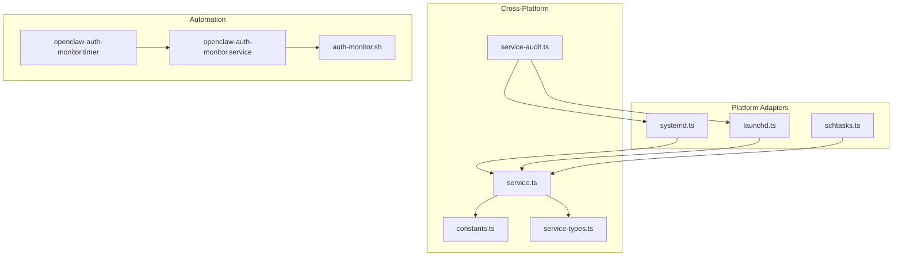

**Diagram sources**
- [systemd.ts](file://src/daemon/systemd.ts#L1-L713)
- [launchd.ts](file://src/daemon/launchd.ts#L1-L526)
- [schtasks.ts](file://src/daemon/schtasks.ts#L1-L369)
- [service.ts](file://src/daemon/service.ts#L1-L52)
- [service-audit.ts](file://src/daemon/service-audit.ts#L1-L424)
- [constants.ts](file://src/daemon/constants.ts#L1-L114)
- [service-types.ts](file://src/daemon/service-types.ts#L1-L39)
- [openclaw-auth-monitor.service](file://scripts/systemd/openclaw-auth-monitor.service#L1-L15)
- [openclaw-auth-monitor.timer](file://scripts/systemd/openclaw-auth-monitor.timer#L1-L10)
- [auth-monitor.sh](file://scripts/auth-monitor.sh#L1-L90)

**Section sources**
- [systemd.ts](file://src/daemon/systemd.ts#L1-L713)
- [launchd.ts](file://src/daemon/launchd.ts#L1-L526)
- [schtasks.ts](file://src/daemon/schtasks.ts#L1-L369)
- [service.ts](file://src/daemon/service.ts#L1-L52)
- [service-audit.ts](file://src/daemon/service-audit.ts#L1-L424)
- [constants.ts](file://src/daemon/constants.ts#L1-L114)
- [service-types.ts](file://src/daemon/service-types.ts#L1-L39)
- [openclaw-auth-monitor.service](file://scripts/systemd/openclaw-auth-monitor.service#L1-L15)
- [openclaw-auth-monitor.timer](file://scripts/systemd/openclaw-auth-monitor.timer#L1-L10)
- [auth-monitor.sh](file://scripts/auth-monitor.sh#L1-L90)

## Core Components
- Platform adapters implement install, control, and runtime inspection for systemd, launchd, and Windows Task Scheduler.
- Cross-platform orchestration centralizes service operations and audits configurations.
- Monitoring and alerting scripts automate authentication expiry checks and notifications.

Key capabilities:
- Install/uninstall/restart services per platform
- Read runtime status and command/env from unit files
- Audit unit configuration for best practices
- Generate unit files with safe defaults

**Section sources**
- [systemd.ts](file://src/daemon/systemd.ts#L451-L521)
- [launchd.ts](file://src/daemon/launchd.ts#L393-L469)
- [schtasks.ts](file://src/daemon/schtasks.ts#L222-L282)
- [service.ts](file://src/daemon/service.ts#L1-L52)
- [service-audit.ts](file://src/daemon/service-audit.ts#L402-L424)

## Architecture Overview
The service management architecture is layered:
- Platform adapters translate high-level service operations into platform-specific commands.
- Cross-platform orchestration composes platform-specific implementations and exposes unified APIs.
- Auditing validates unit configurations against recommended defaults.
- Automation scripts integrate monitoring and alerting.

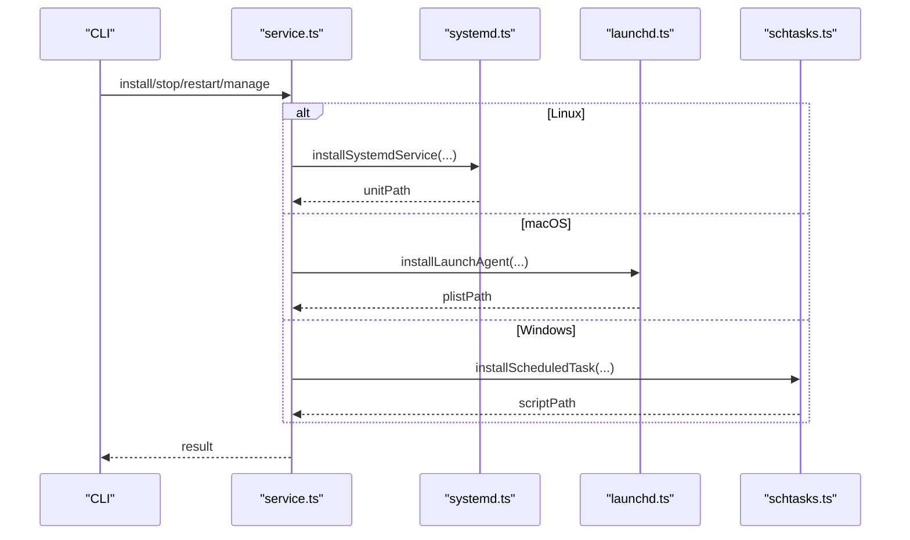

**Diagram sources**
- [service.ts](file://src/daemon/service.ts#L1-L52)
- [systemd.ts](file://src/daemon/systemd.ts#L451-L521)
- [launchd.ts](file://src/daemon/launchd.ts#L393-L469)
- [schtasks.ts](file://src/daemon/schtasks.ts#L222-L282)

## Detailed Component Analysis

### Linux systemd Integration
- Installs user systemd services with safe defaults and performs backups before overwriting.
- Enforces After/Wants network-online.target and RestartSec=5s for reliable restarts.
- Supports enabling user lingering for headless operation.
- Reads ExecStart, WorkingDirectory, and Environment from unit files.
- Provides runtime inspection via systemctl show and parses ActiveState/SubState/MainPID.

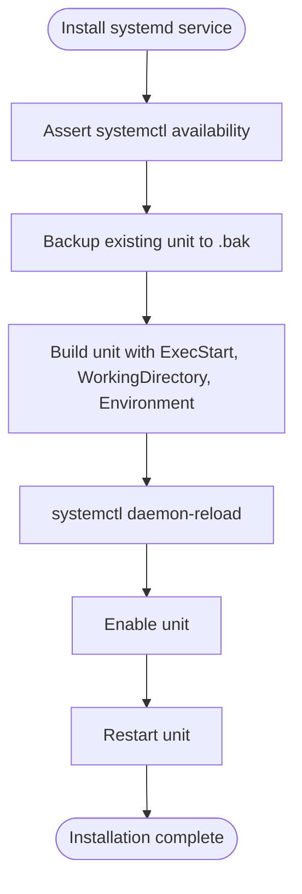

**Diagram sources**
- [systemd.ts](file://src/daemon/systemd.ts#L451-L521)
- [systemd-unit.ts](file://src/daemon/systemd-unit.ts#L38-L77)

**Section sources**
- [systemd.ts](file://src/daemon/systemd.ts#L451-L521)
- [systemd-unit.ts](file://src/daemon/systemd-unit.ts#L38-L77)
- [systemd-linger.ts](file://src/daemon/systemd-linger.ts#L1-L200)
- [systemd-audit.ts](file://src/daemon/service-audit.ts#L124-L161)

### macOS launchd Integration
- Creates LaunchAgents under Library/LaunchAgents with secure permissions.
- Uses RunAtLoad and KeepAlive for automatic startup and continuous operation.
- Writes stdout/stderr logs to a state-managed directory.
- Supports repair bootstrap and restart with PID wait logic.
- Parses plist to extract ProgramArguments, WorkingDirectory, and Environment.

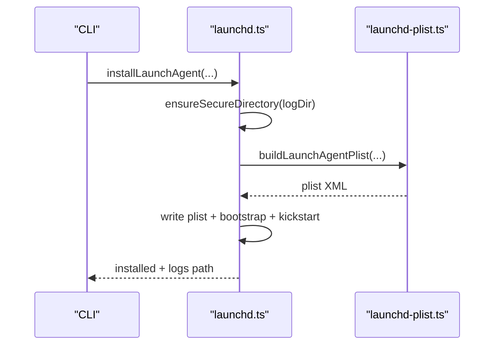

**Diagram sources**
- [launchd.ts](file://src/daemon/launchd.ts#L393-L469)
- [launchd-plist.ts](file://src/daemon/launchd-plist.ts#L89-L118)

**Section sources**
- [launchd.ts](file://src/daemon/launchd.ts#L393-L469)
- [launchd-plist.ts](file://src/daemon/launchd-plist.ts#L1-L118)

### Windows Task Scheduler Integration
- Generates a scheduled task script and creates a task triggered on logon.
- Supports environment variable injection and working directory changes.
- Provides stop/restart/query via schtasks commands.
- Resolves task name and script path from environment and state directory.

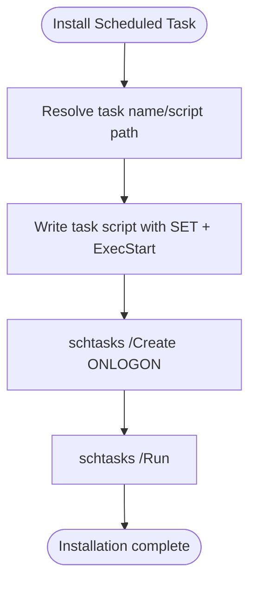

**Diagram sources**
- [schtasks.ts](file://src/daemon/schtasks.ts#L222-L282)

**Section sources**
- [schtasks.ts](file://src/daemon/schtasks.ts#L222-L282)

### Cross-Platform Orchestration and Auditing
- Unified service API delegates to platform-specific implementations.
- Audits systemd and launchd configurations for best practices (network targets, restart intervals, RunAtLoad/KeepAlive).
- Validates gateway command presence, runtime path, and token drift.

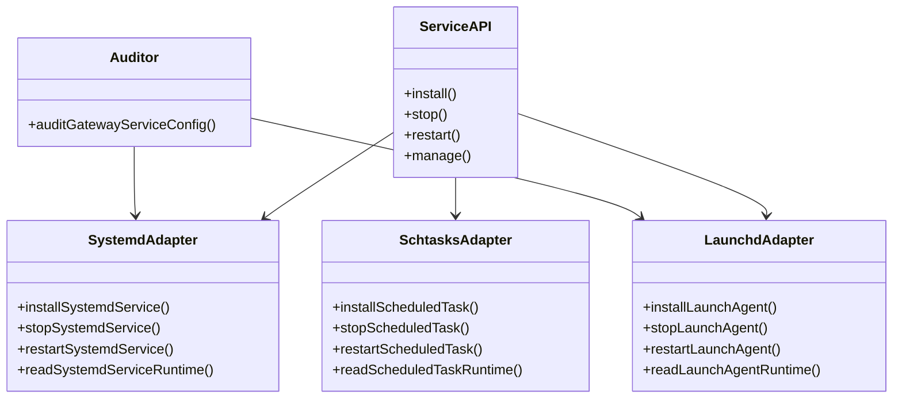

**Diagram sources**
- [service.ts](file://src/daemon/service.ts#L1-L52)
- [systemd.ts](file://src/daemon/systemd.ts#L541-L646)
- [launchd.ts](file://src/daemon/launchd.ts#L383-L525)
- [schtasks.ts](file://src/daemon/schtasks.ts#L306-L368)
- [service-audit.ts](file://src/daemon/service-audit.ts#L402-L424)

**Section sources**
- [service.ts](file://src/daemon/service.ts#L1-L52)
- [service-audit.ts](file://src/daemon/service-audit.ts#L402-L424)

### Monitoring Automation and Alerting
- A systemd service runs a one-shot monitor that checks Claude auth expiry and sends notifications via OpenClaw and/or ntfy.sh.
- A systemd timer triggers the monitor periodically.
- The monitor script tracks last notification time to avoid spam and respects environment overrides.

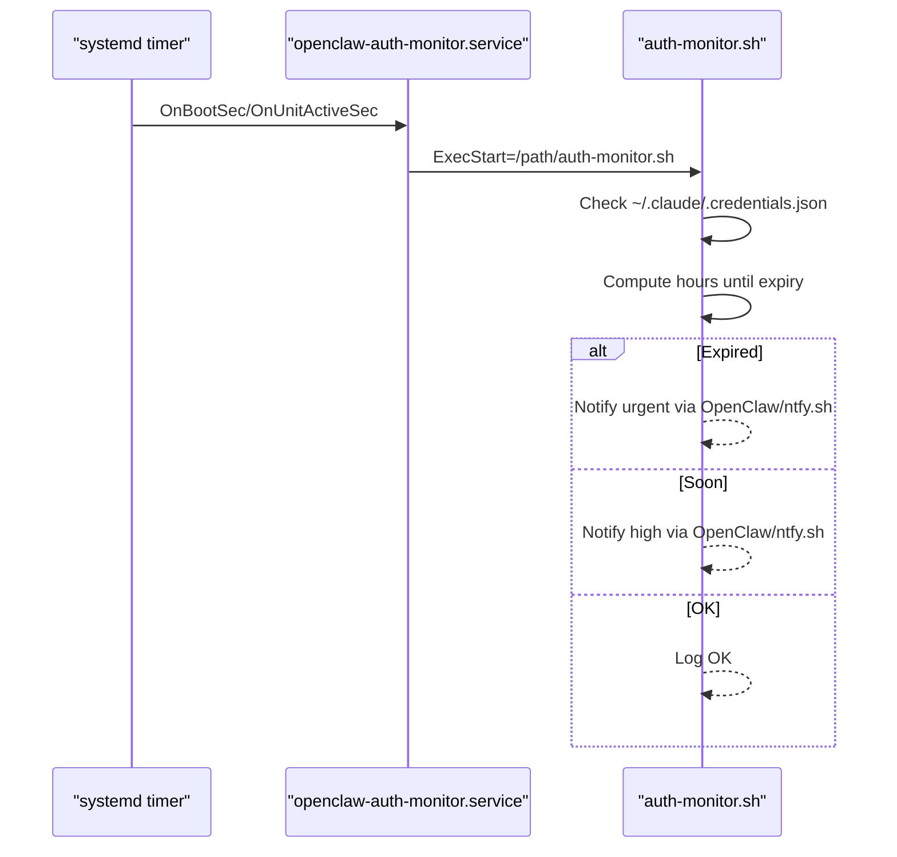

**Diagram sources**
- [openclaw-auth-monitor.service](file://scripts/systemd/openclaw-auth-monitor.service#L1-L15)
- [openclaw-auth-monitor.timer](file://scripts/systemd/openclaw-auth-monitor.timer#L1-L10)
- [auth-monitor.sh](file://scripts/auth-monitor.sh#L1-L90)

**Section sources**
- [openclaw-auth-monitor.service](file://scripts/systemd/openclaw-auth-monitor.service#L1-L15)
- [openclaw-auth-monitor.timer](file://scripts/systemd/openclaw-auth-monitor.timer#L1-L10)
- [auth-monitor.sh](file://scripts/auth-monitor.sh#L1-L90)

### Service Lifecycle Management and Self-Healing
- systemd: Restart=always with RestartSec=5s ensures automatic recovery; TimeoutStopSec/TimeoutStartSec bound shutdown/start durations; KillMode=control-group keeps child lifecycles coherent.
- launchd: RunAtLoad and KeepAlive ensure continuous operation; repair bootstrap and restart routines handle disabled states and GUI domain constraints.
- Windows: Task on logon with LIMITED rights; /Run and /End control execution.

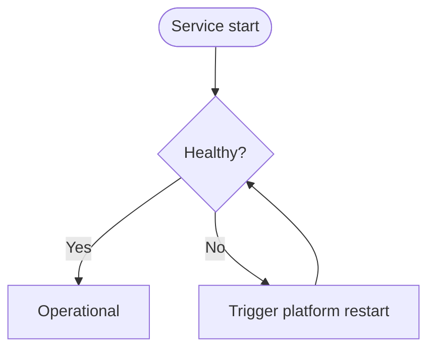

**Diagram sources**
- [systemd-unit.ts](file://src/daemon/systemd-unit.ts#L58-L76)
- [systemd.ts](file://src/daemon/systemd.ts#L541-L580)
- [launchd.ts](file://src/daemon/launchd.ts#L471-L525)
- [schtasks.ts](file://src/daemon/schtasks.ts#L316-L328)

**Section sources**
- [systemd-unit.ts](file://src/daemon/systemd-unit.ts#L58-L76)
- [systemd.ts](file://src/daemon/systemd.ts#L541-L580)
- [launchd.ts](file://src/daemon/launchd.ts#L471-L525)
- [schtasks.ts](file://src/daemon/schtasks.ts#L316-L328)

### Service Configuration Templates and Deployment Automation
- systemd unit template sets After/Wants network-online.target, Restart=always, RestartSec=5s, and safe timeouts.
- Deployment templates for Render include health checks, persistent disks, and auto-generated secrets.
- Cloud platform guides (Fly.io, Railway) demonstrate automated provisioning and setup.

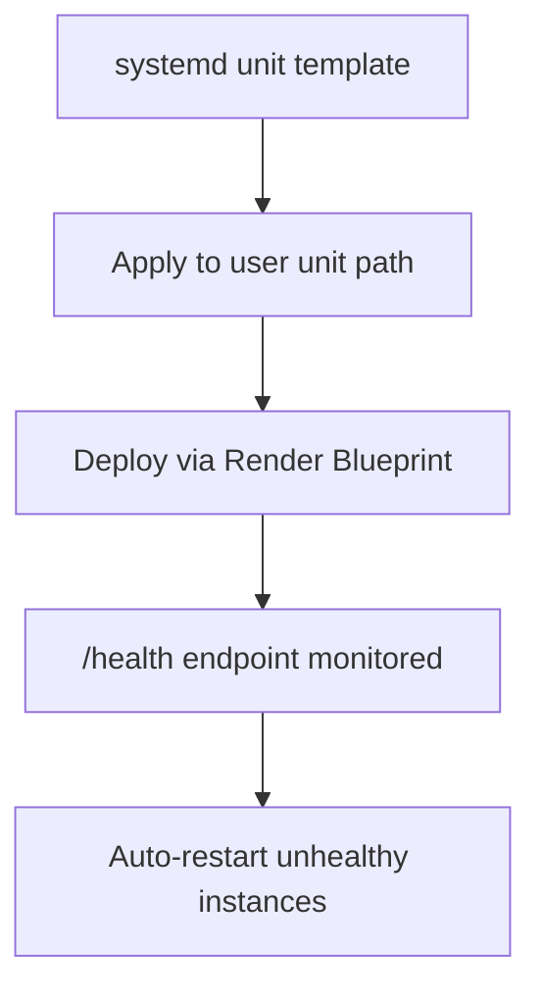

**Diagram sources**
- [systemd-unit.ts](file://src/daemon/systemd-unit.ts#L38-L77)
- [render.mdx](file://docs/install/render.mdx#L29-L63)

**Section sources**
- [systemd-unit.ts](file://src/daemon/systemd-unit.ts#L38-L77)
- [render.mdx](file://docs/install/render.mdx#L29-L63)
- [fly.md](file://docs/install/fly.md#L10-L491)
- [railway.mdx](file://docs/install/railway.mdx#L1-L100)

### Service Isolation, Resource Limits, and Security Hardening
- systemd: NoNewPrivileges, PrivateTmp, and KillMode=control-group improve isolation and prevent privilege escalation.
- launchd: Secure directory modes and Umask settings protect sensitive files.
- Windows: Task runs with LIMITED rights; environment variables are injected via script.
- Ansible guide demonstrates firewall rules, VPN exposure, and hardened systemd settings.

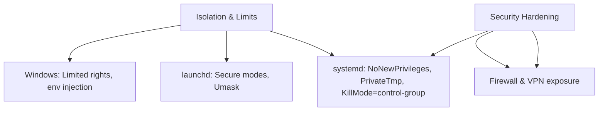

**Diagram sources**
- [systemd-unit.ts](file://src/daemon/systemd-unit.ts#L65-L67)
- [launchd-plist.ts](file://src/daemon/launchd-plist.ts#L6-L8)
- [ansible.md](file://docs/install/ansible.md#L280-L289)

**Section sources**
- [systemd-unit.ts](file://src/daemon/systemd-unit.ts#L65-L67)
- [launchd-plist.ts](file://src/daemon/launchd-plist.ts#L6-L8)
- [ansible.md](file://docs/install/ansible.md#L280-L289)

## Dependency Analysis
- service.ts composes platform-specific adapters and exports unified types.
- constants.ts defines canonical and legacy identifiers for service names and labels.
- service-audit.ts depends on platform adapters to parse unit files and detect misconfigurations.

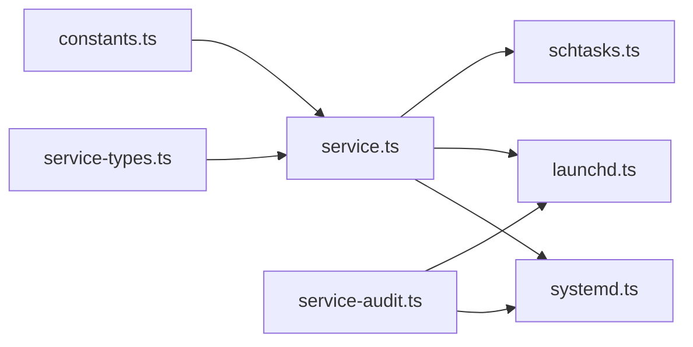

**Diagram sources**
- [service-types.ts](file://src/daemon/service-types.ts#L1-L39)
- [service.ts](file://src/daemon/service.ts#L1-L52)
- [constants.ts](file://src/daemon/constants.ts#L1-L114)
- [service-audit.ts](file://src/daemon/service-audit.ts#L1-L50)

**Section sources**
- [service-types.ts](file://src/daemon/service-types.ts#L1-L39)
- [service.ts](file://src/daemon/service.ts#L1-L52)
- [constants.ts](file://src/daemon/constants.ts#L1-L114)
- [service-audit.ts](file://src/daemon/service-audit.ts#L1-L50)

## Performance Considerations
- RestartSec=5s balances responsiveness with throttling to avoid excessive restart storms.
- TimeoutStopSec/TimeoutStartSec bound long-running operations to prevent hangs.
- launchd ThrottleInterval=1 prevents delayed restarts after CLI actions.
- Minimal PATH and system Node runtime reduce startup overhead and version manager instability.

[No sources needed since this section provides general guidance]

## Troubleshooting Guide
Common issues and remedies:
- systemd user scope unavailable: Verify user bus availability and sudo context; fallback to machine user scope when applicable.
- launchd GUI domain unsupported: Requires a logged-in GUI session; reinstall from the correct user session.
- Windows Task creation/access denied: Run PowerShell as Administrator or skip service install.
- Authentication expiry alerts: Configure NOTIFY_PHONE or NOTIFY_NTFY; adjust WARN_HOURS as needed.

**Section sources**
- [systemd.ts](file://src/daemon/systemd.ts#L377-L417)
- [launchd.ts](file://src/daemon/launchd.ts#L444-L456)
- [schtasks.ts](file://src/daemon/schtasks.ts#L260-L269)
- [auth-monitor.sh](file://scripts/auth-monitor.sh#L8-L22)

## Conclusion
OpenClaw’s service management integrates platform-native daemons with cross-platform orchestration, ensuring reliable, secure, and observable deployments. The provided templates, automation scripts, and auditing utilities enable consistent lifecycle management, automatic restarts, and proactive monitoring across Linux, macOS, and Windows.

[No sources needed since this section summarizes without analyzing specific files]

## Appendices

### Service Health Verification Procedures
- systemd: systemctl show for ActiveState/SubState/MainPID; is-enabled for enablement status.
- launchd: launchctl print for state and PID; existence check for plist.
- Windows: schtasks /Query for status and last run result; /End and /Run for control.

**Section sources**
- [systemd.ts](file://src/daemon/systemd.ts#L606-L646)
- [launchd.ts](file://src/daemon/launchd.ts#L193-L218)
- [schtasks.ts](file://src/daemon/schtasks.ts#L337-L368)

### Deployment Automation Scripts
- Shell installer for Unix-like systems.
- PowerShell installer for Windows environments.

**Section sources**
- [install.sh](file://scripts/install.sh#L1-L200)
- [install.ps1](file://scripts/install.ps1#L1-L200)