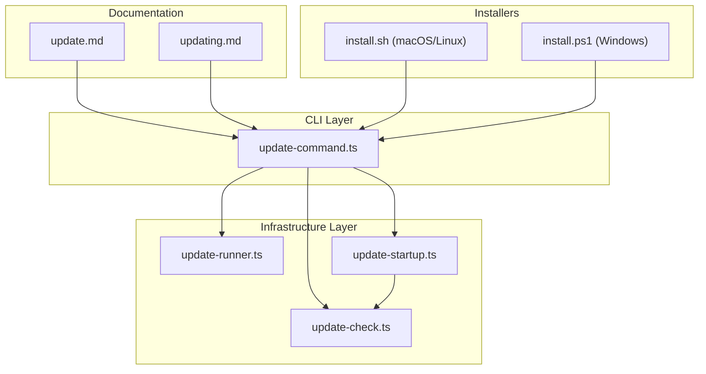
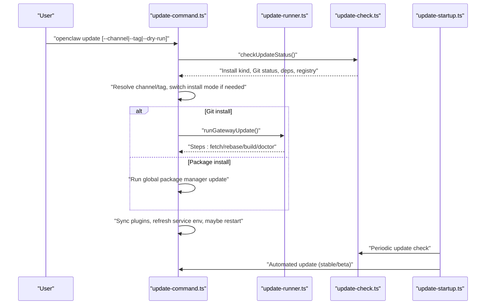
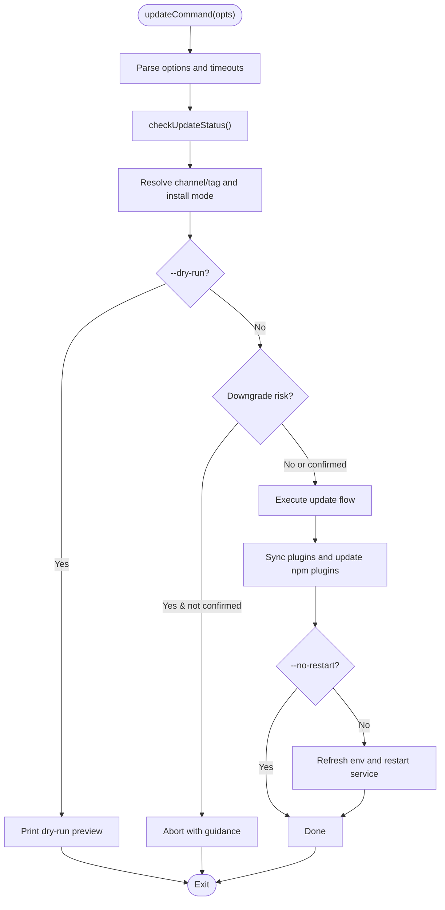
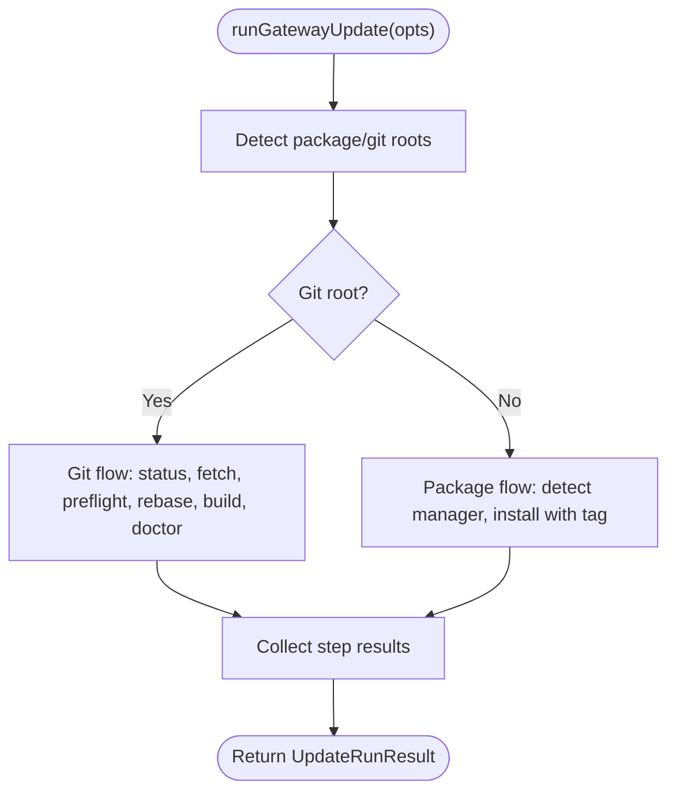
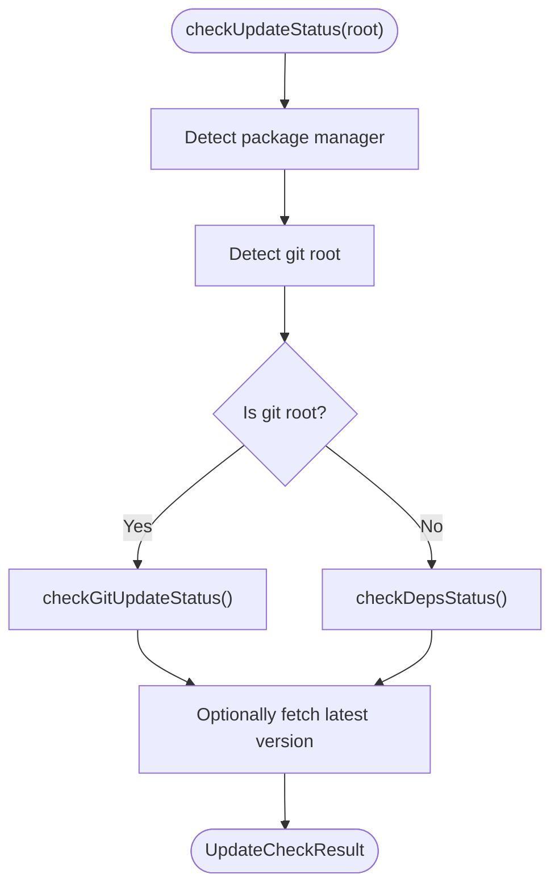
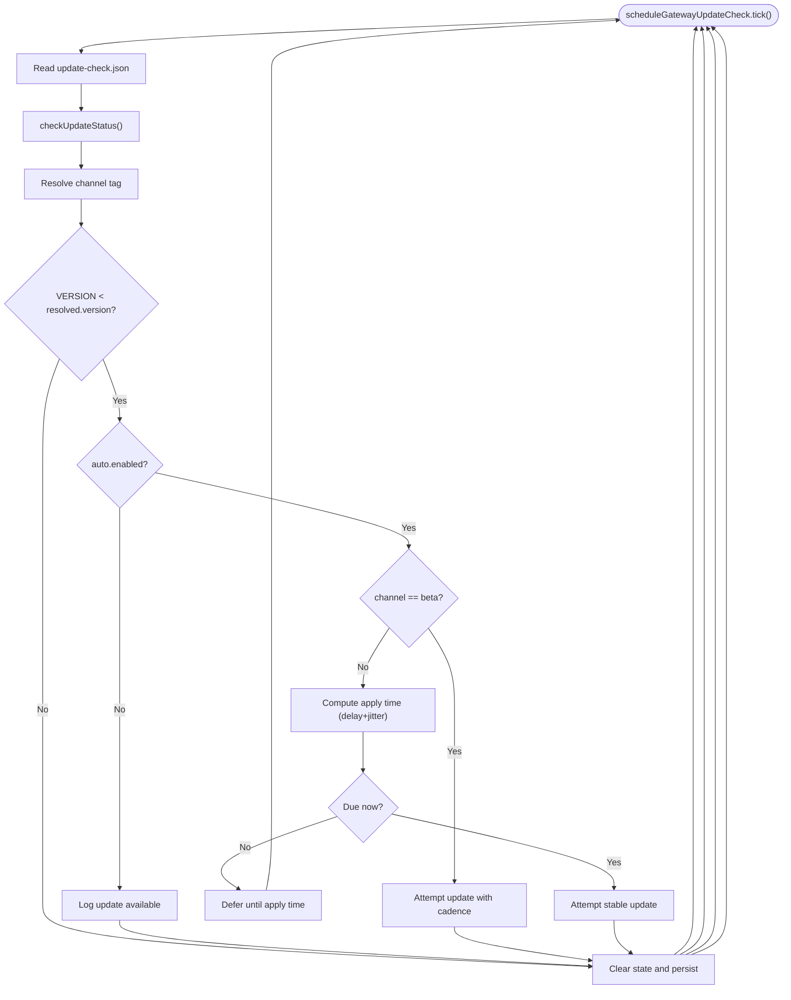
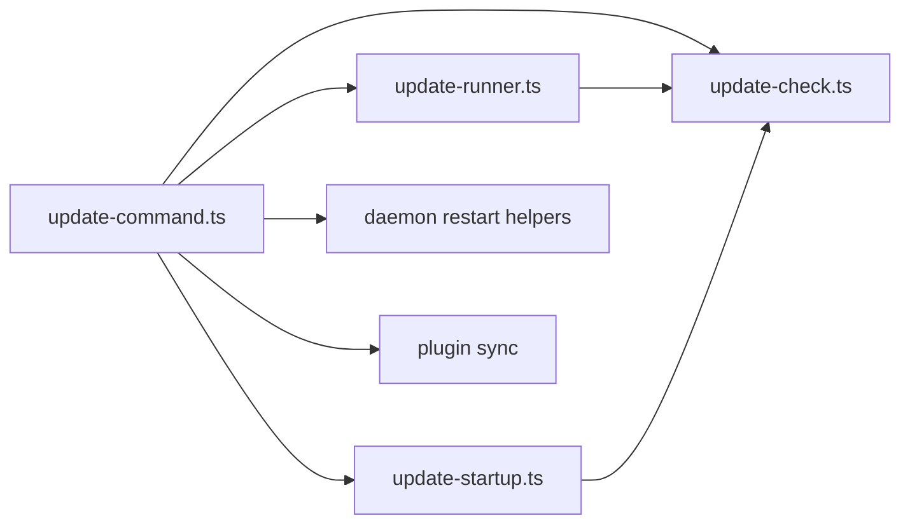

# System Updates & Upgrades

<cite>
**Referenced Files in This Document**
- [update-command.ts](file://src/cli/update-cli/update-command.ts)
- [update-runner.ts](file://src/infra/update-runner.ts)
- [update-check.ts](file://src/infra/update-check.ts)
- [update-startup.ts](file://src/infra/update-startup.ts)
- [update.md](file://docs/cli/update.md)
- [updating.md](file://docs/install/updating.md)
- [install.sh](file://scripts/install.sh)
- [install.ps1](file://scripts/install.ps1)
- [ghsa-patch.mjs](file://scripts/ghsa-patch.mjs)
- [index.md](file://docs/platforms/index.md)
- [macos.md](file://docs/platforms/macos.md)
</cite>

## Table of Contents
1. [Introduction](#introduction)
2. [Project Structure](#project-structure)
3. [Core Components](#core-components)
4. [Architecture Overview](#architecture-overview)
5. [Detailed Component Analysis](#detailed-component-analysis)
6. [Dependency Analysis](#dependency-analysis)
7. [Performance Considerations](#performance-considerations)
8. [Troubleshooting Guide](#troubleshooting-guide)
9. [Conclusion](#conclusion)
10. [Appendices](#appendices)

## Introduction
This document provides comprehensive guidance for updating and upgrading OpenClaw across platforms. It covers automated and manual update flows, version management, rollback strategies, dependency updates, service restart procedures, compatibility checks, upgrade planning, downtime minimization, post-upgrade validation, and security patching workflows.

## Project Structure
OpenClaw’s update system is implemented primarily in the CLI and infrastructure layers, with supporting documentation and platform-specific installers:

- CLI update command orchestrates user-facing update operations, channel switching, dry-runs, and restart flows.
- Infrastructure modules implement update checks, runner logic, and startup auto-update scheduling.
- Documentation defines recommended update paths, rollback strategies, and platform-specific notes.
- Platform installers (macOS/Linux and Windows) provide safe upgrade paths and environment preparation.

**Diagram sources**
- [update-command.ts](file://src/cli/update-cli/update-command.ts#L630-L919)
- [update-runner.ts](file://src/infra/update-runner.ts#L320-L927)
- [update-check.ts](file://src/infra/update-check.ts#L449-L490)
- [update-startup.ts](file://src/infra/update-startup.ts#L300-L527)
- [update.md](file://docs/cli/update.md#L1-L103)
- [updating.md](file://docs/install/updating.md#L1-L258)
- [install.sh](file://scripts/install.sh#L1-L800)
- [install.ps1](file://scripts/install.ps1#L1-L330)

**Section sources**
- [update-command.ts](file://src/cli/update-cli/update-command.ts#L630-L919)
- [update-runner.ts](file://src/infra/update-runner.ts#L320-L927)
- [update-check.ts](file://src/infra/update-check.ts#L449-L490)
- [update-startup.ts](file://src/infra/update-startup.ts#L300-L527)
- [update.md](file://docs/cli/update.md#L1-L103)
- [updating.md](file://docs/install/updating.md#L1-L258)
- [install.sh](file://scripts/install.sh#L1-L800)
- [install.ps1](file://scripts/install.ps1#L1-L330)

## Core Components
- Update command: Orchestrates update execution, channel selection, dry-run previews, plugin synchronization, and service restarts.
- Update runner: Implements Git-based and package-manager-based update flows, preflight checks, dependency install, build, UI build, and doctor validation.
- Update checker: Detects install kind, Git status, dependency health, and queries registry tags for version comparisons.
- Startup auto-updater: Schedules periodic update checks, applies stable rollouts with delay and jitter, and triggers automated updates.
- Documentation: Defines recommended update paths, rollback strategies, and platform-specific notes.
- Installers: Provide safe upgrade flows for macOS/Linux and Windows, including environment preparation and onboarding.

**Section sources**
- [update-command.ts](file://src/cli/update-cli/update-command.ts#L630-L919)
- [update-runner.ts](file://src/infra/update-runner.ts#L320-L927)
- [update-check.ts](file://src/infra/update-check.ts#L449-L490)
- [update-startup.ts](file://src/infra/update-startup.ts#L300-L527)
- [update.md](file://docs/cli/update.md#L1-L103)
- [updating.md](file://docs/install/updating.md#L1-L258)
- [install.sh](file://scripts/install.sh#L1-L800)
- [install.ps1](file://scripts/install.ps1#L1-L330)

## Architecture Overview
The update architecture separates concerns across CLI orchestration, infrastructure execution, and startup scheduling:

**Diagram sources**
- [update-command.ts](file://src/cli/update-cli/update-command.ts#L630-L919)
- [update-runner.ts](file://src/infra/update-runner.ts#L320-L927)
- [update-check.ts](file://src/infra/update-check.ts#L449-L490)
- [update-startup.ts](file://src/infra/update-startup.ts#L300-L527)

## Detailed Component Analysis

### Update Command (CLI)
Responsibilities:
- Parse options (channel, tag, dry-run, no-restart, json, timeout).
- Resolve install kind and channel, switch modes if requested.
- Compute target versions and downgrade risk.
- Execute update steps, plugin sync, shell completion refresh, and optional restart.
- Provide dry-run previews and actionable notes.

Key behaviors:
- Downgrade confirmation for non-fallback beta channel.
- Channel-aware tag resolution and fallback handling.
- Plugin synchronization after core update.
- Optional service refresh and restart with health checks.

**Diagram sources**
- [update-command.ts](file://src/cli/update-cli/update-command.ts#L630-L919)

**Section sources**
- [update-command.ts](file://src/cli/update-cli/update-command.ts#L630-L919)
- [update.md](file://docs/cli/update.md#L1-L103)

### Update Runner (Infrastructure)
Responsibilities:
- Git-based update flow: clean worktree check, upstream presence, fetch, preflight worktree, rebase, deps install, build, UI build, doctor.
- Package-based update flow: detect manager, run global install with tag.
- Step execution with timeouts, progress callbacks, and structured results.

Highlights:
- Preflight worktree validates build/lint success across recent commits.
- Doctor step runs with a flag to strip unknown config keys during migration.
- UI assets rebuild if missing after doctor.

**Diagram sources**
- [update-runner.ts](file://src/infra/update-runner.ts#L320-L927)

**Section sources**
- [update-runner.ts](file://src/infra/update-runner.ts#L320-L927)

### Update Checker (Infrastructure)
Responsibilities:
- Determine install kind (git vs package).
- Check Git status (branch, SHA, tag, upstream, dirty, ahead/behind).
- Validate dependency markers and lockfiles.
- Query registry tags for latest/beta/stable versions and compare semver.

**Diagram sources**
- [update-check.ts](file://src/infra/update-check.ts#L449-L490)

**Section sources**
- [update-check.ts](file://src/infra/update-check.ts#L449-L490)

### Startup Auto-Updater (Infrastructure)
Responsibilities:
- Periodically check for updates based on channel and policy.
- Apply stable updates with configurable delay and jitter to spread rollout.
- Attempt beta updates at a configurable cadence.
- Persist state and notify on availability.

**Diagram sources**
- [update-startup.ts](file://src/infra/update-startup.ts#L300-L527)

**Section sources**
- [update-startup.ts](file://src/infra/update-startup.ts#L300-L527)

### Platform-Specific Update Mechanisms
- macOS/Linux installer:
  - Supports re-running installer for in-place upgrades.
  - Detects existing installs and upgrades accordingly.
  - Prepares environment (Node, build tools) and optionally runs onboarding.
- Windows installer:
  - Ensures Node/Git availability and installs via npm or git.
  - Adds to PATH and supports onboarding.

**Section sources**
- [install.sh](file://scripts/install.sh#L1-L800)
- [install.ps1](file://scripts/install.ps1#L1-L330)
- [updating.md](file://docs/install/updating.md#L1-L258)

## Dependency Analysis
- CLI update command depends on:
  - Update checker for status and version resolution.
  - Update runner for Git/package flows.
  - Daemon CLI helpers for service restart and health checks.
  - Plugin management for channel-aligned plugin updates.
- Update runner depends on:
  - Package manager detection and install commands.
  - Git commands for fetch/rebase and preflight worktrees.
  - Doctor entry for final validation.
- Startup auto-updater depends on:
  - Update checker for version comparison.
  - CLI update command for automated execution.

**Diagram sources**
- [update-command.ts](file://src/cli/update-cli/update-command.ts#L630-L919)
- [update-runner.ts](file://src/infra/update-runner.ts#L320-L927)
- [update-check.ts](file://src/infra/update-check.ts#L449-L490)
- [update-startup.ts](file://src/infra/update-startup.ts#L300-L527)

**Section sources**
- [update-command.ts](file://src/cli/update-cli/update-command.ts#L630-L919)
- [update-runner.ts](file://src/infra/update-runner.ts#L320-L927)
- [update-check.ts](file://src/infra/update-check.ts#L449-L490)
- [update-startup.ts](file://src/infra/update-startup.ts#L300-L527)

## Performance Considerations
- Prefer package installs for faster updates when Git metadata is absent.
- Use preflight worktrees to validate builds without modifying the main branch.
- Limit frequent auto-update attempts by configuring beta cadence and stable delays/jitter.
- Keep dependency markers fresh to avoid repeated installs.

[No sources needed since this section provides general guidance]

## Troubleshooting Guide
Common scenarios and resolutions:
- Clean worktree required for Git updates: ensure no uncommitted changes before running update.
- Downgrade risks: confirm downgrade when moving to older versions; otherwise abort.
- Package manager failures: installer attempts to auto-install build tools on Linux/macOS; review logs for missing native tooling.
- Service restart issues: use restart helpers and health checks; stale gateway PIDs are terminated if found.
- Doctor diagnostics: run doctor to repair/migrate config and validate environment.

Operational references:
- Update command options and behavior.
- Installer diagnostics and environment preparation.
- Platform-specific service controls and runbooks.

**Section sources**
- [update.md](file://docs/cli/update.md#L1-L103)
- [updating.md](file://docs/install/updating.md#L1-L258)
- [install.sh](file://scripts/install.sh#L1-L800)
- [install.ps1](file://scripts/install.ps1#L1-L330)
- [index.md](file://docs/platforms/index.md#L1-L54)
- [macos.md](file://docs/platforms/macos.md#L1-L227)

## Conclusion
OpenClaw’s update system balances safety and automation across platforms. Use the documented update paths, leverage the CLI for manual updates, rely on the startup auto-updater for stable rollouts, and follow rollback and validation procedures to minimize downtime and risk.

[No sources needed since this section summarizes without analyzing specific files]

## Appendices

### Upgrade Planning Guidelines
- Assess install kind (git vs package) and choose appropriate update path.
- Select channel (stable/beta/dev) and review change notes.
- Back up configuration and credentials before updating.
- Schedule updates during maintenance windows; prefer stable channel for production.

**Section sources**
- [updating.md](file://docs/install/updating.md#L1-L258)
- [update.md](file://docs/cli/update.md#L1-L103)

### Downtime Minimization Strategies
- Use package installs for faster updates when Git metadata is absent.
- Enable stable auto-updates with delay/jitter to spread load.
- Perform updates during off-peak hours; monitor health post-update.

**Section sources**
- [update-startup.ts](file://src/infra/update-startup.ts#L300-L527)
- [updating.md](file://docs/install/updating.md#L1-L258)

### Post-Upgrade Validation Procedures
- Run doctor to repair/migrate config and validate environment.
- Restart the gateway service and verify health.
- Confirm plugin alignment with the chosen channel.

**Section sources**
- [updating.md](file://docs/install/updating.md#L1-L258)
- [update-command.ts](file://src/cli/update-cli/update-command.ts#L630-L919)

### Security Patching Workflows
- Use the GHSA patch script to update advisories with vulnerability ranges and patched versions.
- Maintain awareness of channel-specific releases and apply patches promptly.

**Section sources**
- [ghsa-patch.mjs](file://scripts/ghsa-patch.mjs#L1-L169)