# Troubleshooting & Problem Resolution

<cite>
**Referenced Files in This Document**
- [docs/help/troubleshooting.md](file://docs/help/troubleshooting.md)
- [docs/gateway/troubleshooting.md](file://docs/gateway/troubleshooting.md)
- [docs/channels/troubleshooting.md](file://docs/channels/troubleshooting.md)
- [docs/nodes/troubleshooting.md](file://docs/nodes/troubleshooting.md)
- [docs/automation/troubleshooting.md](file://docs/automation/troubleshooting.md)
- [docs/tools/browser-linux-troubleshooting.md](file://docs/tools/browser-linux-troubleshooting.md)
- [docs/tools/browser-wsl2-windows-remote-cdp-troubleshooting.md](file://docs/tools/browser-wsl2-windows-remote-cdp-troubleshooting.md)
- [scripts/clawlog.sh](file://scripts/clawlog.sh)
- [scripts/auth-monitor.sh](file://scripts/auth-monitor.sh)
- [docs/gateway/doctor.md](file://docs/gateway/doctor.md)
- [docs/cli/doctor.md](file://docs/cli/doctor.md)
</cite>

## Table of Contents
1. [Introduction](#introduction)
2. [Project Structure](#project-structure)
3. [Core Components](#core-components)
4. [Architecture Overview](#architecture-overview)
5. [Detailed Component Analysis](#detailed-component-analysis)
6. [Dependency Analysis](#dependency-analysis)
7. [Performance Considerations](#performance-considerations)
8. [Troubleshooting Guide](#troubleshooting-guide)
9. [Conclusion](#conclusion)
10. [Appendices](#appendices)

## Introduction
This document provides a comprehensive, production-grade troubleshooting and problem resolution guide for OpenClaw. It focuses on diagnosing and resolving connectivity issues, authentication failures, and performance degradation across the gateway, channels, automation, nodes, and browser tooling. It explains how to interpret logs, leverage diagnostic commands, collect evidence, and follow escalation and incident response workflows. It also documents common failure patterns, root cause analysis methodologies, and preventive measures.

## Project Structure
OpenClaw’s troubleshooting ecosystem is organized around:
- Centralized triage and decision trees in the help hub
- Deep runbooks for gateway, channels, automation, nodes, and browser
- Diagnostic scripts for macOS unified logging and proactive auth monitoring
- Doctor command for automated health checks and guided repairs

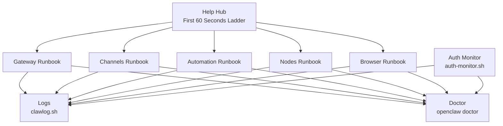

**Diagram sources**
- [docs/help/troubleshooting.md](file://docs/help/troubleshooting.md#L13-L25)
- [docs/gateway/troubleshooting.md](file://docs/gateway/troubleshooting.md#L14-L24)
- [docs/channels/troubleshooting.md](file://docs/channels/troubleshooting.md#L13-L23)
- [docs/automation/troubleshooting.md](file://docs/automation/troubleshooting.md#L14-L22)
- [docs/nodes/troubleshooting.md](file://docs/nodes/troubleshooting.md#L13-L21)
- [docs/tools/browser-linux-troubleshooting.md](file://docs/tools/browser-linux-troubleshooting.md#L1-L140)
- [scripts/clawlog.sh](file://scripts/clawlog.sh#L1-L322)
- [scripts/auth-monitor.sh](file://scripts/auth-monitor.sh#L1-L90)
- [docs/gateway/doctor.md](file://docs/gateway/doctor.md#L14-L44)

**Section sources**
- [docs/help/troubleshooting.md](file://docs/help/troubleshooting.md#L1-L298)
- [docs/gateway/troubleshooting.md](file://docs/gateway/troubleshooting.md#L1-L367)
- [docs/channels/troubleshooting.md](file://docs/channels/troubleshooting.md#L1-L118)
- [docs/nodes/troubleshooting.md](file://docs/nodes/troubleshooting.md#L1-L115)
- [docs/automation/troubleshooting.md](file://docs/automation/troubleshooting.md#L1-L123)
- [docs/tools/browser-linux-troubleshooting.md](file://docs/tools/browser-linux-troubleshooting.md#L1-L140)
- [docs/tools/browser-wsl2-windows-remote-cdp-troubleshooting.md](file://docs/tools/browser-wsl2-windows-remote-cdp-troubleshooting.md#L1-L243)
- [scripts/clawlog.sh](file://scripts/clawlog.sh#L1-L322)
- [scripts/auth-monitor.sh](file://scripts/auth-monitor.sh#L1-L90)
- [docs/gateway/doctor.md](file://docs/gateway/doctor.md#L1-L331)
- [docs/cli/doctor.md](file://docs/cli/doctor.md#L1-L46)

## Core Components
- Help Hub: Provides a fast triage ladder and decision tree to quickly isolate symptoms and direct operators to the correct runbook.
- Gateway Runbook: Deep diagnostics for gateway runtime, RPC probes, authentication modes, and device identity.
- Channels Runbook: Channel-specific failure signatures and quick fixes for major providers (Discord, Telegram, WhatsApp, Slack, iMessage, BlueBubbles, Signal, Matrix).
- Automation Runbook: Cron and heartbeat scheduling, delivery, and timezone gotchas.
- Nodes Runbook: Foreground requirements, permissions, pairing vs approvals, and common node error codes.
- Browser Runbook: Linux CDP issues, WSL2/Windows remote CDP, and extension relay topology.
- Diagnostic Scripts:
  - clawlog.sh: macOS unified logging viewer for OpenClaw subsystem with filtering, streaming, and export.
  - auth-monitor.sh: Proactive auth expiry monitoring with notifications and state tracking.
- Doctor: Automated health checks, config normalization, migrations, and guided repairs.

**Section sources**
- [docs/help/troubleshooting.md](file://docs/help/troubleshooting.md#L68-L88)
- [docs/gateway/troubleshooting.md](file://docs/gateway/troubleshooting.md#L14-L31)
- [docs/channels/troubleshooting.md](file://docs/channels/troubleshooting.md#L13-L30)
- [docs/automation/troubleshooting.md](file://docs/automation/troubleshooting.md#L14-L31)
- [docs/nodes/troubleshooting.md](file://docs/nodes/troubleshooting.md#L13-L36)
- [docs/tools/browser-linux-troubleshooting.md](file://docs/tools/browser-linux-troubleshooting.md#L9-L51)
- [docs/tools/browser-wsl2-windows-remote-cdp-troubleshooting.md](file://docs/tools/browser-wsl2-windows-remote-cdp-troubleshooting.md#L20-L44)
- [scripts/clawlog.sh](file://scripts/clawlog.sh#L50-L123)
- [scripts/auth-monitor.sh](file://scripts/auth-monitor.sh#L1-L90)
- [docs/gateway/doctor.md](file://docs/gateway/doctor.md#L14-L84)
- [docs/cli/doctor.md](file://docs/cli/doctor.md#L9-L34)

## Architecture Overview
The troubleshooting architecture centers on a command-driven triage followed by targeted runbooks and diagnostics.

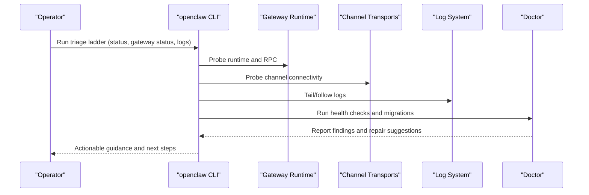

**Diagram sources**
- [docs/help/troubleshooting.md](file://docs/help/troubleshooting.md#L13-L36)
- [docs/gateway/troubleshooting.md](file://docs/gateway/troubleshooting.md#L14-L24)
- [docs/gateway/doctor.md](file://docs/gateway/doctor.md#L14-L84)
- [scripts/clawlog.sh](file://scripts/clawlog.sh#L240-L284)

## Detailed Component Analysis

### Help Hub: First 60 Seconds and Decision Tree
- Run the exact ladder in order to establish a baseline.
- Interpret expected outcomes for status, gateway probe/status, doctor, channels probe, and logs.
- Use the decision tree to route to the correct runbook based on what breaks first.

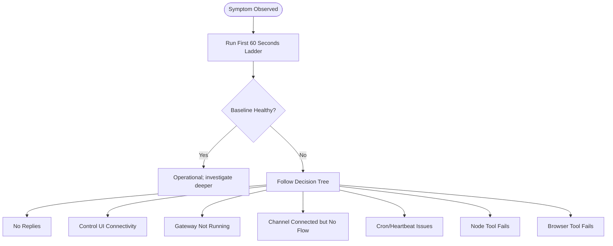

**Diagram sources**
- [docs/help/troubleshooting.md](file://docs/help/troubleshooting.md#L13-L88)

**Section sources**
- [docs/help/troubleshooting.md](file://docs/help/troubleshooting.md#L13-L88)

### Gateway Runbook: Connectivity, Authentication, and Device Identity
- Command ladder to validate runtime, RPC probe, and service health.
- Common signatures for authentication failures (device identity, nonce/signature, unauthorized) and binding/auth guardrails.
- Post-upgrade checks for mode, URL, and auth overrides.
- Related links to provider-specific long-context issues and model usage.

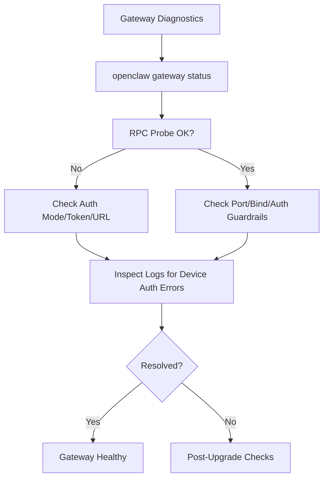

**Diagram sources**
- [docs/gateway/troubleshooting.md](file://docs/gateway/troubleshooting.md#L14-L31)
- [docs/gateway/troubleshooting.md](file://docs/gateway/troubleshooting.md#L91-L137)
- [docs/gateway/troubleshooting.md](file://docs/gateway/troubleshooting.md#L139-L167)
- [docs/gateway/troubleshooting.md](file://docs/gateway/troubleshooting.md#L294-L360)

**Section sources**
- [docs/gateway/troubleshooting.md](file://docs/gateway/troubleshooting.md#L14-L31)
- [docs/gateway/troubleshooting.md](file://docs/gateway/troubleshooting.md#L91-L137)
- [docs/gateway/troubleshooting.md](file://docs/gateway/troubleshooting.md#L139-L167)
- [docs/gateway/troubleshooting.md](file://docs/gateway/troubleshooting.md#L294-L360)

### Channels Runbook: Provider-Specific Failures and Fixes
- Use the channel probe and status to confirm transport connectivity.
- Provider-specific signatures and quick fixes:
  - WhatsApp: pairing, mention gating, re-login
  - Telegram: start flow, privacy mode, DNS/routing
  - Discord: guild/channel allowlist, mention gating
  - Slack: socket mode tokens, group policy
  - iMessage/BlueBubbles: webhook reachability, macOS TCC permissions
  - Signal: daemon URL/account, receive mode
  - Matrix: encrypted room crypto settings

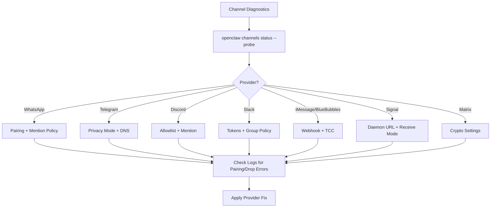

**Diagram sources**
- [docs/channels/troubleshooting.md](file://docs/channels/troubleshooting.md#L13-L30)
- [docs/channels/troubleshooting.md](file://docs/channels/troubleshooting.md#L31-L118)

**Section sources**
- [docs/channels/troubleshooting.md](file://docs/channels/troubleshooting.md#L13-L30)
- [docs/channels/troubleshooting.md](file://docs/channels/troubleshooting.md#L31-L118)

### Automation Runbook: Cron and Heartbeat
- Validate scheduler state, job list, and recent runs.
- Understand skip reasons (quiet-hours, requests-in-flight, alerts-disabled).
- Investigate timezone and activeHours configuration nuances.
- Confirm channel connectivity for delivery.

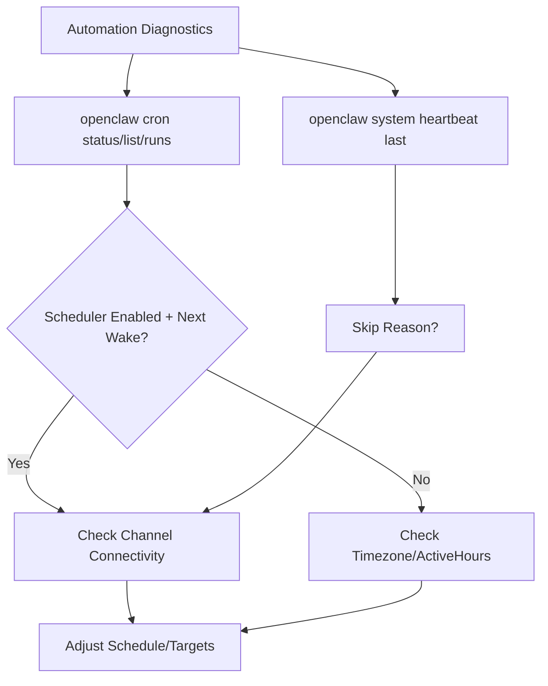

**Diagram sources**
- [docs/automation/troubleshooting.md](file://docs/automation/troubleshooting.md#L14-L31)
- [docs/automation/troubleshooting.md](file://docs/automation/troubleshooting.md#L74-L94)
- [docs/automation/troubleshooting.md](file://docs/automation/troubleshooting.md#L95-L116)

**Section sources**
- [docs/automation/troubleshooting.md](file://docs/automation/troubleshooting.md#L14-L31)
- [docs/automation/troubleshooting.md](file://docs/automation/troubleshooting.md#L74-L94)
- [docs/automation/troubleshooting.md](file://docs/automation/troubleshooting.md#L95-L116)

### Nodes Runbook: Foreground, Permissions, Pairing vs Approvals
- Validate node status, capabilities, and exec approvals.
- Foreground-only restrictions for canvas/camera/screen on mobile nodes.
- Permissions matrix and common error codes.
- Pairing vs approvals mental model and fast recovery loop.

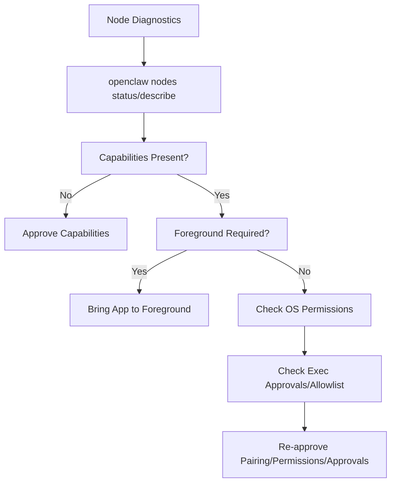

**Diagram sources**
- [docs/nodes/troubleshooting.md](file://docs/nodes/troubleshooting.md#L13-L36)
- [docs/nodes/troubleshooting.md](file://docs/nodes/troubleshooting.md#L37-L49)
- [docs/nodes/troubleshooting.md](file://docs/nodes/troubleshooting.md#L60-L78)
- [docs/nodes/troubleshooting.md](file://docs/nodes/troubleshooting.md#L79-L91)

**Section sources**
- [docs/nodes/troubleshooting.md](file://docs/nodes/troubleshooting.md#L13-L36)
- [docs/nodes/troubleshooting.md](file://docs/nodes/troubleshooting.md#L37-L49)
- [docs/nodes/troubleshooting.md](file://docs/nodes/troubleshooting.md#L60-L78)
- [docs/nodes/troubleshooting.md](file://docs/nodes/troubleshooting.md#L79-L91)

### Browser Runbook: Linux CDP and WSL2/Windows Remote CDP
- Linux snap Chromium interference and solutions (Google Chrome or attach-only mode).
- WSL2/Windows remote CDP: layered validation from Chrome endpoint to OpenClaw profile to Control UI.
- Extension relay topology and relayBindHost for cross-namespace access.

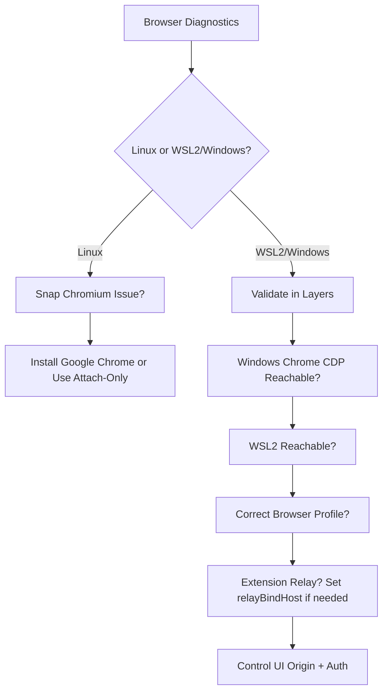

**Diagram sources**
- [docs/tools/browser-linux-troubleshooting.md](file://docs/tools/browser-linux-troubleshooting.md#L9-L51)
- [docs/tools/browser-linux-troubleshooting.md](file://docs/tools/browser-linux-troubleshooting.md#L53-L97)
- [docs/tools/browser-wsl2-windows-remote-cdp-troubleshooting.md](file://docs/tools/browser-wsl2-windows-remote-cdp-troubleshooting.md#L79-L171)
- [docs/tools/browser-wsl2-windows-remote-cdp-troubleshooting.md](file://docs/tools/browser-wsl2-windows-remote-cdp-troubleshooting.md#L209-L233)

**Section sources**
- [docs/tools/browser-linux-troubleshooting.md](file://docs/tools/browser-linux-troubleshooting.md#L9-L51)
- [docs/tools/browser-linux-troubleshooting.md](file://docs/tools/browser-linux-troubleshooting.md#L53-L97)
- [docs/tools/browser-wsl2-windows-remote-cdp-troubleshooting.md](file://docs/tools/browser-wsl2-windows-remote-cdp-troubleshooting.md#L79-L171)
- [docs/tools/browser-wsl2-windows-remote-cdp-troubleshooting.md](file://docs/tools/browser-wsl2-windows-remote-cdp-troubleshooting.md#L209-L233)

### Diagnostic Scripts: Logs and Auth Monitoring
- clawlog.sh: macOS unified logging viewer for the ai.openclaw subsystem with category filtering, error-only mode, streaming, and export.
- auth-monitor.sh: Proactive auth expiry monitoring with configurable notifications and state throttling.

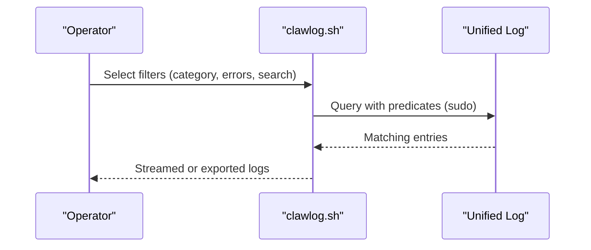

**Diagram sources**
- [scripts/clawlog.sh](file://scripts/clawlog.sh#L240-L284)

**Section sources**
- [scripts/clawlog.sh](file://scripts/clawlog.sh#L50-L123)
- [scripts/clawlog.sh](file://scripts/clawlog.sh#L240-L284)
- [scripts/auth-monitor.sh](file://scripts/auth-monitor.sh#L1-L90)

### Doctor: Automated Health Checks and Repairs
- Comprehensive health checks, config normalization, legacy migrations, state integrity, model auth health, sandbox repair, supervisor audits, and runtime diagnostics.
- Options for interactive, non-interactive, repair, and deep scans.

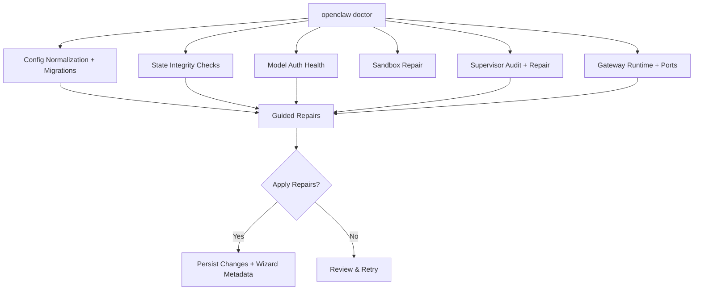

**Diagram sources**
- [docs/gateway/doctor.md](file://docs/gateway/doctor.md#L59-L84)
- [docs/gateway/doctor.md](file://docs/gateway/doctor.md#L113-L131)
- [docs/gateway/doctor.md](file://docs/gateway/doctor.md#L181-L212)
- [docs/gateway/doctor.md](file://docs/gateway/doctor.md#L236-L243)
- [docs/gateway/doctor.md](file://docs/gateway/doctor.md#L285-L303)
- [docs/gateway/doctor.md](file://docs/gateway/doctor.md#L304-L318)
- [docs/cli/doctor.md](file://docs/cli/doctor.md#L18-L34)

**Section sources**
- [docs/gateway/doctor.md](file://docs/gateway/doctor.md#L59-L84)
- [docs/gateway/doctor.md](file://docs/gateway/doctor.md#L113-L131)
- [docs/gateway/doctor.md](file://docs/gateway/doctor.md#L181-L212)
- [docs/gateway/doctor.md](file://docs/gateway/doctor.md#L236-L243)
- [docs/gateway/doctor.md](file://docs/gateway/doctor.md#L285-L303)
- [docs/gateway/doctor.md](file://docs/gateway/doctor.md#L304-L318)
- [docs/cli/doctor.md](file://docs/cli/doctor.md#L18-L34)

## Dependency Analysis
- The Help Hub depends on CLI commands to probe status, gateway, channels, and logs.
- Gateway Runbook leverages Doctor for health checks and migrations.
- Channels Runbook relies on channel-specific status and provider documentation.
- Automation Runbook depends on cron and heartbeat commands and channel connectivity.
- Nodes Runbook integrates with approvals and device pairing.
- Browser Runbook depends on platform-specific configurations and extension relay.
- Diagnostic scripts (clawlog.sh, auth-monitor.sh) provide foundational log and auth insights.

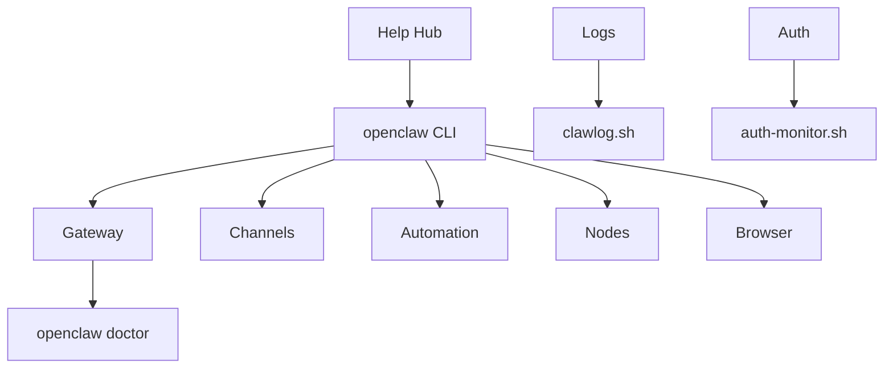

**Diagram sources**
- [docs/help/troubleshooting.md](file://docs/help/troubleshooting.md#L13-L36)
- [docs/gateway/troubleshooting.md](file://docs/gateway/troubleshooting.md#L14-L24)
- [docs/gateway/doctor.md](file://docs/gateway/doctor.md#L14-L44)
- [scripts/clawlog.sh](file://scripts/clawlog.sh#L1-L322)
- [scripts/auth-monitor.sh](file://scripts/auth-monitor.sh#L1-L90)

**Section sources**
- [docs/help/troubleshooting.md](file://docs/help/troubleshooting.md#L13-L36)
- [docs/gateway/troubleshooting.md](file://docs/gateway/troubleshooting.md#L14-L24)
- [docs/gateway/doctor.md](file://docs/gateway/doctor.md#L14-L44)
- [scripts/clawlog.sh](file://scripts/clawlog.sh#L1-L322)
- [scripts/auth-monitor.sh](file://scripts/auth-monitor.sh#L1-L90)

## Performance Considerations
- Keep gateway runtime healthy to prevent cascading delays in automation and channel delivery.
- Ensure proper timezone and activeHours configuration to avoid unnecessary deferrals.
- Minimize log noise by focusing on relevant categories and error-only views when investigating.
- Prefer attach-only browser profiles on constrained environments to reduce overhead.
- Use Doctor to normalize config and migrations that could otherwise degrade performance.

[No sources needed since this section provides general guidance]

## Troubleshooting Guide

### Step-by-Step Resolution Procedures
- Connectivity Problems
  - Run the Help Hub first 60 seconds ladder.
  - Validate gateway status and RPC probe.
  - Inspect logs for device identity and auth loop errors.
  - Use Doctor to check service health and port collisions.
  - Escalate if gateway remains unreachable despite healthy RPC probe.

- Authentication Failures
  - Confirm auth mode and token/password alignment between client and gateway.
  - Resolve device identity challenges (nonce/signature).
  - Review post-upgrade auth and URL override behavior.
  - Use Doctor to regenerate tokens when appropriate and safe.

- Performance Degradation
  - Validate cron scheduler and heartbeat delivery.
  - Check timezone and activeHours configuration.
  - Inspect logs for deferrals and suppressed heartbeats.
  - Run Doctor to normalize config and migrations.

- Channel Flow Issues
  - Confirm channel probe shows connected/ready.
  - Review provider-specific signatures and quick fixes.
  - Adjust mention gating, allowlists, and DM policies.
  - Reconnect or re-authenticate credentials as needed.

- Node Tool Failures
  - Verify foreground requirements for canvas/camera/screen.
  - Check OS permissions and exec approvals/allowlist.
  - Re-approve device pairing and permissions.
  - Recreate exec approvals if needed.

- Browser Tool Failures
  - On Linux, choose Google Chrome or attach-only mode.
  - For WSL2/Windows, validate Chrome endpoint, reachability, and Control UI origin.
  - Configure extension relay with relayBindHost when crossing namespaces.

**Section sources**
- [docs/help/troubleshooting.md](file://docs/help/troubleshooting.md#L13-L36)
- [docs/gateway/troubleshooting.md](file://docs/gateway/troubleshooting.md#L91-L137)
- [docs/gateway/troubleshooting.md](file://docs/gateway/troubleshooting.md#L139-L167)
- [docs/automation/troubleshooting.md](file://docs/automation/troubleshooting.md#L74-L94)
- [docs/channels/troubleshooting.md](file://docs/channels/troubleshooting.md#L31-L118)
- [docs/nodes/troubleshooting.md](file://docs/nodes/troubleshooting.md#L37-L49)
- [docs/nodes/troubleshooting.md](file://docs/nodes/troubleshooting.md#L60-L78)
- [docs/tools/browser-linux-troubleshooting.md](file://docs/tools/browser-linux-troubleshooting.md#L30-L97)
- [docs/tools/browser-wsl2-windows-remote-cdp-troubleshooting.md](file://docs/tools/browser-wsl2-windows-remote-cdp-troubleshooting.md#L79-L171)

### Escalation Procedures and Incident Response Workflows
- Initial triage: Help Hub ladder and decision tree.
- Deep dive: Runbook-specific commands and logs.
- Automated checks: Doctor for health and migrations.
- Notifications: auth-monitor.sh for proactive auth expiry alerts.
- Evidence collection: Export logs via clawlog.sh for analysis.
- Escalation: If baseline remains unhealthy after Doctor and runbook steps, engage platform-specific support channels and include collected logs and doctor output.

**Section sources**
- [scripts/auth-monitor.sh](file://scripts/auth-monitor.sh#L1-L90)
- [scripts/clawlog.sh](file://scripts/clawlog.sh#L286-L321)
- [docs/gateway/doctor.md](file://docs/gateway/doctor.md#L14-L44)

### Debugging Tools and Diagnostic Scripts
- clawlog.sh
  - Filters: category, errors-only, search text, JSON output.
  - Modes: show with tail or stream continuously.
  - Export: save logs to file for later analysis.
- auth-monitor.sh
  - Monitors Claude Code auth expiry.
  - Sends notifications via OpenClaw or ntfy.sh.
  - Throttles repeated notifications.

**Section sources**
- [scripts/clawlog.sh](file://scripts/clawlog.sh#L50-L123)
- [scripts/clawlog.sh](file://scripts/clawlog.sh#L286-L321)
- [scripts/auth-monitor.sh](file://scripts/auth-monitor.sh#L1-L90)

### Troubleshooting Checklists
- Gateway
  - Runtime: running
  - RPC probe: ok
  - Auth mode/token/url aligned
  - Port/listener conflicts resolved
- Channels
  - Transport: connected/ready
  - Pairing/allowlist: approved
  - Mention gating: configured appropriately
- Automation
  - Scheduler: enabled, next wake present
  - Runs: recent ok entries
  - Heartbeat: not outside active hours
- Nodes
  - Status: connected and paired
  - Capabilities: present
  - Foreground: app in foreground when required
  - Permissions: granted
  - Exec approvals: allowlisted
- Browser
  - Managed browser: running and reachable
  - Extension relay: tab attached when using chrome profile
  - WSL2/Windows: CDP endpoint reachable and Control UI origin correct

**Section sources**
- [docs/gateway/troubleshooting.md](file://docs/gateway/troubleshooting.md#L26-L31)
- [docs/channels/troubleshooting.md](file://docs/channels/troubleshooting.md#L25-L30)
- [docs/automation/troubleshooting.md](file://docs/automation/troubleshooting.md#L41-L46)
- [docs/nodes/troubleshooting.md](file://docs/nodes/troubleshooting.md#L31-L36)
- [docs/tools/browser-linux-troubleshooting.md](file://docs/tools/browser-linux-troubleshooting.md#L98-L112)
- [docs/tools/browser-wsl2-windows-remote-cdp-troubleshooting.md](file://docs/tools/browser-wsl2-windows-remote-cdp-troubleshooting.md#L172-L183)

### Common Failure Patterns and Root Cause Analysis Methodologies
- Authentication failures
  - Device identity mismatch, nonce/signature errors, token/password mismatch.
  - Root cause: misalignment between client and gateway auth configuration.
- Connectivity issues
  - Non-loopback bind without auth, port already in use, URL mismatch.
  - Root cause: incorrect bind/auth or listener conflicts.
- Channel flow problems
  - Mention gating, allowlist mismatches, missing scopes/permissions.
  - Root cause: policy misconfiguration or provider credential issues.
- Automation suppression
  - Quiet-hours, requests-in-flight, empty heartbeat file, alerts disabled.
  - Root cause: timezone/activeHours misconfiguration or visibility settings.
- Node tool failures
  - Background restrictions, missing OS permissions, missing exec approvals.
  - Root cause: platform constraints or policy misconfiguration.
- Browser failures
  - Snap Chromium confinement, remote CDP reachability, extension relay not attached.
  - Root cause: environment constraints or topology misconfiguration.

**Section sources**
- [docs/gateway/troubleshooting.md](file://docs/gateway/troubleshooting.md#L157-L162)
- [docs/gateway/troubleshooting.md](file://docs/gateway/troubleshooting.md#L187-L192)
- [docs/automation/troubleshooting.md](file://docs/automation/troubleshooting.md#L88-L94)
- [docs/nodes/troubleshooting.md](file://docs/nodes/troubleshooting.md#L79-L91)
- [docs/tools/browser-linux-troubleshooting.md](file://docs/tools/browser-linux-troubleshooting.md#L17-L29)
- [docs/tools/browser-wsl2-windows-remote-cdp-troubleshooting.md](file://docs/tools/browser-wsl2-windows-remote-cdp-troubleshooting.md#L209-L225)

### Preventive Measures
- Regularly run Doctor to normalize config and migrate legacy settings.
- Monitor auth expiry proactively using auth-monitor.sh.
- Maintain correct timezone and activeHours configuration.
- Keep browser profiles aligned with platform constraints (managed vs attach-only).
- Review and tighten channel policies to minimize dropped messages.
- Ensure node apps are foreground when foreground-only capabilities are used.

**Section sources**
- [docs/gateway/doctor.md](file://docs/gateway/doctor.md#L14-L44)
- [scripts/auth-monitor.sh](file://scripts/auth-monitor.sh#L1-L90)
- [docs/automation/troubleshooting.md](file://docs/automation/troubleshooting.md#L95-L116)
- [docs/tools/browser-linux-troubleshooting.md](file://docs/tools/browser-linux-troubleshooting.md#L53-L97)
- [docs/nodes/troubleshooting.md](file://docs/nodes/troubleshooting.md#L37-L49)

## Conclusion
This guide consolidates OpenClaw’s production troubleshooting ecosystem into a practical, repeatable methodology. By following the Help Hub triage, applying runbook-specific diagnostics, leveraging Doctor for automated repairs, and using diagnostic scripts for logs and auth monitoring, operators can rapidly isolate root causes, apply targeted fixes, escalate when necessary, and implement preventive measures to maintain system reliability.

[No sources needed since this section summarizes without analyzing specific files]

## Appendices

### Log Analysis Techniques
- Use category filtering to focus on relevant subsystems.
- Switch to errors-only mode to highlight anomalies.
- Stream logs during reproduction to correlate events with actions.
- Export logs for offline analysis and sharing.

**Section sources**
- [scripts/clawlog.sh](file://scripts/clawlog.sh#L50-L123)
- [scripts/clawlog.sh](file://scripts/clawlog.sh#L286-L321)

### Error Code Interpretation
- Gateway authentication/device identity errors indicate auth mode or device handshake mismatches.
- Port/listener errors suggest bind/auth guardrail violations or conflicts.
- Channel errors often reflect policy or permission issues.
- Automation errors reveal scheduler or delivery configuration problems.
- Node errors distinguish between background restrictions, permissions, and exec approvals.
- Browser errors point to environment constraints or topology issues.

**Section sources**
- [docs/gateway/troubleshooting.md](file://docs/gateway/troubleshooting.md#L157-L162)
- [docs/channels/troubleshooting.md](file://docs/channels/troubleshooting.md#L187-L192)
- [docs/automation/troubleshooting.md](file://docs/automation/troubleshooting.md#L88-L94)
- [docs/nodes/troubleshooting.md](file://docs/nodes/troubleshooting.md#L79-L91)
- [docs/tools/browser-linux-troubleshooting.md](file://docs/tools/browser-linux-troubleshooting.md#L17-L29)
- [docs/tools/browser-wsl2-windows-remote-cdp-troubleshooting.md](file://docs/tools/browser-wsl2-windows-remote-cdp-troubleshooting.md#L209-L225)

### Diagnostic Data Collection
- Collect openclaw status, gateway status, doctor output, channels probe, cron status, and logs.
- Export logs via clawlog.sh for later analysis.
- Include Doctor’s migration and repair summaries when reporting issues.

**Section sources**
- [docs/help/troubleshooting.md](file://docs/help/troubleshooting.md#L13-L36)
- [scripts/clawlog.sh](file://scripts/clawlog.sh#L286-L321)
- [docs/gateway/doctor.md](file://docs/gateway/doctor.md#L14-L44)