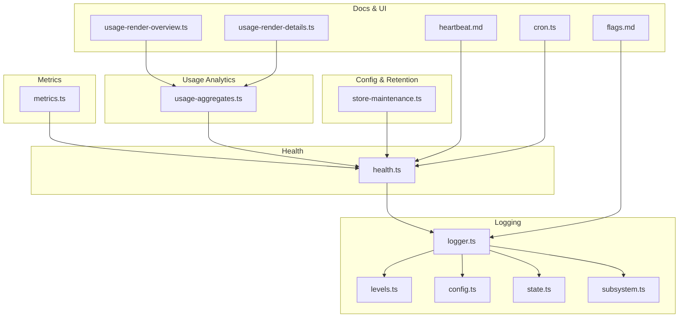
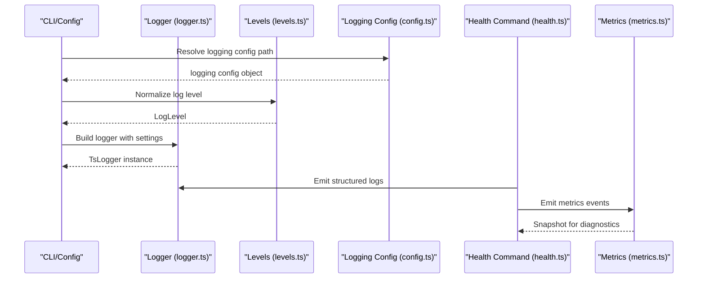
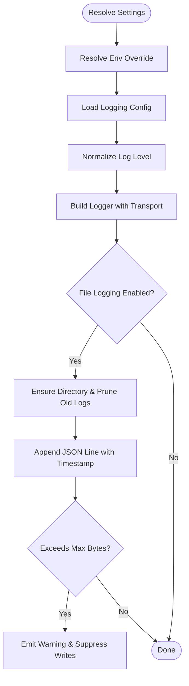
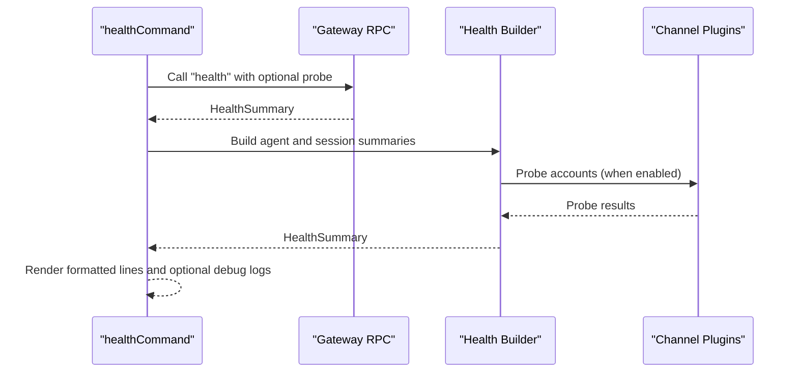
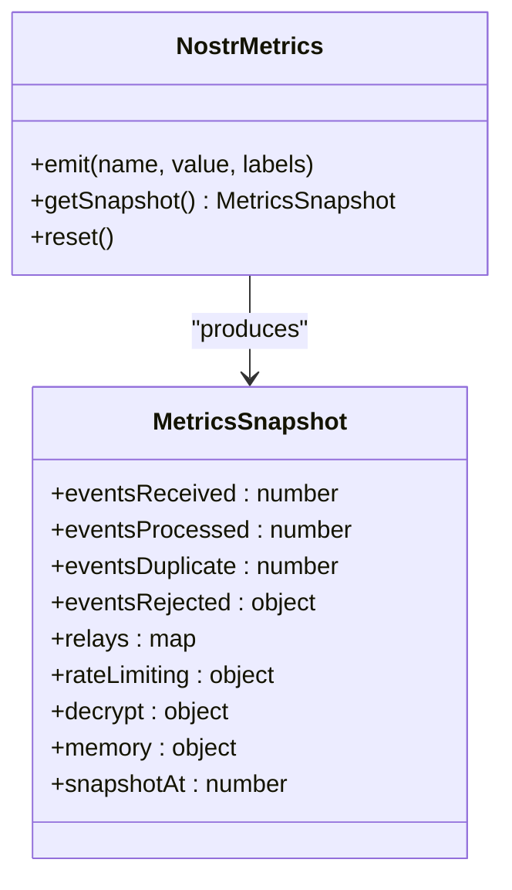
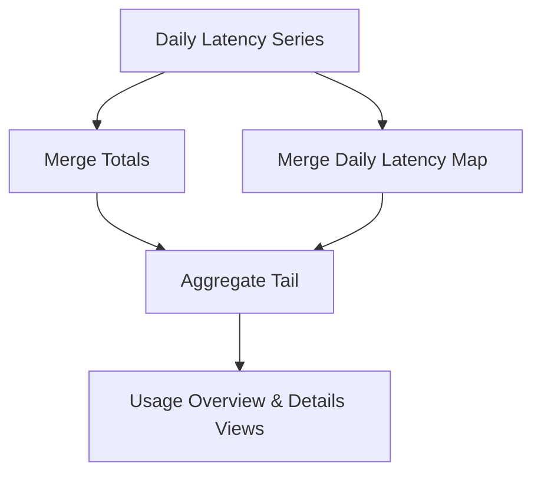
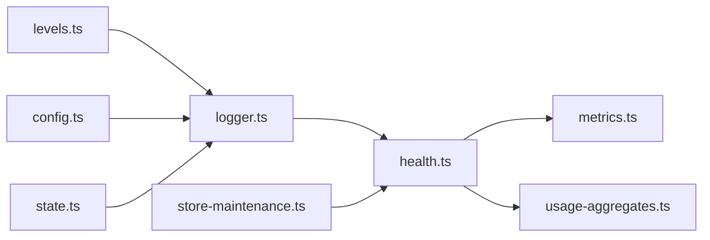

# Monitoring & Logging

<cite>
**Referenced Files in This Document**
- [logger.ts](file://src/logging/logger.ts)
- [levels.ts](file://src/logging/levels.ts)
- [config.ts](file://src/logging/config.ts)
- [state.ts](file://src/logging/state.ts)
- [subsystem.ts](file://src/logging/subsystem.ts)
- [health.ts](file://src/commands/health.ts)
- [metrics.ts](file://extensions/nostr/src/metrics.ts)
- [usage-aggregates.ts](file://src/shared/usage-aggregates.ts)
- [store-maintenance.ts](file://src/config/sessions/store-maintenance.ts)
- [heartbeat.md](file://docs/gateway/heartbeat.md)
- [flags.md](file://docs/diagnostics/flags.md)
- [cron.ts](file://ui/src/ui/views/cron.ts)
- [usage-render-overview.ts](file://ui/src/ui/views/usage-render-overview.ts)
- [usage-render-details.ts](file://ui/src/ui/views/usage-render-details.ts)
- [logging-max-file-bytes.test.ts](file://src/config/logging-max-file-bytes.test.ts)
- [schema.help.quality.test.ts](file://src/config/schema.help.quality.test.ts)
</cite>

## Table of Contents
1. [Introduction](#introduction)
2. [Project Structure](#project-structure)
3. [Core Components](#core-components)
4. [Architecture Overview](#architecture-overview)
5. [Detailed Component Analysis](#detailed-component-analysis)
6. [Dependency Analysis](#dependency-analysis)
7. [Performance Considerations](#performance-considerations)
8. [Troubleshooting Guide](#troubleshooting-guide)
9. [Conclusion](#conclusion)
10. [Appendices](#appendices)

## Introduction
This document provides comprehensive guidance for monitoring and logging in OpenClaw, focusing on operational visibility and observability. It covers logging configuration, log levels, structured logging formats, health monitoring endpoints, metrics collection, alerting, log aggregation and retention, debugging techniques, and dashboard insights for production environments.

## Project Structure
OpenClaw’s monitoring and logging capabilities are implemented across several modules:
- Logging subsystem: logger creation, level parsing, file rotation, and structured JSON output
- Health command: runtime health snapshots and channel probing
- Metrics: plugin-specific metrics for observability (e.g., Nostr relay metrics)
- Usage analytics: latency and cost aggregation utilities
- Configuration: logging and session retention settings
- UI dashboards: usage rendering and alert configuration views

**Diagram sources**
- [logger.ts:1-348](file://src/logging/logger.ts#L1-L348)
- [levels.ts:1-37](file://src/logging/levels.ts#L1-L37)
- [config.ts:1-25](file://src/logging/config.ts#L1-L25)
- [state.ts:1-19](file://src/logging/state.ts#L1-L19)
- [subsystem.ts:308-347](file://src/logging/subsystem.ts#L308-L347)
- [health.ts:1-846](file://src/commands/health.ts#L1-L846)
- [metrics.ts:1-459](file://extensions/nostr/src/metrics.ts#L1-L459)
- [usage-aggregates.ts:1-109](file://src/shared/usage-aggregates.ts#L1-L109)
- [store-maintenance.ts:38-78](file://src/config/sessions/store-maintenance.ts#L38-L78)
- [heartbeat.md:281-317](file://docs/gateway/heartbeat.md#L281-L317)
- [flags.md:87-92](file://docs/diagnostics/flags.md#L87-L92)
- [cron.ts:1239-1262](file://ui/src/ui/views/cron.ts#L1239-L1262)
- [usage-render-overview.ts:530-543](file://ui/src/ui/views/usage-render-overview.ts#L530-L543)
- [usage-render-details.ts:394-429](file://ui/src/ui/views/usage-render-details.ts#L394-L429)

**Section sources**
- [logger.ts:1-348](file://src/logging/logger.ts#L1-L348)
- [health.ts:1-846](file://src/commands/health.ts#L1-L846)

## Core Components
- Structured logging pipeline with JSON output, rolling file support, and configurable log levels
- Health snapshot builder that probes channels and aggregates session and heartbeat data
- Metrics collector for plugin observability with labeled events and snapshots
- Usage analytics utilities for latency and cost aggregation across time series
- Configuration-driven retention and alerting controls for logs and cron runs

**Section sources**
- [logger.ts:126-184](file://src/logging/logger.ts#L126-L184)
- [health.ts:419-595](file://src/commands/health.ts#L419-L595)
- [metrics.ts:157-424](file://extensions/nostr/src/metrics.ts#L157-L424)
- [usage-aggregates.ts:32-109](file://src/shared/usage-aggregates.ts#L32-L109)

## Architecture Overview
The logging and monitoring architecture integrates CLI-level configuration, runtime logger instantiation, health checks, and plugin metrics into a cohesive observability stack.

**Diagram sources**
- [logger.ts:73-106](file://src/logging/logger.ts#L73-L106)
- [levels.ts:13-23](file://src/logging/levels.ts#L13-L23)
- [config.ts:8-24](file://src/logging/config.ts#L8-L24)
- [health.ts:419-595](file://src/commands/health.ts#L419-L595)
- [metrics.ts:157-424](file://extensions/nostr/src/metrics.ts#L157-L424)

## Detailed Component Analysis

### Logging Configuration and Structured Output
- Log levels: supported levels include silent, fatal, error, warn, info, debug, trace
- Level normalization and minimum level mapping for underlying logger
- Environment override for log level and silent fast path for test scenarios
- Structured JSON logging with ISO-local timestamps and optional subsystem tagging
- Rolling file naming with daily suffix and automatic cleanup of old files
- Max file size enforcement with suppression and stderr warning when limit is reached
- External transport registration for forwarding logs to centralized systems

**Diagram sources**
- [logger.ts:73-106](file://src/logging/logger.ts#L73-L106)
- [logger.ts:126-184](file://src/logging/logger.ts#L126-L184)
- [logger.ts:186-208](file://src/logging/logger.ts#L186-L208)
- [logger.ts:309-347](file://src/logging/logger.ts#L309-L347)

**Section sources**
- [levels.ts:1-37](file://src/logging/levels.ts#L1-L37)
- [logger.ts:1-348](file://src/logging/logger.ts#L1-L348)
- [config.ts:1-25](file://src/logging/config.ts#L1-L25)
- [state.ts:1-19](file://src/logging/state.ts#L1-L19)
- [logging-max-file-bytes.test.ts:1-25](file://src/config/logging-max-file-bytes.test.ts#L1-L25)

### Health Monitoring Endpoints and Snapshots
- Health snapshot collects channel statuses, heartbeat intervals, and session summaries
- Probes channel accounts when enabled and configured, capturing probe outcomes and timings
- Emits structured logs for diagnostics and supports verbose output with gateway connection details
- Uses environment variable to enable debug logs for health diagnostics

**Diagram sources**
- [health.ts:597-616](file://src/commands/health.ts#L597-L616)
- [health.ts:419-595](file://src/commands/health.ts#L419-L595)

**Section sources**
- [health.ts:1-846](file://src/commands/health.ts#L1-L846)
- [heartbeat.md:281-317](file://docs/gateway/heartbeat.md#L281-L317)

### Metrics Collection and Alerting Signals
- Metrics system emits labeled events for events, relays, rate limits, decryption, and memory
- Supports circuit breaker state transitions for relays
- Provides snapshots for dashboards and analytics
- Anomaly tracking for webhook status codes with bounded counters and periodic logging

**Diagram sources**
- [metrics.ts:142-151](file://extensions/nostr/src/metrics.ts#L142-L151)
- [metrics.ts:92-136](file://extensions/nostr/src/metrics.ts#L92-L136)

**Section sources**
- [metrics.ts:1-459](file://extensions/nostr/src/metrics.ts#L1-L459)
- [health.ts:77-81](file://src/commands/health.ts#L77-L81)

### Usage Analytics and Latency Aggregation
- Utilities to merge latency totals and daily latency series
- Aggregation helpers for daily usage and model cost breakdowns
- UI rendering components for usage overview and per-point breakdowns

**Diagram sources**
- [usage-aggregates.ts:32-109](file://src/shared/usage-aggregates.ts#L32-L109)
- [usage-render-overview.ts:530-543](file://ui/src/ui/views/usage-render-overview.ts#L530-L543)
- [usage-render-details.ts:394-429](file://ui/src/ui/views/usage-render-details.ts#L394-L429)

**Section sources**
- [usage-aggregates.ts:1-109](file://src/shared/usage-aggregates.ts#L1-L109)
- [usage-render-overview.ts:530-543](file://ui/src/ui/views/usage-render-overview.ts#L530-L543)
- [usage-render-details.ts:394-429](file://ui/src/ui/views/usage-render-details.ts#L394-L429)

### Log Retention and Session Maintenance
- Session maintenance configuration supports prune-after durations, rotation bytes, and archive retention
- Cron run-log retention controls for maximum bytes and lines
- Default thresholds and human-readable examples documented in schema help tests

**Section sources**
- [store-maintenance.ts:38-78](file://src/config/sessions/store-maintenance.ts#L38-L78)
- [schema.help.quality.test.ts:712-721](file://src/config/schema.help.quality.test.ts#L712-L721)

### Alerting Configuration and Thresholds
- UI allows configuring failure alert cooldown and target channel for cron jobs
- Heartbeat configuration toggles for alerts, OK acknowledgments, and UI indicators
- Diagnostic flags note safe-to-leave-enabled flags that reduce log volume for specific subsystems

**Section sources**
- [cron.ts:1239-1262](file://ui/src/ui/views/cron.ts#L1239-L1262)
- [heartbeat.md:281-317](file://docs/gateway/heartbeat.md#L281-L317)
- [flags.md:87-92](file://docs/diagnostics/flags.md#L87-L92)

## Dependency Analysis
- Logger depends on levels, config, and state modules to construct a robust logging pipeline
- Health command depends on channel plugins and gateway RPC to produce runtime health signals
- Metrics module is decoupled and can be integrated by plugins for observability
- Usage analytics utilities are shared across UI and backend for consistent reporting

**Diagram sources**
- [logger.ts:1-348](file://src/logging/logger.ts#L1-L348)
- [levels.ts:1-37](file://src/logging/levels.ts#L1-L37)
- [config.ts:1-25](file://src/logging/config.ts#L1-L25)
- [state.ts:1-19](file://src/logging/state.ts#L1-L19)
- [health.ts:1-846](file://src/commands/health.ts#L1-L846)
- [metrics.ts:1-459](file://extensions/nostr/src/metrics.ts#L1-L459)
- [usage-aggregates.ts:1-109](file://src/shared/usage-aggregates.ts#L1-L109)
- [store-maintenance.ts:38-78](file://src/config/sessions/store-maintenance.ts#L38-L78)

**Section sources**
- [logger.ts:1-348](file://src/logging/logger.ts#L1-L348)
- [health.ts:1-846](file://src/commands/health.ts#L1-L846)

## Performance Considerations
- File logging is bypassed in silent mode to minimize overhead during tests
- JSON serialization and file appends are guarded against failures to prevent blocking
- Rolling log pruning enforces a maximum age to control disk usage
- Metrics emission is designed to be lightweight and optionally forwarded via transports

[No sources needed since this section provides general guidance]

## Troubleshooting Guide
- Enable health debug logs via environment variable to inspect channel accounts, bindings, and gateway probes
- Adjust logging level to capture more granular information; remember that higher levels may suppress lower severity logs
- Use subsystem-aware logging to filter noisy subsystems while preserving critical signals
- Verify max file bytes configuration and ensure sufficient disk space for rolling logs
- Review cron failure alert cooldown and channel selection to balance alert fatigue and visibility

**Section sources**
- [health.ts:77-81](file://src/commands/health.ts#L77-L81)
- [flags.md:87-92](file://docs/diagnostics/flags.md#L87-L92)
- [logger.ts:186-208](file://src/logging/logger.ts#L186-L208)
- [cron.ts:1239-1262](file://ui/src/ui/views/cron.ts#L1239-L1262)

## Conclusion
OpenClaw’s logging and monitoring stack provides structured, configurable, and extensible observability. By leveraging the logger pipeline, health snapshots, metrics collectors, and usage analytics, operators can achieve strong operational visibility, reliable alerting, and actionable dashboards for production deployments.

[No sources needed since this section summarizes without analyzing specific files]

## Appendices

### Log Levels and Normalization
- Supported levels: silent, fatal, error, warn, info, debug, trace
- Minimum level mapping aligns with underlying logger semantics
- Environment overrides take precedence over configuration

**Section sources**
- [levels.ts:1-37](file://src/logging/levels.ts#L1-L37)
- [logger.ts:73-106](file://src/logging/logger.ts#L73-L106)

### Structured Logging Format
- JSON object with timestamp field and arbitrary metadata
- Optional subsystem tagging for targeted filtering
- Console and file transports can be combined

**Section sources**
- [logger.ts:149-155](file://src/logging/logger.ts#L149-L155)
- [subsystem.ts:308-347](file://src/logging/subsystem.ts#L308-L347)

### Health Snapshot Fields
- ok, ts, durationMs, channels, channelOrder, channelLabels, heartbeatSeconds, defaultAgentId, agents, sessions
- Sessions include path, count, and recent entries with keys and ages

**Section sources**
- [health.ts:48-73](file://src/commands/health.ts#L48-L73)
- [health.ts:419-595](file://src/commands/health.ts#L419-L595)