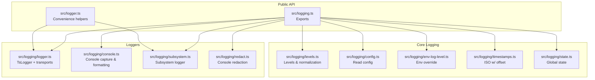
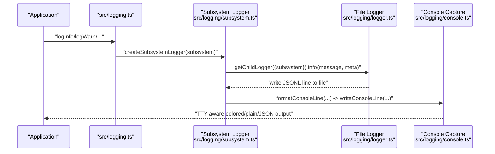
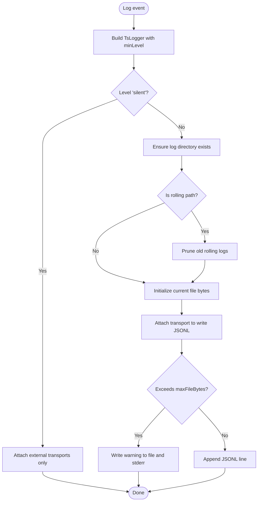
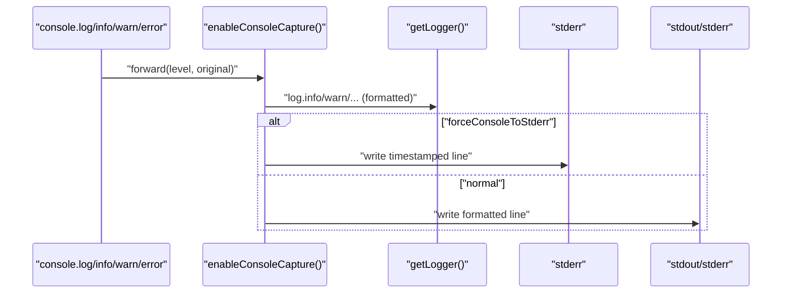
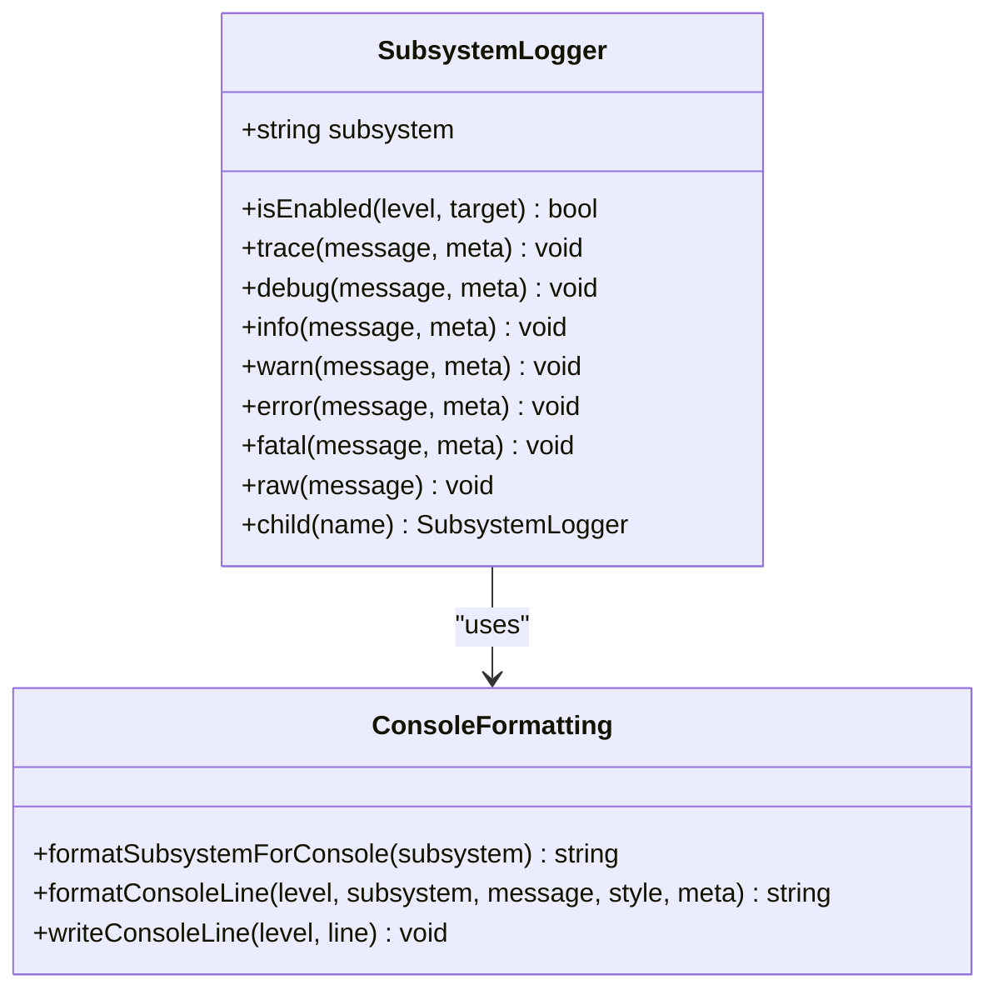
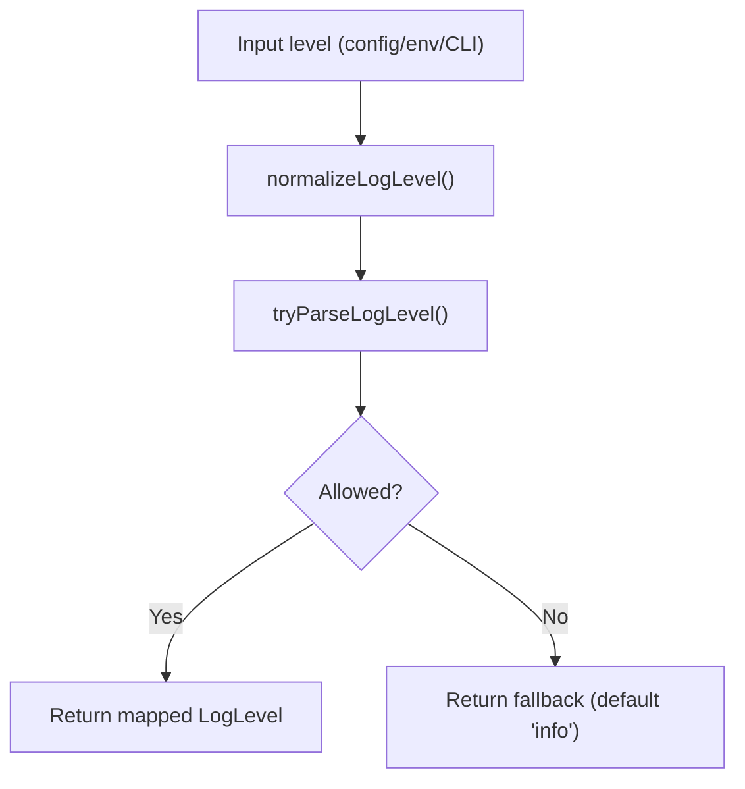
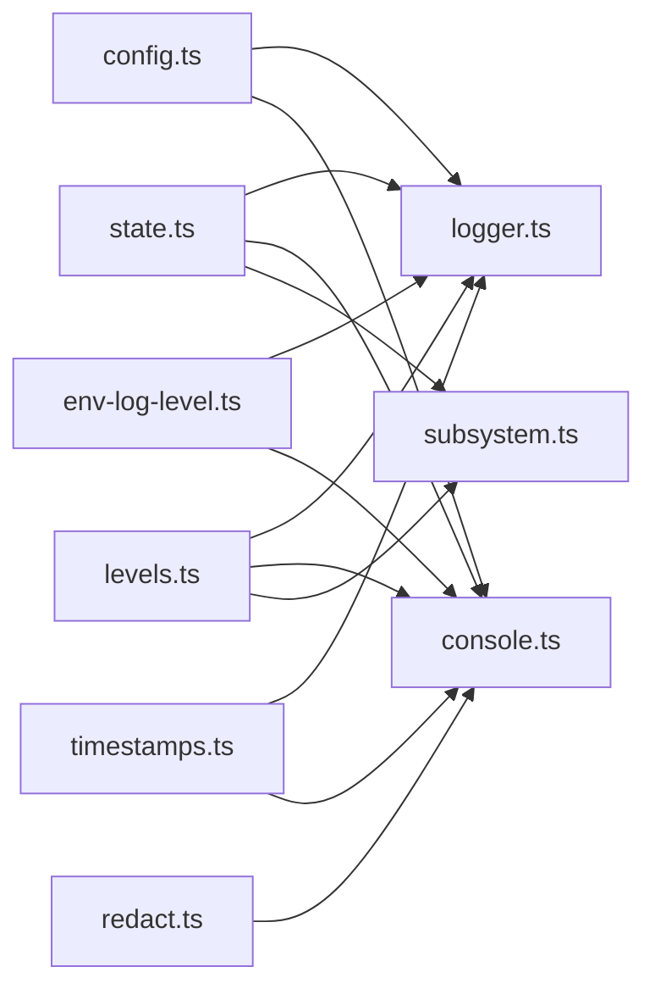

# Application Logging

<cite>
**Referenced Files in This Document**
- [src/logging.ts](file://src/logging.ts)
- [src/logger.ts](file://src/logger.ts)
- [src/logging/logger.ts](file://src/logging/logger.ts)
- [src/logging/console.ts](file://src/logging/console.ts)
- [src/logging/subsystem.ts](file://src/logging/subsystem.ts)
- [src/logging/levels.ts](file://src/logging/levels.ts)
- [src/logging/config.ts](file://src/logging/config.ts)
- [src/logging/env-log-level.ts](file://src/logging/env-log-level.ts)
- [src/logging/timestamps.ts](file://src/logging/timestamps.ts)
- [src/logging/redact.ts](file://src/logging/redact.ts)
- [src/logging/state.ts](file://src/logging/state.ts)
- [src/logger.ts](file://src/logger.ts)
- [src/logger.test.ts](file://src/logger.test.ts)
- [docs/logging.md](file://docs/logging.md)
</cite>

## Table of Contents
1. [Introduction](#introduction)
2. [Project Structure](#project-structure)
3. [Core Components](#core-components)
4. [Architecture Overview](#architecture-overview)
5. [Detailed Component Analysis](#detailed-component-analysis)
6. [Dependency Analysis](#dependency-analysis)
7. [Performance Considerations](#performance-considerations)
8. [Troubleshooting Guide](#troubleshooting-guide)
9. [Conclusion](#conclusion)
10. [Appendices](#appendices)

## Introduction
This document describes the application logging implementation for OpenClaw. It explains the structured logging pipeline, log levels, console and file outputs, formatting standards, configuration, filtering, and operational practices such as rotation and redaction. It also provides guidance on performance, security, and compliance considerations for log management.

## Project Structure
OpenClaw’s logging system is implemented in a cohesive set of modules under src/logging and integrated with higher-level APIs in src/logger and src/logging.ts. The system supports:
- Structured JSONL file logs with automatic daily rolling and pruning
- Console output with TTY-aware formatting and optional JSON mode
- Subsystem-scoped logging with colorized prefixes and selective suppression
- Environment-driven overrides and configuration-driven customization
- Sensitive data redaction for console output

**Diagram sources**
- [src/logging.ts](file://src/logging.ts#L1-L70)
- [src/logger.ts](file://src/logger.ts#L1-L86)
- [src/logging/levels.ts](file://src/logging/levels.ts#L1-L38)
- [src/logging/config.ts](file://src/logging/config.ts#L1-L25)
- [src/logging/env-log-level.ts](file://src/logging/env-log-level.ts#L1-L24)
- [src/logging/timestamps.ts](file://src/logging/timestamps.ts#L1-L37)
- [src/logging/state.ts](file://src/logging/state.ts#L1-L20)
- [src/logging/logger.ts](file://src/logging/logger.ts#L1-L348)
- [src/logging/console.ts](file://src/logging/console.ts#L1-L327)
- [src/logging/subsystem.ts](file://src/logging/subsystem.ts#L1-L426)
- [src/logging/redact.ts](file://src/logging/redact.ts#L1-L152)

**Section sources**
- [src/logging.ts](file://src/logging.ts#L1-L70)
- [src/logger.ts](file://src/logger.ts#L1-L86)
- [docs/logging.md](file://docs/logging.md#L1-L353)

## Core Components
- Structured file logger: JSON Lines with ISO 8601 timestamps and local offset; daily rolling by default; configurable max file size; pruning of old rolling logs.
- Console logger: TTY-aware pretty/compact/json modes; subsystem colorization; timestamp prefixing; suppression of noisy messages; routing to stderr for RPC/JSON modes.
- Subsystem logger: Scoped loggers with hierarchical subsystem names; selective console filtering; raw emission support; runtime binding.
- Levels and normalization: Strict level enumeration with numeric mapping; environment override; test-friendly silent defaults.
- Configuration and environment: Config file parsing; environment variable override; console style normalization.
- Redaction: Regex-based token detection and masking for console output; configurable patterns; opt-in modes.

**Section sources**
- [src/logging/logger.ts](file://src/logging/logger.ts#L1-L348)
- [src/logging/console.ts](file://src/logging/console.ts#L1-L327)
- [src/logging/subsystem.ts](file://src/logging/subsystem.ts#L1-L426)
- [src/logging/levels.ts](file://src/logging/levels.ts#L1-L38)
- [src/logging/config.ts](file://src/logging/config.ts#L1-L25)
- [src/logging/env-log-level.ts](file://src/logging/env-log-level.ts#L1-L24)
- [src/logging/redact.ts](file://src/logging/redact.ts#L1-L152)

## Architecture Overview
The logging architecture separates concerns between file and console outputs, with a central subsystem logger that coordinates both. The file logger is built on a TypeScript logger with a custom transport that writes JSONL lines to disk, handles size caps, and manages daily rolling and pruning. Console capture ensures all console.* calls are mirrored into the file logger while formatting output for readability.

**Diagram sources**
- [src/logging.ts](file://src/logging.ts#L34-L70)
- [src/logging/subsystem.ts](file://src/logging/subsystem.ts#L308-L402)
- [src/logging/logger.ts](file://src/logging/logger.ts#L221-L233)
- [src/logging/console.ts](file://src/logging/console.ts#L193-L251)

## Detailed Component Analysis

### Structured File Logging (JSONL)
- Output format: Each line is a JSON object containing at minimum a timestamp, level, subsystem, and message. Additional metadata is included when provided.
- Location: Default daily rolling path under a preferred temporary directory; can be overridden in configuration.
- Rotation and pruning: Daily rolling filenames; old files older than a threshold are pruned automatically.
- Size cap and suppression: Writes are suppressed when the file exceeds a maximum byte size; a warning is emitted to both file and stderr.
- Transport attachment: External transports can be registered safely without blocking logging.

**Diagram sources**
- [src/logging/logger.ts](file://src/logging/logger.ts#L126-L184)
- [src/logging/logger.ts](file://src/logging/logger.ts#L323-L347)

**Section sources**
- [src/logging/logger.ts](file://src/logging/logger.ts#L15-L348)
- [src/logging/timestamps.ts](file://src/logging/timestamps.ts#L10-L36)
- [src/logger.test.ts](file://src/logger.test.ts#L74-L94)

### Console Logging and Formatting
- Routing: All console.* calls are captured and forwarded to the file logger; output is directed to stderr in RPC/JSON modes to keep stdout clean.
- Styles: Pretty (colorized with subsystem prefixes and timestamps), compact (minimal), and JSON (line-delimited JSON).
- Filtering: Subsystem filters allow selective console emission; noisy probe messages are suppressed unless verbose.
- Timestamps: Optional timestamp prefixing; TTY-aware formatting; EPIPE error handling prevents crashes when pipes close.

**Diagram sources**
- [src/logging/console.ts](file://src/logging/console.ts#L203-L326)

**Section sources**
- [src/logging/console.ts](file://src/logging/console.ts#L1-L327)
- [src/logging/state.ts](file://src/logging/state.ts#L1-L20)

### Subsystem Logging
- Scoping: Child loggers are created with a subsystem binding; subsystem names are normalized and shortened for display.
- Colorization: Unique color per subsystem; overrides for special subsystems; prefix stripping rules for channel and common prefixes.
- Suppression: Probe messages and selected subsystems are suppressed in non-verbose modes.
- Raw emission: Optional raw mode for unformatted console lines while preserving file metadata.

**Diagram sources**
- [src/logging/subsystem.ts](file://src/logging/subsystem.ts#L17-L42)
- [src/logging/subsystem.ts](file://src/logging/subsystem.ts#L126-L235)

**Section sources**
- [src/logging/subsystem.ts](file://src/logging/subsystem.ts#L1-L426)

### Log Levels and Normalization
- Levels: silent, fatal, error, warn, info, debug, trace.
- Mapping: Numeric minLevel used by the underlying logger; silent maps to an infinite threshold.
- Overrides: Environment variable can override configuration; CLI can override environment for a single run.

**Diagram sources**
- [src/logging/levels.ts](file://src/logging/levels.ts#L13-L23)
- [src/logging/env-log-level.ts](file://src/logging/env-log-level.ts#L4-L23)

**Section sources**
- [src/logging/levels.ts](file://src/logging/levels.ts#L1-L38)
- [src/logging/env-log-level.ts](file://src/logging/env-log-level.ts#L1-L24)

### Configuration and Environment
- Configuration: Reads logging settings from the main config file; supports consoleLevel, consoleStyle, file path, redaction mode/patterns.
- Environment override: OPENCLAW_LOG_LEVEL takes precedence over config; invalid values are reported once.
- Defaults: File logging defaults to daily rolling; console defaults to info unless verbose; JSON mode for non-TTY.

**Section sources**
- [src/logging/config.ts](file://src/logging/config.ts#L1-L25)
- [src/logging/env-log-level.ts](file://src/logging/env-log-level.ts#L1-L24)
- [src/logging/console.ts](file://src/logging/console.ts#L40-L91)
- [docs/logging.md](file://docs/logging.md#L101-L141)

### Sensitive Data Redaction
- Scope: Applied to console output only; file logs remain unchanged.
- Modes: off or tools; tools mode is default.
- Patterns: Built-in regex patterns for tokens, keys, headers, PEM blocks, and common identifiers; configurable via patterns list.
- Masking: Tokens are masked with preserved prefix/suffix; PEM blocks are redacted with header/footer retained.

**Section sources**
- [src/logging/redact.ts](file://src/logging/redact.ts#L1-L152)
- [docs/logging.md](file://docs/logging.md#L133-L141)

## Dependency Analysis
The logging system exhibits low coupling and high cohesion:
- Centralized state in a single module holds caches and flags.
- File and console loggers are independent; console capture is optional and additive.
- Subsystem logger composes file and console behaviors without tight coupling.
- Configuration and environment resolution are centralized and reusable.

**Diagram sources**
- [src/logging/state.ts](file://src/logging/state.ts#L1-L20)
- [src/logging/logger.ts](file://src/logging/logger.ts#L1-L348)
- [src/logging/console.ts](file://src/logging/console.ts#L1-L327)
- [src/logging/subsystem.ts](file://src/logging/subsystem.ts#L1-L426)
- [src/logging/levels.ts](file://src/logging/levels.ts#L1-L38)
- [src/logging/config.ts](file://src/logging/config.ts#L1-L25)
- [src/logging/env-log-level.ts](file://src/logging/env-log-level.ts#L1-L24)
- [src/logging/timestamps.ts](file://src/logging/timestamps.ts#L1-L37)
- [src/logging/redact.ts](file://src/logging/redact.ts#L1-L152)

**Section sources**
- [src/logging/state.ts](file://src/logging/state.ts#L1-L20)
- [src/logging/logger.ts](file://src/logging/logger.ts#L1-L348)
- [src/logging/console.ts](file://src/logging/console.ts#L1-L327)
- [src/logging/subsystem.ts](file://src/logging/subsystem.ts#L1-L426)

## Performance Considerations
- Fast-path for tests: Silent file logging with minimal config reads avoids expensive initialization in test environments.
- Non-blocking writes: Transports and console forwarding wrap operations in try/catch to prevent logging failures from impacting application flow.
- Size cap and suppression: When the file exceeds the maximum size, writes are suppressed and a warning is emitted to avoid disk thrash.
- Console suppression: Noisy messages and probe traffic are suppressed in non-verbose modes to reduce console overhead.
- External transports: Registered transports are attached to the logger lazily and guarded against throwing.

[No sources needed since this section provides general guidance]

## Troubleshooting Guide
- Logs appear empty:
  - Verify the Gateway is running and writing to the configured file path.
  - Increase file log level to debug or trace temporarily.
- Console output is missing:
  - Ensure console level is not set to silent; verify subsystem filters are not excluding the target.
  - Use verbose mode to reveal debug-level console output.
- Excessive console noise:
  - Enable verbose mode selectively for targeted debugging; use subsystem filters to limit output.
- Exporting logs:
  - Enable diagnostics OTLP exporter to ship structured logs to an OpenTelemetry collector; respect sampling and flush intervals.
- File growth:
  - Adjust max file size or rely on daily rolling; monitor pruning behavior for old files.

**Section sources**
- [docs/logging.md](file://docs/logging.md#L347-L353)
- [src/logging/logger.ts](file://src/logging/logger.ts#L156-L178)
- [src/logging/console.ts](file://src/logging/console.ts#L148-L162)

## Conclusion
OpenClaw’s logging system provides a robust, structured, and configurable foundation for observability across file and console outputs. It balances performance, readability, and security through careful design: JSONL file logs, TTY-aware console formatting, subsystem scoping, environment-driven overrides, and optional redaction. Operators can tailor verbosity, formats, and retention strategies to meet operational needs while maintaining compliance and minimizing overhead.

[No sources needed since this section summarizes without analyzing specific files]

## Appendices

### Log Levels Reference
- Levels: silent, fatal, error, warn, info, debug, trace
- Min-level mapping: Used internally by the logger to gate events
- Overrides: OPENCLAW_LOG_LEVEL environment variable and CLI options take precedence

**Section sources**
- [src/logging/levels.ts](file://src/logging/levels.ts#L1-L38)
- [src/logging/env-log-level.ts](file://src/logging/env-log-level.ts#L1-L24)
- [docs/logging.md](file://docs/logging.md#L116-L124)

### Configuration Options
- File logging:
  - level: file log level
  - file: absolute path or directory for logs
  - maxFileBytes: maximum file size before suppression
- Console logging:
  - consoleLevel: console verbosity
  - consoleStyle: pretty, compact, json
- Redaction:
  - redactSensitive: off or tools
  - redactPatterns: custom regex list

**Section sources**
- [src/logging/config.ts](file://src/logging/config.ts#L1-L25)
- [src/logging/logger.ts](file://src/logging/logger.ts#L186-L191)
- [src/logging/console.ts](file://src/logging/console.ts#L40-L58)
- [src/logging/redact.ts](file://src/logging/redact.ts#L108-L124)
- [docs/logging.md](file://docs/logging.md#L101-L141)

### Best Practices
- Prefer structured JSONL for file logs; use CLI or Control UI to tail and filter.
- Use subsystem prefixes to organize logs; leverage subsystem filters for focused debugging.
- Keep consoleLevel at info for normal operation; increase to debug or trace only when necessary.
- Apply redaction for console output in shared or CI environments.
- Configure maxFileBytes and rely on daily rolling to manage disk usage.

[No sources needed since this section provides general guidance]