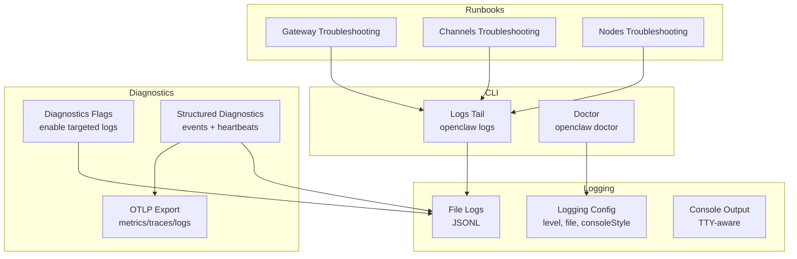
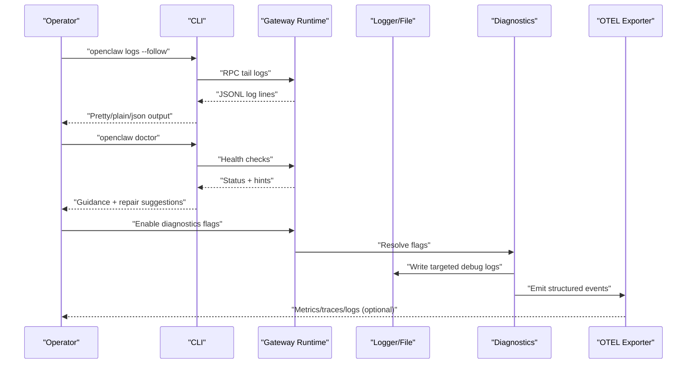
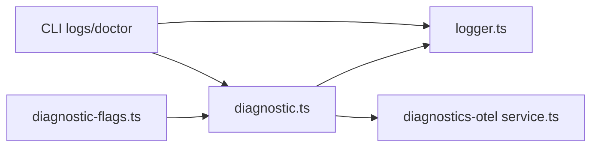

# Diagnostics & Troubleshooting

<cite>
**Referenced Files in This Document**
- [flags.md](file://docs/diagnostics/flags.md)
- [logging.md](file://docs/logging.md)
- [logs.md](file://docs/cli/logs.md)
- [doctor.md](file://docs/cli/doctor.md)
- [gateway/troubleshooting.md](file://docs/gateway/troubleshooting.md)
- [help/troubleshooting.md](file://docs/help/troubleshooting.md)
- [channels/troubleshooting.md](file://docs/channels/troubleshooting.md)
- [nodes/troubleshooting.md](file://docs/nodes/troubleshooting.md)
- [diagnostic-flags.ts](file://src/infra/diagnostic-flags.ts)
- [logger.ts](file://src/logging/logger.ts)
- [diagnostic.ts](file://src/logging/diagnostic.ts)
- [service.ts](file://extensions/diagnostics-otel/src/service.ts)
</cite>

## Table of Contents
1. [Introduction](#introduction)
2. [Project Structure](#project-structure)
3. [Core Components](#core-components)
4. [Architecture Overview](#architecture-overview)
5. [Detailed Component Analysis](#detailed-component-analysis)
6. [Dependency Analysis](#dependency-analysis)
7. [Performance Considerations](#performance-considerations)
8. [Troubleshooting Guide](#troubleshooting-guide)
9. [Conclusion](#conclusion)
10. [Appendices](#appendices)

## Introduction
This document provides comprehensive diagnostics and troubleshooting guidance for OpenClaw. It explains how to collect and interpret logs, use diagnostic flags, enable targeted debug logs, and leverage structured diagnostics for observability. It also covers systematic workflows for common issues (connectivity, replies, automation, nodes, browsers), performance profiling, and remote debugging techniques.

## Project Structure
OpenClaw’s diagnostics and troubleshooting surface is organized around:
- Logging configuration and output (file and console)
- CLI commands for live log viewing and health checks
- Diagnostic flags for targeted subsystem logs
- Structured diagnostics and optional OpenTelemetry export
- Channel- and node-specific troubleshooting runbooks

**Diagram sources**
- [logging.md](file://docs/logging.md#L1-L353)
- [flags.md](file://docs/diagnostics/flags.md#L1-L92)
- [diagnostic.ts](file://src/logging/diagnostic.ts#L1-L434)
- [service.ts](file://extensions/diagnostics-otel/src/service.ts#L78-L108)
- [gateway/troubleshooting.md](file://docs/gateway/troubleshooting.md#L1-L367)
- [channels/troubleshooting.md](file://docs/channels/troubleshooting.md#L1-L118)
- [nodes/troubleshooting.md](file://docs/nodes/troubleshooting.md#L1-L115)

**Section sources**
- [logging.md](file://docs/logging.md#L1-L353)
- [flags.md](file://docs/diagnostics/flags.md#L1-L92)

## Core Components
- Logging subsystem: file rolling JSONL logs, console formatting, and environment overrides.
- Diagnostics flags: opt-in, wildcard-enabled flags to enable targeted debug logs without raising global verbosity.
- Structured diagnostics: telemetry events (webhooks, queues, sessions) and periodic heartbeats.
- OpenTelemetry export: optional OTLP/HTTP export of diagnostics, metrics, and logs.
- CLI diagnostics tools: live log tailing and guided health checks.

**Section sources**
- [logger.ts](file://src/logging/logger.ts#L1-L348)
- [diagnostic-flags.ts](file://src/infra/diagnostic-flags.ts#L1-L92)
- [diagnostic.ts](file://src/logging/diagnostic.ts#L1-L434)
- [service.ts](file://extensions/diagnostics-otel/src/service.ts#L78-L108)
- [logs.md](file://docs/cli/logs.md#L1-L29)
- [doctor.md](file://docs/cli/doctor.md#L1-L46)

## Architecture Overview
The diagnostics pipeline integrates CLI, logging, flags, structured diagnostics, and optional OTLP export.

**Diagram sources**
- [logging.md](file://docs/logging.md#L1-L353)
- [flags.md](file://docs/diagnostics/flags.md#L1-L92)
- [diagnostic.ts](file://src/logging/diagnostic.ts#L1-L434)
- [service.ts](file://extensions/diagnostics-otel/src/service.ts#L78-L108)

## Detailed Component Analysis

### Logging and Log Collection
- File logs: rolling JSONL under a dated path; configurable via logging.file; supports size caps and pruning.
- Console output: TTY-aware pretty/compact/json modes; controlled by logging.consoleStyle and consoleLevel.
- CLI tailing: live, JSON, plain, and colorized modes; also supports local timezone rendering.
- Environment overrides: OPENCLAW_LOG_LEVEL and global CLI --log-level override config.

Operational tips:
- Use CLI logs --follow for remote gateways.
- Switch to --json for machine parsing and downstream tooling.
- Increase verbosity to debug with logging.level and --log-level.

**Section sources**
- [logger.ts](file://src/logging/logger.ts#L1-L348)
- [logging.md](file://docs/logging.md#L1-L353)
- [logs.md](file://docs/cli/logs.md#L1-L29)

### Diagnostics Flags
- Purpose: enable targeted debug logs without raising global verbosity.
- Behavior: case-insensitive flags with wildcard support; can be set in config or via OPENCLAW_DIAGNOSTICS env.
- Output: logs to the standard diagnostics log file; redaction respects logging.redactSensitive.
- Extraction: pick latest log file and filter with grep/ripgrep; tail while reproducing.

Best practices:
- Start with narrow flags (e.g., telegram.http) and expand with wildcards.
- Restart the gateway after changing flags.
- Combine with doctor and channel status probes for context.

**Section sources**
- [flags.md](file://docs/diagnostics/flags.md#L1-L92)
- [diagnostic-flags.ts](file://src/infra/diagnostic-flags.ts#L1-L92)

### Structured Diagnostics and Heartbeats
- Events: webhooks received/processed/error, messages queued/processed, queue lane enqueue/dequeue, session state transitions, stuck session warnings, run attempts, tool loop actions.
- Heartbeat: periodic aggregation of counters and state for queues, sessions, and webhooks.
- Stuck session detection: configurable warning threshold.

Use cases:
- Track message flow bottlenecks.
- Identify stuck sessions and queue depth spikes.
- Correlate webhook errors with session state.

**Section sources**
- [diagnostic.ts](file://src/logging/diagnostic.ts#L1-L434)

### OpenTelemetry Export (Optional)
- Enable diagnostics and exporter plugin; OTLP/HTTP only.
- Export types: traces, metrics, logs.
- Metrics include token usage, durations, queue depths, wait times, and session states.
- Spans include model usage, webhook processing, message processing, and session stuck events.
- Sampling and flush intervals configurable.

Operational notes:
- Respect logging.level for file logs; console redaction does not apply to OTLP logs.
- Prefer collector-side sampling/filtering for high-volume environments.

**Section sources**
- [logging.md](file://docs/logging.md#L142-L353)
- [service.ts](file://extensions/diagnostics-otel/src/service.ts#L78-L108)

### Remote Debugging and Live Inspection
- Use openclaw logs --follow to inspect logs remotely without SSH.
- Use openclaw doctor for guided health checks and quick fixes.
- For browser tools, use browser CLI debug commands to record traces and save artifacts.

**Section sources**
- [logs.md](file://docs/cli/logs.md#L1-L29)
- [doctor.md](file://docs/cli/doctor.md#L1-L46)

## Dependency Analysis
The diagnostics stack depends on:
- Logging configuration and transports for file output.
- Diagnostics flags resolution to gate targeted logs.
- Structured diagnostics emitting telemetry and heartbeats.
- Optional OTLP exporter plugin for external observability backends.

**Diagram sources**
- [diagnostic-flags.ts](file://src/infra/diagnostic-flags.ts#L1-L92)
- [diagnostic.ts](file://src/logging/diagnostic.ts#L1-L434)
- [logger.ts](file://src/logging/logger.ts#L1-L348)
- [service.ts](file://extensions/diagnostics-otel/src/service.ts#L78-L108)

**Section sources**
- [diagnostic-flags.ts](file://src/infra/diagnostic-flags.ts#L1-L92)
- [diagnostic.ts](file://src/logging/diagnostic.ts#L1-L434)
- [logger.ts](file://src/logging/logger.ts#L1-L348)
- [service.ts](file://extensions/diagnostics-otel/src/service.ts#L78-L108)

## Performance Considerations
- Keep logging.level at info or warn for production; increase to debug only during reproduction.
- Use diagnostics flags to limit noise to specific subsystems.
- For high-volume environments, prefer OTLP collector sampling and filtering.
- Monitor queue depths and session stuck warnings from structured diagnostics heartbeats.

[No sources needed since this section provides general guidance]

## Troubleshooting Guide

### Systematic Workflow (First 60 Seconds)
Follow this ladder to triage quickly:
- openclaw status
- openclaw status --all
- openclaw gateway probe
- openclaw gateway status
- openclaw doctor
- openclaw channels status --probe
- openclaw logs --follow

Healthy signals:
- Status shows configured channels and no auth errors.
- Gateway probe and status report runtime running and RPC probe ok.
- Doctor finds no blocking issues.
- Channels status --probe shows connected/ready.
- Logs show steady activity without repeating fatal errors.

**Section sources**
- [help/troubleshooting.md](file://docs/help/troubleshooting.md#L13-L36)

### Gateway Connectivity and Startup
Common symptoms and checks:
- Gateway not running or service not running:
  - Verify gateway mode and auth binding.
  - Look for bind/auth mismatch or port conflicts.
- Control UI/dashboard connectivity:
  - Validate URL, auth mode, and secure context.
  - Device auth errors indicate nonce/signature mismatches.

Remediation steps:
- Adjust gateway.mode and auth settings.
- Reinstall service metadata if config/runtime disagree after checks.
- Update clients to match device auth v2 requirements.

**Section sources**
- [gateway/troubleshooting.md](file://docs/gateway/troubleshooting.md#L139-L168)
- [gateway/troubleshooting.md](file://docs/gateway/troubleshooting.md#L91-L138)

### No Replies or Routing Issues
- Confirm pairing approvals and group mention gating.
- Review allowlists and DM policies.
- Use logs to identify dropped messages due to mention requirements or pairing.

**Section sources**
- [gateway/troubleshooting.md](file://docs/gateway/troubleshooting.md#L61-L90)
- [channels/troubleshooting.md](file://docs/channels/troubleshooting.md#L13-L30)

### Channel Connected but Messages Not Flowing
- Probe channel connectivity and review logs for permission errors.
- Check provider-specific policies (mention gating, scopes, membership).

**Section sources**
- [gateway/troubleshooting.md](file://docs/gateway/troubleshooting.md#L169-L199)
- [channels/troubleshooting.md](file://docs/channels/troubleshooting.md#L13-L30)

### Automation (Cron and Heartbeat)
- Verify scheduler enabled and next wake present.
- Check job run history and heartbeat skip reasons.
- Investigate quiet-hours, in-flight requests, or invalid account IDs.

**Section sources**
- [gateway/troubleshooting.md](file://docs/gateway/troubleshooting.md#L200-L231)

### Nodes: Paired Tool Failures
- Foreground-only capabilities require the node app in foreground.
- Check OS permissions and exec approvals/allowlists.
- Re-approve device pairing and re-open the node app if needed.

**Section sources**
- [nodes/troubleshooting.md](file://docs/nodes/troubleshooting.md#L13-L30)
- [nodes/troubleshooting.md](file://docs/nodes/troubleshooting.md#L37-L50)
- [nodes/troubleshooting.md](file://docs/nodes/troubleshooting.md#L79-L91)

### Browser Tools Failures
- Validate browser executable path and CDP profile reachability.
- Ensure extension relay is attached for chrome profile.
- Use browser CLI debug commands to record traces and artifacts.

**Section sources**
- [gateway/troubleshooting.md](file://docs/gateway/troubleshooting.md#L263-L293)

### Diagnosing with Logs and Flags
- Tail logs live with CLI logs --follow and filter with grep/ripgrep.
- Enable diagnostics flags for targeted subsystem logs (e.g., telegram.http).
- Extract latest log file and filter for specific error patterns.

**Section sources**
- [logging.md](file://docs/logging.md#L38-L87)
- [flags.md](file://docs/diagnostics/flags.md#L65-L92)

### Structured Diagnostics and OTLP Export
- Enable diagnostics and exporter plugin for metrics/traces/logs.
- Use exported metrics to track token usage, durations, queue depths, and session states.
- Use spans to trace model usage and webhook/message processing.

**Section sources**
- [logging.md](file://docs/logging.md#L142-L353)
- [service.ts](file://extensions/diagnostics-otel/src/service.ts#L78-L108)

### Remote Debugging and Log Analysis Tools
- Use openclaw logs --follow for remote inspection.
- Use openclaw doctor for guided repairs and environment checks.
- For browser issues, record traces and save artifacts for analysis.

**Section sources**
- [logs.md](file://docs/cli/logs.md#L1-L29)
- [doctor.md](file://docs/cli/doctor.md#L1-L46)

### Performance Profiling Methods
- Use structured diagnostics heartbeats to monitor queue depths and wait times.
- Export metrics for token usage, run durations, and message flow histograms.
- Correlate spikes with logs and diagnostics flags for root cause.

**Section sources**
- [diagnostic.ts](file://src/logging/diagnostic.ts#L333-L410)
- [logging.md](file://docs/logging.md#L268-L326)

## Conclusion
OpenClaw’s diagnostics and troubleshooting ecosystem combines flexible logging, targeted diagnostic flags, structured telemetry, and optional OTLP export. Use the systematic workflows to isolate issues quickly, collect contextual logs and metrics, and apply targeted fixes. For complex scenarios, combine CLI diagnostics, structured events, and OTLP insights to pinpoint root causes efficiently.

[No sources needed since this section summarizes without analyzing specific files]

## Appendices

### Quick Reference: Commands and Concepts
- Live logs: openclaw logs --follow
- Health checks: openclaw doctor
- Diagnostics flags: OPENCLAW_DIAGNOSTICS or config diagnostics.flags
- Structured diagnostics: heartbeats and event catalog
- OTLP export: diagnostics-otel plugin with http/protobuf

**Section sources**
- [logs.md](file://docs/cli/logs.md#L1-L29)
- [doctor.md](file://docs/cli/doctor.md#L1-L46)
- [flags.md](file://docs/diagnostics/flags.md#L1-L92)
- [logging.md](file://docs/logging.md#L142-L353)