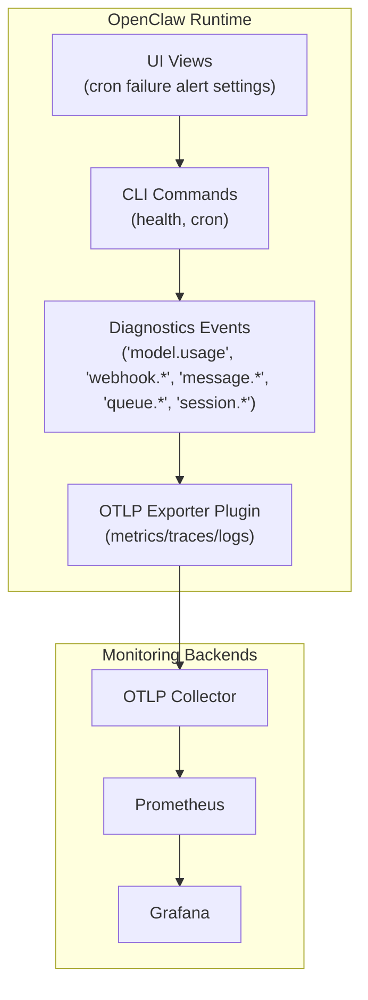
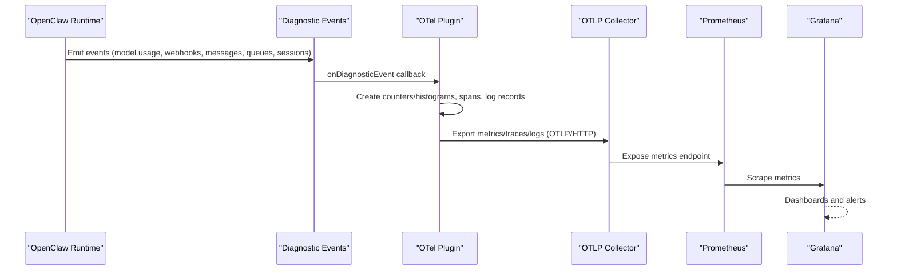
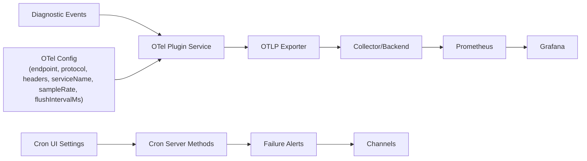

# Metrics & Alerting

<cite>
**Referenced Files in This Document**
- [service.ts](file://extensions/diagnostics-otel/src/service.ts)
- [logging.md](file://docs/logging.md)
- [schema.help.ts](file://src/config/schema.help.ts)
- [usage-aggregates.ts](file://src/shared/usage-aggregates.ts)
- [health.ts](file://src/commands/health.ts)
- [cron.ts](file://src/gateway/server-methods/cron.ts)
- [cron.ui.ts](file://ui/src/ui/views/cron.ts)
- [webhook.md](file://docs/automation/webhook.md)
- [usage-tracking.md](file://docs/concepts/usage-tracking.md)
- [HealthStore.swift](file://apps/macos/Sources/OpenClaw/HealthStore.swift)
</cite>

## Table of Contents
1. [Introduction](#introduction)
2. [Project Structure](#project-structure)
3. [Core Components](#core-components)
4. [Architecture Overview](#architecture-overview)
5. [Detailed Component Analysis](#detailed-component-analysis)
6. [Dependency Analysis](#dependency-analysis)
7. [Performance Considerations](#performance-considerations)
8. [Troubleshooting Guide](#troubleshooting-guide)
9. [Conclusion](#conclusion)
10. [Appendices](#appendices)

## Introduction
This document defines the metrics and alerting approach for OpenClaw observability. It covers key performance indicators, usage metrics, and system health signals; explains how to configure alerting rules, notification channels, and escalation; documents metric export formats and integration with Prometheus/Grafana; and provides practical guidance on thresholds, false positive mitigation, custom metric development, aggregation, and historical trend analysis. It also addresses alert fatigue prevention and routing strategies.

## Project Structure
OpenClaw’s observability stack centers on:
- An OpenTelemetry exporter plugin that emits metrics, traces, and logs
- Built-in diagnostic events for model usage, message flow, queues, and sessions
- CLI and UI tools for health inspection and cron-based alert delivery
- Optional integration with external monitoring systems via Prometheus/Grafana

**Diagram sources**
- [service.ts](file://extensions/diagnostics-otel/src/service.ts#L167-L242)
- [logging.md](file://docs/logging.md#L268-L326)
- [health.ts](file://src/commands/health.ts#L1-L200)
- [cron.ts](file://src/gateway/server-methods/cron.ts#L1-L200)
- [cron.ui.ts](file://ui/src/ui/views/cron.ts#L1237-L1283)

**Section sources**
- [service.ts](file://extensions/diagnostics-otel/src/service.ts#L1-L200)
- [logging.md](file://docs/logging.md#L142-L353)

## Core Components
- Metrics exporter: OpenTelemetry OTLP/HTTP exporter with configurable endpoint, protocol, headers, service name, sampling, and flush interval.
- Diagnostic event catalog: Structured events for model usage, webhook ingress/processing, message queueing/processing, queue lanes, session state, and stuck sessions.
- Aggregation utilities: Helpers to merge latency totals, compute daily aggregates, and sort by channel/provider.
- Health and cron: CLI health command and cron server methods for system state and failure alert delivery.
- UI integration: Cron failure alert settings exposed in the Control UI.

**Section sources**
- [service.ts](file://extensions/diagnostics-otel/src/service.ts#L167-L242)
- [logging.md](file://docs/logging.md#L164-L326)
- [usage-aggregates.ts](file://src/shared/usage-aggregates.ts#L32-L109)
- [health.ts](file://src/commands/health.ts#L1-L200)
- [cron.ts](file://src/gateway/server-methods/cron.ts#L1-L200)
- [cron.ui.ts](file://ui/src/ui/views/cron.ts#L1237-L1283)

## Architecture Overview
The observability pipeline collects in-process diagnostic events, converts them into metrics/traces/logs, and exports via OTLP/HTTP to a collector/backend. Prometheus scrapes metrics, and Grafana visualizes dashboards. Alerts are configured in Grafana or via Prometheus Alertmanager.

**Diagram sources**
- [service.ts](file://extensions/diagnostics-otel/src/service.ts#L619-L664)
- [logging.md](file://docs/logging.md#L224-L353)

## Detailed Component Analysis

### Metrics Catalog and Attributes
OpenClaw exports the following metric families with typical attributes:
- Token usage and cost
  - Name: openclaw.tokens
  - Type: Counter
  - Attributes: openclaw.token (input, output, cache_read, cache_write, prompt, total), openclaw.channel, openclaw.provider, openclaw.model
  - Name: openclaw.cost.usd
  - Type: Counter
  - Attributes: openclaw.channel, openclaw.provider, openclaw.model
- Run and context sizing
  - Name: openclaw.run.duration_ms
  - Type: Histogram
  - Attributes: openclaw.channel, openclaw.provider, openclaw.model
  - Name: openclaw.context.tokens
  - Type: Histogram
  - Attributes: openclaw.context (limit, used), openclaw.channel, openclaw.provider, openclaw.model
- Webhook telemetry
  - Name: openclaw.webhook.received
  - Type: Counter
  - Attributes: openclaw.channel, openclaw.webhook
  - Name: openclaw.webhook.error
  - Type: Counter
  - Attributes: openclaw.channel, openclaw.webhook
  - Name: openclaw.webhook.duration_ms
  - Type: Histogram
  - Attributes: openclaw.channel, openclaw.webhook
- Message flow
  - Name: openclaw.message.queued
  - Type: Counter
  - Attributes: openclaw.channel, openclaw.source
  - Name: openclaw.message.processed
  - Type: Counter
  - Attributes: openclaw.channel, openclaw.outcome
  - Name: openclaw.message.duration_ms
  - Type: Histogram
  - Attributes: openclaw.channel, openclaw.outcome
- Queues and sessions
  - Name: openclaw.queue.lane.enqueue
  - Name: openclaw.queue.lane.dequeue
  - Name: openclaw.queue.depth
  - Name: openclaw.queue.wait_ms
  - Name: openclaw.session.state
  - Name: openclaw.session.stuck
  - Name: openclaw.session.stuck_age_ms
  - Name: openclaw.run.attempt

These metrics are created and recorded in the OTel plugin service.

**Section sources**
- [service.ts](file://extensions/diagnostics-otel/src/service.ts#L170-L242)
- [logging.md](file://docs/logging.md#L268-L306)

### Diagnostic Event Catalog and Spans
The plugin subscribes to diagnostic events and records metrics/spans accordingly:
- model.usage: emits token counters, cost counter, run duration histogram, context histogram; creates a span with session identifiers and token breakdowns
- webhook.received/processed/error: increments counters and histograms; adds spans with chatId and error redaction
- message.queued/processed: increments counters and histograms; adds spans with outcome, chatId, messageId, session identifiers, and optional reason
- queue.lane.enqueue/dequeue: increments counters and records queue depth and wait histograms
- session.state/stuck: increments state counters and stuck counters; records stuck age histogram; creates spans with session identity and queue depth
- run.attempt: increments attempt counter
- diagnostic.heartbeat: records queue depth for heartbeat channel

Spans are created with optional start times derived from durationMs when available.

**Section sources**
- [service.ts](file://extensions/diagnostics-otel/src/service.ts#L382-L657)
- [logging.md](file://docs/logging.md#L164-L185)

### Health and System State
- CLI health command inspects channel accounts, agent heartbeats, and session stores, returning a structured health summary suitable for dashboards and automation.
- macOS platform parses health snapshots and surfaces last success/error timestamps.

**Section sources**
- [health.ts](file://src/commands/health.ts#L1-L200)
- [HealthStore.swift](file://apps/macos/Sources/OpenClaw/HealthStore.swift#L115-L145)

### Cron-Based Failure Alerts and Routing
- Cron jobs can be configured to announce failures to channels. The UI exposes fields for failure alert cooldown, channel, recipient override, and mode.
- Cron server methods manage scheduling, exponential backoff after consecutive errors, and run queuing with eventual outcomes.

**Section sources**
- [cron.ui.ts](file://ui/src/ui/views/cron.ts#L1237-L1283)
- [cron.ts](file://src/gateway/server-methods/cron.ts#L1-L200)

### Usage Aggregation and Historical Trends
- Aggregation utilities merge latency totals, daily latency, and model daily cost maps, and produce sorted views by channel and date.
- These aggregations support building historical trends and cost attribution across providers/models/channels.

**Section sources**
- [usage-aggregates.ts](file://src/shared/usage-aggregates.ts#L32-L109)

### Export Formats and Integration
- OpenTelemetry export protocol: OTLP/HTTP (protobuf) is supported; grpc is ignored by the plugin.
- Endpoint resolution: If endpoint lacks /v1/traces|metrics|logs, the plugin appends the appropriate path.
- Headers: Optional HTTP/gRPC metadata headers for tenant auth or routing.
- Service name: Resource attribute for backend identification.
- Sampling and flushing: Root trace sampling rate and periodic flush interval.
- Logs export: When enabled, logs are exported over OTLP with redaction and structured attributes.

Integration with Prometheus/Grafana:
- Prometheus scrapes metrics from the collector/backend.
- Grafana dashboards can visualize counters/histograms and correlate with traces/logs.

**Section sources**
- [service.ts](file://extensions/diagnostics-otel/src/service.ts#L24-L38)
- [logging.md](file://docs/logging.md#L224-L353)

### Alerting Rule Configuration and Notification Channels
Common alerting scenarios and thresholds:
- Webhook error rate: Sudden spikes in openclaw.webhook.error per channel/webhook type
- Webhook latency: Tail latency (p95/p99) in openclaw.webhook.duration_ms exceeding SLIs
- Message processing backlog: High openclaw.queue.depth or long openclaw.queue.wait_ms
- Stuck sessions: Count of openclaw.session.stuck and age histogram openclaw.session.stuck_age_ms
- Cost burn: Rapid increase in openclaw.cost.usd over time windows
- Agent run duration: Long tail in openclaw.run.duration_ms indicating provider slowdowns
- Queue lane imbalance: Imbalance between enqueue and dequeue counters for lanes

Notification channels and escalation:
- Use cron jobs to deliver failure alerts to channels (Telegram, Slack, Discord, etc.) with recipient overrides and cooldowns.
- Configure channel-specific accounts and routing policies to ensure timely delivery.

Threshold tuning and false positive mitigation:
- Use moving averages and sliding windows to smooth transient spikes
- Apply sticky thresholds with hysteresis for webhook latency
- Normalize by channel/provider/model to avoid noisy alerts
- Introduce minimum event counts before firing to reduce flapping
- Leverage cooldowns (failureAlertCooldownSeconds) to prevent alert storms

Escalation procedures:
- Tiered alerts: warn -> error -> critical with increasing severity
- Multi-hop escalation: route to primary channel, then to secondary if unresolved
- Include contextual attributes (chatId, messageId, sessionKey) in notifications for faster triage

**Section sources**
- [cron.ui.ts](file://ui/src/ui/views/cron.ts#L1237-L1283)
- [logging.md](file://docs/logging.md#L268-L326)

### Custom Metric Development
To add a new metric:
- Define a new counter/histogram in the OTel plugin service initialization
- Emit corresponding diagnostic events with enriched attributes
- Wire event handlers to increment the metric and optionally create spans
- Document the metric name, type, and attributes in the diagnostic catalog

Example development steps:
- Create a new metric in the meter
- Subscribe to a new diagnostic event type
- Record the metric with appropriate attributes
- Export spans if tracing is enabled

**Section sources**
- [service.ts](file://extensions/diagnostics-otel/src/service.ts#L167-L242)
- [logging.md](file://docs/logging.md#L164-L185)

### Metric Aggregation and Historical Trend Analysis
Aggregation patterns:
- Merge daily latency totals and compute averages/min/max/p95 across days
- Build channel/provider/model cost daily series
- Sort by total cost or date to drive trend analysis

Historical trend analysis:
- Compare current period to baseline windows (daily, weekly, monthly)
- Correlate cost trends with run duration and queue depths
- Attribute anomalies to specific providers/models/channels

**Section sources**
- [usage-aggregates.ts](file://src/shared/usage-aggregates.ts#L32-L109)

### Alert Fatigue Prevention and Routing Strategies
- Alert fatigue prevention:
  - Use cooldowns and minimum event thresholds
  - Apply alert grouping by channel/provider/model
  - Reduce alert frequency with exponential backoff for recurring issues
- Routing strategies:
  - Route by severity to appropriate channels (e.g., critical to pager channels)
  - Use recipient overrides for specific incidents
  - Employ multi-hop routing with escalation paths

**Section sources**
- [cron.ui.ts](file://ui/src/ui/views/cron.ts#L1237-L1283)

## Dependency Analysis
The observability pipeline depends on:
- Diagnostic events emitted by runtime components
- OTel plugin configuration (endpoint, protocol, headers, service name, sampling, flush interval)
- Cron delivery configuration for failure alerts
- UI configuration for alert settings

**Diagram sources**
- [service.ts](file://extensions/diagnostics-otel/src/service.ts#L80-L104)
- [logging.md](file://docs/logging.md#L224-L353)
- [cron.ts](file://src/gateway/server-methods/cron.ts#L1-L200)
- [cron.ui.ts](file://ui/src/ui/views/cron.ts#L1237-L1283)

**Section sources**
- [service.ts](file://extensions/diagnostics-otel/src/service.ts#L80-L104)
- [logging.md](file://docs/logging.md#L224-L353)
- [cron.ts](file://src/gateway/server-methods/cron.ts#L1-L200)
- [cron.ui.ts](file://ui/src/ui/views/cron.ts#L1237-L1283)

## Performance Considerations
- Sampling: Adjust sampleRate to balance debugging fidelity and overhead
- Flush interval: Increase flushIntervalMs to reduce export chatter during steady state
- Metric volume: Disable metrics or logs if telemetry volume is excessive
- Redaction: Sensitive data is redacted before export to protect secrets

**Section sources**
- [service.ts](file://extensions/diagnostics-otel/src/service.ts#L97-L104)
- [logging.md](file://docs/logging.md#L327-L353)

## Troubleshooting Guide
- Gateway not reachable: Use the doctor command to diagnose connectivity and configuration
- Empty logs: Verify the gateway is running and writing to the configured file path
- Need more detail: Increase logging level to debug or trace
- OTLP export issues: Confirm endpoint, protocol, headers, and service name; check ingestion errors

**Section sources**
- [logging.md](file://docs/logging.md#L347-L353)

## Conclusion
OpenClaw’s observability stack provides comprehensive metrics, traces, and logs via an OTel exporter plugin, with built-in diagnostic events covering model usage, message flow, queues, and sessions. Health and cron tooling integrate with alerting and notification channels. With proper threshold tuning, aggregation, and routing strategies, teams can achieve robust monitoring and efficient incident response while mitigating alert fatigue.

## Appendices

### Configuration Reference
Key OTel configuration keys and guidance:
- diagnostics.otel.endpoint: Collector endpoint URL including scheme and port
- diagnostics.otel.protocol: Transport protocol for telemetry export
- diagnostics.otel.headers: Additional HTTP/gRPC metadata headers
- diagnostics.otel.serviceName: Service name for resource attributes
- diagnostics.otel.traces: Enable trace export
- diagnostics.otel.metrics: Enable metrics export
- diagnostics.otel.logs: Enable log export
- diagnostics.otel.sampleRate: Trace sampling rate (0–1)
- diagnostics.otel.flushIntervalMs: Flush interval in milliseconds

**Section sources**
- [schema.help.ts](file://src/config/schema.help.ts#L489-L506)
- [logging.md](file://docs/logging.md#L224-L267)

### Example Alerting Scenarios
- Webhook error surge: openclaw.webhook.error per channel/webhook
- Latency regression: openclaw.webhook.duration_ms p95/p99
- Queue backlog: openclaw.queue.depth and openclaw.queue.wait_ms
- Stuck sessions: openclaw.session.stuck and openclaw.session.stuck_age_ms
- Cost anomaly: openclaw.cost.usd over time windows
- Run duration tail: openclaw.run.duration_ms

**Section sources**
- [logging.md](file://docs/logging.md#L268-L306)

### Usage Tracking Surfaces
- Status cards and usage footers show session tokens and estimated cost
- CLI status and channels list display usage snapshots
- macOS menu bar “Usage” section shows availability

**Section sources**
- [usage-tracking.md](file://docs/concepts/usage-tracking.md#L16-L23)