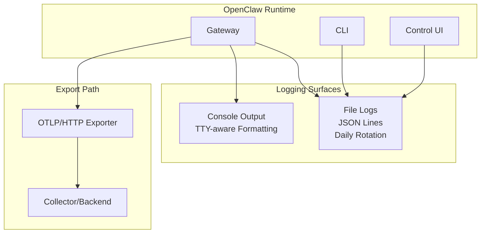
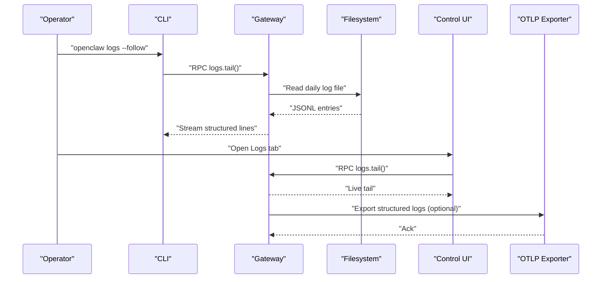
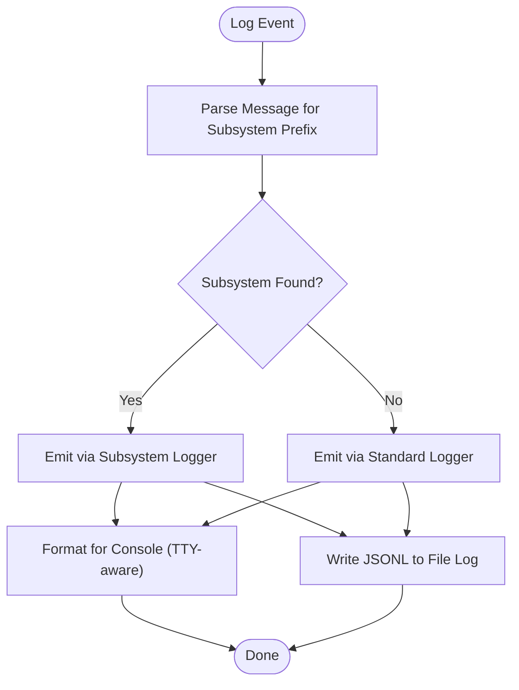
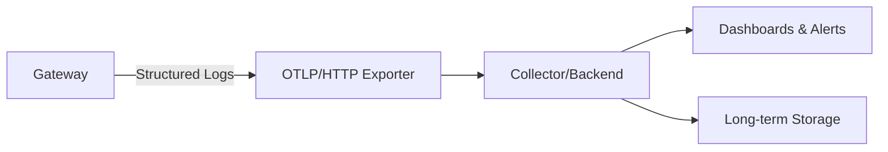
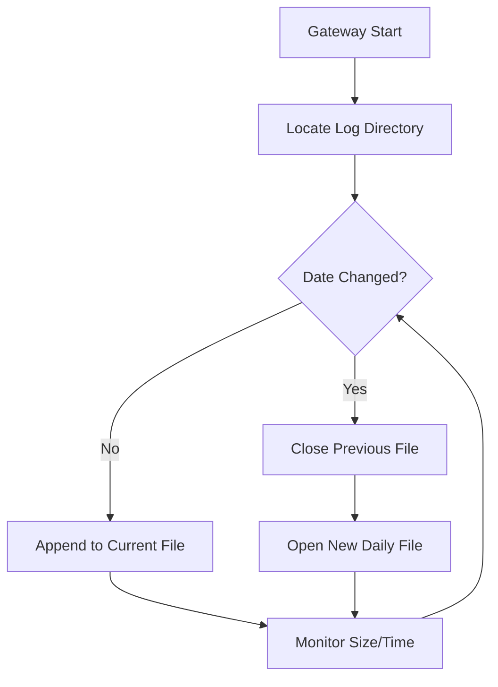
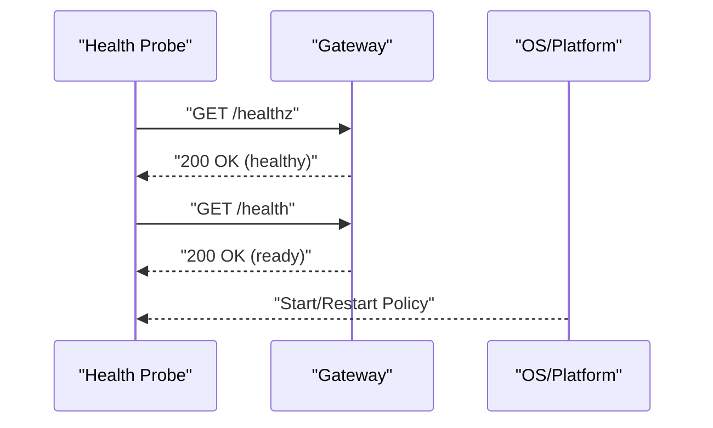
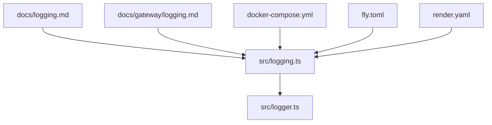

# Monitoring & Logging

<cite>
**Referenced Files in This Document**
- [docs/logging.md](file://docs/logging.md)
- [docs/gateway/logging.md](file://docs/gateway/logging.md)
- [src/logging.ts](file://src/logging.ts)
- [src/logger.ts](file://src/logger.ts)
- [docker-compose.yml](file://docker-compose.yml)
- [fly.toml](file://fly.toml)
- [render.yaml](file://render.yaml)
- [openclaw.podman.env](file://openclaw.podman.env)
</cite>

## Table of Contents
1. [Introduction](#introduction)
2. [Project Structure](#project-structure)
3. [Core Components](#core-components)
4. [Architecture Overview](#architecture-overview)
5. [Detailed Component Analysis](#detailed-component-analysis)
6. [Dependency Analysis](#dependency-analysis)
7. [Performance Considerations](#performance-considerations)
8. [Troubleshooting Guide](#troubleshooting-guide)
9. [Conclusion](#conclusion)
10. [Appendices](#appendices)

## Introduction
This document provides comprehensive monitoring and logging guidance for OpenClaw production environments. It covers centralized logging architectures, log aggregation strategies, structured logging implementations, monitoring dashboards and alerting, performance metrics collection, log rotation and retention, log analysis techniques, system-level monitoring, application health checks, uptime monitoring, incident response procedures, and log security and compliance considerations.

## Project Structure
OpenClaw implements structured logging with dual surfaces:
- File logs (JSON Lines) produced by the Gateway and rotated daily by default.
- Console output for interactive sessions and the Control UI.

Configuration is managed via a user-level JSON configuration file, with environment variable overrides for operational flexibility. The CLI and Control UI provide live tailing and filtering capabilities. Optional OpenTelemetry (OTLP/HTTP) export enables centralized observability.

**Diagram sources**
- [docs/logging.md](file://docs/logging.md#L10-L18)
- [docs/gateway/logging.md](file://docs/gateway/logging.md#L13-L28)
- [src/logging.ts](file://src/logging.ts#L34-L59)

**Section sources**
- [docs/logging.md](file://docs/logging.md#L10-L18)
- [docs/gateway/logging.md](file://docs/gateway/logging.md#L13-L28)

## Core Components
- Structured logging library exports:
  - Logger settings resolution, child logger creation, and level normalization.
  - Console capture and formatting controls.
  - Subsystem logging helpers for grouping and scannability.
- Application logging facade:
  - Convenience functions for info, warn, success, error, and debug.
  - Automatic subsystem parsing for console and file logs.
- Deployment configurations:
  - Docker Compose health checks and readiness probes.
  - Fly.io and Render platform health check paths and environment variables.
  - Podman environment variables for token and binding configuration.

Key implementation references:
- Logger exports and subsystem APIs: [src/logging.ts](file://src/logging.ts#L34-L59)
- Logging facade: [src/logger.ts](file://src/logger.ts#L37-L85)
- Health checks and environment: [docker-compose.yml](file://docker-compose.yml#L38-L49), [fly.toml](file://fly.toml#L10-L16), [render.yaml](file://render.yaml#L6-L13)

**Section sources**
- [src/logging.ts](file://src/logging.ts#L34-L59)
- [src/logger.ts](file://src/logger.ts#L37-L85)
- [docker-compose.yml](file://docker-compose.yml#L38-L49)
- [fly.toml](file://fly.toml#L10-L16)
- [render.yaml](file://render.yaml#L6-L13)

## Architecture Overview
OpenClaw’s logging architecture separates concerns between file-based structured logs and console output, enabling both human-readable interactivity and machine-processable streams for ingestion.

**Diagram sources**
- [docs/logging.md](file://docs/logging.md#L40-L72)
- [docs/gateway/logging.md](file://docs/gateway/logging.md#L28-L33)

## Detailed Component Analysis

### Structured Logging Implementation
OpenClaw uses a structured logger with:
- Daily rotating file logs in JSON Lines format.
- Console output tailored for TTY environments with subsystem prefixes and color coding.
- Configurable log levels and console styles.
- Sensitive data redaction for console output.

**Diagram sources**
- [src/logger.ts](file://src/logger.ts#L20-L35)
- [docs/gateway/logging.md](file://docs/gateway/logging.md#L96-L112)

Operational configuration highlights:
- File log path and level: [docs/gateway/logging.md](file://docs/gateway/logging.md#L20-L24)
- Console verbosity and style: [docs/gateway/logging.md](file://docs/gateway/logging.md#L48-L51)
- Redaction settings: [docs/gateway/logging.md](file://docs/gateway/logging.md#L53-L62)
- CLI tailing modes: [docs/logging.md](file://docs/logging.md#L48-L61)

**Section sources**
- [src/logger.ts](file://src/logger.ts#L20-L35)
- [docs/gateway/logging.md](file://docs/gateway/logging.md#L43-L62)
- [docs/logging.md](file://docs/logging.md#L48-L61)

### Centralized Logging and Aggregation
Centralized logging is achieved via:
- OTLP/HTTP export of structured logs from the Gateway.
- Collector/backend selection (any OTLP/HTTP-compatible system).
- Filtering and sampling to manage volume.

**Diagram sources**
- [docs/logging.md](file://docs/logging.md#L151-L162)
- [docs/logging.md](file://docs/logging.md#L224-L266)

Implementation references:
- Export signals and metrics: [docs/logging.md](file://docs/logging.md#L157-L186)
- Metrics catalog: [docs/logging.md](file://docs/logging.md#L268-L306)
- Span catalog: [docs/logging.md](file://docs/logging.md#L308-L325)
- Sampling and flush intervals: [docs/logging.md](file://docs/logging.md#L327-L330)
- Endpoint and header configuration: [docs/logging.md](file://docs/logging.md#L332-L338)

**Section sources**
- [docs/logging.md](file://docs/logging.md#L151-L186)
- [docs/logging.md](file://docs/logging.md#L268-L338)

### Log Rotation and Retention
- Default daily rotation under a temporary directory.
- Override path via configuration.
- Retention governed by external log management systems (e.g., logrotate, collector retention policies).

**Diagram sources**
- [docs/gateway/logging.md](file://docs/gateway/logging.md#L20-L21)
- [docs/logging.md](file://docs/logging.md#L22-L36)

**Section sources**
- [docs/gateway/logging.md](file://docs/gateway/logging.md#L20-L26)
- [docs/logging.md](file://docs/logging.md#L22-L36)

### System-Level Monitoring
System-level metrics (CPU, memory, disk, network) are not implemented within the Gateway itself. Operators should deploy platform-native or third-party collectors alongside OpenClaw to gather OS-level telemetry. These metrics can be correlated with application logs and diagnostics for comprehensive observability.

[No sources needed since this section provides general guidance]

### Application Health Checks and Uptime Monitoring
Production deployments include built-in health checks:
- Docker Compose health check probes against a readiness endpoint.
- Fly.io and Render platform health check paths.

**Diagram sources**
- [docker-compose.yml](file://docker-compose.yml#L38-L49)
- [render.yaml](file://render.yaml#L6-L6)

Operational notes:
- Environment variables for state/workspace directories: [fly.toml](file://fly.toml#L14-L15), [render.yaml](file://render.yaml#L12-L15)
- Podman environment variables for token and binding: [openclaw.podman.env](file://openclaw.podman.env#L8-L20)

**Section sources**
- [docker-compose.yml](file://docker-compose.yml#L38-L49)
- [fly.toml](file://fly.toml#L14-L15)
- [render.yaml](file://render.yaml#L6-L13)
- [openclaw.podman.env](file://openclaw.podman.env#L8-L20)

### Alerting and Dashboards
- Enable diagnostics and OTLP export to feed metrics and traces to a backend.
- Define dashboards for model usage, queue depths, session states, and webhook processing.
- Configure alerts for error rates, latency thresholds, queue backpressure, and stuck sessions.

[No sources needed since this section provides general guidance]

### Log Analysis Techniques
- Use CLI and Control UI to live-tail logs with filtering and JSON modes.
- Apply diagnostic flags for targeted debugging without raising global verbosity.
- Redaction protects sensitive data in console output; file logs remain unmodified.

References:
- CLI tailing modes: [docs/logging.md](file://docs/logging.md#L48-L61)
- Diagnostic flags: [docs/logging.md](file://docs/logging.md#L199-L222)
- Redaction behavior: [docs/gateway/logging.md](file://docs/gateway/logging.md#L53-L62)

**Section sources**
- [docs/logging.md](file://docs/logging.md#L48-L61)
- [docs/logging.md](file://docs/logging.md#L199-L222)
- [docs/gateway/logging.md](file://docs/gateway/logging.md#L53-L62)

### Security, Compliance, and Audit Trails
- Console redaction for tools-only output; file logs remain unchanged.
- Use OTLP collectors with authentication headers for secure transport.
- Maintain retention policies aligned with compliance requirements; archive logs externally if needed.

References:
- Redaction configuration: [docs/gateway/logging.md](file://docs/gateway/logging.md#L53-L62)
- OTLP headers and endpoints: [docs/logging.md](file://docs/logging.md#L259-L266), [docs/logging.md](file://docs/logging.md#L332-L338)

**Section sources**
- [docs/gateway/logging.md](file://docs/gateway/logging.md#L53-L62)
- [docs/logging.md](file://docs/logging.md#L259-L266)
- [docs/logging.md](file://docs/logging.md#L332-L338)

## Dependency Analysis
The logging subsystem integrates with the CLI, Control UI, Gateway, and optional OTLP exporter.

**Diagram sources**
- [src/logging.ts](file://src/logging.ts#L34-L59)
- [src/logger.ts](file://src/logger.ts#L37-L85)
- [docs/logging.md](file://docs/logging.md#L10-L18)
- [docs/gateway/logging.md](file://docs/gateway/logging.md#L13-L28)
- [docker-compose.yml](file://docker-compose.yml#L38-L49)
- [fly.toml](file://fly.toml#L10-L16)
- [render.yaml](file://render.yaml#L6-L13)

**Section sources**
- [src/logging.ts](file://src/logging.ts#L34-L59)
- [src/logger.ts](file://src/logger.ts#L37-L85)
- [docs/logging.md](file://docs/logging.md#L10-L18)
- [docs/gateway/logging.md](file://docs/gateway/logging.md#L13-L28)
- [docker-compose.yml](file://docker-compose.yml#L38-L49)
- [fly.toml](file://fly.toml#L10-L16)
- [render.yaml](file://render.yaml#L6-L13)

## Performance Considerations
- Prefer compact console styles for long-running sessions.
- Use sampling and filtering at the collector level to reduce OTLP log volume.
- Tune flush intervals and sample rates to balance fidelity and overhead.
- Ensure adequate disk space for daily log rotation and external archival.

[No sources needed since this section provides general guidance]

## Troubleshooting Guide
Common scenarios and remedies:
- Gateway not reachable: run the diagnostic command to diagnose connectivity.
- Empty logs: verify the Gateway is running and writing to the configured file path.
- Need more detail: increase file log level to debug or trace.

References:
- Gateway reachability hint: [docs/logging.md](file://docs/logging.md#L63-L67)
- Verify file path: [docs/logging.md](file://docs/logging.md#L350-L351)
- Raise verbosity: [docs/logging.md](file://docs/logging.md#L352-L353)

**Section sources**
- [docs/logging.md](file://docs/logging.md#L63-L67)
- [docs/logging.md](file://docs/logging.md#L350-L353)

## Conclusion
OpenClaw’s logging and monitoring foundation combines structured file logs, TTY-aware console output, and optional OTLP export for centralized observability. Production deployments should complement these capabilities with platform-native system metrics collection, robust health checks, and collector-side filtering and retention policies to achieve reliable, secure, and compliant operations.

[No sources needed since this section summarizes without analyzing specific files]

## Appendices

### Configuration Reference Highlights
- File logging path and level: [docs/gateway/logging.md](file://docs/gateway/logging.md#L20-L24)
- Console level and style: [docs/gateway/logging.md](file://docs/gateway/logging.md#L48-L51)
- Diagnostic flags: [docs/logging.md](file://docs/logging.md#L199-L222)
- OTLP exporter settings: [docs/logging.md](file://docs/logging.md#L224-L266)

**Section sources**
- [docs/gateway/logging.md](file://docs/gateway/logging.md#L20-L24)
- [docs/gateway/logging.md](file://docs/gateway/logging.md#L48-L51)
- [docs/logging.md](file://docs/logging.md#L199-L222)
- [docs/logging.md](file://docs/logging.md#L224-L266)