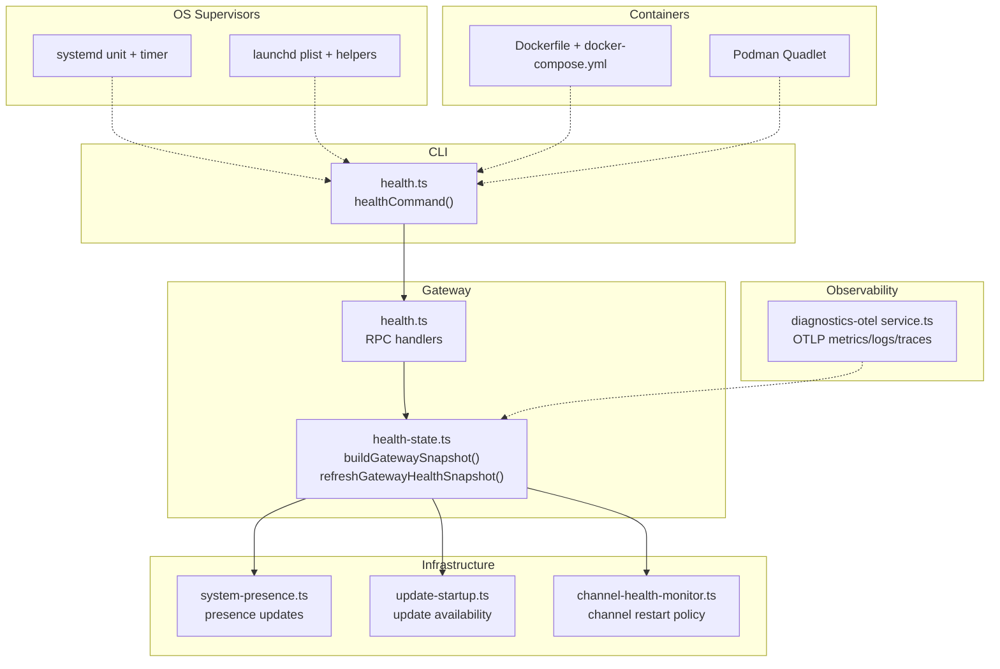
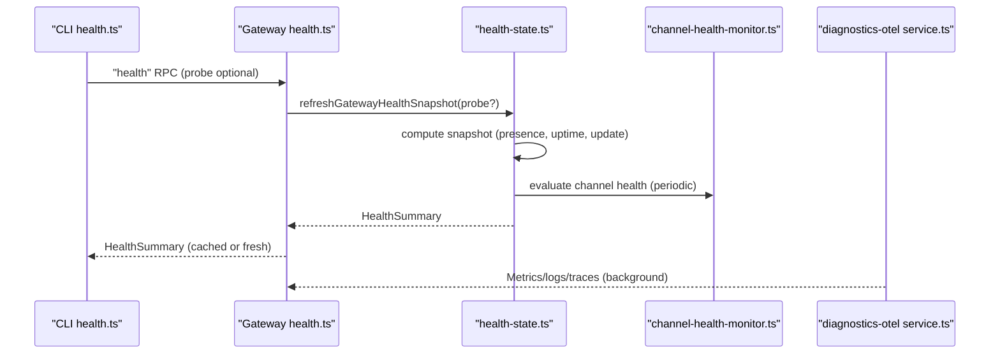
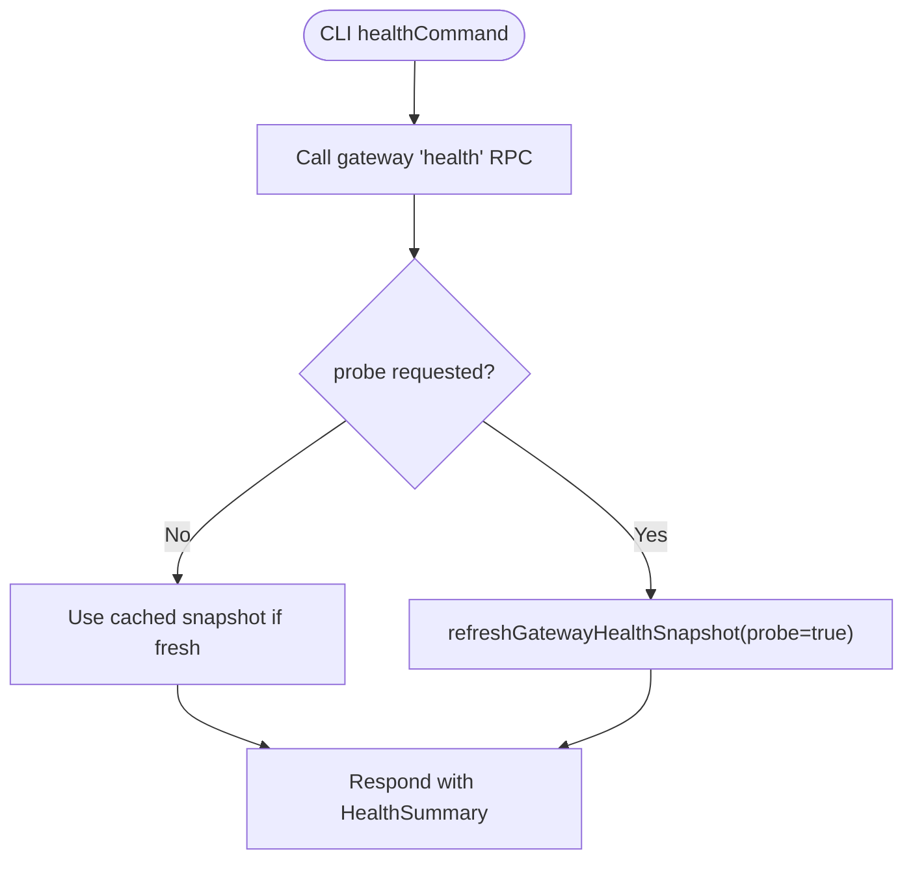
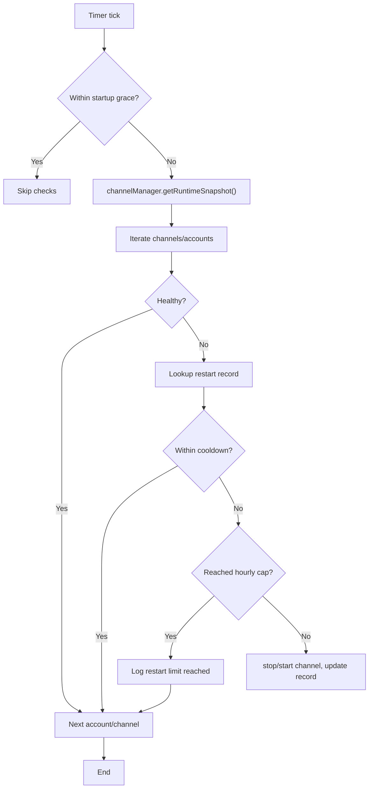
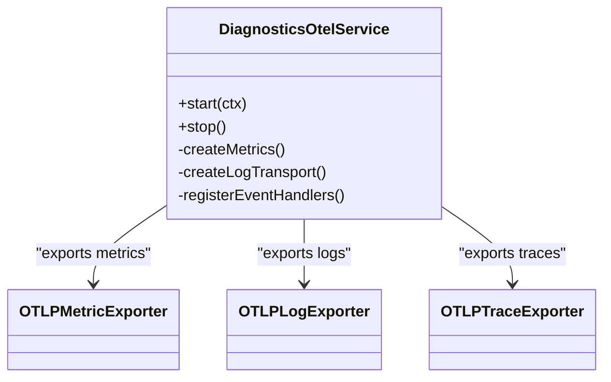
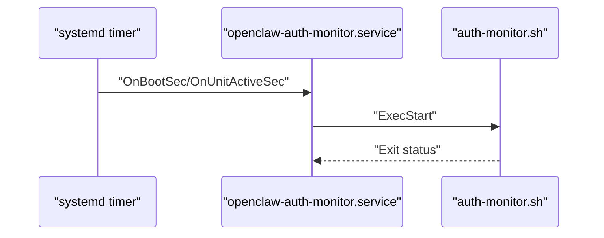
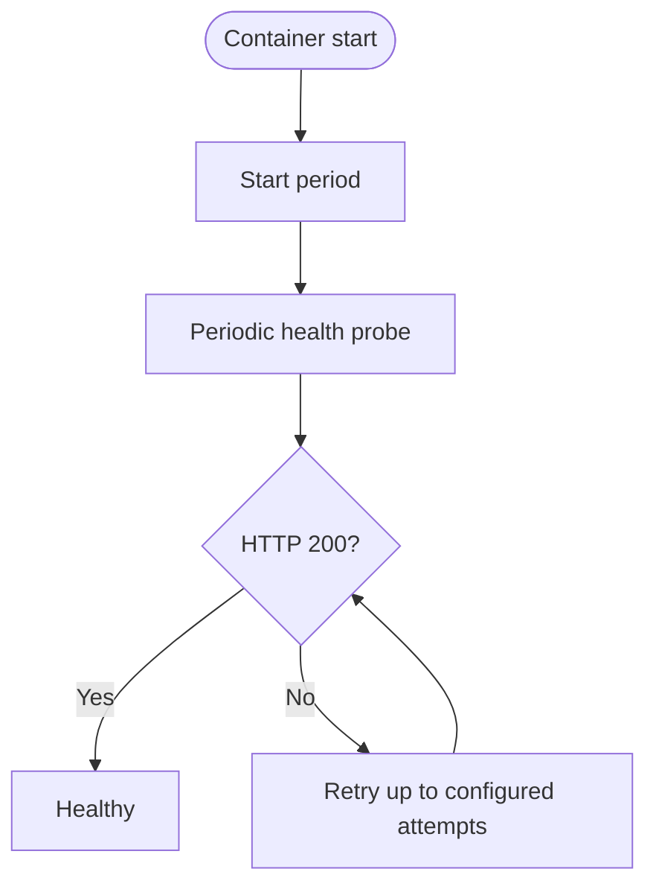
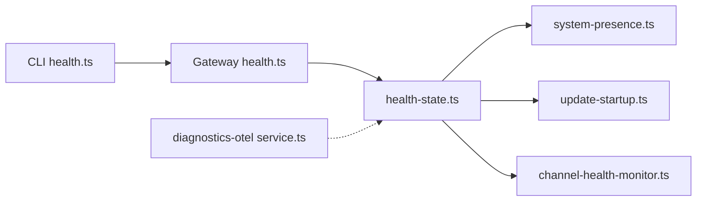

# System Monitoring

<cite>
**Referenced Files in This Document**
- [health.ts](file://src/gateway/server-methods/health.ts)
- [health-state.ts](file://src/gateway/server/health-state.ts)
- [channel-health-monitor.ts](file://src/gateway/channel-health-monitor.ts)
- [system-presence.ts](file://src/infra/system-presence.ts)
- [update-startup.ts](file://src/infra/update-startup.ts)
- [health.ts](file://src/commands/health.ts)
- [service-audit.ts](file://src/daemon/service-audit.ts)
- [launchd.ts](file://src/daemon/launchd.ts)
- [openclaw-auth-monitor.service](file://scripts/systemd/openclaw-auth-monitor.service)
- [openclaw-auth-monitor.timer](file://scripts/systemd/openclaw-auth-monitor.timer)
- [auth-monitor.sh](file://scripts/auth-monitor.sh)
- [Dockerfile](file://Dockerfile)
- [docker-compose.yml](file://docker-compose.yml)
- [openclaw.container.in](file://scripts/podman/openclaw.container.in)
- [podman.md](file://docs/install/podman.md)
- [docker.md](file://docs/install/docker.md)
- [service.ts](file://extensions/diagnostics-otel/src/service.ts)
</cite>

## Table of Contents
1. [Introduction](#introduction)
2. [Project Structure](#project-structure)
3. [Core Components](#core-components)
4. [Architecture Overview](#architecture-overview)
5. [Detailed Component Analysis](#detailed-component-analysis)
6. [Dependency Analysis](#dependency-analysis)
7. [Performance Considerations](#performance-considerations)
8. [Troubleshooting Guide](#troubleshooting-guide)
9. [Conclusion](#conclusion)
10. [Appendices](#appendices)

## Introduction
This document describes system monitoring for the OpenClaw infrastructure. It covers:
- System-level metrics collection and health endpoints
- OS-specific service management and supervision
- Uptime monitoring and automated restart policies
- Configuration for systemd (Linux), launchd (macOS), and Windows service management
- Performance baselines, thresholds, and capacity planning considerations
- Container monitoring for Docker and Podman deployments

## Project Structure
OpenClaw exposes health and readiness endpoints, integrates with observability via an OTLP exporter plugin, and provides OS-specific supervisors and containerization assets for robust monitoring and reliability.

**Diagram sources**
- [health.ts](file://src/gateway/server-methods/health.ts#L1-L38)
- [health-state.ts](file://src/gateway/server/health-state.ts#L17-L47)
- [system-presence.ts](file://src/infra/system-presence.ts#L270-L290)
- [update-startup.ts](file://src/infra/update-startup.ts#L53-L55)
- [channel-health-monitor.ts](file://src/gateway/channel-health-monitor.ts#L76-L201)
- [service.ts](file://extensions/diagnostics-otel/src/service.ts#L72-L686)
- [openclaw-auth-monitor.service](file://scripts/systemd/openclaw-auth-monitor.service#L1-L15)
- [openclaw-auth-monitor.timer](file://scripts/systemd/openclaw-auth-monitor.timer#L1-L11)
- [Dockerfile](file://Dockerfile#L224-L230)
- [docker-compose.yml](file://docker-compose.yml#L38-L49)
- [openclaw.container.in](file://scripts/podman/openclaw.container.in#L1-L29)

**Section sources**
- [health.ts](file://src/gateway/server-methods/health.ts#L1-L38)
- [health-state.ts](file://src/gateway/server/health-state.ts#L17-L47)
- [system-presence.ts](file://src/infra/system-presence.ts#L270-L290)
- [update-startup.ts](file://src/infra/update-startup.ts#L53-L55)
- [channel-health-monitor.ts](file://src/gateway/channel-health-monitor.ts#L76-L201)
- [service.ts](file://extensions/diagnostics-otel/src/service.ts#L72-L686)
- [openclaw-auth-monitor.service](file://scripts/systemd/openclaw-auth-monitor.service#L1-L15)
- [openclaw-auth-monitor.timer](file://scripts/systemd/openclaw-auth-monitor.timer#L1-L11)
- [Dockerfile](file://Dockerfile#L224-L230)
- [docker-compose.yml](file://docker-compose.yml#L38-L49)
- [openclaw.container.in](file://scripts/podman/openclaw.container.in#L1-L29)

## Core Components
- Health snapshot and cache: The gateway maintains a cached health snapshot with a version counter and broadcasts updates. The CLI health command queries the gateway for a health summary.
- Channel health monitor: Periodically evaluates channel runtime snapshots and restarts unhealthy channels subject to cooldown and rate limits.
- System presence: Tracks gateway identity and platform metadata for UIs and diagnostics.
- Observability: An OTLP plugin exports metrics, logs, and traces to a collector.
- OS supervisors: systemd timers and launchd agents manage lifecycle and alerting; Windows service management is covered conceptually.
- Containers: Docker Compose and Podman Quadlet define health checks, restart policies, and logging.

**Section sources**
- [health-state.ts](file://src/gateway/server/health-state.ts#L49-L85)
- [health.ts](file://src/gateway/server-methods/health.ts#L10-L37)
- [health.ts](file://src/commands/health.ts#L348-L523)
- [channel-health-monitor.ts](file://src/gateway/channel-health-monitor.ts#L76-L201)
- [system-presence.ts](file://src/infra/system-presence.ts#L6-L30)
- [service.ts](file://extensions/diagnostics-otel/src/service.ts#L167-L242)
- [openclaw-auth-monitor.service](file://scripts/systemd/openclaw-auth-monitor.service#L1-L15)
- [openclaw-auth-monitor.timer](file://scripts/systemd/openclaw-auth-monitor.timer#L1-L11)
- [Dockerfile](file://Dockerfile#L224-L230)
- [docker-compose.yml](file://docker-compose.yml#L38-L49)
- [openclaw.container.in](file://scripts/podman/openclaw.container.in#L23-L28)

## Architecture Overview
The monitoring architecture combines:
- Gateway health endpoints for liveness/readiness and deep snapshots
- Channel-level restart policies to maintain uptime
- System presence and update availability surfaced to clients
- OTLP observability pipeline
- OS-native supervisors and container health checks

**Diagram sources**
- [health.ts](file://src/commands/health.ts#L525-L751)
- [health.ts](file://src/gateway/server-methods/health.ts#L10-L37)
- [health-state.ts](file://src/gateway/server/health-state.ts#L70-L85)
- [channel-health-monitor.ts](file://src/gateway/channel-health-monitor.ts#L99-L176)
- [service.ts](file://extensions/diagnostics-otel/src/service.ts#L368-L444)

## Detailed Component Analysis

### Health Endpoints and Snapshots
- The gateway exposes a shallow liveness endpoint and a readiness endpoint for container health checks. The CLI health command queries the gateway for a health summary, optionally probing channel accounts.
- The health state module manages a cached snapshot with a version counter and supports background refresh.

**Diagram sources**
- [health.ts](file://src/commands/health.ts#L525-L751)
- [health.ts](file://src/gateway/server-methods/health.ts#L10-L37)
- [health-state.ts](file://src/gateway/server/health-state.ts#L70-L85)

**Section sources**
- [health.ts](file://src/gateway/server-methods/health.ts#L10-L37)
- [health-state.ts](file://src/gateway/server/health-state.ts#L17-L47)
- [health.ts](file://src/commands/health.ts#L348-L523)

### Channel Health Monitor and Automated Restarts
- The monitor periodically evaluates channel runtime snapshots and restarts channels that exceed stale event thresholds or connect grace windows.
- Cooldown cycles and hourly restart caps prevent flapping; reasons for restarts are logged.

**Diagram sources**
- [channel-health-monitor.ts](file://src/gateway/channel-health-monitor.ts#L76-L201)

**Section sources**
- [channel-health-monitor.ts](file://src/gateway/channel-health-monitor.ts#L20-L74)
- [channel-health-monitor.ts](file://src/gateway/channel-health-monitor.ts#L99-L176)

### System Presence and Update Availability
- System presence tracks host, IP, platform, device family, and mode, with periodic updates and TTL eviction.
- Update availability surfaces current and latest versions and channel for UIs and operators.

**Section sources**
- [system-presence.ts](file://src/infra/system-presence.ts#L6-L30)
- [system-presence.ts](file://src/infra/system-presence.ts#L270-L290)
- [update-startup.ts](file://src/infra/update-startup.ts#L45-L55)

### Observability Pipeline (OTLP)
- The diagnostics-otel plugin exports metrics (counters, histograms), logs, and traces to an OTLP endpoint. It supports sampling, batching, and redaction of sensitive attributes.

**Diagram sources**
- [service.ts](file://extensions/diagnostics-otel/src/service.ts#L72-L156)
- [service.ts](file://extensions/diagnostics-otel/src/service.ts#L167-L242)
- [service.ts](file://extensions/diagnostics-otel/src/service.ts#L243-L366)

**Section sources**
- [service.ts](file://extensions/diagnostics-otel/src/service.ts#L72-L686)

### OS-Specific Service Management

#### Linux (systemd)
- A oneshot service runs an auth expiry monitor script; a timer triggers it every 30 minutes.
- The service supports environment variables for notification channels and warning hours.
- Service audit utilities check recommended systemd configuration (network-online targets, restart intervals).

**Diagram sources**
- [openclaw-auth-monitor.service](file://scripts/systemd/openclaw-auth-monitor.service#L1-L15)
- [openclaw-auth-monitor.timer](file://scripts/systemd/openclaw-auth-monitor.timer#L1-L11)
- [auth-monitor.sh](file://scripts/auth-monitor.sh#L1-L90)

**Section sources**
- [openclaw-auth-monitor.service](file://scripts/systemd/openclaw-auth-monitor.service#L1-L15)
- [openclaw-auth-monitor.timer](file://scripts/systemd/openclaw-auth-monitor.timer#L1-L11)
- [auth-monitor.sh](file://scripts/auth-monitor.sh#L1-L90)
- [service-audit.ts](file://src/daemon/service-audit.ts#L124-L161)

#### macOS (launchd)
- Launch agents can be installed, started, stopped, and status checked via helpers and Swift utilities. The daemon module repairs bootstrap state and waits for process termination.

**Section sources**
- [launchd.ts](file://src/daemon/launchd.ts#L220-L381)
- [service-audit.ts](file://src/daemon/service-audit.ts#L163-L173)

#### Windows (conceptual)
- Windows service management is not implemented in the repository. Operators can use Windows Task Scheduler or PowerShell-based supervisors to wrap the gateway executable and configure restart policies.

[No sources needed since this section provides conceptual guidance]

### Container Monitoring (Docker and Podman)

#### Docker
- Built-in health checks probe liveness and readiness endpoints; compose defines a healthcheck with interval, timeout, retries, and start period.
- The Dockerfile includes a HEALTHCHECK that pings the liveness endpoint.

**Diagram sources**
- [docker-compose.yml](file://docker-compose.yml#L38-L49)
- [Dockerfile](file://Dockerfile#L224-L230)

**Section sources**
- [docker-compose.yml](file://docker-compose.yml#L38-L49)
- [Dockerfile](file://Dockerfile#L224-L230)
- [docker.md](file://docs/install/docker.md#L469-L495)

#### Podman
- Quadlet unit defines restart policy and timeouts; logs can be followed via journalctl for the openclaw user machine.
- Useful commands include stopping, starting, and removing the container while preserving host-mounted config/workspace.

**Section sources**
- [openclaw.container.in](file://scripts/podman/openclaw.container.in#L23-L28)
- [podman.md](file://docs/install/podman.md#L54-L66)
- [podman.md](file://docs/install/podman.md#L104-L109)

## Dependency Analysis
- Health RPC handlers depend on the health state module for caching and refreshing snapshots.
- The health state module aggregates system presence and update availability.
- The channel health monitor depends on the channel manager’s runtime snapshot and enforces restart policies.
- The diagnostics-otel plugin registers event handlers and exports telemetry independently of the gateway’s health refresh.

**Diagram sources**
- [health.ts](file://src/commands/health.ts#L525-L751)
- [health.ts](file://src/gateway/server-methods/health.ts#L10-L37)
- [health-state.ts](file://src/gateway/server/health-state.ts#L70-L85)
- [system-presence.ts](file://src/infra/system-presence.ts#L270-L290)
- [update-startup.ts](file://src/infra/update-startup.ts#L53-L55)
- [channel-health-monitor.ts](file://src/gateway/channel-health-monitor.ts#L99-L176)
- [service.ts](file://extensions/diagnostics-otel/src/service.ts#L619-L664)

**Section sources**
- [health.ts](file://src/gateway/server-methods/health.ts#L10-L37)
- [health-state.ts](file://src/gateway/server/health-state.ts#L70-L85)
- [channel-health-monitor.ts](file://src/gateway/channel-health-monitor.ts#L76-L201)
- [service.ts](file://extensions/diagnostics-otel/src/service.ts#L619-L664)

## Performance Considerations
- Health probes include timeouts and optional deep probing; CLI health formatting and gateway caching reduce overhead.
- Logs tailing and usage statistics leverage caching and bounded limits to avoid memory pressure.
- OTLP exporters use batched export and sampling to minimize overhead.
- Container health checks define sensible intervals, timeouts, and retries.

**Section sources**
- [health.ts](file://src/commands/health.ts#L74-L80)
- [health.ts](file://src/commands/health.ts#L525-L751)
- [health-state.ts](file://src/gateway/server/health-state.ts#L25-L26)
- [service.ts](file://extensions/diagnostics-otel/src/service.ts#L127-L134)
- [docker-compose.yml](file://docker-compose.yml#L46-L49)

## Troubleshooting Guide
- Auth expiry monitoring: The systemd timer runs a script that checks Claude credentials and sends notifications via configured channels. Review script logs and environment variables for warnings and expiry thresholds.
- Systemd configuration audit: Use service audit utilities to verify recommended After/Wants for network-online and RestartSec alignment.
- launchd lifecycle: Repair bootstrap state and ensure the launch agent is enabled and loaded; verify process termination before restart.
- Container health: Use compose healthcheck and built-in health endpoints to diagnose readiness issues; inspect container logs and journalctl for Podman.

**Section sources**
- [auth-monitor.sh](file://scripts/auth-monitor.sh#L1-L90)
- [openclaw-auth-monitor.timer](file://scripts/systemd/openclaw-auth-monitor.timer#L1-L11)
- [service-audit.ts](file://src/daemon/service-audit.ts#L124-L161)
- [launchd.ts](file://src/daemon/launchd.ts#L220-L381)
- [docker-compose.yml](file://docker-compose.yml#L38-L49)
- [Dockerfile](file://Dockerfile#L224-L230)
- [podman.md](file://docs/install/podman.md#L54-L66)

## Conclusion
OpenClaw’s monitoring stack integrates health endpoints, channel-level restart policies, system presence, and OTLP observability. OS supervisors and container assets provide robust uptime and automated recovery. Operators can tailor thresholds, sampling, and restart policies to meet operational requirements while maintaining strong security defaults.

## Appendices

### Configuration Reference

- Systemd
  - Unit: [openclaw-auth-monitor.service](file://scripts/systemd/openclaw-auth-monitor.service#L1-L15)
  - Timer: [openclaw-auth-monitor.timer](file://scripts/systemd/openclaw-auth-monitor.timer#L1-L11)
  - Script: [auth-monitor.sh](file://scripts/auth-monitor.sh#L1-L90)

- launchd
  - Helpers: [launchd.ts](file://src/daemon/launchd.ts#L220-L381)
  - Audit: [service-audit.ts](file://src/daemon/service-audit.ts#L163-L173)

- Docker
  - Compose healthcheck: [docker-compose.yml](file://docker-compose.yml#L38-L49)
  - Image healthcheck: [Dockerfile](file://Dockerfile#L224-L230)
  - Docs: [docker.md](file://docs/install/docker.md#L469-L495)

- Podman
  - Quadlet: [openclaw.container.in](file://scripts/podman/openclaw.container.in#L1-L29)
  - Docs: [podman.md](file://docs/install/podman.md#L54-L66)