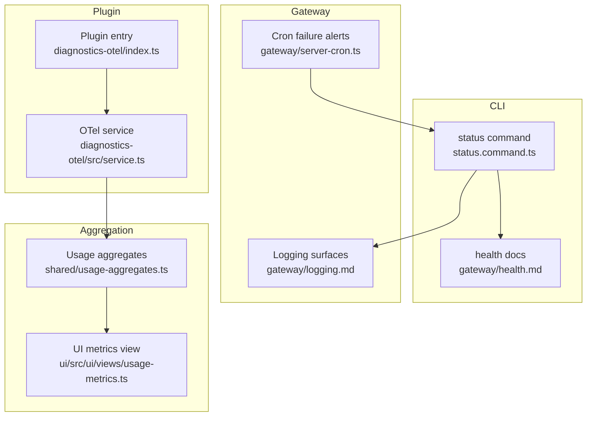
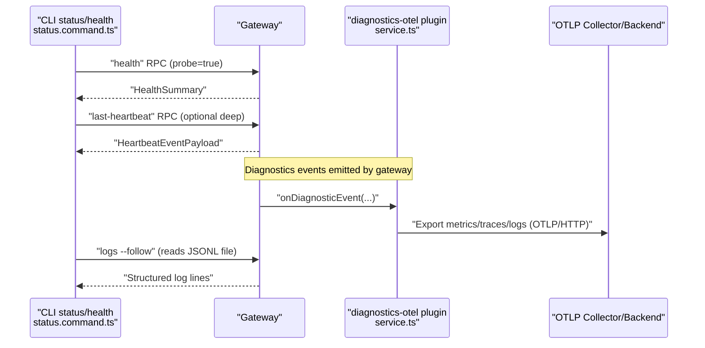
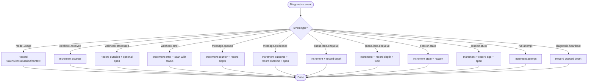
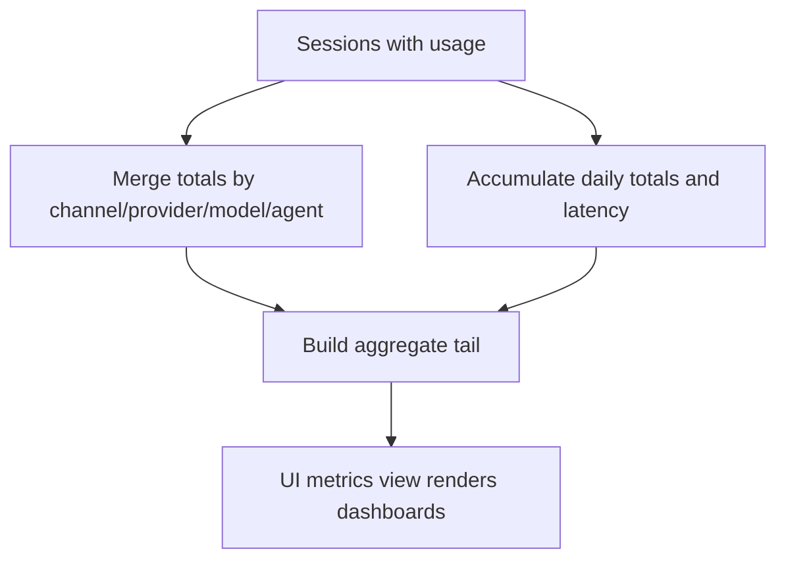
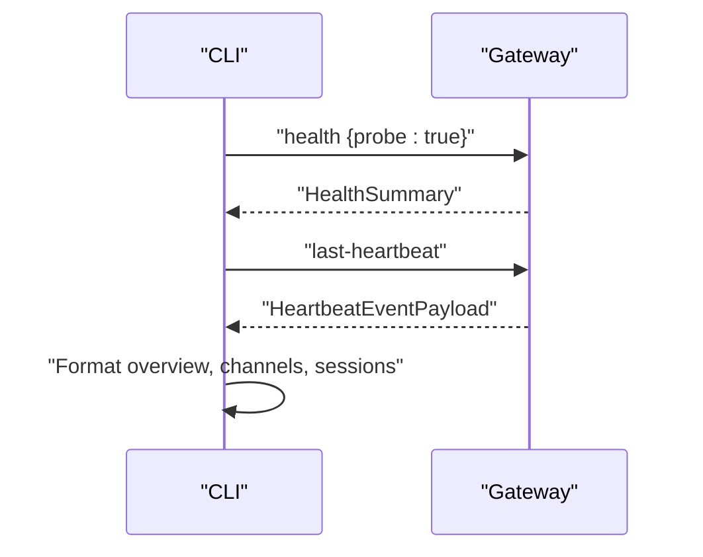
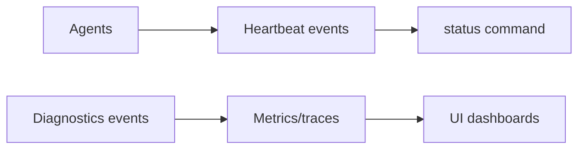
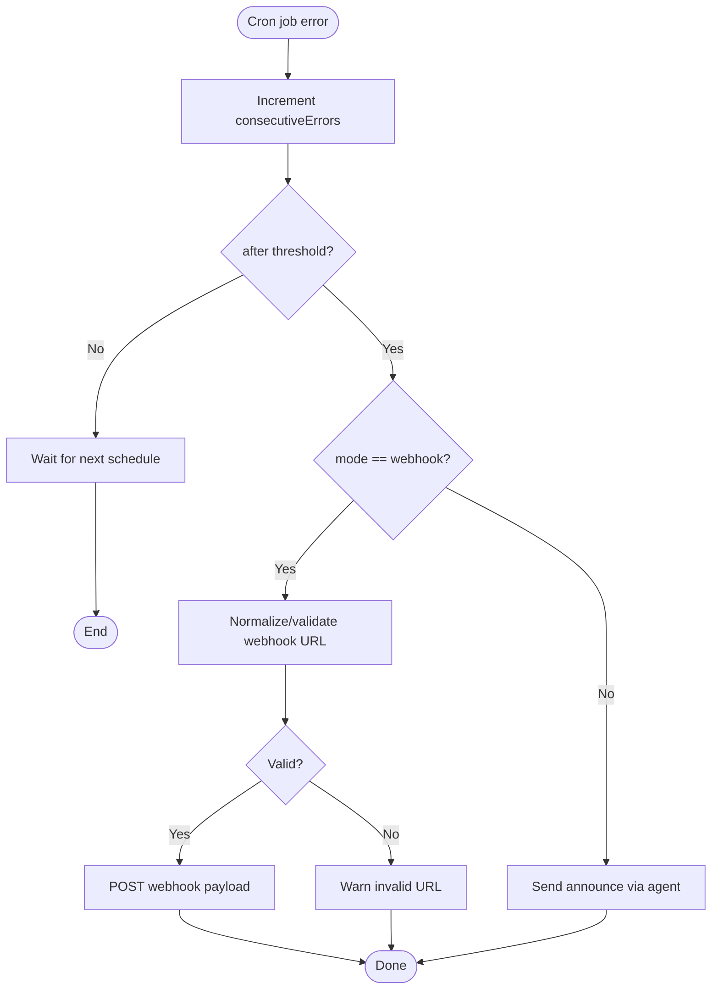
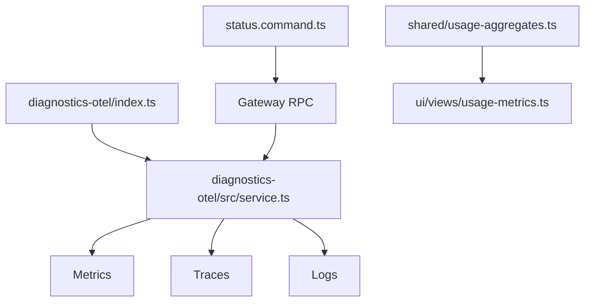

# Monitoring & Metrics

<cite>
**Referenced Files in This Document**
- [docs/logging.md](file://docs/logging.md)
- [docs/gateway/logging.md](file://docs/gateway/logging.md)
- [docs/gateway/health.md](file://docs/gateway/health.md)
- [docs/diagnostics/flags.md](file://docs/diagnostics/flags.md)
- [extensions/diagnostics-otel/index.ts](file://extensions/diagnostics-otel/index.ts)
- [extensions/diagnostics-otel/src/service.ts](file://extensions/diagnostics-otel/src/service.ts)
- [src/shared/usage-aggregates.ts](file://src/shared/usage-aggregates.ts)
- [ui/src/ui/views/usage-metrics.ts](file://ui/src/ui/views/usage-metrics.ts)
- [src/commands/status.command.ts](file://src/commands/status.command.ts)
- [src/gateway/server-cron.ts](file://src/gateway/server-cron.ts)
- [src/cron/service/timer.ts](file://src/cron/service/timer.ts)
</cite>

## Table of Contents
1. [Introduction](#introduction)
2. [Project Structure](#project-structure)
3. [Core Components](#core-components)
4. [Architecture Overview](#architecture-overview)
5. [Detailed Component Analysis](#detailed-component-analysis)
6. [Dependency Analysis](#dependency-analysis)
7. [Performance Considerations](#performance-considerations)
8. [Troubleshooting Guide](#troubleshooting-guide)
9. [Conclusion](#conclusion)
10. [Appendices](#appendices)

## Introduction
This document describes how OpenClaw tracks performance and monitors system health. It covers:
- Key performance indicators (KPIs) and system metrics
- Collection and export of diagnostics via OpenTelemetry
- Alerting for cron failures and performance degradation
- Gateway health monitoring and agent performance tracking
- Resource utilization dashboards and usage aggregation
- Logging strategies, metric aggregation patterns, and performance reporting

The goal is to help operators set up robust monitoring pipelines, configure meaningful alerts, and troubleshoot performance issues efficiently.

## Project Structure
OpenClaw’s monitoring stack spans CLI, gateway, plugins, and UI:
- Logging surfaces and formats are documented for CLI, gateway, and Control UI.
- Diagnostics events are emitted and exported via the diagnostics-otel plugin using OTLP/HTTP.
- Usage metrics are aggregated in shared utilities and rendered in the Control UI.
- Health snapshots and status summaries are produced by CLI commands.
- Cron jobs can emit failure alerts via announcements or webhooks.

**Diagram sources**
- [src/commands/status.command.ts](file://src/commands/status.command.ts#L67-L686)
- [docs/gateway/health.md](file://docs/gateway/health.md#L1-L36)
- [docs/gateway/logging.md](file://docs/gateway/logging.md#L1-L114)
- [src/gateway/server-cron.ts](file://src/gateway/server-cron.ts#L302-L469)
- [extensions/diagnostics-otel/index.ts](file://extensions/diagnostics-otel/index.ts#L1-L16)
- [extensions/diagnostics-otel/src/service.ts](file://extensions/diagnostics-otel/src/service.ts#L72-L686)
- [src/shared/usage-aggregates.ts](file://src/shared/usage-aggregates.ts#L32-L109)
- [ui/src/ui/views/usage-metrics.ts](file://ui/src/ui/views/usage-metrics.ts#L323-L506)

**Section sources**
- [docs/logging.md](file://docs/logging.md#L10-L353)
- [docs/gateway/logging.md](file://docs/gateway/logging.md#L1-L114)
- [docs/gateway/health.md](file://docs/gateway/health.md#L1-L36)
- [extensions/diagnostics-otel/index.ts](file://extensions/diagnostics-otel/index.ts#L1-L16)
- [extensions/diagnostics-otel/src/service.ts](file://extensions/diagnostics-otel/src/service.ts#L72-L686)
- [src/shared/usage-aggregates.ts](file://src/shared/usage-aggregates.ts#L32-L109)
- [ui/src/ui/views/usage-metrics.ts](file://ui/src/ui/views/usage-metrics.ts#L323-L506)
- [src/commands/status.command.ts](file://src/commands/status.command.ts#L67-L686)
- [src/gateway/server-cron.ts](file://src/gateway/server-cron.ts#L302-L469)

## Core Components
- Logging and diagnostics
  - Structured JSONL file logs and console output with configurable levels and redaction.
  - Diagnostics flags enable targeted debug logs without raising global verbosity.
  - OpenTelemetry export via diagnostics-otel plugin (OTLP/HTTP) for metrics, traces, and logs.
- Metrics and usage aggregation
  - Token usage, cost, durations, context sizes, webhook/message flow, queue depth/wait, session states.
  - Aggregation utilities compute totals, daily breakdowns, latency statistics, and model/provider rollups.
  - UI renders usage dashboards and insights.
- Health and status
  - CLI status and health commands produce health snapshots, gateway reachability, heartbeat details, and channel states.
- Alerting
  - Cron failure alerts can be sent via announcements or webhooks with configurable cooldown and destinations.

**Section sources**
- [docs/logging.md](file://docs/logging.md#L142-L353)
- [docs/diagnostics/flags.md](file://docs/diagnostics/flags.md#L1-L92)
- [extensions/diagnostics-otel/src/service.ts](file://extensions/diagnostics-otel/src/service.ts#L170-L242)
- [src/shared/usage-aggregates.ts](file://src/shared/usage-aggregates.ts#L32-L109)
- [ui/src/ui/views/usage-metrics.ts](file://ui/src/ui/views/usage-metrics.ts#L323-L506)
- [src/commands/status.command.ts](file://src/commands/status.command.ts#L67-L686)
- [src/gateway/server-cron.ts](file://src/gateway/server-cron.ts#L302-L469)

## Architecture Overview
The monitoring pipeline integrates CLI, gateway, plugin, and UI:

**Diagram sources**
- [src/commands/status.command.ts](file://src/commands/status.command.ts#L144-L168)
- [extensions/diagnostics-otel/src/service.ts](file://extensions/diagnostics-otel/src/service.ts#L619-L664)
- [docs/logging.md](file://docs/logging.md#L40-L67)

## Detailed Component Analysis

### Logging and Diagnostics
- File logs and console output
  - File logs are JSONL, one object per line. Console output is TTY-aware with subsystem prefixes and color.
  - Levels and styles are configurable; environment variables override config for one-off runs.
- Diagnostics flags
  - Case-insensitive flags with wildcard support; applied to targeted subsystems without raising global verbosity.
  - Flags are persisted in config or overridden via environment; logs go to the standard diagnostics file with redaction applied.
- OpenTelemetry export
  - Plugin registers a service that starts NodeSDK and attaches exporters for traces, metrics, and logs.
  - Metrics include token usage, cost, durations, context sizes, webhook/message flow, queue depth/wait, session states.
  - Traces include model usage and webhook/message processing spans when enabled.
  - Logs export uses OTLP/HTTP with batching and redaction of sensitive attributes.

**Diagram sources**
- [extensions/diagnostics-otel/src/service.ts](file://extensions/diagnostics-otel/src/service.ts#L619-L657)

**Section sources**
- [docs/logging.md](file://docs/logging.md#L142-L353)
- [docs/diagnostics/flags.md](file://docs/diagnostics/flags.md#L1-L92)
- [extensions/diagnostics-otel/src/service.ts](file://extensions/diagnostics-otel/src/service.ts#L170-L242)
- [extensions/diagnostics-otel/src/service.ts](file://extensions/diagnostics-otel/src/service.ts#L619-L664)

### Usage Aggregation and Dashboards
- Aggregation utilities
  - Merge latency totals and daily latency maps; build aggregate tails by channel, model, provider, agent, and daily series.
  - Compute averages, min/max, p95, and daily breakdowns for tokens, cost, messages, tool calls, and errors.
- UI rendering
  - Build mosaic charts for hourly and weekday usage, peak error hours, and insight stats (avg duration, throughput, error rates).
  - Render daily series and model/provider rollups for cost and token usage.

**Diagram sources**
- [src/shared/usage-aggregates.ts](file://src/shared/usage-aggregates.ts#L32-L109)
- [ui/src/ui/views/usage-metrics.ts](file://ui/src/ui/views/usage-metrics.ts#L323-L506)

**Section sources**
- [src/shared/usage-aggregates.ts](file://src/shared/usage-aggregates.ts#L32-L109)
- [ui/src/ui/views/usage-metrics.ts](file://ui/src/ui/views/usage-metrics.ts#L323-L506)

### Gateway Health Monitoring
- CLI health and status
  - Health command queries the running gateway for a health snapshot (probe mode) and returns per-channel summaries and probe duration.
  - Status command produces a comprehensive overview including gateway reachability, mode, update channel, agents, sessions, memory, and optional deep probes.
- Deep diagnostics
  - Use deep mode to probe channels when supported; inspect credentials and session store locations; relink channels when needed.

**Diagram sources**
- [src/commands/status.command.ts](file://src/commands/status.command.ts#L144-L168)
- [docs/gateway/health.md](file://docs/gateway/health.md#L14-L35)

**Section sources**
- [src/commands/status.command.ts](file://src/commands/status.command.ts#L67-L686)
- [docs/gateway/health.md](file://docs/gateway/health.md#L1-L36)

### Agent Performance Tracking
- Heartbeat and activity
  - Status displays heartbeat intervals per agent and last heartbeat details when deep mode is enabled.
  - Sessions table shows recent activity, ages, models, and token counts.
- Diagnostics-driven metrics
  - Model usage spans and histograms capture run durations and context sizes; message processing outcomes and durations are tracked.
  - Queue metrics (enqueue/dequeue, depth, wait) reflect agent workload and scheduling.

**Diagram sources**
- [src/commands/status.command.ts](file://src/commands/status.command.ts#L327-L353)
- [extensions/diagnostics-otel/src/service.ts](file://extensions/diagnostics-otel/src/service.ts#L382-L444)
- [extensions/diagnostics-otel/src/service.ts](file://extensions/diagnostics-otel/src/service.ts#L528-L558)

**Section sources**
- [src/commands/status.command.ts](file://src/commands/status.command.ts#L318-L358)
- [extensions/diagnostics-otel/src/service.ts](file://extensions/diagnostics-otel/src/service.ts#L382-L444)
- [extensions/diagnostics-otel/src/service.ts](file://extensions/diagnostics-otel/src/service.ts#L528-L558)

### Alerting for Performance Degradation
- Cron failure alerts
  - Cron service emits failure alerts when consecutive errors exceed thresholds, with configurable mode (announce or webhook), channel, recipient, and cooldown.
  - Gateway server validates webhook URLs and handles SSRF guard; logs warnings for invalid or blocked destinations.
- Practical configuration
  - Use cron registration options to set failure alert after, channel, to, cooldown, mode, and account ID.
  - Announcements route through the agent; webhooks send structured payloads to external systems.

**Diagram sources**
- [src/cron/service/timer.ts](file://src/cron/service/timer.ts#L246-L288)
- [src/gateway/server-cron.ts](file://src/gateway/server-cron.ts#L302-L469)

**Section sources**
- [src/cron/service/timer.ts](file://src/cron/service/timer.ts#L246-L288)
- [src/gateway/server-cron.ts](file://src/gateway/server-cron.ts#L302-L469)

## Dependency Analysis
- Plugin-to-service
  - The diagnostics-otel plugin registers a service that manages OTel SDK lifecycle, exporters, samplers, and metric/tracing/log transports.
- CLI-to-gateway
  - Status and health commands call gateway RPCs to fetch health snapshots and heartbeat details.
- Metrics-to-UI
  - Aggregation utilities feed the UI metrics view, which computes dashboards and insight stats.

**Diagram sources**
- [extensions/diagnostics-otel/index.ts](file://extensions/diagnostics-otel/index.ts#L10-L12)
- [extensions/diagnostics-otel/src/service.ts](file://extensions/diagnostics-otel/src/service.ts#L136-L156)
- [src/commands/status.command.ts](file://src/commands/status.command.ts#L151-L158)
- [src/shared/usage-aggregates.ts](file://src/shared/usage-aggregates.ts#L32-L109)
- [ui/src/ui/views/usage-metrics.ts](file://ui/src/ui/views/usage-metrics.ts#L323-L506)

**Section sources**
- [extensions/diagnostics-otel/index.ts](file://extensions/diagnostics-otel/index.ts#L1-L16)
- [extensions/diagnostics-otel/src/service.ts](file://extensions/diagnostics-otel/src/service.ts#L72-L156)
- [src/commands/status.command.ts](file://src/commands/status.command.ts#L151-L158)
- [src/shared/usage-aggregates.ts](file://src/shared/usage-aggregates.ts#L32-L109)
- [ui/src/ui/views/usage-metrics.ts](file://ui/src/ui/views/usage-metrics.ts#L323-L506)

## Performance Considerations
- Sampling and flushing
  - Trace sampling rate and metric flush interval are configurable; adjust to balance fidelity and overhead.
- Log volume and redaction
  - OTLP logs export respects file log levels; enable only when needed to reduce volume.
  - Redaction applies to sensitive attributes and message bodies before export.
- Metric cardinality
  - Attributes include channel, provider, model, session identifiers; avoid unbounded label growth to maintain query performance.
- Queue and session metrics
  - Monitor queue depth and wait times to detect backpressure; track session stuck ages to identify stalls.

[No sources needed since this section provides general guidance]

## Troubleshooting Guide
- Gateway not reachable
  - Use the health command to probe; check reachability and auth details; start the gateway if needed.
- Empty or missing logs
  - Verify the gateway is running and writing to the configured file path; increase verbosity temporarily with diagnostics flags.
- High log volume
  - Disable OTLP logs or reduce sampling; adjust file log level; use diagnostics flags to narrow focus.
- Cron failure alerts not delivered
  - Validate webhook URLs; ensure mode and channel are set appropriately; review gateway logs for warnings about SSRF guard or invalid URLs.
- Diagnostics not exporting
  - Confirm plugin is enabled and configured; verify OTLP endpoint and protocol; ensure diagnostics are enabled.

**Section sources**
- [docs/gateway/health.md](file://docs/gateway/health.md#L27-L35)
- [docs/logging.md](file://docs/logging.md#L347-L353)
- [src/gateway/server-cron.ts](file://src/gateway/server-cron.ts#L302-L336)
- [src/gateway/server-cron.ts](file://src/gateway/server-cron.ts#L429-L452)
- [extensions/diagnostics-otel/src/service.ts](file://extensions/diagnostics-otel/src/service.ts#L87-L91)

## Conclusion
OpenClaw provides a comprehensive monitoring and metrics framework:
- Structured logging with flexible levels and redaction
- Rich diagnostics export via OpenTelemetry for metrics, traces, and logs
- Usage aggregation and UI dashboards for token usage, costs, and latency
- Health snapshots and status summaries for gateway and agent performance
- Cron failure alerts via announcements or webhooks

Operators can tailor verbosity with diagnostics flags, configure OTel exporters for observability backends, and set up alerts to detect performance degradation early.

[No sources needed since this section summarizes without analyzing specific files]

## Appendices

### Practical Setup Examples
- Enable diagnostics and OTel export
  - Enable diagnostics and the plugin; configure OTLP endpoint, service name, and toggles for traces, metrics, logs.
  - Adjust sample rate and flush interval to balance fidelity and overhead.
- Configure cron failure alerts
  - Set failure alert parameters (after, channel, to, cooldown, mode, account ID) during cron registration.
  - Choose webhook mode for external systems or announce mode for internal messaging.
- Tail logs and monitor health
  - Use CLI logs to follow JSONL file output; use status and health commands to probe gateway and channels.

**Section sources**
- [docs/logging.md](file://docs/logging.md#L224-L267)
- [extensions/diagnostics-otel/src/service.ts](file://extensions/diagnostics-otel/src/service.ts#L80-L104)
- [src/gateway/server-cron.ts](file://src/gateway/server-cron.ts#L279-L335)
- [src/commands/status.command.ts](file://src/commands/status.command.ts#L144-L168)