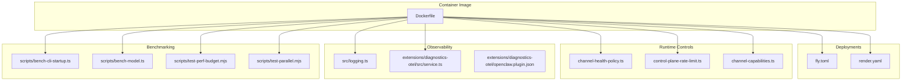
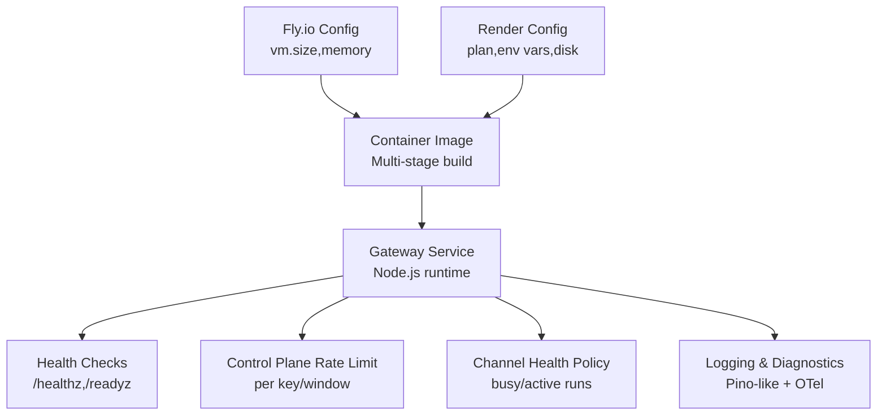
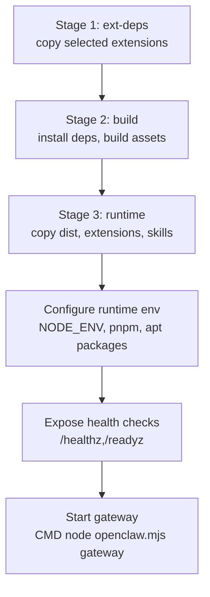
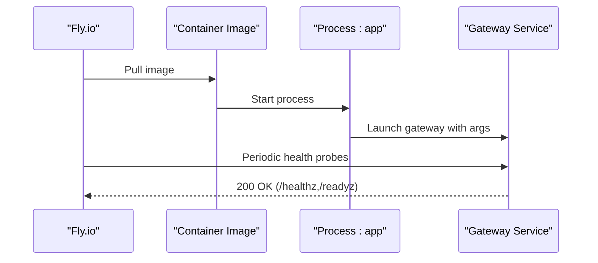
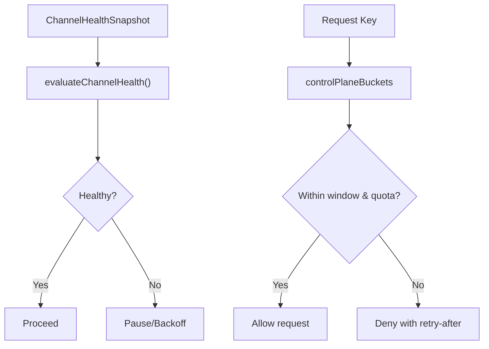
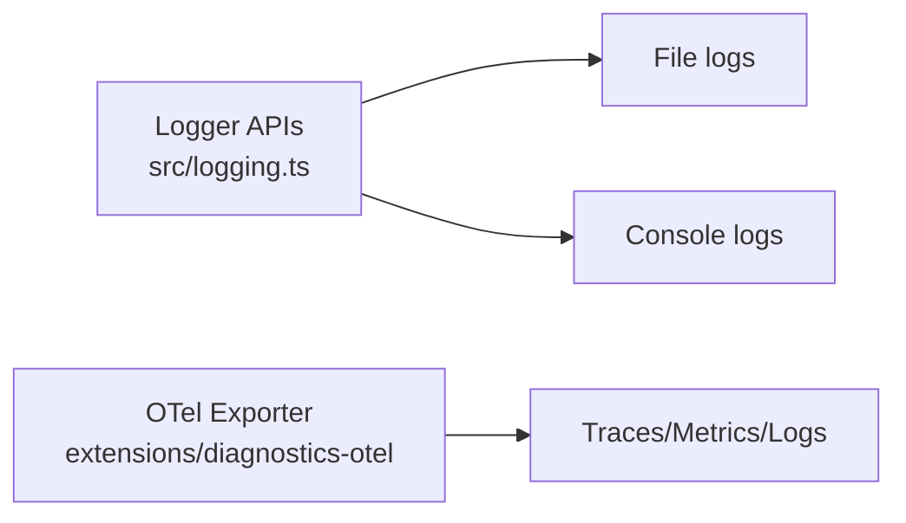
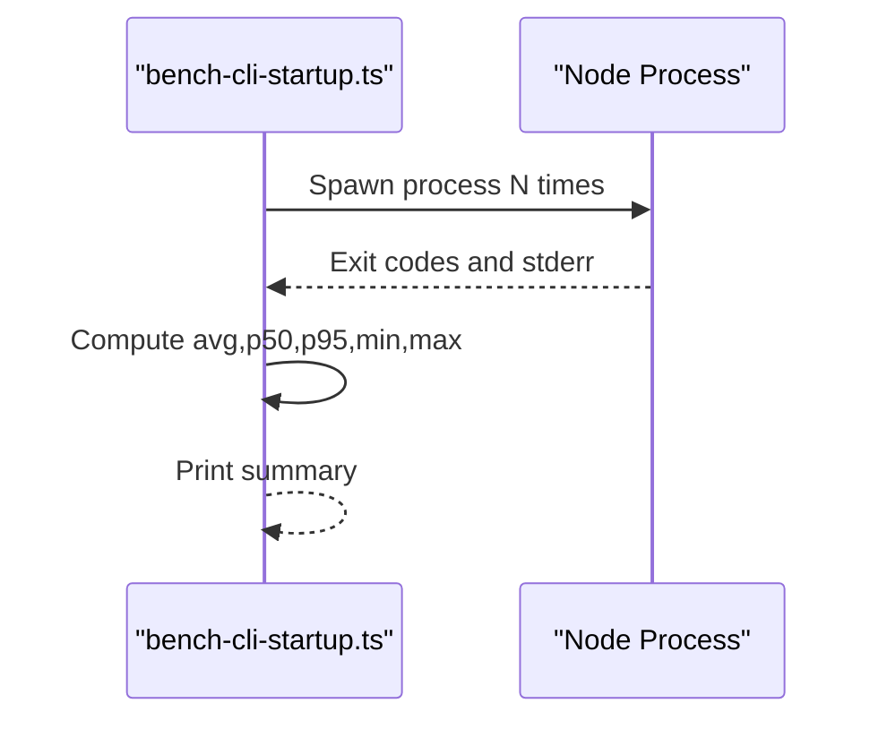
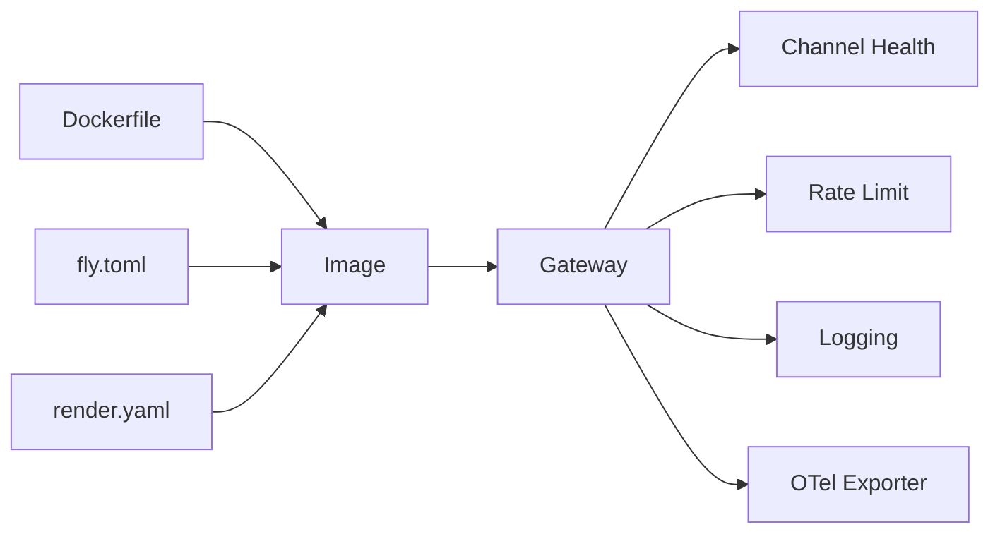

# Performance & Scaling

<cite>
**Referenced Files in This Document**
- [Dockerfile](file://Dockerfile)
- [fly.toml](file://fly.toml)
- [render.yaml](file://render.yaml)
- [src/logging.ts](file://src/logging.ts)
- [src/utils.ts](file://src/utils.ts)
- [src/commands/doctor-platform-notes.ts](file://src/commands/doctor-platform-notes.ts)
- [src/commands/doctor-platform-notes.startup-optimization.test.ts](file://src/commands/doctor-platform-notes.startup-optimization.test.ts)
- [src/gateway/channel-health-policy.ts](file://src/gateway/channel-health-policy.ts)
- [src/gateway/control-plane-rate-limit.ts](file://src/gateway/control-plane-rate-limit.ts)
- [src/gateway/gateway-models.profiles.live.test.ts](file://src/gateway/gateway-models.profiles.live.test.ts)
- [src/discord/monitor/thread-bindings.lifecycle.ts](file://src/discord/monitor/thread-bindings.lifecycle.ts)
- [src/config/channel-capabilities.ts](file://src/config/channel-capabilities.ts)
- [scripts/bench-cli-startup.ts](file://scripts/bench-cli-startup.ts)
- [scripts/bench-model.ts](file://scripts/bench-model.ts)
- [scripts/test-perf-budget.mjs](file://scripts/test-perf-budget.mjs)
- [scripts/test-parallel.mjs](file://scripts/test-parallel.mjs)
- [extensions/diagnostics-otel/src/service.ts](file://extensions/diagnostics-otel/src/service.ts)
- [extensions/diagnostics-otel/openclaw.plugin.json](file://extensions/diagnostics-otel/openclaw.plugin.json)
- [extensions/open-prose/skills/prose/lib/profiler.prose](file://extensions/open-prose/skills/prose/lib/profiler.prose)
</cite>

## Table of Contents
1. [Introduction](#introduction)
2. [Project Structure](#project-structure)
3. [Core Components](#core-components)
4. [Architecture Overview](#architecture-overview)
5. [Detailed Component Analysis](#detailed-component-analysis)
6. [Dependency Analysis](#dependency-analysis)
7. [Performance Considerations](#performance-considerations)
8. [Troubleshooting Guide](#troubleshooting-guide)
9. [Conclusion](#conclusion)
10. [Appendices](#appendices)

## Introduction
This document provides comprehensive performance and scaling guidance for OpenClaw deployments. It covers profiling techniques, bottleneck identification, optimization strategies, horizontal and vertical scaling, load balancing, resource allocation, memory management, CPU optimization, I/O tuning, capacity planning, traffic prediction, auto-scaling configurations, and monitoring/metrics/alerting. The guidance is grounded in the repository’s code and configuration artifacts to ensure practical applicability.

## Project Structure
OpenClaw’s runtime and deployment artifacts are primarily defined by:
- Container image build and runtime configuration
- Platform-specific deployment manifests
- Gateway health and rate limiting controls
- Logging and diagnostics subsystems
- Benchmarking and performance budgeting scripts
- Startup optimization utilities

**Diagram sources**
- [Dockerfile](file://Dockerfile#L1-L231)
- [fly.toml](file://fly.toml#L1-L35)
- [render.yaml](file://render.yaml#L1-L22)
- [src/logging.ts](file://src/logging.ts#L1-L70)
- [extensions/diagnostics-otel/src/service.ts](file://extensions/diagnostics-otel/src/service.ts#L78-L108)
- [extensions/diagnostics-otel/openclaw.plugin.json](file://extensions/diagnostics-otel/openclaw.plugin.json#L1-L8)
- [scripts/bench-cli-startup.ts](file://scripts/bench-cli-startup.ts#L59-L111)
- [scripts/bench-model.ts](file://scripts/bench-model.ts#L1-L147)
- [scripts/test-perf-budget.mjs](file://scripts/test-perf-budget.mjs#L1-L128)
- [scripts/test-parallel.mjs](file://scripts/test-parallel.mjs#L243-L275)
- [src/gateway/channel-health-policy.ts](file://src/gateway/channel-health-policy.ts#L57-L81)
- [src/gateway/control-plane-rate-limit.ts](file://src/gateway/control-plane-rate-limit.ts#L47-L86)
- [src/config/channel-capabilities.ts](file://src/config/channel-capabilities.ts#L34-L67)

**Section sources**
- [Dockerfile](file://Dockerfile#L1-L231)
- [fly.toml](file://fly.toml#L1-L35)
- [render.yaml](file://render.yaml#L1-L22)

## Core Components
- Container image and runtime: multi-stage build, slim variants, health checks, and production environment defaults.
- Deployment manifests: Fly.io and Render configurations with process sizing, memory limits, and mounts.
- Gateway health and rate limiting: channel health evaluation and control-plane rate limiting.
- Observability: structured logging and optional OpenTelemetry export.
- Benchmarking and budgets: startup latency, model inference timing, and test performance budgets.
- Startup optimization: environment hints for compile cache and respawn behavior.

**Section sources**
- [Dockerfile](file://Dockerfile#L1-L231)
- [fly.toml](file://fly.toml#L1-L35)
- [render.yaml](file://render.yaml#L1-L22)
- [src/gateway/channel-health-policy.ts](file://src/gateway/channel-health-policy.ts#L57-L81)
- [src/gateway/control-plane-rate-limit.ts](file://src/gateway/control-plane-rate-limit.ts#L47-L86)
- [src/logging.ts](file://src/logging.ts#L1-L70)
- [extensions/diagnostics-otel/src/service.ts](file://extensions/diagnostics-otel/src/service.ts#L78-L108)
- [scripts/bench-cli-startup.ts](file://scripts/bench-cli-startup.ts#L59-L111)
- [scripts/bench-model.ts](file://scripts/bench-model.ts#L1-L147)
- [scripts/test-perf-budget.mjs](file://scripts/test-perf-budget.mjs#L1-L128)
- [src/commands/doctor-platform-notes.ts](file://src/commands/doctor-platform-notes.ts#L159-L221)

## Architecture Overview
OpenClaw runs as a Node.js gateway service inside a container. Deployments define process sizing and mounts for persistent state. Observability is integrated via structured logging and optional OpenTelemetry export. Gateway-level health and rate limiting policies govern operational stability under load.

**Diagram sources**
- [Dockerfile](file://Dockerfile#L224-L231)
- [fly.toml](file://fly.toml#L28-L35)
- [render.yaml](file://render.yaml#L1-L22)
- [src/gateway/control-plane-rate-limit.ts](file://src/gateway/control-plane-rate-limit.ts#L47-L86)
- [src/gateway/channel-health-policy.ts](file://src/gateway/channel-health-policy.ts#L57-L81)
- [src/logging.ts](file://src/logging.ts#L1-L70)
- [extensions/diagnostics-otel/src/service.ts](file://extensions/diagnostics-otel/src/service.ts#L78-L108)

## Detailed Component Analysis

### Container Image and Runtime (Dockerfile)
- Multi-stage build with extension dependency extraction to reduce rebuild invalidation.
- Runtime variants: default and slim Debian Bookworm images with pinned base digests.
- Production defaults: NODE_ENV=production, non-root user, health checks, and symlinked CLI.
- Optional installs: Chromium/Xvfb for browser automation and Docker CLI for sandboxing.
- Memory tuning: build-time Node heap constrained to mitigate OOM risks on small hosts.

**Diagram sources**
- [Dockerfile](file://Dockerfile#L27-L231)

**Section sources**
- [Dockerfile](file://Dockerfile#L1-L231)

### Fly.io Deployment (fly.toml)
- Single-region primary app with Dockerfile build.
- Production environment variables and Node heap size tuning.
- HTTP service binds internally to port 3000, LAN binding for external access.
- VM sizing and memory allocation; persistent volume mounted at /data.

**Diagram sources**
- [fly.toml](file://fly.toml#L1-L35)
- [Dockerfile](file://Dockerfile#L224-L231)

**Section sources**
- [fly.toml](file://fly.toml#L1-L35)

### Render Deployment (render.yaml)
- Web service with Docker runtime and starter plan.
- Health check path configured; environment variables for ports and state/workspace directories.
- Persistent disk mount for state storage.

**Section sources**
- [render.yaml](file://render.yaml#L1-L22)

### Gateway Health and Rate Limiting
- Channel health evaluation considers managed account state, running lifecycle, and activity timestamps to determine healthy/busy conditions.
- Control plane rate limiting enforces per-key windows with allowed/retry/remaining accounting.

**Diagram sources**
- [src/gateway/channel-health-policy.ts](file://src/gateway/channel-health-policy.ts#L57-L81)
- [src/gateway/control-plane-rate-limit.ts](file://src/gateway/control-plane-rate-limit.ts#L47-L86)

**Section sources**
- [src/gateway/channel-health-policy.ts](file://src/gateway/channel-health-policy.ts#L57-L81)
- [src/gateway/control-plane-rate-limit.ts](file://src/gateway/control-plane-rate-limit.ts#L47-L86)

### Observability: Logging and OpenTelemetry
- Structured logging APIs expose subsystem logging, file routing, and console capture.
- Optional OpenTelemetry exporter supports http/protobuf with configurable endpoint, headers, service name, and sampling.

**Diagram sources**
- [src/logging.ts](file://src/logging.ts#L1-L70)
- [extensions/diagnostics-otel/src/service.ts](file://extensions/diagnostics-otel/src/service.ts#L78-L108)
- [extensions/diagnostics-otel/openclaw.plugin.json](file://extensions/diagnostics-otel/openclaw.plugin.json#L1-L8)

**Section sources**
- [src/logging.ts](file://src/logging.ts#L1-L70)
- [extensions/diagnostics-otel/src/service.ts](file://extensions/diagnostics-otel/src/service.ts#L78-L108)
- [extensions/diagnostics-otel/openclaw.plugin.json](file://extensions/diagnostics-otel/openclaw.plugin.json#L1-L8)

### Benchmarking and Performance Budgets
- CLI startup benchmark script measures warm runs with percentiles and summarizes latency.
- Model inference benchmark compares provider/model latencies and reports median/min/max.
- Test performance budget enforces wall-clock and regression budgets for CI runs.

**Diagram sources**
- [scripts/bench-cli-startup.ts](file://scripts/bench-cli-startup.ts#L59-L111)

**Section sources**
- [scripts/bench-cli-startup.ts](file://scripts/bench-cli-startup.ts#L59-L111)
- [scripts/bench-model.ts](file://scripts/bench-model.ts#L1-L147)
- [scripts/test-perf-budget.mjs](file://scripts/test-perf-budget.mjs#L1-L128)

### Startup Optimization
- Environment-based hints for compile cache placement and respawn behavior to reduce startup overhead on low-power hosts.

**Section sources**
- [src/commands/doctor-platform-notes.ts](file://src/commands/doctor-platform-notes.ts#L159-L221)
- [src/commands/doctor-platform-notes.startup-optimization.test.ts](file://src/commands/doctor-platform-notes.startup-optimization.test.ts#L1-L39)

### Concurrency and Load-Aware Test Execution
- Test runner adjusts concurrency and worker counts based on host CPU and load average, with explicit environment overrides to disable load-aware throttling.

**Section sources**
- [scripts/test-parallel.mjs](file://scripts/test-parallel.mjs#L243-L275)

### Profiling and Bottleneck Analysis
- OpenProse skill profiler includes prompts for cost attribution, time attribution, efficiency metrics, cache efficiency, and hotspot ranking.
- Gateway live probe timeout utilities support diagnosing slow or stalled probes.

**Section sources**
- [extensions/open-prose/skills/prose/lib/profiler.prose](file://extensions/open-prose/skills/prose/lib/profiler.prose#L317-L357)
- [src/gateway/gateway-models.profiles.live.test.ts](file://src/gateway/gateway-models.profiles.live.test.ts#L104-L145)

## Dependency Analysis
- Container image depends on Node.js base image, pnpm for dependency resolution, and optional system packages for browser/sandbox features.
- Fly.io and Render manifests depend on the Dockerfile for image build and runtime behavior.
- Gateway health and rate limiting are independent runtime controls that stabilize throughput and prevent overload.
- Logging and OTel are orthogonal observability layers; OTel requires explicit configuration to activate.

**Diagram sources**
- [Dockerfile](file://Dockerfile#L1-L231)
- [fly.toml](file://fly.toml#L1-L35)
- [render.yaml](file://render.yaml#L1-L22)
- [src/gateway/channel-health-policy.ts](file://src/gateway/channel-health-policy.ts#L57-L81)
- [src/gateway/control-plane-rate-limit.ts](file://src/gateway/control-plane-rate-limit.ts#L47-L86)
- [src/logging.ts](file://src/logging.ts#L1-L70)
- [extensions/diagnostics-otel/src/service.ts](file://extensions/diagnostics-otel/src/service.ts#L78-L108)

**Section sources**
- [Dockerfile](file://Dockerfile#L1-L231)
- [fly.toml](file://fly.toml#L1-L35)
- [render.yaml](file://render.yaml#L1-L22)

## Performance Considerations

### Horizontal Scaling Approaches
- Fly.io: Configure multiple VMs with shared CPU and memory; ensure persistent state on mounted volumes.
- Render: Increase plan tier and replicas as supported by the platform; maintain state on disk mounts.
- Load balancing: Place an external load balancer or platform ingress in front of instances; ensure sticky sessions if required by channels.

**Section sources**
- [fly.toml](file://fly.toml#L28-L35)
- [render.yaml](file://render.yaml#L1-L22)

### Vertical Scaling Approaches
- Adjust VM size and memory in Fly.io; increase Node heap via NODE_OPTIONS.
- Use the slim image variant to reduce footprint while keeping performance comparable.

**Section sources**
- [fly.toml](file://fly.toml#L28-L35)
- [Dockerfile](file://Dockerfile#L98-L101)

### Load Balancing and Resource Allocation
- Channel health evaluation helps gate traffic when channels are busy or inactive.
- Control-plane rate limiting prevents hot keys from overwhelming the system.

**Section sources**
- [src/gateway/channel-health-policy.ts](file://src/gateway/channel-health-policy.ts#L57-L81)
- [src/gateway/control-plane-rate-limit.ts](file://src/gateway/control-plane-rate-limit.ts#L47-L86)

### Memory Management
- Build-time Node heap limit during dependency installation to reduce OOM risk on small hosts.
- Runtime heap tuning via NODE_OPTIONS in platform configs.

**Section sources**
- [Dockerfile](file://Dockerfile#L58-L59)
- [fly.toml](file://fly.toml#L15-L15)

### CPU Optimization
- Use environment-based startup optimizations for compile cache and respawn behavior.
- Apply load-aware test concurrency patterns to avoid saturating hosts during development.

**Section sources**
- [src/commands/doctor-platform-notes.ts](file://src/commands/doctor-platform-notes.ts#L159-L221)
- [scripts/test-parallel.mjs](file://scripts/test-parallel.mjs#L243-L275)

### I/O Performance Tuning
- Mount persistent disks for state directories to avoid filesystem thrash on ephemeral storage.
- For browser automation, pre-install Chromium/Xvfb to eliminate cold-start delays.

**Section sources**
- [fly.toml](file://fly.toml#L32-L35)
- [Dockerfile](file://Dockerfile#L161-L171)

### Capacity Planning and Traffic Prediction
- Use model inference benchmarks to estimate provider latency distributions.
- Use CLI startup benchmarks to track warm-up characteristics across environments.
- Establish test performance budgets to detect regressions early.

**Section sources**
- [scripts/bench-model.ts](file://scripts/bench-model.ts#L1-L147)
- [scripts/bench-cli-startup.ts](file://scripts/bench-cli-startup.ts#L59-L111)
- [scripts/test-perf-budget.mjs](file://scripts/test-perf-budget.mjs#L1-L128)

### Auto-Scaling Configurations
- Fly.io: Maintain min_machines_running > 0 for persistent connections; adjust vm.size and memory as traffic grows.
- Render: Select higher plan tiers and enable replicas where supported; ensure state persistence.

**Section sources**
- [fly.toml](file://fly.toml#L23-L26)
- [render.yaml](file://render.yaml#L5-L6)

### Performance Monitoring, Metrics, and Alerting
- Enable OpenTelemetry exporter with http/protobuf protocol and configure endpoint/headers/service name.
- Use built-in health endpoints for container health checks.
- Define alerting thresholds aligned with observed latency percentiles and rate-limit backoffs.

**Section sources**
- [extensions/diagnostics-otel/src/service.ts](file://extensions/diagnostics-otel/src/service.ts#L78-L108)
- [Dockerfile](file://Dockerfile#L224-L231)

## Troubleshooting Guide

### Gateway Probe Timeouts
- Investigate gateway live probe timeouts and reduce concurrency for initial binding health checks to avoid ACP probe spikes.

**Section sources**
- [src/gateway/gateway-models.profiles.live.test.ts](file://src/gateway/gateway-models.profiles.live.test.ts#L104-L145)
- [src/discord/monitor/thread-bindings.lifecycle.ts](file://src/discord/monitor/thread-bindings.lifecycle.ts#L45-L81)

### Startup Latency Issues
- Review startup optimization hints for compile cache placement and respawn behavior.
- Validate that NODE_COMPILE_CACHE points to a persistent location and OPENCLAW_NO_RESPAWN is set appropriately.

**Section sources**
- [src/commands/doctor-platform-notes.ts](file://src/commands/doctor-platform-notes.ts#L159-L221)
- [src/commands/doctor-platform-notes.startup-optimization.test.ts](file://src/commands/doctor-platform-notes.startup-optimization.test.ts#L1-L39)

### Rate Limiting Backoffs
- Monitor control-plane rate limit remaining/retry-after to identify hot keys and adjust provider spread or quotas.

**Section sources**
- [src/gateway/control-plane-rate-limit.ts](file://src/gateway/control-plane-rate-limit.ts#L47-L86)

### Channel Health Degradations
- Inspect channel health snapshots for busy/idle states and recent activity timestamps to determine whether throttling or retries are needed.

**Section sources**
- [src/gateway/channel-health-policy.ts](file://src/gateway/channel-health-policy.ts#L57-L81)

### Observability and Logs
- Ensure logging subsystem is configured for desired verbosity and file routing.
- Activate OTel exporter with proper endpoint and headers for distributed tracing/metrics/logs.

**Section sources**
- [src/logging.ts](file://src/logging.ts#L1-L70)
- [extensions/diagnostics-otel/src/service.ts](file://extensions/diagnostics-otel/src/service.ts#L78-L108)

## Conclusion
OpenClaw’s performance and scaling posture is shaped by its containerized runtime, platform deployment manifests, gateway-level health/rate-limit controls, and observability layers. By leveraging startup optimizations, benchmarking scripts, and health/rate-limit policies, operators can achieve predictable performance, efficient resource utilization, and robust scaling across platforms like Fly.io and Render. Continuous measurement via OTel and test budgets ensures regressions are caught early and bottlenecks are addressed systematically.

## Appendices

### Environment Variables and Tunables
- NODE_OPTIONS: Tune Node.js heap size for memory-constrained environments.
- OPENCLAW_STATE_DIR: Point to persistent state directory.
- OPENCLAW_NO_RESPAWN: Disable self-respawn to reduce startup overhead.
- NODE_COMPILE_CACHE: Set to a persistent path for faster warm-ups.
- OPENCLAW_TEST_PERF_MAX_WALL_MS, OPENCLAW_TEST_PERF_BASELINE_WALL_MS, OPENCLAW_TEST_PERF_MAX_REGRESSION_PCT: Control test performance budgets.

**Section sources**
- [fly.toml](file://fly.toml#L10-L16)
- [src/commands/doctor-platform-notes.ts](file://src/commands/doctor-platform-notes.ts#L159-L221)
- [scripts/test-perf-budget.mjs](file://scripts/test-perf-budget.mjs#L15-L55)