# Performance Profiling & Benchmarking

<cite>
**Referenced Files in This Document**
- [bench-cli-startup.ts](file://scripts/bench-cli-startup.ts)
- [bench-model.ts](file://scripts/bench-model.ts)
- [test-perf-budget.mjs](file://scripts/test-perf-budget.mjs)
- [perf-startup-benchmark.sh](file://apps/android/scripts/perf-startup-benchmark.sh)
- [perf-startup-hotspots.sh](file://apps/android/scripts/perf-startup-hotspots.sh)
- [run.ts](file://src/agents/pi-embedded-runner/run.ts)
- [service.ts](file://extensions/diagnostics-otel/src/service.ts)
- [status.ts](file://src/auto-reply/status.ts)
- [memory-cli.ts](file://src/cli/memory-cli.ts)
- [usage.ts](file://src/agents/auth-profiles/usage.ts)
- [scan.ts](file://src/commands/models/scan.ts)
- [usage-metrics.ts](file://ui/src/ui/views/usage-metrics.ts)
- [profiler.prose](file://extensions/open-prose/skills/prose/lib/profiler.prose)
</cite>

## Table of Contents
1. [Introduction](#introduction)
2. [Project Structure](#project-structure)
3. [Core Components](#core-components)
4. [Architecture Overview](#architecture-overview)
5. [Detailed Component Analysis](#detailed-component-analysis)
6. [Dependency Analysis](#dependency-analysis)
7. [Performance Considerations](#performance-considerations)
8. [Troubleshooting Guide](#troubleshooting-guide)
9. [Conclusion](#conclusion)
10. [Appendices](#appendices)

## Introduction
This document describes performance profiling and benchmarking practices in OpenClaw. It focuses on identifying bottlenecks in gateway operations, agent processing, and plugin execution, and provides methodologies for measuring memory usage, CPU utilization, and I/O performance. It also outlines benchmarking approaches for model inference, message processing, and concurrent session handling, along with practical examples, metric interpretation, and optimization strategies grounded in the repository’s existing scripts and instrumentation.

## Project Structure
OpenClaw includes dedicated benchmarking and profiling assets across scripts, platform-specific tooling, and internal instrumentation:
- CLI startup and unit test performance benchmarks
- Android macrobenchmarking and CPU hotspots collection
- Agent usage accounting and token/context metrics
- OTel-based observability for latency, tokens, and cost
- UI usage aggregation and display

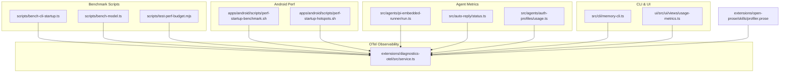

**Diagram sources**
- [bench-cli-startup.ts](file://scripts/bench-cli-startup.ts#L1-L201)
- [bench-model.ts](file://scripts/bench-model.ts#L1-L147)
- [test-perf-budget.mjs](file://scripts/test-perf-budget.mjs#L1-L128)
- [perf-startup-benchmark.sh](file://apps/android/scripts/perf-startup-benchmark.sh#L1-L125)
- [perf-startup-hotspots.sh](file://apps/android/scripts/perf-startup-hotspots.sh#L1-L155)
- [run.ts](file://src/agents/pi-embedded-runner/run.ts#L121-L177)
- [service.ts](file://extensions/diagnostics-otel/src/service.ts#L389-L426)
- [status.ts](file://src/auto-reply/status.ts#L306-L343)
- [usage.ts](file://src/agents/auth-profiles/usage.ts#L84-L234)
- [memory-cli.ts](file://src/cli/memory-cli.ts#L657-L686)
- [usage-metrics.ts](file://ui/src/ui/views/usage-metrics.ts#L407-L431)
- [profiler.prose](file://extensions/open-prose/skills/profiler.prose#L317-L357)

**Section sources**
- [bench-cli-startup.ts](file://scripts/bench-cli-startup.ts#L1-L201)
- [bench-model.ts](file://scripts/bench-model.ts#L1-L147)
- [test-perf-budget.mjs](file://scripts/test-perf-budget.mjs#L1-L128)
- [perf-startup-benchmark.sh](file://apps/android/scripts/perf-startup-benchmark.sh#L1-L125)
- [perf-startup-hotspots.sh](file://apps/android/scripts/perf-startup-hotspots.sh#L1-L155)
- [run.ts](file://src/agents/pi-embedded-runner/run.ts#L121-L177)
- [service.ts](file://extensions/diagnostics-otel/src/service.ts#L389-L426)
- [status.ts](file://src/auto-reply/status.ts#L306-L343)
- [usage.ts](file://src/agents/auth-profiles/usage.ts#L84-L234)
- [memory-cli.ts](file://src/cli/memory-cli.ts#L657-L686)
- [usage-metrics.ts](file://ui/src/ui/views/usage-metrics.ts#L407-L431)
- [profiler.prose](file://extensions/open-prose/skills/profiler.prose#L317-L357)

## Core Components
- CLI startup benchmark: measures command execution times and exit characteristics across multiple runs and entries.
- Model inference benchmark: executes model completions and aggregates timing and usage metrics.
- Test performance budget: enforces wall-clock and regression budgets during unit test runs.
- Android macrobenchmark: captures cold-start metrics and optionally compares against a baseline snapshot.
- Android CPU hotspots: collects and summarizes CPU profiles to identify hotspots during startup.
- Agent usage accounting: accumulates token usage, cache metrics, and context sizes across agent runs.
- OTel observability: records latency, token counts, cost, and context metrics for downstream analysis.
- UI usage aggregation: consolidates usage by provider, agent, and channel for dashboards.

**Section sources**
- [bench-cli-startup.ts](file://scripts/bench-cli-startup.ts#L68-L154)
- [bench-model.ts](file://scripts/bench-model.ts#L50-L79)
- [test-perf-budget.mjs](file://scripts/test-perf-budget.mjs#L61-L127)
- [perf-startup-benchmark.sh](file://apps/android/scripts/perf-startup-benchmark.sh#L62-L124)
- [perf-startup-hotspots.sh](file://apps/android/scripts/perf-startup-hotspots.sh#L104-L154)
- [run.ts](file://src/agents/pi-embedded-runner/run.ts#L157-L177)
- [service.ts](file://extensions/diagnostics-otel/src/service.ts#L389-L426)
- [usage-metrics.ts](file://ui/src/ui/views/usage-metrics.ts#L407-L431)

## Architecture Overview
The performance pipeline integrates external benchmarking scripts with internal metrics and observability:

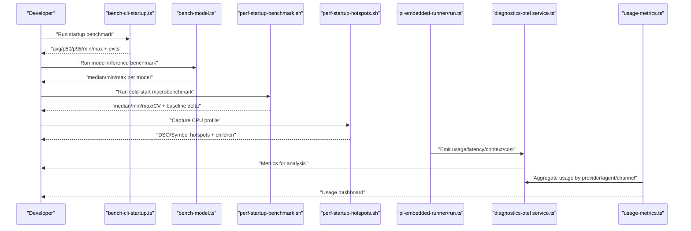

**Diagram sources**
- [bench-cli-startup.ts](file://scripts/bench-cli-startup.ts#L156-L200)
- [bench-model.ts](file://scripts/bench-model.ts#L81-L146)
- [perf-startup-benchmark.sh](file://apps/android/scripts/perf-startup-benchmark.sh#L62-L124)
- [perf-startup-hotspots.sh](file://apps/android/scripts/perf-startup-hotspots.sh#L104-L154)
- [run.ts](file://src/agents/pi-embedded-runner/run.ts#L157-L177)
- [service.ts](file://extensions/diagnostics-otel/src/service.ts#L389-L426)
- [usage-metrics.ts](file://ui/src/ui/views/usage-metrics.ts#L407-L431)

## Detailed Component Analysis

### CLI Startup Benchmark
Measures command execution time and exit conditions across multiple runs. Provides average, median, 95th percentile, min, and max timings, plus exit code distribution.

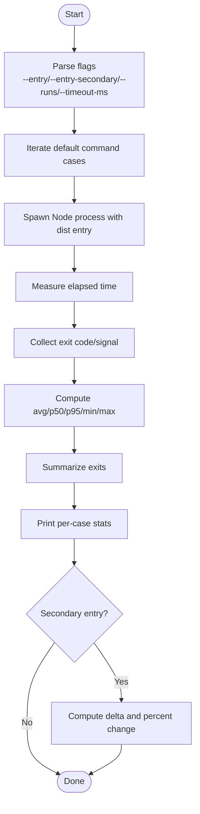

**Diagram sources**
- [bench-cli-startup.ts](file://scripts/bench-cli-startup.ts#L28-L154)

**Section sources**
- [bench-cli-startup.ts](file://scripts/bench-cli-startup.ts#L68-L154)

### Model Inference Benchmark
Executes model completions with a fixed prompt and records duration and usage metrics. Aggregates median/min/max durations for comparison.

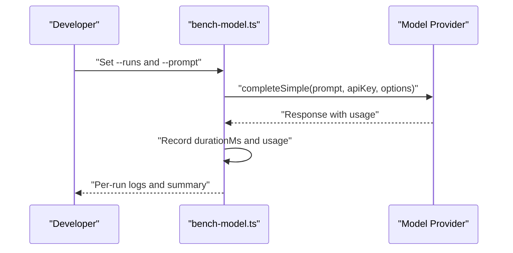

**Diagram sources**
- [bench-model.ts](file://scripts/bench-model.ts#L50-L79)
- [bench-model.ts](file://scripts/bench-model.ts#L115-L138)

**Section sources**
- [bench-model.ts](file://scripts/bench-model.ts#L50-L79)
- [bench-model.ts](file://scripts/bench-model.ts#L115-L138)

### Test Performance Budget
Enforces wall-clock and regression budgets for unit tests, capturing Vitest JSON reporter output to derive per-file durations.

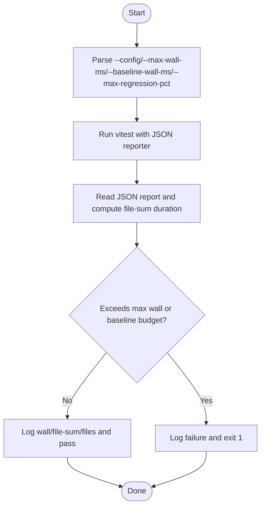

**Diagram sources**
- [test-perf-budget.mjs](file://scripts/test-perf-budget.mjs#L61-L127)

**Section sources**
- [test-perf-budget.mjs](file://scripts/test-perf-budget.mjs#L61-L127)

### Android Macrobenchmark (Cold Start)
Runs a connected Android macrobenchmark, extracts cold-start metrics, snapshots results, and optionally compares to a baseline.

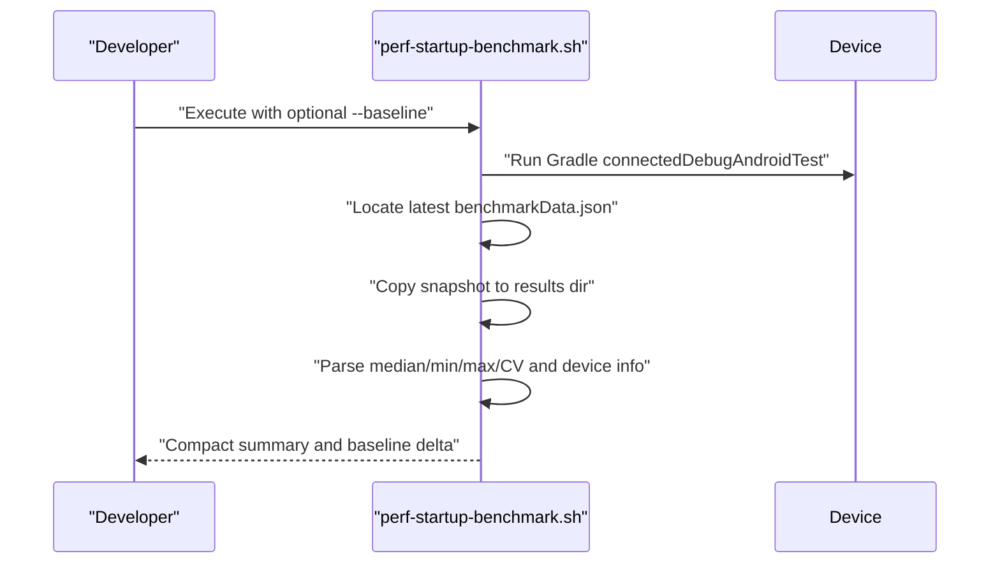

**Diagram sources**
- [perf-startup-benchmark.sh](file://apps/android/scripts/perf-startup-benchmark.sh#L62-L124)

**Section sources**
- [perf-startup-benchmark.sh](file://apps/android/scripts/perf-startup-benchmark.sh#L62-L124)

### Android CPU Hotspots
Captures CPU profiles during startup and prints top DSOs, symbols, and children to identify hotspots.

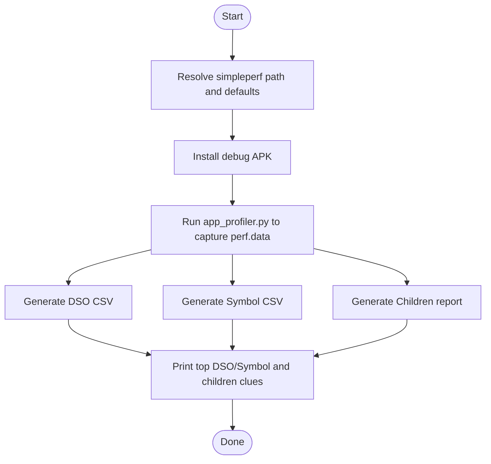

**Diagram sources**
- [perf-startup-hotspots.sh](file://apps/android/scripts/perf-startup-hotspots.sh#L104-L154)

**Section sources**
- [perf-startup-hotspots.sh](file://apps/android/scripts/perf-startup-hotspots.sh#L104-L154)

### Agent Usage Accounting and Token/Context Metrics
Accumulates token usage, cache reads/writes, and context sizes across agent runs, normalizing and merging usage into an accumulator.

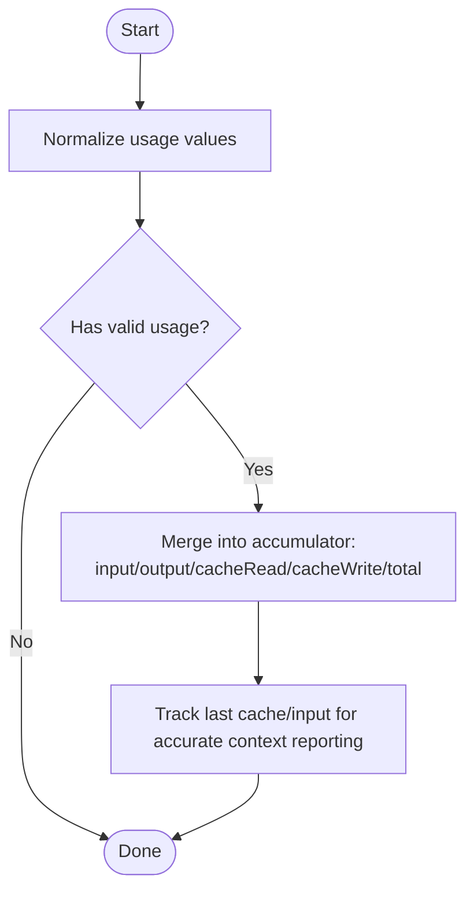

**Diagram sources**
- [run.ts](file://src/agents/pi-embedded-runner/run.ts#L149-L177)

**Section sources**
- [run.ts](file://src/agents/pi-embedded-runner/run.ts#L149-L177)

### OTel Observability (Latency, Tokens, Cost, Context)
Records latency, token counts, cost, and context metrics for downstream analysis and alerting.

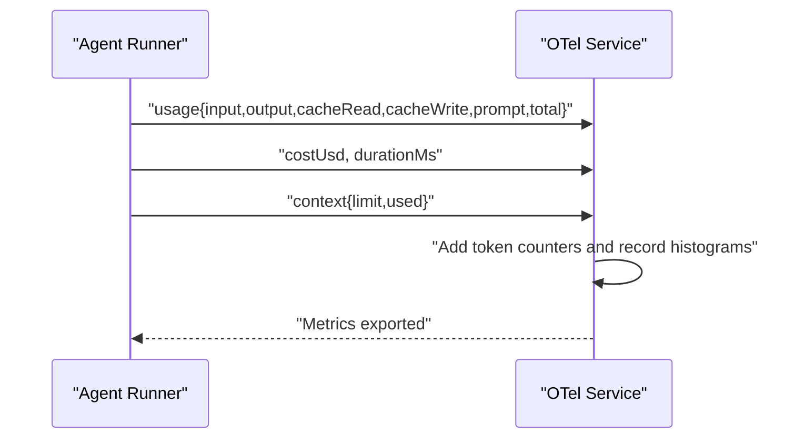

**Diagram sources**
- [service.ts](file://extensions/diagnostics-otel/src/service.ts#L389-L426)

**Section sources**
- [service.ts](file://extensions/diagnostics-otel/src/service.ts#L389-L426)

### UI Usage Aggregation
Aggregates usage totals by provider, agent, and channel for dashboards and reporting.

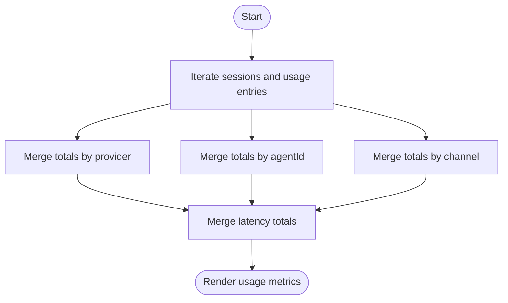

**Diagram sources**
- [usage-metrics.ts](file://ui/src/ui/views/usage-metrics.ts#L407-L431)

**Section sources**
- [usage-metrics.ts](file://ui/src/ui/views/usage-metrics.ts#L407-L431)

### Profiling Analysis Script (Prose Skill)
Provides structured analysis prompts for profiling data, focusing on cost attribution, time attribution, efficiency, cache efficiency, and hotspots.

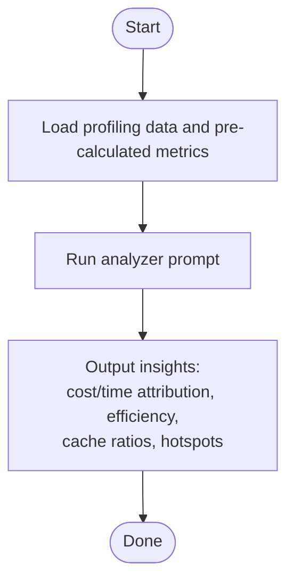

**Diagram sources**
- [profiler.prose](file://extensions/open-prose/skills/prose/lib/profiler.prose#L317-L357)

**Section sources**
- [profiler.prose](file://extensions/open-prose/skills/prose/lib/profiler.prose#L317-L357)

## Dependency Analysis
The following diagram shows how benchmarking and profiling components relate to internal metrics and observability:

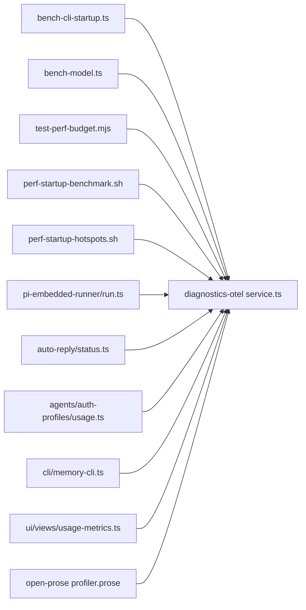

**Diagram sources**
- [bench-cli-startup.ts](file://scripts/bench-cli-startup.ts#L156-L200)
- [bench-model.ts](file://scripts/bench-model.ts#L81-L146)
- [test-perf-budget.mjs](file://scripts/test-perf-budget.mjs#L61-L127)
- [perf-startup-benchmark.sh](file://apps/android/scripts/perf-startup-benchmark.sh#L62-L124)
- [perf-startup-hotspots.sh](file://apps/android/scripts/perf-startup-hotspots.sh#L104-L154)
- [run.ts](file://src/agents/pi-embedded-runner/run.ts#L157-L177)
- [status.ts](file://src/auto-reply/status.ts#L306-L343)
- [usage.ts](file://src/agents/auth-profiles/usage.ts#L84-L234)
- [memory-cli.ts](file://src/cli/memory-cli.ts#L657-L686)
- [usage-metrics.ts](file://ui/src/ui/views/usage-metrics.ts#L407-L431)
- [service.ts](file://extensions/diagnostics-otel/src/service.ts#L389-L426)
- [profiler.prose](file://extensions/open-prose/skills/prose/lib/profiler.prose#L317-L357)

**Section sources**
- [service.ts](file://extensions/diagnostics-otel/src/service.ts#L389-L426)
- [usage-metrics.ts](file://ui/src/ui/views/usage-metrics.ts#L407-L431)

## Performance Considerations
- Memory usage patterns
  - Monitor indexing progress and ETA to infer throughput and memory pressure during large operations.
  - Use cache hit rates and token counts to detect memory-heavy operations and potential overfetching.
- CPU utilization tracking
  - Use Android CPU hotspots to identify hot DSOs and symbols during startup and agent runs.
  - Correlate hotspots with agent bindings and tool invocations to prioritize optimization.
- I/O performance measurement
  - Measure cold-start times and coefficient of variation to assess stability and responsiveness.
  - Track token and cost metrics to infer I/O-heavy providers and optimize batching or caching.
- Benchmarking methodologies
  - Model inference: run multiple iterations with fixed prompts and compare median/min/max durations and usage.
  - Message processing: instrument agent loops and tool calls to measure latency and throughput.
  - Concurrent sessions: scale up sessions and monitor latency, cache hit rates, and cost growth to identify saturation points.
- Practical examples
  - Use CLI startup benchmark to compare entry points and detect regressions.
  - Use Android macrobenchmark to track cold-start stability and regressions against baselines.
  - Use OTel metrics to correlate latency with token usage and cost for cost-efficiency analysis.

[No sources needed since this section provides general guidance]

## Troubleshooting Guide
- CLI startup benchmark shows unexpected exit codes or signals
  - Review exit summaries and adjust timeouts or environment flags.
  - Compare primary and secondary entries to isolate regressions.
- Model benchmark missing environment keys
  - Ensure required API keys are set before running model inference benchmark.
- Android macrobenchmark fails to produce results
  - Verify device connectivity, permissions, and that benchmark artifacts are generated.
  - Confirm baseline file path if comparing against historical snapshots.
- Android CPU hotspots capture fails
  - Ensure simpleperf is available via NDK and device supports profiling.
  - Adjust capture duration and filters to avoid timeouts.
- Test performance budget exceeded
  - Investigate wall-clock and regression thresholds; adjust baseline or investigate flaky tests.

**Section sources**
- [bench-cli-startup.ts](file://scripts/bench-cli-startup.ts#L117-L127)
- [bench-model.ts](file://scripts/bench-model.ts#L85-L92)
- [perf-startup-benchmark.sh](file://apps/android/scripts/perf-startup-benchmark.sh#L49-L53)
- [perf-startup-hotspots.sh](file://apps/android/scripts/perf-startup-hotspots.sh#L72-L87)
- [test-perf-budget.mjs](file://scripts/test-perf-budget.mjs#L104-L117)

## Conclusion
OpenClaw provides a robust foundation for performance profiling and benchmarking across CLI, model inference, Android startup, and agent processing. By combining deterministic benchmarks, macrobenchmarks, CPU profiling, and OTel-based metrics, teams can identify bottlenecks, enforce budgets, and iteratively optimize throughput, latency, and cost.

[No sources needed since this section summarizes without analyzing specific files]

## Appendices
- Benchmarking checklist
  - Define baseline and targets for startup, inference, and concurrency.
  - Instrument latency, tokens, cost, and context metrics.
  - Capture CPU profiles during hotspots and correlate with agent/tool activity.
  - Enforce test performance budgets to prevent regressions.
- Metric interpretation guide
  - Startup: focus on median and CV; investigate outliers and baseline deltas.
  - Inference: compare median/min/max; track token and cost per run.
  - Agent usage: monitor cache hit rate and context size; flag excessive cache reads/writes.
  - Concurrency: observe latency increases and cost growth with session count.

[No sources needed since this section provides general guidance]