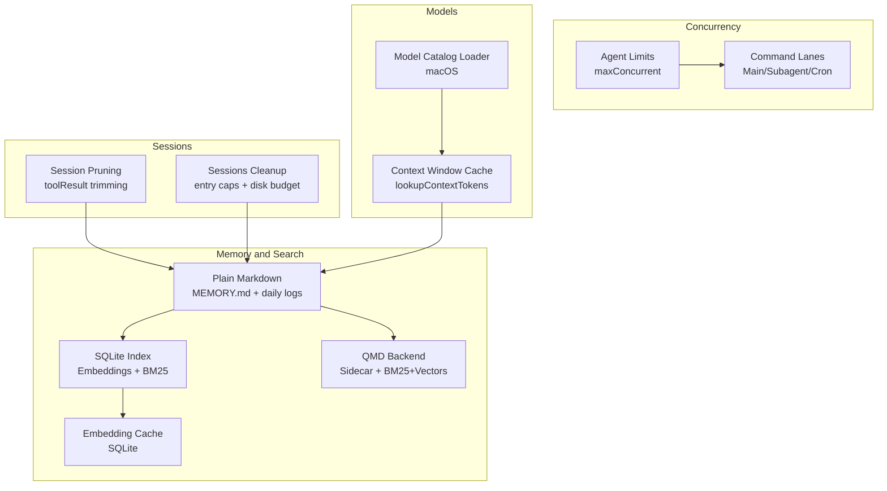
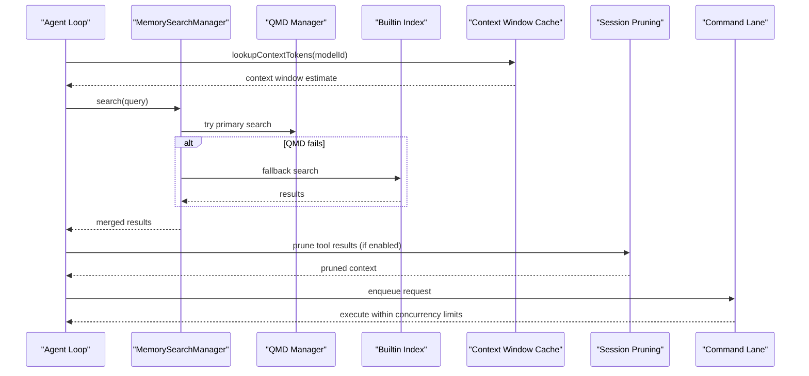
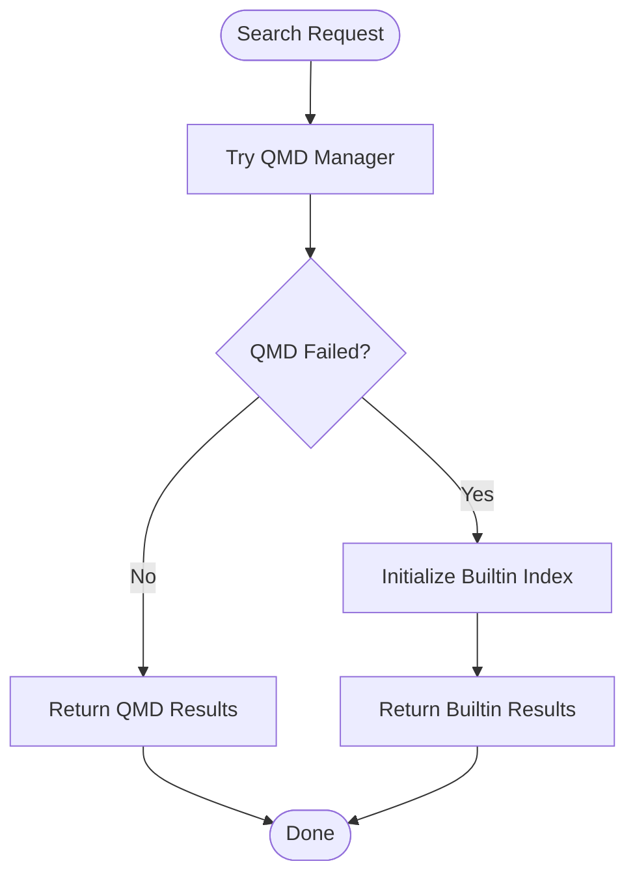
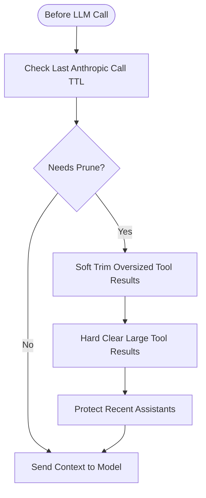
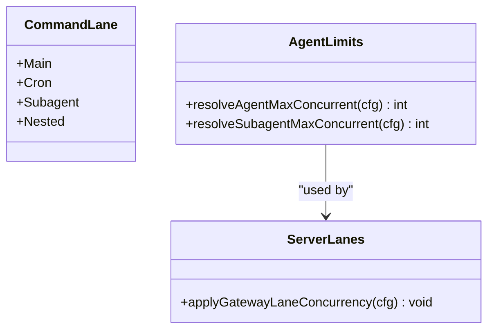
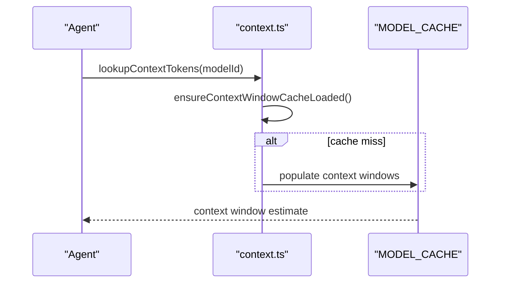
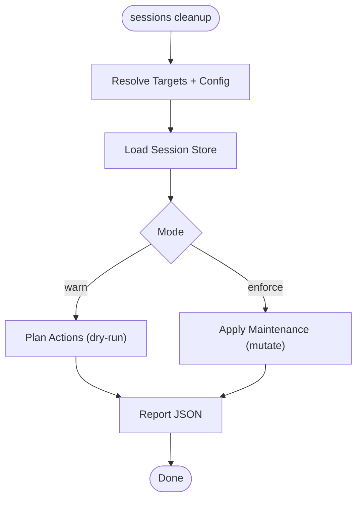
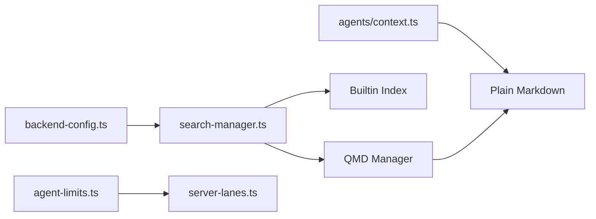

# Resource Optimization

<cite>
**Referenced Files in This Document**
- [docs/concepts/memory.md](file://docs/concepts/memory.md)
- [docs/concepts/session-pruning.md](file://docs/concepts/session-pruning.md)
- [src/memory/search-manager.ts](file://src/memory/search-manager.ts)
- [src/memory/backend-config.ts](file://src/memory/backend-config.ts)
- [src/config/agent-limits.ts](file://src/config/agent-limits.ts)
- [src/process/lanes.ts](file://src/process/lanes.ts)
- [src/gateway/server-lanes.ts](file://src/gateway/server-lanes.ts)
- [src/agents/context.ts](file://src/agents/context.ts)
- [src/commands/sessions-cleanup.test.ts](file://src/commands/sessions-cleanup.test.ts)
- [docs/cli/memory.md](file://docs/cli/memory.md)
- [apps/macos/Sources/OpenClaw/ModelCatalogLoader.swift](file://apps/macos/Sources/OpenClaw/ModelCatalogLoader.swift)
- [src/memory/qmd-manager.test.ts](file://src/memory/qmd-manager.test.ts)
</cite>

## Table of Contents
1. [Introduction](#introduction)
2. [Project Structure](#project-structure)
3. [Core Components](#core-components)
4. [Architecture Overview](#architecture-overview)
5. [Detailed Component Analysis](#detailed-component-analysis)
6. [Dependency Analysis](#dependency-analysis)
7. [Performance Considerations](#performance-considerations)
8. [Troubleshooting Guide](#troubleshooting-guide)
9. [Conclusion](#conclusion)
10. [Appendices](#appendices)

## Introduction
This document provides comprehensive resource optimization guidance for OpenClaw deployments. It focuses on memory management strategies, cache optimization techniques, CPU utilization improvements, agent lifecycle optimization, session pruning policies, and resource allocation patterns. It also documents configuration options for controlling memory usage, optimizing model loading, and managing concurrent operations, with practical examples and monitoring approaches.

## Project Structure
OpenClaw’s resource optimization spans several subsystems:
- Memory and semantic search: plain Markdown files as the source of truth, with optional vector and BM25 hybrid search, embedding caches, and QMD backend.
- Session pruning: transient trimming of tool results to reduce context growth and Anthropic cache churn.
- Concurrency and lanes: command lane concurrency controls for main agents, subagents, and cron tasks.
- Model context windows and discovery: eager loading and caching of model context limits to avoid cold-start misses.
- Session cleanup: maintenance of session stores to cap entries and disk usage.

**Diagram sources**
- [docs/concepts/memory.md](file://docs/concepts/memory.md#L1-L741)
- [docs/concepts/session-pruning.md](file://docs/concepts/session-pruning.md#L1-L122)
- [src/memory/search-manager.ts](file://src/memory/search-manager.ts#L1-L253)
- [src/memory/backend-config.ts](file://src/memory/backend-config.ts#L180-L218)
- [src/config/agent-limits.ts](file://src/config/agent-limits.ts#L1-L23)
- [src/process/lanes.ts](file://src/process/lanes.ts#L1-L7)
- [src/gateway/server-lanes.ts](file://src/gateway/server-lanes.ts#L1-L10)
- [src/agents/context.ts](file://src/agents/context.ts#L111-L194)
- [apps/macos/Sources/OpenClaw/ModelCatalogLoader.swift](file://apps/macos/Sources/OpenClaw/ModelCatalogLoader.swift#L1-L30)

**Section sources**
- [docs/concepts/memory.md](file://docs/concepts/memory.md#L1-L741)
- [docs/concepts/session-pruning.md](file://docs/concepts/session-pruning.md#L1-L122)
- [src/memory/search-manager.ts](file://src/memory/search-manager.ts#L1-L253)
- [src/memory/backend-config.ts](file://src/memory/backend-config.ts#L180-L218)
- [src/config/agent-limits.ts](file://src/config/agent-limits.ts#L1-L23)
- [src/process/lanes.ts](file://src/process/lanes.ts#L1-L7)
- [src/gateway/server-lanes.ts](file://src/gateway/server-lanes.ts#L1-L10)
- [src/agents/context.ts](file://src/agents/context.ts#L111-L194)
- [apps/macos/Sources/OpenClaw/ModelCatalogLoader.swift](file://apps/macos/Sources/OpenClaw/ModelCatalogLoader.swift#L1-L30)

## Core Components
- Memory and semantic search: Markdown-based memory with optional vector/BM25 hybrid search, embedding cache, and QMD backend with fallback.
- Session pruning: transient trimming of tool results before LLM calls to reduce Anthropic cache churn.
- Concurrency and lanes: command lane concurrency applied to main agents, subagents, and cron.
- Model context windows: eager loading and caching of context limits to avoid cold-start misses.
- Sessions cleanup: maintenance to cap entries and enforce disk budgets.

**Section sources**
- [docs/concepts/memory.md](file://docs/concepts/memory.md#L1-L741)
- [docs/concepts/session-pruning.md](file://docs/concepts/session-pruning.md#L1-L122)
- [src/memory/search-manager.ts](file://src/memory/search-manager.ts#L1-L253)
- [src/memory/backend-config.ts](file://src/memory/backend-config.ts#L180-L218)
- [src/config/agent-limits.ts](file://src/config/agent-limits.ts#L1-L23)
- [src/process/lanes.ts](file://src/process/lanes.ts#L1-L7)
- [src/gateway/server-lanes.ts](file://src/gateway/server-lanes.ts#L1-L10)
- [src/agents/context.ts](file://src/agents/context.ts#L111-L194)

## Architecture Overview
The resource optimization architecture integrates memory search, session pruning, concurrency controls, and model context caching to minimize CPU and memory usage while maintaining responsiveness.

**Diagram sources**
- [src/agents/context.ts](file://src/agents/context.ts#L111-L194)
- [src/memory/search-manager.ts](file://src/memory/search-manager.ts#L25-L102)
- [src/memory/search-manager.ts](file://src/memory/search-manager.ts#L104-L246)
- [docs/concepts/session-pruning.md](file://docs/concepts/session-pruning.md#L13-L86)
- [src/gateway/server-lanes.ts](file://src/gateway/server-lanes.ts#L6-L9)

## Detailed Component Analysis

### Memory Management and Semantic Search
- Plain Markdown as source of truth with daily logs and optional curated MEMORY.md.
- Vector and BM25 hybrid search with optional MMR diversity and temporal decay.
- Embedding cache to avoid re-embedding unchanged chunks.
- QMD backend with fallback to builtin index; cache keyed by agentId and backend config; eviction on failures.
- QMD-specific limits and timeouts; session transcripts can be exported to QMD for recall.

**Diagram sources**
- [src/memory/search-manager.ts](file://src/memory/search-manager.ts#L25-L102)
- [src/memory/search-manager.ts](file://src/memory/search-manager.ts#L104-L246)

**Section sources**
- [docs/concepts/memory.md](file://docs/concepts/memory.md#L92-L741)
- [src/memory/search-manager.ts](file://src/memory/search-manager.ts#L1-L253)
- [src/memory/backend-config.ts](file://src/memory/backend-config.ts#L180-L218)
- [src/memory/qmd-manager.test.ts](file://src/memory/qmd-manager.test.ts#L105-L127)

### Session Pruning Policies
- Trims old tool results from in-memory context before LLM calls.
- Supports cache-TTL mode for Anthropic models to reduce cacheWrite on first post-TTL request.
- Protects recent assistant messages and skips image-containing tool results.
- Uses estimated context window with configurable caps.

**Diagram sources**
- [docs/concepts/session-pruning.md](file://docs/concepts/session-pruning.md#L13-L86)

**Section sources**
- [docs/concepts/session-pruning.md](file://docs/concepts/session-pruning.md#L1-L122)

### Concurrency and Agent Lifecycle Optimization
- Command lanes: main, cron, subagent, nested.
- Agent concurrency limits resolved from configuration with sensible defaults.
- Gateway applies lane concurrency based on configuration.

**Diagram sources**
- [src/process/lanes.ts](file://src/process/lanes.ts#L1-L7)
- [src/config/agent-limits.ts](file://src/config/agent-limits.ts#L1-L23)
- [src/gateway/server-lanes.ts](file://src/gateway/server-lanes.ts#L1-L10)

**Section sources**
- [src/process/lanes.ts](file://src/process/lanes.ts#L1-L7)
- [src/config/agent-limits.ts](file://src/config/agent-limits.ts#L1-L23)
- [src/gateway/server-lanes.ts](file://src/gateway/server-lanes.ts#L1-L10)

### Model Loading and Context Window Caching
- Eager loading and caching of model context windows to avoid cold-start misses.
- Lookup function triggers background loading without blocking.
- macOS model catalog loader resolves paths and sanitizes sources.

**Diagram sources**
- [src/agents/context.ts](file://src/agents/context.ts#L111-L194)

**Section sources**
- [src/agents/context.ts](file://src/agents/context.ts#L111-L194)
- [apps/macos/Sources/OpenClaw/ModelCatalogLoader.swift](file://apps/macos/Sources/OpenClaw/ModelCatalogLoader.swift#L1-L30)

### Sessions Cleanup and Disk Budgeting
- Maintenance modes: warn, enforce.
- Prunes stale entries, caps entries, rotates logs, enforces disk budget.
- Dry-run and JSON reporting for planning and auditing.

**Diagram sources**
- [src/commands/sessions-cleanup.test.ts](file://src/commands/sessions-cleanup.test.ts#L53-L291)

**Section sources**
- [src/commands/sessions-cleanup.test.ts](file://src/commands/sessions-cleanup.test.ts#L53-L291)

## Dependency Analysis
- Memory search manager depends on backend configuration resolution and can fall back to builtin index.
- QMD manager cache is keyed by agentId and backend config; failures evict cache entries.
- Agent limits are resolved centrally and applied by the gateway server lanes.
- Context window cache is populated eagerly and used by agents for token estimation.

**Diagram sources**
- [src/memory/backend-config.ts](file://src/memory/backend-config.ts#L180-L218)
- [src/memory/search-manager.ts](file://src/memory/search-manager.ts#L25-L102)
- [src/config/agent-limits.ts](file://src/config/agent-limits.ts#L1-L23)
- [src/gateway/server-lanes.ts](file://src/gateway/server-lanes.ts#L1-L10)
- [src/agents/context.ts](file://src/agents/context.ts#L111-L194)

**Section sources**
- [src/memory/backend-config.ts](file://src/memory/backend-config.ts#L180-L218)
- [src/memory/search-manager.ts](file://src/memory/search-manager.ts#L1-L253)
- [src/config/agent-limits.ts](file://src/config/agent-limits.ts#L1-L23)
- [src/gateway/server-lanes.ts](file://src/gateway/server-lanes.ts#L1-L10)
- [src/agents/context.ts](file://src/agents/context.ts#L111-L194)

## Performance Considerations
- Memory search
  - Prefer hybrid search (BM25 + vector) for robust recall; enable MMR for diversity and temporal decay for recency when appropriate.
  - Use embedding cache to avoid re-embedding unchanged chunks.
  - Tune QMD limits (maxResults, maxSnippetChars, maxInjectedChars, timeoutMs) to balance quality and latency.
  - Enable QMD boot refresh without blocking startup when needed.
- Session pruning
  - Enable cache-TTL pruning for Anthropic models and align TTL with model cache retention.
  - Protect recent assistant messages and avoid trimming image-containing tool results.
- Concurrency
  - Adjust agent and subagent maxConcurrent to match workload and hardware capacity.
  - Use command lanes to isolate main, cron, and subagent traffic.
- Model context windows
  - Rely on eager loading to avoid cold-start misses; monitor context window estimates to prevent over-allocation.
- Sessions cleanup
  - Use enforce mode to cap entries and disk usage; leverage dry-run for planning.

[No sources needed since this section provides general guidance]

## Troubleshooting Guide
- Memory search unavailability
  - QMD failures trigger fallback to builtin index; check logs for reasons and evict cache entries to retry.
  - Verify QMD installation, SQLite with extensions, and XDG directories for state.
- Slow first search with QMD
  - QMD may auto-download local models on first query; pre-warm by running a query with the same XDG directories.
- Session pruning not applied
  - Ensure cache-TTL mode is enabled and TTL aligns with model cache retention; verify protection of recent assistants.
- Excessive memory usage
  - Reduce maxResults and snippet limits; enable embedding cache; consider disabling hybrid search or MMR/temporal decay if not needed.
- High CPU usage
  - Lower agent concurrency; throttle QMD update intervals; avoid excessive session indexing; monitor context window estimates.

**Section sources**
- [src/memory/search-manager.ts](file://src/memory/search-manager.ts#L72-L85)
- [src/memory/search-manager.ts](file://src/memory/search-manager.ts#L122-L133)
- [docs/concepts/memory.md](file://docs/concepts/memory.md#L127-L232)
- [docs/concepts/session-pruning.md](file://docs/concepts/session-pruning.md#L13-L86)

## Conclusion
OpenClaw’s resource optimization relies on efficient memory management (Markdown-first with hybrid search and embedding cache), targeted session pruning to reduce context bloat, disciplined concurrency controls, and eager model context caching. By tuning configuration surfaces—memory search limits, QMD settings, pruning policies, and concurrency—the system can achieve lower CPU and memory usage while preserving responsiveness and accuracy.

[No sources needed since this section summarizes without analyzing specific files]

## Appendices

### Practical Examples and Monitoring
- Monitor memory search health and indexing status via CLI commands.
- Use dry-run sessions cleanup to plan maintenance actions and review JSON reports.
- Observe latency and usage aggregates to guide tuning decisions.

**Section sources**
- [docs/cli/memory.md](file://docs/cli/memory.md#L1-L67)
- [src/commands/sessions-cleanup.test.ts](file://src/commands/sessions-cleanup.test.ts#L193-L291)