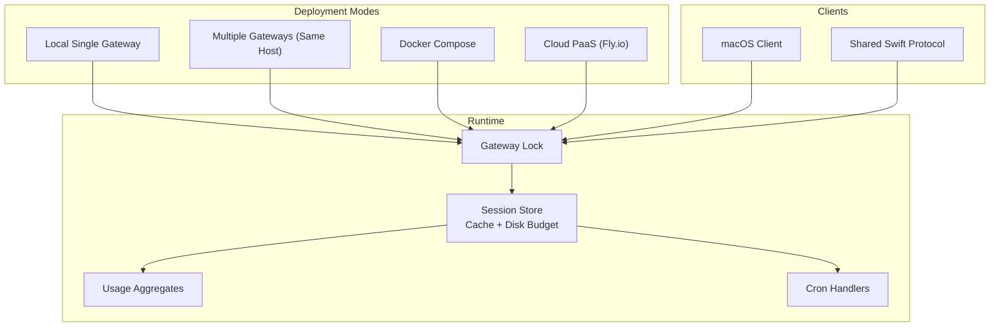
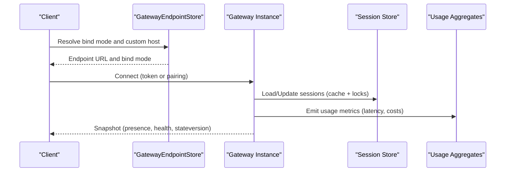
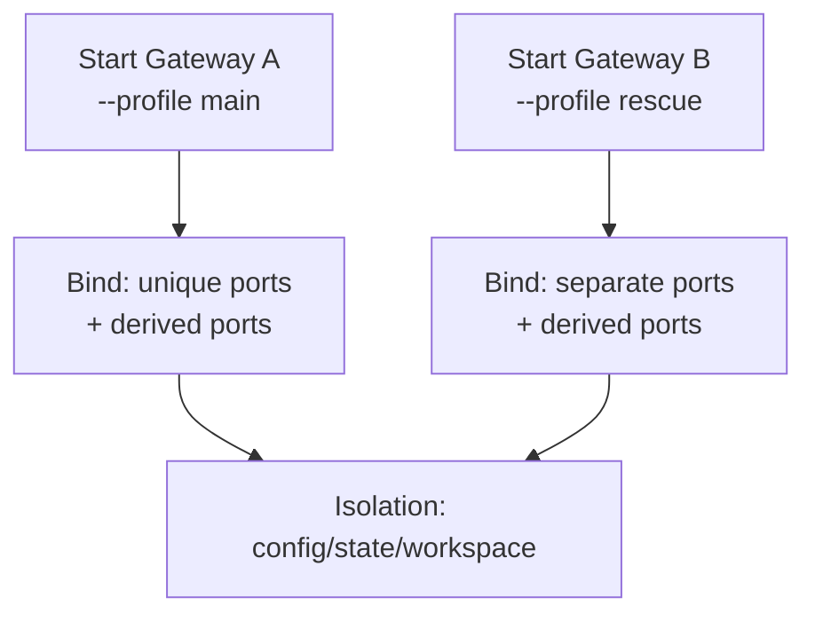
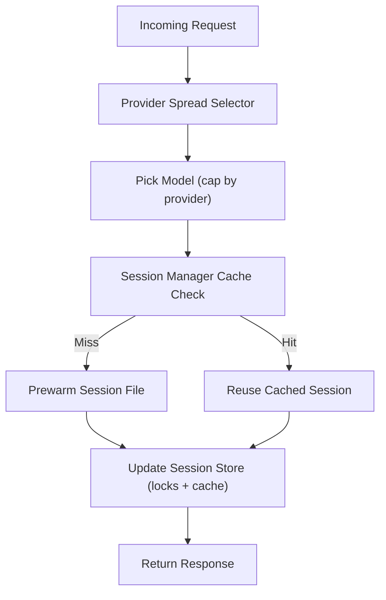
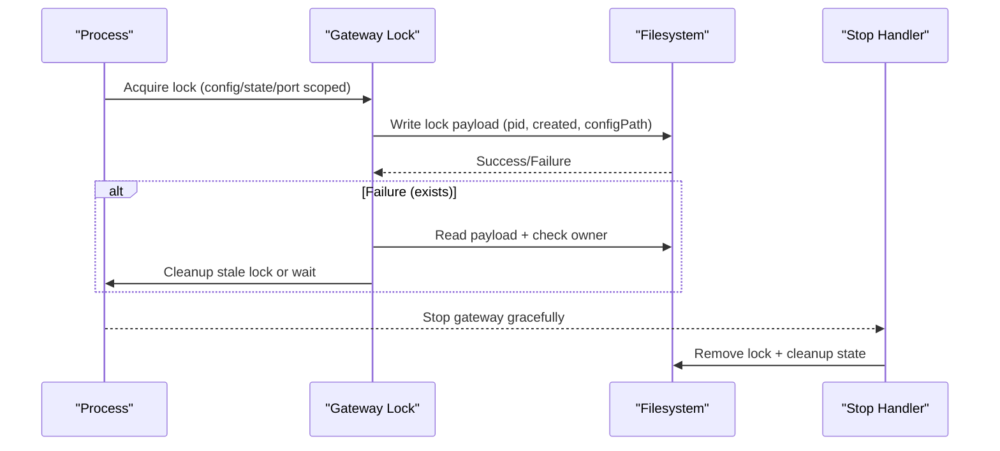
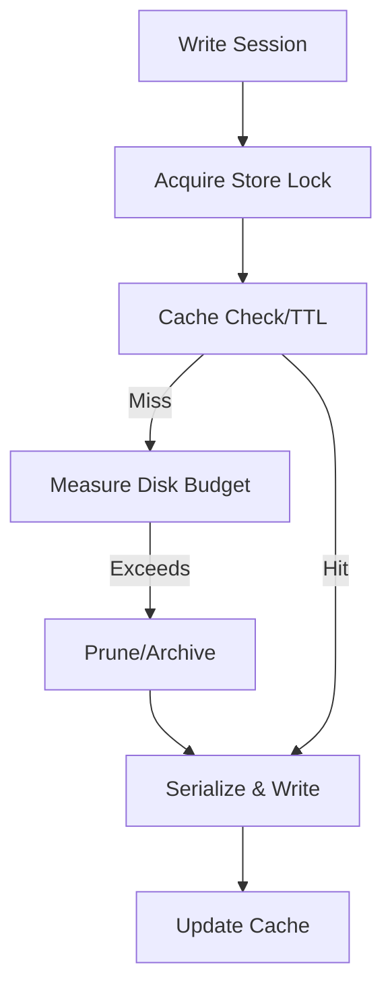
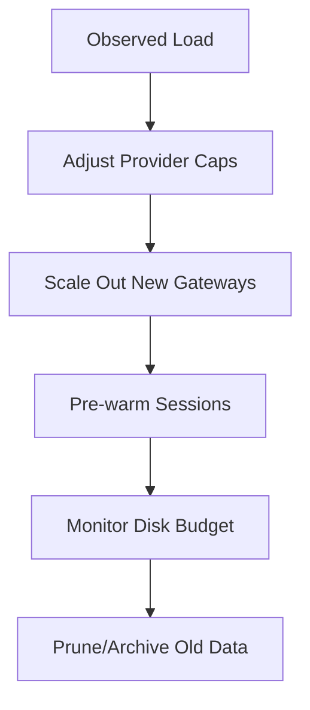
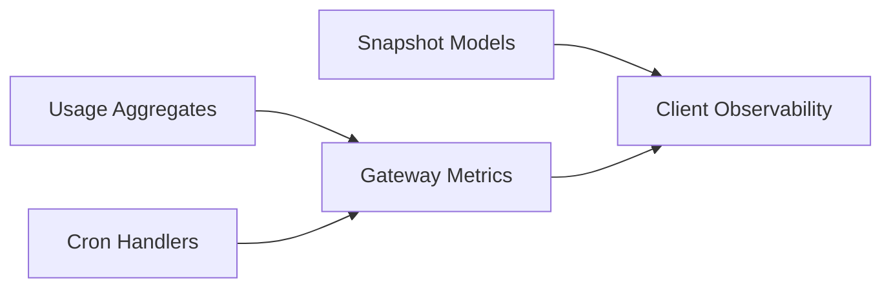
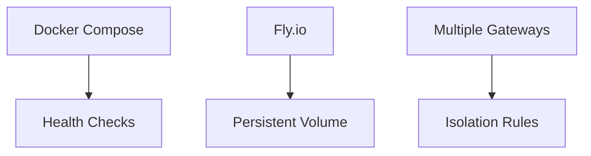
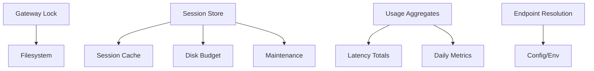

# Scaling Strategies

<cite>
**Referenced Files in This Document**
- [multiple-gateways.md](file://docs/gateway/multiple-gateways.md)
- [docker.md](file://docs/install/docker.md)
- [fly.md](file://docs/install/fly.md)
- [gateway-lock.ts](file://src/infra/gateway-lock.ts)
- [gateway-models.profiles.live.test.ts](file://src/gateway/gateway-models.profiles.live.test.ts)
- [session-manager-cache.ts](file://src/agents/pi-embedded-runner/session-manager-cache.ts)
- [store.ts](file://src/config/sessions/store.ts)
- [disk-budget.ts](file://src/config/sessions/disk-budget.ts)
- [cron.ts](file://src/gateway/server-methods/cron.ts)
- [usage-aggregates.ts](file://src/shared/usage-aggregates.ts)
- [GatewayEndpointStore.swift](file://apps/macos/Sources/OpenClaw/GatewayEndpointStore.swift)
- [gateway-e2e-harness.ts](file://test/helpers/gateway-e2e-harness.ts)
- [GatewayModels.swift](file://apps/macos/Sources/OpenClawProtocol/GatewayModels.swift)
- [GatewayModels.swift](file://apps/shared/OpenClawKit/Sources/OpenClawProtocol/GatewayModels.swift)
</cite>

## Table of Contents
1. [Introduction](#introduction)
2. [Project Structure](#project-structure)
3. [Core Components](#core-components)
4. [Architecture Overview](#architecture-overview)
5. [Detailed Component Analysis](#detailed-component-analysis)
6. [Dependency Analysis](#dependency-analysis)
7. [Performance Considerations](#performance-considerations)
8. [Troubleshooting Guide](#troubleshooting-guide)
9. [Conclusion](#conclusion)
10. [Appendices](#appendices)

## Introduction
This document provides a comprehensive guide to horizontal and vertical scaling strategies for OpenClaw. It explains how to configure load balancing across gateways, deploy multiple instances safely, and operate distributed gateway architectures. It also covers session distribution, state synchronization, cluster coordination patterns, auto-scaling configurations, capacity planning methodologies, traffic prediction models, practical scaling deployments, monitoring cluster performance, and graceful scaling operations that maintain service availability during growth.

## Project Structure
OpenClaw’s scaling capabilities are supported by:
- Multiple gateway instances per host with strong isolation guarantees
- Containerized deployments with persistent state and health checks
- Platform-as-a-Service (PaaS) templates for cloud providers
- Session store with caching, disk budgeting, and concurrency controls
- Usage metrics aggregation and cron-based maintenance
- Client-side gateway endpoint resolution and snapshot models

**Diagram sources**
- [multiple-gateways.md](file://docs/gateway/multiple-gateways.md#L9-L113)
- [docker.md](file://docs/install/docker.md#L35-L844)
- [fly.md](file://docs/install/fly.md#L1-L433)
- [gateway-lock.ts](file://src/infra/gateway-lock.ts#L173-L263)
- [store.ts](file://src/config/sessions/store.ts#L1-L200)
- [disk-budget.ts](file://src/config/sessions/disk-budget.ts#L50-L89)
- [usage-aggregates.ts](file://src/shared/usage-aggregates.ts#L1-L110)
- [cron.ts](file://src/gateway/server-methods/cron.ts#L1-L200)
- [GatewayEndpointStore.swift](file://apps/macos/Sources/OpenClaw/GatewayEndpointStore.swift#L543-L572)
- [GatewayModels.swift](file://apps/macos/Sources/OpenClawProtocol/GatewayModels.swift#L279-L328)
- [GatewayModels.swift](file://apps/shared/OpenClawKit/Sources/OpenClawProtocol/GatewayModels.swift#L279-L328)

**Section sources**
- [multiple-gateways.md](file://docs/gateway/multiple-gateways.md#L9-L113)
- [docker.md](file://docs/install/docker.md#L35-L844)
- [fly.md](file://docs/install/fly.md#L1-L433)

## Core Components
- Multiple gateways per host with isolation of config, state, ports, and profiles
- Containerized gateway with persistent storage and health probes
- Cloud PaaS deployment templates with persistent volumes and HTTPS
- Session store with TTL-based caching, disk budgeting, and concurrency locks
- Usage metrics aggregation and cron-based maintenance
- Client-side gateway endpoint resolution and snapshot models

**Section sources**
- [multiple-gateways.md](file://docs/gateway/multiple-gateways.md#L13-L113)
- [docker.md](file://docs/install/docker.md#L469-L543)
- [fly.md](file://docs/install/fly.md#L63-L84)
- [store.ts](file://src/config/sessions/store.ts#L1-L200)
- [disk-budget.ts](file://src/config/sessions/disk-budget.ts#L50-L89)
- [usage-aggregates.ts](file://src/shared/usage-aggregates.ts#L1-L110)
- [cron.ts](file://src/gateway/server-methods/cron.ts#L1-L200)
- [GatewayEndpointStore.swift](file://apps/macos/Sources/OpenClaw/GatewayEndpointStore.swift#L543-L572)

## Architecture Overview
OpenClaw supports horizontal scaling by running multiple gateways with strict isolation and coordinated resource allocation. Vertical scaling is achieved by increasing CPU/memory resources and enabling persistent state. Clients resolve gateway endpoints and receive snapshots containing presence, health, uptime, and configuration pointers.

**Diagram sources**
- [GatewayEndpointStore.swift](file://apps/macos/Sources/OpenClaw/GatewayEndpointStore.swift#L543-L572)
- [store.ts](file://src/config/sessions/store.ts#L1-L200)
- [usage-aggregates.ts](file://src/shared/usage-aggregates.ts#L1-L110)
- [GatewayModels.swift](file://apps/macos/Sources/OpenClawProtocol/GatewayModels.swift#L279-L328)
- [GatewayModels.swift](file://apps/shared/OpenClawKit/Sources/OpenClawProtocol/GatewayModels.swift#L279-L328)

## Detailed Component Analysis

### Horizontal Scaling: Multiple Gateways on One Host
- Isolation checklist: distinct config path, state directory, workspace, and unique ports per instance
- Profiles auto-scope state and config; use separate base ports with at least 20 ports spacing to avoid derived port collisions
- Rescue-bot pattern: run a secondary gateway with its own profile and ports for isolation and debugging

**Diagram sources**
- [multiple-gateways.md](file://docs/gateway/multiple-gateways.md#L13-L75)

**Section sources**
- [multiple-gateways.md](file://docs/gateway/multiple-gateways.md#L13-L75)

### Load Balancing and Session Distribution
- Provider spread: select models/providers with balanced distribution and caps to prevent overloading a single provider
- Session manager cache: prewarm and cache session files to reduce cold-start latency
- Session store cache and TTL: reduce disk contention and improve throughput for concurrent updates

**Diagram sources**
- [gateway-models.profiles.live.test.ts](file://src/gateway/gateway-models.profiles.live.test.ts#L126-L167)
- [session-manager-cache.ts](file://src/agents/pi-embedded-runner/session-manager-cache.ts#L1-L70)
- [store.ts](file://src/config/sessions/store.ts#L1-L200)

**Section sources**
- [gateway-models.profiles.live.test.ts](file://src/gateway/gateway-models.profiles.live.test.ts#L126-L167)
- [session-manager-cache.ts](file://src/agents/pi-embedded-runner/session-manager-cache.ts#L1-L70)
- [store.ts](file://src/config/sessions/store.ts#L1-L200)

### Distributed Gateway Architectures and Cluster Coordination
- Gateway lock prevents multiple gateways from sharing the same config/state/port; supports stale lock cleanup and platform-specific PID checks
- Graceful stop and start: clients can stop gateways with SIGTERM/SIGKILL timeouts and clean up state directories
- Client endpoint resolution: supports bind modes and custom host overrides for distributed environments

**Diagram sources**
- [gateway-lock.ts](file://src/infra/gateway-lock.ts#L173-L263)
- [gateway-e2e-harness.ts](file://test/helpers/gateway-e2e-harness.ts#L193-L218)

**Section sources**
- [gateway-lock.ts](file://src/infra/gateway-lock.ts#L173-L263)
- [gateway-e2e-harness.ts](file://test/helpers/gateway-e2e-harness.ts#L193-L218)
- [GatewayEndpointStore.swift](file://apps/macos/Sources/OpenClaw/GatewayEndpointStore.swift#L543-L572)

### State Synchronization and Persistence
- Session store: atomic writes, cache TTL, and maintenance routines; supports normalized keys and delivery context
- Disk budgeting: measures store sizes, entry chunks, and ref-counts to manage growth and retention policies
- Concurrency control: session store locks serialize updates to prevent data loss

**Diagram sources**
- [store.ts](file://src/config/sessions/store.ts#L1-L200)
- [disk-budget.ts](file://src/config/sessions/disk-budget.ts#L50-L89)

**Section sources**
- [store.ts](file://src/config/sessions/store.ts#L1-L200)
- [disk-budget.ts](file://src/config/sessions/disk-budget.ts#L50-L89)

### Auto-Scaling and Capacity Planning
- Provider spread and model caps: limit concurrent load per provider and cap total models to stabilize performance
- Session cache TTL and prewarm: reduce latency spikes during scaling events
- Disk budgeting and maintenance: define thresholds and pruning policies to sustain long-running deployments

**Diagram sources**
- [gateway-models.profiles.live.test.ts](file://src/gateway/gateway-models.profiles.live.test.ts#L126-L167)
- [session-manager-cache.ts](file://src/agents/pi-embedded-runner/session-manager-cache.ts#L1-L70)
- [disk-budget.ts](file://src/config/sessions/disk-budget.ts#L50-L89)

**Section sources**
- [gateway-models.profiles.live.test.ts](file://src/gateway/gateway-models.profiles.live.test.ts#L126-L167)
- [session-manager-cache.ts](file://src/agents/pi-embedded-runner/session-manager-cache.ts#L1-L70)
- [disk-budget.ts](file://src/config/sessions/disk-budget.ts#L50-L89)

### Traffic Prediction Models and Monitoring
- Usage aggregates: merge latency, daily breakdowns, and cost metrics for trend analysis
- Cron handlers: schedule maintenance tasks and periodic health checks
- Snapshot models: clients receive presence, health, uptime, and configuration pointers for observability

**Diagram sources**
- [usage-aggregates.ts](file://src/shared/usage-aggregates.ts#L1-L110)
- [cron.ts](file://src/gateway/server-methods/cron.ts#L1-L200)
- [GatewayModels.swift](file://apps/macos/Sources/OpenClawProtocol/GatewayModels.swift#L279-L328)
- [GatewayModels.swift](file://apps/shared/OpenClawKit/Sources/OpenClawProtocol/GatewayModels.swift#L279-L328)

**Section sources**
- [usage-aggregates.ts](file://src/shared/usage-aggregates.ts#L1-L110)
- [cron.ts](file://src/gateway/server-methods/cron.ts#L1-L200)
- [GatewayModels.swift](file://apps/macos/Sources/OpenClawProtocol/GatewayModels.swift#L279-L328)
- [GatewayModels.swift](file://apps/shared/OpenClawKit/Sources/OpenClawProtocol/GatewayModels.swift#L279-L328)

### Practical Examples of Scaling Deployments
- Docker Compose: containerized gateway with persistent config/workspace, optional sandbox, and health probes
- Fly.io: PaaS deployment with persistent volume, HTTPS, and machine sizing; supports private deployments without public IPs
- Multiple gateways: rescue-bot pattern with isolated profiles and ports

**Diagram sources**
- [docker.md](file://docs/install/docker.md#L469-L543)
- [fly.md](file://docs/install/fly.md#L63-L84)
- [multiple-gateways.md](file://docs/gateway/multiple-gateways.md#L13-L75)

**Section sources**
- [docker.md](file://docs/install/docker.md#L35-L844)
- [fly.md](file://docs/install/fly.md#L1-L433)
- [multiple-gateways.md](file://docs/gateway/multiple-gateways.md#L13-L75)

## Dependency Analysis
- Gateway lock depends on filesystem and process inspection to prevent conflicts
- Session store depends on cache utilities, disk budgeting, and maintenance routines
- Usage aggregates depend on latency and daily metrics structures
- Client endpoint resolution depends on environment variables and configuration

**Diagram sources**
- [gateway-lock.ts](file://src/infra/gateway-lock.ts#L173-L263)
- [store.ts](file://src/config/sessions/store.ts#L1-L200)
- [disk-budget.ts](file://src/config/sessions/disk-budget.ts#L50-L89)
- [usage-aggregates.ts](file://src/shared/usage-aggregates.ts#L1-L110)
- [GatewayEndpointStore.swift](file://apps/macos/Sources/OpenClaw/GatewayEndpointStore.swift#L543-L572)

**Section sources**
- [gateway-lock.ts](file://src/infra/gateway-lock.ts#L173-L263)
- [store.ts](file://src/config/sessions/store.ts#L1-L200)
- [disk-budget.ts](file://src/config/sessions/disk-budget.ts#L50-L89)
- [usage-aggregates.ts](file://src/shared/usage-aggregates.ts#L1-L110)
- [GatewayEndpointStore.swift](file://apps/macos/Sources/OpenClaw/GatewayEndpointStore.swift#L543-L572)

## Performance Considerations
- Use provider spread and model caps to balance load and avoid provider saturation
- Tune session cache TTL and prewarm strategies to minimize latency during scaling
- Apply disk budgeting and pruning to control storage growth and maintain responsiveness
- Prefer containerized deployments with persistent volumes for stateful scaling
- Monitor usage metrics and cron-based maintenance to proactively address bottlenecks

[No sources needed since this section provides general guidance]

## Troubleshooting Guide
- Gateway lock conflicts: stale locks or overlapping ports; resolve by cleaning stale locks or adjusting ports
- Graceful shutdown: ensure SIGTERM/SIGKILL timeouts and cleanup state directories
- Endpoint resolution: verify bind modes and custom host overrides in environment/configuration

**Section sources**
- [gateway-lock.ts](file://src/infra/gateway-lock.ts#L173-L263)
- [gateway-e2e-harness.ts](file://test/helpers/gateway-e2e-harness.ts#L193-L218)
- [GatewayEndpointStore.swift](file://apps/macos/Sources/OpenClaw/GatewayEndpointStore.swift#L543-L572)

## Conclusion
OpenClaw’s scaling strategy combines strong isolation for multiple gateways, robust session state management, and observability primitives. By leveraging provider spread, session caching, disk budgeting, and cron-based maintenance, operators can horizontally and vertically scale the system while preserving reliability and performance. Containerized and PaaS deployments further simplify operational scaling with persistent state and health checks.

[No sources needed since this section summarizes without analyzing specific files]

## Appendices
- Client snapshot fields: presence, health, stateversion, uptime, config path, state directory, session defaults, auth mode, and update availability

**Section sources**
- [GatewayModels.swift](file://apps/macos/Sources/OpenClawProtocol/GatewayModels.swift#L279-L328)
- [GatewayModels.swift](file://apps/shared/OpenClawKit/Sources/OpenClawProtocol/GatewayModels.swift#L279-L328)