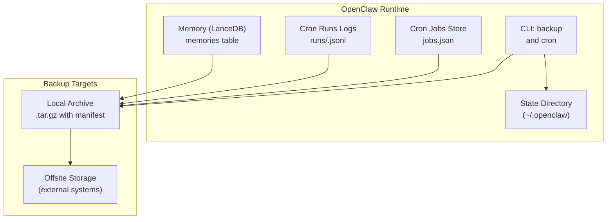
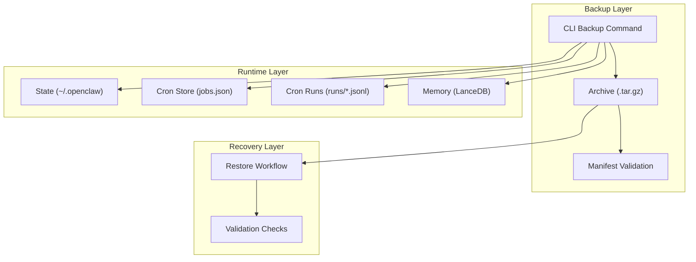
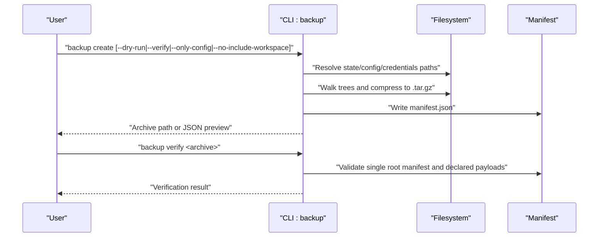
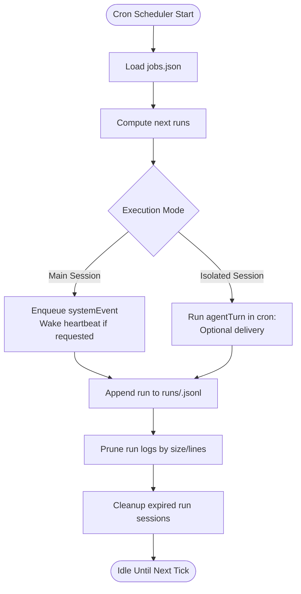
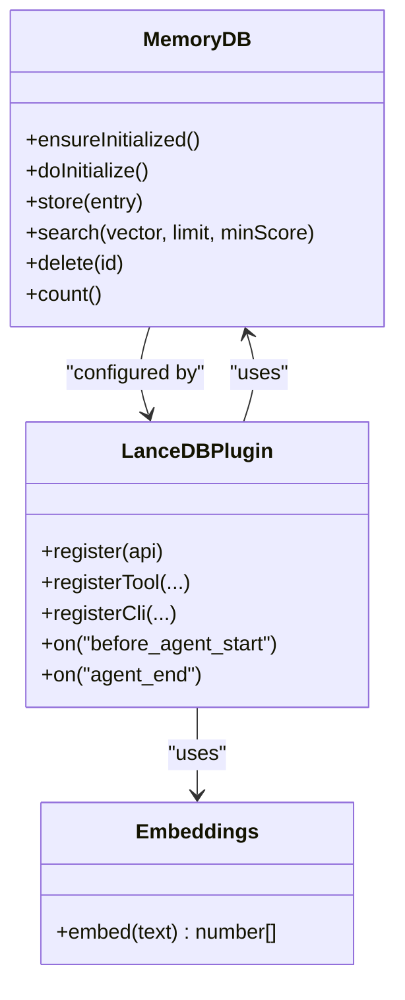
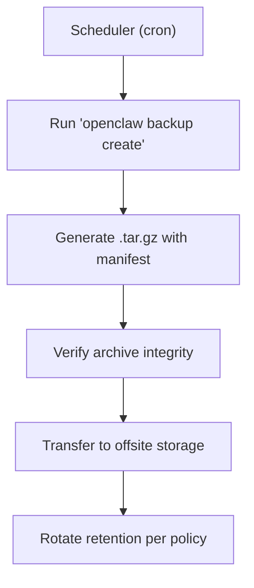
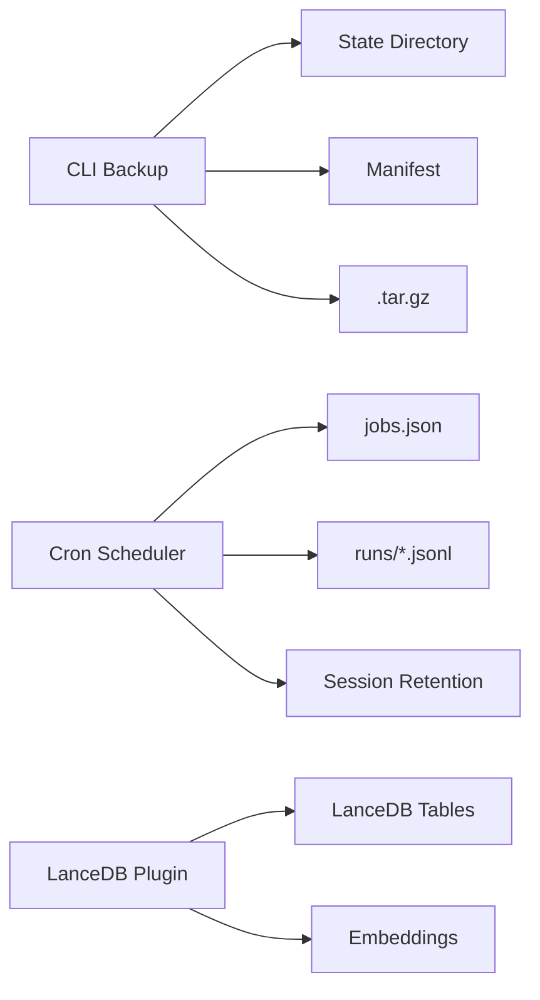

# Backup and Disaster Recovery

<cite>
**Referenced Files in This Document**
- [backup.md](file://docs/cli/backup.md)
- [cron-jobs.md](file://docs/automation/cron-jobs.md)
- [index.ts](file://extensions/memory-lancedb/index.ts)
- [config.ts](file://extensions/memory-lancedb/config.ts)
</cite>

## Table of Contents
1. [Introduction](#introduction)
2. [Project Structure](#project-structure)
3. [Core Components](#core-components)
4. [Architecture Overview](#architecture-overview)
5. [Detailed Component Analysis](#detailed-component-analysis)
6. [Dependency Analysis](#dependency-analysis)
7. [Performance Considerations](#performance-considerations)
8. [Troubleshooting Guide](#troubleshooting-guide)
9. [Conclusion](#conclusion)
10. [Appendices](#appendices)

## Introduction
This document defines backup and disaster recovery strategies for OpenClaw production data protection. It covers configuration backup procedures, state synchronization, automated scheduling, incremental strategies, offsite storage, and recovery validation. It also outlines failover mechanisms, business continuity planning, point-in-time recovery examples, cross-region replication, and compliance and audit trail considerations.

## Project Structure
OpenClaw provides:
- A first-class CLI backup command that archives state, configuration, credentials, and optionally workspaces.
- A built-in scheduler (cron) that persists jobs and run histories locally, enabling automated maintenance and recovery readiness.
- A memory subsystem (LanceDB) that stores long-term memories and vector embeddings, requiring separate backup and replication strategies.

**Diagram sources**
- [backup.md:13-31](file://docs/cli/backup.md#L13-L31)
- [cron-jobs.md:402-408](file://docs/automation/cron-jobs.md#L402-L408)
- [index.ts:57-101](file://extensions/memory-lancedb/index.ts#L57-L101)

**Section sources**
- [backup.md:9-77](file://docs/cli/backup.md#L9-L77)
- [cron-jobs.md:10-728](file://docs/automation/cron-jobs.md#L10-L728)
- [index.ts:1-679](file://extensions/memory-lancedb/index.ts#L1-L679)

## Core Components
- CLI backup command: Creates compressed archives of state, config, credentials, and optionally workspaces. Includes manifest validation and dry-run capabilities.
- Cron scheduler: Persists jobs and run logs locally, enabling scheduled maintenance and recovery readiness.
- Memory subsystem (LanceDB): Stores vectorized memories and requires separate backup and replication.

Key responsibilities:
- Backup: Archive and integrity verification of state and configuration.
- Automation: Scheduled maintenance and run-log pruning to control footprint.
- Memory: Vector store persistence and periodic backup/replication.

**Section sources**
- [backup.md:13-31](file://docs/cli/backup.md#L13-L31)
- [cron-jobs.md:402-408](file://docs/automation/cron-jobs.md#L402-L408)
- [index.ts:57-101](file://extensions/memory-lancedb/index.ts#L57-L101)

## Architecture Overview
The backup and recovery architecture integrates CLI-driven backups, cron-based maintenance, and memory subsystem persistence.

**Diagram sources**
- [backup.md:13-31](file://docs/cli/backup.md#L13-L31)
- [cron-jobs.md:402-408](file://docs/automation/cron-jobs.md#L402-L408)
- [index.ts:57-101](file://extensions/memory-lancedb/index.ts#L57-L101)

## Detailed Component Analysis

### CLI Backup Procedures
- Purpose: Produce first-class local backup archives for OpenClaw state, config, credentials, sessions, and optionally workspaces.
- Behavior:
  - Default output is a timestamped .tar.gz archive in the current working directory.
  - Archives include a manifest.json describing resolved source paths and archive layout.
  - Supports dry-run and JSON output for preview.
  - Supports integrity verification of the archive and of individual archives.
  - Options to exclude workspaces or restrict to config-only backups.
- Robustness:
  - Validates against self-inclusion and rejects traversal-style paths.
  - Fallback behavior when config is invalid but workspace backup is disabled.

**Diagram sources**
- [backup.md:13-31](file://docs/cli/backup.md#L13-L31)

**Section sources**
- [backup.md:9-77](file://docs/cli/backup.md#L9-L77)

### Cron-Based Maintenance and Recovery Readiness
- Persistence:
  - Jobs are stored in a JSON file under the state directory.
  - Run logs are stored as JSONL files per job and pruned by size and line count.
- Retention and pruning:
  - Isolated run sessions are pruned based on a configurable retention window.
  - Run logs are pruned to a maximum size and line count.
- Execution modes:
  - Main session: enqueues system events and optionally wakes the heartbeat.
  - Isolated session: runs dedicated agent turns with optional delivery and lightweight bootstrap context.
- Delivery:
  - Announce delivery to channels or webhook delivery for integration with external systems.

**Diagram sources**
- [cron-jobs.md:402-408](file://docs/automation/cron-jobs.md#L402-L408)
- [cron-jobs.md:487-521](file://docs/automation/cron-jobs.md#L487-L521)

**Section sources**
- [cron-jobs.md:72-77](file://docs/automation/cron-jobs.md#L72-L77)
- [cron-jobs.md:402-408](file://docs/automation/cron-jobs.md#L402-L408)
- [cron-jobs.md:487-521](file://docs/automation/cron-jobs.md#L487-L521)

### Memory Subsystem (LanceDB) Backup and Replication
- Storage:
  - LanceDB tables store memory entries with vectors, importance, category, and timestamps.
  - Database path resolves to a default location under the user’s home directory.
- Operations:
  - Memory recall, store, and forget tools enable retrieval and deletion of memories.
  - Lifecycle hooks auto-capture and inject memories for context.
- Backup and replication:
  - Backup strategy should include backing up the LanceDB directory and ensuring consistent snapshots.
  - Cross-region replication should mirror the LanceDB directory and vector indices.

**Diagram sources**
- [index.ts:57-157](file://extensions/memory-lancedb/index.ts#L57-L157)
- [index.ts:163-186](file://extensions/memory-lancedb/index.ts#L163-L186)
- [index.ts:292-679](file://extensions/memory-lancedb/index.ts#L292-L679)

**Section sources**
- [index.ts:57-101](file://extensions/memory-lancedb/index.ts#L57-L101)
- [index.ts:300-306](file://extensions/memory-lancedb/index.ts#L300-L306)
- [config.ts:26-49](file://extensions/memory-lancedb/config.ts#L26-L49)

### Automated Backup Scheduling
- Recommended cadence:
  - Full backup: weekly or bi-weekly.
  - Incremental backup: daily at off-peak hours.
- Scheduling options:
  - Use cron to trigger the backup command with desired options (e.g., --only-config for small footprint).
  - Combine with manifest validation to ensure integrity.
- Offsite transfer:
  - Post-process backups to offsite storage (e.g., encrypted transfer to cloud storage or tape vault).

**Diagram sources**
- [backup.md:13-31](file://docs/cli/backup.md#L13-L31)
- [cron-jobs.md:566-566](file://docs/automation/cron-jobs.md#L566-L566)

**Section sources**
- [backup.md:13-31](file://docs/cli/backup.md#L13-L31)
- [cron-jobs.md:566-566](file://docs/automation/cron-jobs.md#L566-L566)

### Incremental Backup Strategies
- State and configuration:
  - Use file-level differencing or versioned snapshots to minimize bandwidth and restore time.
- Workspaces:
  - Exclude large workspaces by default and include only selected subsets for incremental backups.
- Manifest-driven verification:
  - Rely on the embedded manifest to validate inclusion and detect drift.

**Section sources**
- [backup.md:34-47](file://docs/cli/backup.md#L34-L47)
- [backup.md:63-77](file://docs/cli/backup.md#L63-L77)

### Offsite Storage Requirements
- Encryption:
  - Encrypt archives before transfer and at rest.
- Integrity:
  - Maintain checksums and manifests for validation upon retrieval.
- Retention:
  - Define retention periods per regulatory and business needs.
- Accessibility:
  - Ensure offsite systems support rapid retrieval and restoration.

[No sources needed since this section provides general guidance]

### Disaster Recovery Procedures
- Recovery objectives:
  - Define Recovery Point Objective (RPO) and Recovery Time Objective (RTO) aligned with business impact.
- Failover mechanisms:
  - Use cron to orchestrate failover steps (e.g., promote secondary instance, reattach volumes).
  - Ensure run logs and job stores are restored to maintain continuity.
- Business continuity:
  - Maintain minimal downtime by automating failover and validating readiness regularly.

**Section sources**
- [cron-jobs.md:402-408](file://docs/automation/cron-jobs.md#L402-L408)

### Point-in-Time Recovery Examples
- Example 1: Restore to a specific timestamp by recovering the latest full backup before that timestamp and applying subsequent incremental backups.
- Example 2: Use manifest to validate exact inclusion of state/config/credentials before restoring to a clean environment.

**Section sources**
- [backup.md:23-31](file://docs/cli/backup.md#L23-L31)

### Cross-Region Replication
- Strategy:
  - Mirror state directory, cron store, and memory database across regions.
  - Use region-local cron to validate replication and trigger failover if primary becomes unavailable.
- Validation:
  - Periodically run verification steps to ensure consistency and integrity.

**Section sources**
- [index.ts:57-101](file://extensions/memory-lancedb/index.ts#L57-L101)
- [cron-jobs.md:402-408](file://docs/automation/cron-jobs.md#L402-L408)

### Data Integrity Verification
- Archive verification:
  - Use the built-in verify command to validate manifests and payload existence.
- Manifest inspection:
  - Review resolved paths and archive layout to ensure completeness.
- Memory integrity:
  - Validate LanceDB connectivity and table counts after restoration.

**Section sources**
- [backup.md:23-31](file://docs/cli/backup.md#L23-L31)
- [index.ts:153-156](file://extensions/memory-lancedb/index.ts#L153-L156)

### Backup Testing and Restoration Validation
- Test frequency:
  - Monthly restore tests to validate end-to-end recovery.
- Validation checklist:
  - Confirm state, config, credentials, and memory availability.
  - Verify cron jobs and run logs are intact and prune behavior is correct.
  - Validate that the system resumes normal operation after restore.

**Section sources**
- [backup.md:63-77](file://docs/cli/backup.md#L63-L77)
- [cron-jobs.md:487-521](file://docs/automation/cron-jobs.md#L487-L521)

### Compliance, Legal Retention, and Audit Trails
- Compliance:
  - Align backup retention with applicable regulations (e.g., data protection laws).
- Legal retention:
  - Define retention periods for different data categories (e.g., logs, memories).
- Audit trails:
  - Preserve manifests and run logs as audit evidence of backup and restore activities.

**Section sources**
- [backup.md:23-31](file://docs/cli/backup.md#L23-L31)
- [cron-jobs.md:402-408](file://docs/automation/cron-jobs.md#L402-L408)

## Dependency Analysis
- CLI backup depends on:
  - State directory for source paths.
  - Manifest generation/validation logic.
- Cron maintenance depends on:
  - Jobs store and run logs for continuity.
  - Session retention and run-log pruning for footprint control.
- Memory subsystem depends on:
  - LanceDB connection and table initialization.
  - Embedding provider for vectorization.

**Diagram sources**
- [backup.md:13-31](file://docs/cli/backup.md#L13-L31)
- [cron-jobs.md:402-408](file://docs/automation/cron-jobs.md#L402-L408)
- [index.ts:57-101](file://extensions/memory-lancedb/index.ts#L57-L101)

**Section sources**
- [backup.md:13-31](file://docs/cli/backup.md#L13-L31)
- [cron-jobs.md:402-408](file://docs/automation/cron-jobs.md#L402-L408)
- [index.ts:57-101](file://extensions/memory-lancedb/index.ts#L57-L101)

## Performance Considerations
- Backup size:
  - Large workspaces dominate archive size; use options to exclude workspaces or restrict to config-only backups.
- Compression and verification:
  - Verification steps add overhead; schedule verification during off-peak hours.
- Cron maintenance:
  - Tune session retention and run-log limits to balance audit needs and IO costs.

**Section sources**
- [backup.md:63-77](file://docs/cli/backup.md#L63-L77)
- [cron-jobs.md:505-521](file://docs/automation/cron-jobs.md#L505-L521)

## Troubleshooting Guide
- Invalid configuration:
  - If the active config is invalid, workspace discovery is disabled; rerun with workspace exclusion or restrict to config-only backup.
- Archive validation failures:
  - Ensure the archive contains a single root manifest and that all declared payloads exist.
- Cron jobs not running:
  - Verify cron is enabled and the Gateway is running; confirm schedule timezone and stagger settings.

**Section sources**
- [backup.md:49-62](file://docs/cli/backup.md#L49-L62)
- [cron-jobs.md:701-728](file://docs/automation/cron-jobs.md#L701-L728)

## Conclusion
OpenClaw’s backup and disaster recovery strategy combines a robust CLI backup command, a durable cron scheduler, and a vector memory subsystem. By leveraging manifest-driven verification, scheduled maintenance, and offsite storage, teams can achieve reliable protection, fast recovery, and compliance with minimal operational overhead.

## Appendices
- Appendix A: Backup command reference and options.
- Appendix B: Cron configuration and maintenance tuning.
- Appendix C: Memory database path resolution and backup considerations.

[No sources needed since this section summarizes without analyzing specific files]