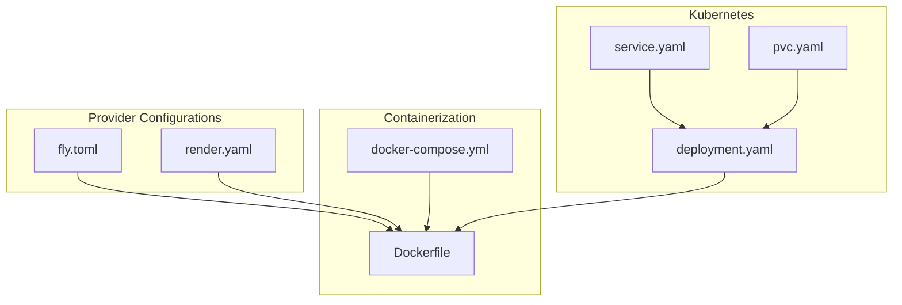
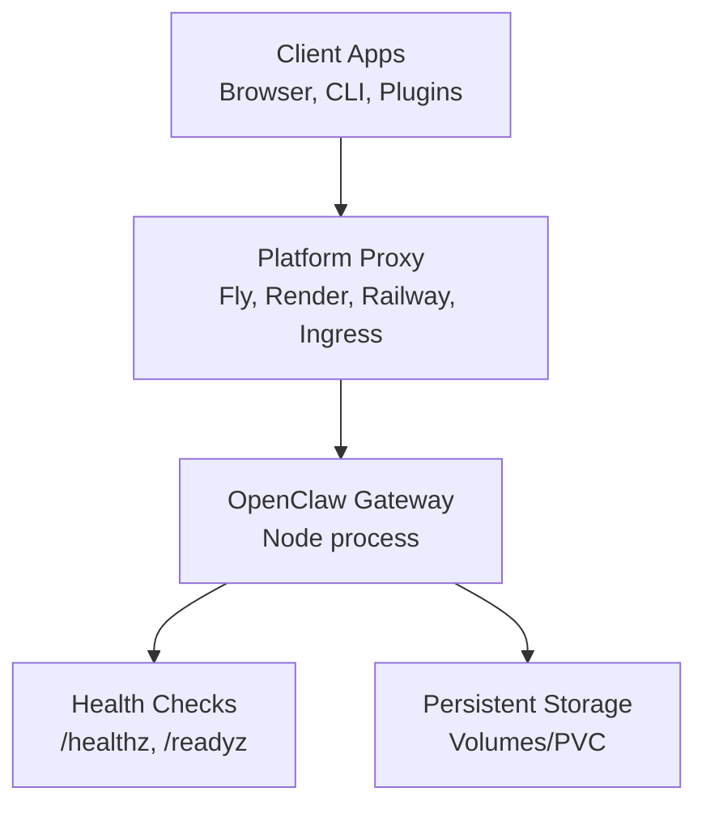
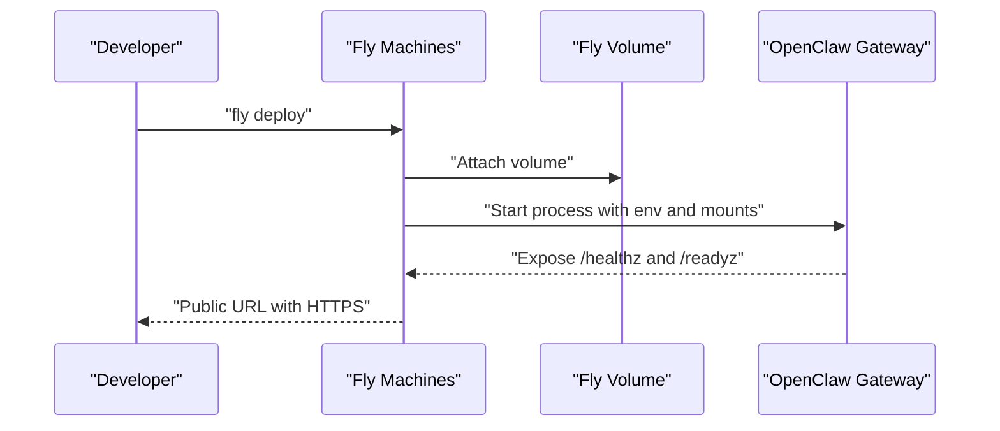
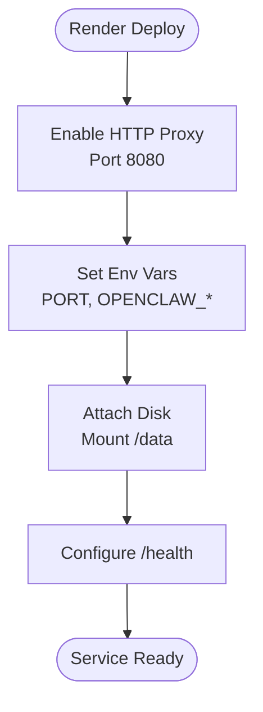
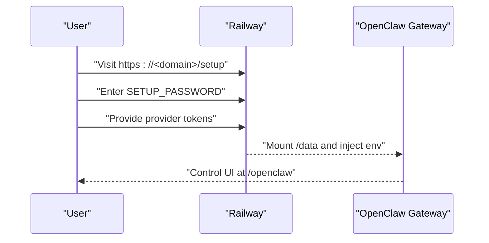
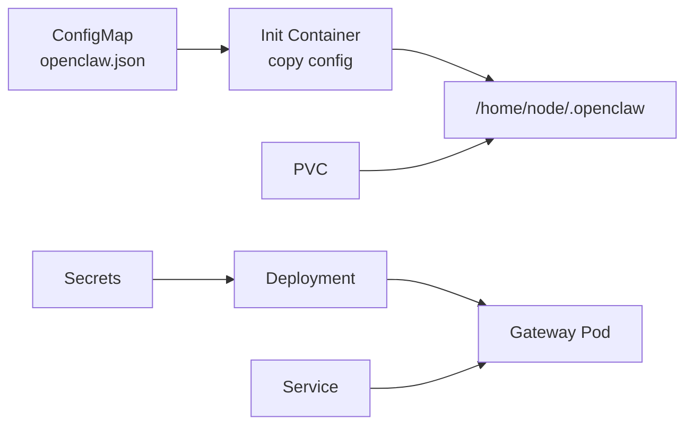
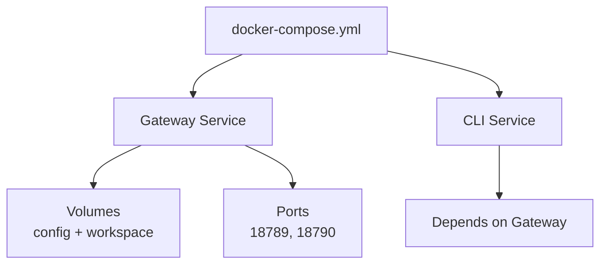
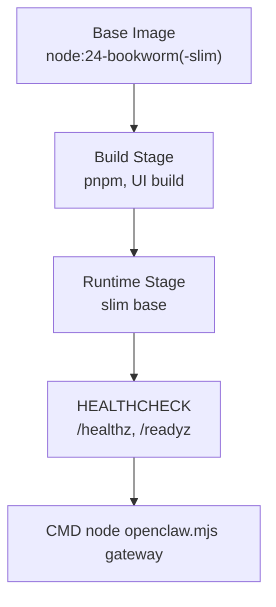
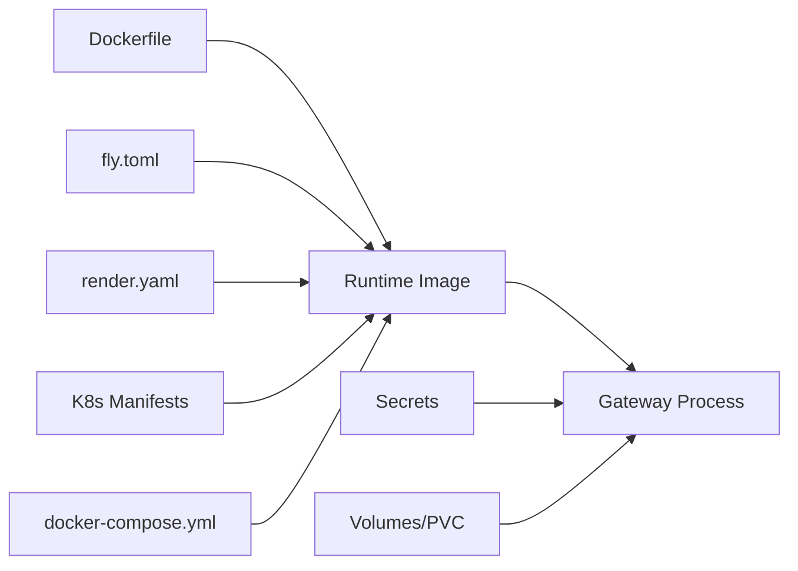

# Cloud Platform Deployment

<cite>
**Referenced Files in This Document**
- [fly.toml](file://fly.toml)
- [render.yaml](file://render.yaml)
- [Dockerfile](file://Dockerfile)
- [docker-compose.yml](file://docker-compose.yml)
- [deployment.yaml](file://scripts/k8s/manifests/deployment.yaml)
- [service.yaml](file://scripts/k8s/manifests/service.yaml)
- [pvc.yaml](file://scripts/k8s/manifests/pvc.yaml)
- [fly.md](file://docs/install/fly.md)
- [railway.mdx](file://docs/install/railway.mdx)
- [northflank.mdx](file://docs/install/northflank.mdx)
- [openclaw.podman.env](file://openclaw.podman.env)
</cite>

## Table of Contents
1. [Introduction](#introduction)
2. [Project Structure](#project-structure)
3. [Core Components](#core-components)
4. [Architecture Overview](#architecture-overview)
5. [Detailed Component Analysis](#detailed-component-analysis)
6. [Dependency Analysis](#dependency-analysis)
7. [Performance Considerations](#performance-considerations)
8. [Troubleshooting Guide](#troubleshooting-guide)
9. [Conclusion](#conclusion)
10. [Appendices](#appendices)

## Introduction
This document provides cloud platform deployment strategies for OpenClaw across multiple PaaS providers. It consolidates platform-specific configuration examples, environment variables, scaling guidance, networking, storage, SSL, domains, and operational best practices. The focus is on practical deployment artifacts present in the repository: Fly.io, Render, Railway, and Kubernetes (Northflank and generic K8s), along with Docker Compose and container runtime considerations.

## Project Structure
OpenClaw’s deployment assets are primarily located in the repository root and under scripts/k8s/manifests:
- fly.toml: Fly.io application configuration and process definition
- render.yaml: Render service configuration and environment variables
- Dockerfile: Multi-stage build producing a minimal runtime image
- docker-compose.yml: Local compose setup for gateway and CLI
- scripts/k8s/manifests/deployment.yaml, service.yaml, pvc.yaml: Kubernetes manifests for a production-grade deployment
- Provider-specific docs: fly.md, railway.mdx, northflank.mdx

**Diagram sources**
- [fly.toml:1-35](file://fly.toml#L1-L35)
- [render.yaml:1-22](file://render.yaml#L1-L22)
- [Dockerfile:1-250](file://Dockerfile#L1-L250)
- [docker-compose.yml:1-79](file://docker-compose.yml#L1-L79)
- [deployment.yaml:1-147](file://scripts/k8s/manifests/deployment.yaml#L1-L147)
- [service.yaml:1-16](file://scripts/k8s/manifests/service.yaml#L1-L16)
- [pvc.yaml:1-13](file://scripts/k8s/manifests/pvc.yaml#L1-L13)

**Section sources**
- [fly.toml:1-35](file://fly.toml#L1-L35)
- [render.yaml:1-22](file://render.yaml#L1-L22)
- [Dockerfile:1-250](file://Dockerfile#L1-L250)
- [docker-compose.yml:1-79](file://docker-compose.yml#L1-L79)
- [deployment.yaml:1-147](file://scripts/k8s/manifests/deployment.yaml#L1-L147)
- [service.yaml:1-16](file://scripts/k8s/manifests/service.yaml#L1-L16)
- [pvc.yaml:1-13](file://scripts/k8s/manifests/pvc.yaml#L1-L13)

## Core Components
- Container image: Built via a multi-stage Dockerfile with a slim runtime base, non-root user, and health checks.
- Gateway process: Exposed via a dedicated port and health endpoints; configurable binding mode and token-based auth.
- Storage: Persistent state via mounted volumes (Fly volumes, Render disks, K8s PVCs).
- Networking: Public ingress via platform proxies (Fly, Render), or internal K8s Service; optional private deployments.
- Secrets: Provider-specific secret management for tokens and keys.

Key environment variables commonly used across platforms:
- OPENCLAW_GATEWAY_TOKEN: Authentication token for remote access
- OPENCLAW_STATE_DIR: Directory for persistent state
- OPENCLAW_WORKSPACE_DIR: Workspace persistence
- Provider API keys: e.g., ANTHROPIC_API_KEY, OPENAI_API_KEY, GOOGLE_API_KEY
- PORT: HTTP proxy port for Render and Railway
- SETUP_PASSWORD: Setup wizard password for Railway/Northflank

**Section sources**
- [Dockerfile:228-249](file://Dockerfile#L228-L249)
- [fly.toml:10-16](file://fly.toml#L10-L16)
- [render.yaml:7-21](file://render.yaml#L7-L21)
- [deployment.yaml:63-98](file://scripts/k8s/manifests/deployment.yaml#L63-L98)
- [railway.mdx:56-65](file://docs/install/railway.mdx#L56-L65)
- [northflank.mdx:13-15](file://docs/install/northflank.mdx#L13-L15)

## Architecture Overview
The gateway runs as a long-lived process behind a platform proxy. It exposes health endpoints and supports token-based authentication. Persistent state is stored on mounted volumes. Scaling is handled by the platform’s autoscaling policies or manual replica increases in Kubernetes.

**Diagram sources**
- [Dockerfile:247-249](file://Dockerfile#L247-L249)
- [fly.toml:20-26](file://fly.toml#L20-L26)
- [render.yaml:6-6](file://render.yaml#L6-L6)
- [deployment.yaml:106-123](file://scripts/k8s/manifests/deployment.yaml#L106-L123)

## Detailed Component Analysis

### Fly.io Deployment
Fly.io provides a straightforward deployment path with persistent volumes and automatic HTTPS. The configuration binds the gateway to a LAN interface for proxy access, enforces HTTPS, and mounts a persistent volume for state.

- App and region: primary_region selection influences latency
- Build: Dockerfile-based build
- Environment: production mode, state directory, memory tuning
- Process: gateway command with explicit port and LAN binding
- HTTP service: internal_port matches gateway port, HTTPS enforced, minimum machines running
- VM sizing: shared CPU with 2GB RAM recommended
- Mounts: persistent volume mapped to state directory

**Diagram sources**
- [fly.toml:4-35](file://fly.toml#L4-L35)
- [Dockerfile:247-249](file://Dockerfile#L247-L249)

**Section sources**
- [fly.md:1-491](file://docs/install/fly.md#L1-L491)
- [fly.toml:1-35](file://fly.toml#L1-L35)

### Render Deployment
Render offers a one-click Docker deployment with a public networking proxy. The service exposes a health check path and mounts a disk for persistent state. Railway and Northflank share similar patterns.

- Service type: Docker
- Plan: starter
- Health check: /health
- Environment: PORT, state/workspace dirs, gateway token generation
- Disk: mounted at /data with configurable size

**Diagram sources**
- [render.yaml:1-22](file://render.yaml#L1-L22)

**Section sources**
- [render.yaml:1-22](file://render.yaml#L1-L22)
- [railway.mdx:1-100](file://docs/install/railway.mdx#L1-L100)
- [northflank.mdx:1-54](file://docs/install/northflank.mdx#L1-L54)

### Railway Deployment
Railway provides a guided setup wizard accessible via a public URL. The deployment includes a volume mounted at /data and requires a setup password. The wizard configures providers and tokens.

- One-click template
- Volume at /data
- Variables: SETUP_PASSWORD, PORT, OPENCLAW_STATE_DIR, OPENCLAW_WORKSPACE_DIR, OPENCLAW_GATEWAY_TOKEN
- Public URL for /setup and /openclaw

**Diagram sources**
- [railway.mdx:1-100](file://docs/install/railway.mdx#L1-L100)

**Section sources**
- [railway.mdx:1-100](file://docs/install/railway.mdx#L1-L100)

### Kubernetes Deployment (Generic and Northflank)
Kubernetes manifests define a Deployment with init-container copying configuration, a Service exposing the gateway port internally, and a PersistentVolumeClaim for state.

- Deployment: non-root user, resource requests/limits, liveness/readiness probes, secret-backed environment
- Service: ClusterIP exposing gateway port
- PVC: ReadWriteOnce, 10Gi default

**Diagram sources**
- [deployment.yaml:24-49](file://scripts/k8s/manifests/deployment.yaml#L24-L49)
- [deployment.yaml:50-147](file://scripts/k8s/manifests/deployment.yaml#L50-L147)
- [service.yaml:1-16](file://scripts/k8s/manifests/service.yaml#L1-L16)
- [pvc.yaml:1-13](file://scripts/k8s/manifests/pvc.yaml#L1-L13)

**Section sources**
- [deployment.yaml:1-147](file://scripts/k8s/manifests/deployment.yaml#L1-L147)
- [service.yaml:1-16](file://scripts/k8s/manifests/service.yaml#L1-L16)
- [pvc.yaml:1-13](file://scripts/k8s/manifests/pvc.yaml#L1-L13)
- [northflank.mdx:1-54](file://docs/install/northflank.mdx#L1-L54)

### Docker Compose (Local)
docker-compose.yml defines two services: gateway and CLI. It demonstrates environment injection, volume mounting for state/workspace, optional Docker socket for sandboxing, and health checks.

- Services: openclaw-gateway and openclaw-cli
- Ports: gateway and bridge ports mapped
- Volumes: config and workspace directories
- Healthcheck: HTTP probe against /healthz

**Diagram sources**
- [docker-compose.yml:1-79](file://docker-compose.yml#L1-L79)

**Section sources**
- [docker-compose.yml:1-79](file://docker-compose.yml#L1-L79)

### Container Image and Runtime
The Dockerfile builds a minimal runtime image with:
- Non-root user
- Health checks via built-in endpoints
- Optional Chromium and Docker CLI installation for advanced features
- Environment defaults for production

**Diagram sources**
- [Dockerfile:103-112](file://Dockerfile#L103-L112)
- [Dockerfile:247-249](file://Dockerfile#L247-L249)
- [Dockerfile:235-250](file://Dockerfile#L235-L250)

**Section sources**
- [Dockerfile:1-250](file://Dockerfile#L1-L250)

## Dependency Analysis
- Platform configs depend on the container image and environment variables.
- Fly and Render rely on public networking and health checks.
- Kubernetes relies on Secrets and ConfigMaps for configuration and secrets injection.
- docker-compose relies on local volumes and environment variables.

**Diagram sources**
- [Dockerfile:1-250](file://Dockerfile#L1-L250)
- [fly.toml:1-35](file://fly.toml#L1-L35)
- [render.yaml:1-22](file://render.yaml#L1-L22)
- [deployment.yaml:63-98](file://scripts/k8s/manifests/deployment.yaml#L63-L98)
- [docker-compose.yml:1-79](file://docker-compose.yml#L1-L79)

**Section sources**
- [Dockerfile:1-250](file://Dockerfile#L1-L250)
- [fly.toml:1-35](file://fly.toml#L1-L35)
- [render.yaml:1-22](file://render.yaml#L1-L22)
- [deployment.yaml:1-147](file://scripts/k8s/manifests/deployment.yaml#L1-L147)
- [docker-compose.yml:1-79](file://docker-compose.yml#L1-L79)

## Performance Considerations
- Memory sizing: Fly recommends increasing VM memory to avoid OOM; 2GB is recommended for typical loads.
- Health checks: Ensure internal_port and gateway port alignment to prevent false negatives.
- Storage IO: Use SSD-backed volumes or PVCs for predictable performance.
- Concurrency: Adjust agent concurrency and model provider quotas according to platform limits.
- Regional placement: Choose regions close to users and providers to reduce latency.

[No sources needed since this section provides general guidance]

## Troubleshooting Guide
Common issues and resolutions:
- Gateway not reachable: verify LAN binding and internal_port alignment
- Health checks failing: confirm /healthz and /readyz endpoints are accessible
- Memory pressure: increase VM/container memory allocation
- State not persisting: ensure state directory is mounted to a persistent volume
- Gateway lock conflicts: remove stale lock files from state directory and restart

**Section sources**
- [fly.md:245-321](file://docs/install/fly.md#L245-L321)
- [Dockerfile:247-249](file://Dockerfile#L247-L249)
- [fly.toml:20-26](file://fly.toml#L20-L26)

## Conclusion
OpenClaw’s deployment configurations across Fly.io, Render, Railway, and Kubernetes emphasize persistent state, secure token-based access, and platform-specific networking. By aligning environment variables, health checks, and storage mounts with platform capabilities, teams can achieve reliable, scalable, and maintainable deployments.

[No sources needed since this section summarizes without analyzing specific files]

## Appendices

### Platform-Specific Environment Variables
- Fly.io
  - OPENCLAW_GATEWAY_TOKEN: required for non-loopback binding
  - OPENCLAW_STATE_DIR: set to mounted volume path
  - NODE_OPTIONS: memory tuning
- Render
  - PORT: must match public networking proxy port
  - OPENCLAW_STATE_DIR, OPENCLAW_WORKSPACE_DIR: persistent paths
  - OPENCLAW_GATEWAY_TOKEN: generated or provided
- Railway/Northflank
  - SETUP_PASSWORD: required for setup wizard
  - PORT: must match proxy port
  - OPENCLAW_STATE_DIR, OPENCLAW_WORKSPACE_DIR: persistent paths
  - OPENCLAW_GATEWAY_TOKEN: recommended
- Kubernetes
  - OPENCLAW_GATEWAY_TOKEN, provider API keys via Secrets
  - OPENCLAW_CONFIG_DIR for mounted config

**Section sources**
- [fly.toml:10-16](file://fly.toml#L10-L16)
- [render.yaml:7-21](file://render.yaml#L7-L21)
- [railway.mdx:56-65](file://docs/install/railway.mdx#L56-L65)
- [deployment.yaml:63-98](file://scripts/k8s/manifests/deployment.yaml#L63-L98)

### Scaling and Autoscaling
- Fly.io: adjust vm.size and memory; min_machines_running controls baseline instances
- Render: select appropriate plan; disk size impacts workspace capacity
- Kubernetes: increase replicas in Deployment; tune resource requests/limits per workload

**Section sources**
- [fly.toml:28-31](file://fly.toml#L28-L31)
- [render.yaml:5-5](file://render.yaml#L5-L5)
- [deployment.yaml:8-8](file://scripts/k8s/manifests/deployment.yaml#L8-L8)

### Networking and SSL
- Fly.io: force_https enabled; optional private deployment without public IPs
- Render: HTTP proxy at configured port; public URL TLS termination
- Kubernetes: Service ClusterIP; external TLS via Ingress controller

**Section sources**
- [fly.toml:22-24](file://fly.toml#L22-L24)
- [render.yaml:6-6](file://render.yaml#L6-L6)
- [service.yaml:8-16](file://scripts/k8s/manifests/service.yaml#L8-L16)

### Domain Configuration
- Fly.io: public URL provided; optional custom domain mapping managed by Fly
- Render: custom domain attached via platform UI
- Railway/Northflank: custom domain attached via platform UI
- Kubernetes: configure Ingress with TLS certificate manager

**Section sources**
- [fly.md:218-230](file://docs/install/fly.md#L218-L230)
- [railway.mdx:23-34](file://docs/install/railway.mdx#L23-L34)
- [northflank.mdx:17-19](file://docs/install/northflank.mdx#L17-L19)
- [service.yaml:8-16](file://scripts/k8s/manifests/service.yaml#L8-L16)

### Edge Computing, CDN, and Automatic Scaling
- Edge computing: leverage platform edge networks (e.g., Fly proxy) for reduced latency
- CDN: serve static assets via platform CDN or external CDN; ensure cache headers and origin pull
- Automatic scaling: use platform autoscaling policies; in Kubernetes, configure HPA based on CPU/memory or custom metrics

[No sources needed since this section provides general guidance]

### Cost Optimization and Regional Deployment
- Choose smaller VM sizes initially; scale based on observed usage
- Use spot/preemptible instances where supported by the platform
- Select regions nearest to users and model provider endpoints
- Right-size persistent storage; monitor growth and snapshot backups

[No sources needed since this section provides general guidance]

### Disaster Recovery Planning
- Backups: export state/workspace via platform backup features or periodic snapshots
- Reproducibility: keep configuration in version-controlled manifests and environment files
- Failover: multi-region deployments where supported; automate failover via platform features

[No sources needed since this section provides general guidance]