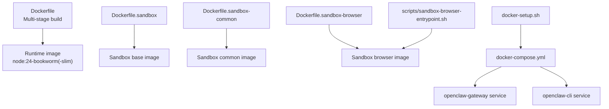
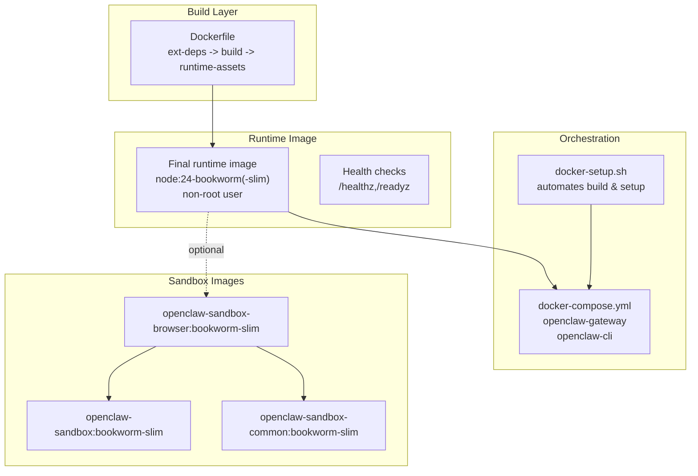
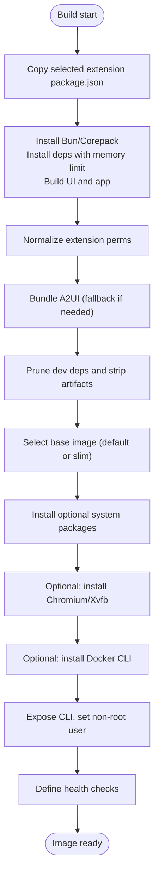
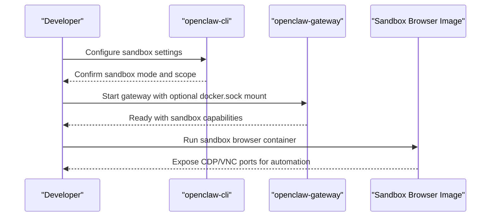
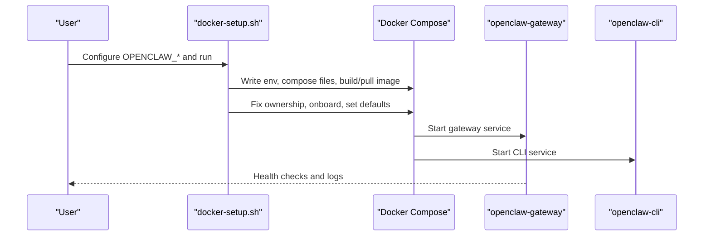
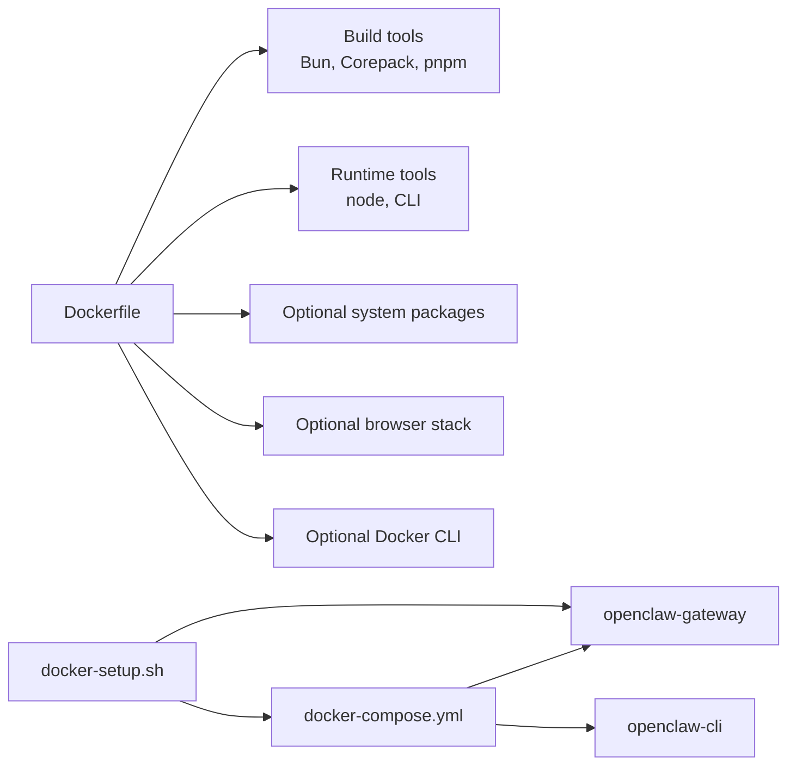

# Containerized Deployment

<cite>
**Referenced Files in This Document**
- [Dockerfile](file://Dockerfile)
- [Dockerfile.sandbox](file://Dockerfile.sandbox)
- [Dockerfile.sandbox-browser](file://Dockerfile.sandbox-browser)
- [Dockerfile.sandbox-common](file://Dockerfile.sandbox-common)
- [docker-compose.yml](file://docker-compose.yml)
- [.dockerignore](file://.dockerignore)
- [docker-setup.sh](file://docker-setup.sh)
- [scripts/sandbox-browser-entrypoint.sh](file://scripts/sandbox-browser-entrypoint.sh)
- [scripts/sandbox-setup.sh](file://scripts/sandbox-setup.sh)
- [scripts/sandbox-common-setup.sh](file://scripts/sandbox-common-setup.sh)
- [scripts/sandbox-browser-setup.sh](file://scripts/sandbox-browser-setup.sh)
- [fly.toml](file://fly.toml)
- [render.yaml](file://render.yaml)
- [openclaw.podman.env](file://openclaw.podman.env)
</cite>

## Table of Contents
1. [Introduction](#introduction)
2. [Project Structure](#project-structure)
3. [Core Components](#core-components)
4. [Architecture Overview](#architecture-overview)
5. [Detailed Component Analysis](#detailed-component-analysis)
6. [Dependency Analysis](#dependency-analysis)
7. [Performance Considerations](#performance-considerations)
8. [Troubleshooting Guide](#troubleshooting-guide)
9. [Conclusion](#conclusion)
10. [Appendices](#appendices)

## Introduction
This document explains containerized deployment strategies for OpenClaw using Docker and Docker Compose. It covers the multi-stage Docker build process, extension dependency management, runtime optimization, container configuration, environment variables, volume mounting, networking and port mapping, security hardening, health checks, and practical examples for custom builds including additional system packages and browser automation support. It also documents sandbox images and entrypoints for isolated execution and provides guidance for production platforms such as Fly.io and Render.

## Project Structure
OpenClaw’s containerization is centered around a primary Dockerfile and supporting sandbox images and scripts. The repository provides:
- A multi-stage Dockerfile for the main runtime image
- Sandbox images for isolated execution and optional browser automation
- A Docker Compose file for development and local orchestration
- A docker-setup.sh script to automate image build, environment preparation, and optional sandbox configuration
- Platform-specific deployment manifests for Fly.io and Render
- Podman environment configuration for Podman-based deployments

**Diagram sources**
- [Dockerfile:1-250](file://Dockerfile#L1-L250)
- [Dockerfile.sandbox:1-25](file://Dockerfile.sandbox#L1-L25)
- [Dockerfile.sandbox-common:1-49](file://Dockerfile.sandbox-common#L1-L49)
- [Dockerfile.sandbox-browser:1-36](file://Dockerfile.sandbox-browser#L1-L36)
- [docker-compose.yml:1-79](file://docker-compose.yml#L1-L79)
- [docker-setup.sh:1-617](file://docker-setup.sh#L1-L617)
- [scripts/sandbox-browser-entrypoint.sh:1-128](file://scripts/sandbox-browser-entrypoint.sh#L1-L128)

**Section sources**
- [Dockerfile:1-250](file://Dockerfile#L1-L250)
- [docker-compose.yml:1-79](file://docker-compose.yml#L1-L79)
- [docker-setup.sh:1-617](file://docker-setup.sh#L1-L617)

## Core Components
- Main runtime image (multi-stage build)
  - Extension dependency extraction stage
  - Build stage with Bun and pnpm
  - Runtime asset pruning and final runtime stage
  - Optional system packages, browser automation, and Docker CLI installation
  - Non-root user execution and health checks
- Sandbox images
  - Minimal sandbox base image
  - Common sandbox image with developer tools
  - Browser sandbox image with Chromium and VNC/noVNC
- Orchestration
  - Docker Compose services for gateway and CLI
  - Automated setup script to build images, manage mounts, and optionally enable sandbox
- Platform deployments
  - Fly.io configuration for VM-based hosting
  - Render configuration for container-based hosting

**Section sources**
- [Dockerfile:1-250](file://Dockerfile#L1-L250)
- [Dockerfile.sandbox:1-25](file://Dockerfile.sandbox#L1-L25)
- [Dockerfile.sandbox-common:1-49](file://Dockerfile.sandbox-common#L1-L49)
- [Dockerfile.sandbox-browser:1-36](file://Dockerfile.sandbox-browser#L1-L36)
- [docker-compose.yml:1-79](file://docker-compose.yml#L1-L79)
- [docker-setup.sh:1-617](file://docker-setup.sh#L1-L617)
- [fly.toml:1-35](file://fly.toml#L1-L35)
- [render.yaml:1-22](file://render.yaml#L1-L22)

## Architecture Overview
The containerized architecture separates concerns across build, runtime, and sandbox layers. The main runtime image runs the gateway and CLI under a non-root user, exposes health endpoints, and supports optional browser automation and Docker CLI for sandboxing. Docker Compose orchestrates gateway and CLI containers, while platform manifests define production deployments.

**Diagram sources**
- [Dockerfile:1-250](file://Dockerfile#L1-L250)
- [docker-compose.yml:1-79](file://docker-compose.yml#L1-L79)
- [docker-setup.sh:1-617](file://docker-setup.sh#L1-L617)
- [Dockerfile.sandbox:1-25](file://Dockerfile.sandbox#L1-L25)
- [Dockerfile.sandbox-common:1-49](file://Dockerfile.sandbox-common#L1-L49)
- [Dockerfile.sandbox-browser:1-36](file://Dockerfile.sandbox-browser#L1-L36)

## Detailed Component Analysis

### Multi-Stage Docker Build and Extension Dependency Management
- Extension dependency extraction
  - Copies selected extension package.json files into a temporary output directory for pnpm to resolve without copying full extension sources.
  - Build args allow specifying which extensions to include at build time.
- Build stage
  - Installs Bun, enables Corepack, installs dependencies with a memory limit to reduce OOM risks, builds UI and application bundles.
  - Normalizes permissions on extension assets to preserve safe modes.
- Runtime asset pruning
  - Strips dev artifacts and prunes production dependencies prior to final image assembly.
- Runtime stage
  - Chooses between default and slim base images.
  - Installs optional system packages, optionally installs Chromium/Xvfb for browser automation, optionally installs Docker CLI for sandboxing.
  - Exposes the CLI binary and sets a non-root user.
  - Defines health checks and default command.

**Diagram sources**
- [Dockerfile:1-250](file://Dockerfile#L1-L250)

**Section sources**
- [Dockerfile:1-250](file://Dockerfile#L1-L250)

### Container Configuration Options and Environment Variables
- Main runtime image
  - Build args:
    - OPENCLAW_EXTENSIONS: Space-separated extension directories to include at build time
    - OPENCLAW_VARIANT: default or slim base image selection
    - OPENCLAW_DOCKER_APT_PACKAGES: Additional system packages to install
    - OPENCLAW_INSTALL_BROWSER: Install Chromium/Xvfb and pre-bundle Playwright
    - OPENCLAW_INSTALL_DOCKER_CLI: Install Docker CLI for sandbox container management
  - Runtime environment:
    - NODE_ENV=production
    - Non-root user execution
    - Health checks via /healthz and /readyz
- Docker Compose
  - Environment variables for tokens, private WebSocket allowance, time zone, and provider credentials
  - Volume mounts for configuration and workspace
  - Port mappings for gateway and bridge
  - Optional Docker socket mount for sandboxing
- Platform manifests
  - Fly.io: internal port, process command, environment variables, mounted state directory
  - Render: health check path, environment variables, disk mount path

**Section sources**
- [Dockerfile:1-250](file://Dockerfile#L1-L250)
- [docker-compose.yml:1-79](file://docker-compose.yml#L1-L79)
- [fly.toml:1-35](file://fly.toml#L1-L35)
- [render.yaml:1-22](file://render.yaml#L1-L22)

### Volume Mounting Strategies
- Configuration and workspace
  - Mount host directories to /home/node/.openclaw and /home/node/.openclaw/workspace
  - docker-setup.sh ensures proper ownership for the container’s node user
- Named volumes
  - docker-setup.sh supports named volumes for the home directory and validates names
- Sandbox
  - Optional mount of /var/run/docker.sock with group_add for the docker socket GID when sandboxing is enabled

**Section sources**
- [docker-compose.yml:13-23](file://docker-compose.yml#L13-L23)
- [docker-setup.sh:449-464](file://docker-setup.sh#L449-L464)
- [docker-setup.sh:528-553](file://docker-setup.sh#L528-L553)

### Networking, Port Mapping, and Security
- Networking
  - Default gateway binds to loopback; for external access, override bind to “lan” and set authentication
  - Docker Compose maps gateway and bridge ports from host to container
- Security
  - Non-root user execution
  - Health checks use localhost endpoints
  - Optional Docker socket mount is gated behind sandbox prerequisites and explicit opt-in
  - Sandbox configuration enforces restricted policies when enabled

**Section sources**
- [Dockerfile:235-249](file://Dockerfile#L235-L249)
- [docker-compose.yml:24-38](file://docker-compose.yml#L24-L38)
- [docker-setup.sh:516-525](file://docker-setup.sh#L516-L525)
- [docker-setup.sh:528-553](file://docker-setup.sh#L528-L553)

### Custom Docker Builds with Additional Packages and Browser Automation
- Additional system packages
  - Pass OPENCLAW_DOCKER_APT_PACKAGES to install extra Debian packages in the runtime stage
- Pre-installed browser automation
  - Pass OPENCLAW_INSTALL_BROWSER to install Chromium/Xvfb and pre-bundle Playwright into the user cache
- Docker CLI for sandboxing
  - Pass OPENCLAW_INSTALL_DOCKER_CLI to install Docker CLI in the runtime image for agent sandbox containers

**Section sources**
- [Dockerfile:166-222](file://Dockerfile#L166-L222)

### Sandbox Images and Browser Automation Entrypoint
- Sandbox base image
  - Minimal Debian-based image with common tools
- Sandbox common image
  - Adds developer tools (pnpm, Bun, Homebrew) and configurable final user
- Sandbox browser image
  - Includes Chromium, XVFB, VNC, noVNC, and socat for remote browser automation
  - Entrypoint configures Xvfb, Chromium, and optional VNC/noVNC
- Scripts
  - sandbox-setup.sh, sandbox-common-setup.sh, sandbox-browser-setup.sh build the respective images
  - sandbox-browser-entrypoint.sh manages display, arguments, and forwarding

**Diagram sources**
- [docker-setup.sh:528-553](file://docker-setup.sh#L528-L553)
- [Dockerfile.sandbox-browser:1-36](file://Dockerfile.sandbox-browser#L1-L36)
- [scripts/sandbox-browser-entrypoint.sh:1-128](file://scripts/sandbox-browser-entrypoint.sh#L1-L128)

**Section sources**
- [Dockerfile.sandbox:1-25](file://Dockerfile.sandbox#L1-L25)
- [Dockerfile.sandbox-common:1-49](file://Dockerfile.sandbox-common#L1-L49)
- [Dockerfile.sandbox-browser:1-36](file://Dockerfile.sandbox-browser#L1-L36)
- [scripts/sandbox-setup.sh:1-8](file://scripts/sandbox-setup.sh#L1-L8)
- [scripts/sandbox-common-setup.sh:1-55](file://scripts/sandbox-common-setup.sh#L1-L55)
- [scripts/sandbox-browser-setup.sh:1-8](file://scripts/sandbox-browser-setup.sh#L1-L8)
- [scripts/sandbox-browser-entrypoint.sh:1-128](file://scripts/sandbox-browser-entrypoint.sh#L1-L128)

### Docker Compose Setup for Development and Production
- Development
  - docker-setup.sh automates building the image, writing environment variables, preparing mounts, running onboarding, and optionally enabling sandbox
  - Ports mapped for gateway and bridge; optional docker.sock mount for sandbox
- Production
  - Fly.io: defines Dockerfile, environment variables, internal port, process command, and mounted state directory
  - Render: defines health check path, environment variables, and disk mount

**Diagram sources**
- [docker-setup.sh:432-447](file://docker-setup.sh#L432-L447)
- [docker-setup.sh:466-483](file://docker-setup.sh#L466-L483)
- [docker-setup.sh:496-497](file://docker-setup.sh#L496-L497)
- [docker-compose.yml:1-79](file://docker-compose.yml#L1-L79)

**Section sources**
- [docker-setup.sh:1-617](file://docker-setup.sh#L1-L617)
- [docker-compose.yml:1-79](file://docker-compose.yml#L1-L79)
- [fly.toml:1-35](file://fly.toml#L1-L35)
- [render.yaml:1-22](file://render.yaml#L1-L22)

## Dependency Analysis
- Build-time dependencies
  - Bun and Corepack for build scripts and package manager activation
  - pnpm for dependency installation and pruning
- Runtime dependencies
  - Optional system packages for skills and extensions
  - Optional Chromium/Xvfb and Playwright for browser automation
  - Optional Docker CLI for sandbox container management
- Orchestration dependencies
  - Docker Compose for service coordination
  - docker-setup.sh for environment and mount validation and sandbox gating

**Diagram sources**
- [Dockerfile:1-250](file://Dockerfile#L1-L250)
- [docker-compose.yml:1-79](file://docker-compose.yml#L1-L79)
- [docker-setup.sh:1-617](file://docker-setup.sh#L1-L617)

**Section sources**
- [Dockerfile:1-250](file://Dockerfile#L1-L250)
- [docker-compose.yml:1-79](file://docker-compose.yml#L1-L79)
- [docker-setup.sh:1-617](file://docker-setup.sh#L1-L617)

## Performance Considerations
- Memory limits during dependency installation reduce OOM risks on constrained hosts
- Build cache mounts for apt and pnpm improve rebuild performance
- Using slim base images reduces image size and attack surface
- Pre-bundling browser dependencies avoids cold-start delays for automation tasks
- Health checks with appropriate intervals and timeouts prevent unnecessary restarts

[No sources needed since this section provides general guidance]

## Troubleshooting Guide
- Gateway not reachable from host
  - With default loopback binding, external access requires overriding bind to “lan” and setting authentication
- Permission denied on mounted directories
  - docker-setup.sh performs a root-initiated chown to fix ownership for the container’s node user
- Sandbox not working
  - Ensure Docker CLI is installed in the runtime image and the Docker socket is mounted with correct group membership
  - Verify prerequisites before enabling sandbox; the setup script guards against partial configuration
- Health check failures
  - Confirm the gateway is listening on the expected port and bind address
  - Review logs and environment variables for misconfiguration

**Section sources**
- [Dockerfile:235-249](file://Dockerfile#L235-L249)
- [docker-setup.sh:449-464](file://docker-setup.sh#L449-L464)
- [docker-setup.sh:516-525](file://docker-setup.sh#L516-L525)
- [docker-setup.sh:528-553](file://docker-setup.sh#L528-L553)
- [docker-compose.yml:39-50](file://docker-compose.yml#L39-L50)

## Conclusion
OpenClaw’s containerized deployment leverages a robust multi-stage Docker build, optional extension inclusion, and a hardened runtime image. Docker Compose and the docker-setup.sh script streamline development and onboarding, while platform manifests enable production deployments. Optional browser automation and sandboxing are supported through dedicated images and entrypoints, with careful attention to security and performance.

[No sources needed since this section summarizes without analyzing specific files]

## Appendices

### Environment Variables Reference
- Main runtime image
  - OPENCLAW_EXTENSIONS: Space-separated extension directories included at build time
  - OPENCLAW_VARIANT: default or slim base image
  - OPENCLAW_DOCKER_APT_PACKAGES: Additional system packages to install
  - OPENCLAW_INSTALL_BROWSER: Install Chromium/Xvfb and pre-bundle Playwright
  - OPENCLAW_INSTALL_DOCKER_CLI: Install Docker CLI for sandboxing
- Docker Compose
  - OPENCLAW_GATEWAY_TOKEN, OPENCLAW_ALLOW_INSECURE_PRIVATE_WS, CLAUDE_* keys, OPENCLAW_TZ
  - OPENCLAW_CONFIG_DIR, OPENCLAW_WORKSPACE_DIR, OPENCLAW_GATEWAY_PORT, OPENCLAW_BRIDGE_PORT
  - OPENCLAW_GATEWAY_BIND, OPENCLAW_IMAGE, OPENCLAW_EXTRA_MOUNTS, OPENCLAW_HOME_VOLUME
  - OPENCLAW_SANDBOX, OPENCLAW_DOCKER_SOCKET, DOCKER_GID
- Platform manifests
  - Fly.io: OPENCLAW_STATE_DIR, NODE_OPTIONS, OPENCLAW_PREFER_PNPM
  - Render: OPENCLAW_GATEWAY_TOKEN generation, OPENCLAW_STATE_DIR, OPENCLAW_WORKSPACE_DIR

**Section sources**
- [Dockerfile:15-222](file://Dockerfile#L15-L222)
- [docker-compose.yml:4-12](file://docker-compose.yml#L4-L12)
- [docker-compose.yml:24-38](file://docker-compose.yml#L24-L38)
- [fly.toml:10-16](file://fly.toml#L10-L16)
- [render.yaml:6-17](file://render.yaml#L6-L17)
- [openclaw.podman.env:6-25](file://openclaw.podman.env#L6-L25)

### Build Arguments Quick Reference
- OPENCLAW_EXTENSIONS="matrix diagnostics-otel"
- OPENCLAW_VARIANT=slim
- OPENCLAW_DOCKER_APT_PACKAGES="python3 wget"
- OPENCLAW_INSTALL_BROWSER=1
- OPENCLAW_INSTALL_DOCKER_CLI=1

**Section sources**
- [Dockerfile:15-222](file://Dockerfile#L15-L222)

### Sandbox Configuration Quick Reference
- Enable sandbox via OPENCLAW_SANDBOX=1
- Ensure Docker CLI is installed in the runtime image
- Mount /var/run/docker.sock with correct group membership
- Configure sandbox mode, scope, and workspace access via CLI

**Section sources**
- [docker-setup.sh:528-553](file://docker-setup.sh#L528-L553)
- [docker-setup.sh:556-573](file://docker-setup.sh#L556-L573)