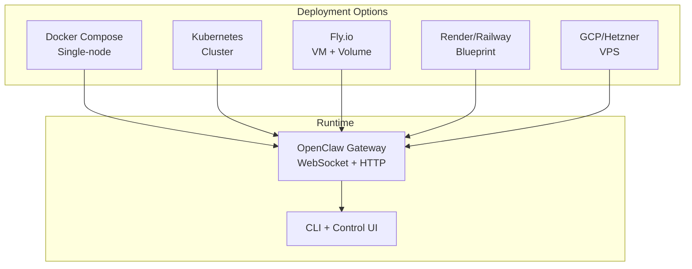
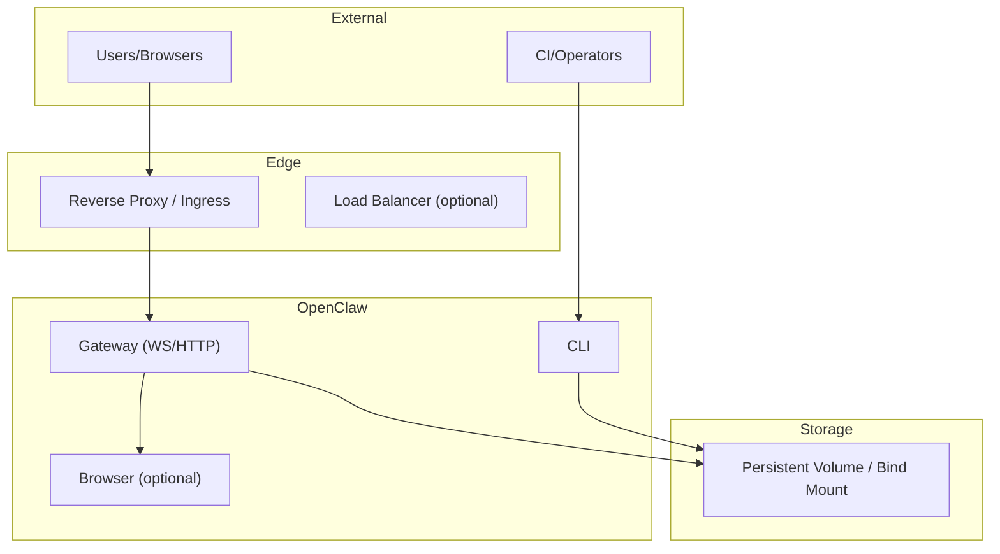
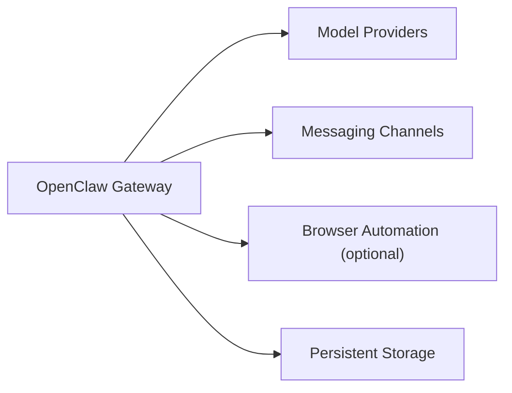

# Infrastructure Requirements

<cite>
**Referenced Files in This Document**
- [README.md](file://README.md)
- [Dockerfile](file://Dockerfile)
- [docker-compose.yml](file://docker-compose.yml)
- [fly.toml](file://fly.toml)
- [docs/install/index.md](file://docs/install/index.md)
- [docs/install/docker.md](file://docs/install/docker.md)
- [docs/install/kubernetes.md](file://docs/install/kubernetes.md)
- [docs/install/fly.md](file://docs/install/fly.md)
- [docs/install/gcp.md](file://docs/install/gcp.md)
- [docs/install/hetzner.md](file://docs/install/hetzner.md)
- [docs/install/render.mdx](file://docs/install/render.mdx)
- [docs/install/railway.mdx](file://docs/install/railway.mdx)
</cite>

## Table of Contents
1. [Introduction](#introduction)
2. [Project Structure](#project-structure)
3. [Core Components](#core-components)
4. [Architecture Overview](#architecture-overview)
5. [Detailed Component Analysis](#detailed-component-analysis)
6. [Dependency Analysis](#dependency-analysis)
7. [Performance Considerations](#performance-considerations)
8. [Troubleshooting Guide](#troubleshooting-guide)
9. [Conclusion](#conclusion)
10. [Appendices](#appendices)

## Introduction
This document consolidates infrastructure requirements and hardware specifications for deploying OpenClaw in production environments. It covers system resource sizing, storage planning, network exposure, and security controls for single-node, high-availability, and distributed scenarios. It also outlines virtual machine and cloud instance sizing recommendations, database and caching considerations, and backup storage planning aligned with OpenClaw’s runtime characteristics.

## Project Structure
OpenClaw provides multiple deployment pathways:
- Containerized deployments via Docker and Docker Compose
- Cloud-native deployments on platforms such as Fly.io, Render, Railway, and Kubernetes
- Bare-metal and VPS deployments on Debian/Ubuntu hosts

**Diagram sources**
- [docker-compose.yml:1-79](file://docker-compose.yml#L1-L79)
- [fly.toml:1-35](file://fly.toml#L1-L35)
- [docs/install/kubernetes.md:84-93](file://docs/install/kubernetes.md#L84-L93)
- [docs/install/render.mdx:29-51](file://docs/install/render.mdx#L29-L51)
- [docs/install/railway.mdx:19-33](file://docs/install/railway.mdx#L19-L33)

**Section sources**
- [README.md:1-560](file://README.md#L1-L560)
- [docs/install/index.md:14-229](file://docs/install/index.md#L14-L229)

## Core Components
- Gateway: WebSocket control plane and HTTP endpoints for health/readiness and the Control UI.
- CLI: Command-line interface for setup, configuration, and diagnostics.
- Persistent state: Configuration, credentials, agent workspaces, and logs stored on host or volume-backed storage.
- Optional browser automation: Chromium runtime can be embedded in the container image for headless tasks.

Key runtime characteristics:
- Default bind behavior is loopback-safe; external access requires explicit bind and authentication.
- Health endpoints (/healthz, /readyz) are exposed for container probes.
- State directory is configurable and should persist across restarts.

**Section sources**
- [Dockerfile:243-249](file://Dockerfile#L243-L249)
- [docker-compose.yml:39-50](file://docker-compose.yml#L39-L50)
- [docs/install/docker.md:469-495](file://docs/install/docker.md#L469-L495)

## Architecture Overview
OpenClaw’s runtime is a single-container gateway with optional CLI and browser components. For production, bind to loopback internally and expose via reverse proxies, tunnels, or platform ingress.

**Diagram sources**
- [Dockerfile:243-249](file://Dockerfile#L243-L249)
- [docker-compose.yml:24-38](file://docker-compose.yml#L24-L38)
- [docs/install/docker.md:539-544](file://docs/install/docker.md#L539-L544)

## Detailed Component Analysis

### System Requirements and Resource Sizing
- Operating systems: Debian/Ubuntu-based Linux distributions are commonly used for VPS and cloud VMs.
- Node runtime: Node 24 is recommended; Node 22 LTS is supported for compatibility.
- Memory:
  - Small VMs (e2-micro) often OOM during Docker builds; prefer e2-small minimum for initial builds.
  - For production, 2–4 GB RAM is recommended to handle concurrent sessions and model providers.
- CPU: 2 vCPUs minimum; 4 vCPUs recommended for multi-agent or heavy media workloads.
- Disk: 20–40 GB SSD for OS and container images; persistent volume for state and logs.
- Network: Outbound access to model providers and channel APIs; optional inbound webhooks require secure exposure.

**Section sources**
- [docs/install/gcp.md:115-122](file://docs/install/gcp.md#L115-L122)
- [docs/install/gcp.md:297-298](file://docs/install/gcp.md#L297-L298)
- [docs/install/hetzner.md:114-115](file://docs/install/hetzner.md#L114-L115)
- [docs/install/index.md:14-22](file://docs/install/index.md#L14-L22)

### Virtual Machines and Cloud Instances
- Fly.io:
  - Recommended: shared-cpu-2x with 2048 MB RAM.
  - Internal port 3000; bind to LAN for public exposure.
  - Persistent volume mounted at /data for state.
- Render:
  - Starter plan recommended for production; Free plan lacks persistent disk.
  - Health check path /health; disk mounted at /data.
- Railway:
  - HTTP Proxy on port 8080; attach a Volume at /data.
- GCP Compute Engine:
  - e2-small minimum; e2-medium for reliability.
  - Debian 12 recommended.
- Hetzner:
  - Debian/Ubuntu VPS; ensure adequate RAM to avoid OOM during builds.

**Section sources**
- [docs/install/fly.md:74-81](file://docs/install/fly.md#L74-L81)
- [docs/install/fly.md:263-276](file://docs/install/fly.md#L263-L276)
- [docs/install/render.mdx:63-72](file://docs/install/render.mdx#L63-L72)
- [docs/install/render.mdx:29-51](file://docs/install/render.mdx#L29-L51)
- [docs/install/railway.mdx:42-64](file://docs/install/railway.mdx#L42-L64)
- [docs/install/gcp.md:115-132](file://docs/install/gcp.md#L115-L132)
- [docs/install/hetzner.md:75-87](file://docs/install/hetzner.md#L75-L87)

### Bare Metal and VPS
- Use Docker Compose with bind mounts for ~/.openclaw and ~/.openclaw/workspace.
- Persist state on the host filesystem or a dedicated volume.
- Expose via SSH tunnel for local access or reverse proxy for remote access.
- Harden the host with firewall rules and least-privilege accounts.

**Section sources**
- [docker-compose.yml:13-16](file://docker-compose.yml#L13-L16)
- [docker-compose.yml:264-265](file://docker-compose.yml#L264-L265)
- [docs/install/gcp.md:284-291](file://docs/install/gcp.md#L284-L291)
- [docs/install/hetzner.md:205-213](file://docs/install/hetzner.md#L205-L213)

### Container Images and Sandboxing
- Default runtime image: node:24-bookworm; slim variant available.
- Optional: bake system packages and Playwright browsers into the image to reduce cold start costs.
- Agent sandboxing uses Docker containers for non-main sessions; requires Docker CLI in the image or host for sandbox bootstrap.

**Section sources**
- [Dockerfile:103-111](file://Dockerfile#L103-L111)
- [Dockerfile:167-190](file://Dockerfile#L167-L190)
- [Dockerfile:192-222](file://Dockerfile#L192-L222)
- [docs/install/docker.md:350-391](file://docs/install/docker.md#L350-L391)
- [docs/install/docker.md:545-664](file://docs/install/docker.md#L545-L664)

### Storage Requirements and Persistence
- Persistent directories:
  - ~/.openclaw (configuration, credentials, state)
  - ~/.openclaw/workspace (skills, agent workspaces)
- Docker Compose: bind mounts for both paths.
- Kubernetes: PersistentVolumeClaim for state and config.
- Fly.io: Volume mounted at /data; set OPENCLAW_STATE_DIR=/data.
- Render/Railway: Disk mounted at /data; set OPENCLAW_STATE_DIR=/data.

Hotspots to monitor:
- media/ and sessions JSONL logs
- cron/runs/*.jsonl
- Rolling file logs under /tmp/openclaw/

**Section sources**
- [docker-compose.yml:13-16](file://docker-compose.yml#L13-L16)
- [docs/install/kubernetes.md:90-92](file://docs/install/kubernetes.md#L90-L92)
- [docs/install/fly.md:78-81](file://docs/install/fly.md#L78-L81)
- [docs/install/render.mdx:47-51](file://docs/install/render.mdx#L47-L51)
- [docs/install/docker.md:539-544](file://docs/install/docker.md#L539-L544)

### Network Exposure and Security
- Loopback-first bind by default; switch to LAN for external access and enable authentication.
- Health endpoints: /healthz (liveness), /readyz (readiness).
- Reverse proxy or platform ingress should terminate TLS and forward to the Gateway.
- For private deployments (e.g., Fly private IP), use SSH proxy or VPN for access.
- Firewall: Allow only necessary inbound ports (reverse proxy) and restrict outbound to provider domains.

**Section sources**
- [Dockerfile:243-249](file://Dockerfile#L243-L249)
- [docs/install/docker.md:508-532](file://docs/install/docker.md#L508-L532)
- [docs/install/fly.md:359-400](file://docs/install/fly.md#L359-L400)

### Load Balancing and High Availability
- Kubernetes: Single pod by default; scale horizontally by adding replicas and sticky sessions or external state.
- Fly.io: Multiple machines with auto-start/stop; ensure persistent storage and token-based auth.
- Render/Railway: Horizontal scaling supported; ensure state is on persistent disk.
- GCP/Hetzner: Use platform load balancers with health checks pointing to /healthz.

**Section sources**
- [docs/install/kubernetes.md:170-177](file://docs/install/kubernetes.md#L170-L177)
- [fly.toml:23-26](file://fly.toml#L23-L26)
- [docs/install/render.mdx:117-124](file://docs/install/render.mdx#L117-L124)
- [docs/install/railway.mdx:117-124](file://docs/install/railway.mdx#L117-L124)

### Database and Caching Strategies
- OpenClaw stores state in JSON files under ~/.openclaw and logs under /tmp/openclaw. There is no embedded database dependency.
- For high-throughput or multi-instance deployments, externalize logs to structured sinks and consider:
  - Centralized log aggregation (e.g., syslog-ng, Fluent Bit)
  - Persistent volumes with snapshots for backups
- Caching: No built-in cache layer; rely on model provider rate limits and local disk caching for browser assets.

**Section sources**
- [docs/install/docker.md:539-544](file://docs/install/docker.md#L539-L544)
- [docs/install/kubernetes.md:90-92](file://docs/install/kubernetes.md#L90-L92)

### Backup Storage Planning
- Export configuration and workspace via the setup wizard’s export endpoint (Render/Railway).
- For Fly.io, GCP, and Hetzner, back up the persistent volume or bind-mounted directories regularly.
- Version control non-sensitive configuration fragments; keep secrets out of source control.

**Section sources**
- [docs/install/render.mdx:126-135](file://docs/install/render.mdx#L126-L135)
- [docs/install/railway.mdx:93-100](file://docs/install/railway.mdx#L93-L100)
- [docs/install/fly.md:328-341](file://docs/install/fly.md#L328-L341)
- [docs/install/gcp.md:401-406](file://docs/install/gcp.md#L401-L406)

## Dependency Analysis
OpenClaw’s runtime has minimal external dependencies. The primary requirement is a container runtime or VM with Docker/Compose support.

**Diagram sources**
- [Dockerfile:167-190](file://Dockerfile#L167-L190)
- [docs/install/docker.md:438-461](file://docs/install/docker.md#L438-L461)

**Section sources**
- [docs/install/docker.md:26-34](file://docs/install/docker.md#L26-L34)
- [docs/install/index.md:14-22](file://docs/install/index.md#L14-L22)

## Performance Considerations
- Memory pressure: Increase RAM for builds and production to avoid OOM (exit 137).
- Concurrency: Tune agents.maxConcurrent and model provider rate limits to balance throughput and latency.
- Media workloads: Allocate extra CPU and disk IOPS for image/audio/video processing.
- Cold starts: Bake system packages and browser assets into the container image to reduce startup latency.

[No sources needed since this section provides general guidance]

## Troubleshooting Guide
Common issues and resolutions:
- Gateway not reachable externally: Ensure bind is LAN and port matches internal_port/process command.
- Memory OOM during builds or runtime: Upgrade VM size; adjust NODE_OPTIONS for heap size.
- Gateway lock file conflicts: Remove /data/gateway.*.lock and restart.
- State not persisting: Confirm OPENCLAW_STATE_DIR and volume mount paths.

**Section sources**
- [docs/install/fly.md:247-258](file://docs/install/fly.md#L247-L258)
- [docs/install/fly.md:259-276](file://docs/install/fly.md#L259-L276)
- [docs/install/fly.md:278-291](file://docs/install/fly.md#L278-L291)
- [docs/install/fly.md:322-327](file://docs/install/fly.md#L322-L327)

## Conclusion
OpenClaw’s production deployment is straightforward: a single container with persistent state and optional browser automation. For most workloads, 2–4 GB RAM and 2 vCPUs suffice. Use platform-specific deployment guides to provision VMs, volumes, and ingress, and apply security hardening for external exposure. Monitor logs and state growth, and back up persistent directories regularly.

[No sources needed since this section summarizes without analyzing specific files]

## Appendices

### Reference: Gateway Bind Modes and Ports
- Default bind: loopback (127.0.0.1)
- LAN bind: 0.0.0.0 for external access
- Ports:
  - Gateway: 18789 (WebSocket + HTTP)
  - Bridge (optional): 18790
  - Platform examples:
    - Fly: internal_port 3000
    - Render/Railway: PORT 8080

**Section sources**
- [docker-compose.yml:24-27](file://docker-compose.yml#L24-L27)
- [fly.toml:20-26](file://fly.toml#L20-L26)
- [docs/install/render.mdx:36-44](file://docs/install/render.mdx#L36-L44)
- [docs/install/railway.mdx:48-64](file://docs/install/railway.mdx#L48-L64)