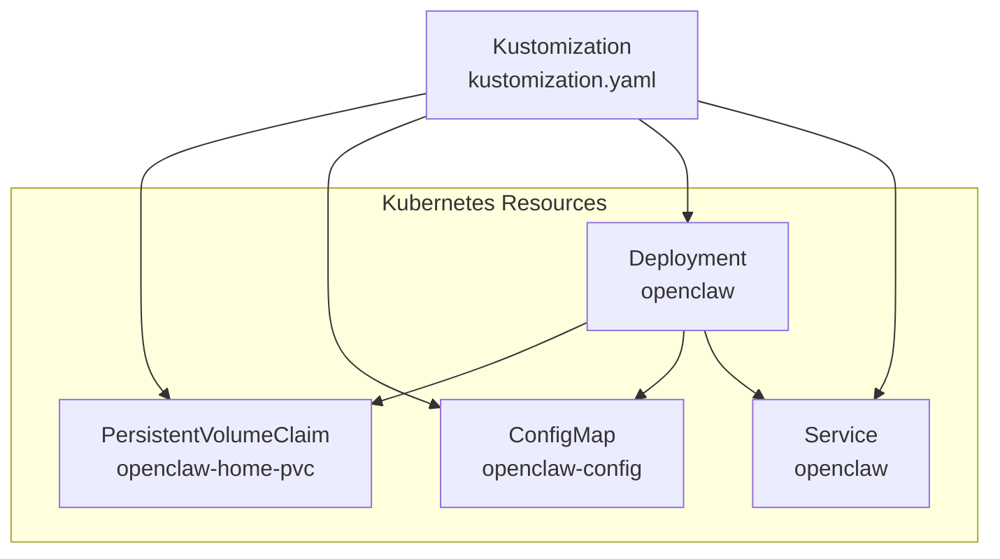
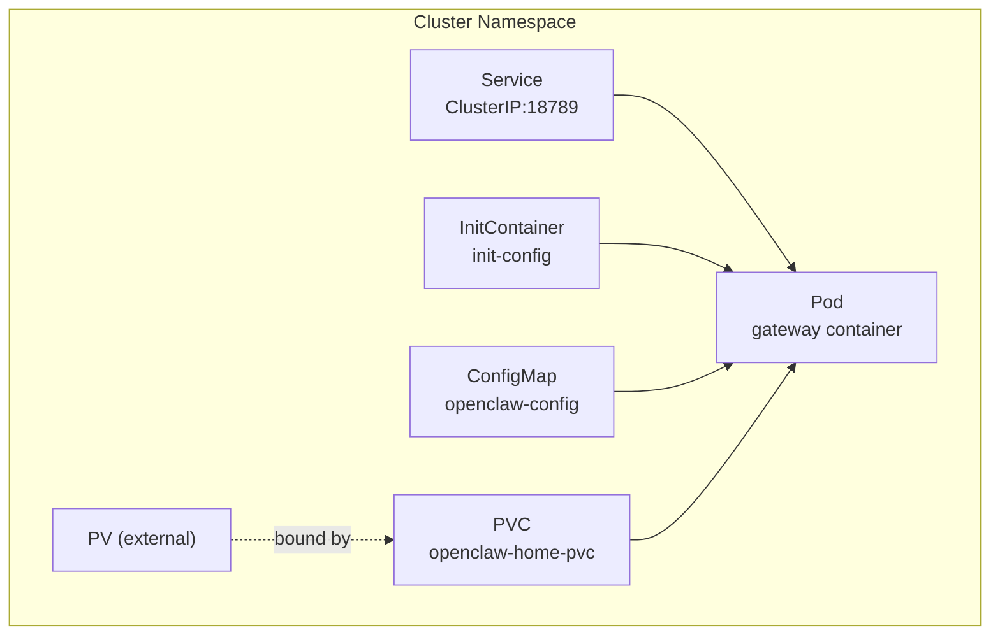
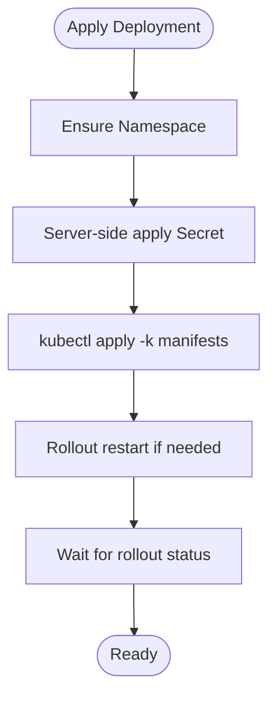
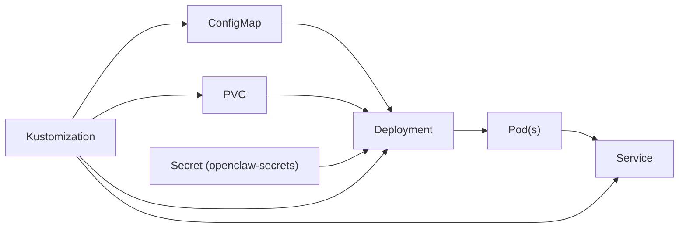

# Kubernetes Deployment

<cite>
**Referenced Files in This Document**
- [deployment.yaml](file://scripts/k8s/manifests/deployment.yaml)
- [service.yaml](file://scripts/k8s/manifests/service.yaml)
- [configmap.yaml](file://scripts/k8s/manifests/configmap.yaml)
- [pvc.yaml](file://scripts/k8s/manifests/pvc.yaml)
- [kustomization.yaml](file://scripts/k8s/manifests/kustomization.yaml)
- [create-kind.sh](file://scripts/k8s/create-kind.sh)
- [deploy.sh](file://scripts/k8s/deploy.sh)
- [render.yaml](file://render.yaml)
- [docker-compose.yml](file://docker-compose.yml)
</cite>

## Table of Contents
1. [Introduction](#introduction)
2. [Project Structure](#project-structure)
3. [Core Components](#core-components)
4. [Architecture Overview](#architecture-overview)
5. [Detailed Component Analysis](#detailed-component-analysis)
6. [Dependency Analysis](#dependency-analysis)
7. [Performance Considerations](#performance-considerations)
8. [Troubleshooting Guide](#troubleshooting-guide)
9. [Conclusion](#conclusion)
10. [Appendices](#appendices)

## Introduction
This document describes Kubernetes deployment strategies for OpenClaw, focusing on container orchestration using the provided Kustomize manifests and deployment scripts. It explains how pods, services, and persistent volumes are configured, how to expose the gateway via ClusterIP, and how to manage secrets and configuration. It also outlines upgrade strategies (rolling updates), scaling approaches, and operational best practices grounded in the repository’s manifests and scripts.

## Project Structure
The Kubernetes deployment is organized under scripts/k8s with Kustomize-managed resources:
- PersistentVolumeClaim for data and configuration persistence
- ConfigMap for runtime configuration
- Deployment for the gateway container with probes and security hardening
- Service for internal access to the gateway
- Kustomization to compose these resources

**Diagram sources**
- [kustomization.yaml:1-8](file://scripts/k8s/manifests/kustomization.yaml#L1-L8)
- [pvc.yaml:1-13](file://scripts/k8s/manifests/pvc.yaml#L1-L13)
- [configmap.yaml:1-39](file://scripts/k8s/manifests/configmap.yaml#L1-L39)
- [deployment.yaml:1-147](file://scripts/k8s/manifests/deployment.yaml#L1-L147)
- [service.yaml:1-16](file://scripts/k8s/manifests/service.yaml#L1-L16)

**Section sources**
- [kustomization.yaml:1-8](file://scripts/k8s/manifests/kustomization.yaml#L1-L8)
- [pvc.yaml:1-13](file://scripts/k8s/manifests/pvc.yaml#L1-L13)
- [configmap.yaml:1-39](file://scripts/k8s/manifests/configmap.yaml#L1-L39)
- [deployment.yaml:1-147](file://scripts/k8s/manifests/deployment.yaml#L1-L147)
- [service.yaml:1-16](file://scripts/k8s/manifests/service.yaml#L1-L16)

## Core Components
- Deployment: Defines the gateway container, probes, resource requests/limits, securityContext, and volume mounts. Includes an initContainer to stage configuration into the persistent home directory.
- Service: Exposes the gateway internally within the cluster on port 18789.
- ConfigMap: Provides openclaw.json and AGENTS.md to the pod via mounted volume.
- PersistentVolumeClaim: Requests 10 GiB storage with ReadWriteOnce access mode for the home directory.
- Kustomization: Composes the above resources.

Operational scripts:
- create-kind.sh: Bootstraps a local Kind cluster and prepares environment for deployment.
- deploy.sh: Manages namespace creation, server-side secret application, and Kustomize-based deployment with rollout status checks.

**Section sources**
- [deployment.yaml:1-147](file://scripts/k8s/manifests/deployment.yaml#L1-L147)
- [service.yaml:1-16](file://scripts/k8s/manifests/service.yaml#L1-L16)
- [configmap.yaml:1-39](file://scripts/k8s/manifests/configmap.yaml#L1-L39)
- [pvc.yaml:1-13](file://scripts/k8s/manifests/pvc.yaml#L1-L13)
- [kustomization.yaml:1-8](file://scripts/k8s/manifests/kustomization.yaml#L1-L8)
- [create-kind.sh:1-210](file://scripts/k8s/create-kind.sh#L1-L210)
- [deploy.sh:1-232](file://scripts/k8s/deploy.sh#L1-L232)

## Architecture Overview
The gateway runs as a single-replica Deployment by default. It reads configuration from a ConfigMap and stores data in a PersistentVolumeClaim mounted under /home/node/.openclaw. The Service exposes the gateway internally for other cluster workloads.

**Diagram sources**
- [deployment.yaml:1-147](file://scripts/k8s/manifests/deployment.yaml#L1-L147)
- [service.yaml:1-16](file://scripts/k8s/manifests/service.yaml#L1-L16)
- [configmap.yaml:1-39](file://scripts/k8s/manifests/configmap.yaml#L1-L39)
- [pvc.yaml:1-13](file://scripts/k8s/manifests/pvc.yaml#L1-L13)

## Detailed Component Analysis

### Deployment: Gateway Pod Specification
- Replicas: 1 (default)
- Strategy: Recreate (explicitly set)
- SecurityContext: fsGroup set; seccomp default profile applied
- InitContainer: Copies configuration from /config to /home/node/.openclaw and ensures workspace directory exists
- Container: gateway with:
  - Ports: gateway TCP 18789
  - Environment: HOME, OPENCLAW_CONFIG_DIR, NODE_ENV, and provider API keys from Secret
  - Probes: HTTP GET against /healthz and /readyz endpoints
  - Resources: Requests and Limits defined
  - SecurityContext: Non-root, drop ALL capabilities, disallow privilege escalation, read-only root filesystem
- Volumes: PVC for home, ConfigMap for config, emptyDir for /tmp

**Diagram sources**
- [deploy.sh:213-229](file://scripts/k8s/deploy.sh#L213-L229)

**Section sources**
- [deployment.yaml:1-147](file://scripts/k8s/manifests/deployment.yaml#L1-L147)
- [deploy.sh:85-159](file://scripts/k8s/deploy.sh#L85-L159)

### Service: Internal Access
- Type: ClusterIP
- Selector: app=openclaw
- Port: 18789 -> targetPort 18789

For external access, the repository’s scripts demonstrate port-forwarding to localhost. For production ingress, add an Ingress resource and controller per your platform’s guidelines.

**Section sources**
- [service.yaml:1-16](file://scripts/k8s/manifests/service.yaml#L1-L16)
- [deploy.sh:221-223](file://scripts/k8s/deploy.sh#L221-L223)

### ConfigMap: Configuration Injection
- Keys: openclaw.json and AGENTS.md
- Mounted read-only to /config inside the initContainer and gateway container

**Section sources**
- [configmap.yaml:1-39](file://scripts/k8s/manifests/configmap.yaml#L1-L39)
- [deployment.yaml:24-49](file://scripts/k8s/manifests/deployment.yaml#L24-L49)

### PersistentVolumeClaim: Storage for Data and Config
- AccessMode: ReadWriteOnce
- StorageRequest: 10 Gi
- Mounted to /home/node/.openclaw in the gateway container

**Section sources**
- [pvc.yaml:1-13](file://scripts/k8s/manifests/pvc.yaml#L1-L13)
- [deployment.yaml:139-146](file://scripts/k8s/manifests/deployment.yaml#L139-L146)

### Kustomization: Resource Composition
- Composes PVC, ConfigMap, Deployment, and Service

**Section sources**
- [kustomization.yaml:1-8](file://scripts/k8s/manifests/kustomization.yaml#L1-L8)

### Local Kind Cluster Bootstrap
- create-kind.sh provisions a Kind cluster with labeled control plane node and provides guidance for port-forwarding and deploying.

**Section sources**
- [create-kind.sh:1-210](file://scripts/k8s/create-kind.sh#L1-L210)

## Dependency Analysis
- Deployment depends on:
  - ConfigMap for configuration
  - PVC for persistent storage
  - Secret for API credentials
- Service selects Pods by label app=openclaw
- Kustomization composes all resources

**Diagram sources**
- [kustomization.yaml:1-8](file://scripts/k8s/manifests/kustomization.yaml#L1-L8)
- [deployment.yaml:1-147](file://scripts/k8s/manifests/deployment.yaml#L1-L147)
- [service.yaml:1-16](file://scripts/k8s/manifests/service.yaml#L1-L16)
- [pvc.yaml:1-13](file://scripts/k8s/manifests/pvc.yaml#L1-L13)
- [configmap.yaml:1-39](file://scripts/k8s/manifests/configmap.yaml#L1-L39)

**Section sources**
- [kustomization.yaml:1-8](file://scripts/k8s/manifests/kustomization.yaml#L1-L8)
- [deployment.yaml:1-147](file://scripts/k8s/manifests/deployment.yaml#L1-L147)
- [service.yaml:1-16](file://scripts/k8s/manifests/service.yaml#L1-L16)
- [pvc.yaml:1-13](file://scripts/k8s/manifests/pvc.yaml#L1-L13)
- [configmap.yaml:1-39](file://scripts/k8s/manifests/configmap.yaml#L1-L39)

## Performance Considerations
- Current Deployment runs a single replica with a Recreate strategy. For higher availability and rolling upgrades, increase replicas and switch strategy to RollingUpdate.
- Resource requests and limits are defined; monitor CPU and memory saturation and adjust as needed.
- The initContainer performs lightweight file copying; keep configuration minimal to reduce startup overhead.
- Consider adding HorizontalPodAutoscaler targeting CPU or custom metrics to scale based on load.

[No sources needed since this section provides general guidance]

## Troubleshooting Guide
- Cannot connect to cluster or missing kubectl/openssl:
  - Ensure cluster access and required tools are installed before running deploy.sh.
- Secret not found and no API keys in environment:
  - Export at least one provider API key or create the Secret first using the script’s --create-secret mode.
- Rollout stuck:
  - Use rollout status to inspect; review pod logs and events for probe failures or startup errors.
- Port-forwarding:
  - Use the documented port-forward command to reach the gateway locally.

**Section sources**
- [deploy.sh:21-25](file://scripts/k8s/deploy.sh#L21-L25)
- [deploy.sh:188-208](file://scripts/k8s/deploy.sh#L188-L208)
- [deploy.sh:213-229](file://scripts/k8s/deploy.sh#L213-L229)

## Conclusion
The repository provides a solid foundation for deploying OpenClaw on Kubernetes using Kustomize and simple Bash scripts. The manifests define a secure, persistent gateway with internal service exposure. Extending to production-ready practices involves enabling rolling updates, adding ingress, autoscaling, and integrating monitoring/logging/security controls as outlined below.

[No sources needed since this section summarizes without analyzing specific files]

## Appendices

### A. Multi-Platform Access with Ingress
- Add an Ingress resource and a compatible controller (e.g., NGINX, Traefik, contour) according to your platform.
- Reference the Service’s port 18789 for backend traffic.
- Configure TLS termination and authentication as appropriate.

[No sources needed since this section provides general guidance]

### B. Persistent Volume Claims
- The PVC requests 10 Gi with ReadWriteOnce. Ensure your storage class supports this mode and desired durability.
- Mount path is /home/node/.openclaw for configuration and workspace data.

**Section sources**
- [pvc.yaml:1-13](file://scripts/k8s/manifests/pvc.yaml#L1-L13)
- [deployment.yaml:139-146](file://scripts/k8s/manifests/deployment.yaml#L139-L146)

### C. Horizontal Pod Autoscaling and Resource Limits
- Enable autoscaling by creating an HPA targeting CPU utilization or custom metrics.
- Current container defines requests and limits; tune them based on observed usage.

[No sources needed since this section provides general guidance]

### D. Node Affinity and Tolerations
- To constrain scheduling to specific nodes or taints, add affinity/tolerations to the Deployment spec.

[No sources needed since this section provides general guidance]

### E. Rolling Updates and Rollbacks
- Switch Deployment strategy to RollingUpdate and set maxUnavailable/maxSurge as needed.
- Use kubectl rollout history and undo to roll back failed updates.

[No sources needed since this section provides general guidance]

### F. Monitoring with Prometheus
- Scrape the gateway’s HTTP endpoints using a Prometheus Operator ServiceMonitor or equivalent.
- Define metrics endpoints and scrape configs aligned with your monitoring stack.

[No sources needed since this section provides general guidance]

### G. Logging with Fluentd/Elasticsearch
- Ship container stdout/stderr to Elasticsearch via Fluentd or similar collectors.
- Ensure log volume retention and indexing policies align with compliance.

[No sources needed since this section provides general guidance]

### H. Cluster Security Best Practices
- Restrict RBAC for the Deployment’s ServiceAccount.
- Enforce PodSecurity Standards (e.g., baseline/restricted).
- Use sealed secrets or external secret managers for sensitive data.
- NetworkPolicies to limit inbound/outbound traffic to the gateway.

[No sources needed since this section provides general guidance]

### I. Example Commands from Scripts
- Create a local Kind cluster and deploy:
  - ./scripts/k8s/create-kind.sh
  - export <PROVIDER>_API_KEY="..." && ./scripts/k8s/deploy.sh
- Port-forward to access the gateway locally:
  - kubectl port-forward svc/openclaw 18789:18789 -n openclaw

**Section sources**
- [create-kind.sh:208-209](file://scripts/k8s/create-kind.sh#L208-L209)
- [deploy.sh:221-223](file://scripts/k8s/deploy.sh#L221-L223)

### J. Related Platform Configuration
- render.yaml: Platform-specific deployment configuration for Render.
- docker-compose.yml: Alternative container orchestration outside Kubernetes.

**Section sources**
- [render.yaml](file://render.yaml)
- [docker-compose.yml](file://docker-compose.yml)