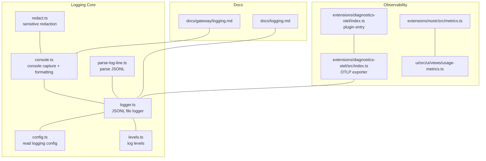
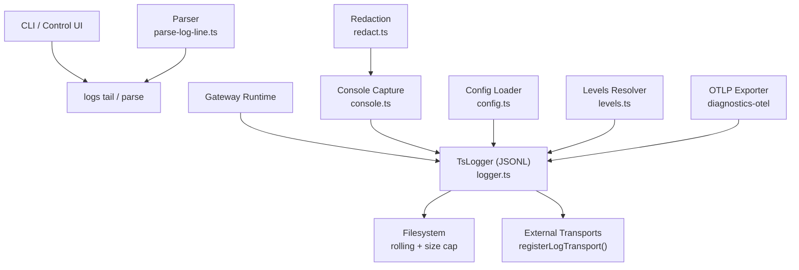
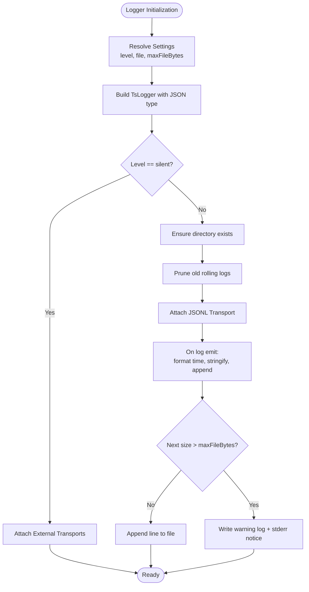
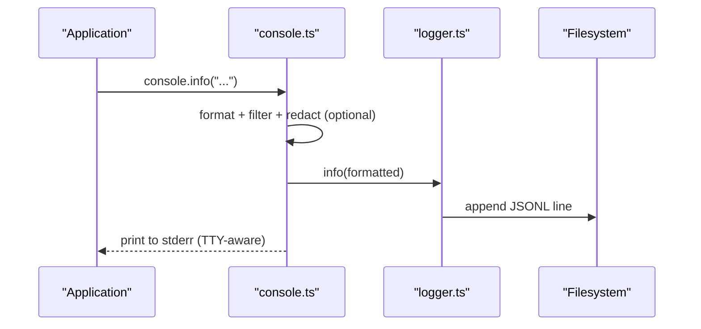
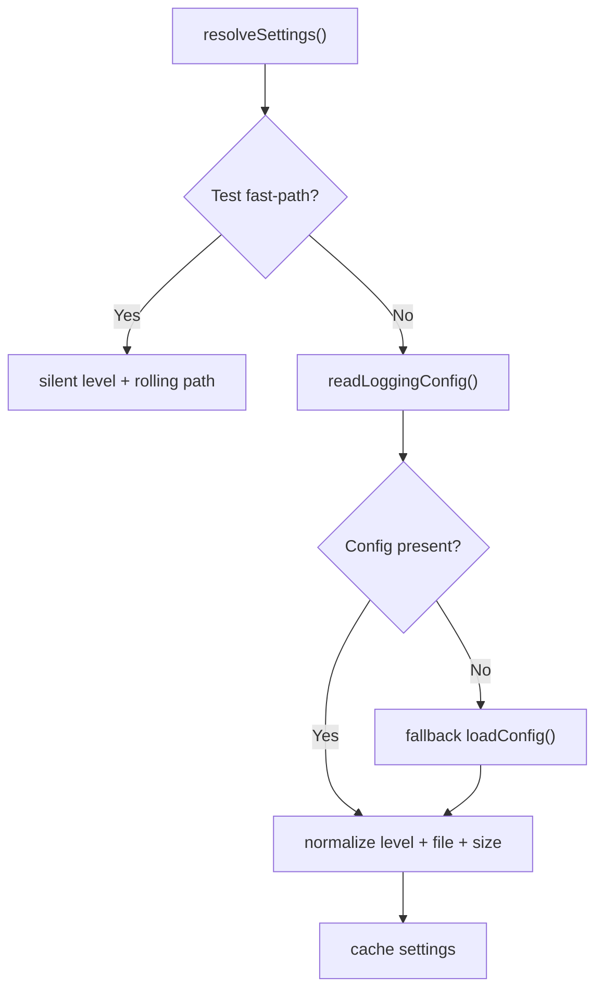
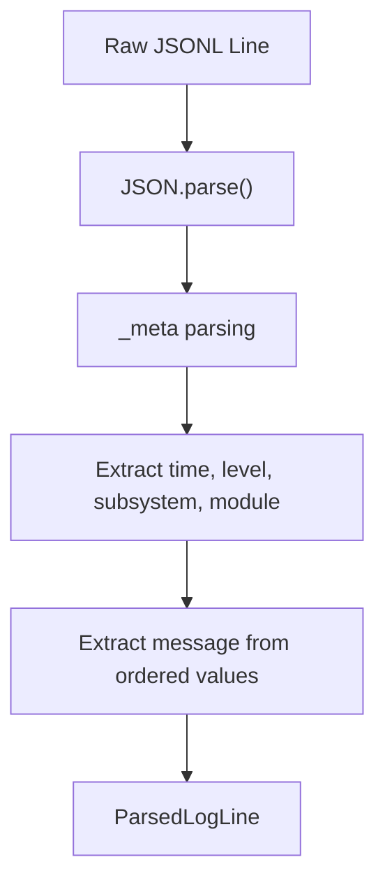
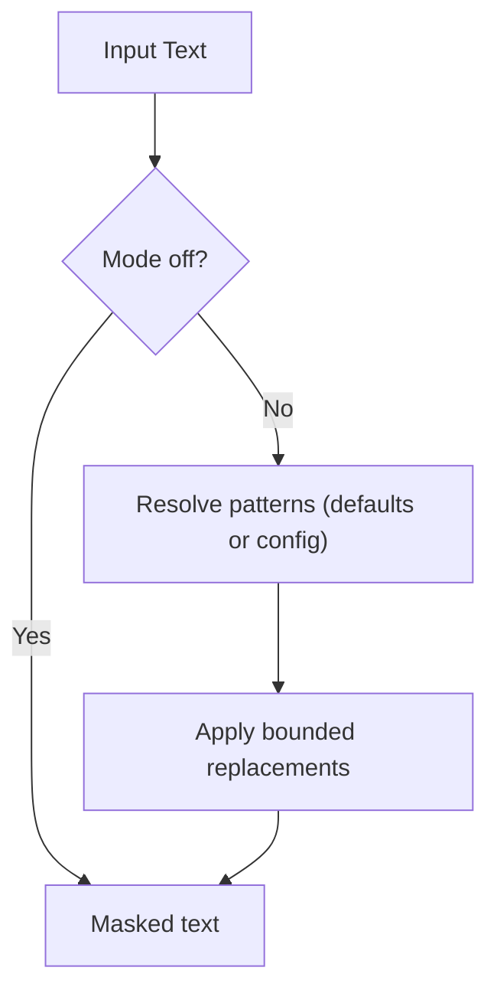
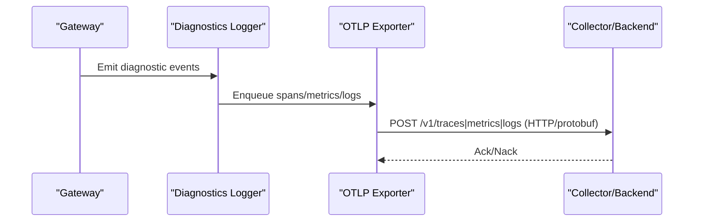
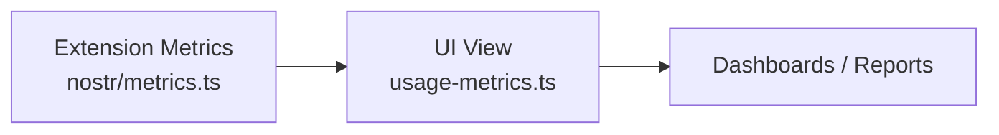
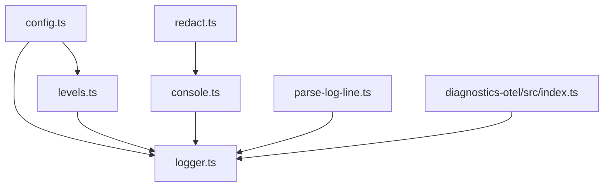

# Monitoring and Logging

<cite>
**Referenced Files in This Document**
- [src/logging/logger.ts](file://src/logging/logger.ts)
- [src/logging/config.ts](file://src/logging/config.ts)
- [src/logging/levels.ts](file://src/logging/levels.ts)
- [src/logging/console.ts](file://src/logging/console.ts)
- [src/logging/parse-log-line.ts](file://src/logging/parse-log-line.ts)
- [src/logging/redact.ts](file://src/logging/redact.ts)
- [docs/logging.md](file://docs/logging.md)
- [docs/gateway/logging.md](file://docs/gateway/logging.md)
- [extensions/diagnostics-otel/index.ts](file://extensions/diagnostics-otel/index.ts)
- [extensions/diagnostics-otel/src/index.ts](file://extensions/diagnostics-otel/src/index.ts)
- [extensions/nostr/src/metrics.ts](file://extensions/nostr/src/metrics.ts)
- [ui/src/ui/views/usage-metrics.ts](file://ui/src/ui/views/usage-metrics.ts)
</cite>

## Table of Contents
1. [Introduction](#introduction)
2. [Project Structure](#project-structure)
3. [Core Components](#core-components)
4. [Architecture Overview](#architecture-overview)
5. [Detailed Component Analysis](#detailed-component-analysis)
6. [Dependency Analysis](#dependency-analysis)
7. [Performance Considerations](#performance-considerations)
8. [Troubleshooting Guide](#troubleshooting-guide)
9. [Conclusion](#conclusion)
10. [Appendices](#appendices)

## Introduction
This document describes the monitoring and logging infrastructure for OpenClaw production observability. It covers centralized logging configurations, log aggregation pipelines, structured logging formats, metrics collection, performance monitoring, alerting strategies, system monitoring with Prometheus, application performance monitoring, custom metric tracking, log parsing and correlation techniques, troubleshooting workflows, dashboard configurations, report generation, operational analytics, and log retention policies with compliance and privacy considerations.

## Project Structure
OpenClaw’s logging and observability span:
- Core logging engine and configuration resolution
- Console capture and formatting
- Structured JSONL file logging with redaction
- CLI and Control UI log tailing
- OpenTelemetry diagnostics export (OTLP/HTTP)
- Extension-specific metrics and dashboards

**Diagram sources**
- [src/logging/logger.ts:1-348](file://src/logging/logger.ts#L1-L348)
- [src/logging/console.ts:1-333](file://src/logging/console.ts#L1-L333)
- [src/logging/config.ts:1-25](file://src/logging/config.ts#L1-L25)
- [src/logging/levels.ts:1-38](file://src/logging/levels.ts#L1-L38)
- [src/logging/parse-log-line.ts:1-64](file://src/logging/parse-log-line.ts#L1-L64)
- [src/logging/redact.ts:1-152](file://src/logging/redact.ts#L1-L152)
- [docs/logging.md:1-353](file://docs/logging.md#L1-L353)
- [docs/gateway/logging.md:1-114](file://docs/gateway/logging.md#L1-L114)
- [extensions/diagnostics-otel/index.ts](file://extensions/diagnostics-otel/index.ts)
- [extensions/diagnostics-otel/src/index.ts](file://extensions/diagnostics-otel/src/index.ts)
- [extensions/nostr/src/metrics.ts](file://extensions/nostr/src/metrics.ts)
- [ui/src/ui/views/usage-metrics.ts](file://ui/src/ui/views/usage-metrics.ts)

**Section sources**
- [src/logging/logger.ts:1-348](file://src/logging/logger.ts#L1-L348)
- [src/logging/console.ts:1-333](file://src/logging/console.ts#L1-L333)
- [src/logging/config.ts:1-25](file://src/logging/config.ts#L1-L25)
- [src/logging/levels.ts:1-38](file://src/logging/levels.ts#L1-L38)
- [src/logging/parse-log-line.ts:1-64](file://src/logging/parse-log-line.ts#L1-L64)
- [src/logging/redact.ts:1-152](file://src/logging/redact.ts#L1-L152)
- [docs/logging.md:1-353](file://docs/logging.md#L1-L353)
- [docs/gateway/logging.md:1-114](file://docs/gateway/logging.md#L1-L114)

## Core Components
- Structured JSONL file logger with rolling daily files and size caps
- Console capture and formatting with TTY-aware styles
- Config-driven log levels and console styles
- Sensitive data redaction for console output
- CLI and Control UI log tailing
- OpenTelemetry diagnostics export via OTLP/HTTP
- Extension-specific metrics and UI views

Key implementation references:
- File logging and rolling: [src/logging/logger.ts:15-348](file://src/logging/logger.ts#L15-L348)
- Console capture and formatting: [src/logging/console.ts:1-333](file://src/logging/console.ts#L1-L333)
- Config loading: [src/logging/config.ts:1-25](file://src/logging/config.ts#L1-L25)
- Log levels: [src/logging/levels.ts:1-38](file://src/logging/levels.ts#L1-L38)
- Log parsing: [src/logging/parse-log-line.ts:1-64](file://src/logging/parse-log-line.ts#L1-L64)
- Redaction: [src/logging/redact.ts:1-152](file://src/logging/redact.ts#L1-L152)
- Docs: [docs/logging.md:1-353](file://docs/logging.md#L1-L353), [docs/gateway/logging.md:1-114](file://docs/gateway/logging.md#L1-L114)

**Section sources**
- [src/logging/logger.ts:1-348](file://src/logging/logger.ts#L1-L348)
- [src/logging/console.ts:1-333](file://src/logging/console.ts#L1-L333)
- [src/logging/config.ts:1-25](file://src/logging/config.ts#L1-L25)
- [src/logging/levels.ts:1-38](file://src/logging/levels.ts#L1-L38)
- [src/logging/parse-log-line.ts:1-64](file://src/logging/parse-log-line.ts#L1-L64)
- [src/logging/redact.ts:1-152](file://src/logging/redact.ts#L1-L152)
- [docs/logging.md:1-353](file://docs/logging.md#L1-L353)
- [docs/gateway/logging.md:1-114](file://docs/gateway/logging.md#L1-L114)

## Architecture Overview
OpenClaw’s logging architecture centers on a JSONL file logger with a configurable rolling policy and size cap. Console output is captured and routed to stderr to keep stdout clean, while still ensuring every console call is persisted to file logs. Users can tail logs via CLI or Control UI. Diagnostics events are exported to OpenTelemetry collectors via OTLP/HTTP when enabled.

**Diagram sources**
- [src/logging/logger.ts:1-348](file://src/logging/logger.ts#L1-L348)
- [src/logging/console.ts:1-333](file://src/logging/console.ts#L1-L333)
- [src/logging/config.ts:1-25](file://src/logging/config.ts#L1-L25)
- [src/logging/levels.ts:1-38](file://src/logging/levels.ts#L1-L38)
- [src/logging/parse-log-line.ts:1-64](file://src/logging/parse-log-line.ts#L1-L64)
- [src/logging/redact.ts:1-152](file://src/logging/redact.ts#L1-L152)
- [extensions/diagnostics-otel/src/index.ts](file://extensions/diagnostics-otel/src/index.ts)

**Section sources**
- [src/logging/logger.ts:1-348](file://src/logging/logger.ts#L1-L348)
- [src/logging/console.ts:1-333](file://src/logging/console.ts#L1-L333)
- [src/logging/config.ts:1-25](file://src/logging/config.ts#L1-L25)
- [src/logging/levels.ts:1-38](file://src/logging/levels.ts#L1-L38)
- [src/logging/parse-log-line.ts:1-64](file://src/logging/parse-log-line.ts#L1-L64)
- [src/logging/redact.ts:1-152](file://src/logging/redact.ts#L1-L152)
- [extensions/diagnostics-otel/src/index.ts](file://extensions/diagnostics-otel/src/index.ts)

## Detailed Component Analysis

### Structured JSONL File Logging
- Rolling daily files under a temporary directory with ISO-like timestamps
- Size cap enforcement with suppression and warnings
- Structured JSON lines enriched with a standardized timestamp field
- Optional external transports for log aggregation

**Diagram sources**
- [src/logging/logger.ts:73-184](file://src/logging/logger.ts#L73-L184)

**Section sources**
- [src/logging/logger.ts:15-348](file://src/logging/logger.ts#L15-L348)

### Console Capture and Formatting
- Captures console.* calls and forwards to file logger while preserving stdout/stderr
- TTY-aware formatting with pretty/compact/json styles
- Subsystem filtering and timestamp prefixing
- EPIPE error handling for robustness

**Diagram sources**
- [src/logging/console.ts:209-333](file://src/logging/console.ts#L209-L333)
- [src/logging/logger.ts:149-184](file://src/logging/logger.ts#L149-L184)

**Section sources**
- [src/logging/console.ts:1-333](file://src/logging/console.ts#L1-L333)
- [src/logging/logger.ts:126-184](file://src/logging/logger.ts#L126-L184)

### Configuration Resolution and Overrides
- Reads logging config from the user config path
- Supports environment variable overrides for log level
- Fast-path for tests to avoid heavy config loads

**Diagram sources**
- [src/logging/logger.ts:73-106](file://src/logging/logger.ts#L73-L106)
- [src/logging/config.ts:8-24](file://src/logging/config.ts#L8-L24)

**Section sources**
- [src/logging/logger.ts:46-106](file://src/logging/logger.ts#L46-L106)
- [src/logging/config.ts:1-25](file://src/logging/config.ts#L1-L25)

### Log Parsing and Correlation
- Parses JSONL lines into structured fields (time, level, subsystem, module, message)
- Extracts metadata from the logger’s internal _meta/name structure
- Supports raw line preservation for passthrough

**Diagram sources**
- [src/logging/parse-log-line.ts:41-63](file://src/logging/parse-log-line.ts#L41-L63)

**Section sources**
- [src/logging/parse-log-line.ts:1-64](file://src/logging/parse-log-line.ts#L1-L64)

### Sensitive Data Redaction
- Redacts sensitive tokens and patterns in console output
- Configurable modes and patterns with defaults covering common key formats
- Preserves file logs; redaction applies to console only

**Diagram sources**
- [src/logging/redact.ts:108-147](file://src/logging/redact.ts#L108-L147)

**Section sources**
- [src/logging/redact.ts:1-152](file://src/logging/redact.ts#L1-L152)

### OpenTelemetry Diagnostics Export (OTLP/HTTP)
- Emits structured diagnostics events alongside logs
- Exports metrics, traces, and logs via OTLP/HTTP when enabled
- Supports sampling and flush intervals

**Diagram sources**
- [docs/logging.md:142-346](file://docs/logging.md#L142-L346)
- [extensions/diagnostics-otel/src/index.ts](file://extensions/diagnostics-otel/src/index.ts)

**Section sources**
- [docs/logging.md:142-346](file://docs/logging.md#L142-L346)
- [extensions/diagnostics-otel/index.ts](file://extensions/diagnostics-otel/index.ts)
- [extensions/diagnostics-otel/src/index.ts](file://extensions/diagnostics-otel/src/index.ts)

### Extension Metrics and UI Views
- Extension-specific metrics exposed for dashboards
- UI views consume metrics for reporting and analytics

**Diagram sources**
- [extensions/nostr/src/metrics.ts](file://extensions/nostr/src/metrics.ts)
- [ui/src/ui/views/usage-metrics.ts](file://ui/src/ui/views/usage-metrics.ts)

**Section sources**
- [extensions/nostr/src/metrics.ts](file://extensions/nostr/src/metrics.ts)
- [ui/src/ui/views/usage-metrics.ts](file://ui/src/ui/views/usage-metrics.ts)

## Dependency Analysis
- logger.ts depends on config.ts, levels.ts, timestamps, and filesystem APIs
- console.ts depends on logger.ts, config.ts, and terminal utilities
- parse-log-line.ts depends on logger’s internal _meta/name structure
- redact.ts depends on config and security regex compilation
- diagnostics-otel integrates with the main logger and exports OTLP

**Diagram sources**
- [src/logging/config.ts:1-25](file://src/logging/config.ts#L1-L25)
- [src/logging/levels.ts:1-38](file://src/logging/levels.ts#L1-L38)
- [src/logging/logger.ts:1-348](file://src/logging/logger.ts#L1-L348)
- [src/logging/console.ts:1-333](file://src/logging/console.ts#L1-L333)
- [src/logging/parse-log-line.ts:1-64](file://src/logging/parse-log-line.ts#L1-L64)
- [src/logging/redact.ts:1-152](file://src/logging/redact.ts#L1-L152)
- [extensions/diagnostics-otel/src/index.ts](file://extensions/diagnostics-otel/src/index.ts)

**Section sources**
- [src/logging/logger.ts:1-348](file://src/logging/logger.ts#L1-L348)
- [src/logging/console.ts:1-333](file://src/logging/console.ts#L1-L333)
- [src/logging/config.ts:1-25](file://src/logging/config.ts#L1-L25)
- [src/logging/levels.ts:1-38](file://src/logging/levels.ts#L1-L38)
- [src/logging/parse-log-line.ts:1-64](file://src/logging/parse-log-line.ts#L1-L64)
- [src/logging/redact.ts:1-152](file://src/logging/redact.ts#L1-L152)
- [extensions/diagnostics-otel/src/index.ts](file://extensions/diagnostics-otel/src/index.ts)

## Performance Considerations
- File logging uses append-only JSONL writes; size caps prevent unbounded growth
- Rolling cleanup prunes logs older than a defined threshold
- Console capture routes to stderr to avoid blocking stdout and reduces overhead
- OTLP export supports sampling and flush intervals to manage throughput
- Tests can bypass file logging for speed using silent fast-path

[No sources needed since this section provides general guidance]

## Troubleshooting Guide
Common scenarios and resolutions:
- Gateway not reachable: run the health-check command to diagnose connectivity
- Empty logs: verify the gateway is running and writing to the configured file path
- Need more detail: increase file log level to debug or trace
- Console noise: adjust console style to compact or json; filter subsystems
- Sensitive data exposure: ensure redaction is enabled for console output

Operational references:
- CLI log tailing and output modes
- Control UI Logs tab integration
- Diagnostics flags for targeted logs
- OTLP exporter configuration and endpoint handling

**Section sources**
- [docs/logging.md:347-353](file://docs/logging.md#L347-L353)
- [docs/gateway/logging.md:1-114](file://docs/gateway/logging.md#L1-L114)

## Conclusion
OpenClaw’s logging and observability stack provides structured JSONL file logs, robust console capture and formatting, flexible configuration, and optional OpenTelemetry export. Together with CLI and Control UI log tailing, it enables efficient troubleshooting, operational analytics, and extensible dashboards. Sensitive data redaction and retention policies further support compliance and privacy requirements.

[No sources needed since this section summarizes without analyzing specific files]

## Appendices

### Centralized Logging and Aggregation
- File logs are JSONL and can be ingested by standard log collectors
- CLI and Control UI parse and render structured entries
- OTLP export enables centralized tracing and metrics backends

**Section sources**
- [docs/logging.md:1-353](file://docs/logging.md#L1-L353)
- [docs/gateway/logging.md:1-114](file://docs/gateway/logging.md#L1-L114)

### Structured Logging Formats
- JSONL lines include a standardized timestamp field
- Metadata extracted from logger’s internal fields for subsystem/module correlation

**Section sources**
- [src/logging/logger.ts:149-155](file://src/logging/logger.ts#L149-L155)
- [src/logging/parse-log-line.ts:41-63](file://src/logging/parse-log-line.ts#L41-L63)

### Metrics Collection and Alerting
- Exported metrics include token usage, costs, durations, and queueing stats
- Traces cover model usage and message processing spans
- Alerting strategies should target rate thresholds, latency SLOs, and error ratios

**Section sources**
- [docs/logging.md:268-326](file://docs/logging.md#L268-L326)

### System Monitoring with Prometheus
- Use OTLP exporters to feed Prometheus-compatible backends
- Track counters and histograms for alerting on anomalies

**Section sources**
- [docs/logging.md:268-331](file://docs/logging.md#L268-L331)

### Application Performance Monitoring
- Enable diagnostics flags for targeted visibility without raising global log levels
- Use OTLP sampling to balance fidelity and throughput

**Section sources**
- [docs/logging.md:199-223](file://docs/logging.md#L199-L223)
- [docs/logging.md:327-331](file://docs/logging.md#L327-L331)

### Custom Metric Tracking
- Extensions can expose metrics for dashboards and reports
- UI views consume metrics for operational analytics

**Section sources**
- [extensions/nostr/src/metrics.ts](file://extensions/nostr/src/metrics.ts)
- [ui/src/ui/views/usage-metrics.ts](file://ui/src/ui/views/usage-metrics.ts)

### Log Retention Policies and Compliance
- Daily rolling files with automatic pruning of old logs
- Size caps prevent excessive disk usage
- Redaction protects sensitive data in console output
- OTLP logs respect file log levels; consider collector-side filtering for high-volume environments

**Section sources**
- [src/logging/logger.ts:20-21](file://src/logging/logger.ts#L20-L21)
- [src/logging/logger.ts:323-347](file://src/logging/logger.ts#L323-L347)
- [src/logging/redact.ts:1-152](file://src/logging/redact.ts#L1-L152)
- [docs/logging.md:340-346](file://docs/logging.md#L340-L346)