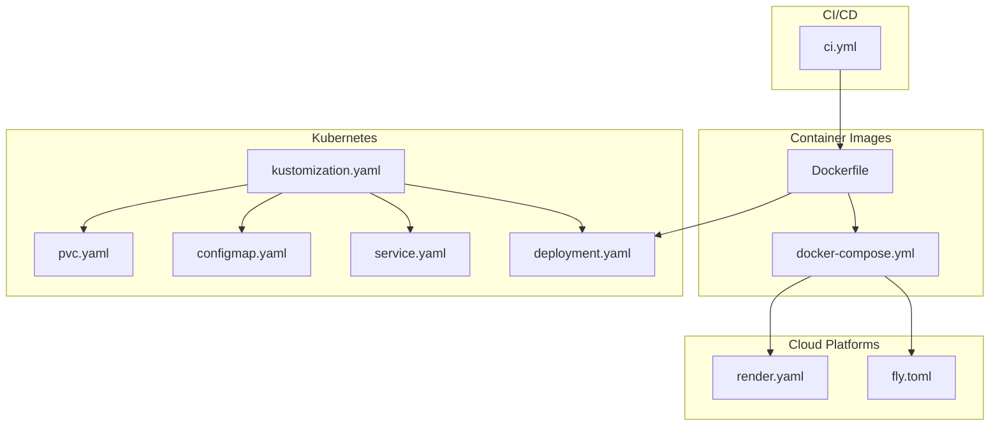
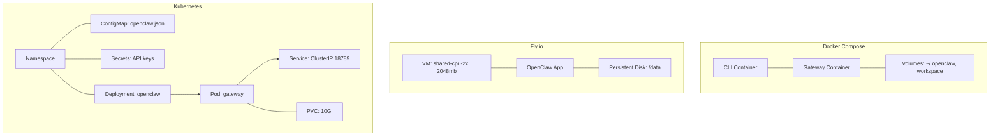
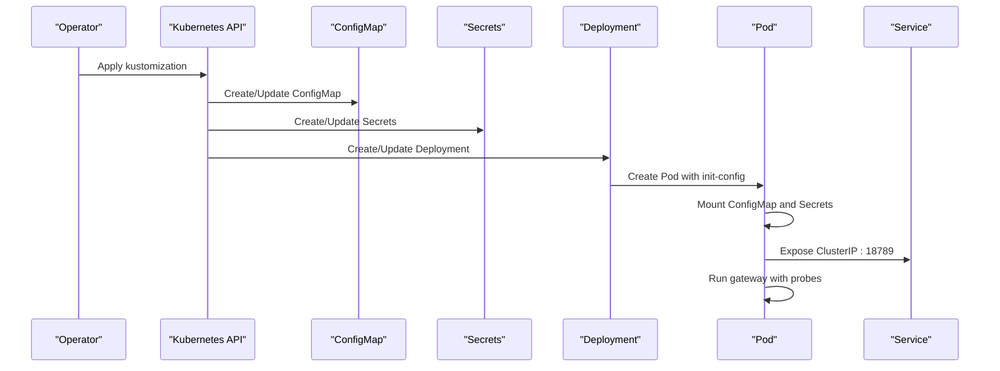
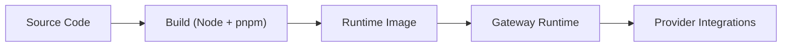

# Production Deployment

<cite>
**Referenced Files in This Document**
- [Dockerfile](file://Dockerfile)
- [docker-compose.yml](file://docker-compose.yml)
- [fly.toml](file://fly.toml)
- [render.yaml](file://render.yaml)
- [deployment.yaml](file://scripts/k8s/manifests/deployment.yaml)
- [service.yaml](file://scripts/k8s/manifests/service.yaml)
- [configmap.yaml](file://scripts/k8s/manifests/configmap.yaml)
- [pvc.yaml](file://scripts/k8s/manifests/pvc.yaml)
- [kustomization.yaml](file://scripts/k8s/manifests/kustomization.yaml)
- [ci.yml](file://.github/workflows/ci.yml)
- [package.json](file://package.json)
</cite>

## Table of Contents
1. [Introduction](#introduction)
2. [Project Structure](#project-structure)
3. [Core Components](#core-components)
4. [Architecture Overview](#architecture-overview)
5. [Detailed Component Analysis](#detailed-component-analysis)
6. [Dependency Analysis](#dependency-analysis)
7. [Performance Considerations](#performance-considerations)
8. [Security Hardening and Network Security](#security-hardening-and-network-security)
9. [Monitoring, Logging, and Alerting](#monitoring-logging-and-alerting)
10. [Backup, Disaster Recovery, and Maintenance](#backup-disaster-recovery-and-maintenance)
11. [CI/CD Pipelines and Automated Deployments](#cicd-pipelines-and-automated-deployments)
12. [Scaling Strategies](#scaling-strategies)
13. [Troubleshooting Guide](#troubleshooting-guide)
14. [Conclusion](#conclusion)

## Introduction
This document provides production-grade deployment strategies for OpenClaw across containerized environments (Docker and Docker Compose), Kubernetes, and Platform-as-a-Service offerings (Fly.io and Render). It consolidates infrastructure requirements, resource allocation, security hardening, observability, backup and disaster recovery, CI/CD automation, and operational maintenance practices. The guidance is derived from the repository’s official deployment artifacts and build configurations.

## Project Structure
OpenClaw’s production deployment assets are organized as follows:
- Container build and runtime: Dockerfile and docker-compose.yml define the container image and local orchestration.
- Cloud platform deployments: fly.toml for Fly.io and render.yaml for Render.
- Kubernetes manifests: scripts/k8s/manifests/ contains a Kustomization and the associated Deployment, Service, ConfigMap, PVC, and kustomization.yaml.
- CI/CD: .github/workflows/ci.yml orchestrates multi-platform checks and tests.

**Diagram sources**
- [Dockerfile](file://Dockerfile)
- [docker-compose.yml](file://docker-compose.yml)
- [fly.toml](file://fly.toml)
- [render.yaml](file://render.yaml)
- [kustomization.yaml](file://scripts/k8s/manifests/kustomization.yaml)
- [deployment.yaml](file://scripts/k8s/manifests/deployment.yaml)
- [service.yaml](file://scripts/k8s/manifests/service.yaml)
- [configmap.yaml](file://scripts/k8s/manifests/configmap.yaml)
- [pvc.yaml](file://scripts/k8s/manifests/pvc.yaml)
- [ci.yml](file://.github/workflows/ci.yml)

**Section sources**
- [Dockerfile](file://Dockerfile)
- [docker-compose.yml](file://docker-compose.yml)
- [fly.toml](file://fly.toml)
- [render.yaml](file://render.yaml)
- [kustomization.yaml](file://scripts/k8s/manifests/kustomization.yaml)
- [deployment.yaml](file://scripts/k8s/manifests/deployment.yaml)
- [service.yaml](file://scripts/k8s/manifests/service.yaml)
- [configmap.yaml](file://scripts/k8s/manifests/configmap.yaml)
- [pvc.yaml](file://scripts/k8s/manifests/pvc.yaml)
- [ci.yml](file://.github/workflows/ci.yml)

## Core Components
- Gateway runtime: The container entrypoint starts the OpenClaw gateway with built-in health endpoints for liveness and readiness.
- CLI companion: A secondary container shares the same network to expose the CLI inside the stack.
- Secrets and environment: Sensitive keys are injected via environment variables or secrets; configuration is mounted from a ConfigMap.
- Storage: Persistent volume claims are used to persist state and workspace data.
- Health probes: Built-in endpoints support container health checks.

Key runtime behaviors:
- Default bind mode is loopback for security; external access requires explicit binding configuration and authentication.
- Health endpoints: /healthz (liveness) and /readyz (readiness) are exposed by the gateway.
- Non-root execution: The container runs as a non-root user to reduce privilege-related risks.

**Section sources**
- [Dockerfile](file://Dockerfile)
- [docker-compose.yml](file://docker-compose.yml)
- [deployment.yaml](file://scripts/k8s/manifests/deployment.yaml)
- [configmap.yaml](file://scripts/k8s/manifests/configmap.yaml)
- [pvc.yaml](file://scripts/k8s/manifests/pvc.yaml)

## Architecture Overview
The production architecture supports three primary deployment modes:
- Docker Compose for single-host or developer-grade setups.
- Fly.io for managed VM hosting with persistent volumes and enforced HTTPS.
- Kubernetes for orchestrated deployments with secrets, config, and persistent storage.

**Diagram sources**
- [docker-compose.yml](file://docker-compose.yml)
- [fly.toml](file://fly.toml)
- [deployment.yaml](file://scripts/k8s/manifests/deployment.yaml)
- [service.yaml](file://scripts/k8s/manifests/service.yaml)
- [configmap.yaml](file://scripts/k8s/manifests/configmap.yaml)
- [pvc.yaml](file://scripts/k8s/manifests/pvc.yaml)

## Detailed Component Analysis

### Docker and Docker Compose
- Image build: Multi-stage build with Node base images pinned by digest, optional slim variant, and runtime pruning to minimize footprint.
- Entrypoint: Starts the gateway with default flags and exposes health endpoints.
- Compose stack: Defines gateway and CLI containers, binds ports, mounts persistent volumes, and includes optional sandbox socket mounting for containerized agents.

Operational notes:
- Loopback bind by default; to expose externally, override bind to “lan” and set authentication.
- Health checks use internal endpoints for liveness and readiness.

**Section sources**
- [Dockerfile](file://Dockerfile)
- [docker-compose.yml](file://docker-compose.yml)

### Fly.io Deployment
- Managed VM: Uses a shared CPU 2x instance with 2 GB RAM.
- Persistent storage: Mounts a persistent disk to /data for state.
- Process definition: Runs the gateway with explicit port and bind flags.
- HTTPS enforcement: Forces HTTPS for the HTTP service.
- Auto-scaling: Keeps a minimum number of machines running.

**Section sources**
- [fly.toml](file://fly.toml)

### Render Deployment
- Web service: Single-container Docker runtime service.
- Health check: Uses /health endpoint.
- Environment variables: Sets port, state/workspace directories, and generates a gateway token.
- Persistent disk: Mounts a disk to /data with 1 GB size.

**Section sources**
- [render.yaml](file://render.yaml)

### Kubernetes Deployment
- Kustomization: Bundles PVC, ConfigMap, Deployment, and Service.
- Deployment: Non-root, restricted security context, liveness/readiness probes, and resource requests/limits.
- Service: ClusterIP exposing port 18789.
- ConfigMap: Provides openclaw.json and AGENTS.md defaults.
- PVC: 10 GiB RWO volume for state persistence.

**Diagram sources**
- [kustomization.yaml](file://scripts/k8s/manifests/kustomization.yaml)
- [deployment.yaml](file://scripts/k8s/manifests/deployment.yaml)
- [service.yaml](file://scripts/k8s/manifests/service.yaml)
- [configmap.yaml](file://scripts/k8s/manifests/configmap.yaml)

**Section sources**
- [kustomization.yaml](file://scripts/k8s/manifests/kustomization.yaml)
- [deployment.yaml](file://scripts/k8s/manifests/deployment.yaml)
- [service.yaml](file://scripts/k8s/manifests/service.yaml)
- [configmap.yaml](file://scripts/k8s/manifests/configmap.yaml)
- [pvc.yaml](file://scripts/k8s/manifests/pvc.yaml)

## Dependency Analysis
- Build-time dependencies: Node.js and pnpm are used to assemble the runtime and UI bundles.
- Runtime dependencies: The container image embeds production-ready Node runtime and prunes dev artifacts.
- External integrations: Provider credentials are supplied via environment variables/secrets; browser automation can be optionally included at build time.

**Diagram sources**
- [Dockerfile](file://Dockerfile)
- [package.json](file://package.json)

**Section sources**
- [Dockerfile](file://Dockerfile)
- [package.json](file://package.json)

## Performance Considerations
- Memory tuning: CI sets higher heap limits for tests; production should align JVM-like limits to workload needs.
- Resource requests/limits: Kubernetes Deployment defines modest baseline requests and ceilings suitable for typical loads.
- Browser automation: Optional Chromium installation reduces cold-start overhead in sandbox scenarios.
- Image variants: Choose slim variant to reduce footprint when memory is constrained.

[No sources needed since this section provides general guidance]

## Security Hardening and Network Security
- Non-root execution: Containers run as uid 1000 to minimize impact of container escapes.
- Restricted filesystem: Root filesystem is read-only; capabilities are dropped.
- Seccomp: Uses default runtime profile.
- Secrets injection: API keys and tokens are provided via environment variables or secrets.
- Authentication: Token-based authentication is configured in the default gateway config.
- Network exposure: Default loopback binding; external access requires explicit configuration and strong auth.

**Section sources**
- [Dockerfile](file://Dockerfile)
- [deployment.yaml](file://scripts/k8s/manifests/deployment.yaml)
- [configmap.yaml](file://scripts/k8s/manifests/configmap.yaml)

## Monitoring, Logging, and Alerting
- Health endpoints: Built-in /healthz and /readyz for liveness and readiness.
- Kubernetes probes: Exec-based HTTP probes check health endpoints.
- Logging: Application logs are emitted by the Node process; capture via container logs.
- Observability: Integrate with your platform’s logging and metrics stack; ensure log forwarding and structured logging are enabled.

**Section sources**
- [Dockerfile](file://Dockerfile)
- [deployment.yaml](file://scripts/k8s/manifests/deployment.yaml)

## Backup, Disaster Recovery, and Maintenance
- Persistent storage: Use mounted volumes/disks (/data, ~/.openclaw, workspace) for state and configuration persistence.
- Fly.io: Back up the attached persistent disk snapshots.
- Kubernetes: Back up PVC snapshots and ConfigMaps/Secrets via cluster backups or CSI snapshots.
- Maintenance windows: Schedule rolling updates with readiness probes to avoid downtime.

**Section sources**
- [fly.toml](file://fly.toml)
- [pvc.yaml](file://scripts/k8s/manifests/pvc.yaml)
- [configmap.yaml](file://scripts/k8s/manifests/configmap.yaml)

## CI/CD Pipelines and Automated Deployments
- CI workflow: Comprehensive checks across Node, Windows, macOS, and Python skills; shards tests and enforces quality gates.
- Artifact sharing: Build artifacts are uploaded and reused across jobs to optimize runtime.
- Release validation: npm packaging checks are performed on push to main.
- Automation hooks: Pre-commit and zizmor scanning protect against secrets and workflow misconfigurations.

Recommended production automation:
- Build and push images on tagged releases.
- Apply Kustomization to production clusters on successful CI.
- Gate deployments with health checks and canary strategies.

**Section sources**
- [ci.yml](file://.github/workflows/ci.yml)

## Scaling Strategies
- Fly.io: Adjust VM size and enable multiple machines for high availability; maintain persistent disk for state.
- Kubernetes: Increase replicas cautiously; ensure stateful components are resilient and backed by persistent volumes.
- Horizontal vs vertical: Start with vertical scaling to tune memory/CPU; scale out only when necessary.

[No sources needed since this section provides general guidance]

## Troubleshooting Guide
Common issues and remedies:
- Gateway not reachable from host: Change bind mode to “lan” and set authentication; verify port mapping.
- Health check failures: Confirm probes target /healthz and /readyz; validate readiness before traffic.
- Insufficient memory: Increase memory limits or switch to the slim image variant.
- Sandbox containerization: Enable optional Docker CLI installation and mount the Docker socket when using sandboxed agents.

**Section sources**
- [Dockerfile](file://Dockerfile)
- [docker-compose.yml](file://docker-compose.yml)
- [deployment.yaml](file://scripts/k8s/manifests/deployment.yaml)

## Conclusion
OpenClaw’s repository provides robust, production-ready deployment assets for Docker, Fly.io, Render, and Kubernetes. By leveraging the provided configurations, enforcing security hardening, and integrating comprehensive monitoring and CI/CD automation, teams can operate reliable, scalable, and secure OpenClaw instances in production.