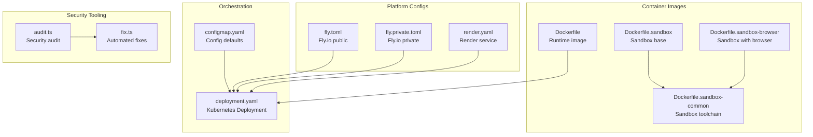
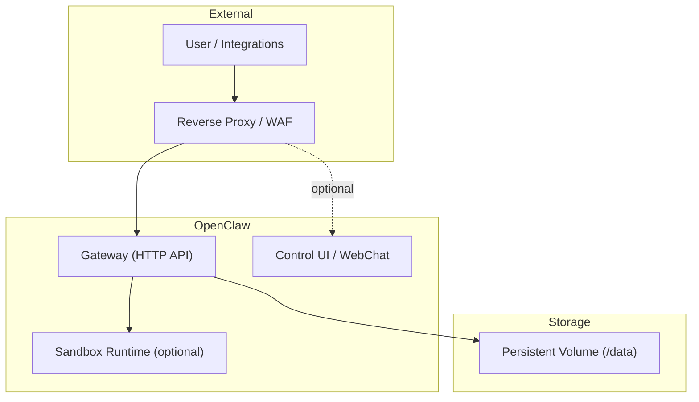
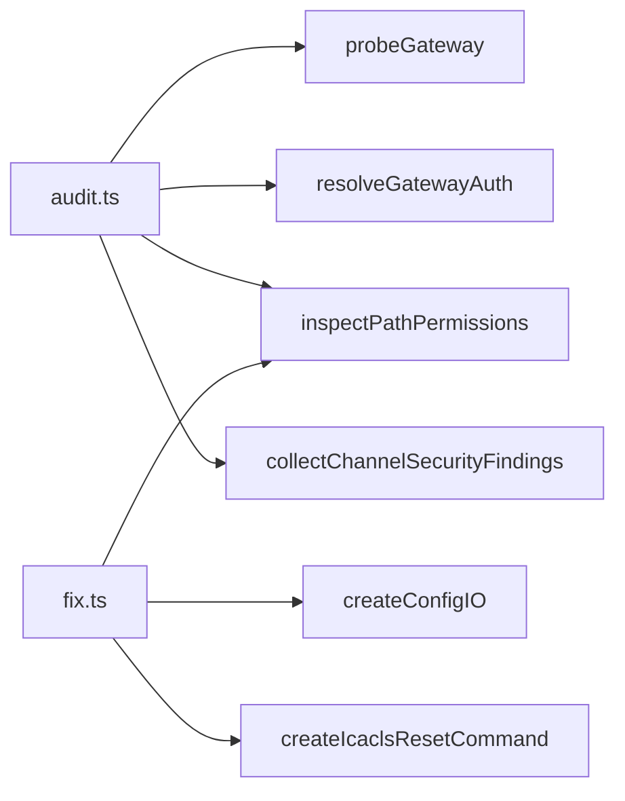

# Security Hardening

<cite>
**Referenced Files in This Document**
- [SECURITY.md](file://SECURITY.md)
- [Dockerfile](file://Dockerfile)
- [Dockerfile.sandbox](file://Dockerfile.sandbox)
- [Dockerfile.sandbox-browser](file://Dockerfile.sandbox-browser)
- [Dockerfile.sandbox-common](file://Dockerfile.sandbox-common)
- [docker-compose.yml](file://docker-compose.yml)
- [deployment.yaml](file://scripts/k8s/manifests/deployment.yaml)
- [configmap.yaml](file://scripts/k8s/manifests/configmap.yaml)
- [fly.toml](file://fly.toml)
- [fly.private.toml](file://fly.private.toml)
- [render.yaml](file://render.yaml)
- [audit.ts](file://src/security/audit.ts)
- [fix.ts](file://src/security/fix.ts)
</cite>

## Table of Contents
1. [Introduction](#introduction)
2. [Project Structure](#project-structure)
3. [Core Components](#core-components)
4. [Architecture Overview](#architecture-overview)
5. [Detailed Component Analysis](#detailed-component-analysis)
6. [Dependency Analysis](#dependency-analysis)
7. [Performance Considerations](#performance-considerations)
8. [Troubleshooting Guide](#troubleshooting-guide)
9. [Conclusion](#conclusion)
10. [Appendices](#appendices)

## Introduction
This document provides production-grade security hardening guidance for deploying OpenClaw. It focuses on container security configurations, non-root user execution, filesystem permissions, SSL/TLS and reverse proxy hardening, authentication and authorization, audit logging, security headers, CORS policies, input validation, vulnerability scanning, updates, incident response, monitoring, and compliance considerations. The guidance is grounded in repository-provided security policies, container images, orchestrator manifests, and built-in security auditing tools.

## Project Structure
OpenClaw’s security posture is implemented across:
- Container images and sandbox images for runtime isolation
- Orchestration manifests enforcing least privilege and security contexts
- Platform-specific deployment configurations (Fly.io, Render)
- Built-in security audit and remediation tooling

**Diagram sources**
- [Dockerfile:113-250](file://Dockerfile#L113-L250)
- [Dockerfile.sandbox:1-25](file://Dockerfile.sandbox#L1-L25)
- [Dockerfile.sandbox-browser:1-36](file://Dockerfile.sandbox-browser#L1-L36)
- [Dockerfile.sandbox-common:1-49](file://Dockerfile.sandbox-common#L1-L49)
- [deployment.yaml:1-147](file://scripts/k8s/manifests/deployment.yaml#L1-L147)
- [configmap.yaml:1-39](file://scripts/k8s/manifests/configmap.yaml#L1-L39)
- [fly.toml:1-35](file://fly.toml#L1-L35)
- [fly.private.toml:1-40](file://fly.private.toml#L1-L40)
- [render.yaml:1-22](file://render.yaml#L1-L22)
- [audit.ts:1-800](file://src/security/audit.ts#L1-L800)
- [fix.ts:1-478](file://src/security/fix.ts#L1-L478)

**Section sources**
- [Dockerfile:113-250](file://Dockerfile#L113-L250)
- [deployment.yaml:1-147](file://scripts/k8s/manifests/deployment.yaml#L1-L147)
- [configmap.yaml:1-39](file://scripts/k8s/manifests/configmap.yaml#L1-L39)
- [fly.toml:1-35](file://fly.toml#L1-L35)
- [fly.private.toml:1-40](file://fly.private.toml#L1-L40)
- [render.yaml:1-22](file://render.yaml#L1-L22)
- [audit.ts:1-800](file://src/security/audit.ts#L1-L800)
- [fix.ts:1-478](file://src/security/fix.ts#L1-L478)

## Core Components
- Container runtime images enforce non-root execution, read-only root filesystem, and minimal capabilities.
- Kubernetes manifests apply pod security standards, seccomp defaults, and init containers to seed configuration safely.
- Platform configs (Fly.io, Render) define production-ready defaults including health checks and enforced HTTPS where applicable.
- Built-in security audit and fix tooling identify misconfigurations and apply safe defaults.

Key security controls:
- Non-root user execution in container images and Kubernetes pods
- Read-only root filesystem and capability drops
- Seccomp runtime default profiles
- Automated permission hardening for state and credentials
- Gateway authentication and reverse proxy trust configuration
- Health probes and readiness/liveness checks

**Section sources**
- [Dockerfile:230-234](file://Dockerfile#L230-L234)
- [deployment.yaml:19-138](file://scripts/k8s/manifests/deployment.yaml#L19-L138)
- [audit.ts:221-350](file://src/security/audit.ts#L221-L350)
- [fix.ts:305-385](file://src/security/fix.ts#L305-L385)

## Architecture Overview
The production deployment architecture emphasizes least privilege and trust boundaries:

Operational guidance:
- Bind the gateway to loopback by default; expose via reverse proxy with strict auth and TLS termination.
- Use token-based authentication; avoid wildcard allowed origins; configure trusted proxies and rate limiting when exposing beyond loopback.
- Apply health checks and readiness probes to ensure resilient operation.

**Diagram sources**
- [configmap.yaml:8-34](file://scripts/k8s/manifests/configmap.yaml#L8-L34)
- [fly.toml:20-26](file://fly.toml#L20-L26)
- [fly.private.toml:27-31](file://fly.private.toml#L27-L31)
- [deployment.yaml:106-123](file://scripts/k8s/manifests/deployment.yaml#L106-L123)

**Section sources**
- [configmap.yaml:8-34](file://scripts/k8s/manifests/configmap.yaml#L8-L34)
- [fly.toml:20-26](file://fly.toml#L20-L26)
- [fly.private.toml:27-31](file://fly.private.toml#L27-L31)
- [deployment.yaml:106-123](file://scripts/k8s/manifests/deployment.yaml#L106-L123)

## Detailed Component Analysis

### Container Security Configurations
- Non-root user: Containers run as the “node” user to minimize privilege exposure.
- Read-only root filesystem: Prevents tampering with runtime binaries.
- Capability drops: Removes unnecessary Linux capabilities (e.g., NET_RAW, NET_ADMIN).
- Seccomp: Enforces runtime default profiles for syscall restrictions.
- Health checks: Liveness/readiness endpoints support container orchestration.

Recommendations:
- Pin base images by digest for immutable builds.
- Limit mounted volumes to essential state and workspace directories.
- Use init containers to securely populate configuration and workspace files.

**Section sources**
- [Dockerfile:139-141](file://Dockerfile#L139-L141)
- [Dockerfile:230-234](file://Dockerfile#L230-L234)
- [Dockerfile:134-137](file://Dockerfile#L134-L137)
- [Dockerfile:130-138](file://Dockerfile#L130-L138)
- [deployment.yaml:19-138](file://scripts/k8s/manifests/deployment.yaml#L19-L138)
- [docker-compose.yml:52-79](file://docker-compose.yml#L52-L79)

### Non-Root User Execution
- Dockerfile sets the runtime user to “node” and ensures ownership of application directories.
- Kubernetes deployment enforces runAsNonRoot, runAsUser/runAsGroup 1000, and readOnlyRootFilesystem.

Best practices:
- Avoid running as root in containers.
- Ensure all mounted directories are owned by the non-root user.
- Use fsGroup in Kubernetes to align volume permissions.

**Section sources**
- [Dockerfile:139-141](file://Dockerfile#L139-L141)
- [Dockerfile:230-234](file://Dockerfile#L230-L234)
- [deployment.yaml:129-134](file://scripts/k8s/manifests/deployment.yaml#L129-L134)

### Filesystem Permissions
- The security audit inspects state and config directories for world/group writability and readability.
- The fix tool applies safe defaults (e.g., 0o700 for directories, 0o600 for files) and resets Windows ACLs when applicable.

Guidelines:
- Restrict state directory permissions to owner-only.
- Protect configuration files with restrictive permissions.
- Harden agent state and session transcripts.

**Section sources**
- [audit.ts:221-350](file://src/security/audit.ts#L221-L350)
- [fix.ts:305-385](file://src/security/fix.ts#L305-L385)

### SSL/TLS Certificate Management and Reverse Proxy
- Fly.io HTTP service forces HTTPS and manages public ingress.
- Kubernetes config defaults to loopback binding; reverse proxy should terminate TLS and forward to the gateway.
- Control UI origin policies require explicit allowed origins; wildcard origins are flagged as critical.

Hardening steps:
- Terminate TLS at the reverse proxy or ingress controller.
- Configure trusted proxy headers and allowlists.
- Enforce strict allowed origins for non-loopback deployments.

**Section sources**
- [fly.toml:20-26](file://fly.toml#L20-L26)
- [configmap.yaml:10-20](file://scripts/k8s/manifests/configmap.yaml#L10-L20)
- [audit.ts:477-494](file://src/security/audit.ts#L477-L494)

### Authentication Mechanisms and Authorization Policies
- Token-based authentication is recommended; password mode is supported.
- Trusted-proxy mode delegates authentication to a reverse proxy; requires strict proxy configuration and allowlists.
- Rate limiting is recommended for non-loopback deployments.
- Control UI device auth toggles are flagged as dangerous when disabled.

Controls:
- Prefer token auth with long random secrets.
- Configure allowed origins and disable wildcard origins.
- Use rate limiting to mitigate brute force.
- Avoid disabling device auth for Control UI unless in a short-lived break-glass scenario.

**Section sources**
- [audit.ts:352-701](file://src/security/audit.ts#L352-L701)
- [configmap.yaml:14-16](file://scripts/k8s/manifests/configmap.yaml#L14-L16)

### Audit Logging Requirements
- Built-in security audit tool generates findings categorized by severity and includes remediations.
- Automated fix tool applies safe defaults to permissions and configuration.

Usage:
- Run the security audit to identify risks.
- Use the fix tool to apply safe defaults where appropriate.

**Section sources**
- [audit.ts:1-120](file://src/security/audit.ts#L1-L120)
- [fix.ts:1-60](file://src/security/fix.ts#L1-L60)

### Security Headers, CORS Policies, and Input Validation
- Control UI origin policy requires explicit allowed origins for non-loopback deployments.
- Wildcard origins are flagged as critical; host-header origin fallback is dangerous and should be disabled.
- Input validation and sanitization are handled by the runtime; avoid enabling unsafe external content flags.

Recommendations:
- Define strict allowed origins for Control UI.
- Disable host-header origin fallback.
- Keep unsafe external content flags disabled unless for narrowly scoped debugging.

**Section sources**
- [audit.ts:477-519](file://src/security/audit.ts#L477-L519)
- [configmap.yaml:17-19](file://scripts/k8s/manifests/configmap.yaml#L17-L19)

### Vulnerability Scanning, Security Updates, and Incident Response
- The project integrates detect-secrets for automated secret detection in CI/CD.
- Security policy defines responsible disclosure, triage criteria, and scope.
- Node.js runtime version guidance highlights security patches for specific CVEs.

Procedures:
- Run secret scanning locally and in CI.
- Follow the security policy for vulnerability reporting and triage.
- Keep Node.js and container base images updated with security patches.

**Section sources**
- [SECURITY.md:282-293](file://SECURITY.md#L282-L293)
- [SECURITY.md:251-264](file://SECURITY.md#L251-L264)
- [Dockerfile:17-20](file://Dockerfile#L17-L20)

### Incident Response Procedures
- The security policy outlines reporting channels, required report details, and triage acceptance criteria.
- Maintain logs for gateway health and readiness probes; monitor for repeated failures.

Checklist:
- Validate report completeness (severity, impact, reproduction, remediation).
- Confirm trust model boundaries and scope.
- Coordinate patching and communication per policy.

**Section sources**
- [SECURITY.md:5-47](file://SECURITY.md#L5-L47)

### Security Monitoring and Intrusion Detection
- Kubernetes probes support liveness and readiness checks.
- Fly.io and Render configs define health check paths and process management.

Recommendations:
- Integrate with SIEM and IDS/IPS at the platform perimeter.
- Monitor gateway logs and probe statuses.
- Alert on repeated authentication failures or unusual traffic patterns.

**Section sources**
- [deployment.yaml:106-123](file://scripts/k8s/manifests/deployment.yaml#L106-L123)
- [fly.toml:6-26](file://fly.toml#L6-L26)
- [render.yaml:6-10](file://render.yaml#L6-L10)

### Compliance Considerations
- Apply least privilege and principle of least functionality.
- Enforce non-root execution and read-only filesystems.
- Use strict origin policies and trusted proxy configurations.
- Maintain audit trails and secure secret storage.

[No sources needed since this section provides general guidance]

## Dependency Analysis
The security tooling depends on configuration resolution, gateway probing, and platform-specific utilities.

**Diagram sources**
- [audit.ts:1-120](file://src/security/audit.ts#L1-L120)
- [fix.ts:1-60](file://src/security/fix.ts#L1-L60)

**Section sources**
- [audit.ts:1-120](file://src/security/audit.ts#L1-L120)
- [fix.ts:1-60](file://src/security/fix.ts#L1-L60)

## Performance Considerations
- Sandboxed browsers and toolchains increase image size; enable only when required.
- Health checks should balance responsiveness with overhead.
- Reverse proxy caching and compression can improve latency while maintaining security.

[No sources needed since this section provides general guidance]

## Troubleshooting Guide
Common issues and resolutions:
- Gateway binds beyond loopback without auth: Set token/password or bind to loopback.
- Control UI allowed origins missing/wildcard present: Configure explicit allowed origins; remove wildcard.
- Trusted-proxy mode misconfiguration: Ensure trusted proxies list matches proxy IPs and user header is set.
- Filesystem permissions too permissive: Use the fix tool to apply safe defaults.

**Section sources**
- [audit.ts:442-450](file://src/security/audit.ts#L442-L450)
- [audit.ts:477-519](file://src/security/audit.ts#L477-L519)
- [audit.ts:628-685](file://src/security/audit.ts#L628-L685)
- [fix.ts:305-385](file://src/security/fix.ts#L305-L385)

## Conclusion
OpenClaw’s production security posture is built on non-root containers, strict filesystem permissions, robust authentication, and comprehensive audit tooling. By enforcing reverse proxy TLS termination, strict origin policies, and least privilege across platforms (Kubernetes, Fly.io, Render), deployments can achieve strong trust boundaries. Regular security scans, updates, and adherence to the security policy further strengthen resilience.

[No sources needed since this section summarizes without analyzing specific files]

## Appendices

### Production Checklist
- Run security audit and apply fixes
- Enforce non-root containers and read-only filesystems
- Configure token-based auth and rate limiting
- Set strict allowed origins for Control UI
- Terminate TLS at reverse proxy or ingress
- Monitor health probes and logs
- Keep Node.js and base images updated

[No sources needed since this section provides general guidance]