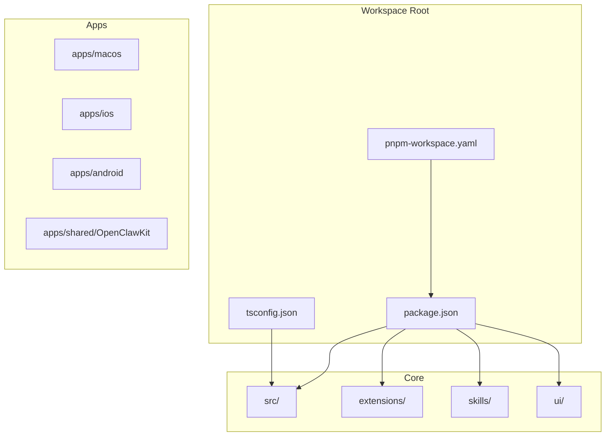
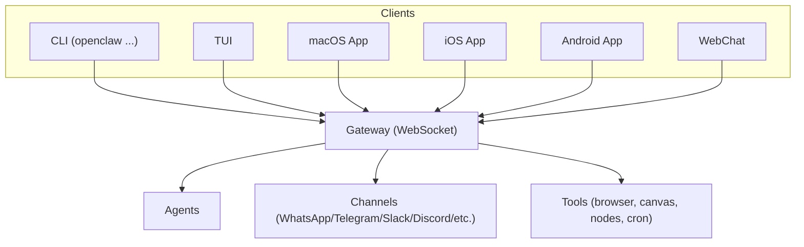
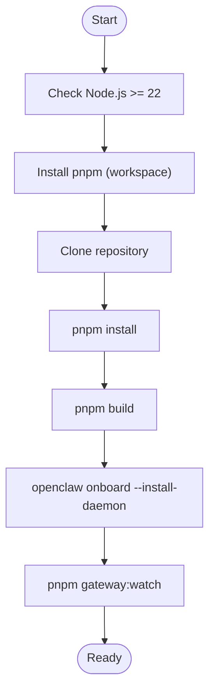
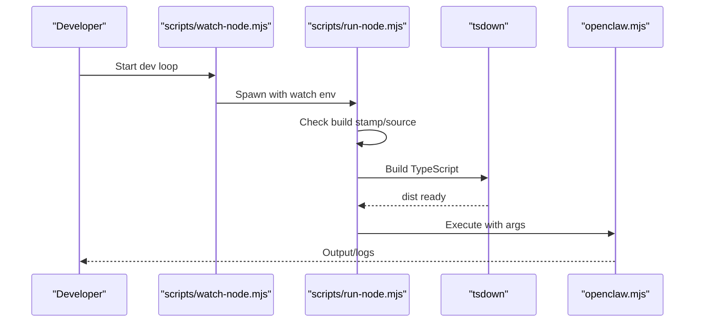
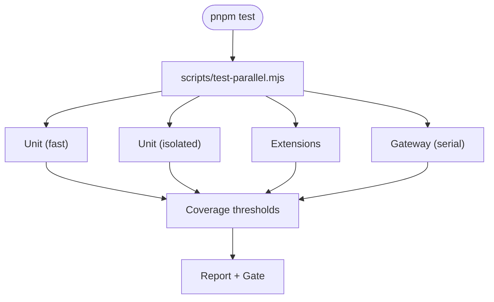
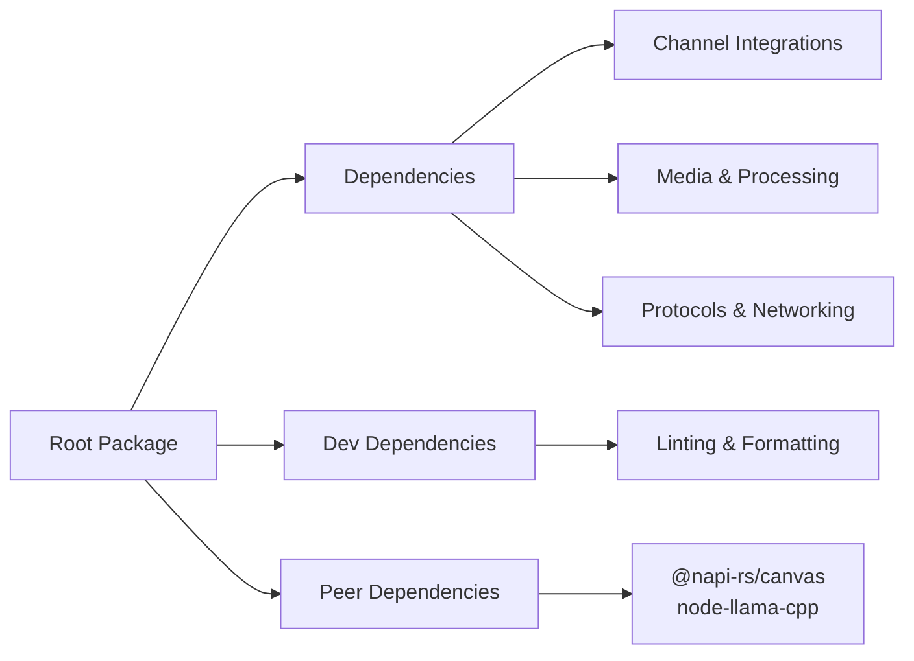

# Development Guide

<cite>
**Referenced Files in This Document**
- [CONTRIBUTING.md](file://CONTRIBUTING.md)
- [README.md](file://README.md)
- [package.json](file://package.json)
- [pnpm-workspace.yaml](file://pnpm-workspace.yaml)
- [Dockerfile](file://Dockerfile)
- [tsconfig.json](file://tsconfig.json)
- [vitest.config.ts](file://vitest.config.ts)
- [.github/workflows/ci.yml](file://.github/workflows/ci.yml)
- [scripts/run-node.mjs](file://scripts/run-node.mjs)
- [scripts/watch-node.mjs](file://scripts/watch-node.mjs)
- [scripts/test-parallel.mjs](file://scripts/test-parallel.mjs)
- [.gitignore](file://.gitignore)
</cite>

## Table of Contents
1. [Introduction](#introduction)
2. [Project Structure](#project-structure)
3. [Core Components](#core-components)
4. [Architecture Overview](#architecture-overview)
5. [Detailed Component Analysis](#detailed-component-analysis)
6. [Dependency Analysis](#dependency-analysis)
7. [Performance Considerations](#performance-considerations)
8. [Troubleshooting Guide](#troubleshooting-guide)
9. [Conclusion](#conclusion)
10. [Appendices](#appendices)

## Introduction
This development guide explains how to set up a productive development environment for OpenClaw, understand the build system and testing strategies, and contribute effectively. It covers the project layout, coding standards, contribution workflows, build and dependency management, development tools, testing methodologies, quality assurance practices, release and versioning, and community processes. The guide is designed for contributors with varying backgrounds, from first-time contributors to maintainers.

## Project Structure
OpenClaw is a monorepo organized around multiple packages and platforms:
- Root workspace defines the primary package and shared tooling.
- Applications and platforms: macOS, iOS, Android apps under apps/.
- Shared libraries and kits under shared/.
- Extensions ecosystem under extensions/.
- Skills under skills/.
- UI under ui/.
- Scripts and automation under scripts/.

Key workspace configuration:
- Root package.json defines scripts, dependencies, and exports for the CLI and plugin SDK.
- pnpm-workspace.yaml declares workspace packages and onlyBuiltDependencies for native modules.
- TypeScript configuration (tsconfig.json) centralizes compiler options and path aliases.

**Diagram sources**
- [package.json](file://package.json#L1-L458)
- [pnpm-workspace.yaml](file://pnpm-workspace.yaml#L1-L18)
- [tsconfig.json](file://tsconfig.json#L1-L29)

**Section sources**
- [package.json](file://package.json#L1-L458)
- [pnpm-workspace.yaml](file://pnpm-workspace.yaml#L1-L18)
- [tsconfig.json](file://tsconfig.json#L1-L29)

## Core Components
- CLI and runtime entry: The CLI binary is exposed via bin.openclaw and executed through openclaw.mjs. Development scripts run TypeScript directly via tsx and build to dist/.
- Plugin SDK: Exported via package.json exports for multiple channel-specific subpaths, enabling extension development against a stable API surface.
- Build system: TypeScript compilation via tsdown, A2UI bundling, and metadata generation scripts orchestrated by pnpm scripts.
- Testing framework: Vitest with custom orchestration in scripts/test-parallel.mjs to parallelize and shard tests across unit, extensions, and gateway suites.
- Containerization: Multi-stage Dockerfile with optional extension dependencies, slim variants, and runtime utilities for browser and Docker CLI.

**Section sources**
- [package.json](file://package.json#L16-L216)
- [package.json](file://package.json#L217-L334)
- [scripts/run-node.mjs](file://scripts/run-node.mjs#L1-L264)
- [scripts/watch-node.mjs](file://scripts/watch-node.mjs#L1-L93)
- [scripts/test-parallel.mjs](file://scripts/test-parallel.mjs#L1-L500)
- [Dockerfile](file://Dockerfile#L1-L231)

## Architecture Overview
OpenClaw’s runtime architecture centers on a WebSocket-based gateway controlling agents, channels, tools, and UI surfaces. The CLI, TUI, and platform apps communicate with the gateway over the loopback interface by default, with optional exposure via Tailscale or SSH tunneling.

[No sources needed since this diagram shows conceptual workflow, not actual code structure]

## Detailed Component Analysis

### Development Environment Setup
- Node.js requirement: Node ≥22 is required for development and runtime.
- Package manager: Prefer pnpm for builds from source; bun is optional for running TypeScript directly.
- Recommended setup: Use the onboarding wizard to install the Gateway daemon and initialize configuration.

**Diagram sources**
- [README.md](file://README.md#L50-L111)
- [package.json](file://package.json#L217-L334)

**Section sources**
- [README.md](file://README.md#L50-L111)
- [package.json](file://package.json#L217-L334)

### Build System and Tooling
- TypeScript compilation: Orchestrated by tsdown with a dedicated build script. The build pipeline also bundles A2UI assets and generates plugin SDK typings and metadata.
- Watch mode: scripts/watch-node.mjs wraps scripts/run-node.mjs to rebuild and rerun on source changes.
- Script orchestration: scripts/test-parallel.mjs coordinates unit, extension, and gateway test suites with dynamic worker allocation, sharding, and isolation strategies.

**Diagram sources**
- [scripts/watch-node.mjs](file://scripts/watch-node.mjs#L1-L93)
- [scripts/run-node.mjs](file://scripts/run-node.mjs#L1-L264)
- [package.json](file://package.json#L217-L334)

**Section sources**
- [scripts/run-node.mjs](file://scripts/run-node.mjs#L1-L264)
- [scripts/watch-node.mjs](file://scripts/watch-node.mjs#L1-L93)
- [package.json](file://package.json#L217-L334)

### Testing Strategies and Quality Assurance
- Unit tests: Vitest with custom configuration and coverage thresholds. The test runner splits fast and isolated suites to reduce contention and flakiness.
- Parallelization: scripts/test-parallel.mjs dynamically computes worker counts, supports sharding, and adapts to host load and platform constraints.
- Coverage: Coverage is computed only over src/ and gated by strict thresholds; excluded files represent integration or UI-heavy modules validated elsewhere.
- CI: GitHub Actions orchestrates docs-only detection, scope detection, build artifacts, checks (types, lint, format), Windows sharded tests, macOS consolidated checks, and Android jobs.

**Diagram sources**
- [scripts/test-parallel.mjs](file://scripts/test-parallel.mjs#L1-L500)
- [vitest.config.ts](file://vitest.config.ts#L71-L202)
- [.github/workflows/ci.yml](file://.github/workflows/ci.yml#L1-L765)

**Section sources**
- [scripts/test-parallel.mjs](file://scripts/test-parallel.mjs#L1-L500)
- [vitest.config.ts](file://vitest.config.ts#L71-L202)
- [.github/workflows/ci.yml](file://.github/workflows/ci.yml#L139-L261)

### Dependency Management
- Root dependencies: Managed in package.json with peerDependencies for optional native modules (e.g., @napi-rs/canvas, node-llama-cpp).
- Workspace: pnpm-workspace.yaml includes root, ui, packages, and extensions/* packages.
- Only-built dependencies: Native modules are marked for prebuild to optimize CI and local installs.
- Engine: Node.js engine constraint ensures compatibility across environments.

**Section sources**
- [package.json](file://package.json#L335-L457)
- [pnpm-workspace.yaml](file://pnpm-workspace.yaml#L1-L18)

### Release Process and Versioning
- Versioning: The root package version drives releases; development channels (stable, beta, dev) are documented for switching via the CLI.
- Release checks: CI validates npm pack contents and enforces release criteria.
- Docker images: Multi-stage Dockerfile produces minimal runtime images with optional browser and Docker CLI installations.

**Section sources**
- [README.md](file://README.md#L83-L91)
- [.github/workflows/ci.yml](file://.github/workflows/ci.yml#L114-L139)
- [Dockerfile](file://Dockerfile#L1-L231)

### Contribution Workflows
- Pre-PR checklist: Build, check, and test locally; keep PRs focused; include screenshots for UI changes.
- Review ownership: Review conversations authored by bots are expected to be resolved by the PR author.
- AI-assisted contributions: Clearly mark AI-assisted PRs, include testing notes, and resolve bot conversations.
- Maintainers: The project maintains a rotating maintainer team responsible for triage, reviews, and roadmap alignment.

**Section sources**
- [CONTRIBUTING.md](file://CONTRIBUTING.md#L76-L128)

### Coding Standards and Formatting
- Formatting: oxfmt for TypeScript/JavaScript and SwiftFormat for Swift; Markdown formatting enforced via oxfmt.
- Linting: oxlint for TypeScript/JavaScript; SwiftLint for Swift; markdownlint-cli2 for docs.
- Host environment policy: Generation and verification of host environment security policy for Swift targets.

**Section sources**
- [package.json](file://package.json#L231-L284)

### Development Tools and Utilities
- Protocol generation: Scripts generate and validate protocol schema and Swift models.
- UI tooling: UI package managed separately with dedicated scripts for install/build/dev.
- Docker utilities: Scripts for smoke, E2E, and live model tests; Dockerfile supports optional browser and Docker CLI installation.

**Section sources**
- [package.json](file://package.json#L285-L334)
- [Dockerfile](file://Dockerfile#L1-L231)

## Dependency Analysis
The project’s dependency graph emphasizes:
- Core runtime dependencies (channels, providers, media, protocols).
- Optional native modules via peerDependencies.
- Workspace packages for extensions and UI.

**Diagram sources**
- [package.json](file://package.json#L335-L457)

**Section sources**
- [package.json](file://package.json#L335-L457)

## Performance Considerations
- Test parallelization: scripts/test-parallel.mjs balances worker counts and sharding to minimize contention and improve throughput.
- Memory tuning: CI sets max-old-space-size defaults; local developers can override via environment variables.
- Platform-specific constraints: Windows CI uses reduced worker counts and special handling for spawn errors; macOS runners cap worker counts to prevent instability.
- Build caching: Dockerfile leverages pnpm store caching and apt caches for faster builds.

[No sources needed since this section provides general guidance]

## Troubleshooting Guide
Common issues and remedies:
- Build failures on low-memory hosts: Reduce worker counts or increase max-old-space-size; use CI defaults or environment overrides.
- Windows spawn errors: scripts/test-parallel.mjs includes a workaround for shell invocation under Git Bash.
- Dirty source tree warnings: Ensure watched paths are clean; run the watcher in a clean working tree.
- Docker build failures: Verify extension opt-in arguments and base image digests; ensure apt caches are available.

**Section sources**
- [scripts/test-parallel.mjs](file://scripts/test-parallel.mjs#L333-L377)
- [scripts/run-node.mjs](file://scripts/run-node.mjs#L92-L101)
- [Dockerfile](file://Dockerfile#L122-L155)

## Conclusion
This guide outlined the OpenClaw development environment, build system, testing strategies, and contribution workflows. By following the setup instructions, leveraging the provided scripts, adhering to coding standards, and understanding the CI and release processes, contributors can develop efficiently and reliably across platforms and subsystems.

## Appendices

### Appendix A: Development Commands Reference
- Build: pnpm build
- Watch and run: pnpm gateway:watch
- Test: pnpm test
- Check: pnpm check
- Docker build: docker build .

**Section sources**
- [package.json](file://package.json#L217-L334)
- [Dockerfile](file://Dockerfile#L1-L231)

### Appendix B: CI Scope Detection and Docs-Only Runs
- Docs-only detection: Detects changes to docs and skips heavy jobs when appropriate.
- Changed scope: Determines which areas (Node, macOS, Android, skills Python) require testing.

**Section sources**
- [.github/workflows/ci.yml](file://.github/workflows/ci.yml#L13-L78)

### Appendix C: Ignored Paths and Secrets
- .gitignore excludes build artifacts, IDE files, and local credentials.
- CI includes secrets scanning and private key detection.

**Section sources**
- [.gitignore](file://.gitignore#L1-L124)
- [.github/workflows/ci.yml](file://.github/workflows/ci.yml#L262-L356)