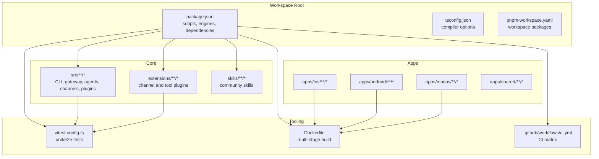
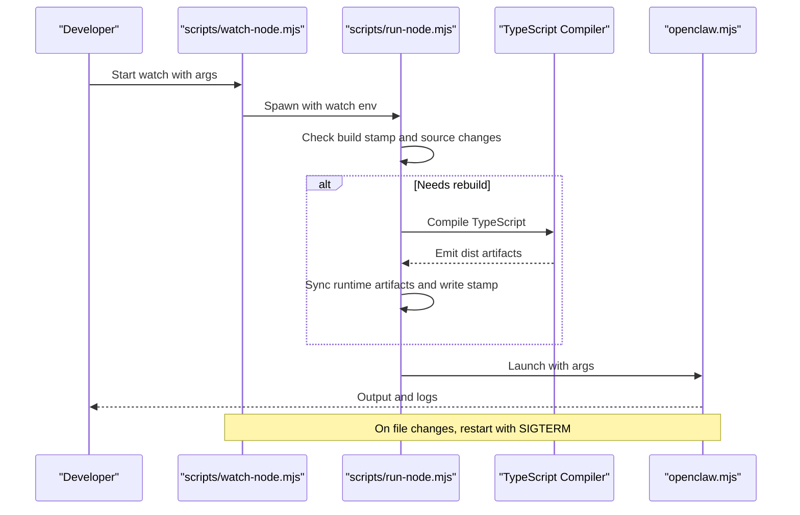
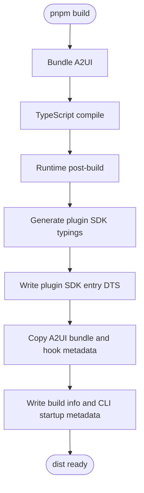
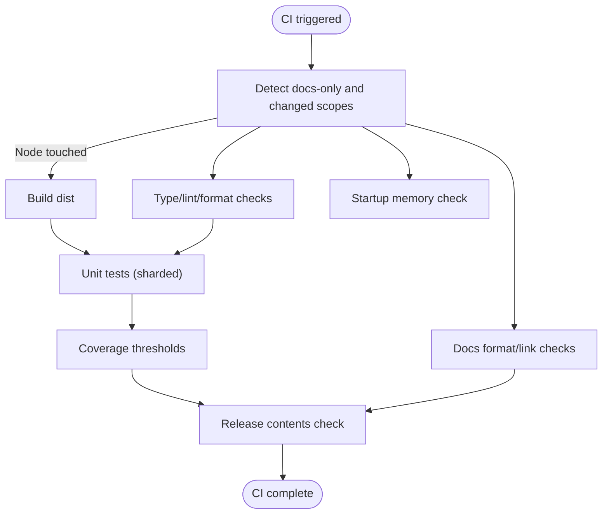
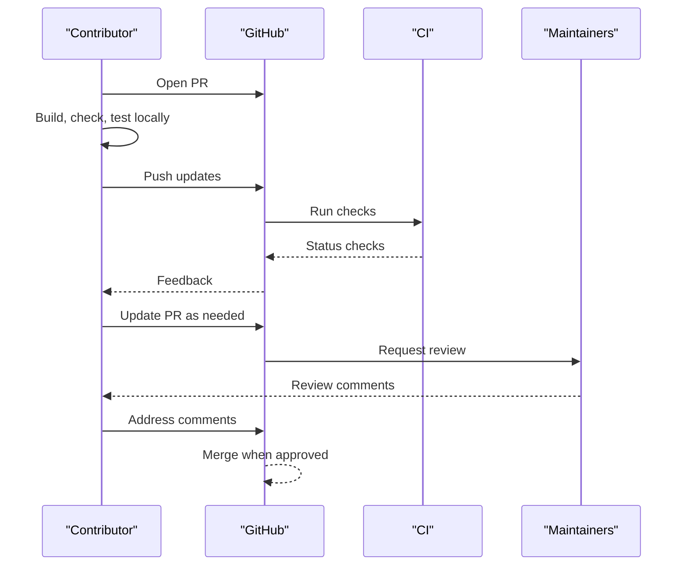
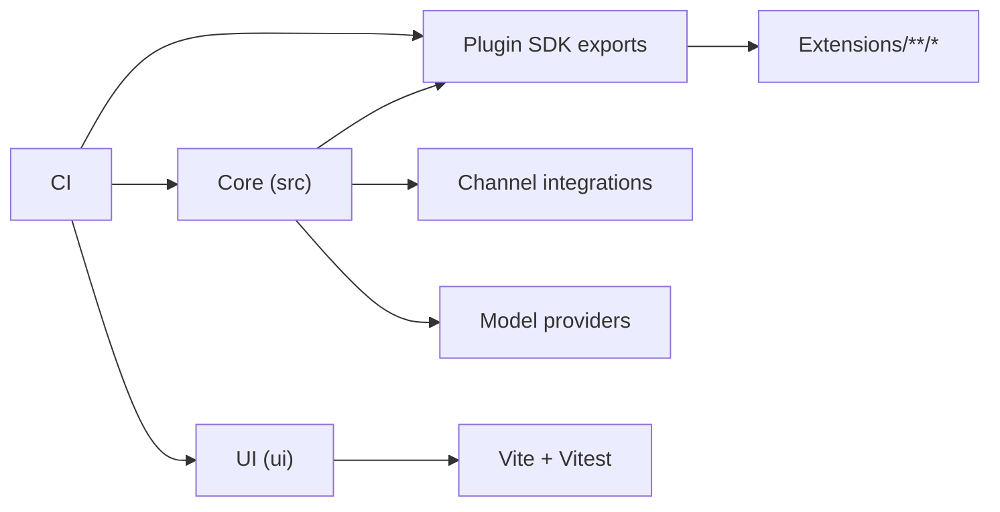

# Development Guide

<cite>
**Referenced Files in This Document**
- [CONTRIBUTING.md](file://CONTRIBUTING.md)
- [README.md](file://README.md)
- [package.json](file://package.json)
- [pnpm-workspace.yaml](file://pnpm-workspace.yaml)
- [tsconfig.json](file://tsconfig.json)
- [vitest.config.ts](file://vitest.config.ts)
- [Dockerfile](file://Dockerfile)
- [.github/workflows/ci.yml](file://.github/workflows/ci.yml)
- [scripts/run-node.mjs](file://scripts/run-node.mjs)
- [scripts/watch-node.mjs](file://scripts/watch-node.mjs)
- [scripts/ui.js](file://scripts/ui.js)
</cite>

## Table of Contents
1. [Introduction](#introduction)
2. [Project Structure](#project-structure)
3. [Core Components](#core-components)
4. [Architecture Overview](#architecture-overview)
5. [Detailed Component Analysis](#detailed-component-analysis)
6. [Dependency Analysis](#dependency-analysis)
7. [Performance Considerations](#performance-considerations)
8. [Troubleshooting Guide](#troubleshooting-guide)
9. [Conclusion](#conclusion)
10. [Appendices](#appendices)

## Introduction
This guide explains how to develop OpenClaw, including setting up a local development environment, understanding the codebase structure, following contribution workflows, and mastering the build, test, and quality systems. It also covers release processes, versioning, and best practices for collaboration.

## Project Structure
OpenClaw is a monorepo organized around a Node.js core, TypeScript compilation, and a multi-platform ecosystem (CLI, gateway, UI, apps, extensions, and skills). The repository uses pnpm workspaces to manage packages and a comprehensive CI pipeline to validate changes across platforms and environments.

Key characteristics:
- Monorepo with workspaces for the core package, UI, and plugin packages
- TypeScript-based runtime with a custom build pipeline
- Extensive test coverage using Vitest with configurable workers and coverage thresholds
- CI orchestrated with GitHub Actions for Node, Windows, macOS, Android, and docs
- Containerized runtime via Docker with optional browser and Docker CLI installations

```mermaid
graph TB
subgraph "Workspace Root"
PKG["package.json<br/>scripts, engines, dependencies"]
CFG["tsconfig.json<br/>compiler options"]
WSP["pnpm-workspace.yaml<br/>workspace packages"]
end
subgraph "Core"
SRC["src/**/*<br/>CLI, gateway, agents, channels, plugins"]
EXT["extensions/**/*<br/>channel and tool plugins"]
SKL["skills/**/*<br/>community skills"]
end
subgraph "Apps"
IOS["apps/ios/**/*"]
AND["apps/android/**/*"]
MAC["apps/macos/**/*"]
SHARED["apps/shared/**/*"]
end
subgraph "Tooling"
VIT["vitest.config.ts<br/>unit/e2e tests"]
DOCK["Dockerfile<br/>multi-stage build"]
CI[".github/workflows/ci.yml<br/>CI matrix"]
end
PKG --> SRC
PKG --> EXT
PKG --> SKL
PKG --> VIT
PKG --> DOCK
PKG --> CI
SRC --> VIT
EXT --> VIT
IOS --> DOCK
AND --> DOCK
MAC --> DOCK
```

**Diagram sources**
- [package.json:1-481](file://package.json#L1-L481)
- [pnpm-workspace.yaml:1-18](file://pnpm-workspace.yaml#L1-L18)
- [tsconfig.json:1-30](file://tsconfig.json#L1-L30)
- [vitest.config.ts:1-156](file://vitest.config.ts#L1-L156)
- [Dockerfile:1-250](file://Dockerfile#L1-L250)
- [.github/workflows/ci.yml:1-827](file://.github/workflows/ci.yml#L1-L827)

**Section sources**
- [package.json:1-481](file://package.json#L1-L481)
- [pnpm-workspace.yaml:1-18](file://pnpm-workspace.yaml#L1-L18)

## Core Components
- CLI and runtime entrypoint: The CLI binary is exposed via the package bin field and executed through a Node entry script. Development scripts run the CLI directly via TypeScript with hot reload and watch mode.
- TypeScript build and watch system: A custom Node runner detects source changes and rebuilds only when necessary, writing a build stamp to track freshness.
- Testing framework: Vitest orchestrates unit, integration, and E2E tests with configurable workers, coverage thresholds, and platform-specific matrices.
- Quality gates: Pre-commit and CI enforce formatting, linting, type checking, duplication detection, and documentation checks.
- Packaging and distribution: Docker multi-stage builds produce minimal runtime images with optional browser and Docker CLI installations.

Practical pointers:
- Use the CLI development scripts to run and watch the gateway and related subsystems.
- Leverage watch mode for rapid iteration on source and extension changes.
- Run targeted test suites for unit, channels, extensions, and E2E flows.

**Section sources**
- [README.md:92-111](file://README.md#L92-L111)
- [scripts/run-node.mjs:1-367](file://scripts/run-node.mjs#L1-L367)
- [scripts/watch-node.mjs:1-152](file://scripts/watch-node.mjs#L1-L152)
- [vitest.config.ts:1-156](file://vitest.config.ts#L1-L156)
- [package.json:214-346](file://package.json#L214-L346)

## Architecture Overview
The development workflow centers on a hot-reloadable Node runner that compiles TypeScript on demand, synchronizes runtime artifacts, and launches the CLI with the requested command. CI validates changes across platforms and enforces quality gates.

```mermaid
sequenceDiagram
participant Dev as "Developer"
participant Watch as "scripts/watch-node.mjs"
participant Runner as "scripts/run-node.mjs"
participant Build as "TypeScript Compiler"
participant CLI as "openclaw.mjs"
Dev->>Watch : Start watch with args
Watch->>Runner : Spawn with watch env
Runner->>Runner : Check build stamp and source changes
alt Needs rebuild
Runner->>Build : Compile TypeScript
Build-->>Runner : Emit dist artifacts
Runner->>Runner : Sync runtime artifacts and write stamp
end
Runner->>CLI : Launch with args
CLI-->>Dev : Output and logs
Note over Watch,CLI : On file changes, restart with SIGTERM
```

**Diagram sources**
- [scripts/watch-node.mjs:1-152](file://scripts/watch-node.mjs#L1-L152)
- [scripts/run-node.mjs:1-367](file://scripts/run-node.mjs#L1-L367)

**Section sources**
- [scripts/watch-node.mjs:1-152](file://scripts/watch-node.mjs#L1-L152)
- [scripts/run-node.mjs:1-367](file://scripts/run-node.mjs#L1-L367)

## Detailed Component Analysis

### Development Environment Setup
- Node.js requirement: The project requires Node.js 22.16.0 or newer and uses pnpm 10.23.0 as the package manager. The engines field enforces the minimum Node version.
- Package manager: Prefer pnpm for builds from source; bun is optional for running TypeScript directly.
- Workspace: The pnpm workspace defines top-level packages and onlyBuiltDependencies to optimize native dependency handling.
- UI tooling: The UI is a separate workspace with its own scripts to install and run Vite/Vitest; the UI runner prefers pnpm when available.

Practical steps:
- Install Node and pnpm according to the engines and workspace configuration.
- Run pnpm install at the repository root to set up all packages.
- Build UI dependencies with the UI script if working on the Control UI.

**Section sources**
- [package.json:437-440](file://package.json#L437-L440)
- [pnpm-workspace.yaml:1-18](file://pnpm-workspace.yaml#L1-L18)
- [scripts/ui.js:1-204](file://scripts/ui.js#L1-L204)

### Build System
- TypeScript configuration: Strict compiler options, experimental decorators, and path aliases for plugin SDK and extension API.
- Build pipeline: The build script orchestrates bundling, runtime post-processing, plugin SDK typings, and metadata generation.
- Docker build: Multi-stage Dockerfile supports slim and default variants, optional browser and Docker CLI installation, and health checks.

```mermaid
flowchart TD
Start(["pnpm build"]) --> A["Bundle A2UI"]
A --> B["TypeScript compile"]
B --> C["Runtime post-build"]
C --> D["Generate plugin SDK typings"]
D --> E["Write plugin SDK entry DTS"]
E --> F["Copy A2UI bundle and hook metadata"]
F --> G["Write build info and CLI startup metadata"]
G --> H(["dist ready"])
```

**Diagram sources**
- [package.json:224-228](file://package.json#L224-L228)
- [tsconfig.json:1-30](file://tsconfig.json#L1-L30)
- [Dockerfile:85-94](file://Dockerfile#L85-L94)

**Section sources**
- [package.json:224-228](file://package.json#L224-L228)
- [tsconfig.json:1-30](file://tsconfig.json#L1-L30)
- [Dockerfile:1-250](file://Dockerfile#L1-L250)

### Testing Framework and Quality Assurance
- Unit tests: Vitest configuration defines include/exclude patterns, coverage thresholds, and platform-specific worker counts.
- Test suites: Dedicated scripts for channels, extensions, gateway, and E2E tests; parallel execution with sharding on CI.
- Coverage: Coverage is anchored to src/ and excludes generated or integration-heavy modules.
- Formatting and linting: oxlint, oxfmt, and SwiftLint/SwiftFormat are enforced; CI validates docs and links.

```mermaid
flowchart TD
CIStart(["CI triggered"]) --> Scope["Detect docs-only and changed scopes"]
Scope --> |Node touched| BuildDist["Build dist"]
Scope --> Checks["Type/lint/format checks"]
Scope --> StartupMem["Startup memory check"]
Scope --> DocsCheck["Docs format/link checks"]
BuildDist --> UnitTests["Unit tests (sharded)"]
Checks --> UnitTests
UnitTests --> Coverage["Coverage thresholds"]
Coverage --> ReleaseCheck["Release contents check"]
DocsCheck --> ReleaseCheck
ReleaseCheck --> Done(["CI complete"])
```

**Diagram sources**
- [.github/workflows/ci.yml:1-827](file://.github/workflows/ci.yml#L1-L827)
- [vitest.config.ts:1-156](file://vitest.config.ts#L1-L156)

**Section sources**
- [.github/workflows/ci.yml:141-231](file://.github/workflows/ci.yml#L141-L231)
- [vitest.config.ts:30-153](file://vitest.config.ts#L30-L153)

### Contribution Workflow
- Discussions and questions: Use GitHub Discussions or Discord for architecture and questions.
- Small fixes: Open PRs directly; larger features should start a discussion.
- Pre-PR checklist: Build, check, test locally; run AI review locally; ensure CI passes; keep PRs focused; include screenshots for UI changes.
- Review author ownership: Author handles bot review conversations until resolved; treat AI-assisted PRs as first-class with transparency requirements.

```mermaid
sequenceDiagram
participant Dev as "Contributor"
participant GH as "GitHub"
participant CI as "CI"
participant Maint as "Maintainers"
Dev->>GH : Open PR
Dev->>Dev : Build, check, test locally
Dev->>GH : Push updates
GH->>CI : Run checks
CI-->>GH : Status checks
GH-->>Dev : Feedback
Dev->>GH : Update PR as needed
GH->>Maint : Request review
Maint-->>Dev : Review comments
Dev->>GH : Address comments
GH-->>GH : Merge when approved
```

**Diagram sources**
- [CONTRIBUTING.md:82-111](file://CONTRIBUTING.md#L82-L111)

**Section sources**
- [CONTRIBUTING.md:82-111](file://CONTRIBUTING.md#L82-L111)

### Development Tasks and Debugging
Common tasks:
- Start the gateway in watch mode for rapid iteration.
- Run unit tests for specific domains (channels, extensions, gateway).
- Validate UI dependencies and run UI dev/build/test flows.
- Use Docker to build and run the runtime with optional browser and Docker CLI.

Debugging tips:
- Use watch mode to auto-restart on source changes.
- Inspect build stamps and timestamps to diagnose stale builds.
- On Windows runners, reduce concurrency and increase memory limits for stability.
- For UI issues, ensure pnpm is used to install dependencies and avoid shell injection risks.

**Section sources**
- [README.md:92-111](file://README.md#L92-L111)
- [scripts/run-node.mjs:1-367](file://scripts/run-node.mjs#L1-L367)
- [scripts/watch-node.mjs:1-152](file://scripts/watch-node.mjs#L1-L152)
- [scripts/ui.js:1-204](file://scripts/ui.js#L1-L204)
- [.github/workflows/ci.yml:405-529](file://.github/workflows/ci.yml#L405-L529)

### Code Review Processes
- Author-owned review conversations: Authors resolve bot comments or reply with explanations; avoid leaving “fixed” comments for maintainers.
- AI-assisted PRs: Mark clearly, note testing degree, include prompts/logs, confirm understanding, and resolve bot conversations.
- Maintainer triage: Reviews are requested based on expertise and ownership; maintainers triage issues and ensure progress.

**Section sources**
- [CONTRIBUTING.md:101-141](file://CONTRIBUTING.md#L101-L141)

### Coding Standards and Documentation Requirements
Standards:
- Formatting: oxfmt for TypeScript/JavaScript; SwiftLint/SwiftFormat for Swift.
- Linting: oxlint (TypeScript-aware), markdownlint for docs, and platform-specific linters.
- Type safety: Strict TypeScript configuration and type smoke builds.
- Documentation: Markdown linting, link audits, and i18n glossary checks.

Documentation requirements:
- Include before/after screenshots for UI changes.
- Use American English spelling and grammar in code, comments, docs, and UI strings.
- Respect CODEOWNERS security ownership for restricted paths.

**Section sources**
- [package.json:229-288](file://package.json#L229-L288)
- [README.md:83-91](file://README.md#L83-L91)
- [CONTRIBUTING.md:88-99](file://CONTRIBUTING.md#L88-L99)

### Release Process and Versioning
- Channels: stable (latest), beta (prerelease), dev (main head).
- Versioning: Semantic versioning with dist tags; update channel switching via CLI.
- Release checks: CI validates npm pack contents and runtime artifacts before publishing.
- Docker runtime: Health checks and non-root user execution; optional browser and Docker CLI installation.

**Section sources**
- [README.md:83-91](file://README.md#L83-L91)
- [.github/workflows/ci.yml:115-141](file://.github/workflows/ci.yml#L115-L141)
- [Dockerfile:224-249](file://Dockerfile#L224-L249)

### Maintenance Procedures
- Dependency hygiene: Dead code detection via knip, ts-prune, and ts-unused exports.
- Host environment policy: Swift host env policy generation and checks.
- Duplicate code detection: JSCPD scans for near-duplicates across source trees.
- Pre-commit and workflow auditing: Private key detection, zizmor audit for workflow changes, and production dependency audits.

**Section sources**
- [package.json:235-242](file://package.json#L235-L242)
- [package.json:251-252](file://package.json#L251-L252)
- [.github/workflows/ci.yml:338-404](file://.github/workflows/ci.yml#L338-L404)

## Dependency Analysis
The project uses a layered dependency model:
- Core runtime depends on channel libraries, providers, and platform-specific integrations.
- Plugin SDK exports are generated and synchronized across subpaths.
- UI dependencies are managed separately and integrated via the UI script.

```mermaid
graph LR
Core["Core (src)"] --> Plugins["Plugin SDK exports"]
Core --> Channels["Channel integrations"]
Core --> Providers["Model providers"]
Plugins --> Ext["Extensions/**/*"]
UI["UI (ui)"] --> Vite["Vite + Vitest"]
CI["CI"] --> Core
CI --> Plugins
CI --> UI
```

**Diagram sources**
- [package.json:37-213](file://package.json#L37-L213)
- [vitest.config.ts:13-29](file://vitest.config.ts#L13-L29)

**Section sources**
- [package.json:347-404](file://package.json#L347-L404)
- [vitest.config.ts:13-29](file://vitest.config.ts#L13-L29)

## Performance Considerations
- Test parallelism: CI uses sharding and platform-specific worker counts to balance throughput and stability.
- Memory tuning: CI increases max-old-space-size and worker counts to mitigate OOM risks on Linux runners.
- Startup memory: Dedicated CI job validates CLI startup memory footprint.
- Coverage thresholds: Balanced thresholds to ensure meaningful coverage without over-broad excludes.

[No sources needed since this section provides general guidance]

## Troubleshooting Guide
Common issues and resolutions:
- Stale builds: Clear build stamp or force rebuild; verify source modification times and Git head changes.
- Windows instability: Reduce worker count and increase memory limits; exclude workspace from Windows Defender if possible.
- UI dependency failures: Ensure pnpm is available and install UI dependencies before running dev/build/test.
- Docker build failures: Use the slim variant if memory is constrained; install browser or Docker CLI only when needed.
- CI flaky tests: Shard tests, limit concurrency, and increase memory; validate coverage thresholds and platform differences.

**Section sources**
- [scripts/run-node.mjs:213-253](file://scripts/run-node.mjs#L213-L253)
- [.github/workflows/ci.yml:405-529](file://.github/workflows/ci.yml#L405-L529)
- [scripts/ui.js:130-194](file://scripts/ui.js#L130-L194)
- [Dockerfile:66-70](file://Dockerfile#L66-L70)

## Conclusion
OpenClaw’s development environment emphasizes rapid iteration, strong quality gates, and cross-platform reliability. By leveraging the provided scripts, CI orchestration, and standardized workflows, contributors can efficiently build, test, and ship changes across the monorepo.

[No sources needed since this section summarizes without analyzing specific files]

## Appendices

### Practical Commands Cheat Sheet
- Install dependencies: pnpm install
- Build: pnpm build
- Watch and run: pnpm gateway:watch
- Unit tests: pnpm test:fast
- Channel tests: pnpm test:channels
- Extension tests: pnpm test:extensions
- Gateway tests: pnpm test:gateway
- E2E tests: pnpm test:e2e
- UI dev/build/test: pnpm ui:dev / pnpm ui:build / pnpm ui:test
- Docker build: docker build
- CI checks: pnpm check

**Section sources**
- [package.json:214-346](file://package.json#L214-L346)