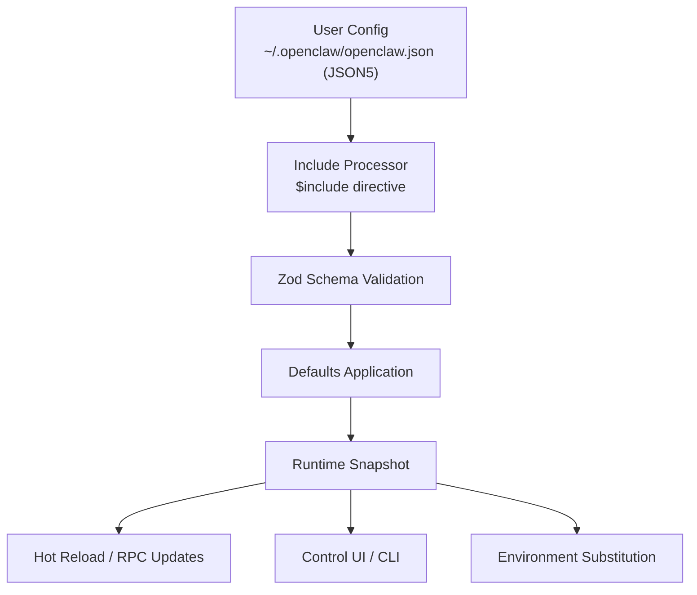
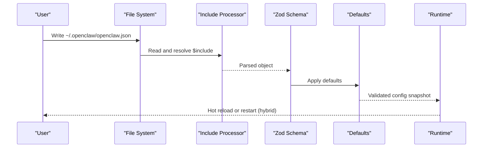
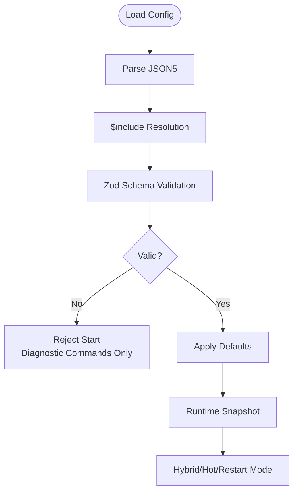
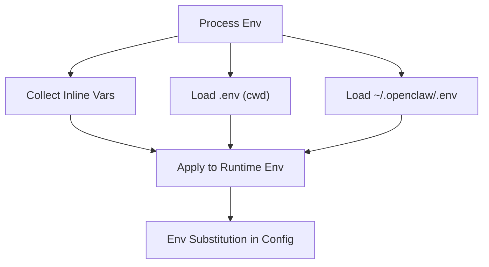
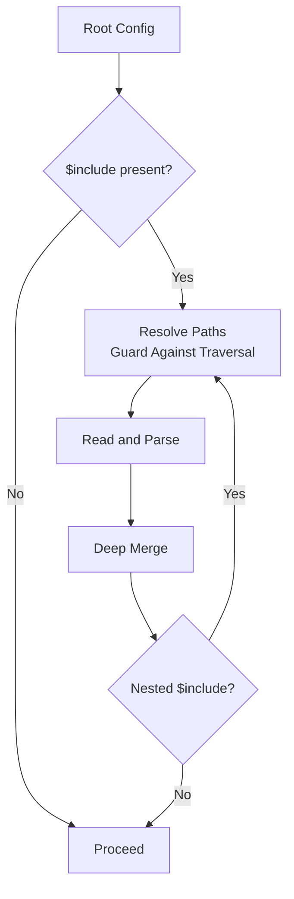
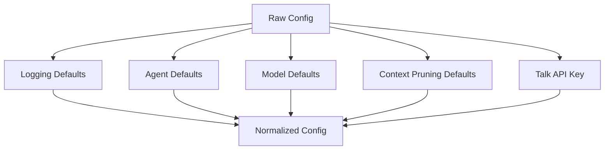
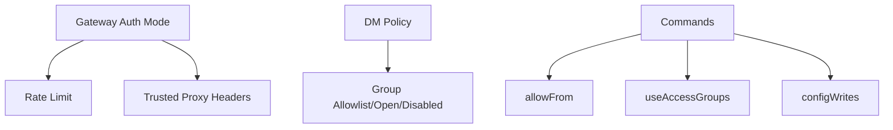
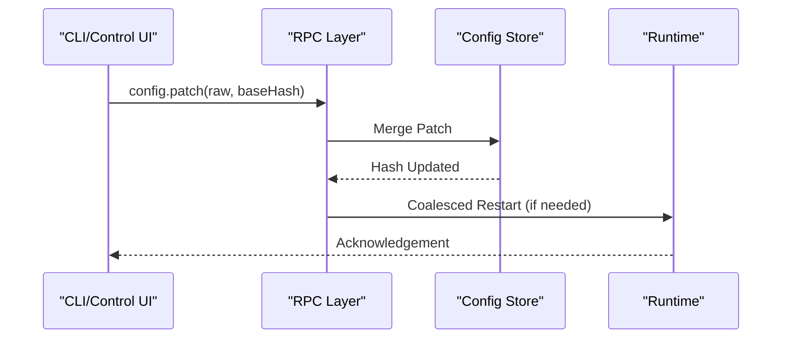
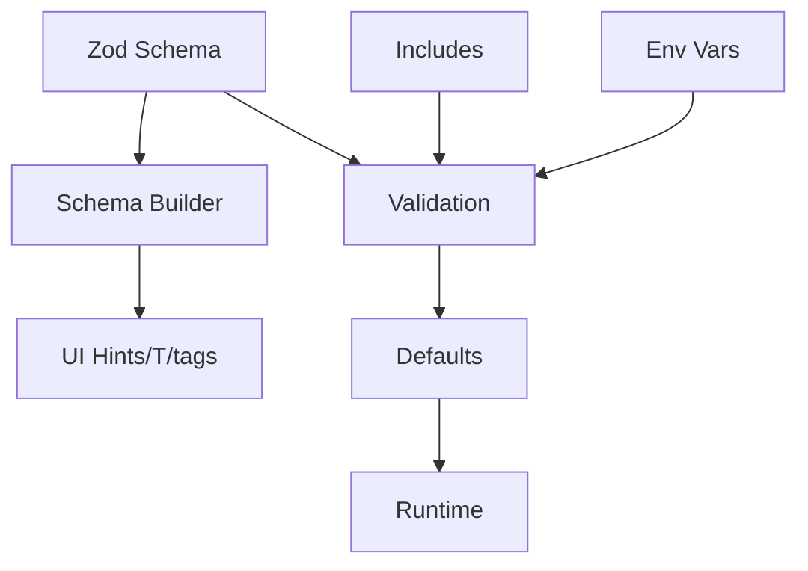

# Configuration Management

<cite>
**Referenced Files in This Document**
- [configuration.md](file://docs/gateway/configuration.md)
- [configuration-reference.md](file://docs/gateway/configuration-reference.md)
- [configuration-examples.md](file://docs/gateway/configuration-examples.md)
- [zod-schema.ts](file://src/config/zod-schema.ts)
- [defaults.ts](file://src/config/defaults.ts)
- [schema.ts](file://src/config/schema.ts)
- [env-vars.ts](file://src/config/env-vars.ts)
- [includes.ts](file://src/config/includes.ts)
- [merge-config.ts](file://src/config/merge-config.ts)
- [types.ts](file://src/config/types.ts)
</cite>

## Table of Contents
1. [Introduction](#introduction)
2. [Project Structure](#project-structure)
3. [Core Components](#core-components)
4. [Architecture Overview](#architecture-overview)
5. [Detailed Component Analysis](#detailed-component-analysis)
6. [Dependency Analysis](#dependency-analysis)
7. [Performance Considerations](#performance-considerations)
8. [Troubleshooting Guide](#troubleshooting-guide)
9. [Conclusion](#conclusion)
10. [Appendices](#appendices)

## Introduction
This document provides comprehensive guidance for managing OpenClaw gateway configuration. It covers configuration file formats, validation rules, defaults, environment variable overrides, runtime configuration changes, authentication and security policies, access controls, and practical examples for common and multi-environment setups. It also includes reference tables for supported configuration options, validation procedures, migration and backup strategies, and troubleshooting tips.

## Project Structure
OpenClaw’s configuration system centers around a JSON5 configuration file (~/.openclaw/openclaw.json) validated by a Zod schema, enriched with defaults, UI hints, and include directives. The runtime supports hot reload, programmatic updates, and environment variable substitution.

**Diagram sources**
- [configuration.md:12-13](file://docs/gateway/configuration.md#L12-L13)
- [includes.ts:340-346](file://src/config/includes.ts#L340-L346)
- [zod-schema.ts:206-800](file://src/config/zod-schema.ts#L206-L800)
- [defaults.ts:146-170](file://src/config/defaults.ts#L146-L170)
- [schema.ts:429-447](file://src/config/schema.ts#L429-L447)

**Section sources**
- [configuration.md:12-13](file://docs/gateway/configuration.md#L12-L13)
- [configuration.md:436-474](file://docs/gateway/configuration.md#L436-L474)
- [schema.ts:429-447](file://src/config/schema.ts#L429-L447)

## Core Components
- Configuration file format: JSON5 with comments and trailing commas; strict schema validation enforces correctness and rejects unknown keys.
- Validation: Zod-based schema with derived UI hints and tags; validation failures prevent the gateway from starting except for diagnostic commands.
- Defaults: Applied selectively to models, agents, logging, and context pruning to ensure safe operation.
- Includes: Modular configuration via $include with deep merge semantics, security guards against traversal and circular includes.
- Environment variables: Support for inline config vars, shell import, and env substitution; blocked dangerous keys are excluded.
- Runtime updates: Hot reload for safe changes, hybrid mode for critical changes, and RPC endpoints for programmatic updates.

**Section sources**
- [configuration.md:61-73](file://docs/gateway/configuration.md#L61-L73)
- [zod-schema.ts:206-800](file://src/config/zod-schema.ts#L206-L800)
- [defaults.ts:146-170](file://src/config/defaults.ts#L146-L170)
- [includes.ts:69-85](file://src/config/includes.ts#L69-L85)
- [env-vars.ts:13-59](file://src/config/env-vars.ts#L13-L59)
- [configuration.md:436-474](file://docs/gateway/configuration.md#L436-L474)

## Architecture Overview
The configuration lifecycle integrates parsing, inclusion, validation, defaults, and runtime application.

**Diagram sources**
- [includes.ts:340-346](file://src/config/includes.ts#L340-L346)
- [zod-schema.ts:206-800](file://src/config/zod-schema.ts#L206-L800)
- [defaults.ts:146-170](file://src/config/defaults.ts#L146-L170)
- [configuration.md:436-474](file://docs/gateway/configuration.md#L436-L474)

## Detailed Component Analysis

### Configuration File Formats and Validation
- Format: JSON5 with comments and trailing commas; $schema is allowed at root for editor tooling.
- Strict validation: Unknown keys, malformed types, or invalid values cause the gateway to refuse to start; diagnostic commands remain available.
- Schema generation: Base schema plus plugin/channel-specific augmentations; UI hints and sensitive tags applied for Control UI.

**Diagram sources**
- [configuration.md:12-13](file://docs/gateway/configuration.md#L12-L13)
- [configuration.md:61-73](file://docs/gateway/configuration.md#L61-L73)
- [schema.ts:429-447](file://src/config/schema.ts#L429-L447)

**Section sources**
- [configuration.md:12-13](file://docs/gateway/configuration.md#L12-L13)
- [configuration.md:61-73](file://docs/gateway/configuration.md#L61-L73)
- [schema.ts:429-447](file://src/config/schema.ts#L429-L447)

### Environment Variables and Overrides
- Sources: Parent process env, .env from cwd, ~/.openclaw/.env; neither overrides existing env vars.
- Inline config: env.vars and env.<key> entries are collected and applied to the runtime environment.
- Shell import: Optional import of missing keys by running the user’s login shell.
- Substitution: ${VAR} in string values; uppercase underscore names only; missing/empty vars cause load-time errors; escape with $$ to literalize.

**Diagram sources**
- [configuration.md:536-626](file://docs/gateway/configuration.md#L536-L626)
- [env-vars.ts:13-59](file://src/config/env-vars.ts#L13-L59)
- [env-vars.ts:79-97](file://src/config/env-vars.ts#L79-L97)

**Section sources**
- [configuration.md:536-626](file://docs/gateway/configuration.md#L536-L626)
- [env-vars.ts:13-59](file://src/config/env-vars.ts#L13-L59)
- [env-vars.ts:79-97](file://src/config/env-vars.ts#L79-L97)

### Configuration Includes and Modularization
- Directive: $include supports single file or array of files; later files deep-merge after earlier ones; sibling keys merge after includes.
- Security: Depth limit (10), path traversal prevention, symlink resolution checks, and boundary file read guard.
- Errors: Clear diagnostics for missing files, parse errors, and circular includes.

**Diagram sources**
- [configuration.md:412-433](file://docs/gateway/configuration.md#L412-L433)
- [includes.ts:131-176](file://src/config/includes.ts#L131-L176)
- [includes.ts:190-222](file://src/config/includes.ts#L190-L222)
- [includes.ts:340-346](file://src/config/includes.ts#L340-L346)

**Section sources**
- [configuration.md:412-433](file://docs/gateway/configuration.md#L412-L433)
- [includes.ts:69-85](file://src/config/includes.ts#L69-L85)
- [includes.ts:131-176](file://src/config/includes.ts#L131-L176)
- [includes.ts:190-222](file://src/config/includes.ts#L190-L222)
- [includes.ts:289-324](file://src/config/includes.ts#L289-L324)

### Defaults and Normalization
- Applied defaults include logging redaction policy, agent concurrency caps, model normalization, and context pruning defaults.
- Anthropic auth mode influences heartbeat intervals and cache retention defaults.
- Talk provider API key fallback is injected when applicable.

**Diagram sources**
- [defaults.ts:146-170](file://src/config/defaults.ts#L146-L170)
- [defaults.ts:349-388](file://src/config/defaults.ts#L349-L388)
- [defaults.ts:213-347](file://src/config/defaults.ts#L213-L347)
- [defaults.ts:172-207](file://src/config/defaults.ts#L172-L207)

**Section sources**
- [defaults.ts:146-170](file://src/config/defaults.ts#L146-L170)
- [defaults.ts:349-388](file://src/config/defaults.ts#L349-L388)
- [defaults.ts:213-347](file://src/config/defaults.ts#L213-L347)
- [defaults.ts:172-207](file://src/config/defaults.ts#L172-L207)

### Authentication, Security Policies, and Access Controls
- Gateway authentication modes: none, token, password, trusted-proxy; rate limiting and trusted proxy headers supported.
- Trusted proxy mode requires user header and optional allowlist; allow users list and required headers enforced.
- Channel-level access: dmPolicy (pairing, allowlist, open, disabled) and groupPolicy (allowlist, open, disabled) with provider-specific overrides.
- Command gating: allowFrom per provider, useAccessGroups flag, and channel-level configWrites gate.
- UI origins and security headers: Control UI allowed origins and HSTS enforcement.

**Diagram sources**
- [configuration-reference.md:22-43](file://docs/gateway/configuration-reference.md#L22-L43)
- [configuration-reference.md:721-755](file://docs/gateway/configuration-reference.md#L721-L755)
- [zod-schema.ts:656-688](file://src/config/zod-schema.ts#L656-L688)
- [zod-schema.ts:743-800](file://src/config/zod-schema.ts#L743-L800)

**Section sources**
- [configuration-reference.md:22-43](file://docs/gateway/configuration-reference.md#L22-L43)
- [configuration-reference.md:721-755](file://docs/gateway/configuration-reference.md#L721-L755)
- [zod-schema.ts:656-688](file://src/config/zod-schema.ts#L656-L688)
- [zod-schema.ts:743-800](file://src/config/zod-schema.ts#L743-L800)

### Runtime Configuration Changes and Programmatic Updates
- Hot reload modes: hybrid (default), hot, restart, off; hybrid applies safe changes and restarts for critical ones.
- RPC endpoints: config.apply (full replace), config.patch (merge patch), with rate limiting and restart coalescing.
- Control UI and CLI: Interactive wizard, one-liner CLI, and raw JSON editor.

**Diagram sources**
- [configuration.md:476-534](file://docs/gateway/configuration.md#L476-L534)
- [merge-config.ts:8-24](file://src/config/merge-config.ts#L8-L24)

**Section sources**
- [configuration.md:436-474](file://docs/gateway/configuration.md#L436-L474)
- [configuration.md:476-534](file://docs/gateway/configuration.md#L476-L534)
- [merge-config.ts:8-24](file://src/config/merge-config.ts#L8-L24)

### Common Configuration Scenarios and Multi-Environment Setups
- Minimal and recommended starters, secure DM mode, OAuth with API key failover, work bot restrictions, and local models only.
- Multi-platform setup across WhatsApp, Telegram, and Discord; environment-specific overlays via includes and environment variables.

**Section sources**
- [configuration-examples.md:14-638](file://docs/gateway/configuration-examples.md#L14-L638)
- [configuration.md:412-433](file://docs/gateway/configuration.md#L412-L433)

### Configuration Migration and Backup Strategies
- Migration: Doctor commands detect and fix shape mismatches (for example, moving single-account values into accounts.default).
- Backup: Use includes to split large configs; maintain separate environments (dev/stage/prod) with overlays; snapshot runtime config via RPC for audit trails.
- Validation: Use doctor to diagnose schema issues and apply fixes; leverage schema lookup for UI hints and field-level guidance.

**Section sources**
- [configuration.md:61-73](file://docs/gateway/configuration.md#L61-L73)
- [configuration.md:412-433](file://docs/gateway/configuration.md#L412-L433)

## Dependency Analysis
The configuration pipeline depends on schema generation, validation, defaults, and include processing.

**Diagram sources**
- [zod-schema.ts:206-800](file://src/config/zod-schema.ts#L206-L800)
- [schema.ts:429-447](file://src/config/schema.ts#L429-L447)
- [defaults.ts:146-170](file://src/config/defaults.ts#L146-L170)
- [includes.ts:340-346](file://src/config/includes.ts#L340-L346)
- [env-vars.ts:79-97](file://src/config/env-vars.ts#L79-L97)

**Section sources**
- [zod-schema.ts:206-800](file://src/config/zod-schema.ts#L206-L800)
- [schema.ts:429-447](file://src/config/schema.ts#L429-L447)
- [defaults.ts:146-170](file://src/config/defaults.ts#L146-L170)
- [includes.ts:340-346](file://src/config/includes.ts#L340-L346)
- [env-vars.ts:79-97](file://src/config/env-vars.ts#L79-L97)

## Performance Considerations
- Hot reload reduces downtime for safe changes; hybrid mode balances safety and convenience.
- Include depth and file size limits protect against excessive processing.
- Defaults minimize runtime computation by precomputing safe values.

[No sources needed since this section provides general guidance]

## Troubleshooting Guide
- Validation failures: Fix schema issues via doctor; unknown keys and invalid types prevent startup.
- Environment substitution errors: Ensure uppercase underscore names and avoid missing/empty variables.
- Include errors: Check for circular includes, depth violations, and path traversal.
- Access control: Verify dmPolicy/groupPolicy and allowFrom lists; use pairing for unknown senders.
- RPC rate limiting: Respect 3 requests per 60 seconds per device/IP; observe retryAfterMs.

**Section sources**
- [configuration.md:61-73](file://docs/gateway/configuration.md#L61-L73)
- [configuration.md:536-626](file://docs/gateway/configuration.md#L536-L626)
- [includes.ts:47-63](file://src/config/includes.ts#L47-L63)
- [includes.ts:224-237](file://src/config/includes.ts#L224-L237)
- [configuration.md:476-534](file://docs/gateway/configuration.md#L476-L534)

## Conclusion
OpenClaw’s configuration system emphasizes safety, modularity, and flexibility. Strict validation, robust defaults, environment variable support, and include directives enable reliable multi-environment deployments. Hot reload and RPC updates streamline administration, while comprehensive access controls and security policies protect production systems.

[No sources needed since this section summarizes without analyzing specific files]

## Appendices

### Reference Tables: Supported Configuration Options
- Gateway server: port, mode, bind, control UI, auth, trusted proxies, tools allow/deny, health checks, reload, TLS, HTTP endpoints, security headers.
- Channels: dmPolicy, allowFrom, groupPolicy, groupAllowFrom, heartbeat, streaming, actions, retry, network/proxy, webhook, and provider-specific settings.
- Agents and models: workspace, repoRoot, skipBootstrap, bootstrapMaxChars, model primary/fallbacks, imageMaxDimensionPx, thinking/blockStreaming defaults, sandbox mode/scope, heartbeat, memory search, timeouts.
- Tools and media: allow/deny lists, exec/backgroundMs/timeout/cleanupMs, elevated allowFrom, media audio/video configuration.
- Sessions: scope, reset mode/atHour/idleMinutes, resetByChannel, resetTriggers, store, maintenance (mode/pruneAfter/maxEntries/rotateBytes/resetArchiveRetention/maxDiskBytes/highWaterBytes), typingIntervalSeconds, sendPolicy.
- Cron: enabled, store, maxConcurrentRuns, retry/backoff/retryOn, webhook/token, sessionRetention, runLog (maxBytes/keepLines), failureAlert/failureDestination.
- Hooks: enabled, path, token, defaultSessionKey, allowRequestSessionKey, allowedSessionKeyPrefixes, allowedAgentIds, maxBodyBytes, presets, transformsDir, mappings, provider-specific presets.
- Discovery, Canvas Host, Talk, UI, Browser, Logging, Commands, Approvals, Broadcast, Bindings, Audio, Media TTL, Messages, Models, Secrets, Auth profiles/order/cooldowns, ACP, Plugins, Skills.

**Section sources**
- [configuration-reference.md:18-800](file://docs/gateway/configuration-reference.md#L18-L800)
- [zod-schema.ts:206-800](file://src/config/zod-schema.ts#L206-L800)

### Configuration Validation Procedures
- Use doctor to diagnose and fix schema issues; apply --fix for automated repairs.
- Validate environment variable substitution by ensuring uppercase underscore names and avoiding unresolved references.
- Test includes with small overlays and verify deep merge behavior.

**Section sources**
- [configuration.md:61-73](file://docs/gateway/configuration.md#L61-L73)
- [configuration.md:536-626](file://docs/gateway/configuration.md#L536-L626)
- [includes.ts:69-85](file://src/config/includes.ts#L69-L85)

### Migration and Backup Strategies
- Use includes to split monolithic configs into environment-specific overlays.
- Maintain separate branches or directories for dev/stage/prod; snapshot runtime config via RPC for auditability.
- Doctor commands migrate legacy shapes and move single-account values into accounts.default.

**Section sources**
- [configuration.md:412-433](file://docs/gateway/configuration.md#L412-L433)
- [configuration.md:61-73](file://docs/gateway/configuration.md#L61-L73)