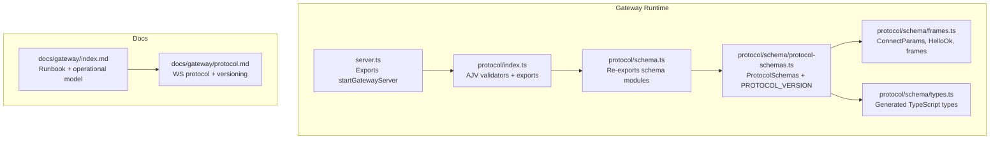
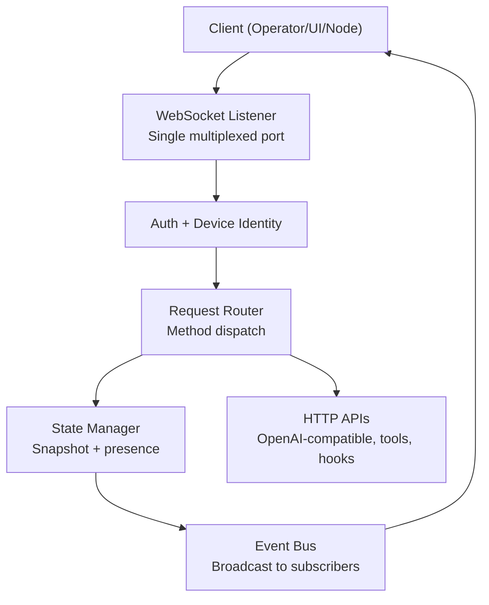
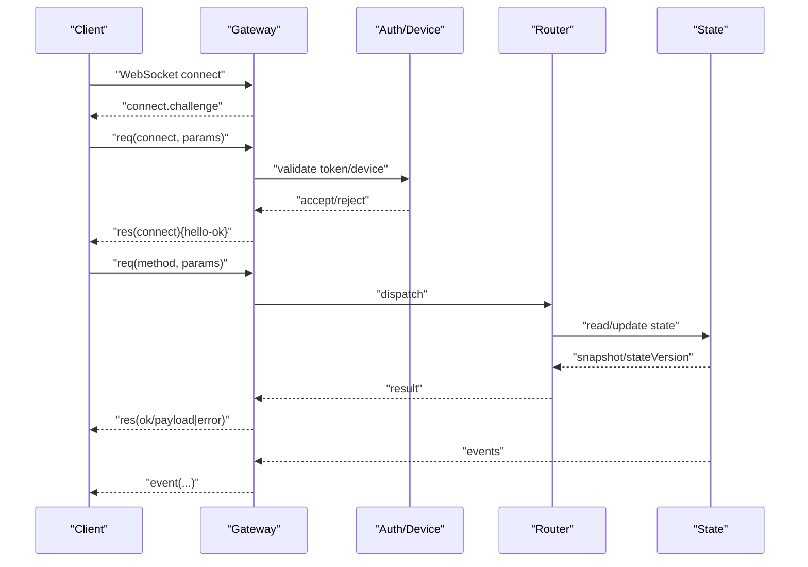
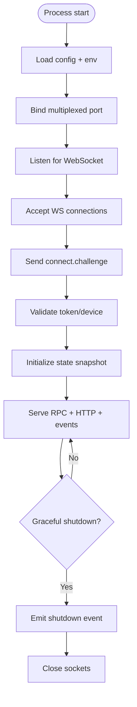
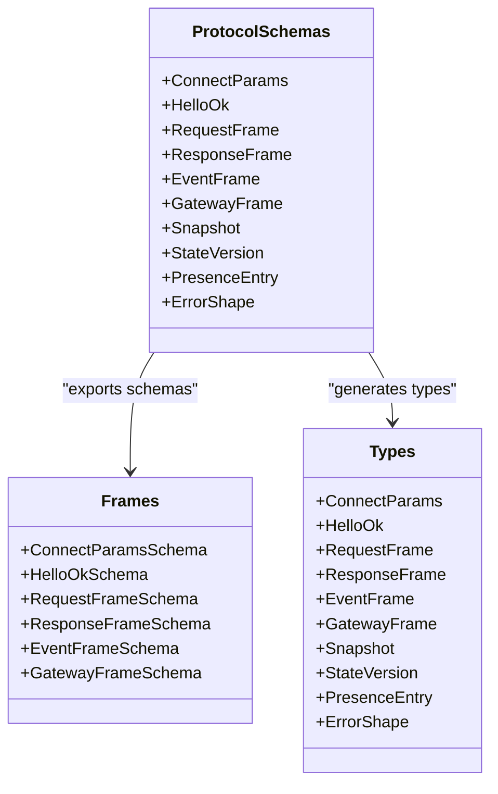
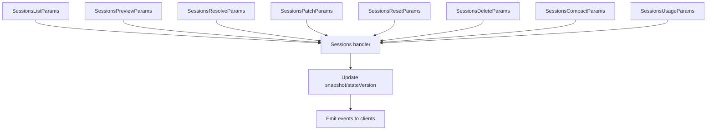
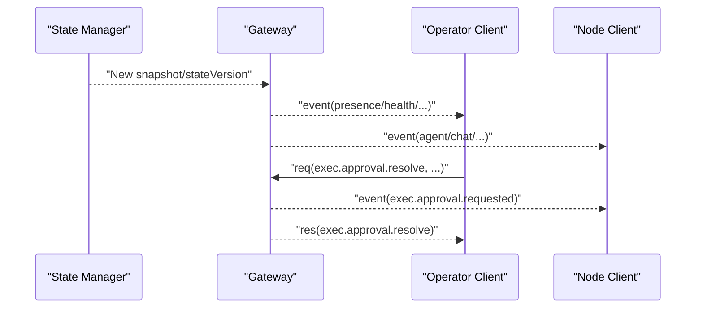
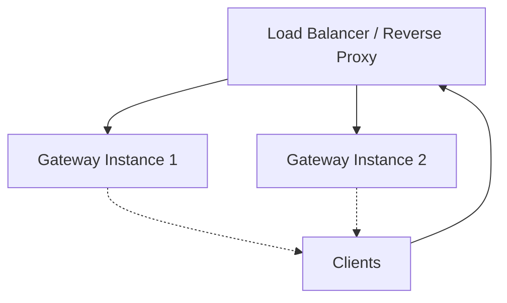
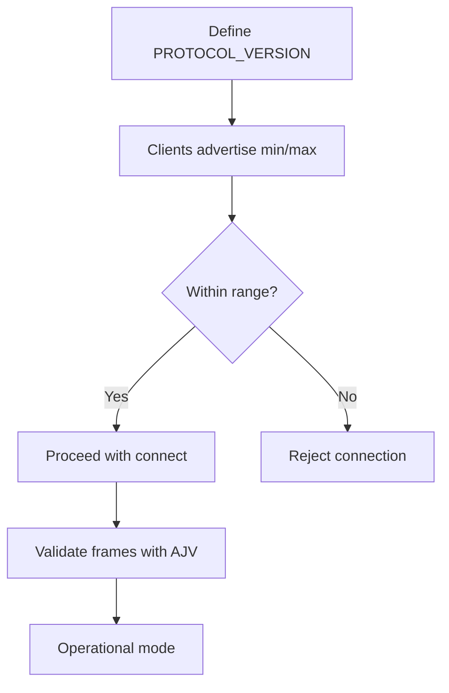
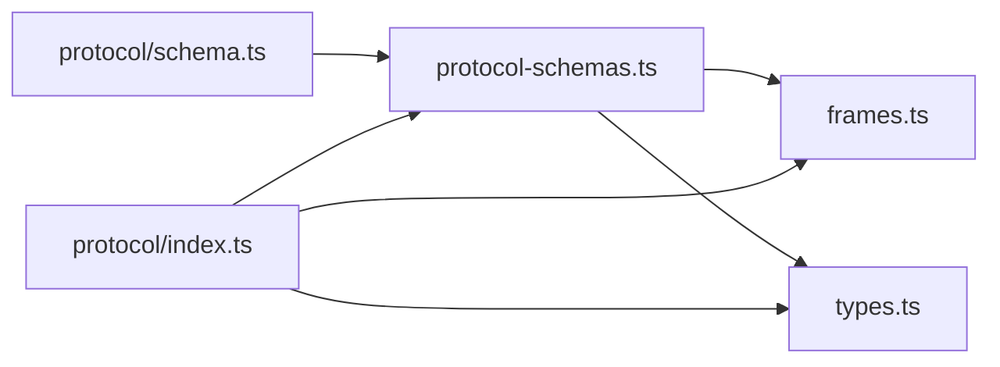

# Gateway Architecture

<cite>
**Referenced Files in This Document**
- [docs/gateway/index.md](file://docs/gateway/index.md)
- [docs/gateway/protocol.md](file://docs/gateway/protocol.md)
- [src/gateway/protocol/schema.ts](file://src/gateway/protocol/schema.ts)
- [src/gateway/protocol/schema/protocol-schemas.ts](file://src/gateway/protocol/schema/protocol-schemas.ts)
- [src/gateway/protocol/schema/frames.ts](file://src/gateway/protocol/schema/frames.ts)
- [src/gateway/protocol/schema/types.ts](file://src/gateway/protocol/schema/types.ts)
- [src/gateway/protocol/index.ts](file://src/gateway/protocol/index.ts)
- [src/gateway/server.ts](file://src/gateway/server.ts)
</cite>

## Table of Contents
1. [Introduction](#introduction)
2. [Project Structure](#project-structure)
3. [Core Components](#core-components)
4. [Architecture Overview](#architecture-overview)
5. [Detailed Component Analysis](#detailed-component-analysis)
6. [Dependency Analysis](#dependency-analysis)
7. [Performance Considerations](#performance-considerations)
8. [Troubleshooting Guide](#troubleshooting-guide)
9. [Conclusion](#conclusion)

## Introduction
This document describes the central control plane design and implementation of the Gateway, focusing on its WebSocket-based communication model, server initialization, and protocol specifications. The Gateway acts as the single control point for clients (operator tools and UI), nodes (capability hosts), and events. It manages connection handling, message routing, and state synchronization across the system. The document also covers the boot sequence, session management architecture, real-time communication patterns, scalability, load balancing, fault tolerance, protocol versions, backward compatibility, and upgrade procedures.

## Project Structure
The Gateway’s runtime and protocol are implemented in the gateway module and documented in the gateway docs. The protocol is defined using TypeBox schemas and compiled into runtime validators. The server entry points expose the WebSocket control plane and HTTP APIs on a single multiplexed port.

**Diagram sources**
- [src/gateway/server.ts:1-4](file://src/gateway/server.ts#L1-L4)
- [src/gateway/protocol/index.ts:1-673](file://src/gateway/protocol/index.ts#L1-L673)
- [src/gateway/protocol/schema.ts:1-19](file://src/gateway/protocol/schema.ts#L1-L19)
- [src/gateway/protocol/schema/protocol-schemas.ts:1-302](file://src/gateway/protocol/schema/protocol-schemas.ts#L1-L302)
- [src/gateway/protocol/schema/frames.ts:1-165](file://src/gateway/protocol/schema/frames.ts#L1-L165)
- [src/gateway/protocol/schema/types.ts:1-132](file://src/gateway/protocol/schema/types.ts#L1-L132)
- [docs/gateway/index.md:1-262](file://docs/gateway/index.md#L1-L262)
- [docs/gateway/protocol.md:1-268](file://docs/gateway/protocol.md#L1-L268)

**Section sources**
- [docs/gateway/index.md:68-124](file://docs/gateway/index.md#L68-L124)
- [docs/gateway/protocol.md:10-31](file://docs/gateway/protocol.md#L10-L31)

## Core Components
- WebSocket control plane and RPC: The Gateway accepts connections over WebSocket, requiring a first-frame connect handshake. It supports requests, responses, and event frames.
- Single multiplexed port: The same port serves WebSocket control/RPC, HTTP APIs (OpenAI-compatible, Responses, tools invoke), and the Control UI/hooks.
- Protocol definition: The protocol is defined with TypeBox schemas and compiled into AJV validators for runtime validation.
- Server entrypoints: The server exposes a start function and related types for external integration.

Key implementation references:
- Server exports and entrypoint: [server.ts:1-4](file://src/gateway/server.ts#L1-L4)
- Protocol schema re-exports: [protocol/schema.ts:1-19](file://src/gateway/protocol/schema.ts#L1-L19)
- Protocol schemas and version: [protocol-schemas.ts:1-302](file://src/gateway/protocol/schema/protocol-schemas.ts#L1-L302)
- Frame schemas (connect, hello-ok, req/res/event): [frames.ts:1-165](file://src/gateway/protocol/schema/frames.ts#L1-L165)
- Generated types: [types.ts:1-132](file://src/gateway/protocol/schema/types.ts#L1-L132)
- Validators and error formatting: [protocol/index.ts:1-673](file://src/gateway/protocol/index.ts#L1-L673)

**Section sources**
- [src/gateway/server.ts:1-4](file://src/gateway/server.ts#L1-L4)
- [src/gateway/protocol/schema.ts:1-19](file://src/gateway/protocol/schema.ts#L1-L19)
- [src/gateway/protocol/schema/protocol-schemas.ts:162-302](file://src/gateway/protocol/schema/protocol-schemas.ts#L162-L302)
- [src/gateway/protocol/schema/frames.ts:20-165](file://src/gateway/protocol/schema/frames.ts#L20-L165)
- [src/gateway/protocol/schema/types.ts:1-132](file://src/gateway/protocol/schema/types.ts#L1-L132)
- [src/gateway/protocol/index.ts:253-458](file://src/gateway/protocol/index.ts#L253-L458)

## Architecture Overview
The Gateway is a long-running control plane process that:
- Listens on a single multiplexed port for WebSocket control/RPC and HTTP APIs.
- Enforces authentication and device identity at connect time.
- Maintains presence and state snapshots for operators and nodes.
- Routes requests to internal handlers and emits events to subscribed clients.
- Supports graceful shutdown and emits a shutdown event before closing sockets.

[No sources needed since this diagram shows conceptual workflow, not actual code structure]

## Detailed Component Analysis

### WebSocket Communication Model
- Transport: WebSocket with text frames containing JSON payloads.
- Handshake: The first frame must be a connect request; the server responds with a challenge and validates credentials and device identity.
- Framing: Three frame types:
  - Request: {type:"req", id, method, params}
  - Response: {type:"res", id, ok, payload|error}
  - Event: {type:"event", event, payload, seq?, stateVersion?}
- Roles and scopes:
  - Operator: control plane client with roles and scopes.
  - Node: capability host with declared capabilities, commands, and permissions.
- Versioning: Protocol version is defined and enforced; clients specify min/max protocol support.

**Diagram sources**
- [docs/gateway/protocol.md:17-134](file://docs/gateway/protocol.md#L17-L134)
- [src/gateway/protocol/schema/frames.ts:20-165](file://src/gateway/protocol/schema/frames.ts#L20-L165)
- [src/gateway/protocol/schema/protocol-schemas.ts:162-302](file://src/gateway/protocol/schema/protocol-schemas.ts#L162-L302)

**Section sources**
- [docs/gateway/protocol.md:10-134](file://docs/gateway/protocol.md#L10-L134)
- [src/gateway/protocol/schema/frames.ts:20-165](file://src/gateway/protocol/schema/frames.ts#L20-L165)

### Server Initialization and Boot Sequence
- The server is started via an exported function and integrates with the broader runtime.
- The runbook documents typical startup, verification, and supervision steps, including port binding, auth enforcement, and service lifecycle.

**Diagram sources**
- [docs/gateway/index.md:27-124](file://docs/gateway/index.md#L27-L124)
- [src/gateway/server.ts:1-4](file://src/gateway/server.ts#L1-L4)

**Section sources**
- [docs/gateway/index.md:27-124](file://docs/gateway/index.md#L27-L124)
- [src/gateway/server.ts:1-4](file://src/gateway/server.ts#L1-L4)

### Protocol Specifications and Validation
- Protocol schemas define all request/response and event payloads, including connect parameters, hello-ok, and state/version structures.
- PROTOCOL_VERSION is centrally defined and used to enforce compatibility.
- Runtime validators are generated via AJV from TypeBox schemas, enabling robust validation and error formatting.

**Diagram sources**
- [src/gateway/protocol/schema/protocol-schemas.ts:162-302](file://src/gateway/protocol/schema/protocol-schemas.ts#L162-L302)
- [src/gateway/protocol/schema/frames.ts:1-165](file://src/gateway/protocol/schema/frames.ts#L1-L165)
- [src/gateway/protocol/schema/types.ts:1-132](file://src/gateway/protocol/schema/types.ts#L1-L132)

**Section sources**
- [src/gateway/protocol/schema/protocol-schemas.ts:162-302](file://src/gateway/protocol/schema/protocol-schemas.ts#L162-L302)
- [src/gateway/protocol/schema/frames.ts:20-165](file://src/gateway/protocol/schema/frames.ts#L20-L165)
- [src/gateway/protocol/schema/types.ts:1-132](file://src/gateway/protocol/schema/types.ts#L1-L132)
- [src/gateway/protocol/index.ts:253-458](file://src/gateway/protocol/index.ts#L253-L458)

### Session Management Architecture
- Sessions are managed through dedicated schemas and methods for listing, previewing, resolving, patching, resetting, deleting, compacting, and usage queries.
- The state snapshot and stateVersion fields in events allow clients to track and reconcile state transitions.

**Diagram sources**
- [src/gateway/protocol/schema/protocol-schemas.ts:204-211](file://src/gateway/protocol/schema/protocol-schemas.ts#L204-L211)
- [src/gateway/protocol/schema/protocol-schemas.ts:291-296](file://src/gateway/protocol/schema/protocol-schemas.ts#L291-L296)

**Section sources**
- [src/gateway/protocol/schema/protocol-schemas.ts:204-211](file://src/gateway/protocol/schema/protocol-schemas.ts#L204-L211)
- [src/gateway/protocol/schema/protocol-schemas.ts:291-296](file://src/gateway/protocol/schema/protocol-schemas.ts#L291-L296)

### Real-Time Communication Patterns
- Presence: The system maintains presence entries keyed by device identity, enabling UIs to represent a single row per device even when connecting with multiple roles.
- Events: The Gateway emits periodic tick events and system-wide events (e.g., health, shutdown). Clients receive stateVersion updates to keep their views synchronized.
- Approvals: Execution approvals are coordinated via explicit request/response pairs with broadcast events for operator resolution.

**Diagram sources**
- [docs/gateway/protocol.md:166-190](file://docs/gateway/protocol.md#L166-L190)
- [src/gateway/protocol/schema/protocol-schemas.ts:276-282](file://src/gateway/protocol/schema/protocol-schemas.ts#L276-L282)

**Section sources**
- [docs/gateway/protocol.md:166-190](file://docs/gateway/protocol.md#L166-L190)
- [src/gateway/protocol/schema/protocol-schemas.ts:276-282](file://src/gateway/protocol/schema/protocol-schemas.ts#L276-L282)

### Scalability, Load Balancing, and Fault Tolerance
- Single multiplexed port simplifies deployment and reduces operational overhead.
- The runbook documents supervised runs and service lifecycle management across platforms.
- Graceful shutdown emits a shutdown event prior to closing sockets, ensuring clients can react appropriately.

[No sources needed since this diagram shows conceptual workflow, not actual code structure]

**Section sources**
- [docs/gateway/index.md:125-170](file://docs/gateway/index.md#L125-L170)
- [docs/gateway/index.md:246-251](file://docs/gateway/index.md#L246-L251)

### Protocol Versions, Backward Compatibility, and Upgrades
- Protocol version is defined centrally and enforced at connect time.
- Clients advertise min/max protocol support; mismatches are rejected.
- Upgrade procedures rely on generating and validating protocol schemas and models.

**Diagram sources**
- [src/gateway/protocol/schema/protocol-schemas.ts:301-301](file://src/gateway/protocol/schema/protocol-schemas.ts#L301-L301)
- [docs/gateway/protocol.md:191-200](file://docs/gateway/protocol.md#L191-L200)
- [src/gateway/protocol/index.ts:253-262](file://src/gateway/protocol/index.ts#L253-L262)

**Section sources**
- [src/gateway/protocol/schema/protocol-schemas.ts:301-301](file://src/gateway/protocol/schema/protocol-schemas.ts#L301-L301)
- [docs/gateway/protocol.md:191-200](file://docs/gateway/protocol.md#L191-L200)
- [src/gateway/protocol/index.ts:253-262](file://src/gateway/protocol/index.ts#L253-L262)

## Dependency Analysis
The Gateway’s protocol stack is modular:
- schema.ts re-exports all protocol schema modules.
- protocol-schemas.ts aggregates all schemas and exports PROTOCOL_VERSION.
- frames.ts defines the core frame schemas used by all clients.
- types.ts generates strongly typed interfaces from schemas.
- protocol/index.ts compiles schemas into validators and formats validation errors.

**Diagram sources**
- [src/gateway/protocol/schema.ts:1-19](file://src/gateway/protocol/schema.ts#L1-L19)
- [src/gateway/protocol/schema/protocol-schemas.ts:1-302](file://src/gateway/protocol/schema/protocol-schemas.ts#L1-L302)
- [src/gateway/protocol/schema/frames.ts:1-165](file://src/gateway/protocol/schema/frames.ts#L1-L165)
- [src/gateway/protocol/schema/types.ts:1-132](file://src/gateway/protocol/schema/types.ts#L1-L132)
- [src/gateway/protocol/index.ts:1-673](file://src/gateway/protocol/index.ts#L1-L673)

**Section sources**
- [src/gateway/protocol/schema.ts:1-19](file://src/gateway/protocol/schema.ts#L1-L19)
- [src/gateway/protocol/schema/protocol-schemas.ts:1-302](file://src/gateway/protocol/schema/protocol-schemas.ts#L1-L302)
- [src/gateway/protocol/schema/frames.ts:1-165](file://src/gateway/protocol/schema/frames.ts#L1-L165)
- [src/gateway/protocol/schema/types.ts:1-132](file://src/gateway/protocol/schema/types.ts#L1-L132)
- [src/gateway/protocol/index.ts:1-673](file://src/gateway/protocol/index.ts#L1-L673)

## Performance Considerations
- Single-port multiplexing reduces connection overhead and simplifies scaling.
- StateVersion and snapshot-based eventing minimize redundant data transmission.
- Validation via AJV ensures early rejection of malformed frames, reducing backend load.
- Graceful shutdown and controlled event emission prevent abrupt disconnections.

[No sources needed since this section provides general guidance]

## Troubleshooting Guide
- Authentication failures: Ensure the correct token/device token is supplied and matches the server configuration. The protocol docs enumerate error details and recommended next steps.
- Device identity and pairing: Clients must include a stable device identity and sign the server-provided nonce. Legacy signatures are accepted for compatibility, but paired-device metadata governs command policy.
- Connectivity issues: Verify the port binding mode and auth settings; the runbook outlines common failure signatures and remediation steps.

**Section sources**
- [docs/gateway/protocol.md:200-230](file://docs/gateway/protocol.md#L200-L230)
- [docs/gateway/protocol.md:216-256](file://docs/gateway/protocol.md#L216-L256)
- [docs/gateway/index.md:235-244](file://docs/gateway/index.md#L235-L244)

## Conclusion
The Gateway’s architecture centers on a robust WebSocket control plane that unifies client, node, and event management on a single multiplexed port. Its protocol is formally defined with TypeBox schemas, validated at runtime, and versioned to ensure backward compatibility. The server initialization, session management, and real-time communication patterns collectively provide a scalable, observable, and operable control plane suitable for diverse client types and environments.