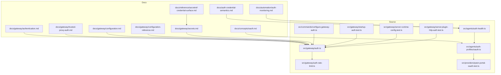
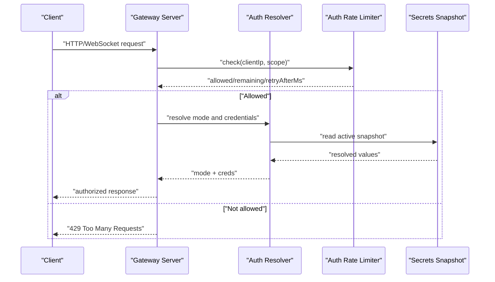
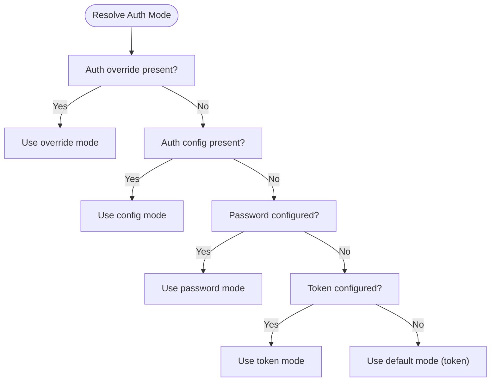
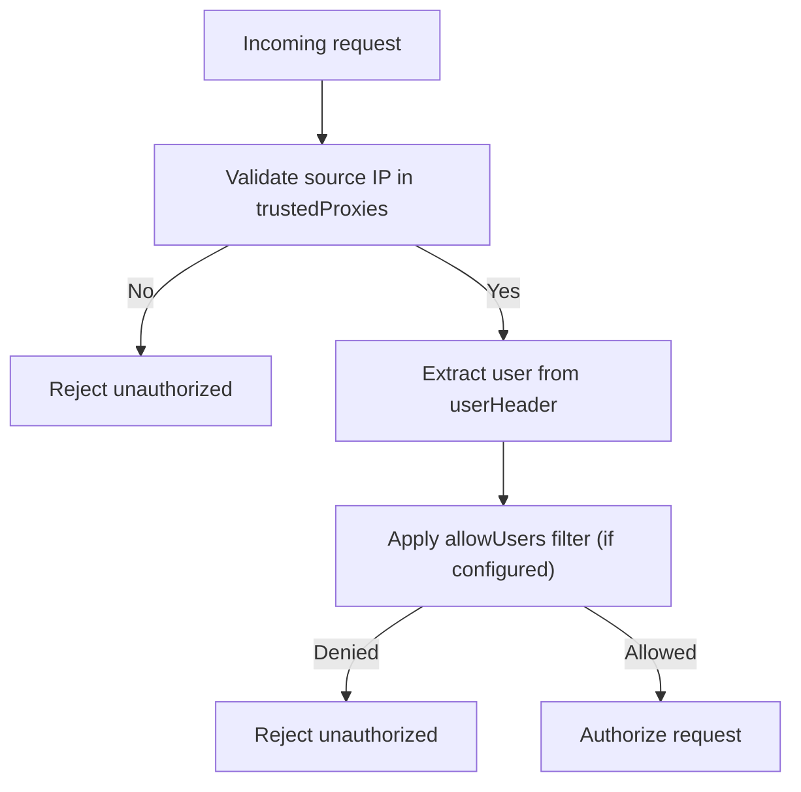
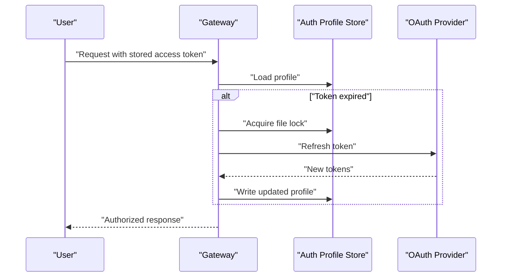
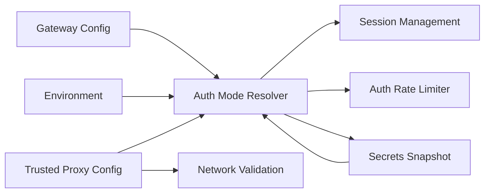

# Gateway Authentication

<cite>
**Referenced Files in This Document**
- [authentication.md](file://docs/gateway/authentication.md)
- [trusted-proxy-auth.md](file://docs/gateway/trusted-proxy-auth.md)
- [oauth.md](file://docs/concepts/oauth.md)
- [auth-credential-semantics.md](file://docs/auth-credential-semantics.md)
- [auth-monitoring.md](file://docs/automation/auth-monitoring.md)
- [configuration.md](file://docs/gateway/configuration.md)
- [configuration-reference.md](file://docs/gateway/configuration-reference.md)
- [secrets.md](file://docs/gateway/secrets.md)
- [secretref-credential-surface.md](file://docs/reference/secretref-credential-surface.md)
- [auth-rate-limit.ts](file://src/gateway/auth-rate-limit.ts)
- [auth.ts](file://src/gateway/auth.ts)
- [configure.gateway-auth.ts](file://src/commands/configure.gateway-auth.ts)
- [startup-auth.test.ts](file://src/gateway/startup-auth.test.ts)
- [server-runtime-config.test.ts](file://src/gateway/server-runtime-config.test.ts)
- [server.plugin-http-auth.test.ts](file://src/gateway/server.plugin-http-auth.test.ts)
- [auth-health.ts](file://src/agents/auth-health.ts)
- [oauth.ts](file://src/agents/auth-profiles/oauth.ts)
- [qwen-portal-oauth.test.ts](file://src/providers/qwen-portal-oauth.test.ts)
- [README.md](file://docs/security/README.md)
</cite>

## Table of Contents
1. [Introduction](#introduction)
2. [Project Structure](#project-structure)
3. [Core Components](#core-components)
4. [Architecture Overview](#architecture-overview)
5. [Detailed Component Analysis](#detailed-component-analysis)
6. [Dependency Analysis](#dependency-analysis)
7. [Performance Considerations](#performance-considerations)
8. [Troubleshooting Guide](#troubleshooting-guide)
9. [Conclusion](#conclusion)
10. [Appendices](#appendices)

## Introduction
This document provides comprehensive gateway authentication documentation for OpenClaw. It covers all supported authentication mechanisms, security policies, and operational guidance. Topics include token-based authentication, password-based authentication, trusted proxy authentication, OAuth integration, API key management, credential rotation, rate limiting, session management, and security hardening. Guidance is grounded in repository documentation and source code where applicable.

## Project Structure
Authentication-related materials are organized across:
- Conceptual and procedural docs for OAuth, authentication, trusted proxy, and secrets
- CLI and configuration references
- Source modules implementing authentication modes, rate limiting, and credential resolution

**Diagram sources**
- [authentication.md](file://docs/gateway/authentication.md#L1-L180)
- [trusted-proxy-auth.md](file://docs/gateway/trusted-proxy-auth.md#L1-L330)
- [oauth.md](file://docs/concepts/oauth.md#L1-L159)
- [auth-credential-semantics.md](file://docs/auth-credential-semantics.md#L1-L46)
- [auth-monitoring.md](file://docs/automation/auth-monitoring.md#L1-L45)
- [configuration.md](file://docs/gateway/configuration.md#L1-L547)
- [configuration-reference.md](file://docs/gateway/configuration-reference.md#L1-L1200)
- [secrets.md](file://docs/gateway/secrets.md#L1-L452)
- [secretref-credential-surface.md](file://docs/reference/secretref-credential-surface.md#L1-L130)
- [auth.ts](file://src/gateway/auth.ts#L249-L292)
- [configure.gateway-auth.ts](file://src/commands/configure.gateway-auth.ts#L40-L76)
- [auth-rate-limit.ts](file://src/gateway/auth-rate-limit.ts#L1-L117)
- [startup-auth.test.ts](file://src/gateway/startup-auth.test.ts#L308-L360)
- [server-runtime-config.test.ts](file://src/gateway/server-runtime-config.test.test.ts#L70-L112)
- [server.plugin-http-auth.test.ts](file://src/gateway/server.plugin-http-auth.test.ts#L84-L111)
- [auth-health.ts](file://src/agents/auth-health.ts#L165-L197)
- [oauth.ts](file://src/agents/auth-profiles/oauth.ts#L154-L487)
- [qwen-portal-oauth.test.ts](file://src/providers/qwen-portal-oauth.test.ts#L50-L105)

**Section sources**
- [authentication.md](file://docs/gateway/authentication.md#L1-L180)
- [trusted-proxy-auth.md](file://docs/gateway/trusted-proxy-auth.md#L1-L330)
- [oauth.md](file://docs/concepts/oauth.md#L1-L159)
- [auth-credential-semantics.md](file://docs/auth-credential-semantics.md#L1-L46)
- [auth-monitoring.md](file://docs/automation/auth-monitoring.md#L1-L45)
- [configuration.md](file://docs/gateway/configuration.md#L1-L547)
- [configuration-reference.md](file://docs/gateway/configuration-reference.md#L1-L1200)
- [secrets.md](file://docs/gateway/secrets.md#L1-L452)
- [secretref-credential-surface.md](file://docs/reference/secretref-credential-surface.md#L1-L130)

## Core Components
- Authentication modes and resolution:
  - Token, password, trusted-proxy, and none modes are supported. Mode selection considers configuration, environment, and defaults.
  - Trusted proxy mode requires explicit configuration of trusted proxies, user header, and optional allowlist.
- OAuth lifecycle:
  - OAuth tokens are stored per-agent and refreshed under a file lock when needed.
  - Profiles include expiration timestamps; refresh is automatic when expired.
- Secrets management:
  - SecretRef contract supports env, file, and exec sources. Active surface filtering ensures only effective credentials are validated.
- Rate limiting:
  - In-memory sliding-window limiter for authentication attempts with configurable thresholds and scopes.
- Security headers:
  - Default security headers applied; optional Strict-Transport-Security can be configured.

**Section sources**
- [auth.ts](file://src/gateway/auth.ts#L249-L292)
- [configure.gateway-auth.ts](file://src/commands/configure.gateway-auth.ts#L40-L76)
- [oauth.ts](file://src/agents/auth-profiles/oauth.ts#L154-L487)
- [auth-health.ts](file://src/agents/auth-health.ts#L165-L197)
- [secrets.md](file://docs/gateway/secrets.md#L1-L452)
- [auth-rate-limit.ts](file://src/gateway/auth-rate-limit.ts#L1-L117)
- [server.plugin-http-auth.test.ts](file://src/gateway/server.plugin-http-auth.test.ts#L84-L111)

## Architecture Overview
The authentication subsystem integrates configuration, credential resolution, and enforcement across startup, runtime, and plugin boundaries.

**Diagram sources**
- [auth.ts](file://src/gateway/auth.ts#L249-L292)
- [auth-rate-limit.ts](file://src/gateway/auth-rate-limit.ts#L59-L72)
- [secrets.md](file://docs/gateway/secrets.md#L16-L26)

## Detailed Component Analysis

### Authentication Modes and Resolution
- Mode determination:
  - Priority order considers auth override, config, password, token, and default to token.
  - Trusted proxy mode requires explicit configuration and validation of bind and trusted proxies.
- Configuration building:
  - CLI builder supports token, password, and trusted-proxy modes with required fields for trusted proxy.
- Startup behavior:
  - Token generation is suppressed in trusted-proxy and none modes; undefined overrides are treated as no override.

**Diagram sources**
- [auth.ts](file://src/gateway/auth.ts#L263-L278)
- [configure.gateway-auth.ts](file://src/commands/configure.gateway-auth.ts#L40-L76)
- [startup-auth.test.ts](file://src/gateway/startup-auth.test.ts#L308-L360)

**Section sources**
- [auth.ts](file://src/gateway/auth.ts#L249-L292)
- [configure.gateway-auth.ts](file://src/commands/configure.gateway-auth.ts#L40-L76)
- [startup-auth.test.ts](file://src/gateway/startup-auth.test.ts#L308-L360)

### Trusted Proxy Authentication
- Purpose:
  - Delegate authentication to a trusted reverse proxy; OpenClaw authorizes based on headers and trusted proxy IP list.
- Configuration:
  - Requires gateway.bind, gateway.trustedProxies, gateway.auth.mode = "trusted-proxy", and gateway.auth.trustedProxy.userHeader.
  - Optional allowUsers and requiredHeaders can further constrain access.
- Security checklist:
  - Proxy is the only path, trustedProxies minimal, headers stripped, TLS termination at proxy, allowUsers set.
- Validation:
  - Rejects loopback bind without loopback trusted proxy; rejects LAN bind without trustedProxies.

**Diagram sources**
- [trusted-proxy-auth.md](file://docs/gateway/trusted-proxy-auth.md#L30-L49)
- [trusted-proxy-auth.md](file://docs/gateway/trusted-proxy-auth.md#L50-L90)
- [server-runtime-config.test.ts](file://src/gateway/server-runtime-config.test.ts#L70-L112)

**Section sources**
- [trusted-proxy-auth.md](file://docs/gateway/trusted-proxy-auth.md#L1-L330)
- [server-runtime-config.test.ts](file://src/gateway/server-runtime-config.test.ts#L70-L112)

### OAuth Integration
- Token exchange and storage:
  - OAuth tokens are stored per-agent in auth-profiles.json; refresh performed under file lock.
  - Profiles include expires timestamp; refresh occurs when expired.
- Multiple accounts and profiles:
  - Separate agents or multiple profiles per agent; routing via session overrides or global ordering.
- Health and monitoring:
  - OAuth status computed with warning thresholds; automated monitoring via CLI check and optional scripts.

**Diagram sources**
- [oauth.ts](file://src/agents/auth-profiles/oauth.ts#L154-L173)
- [oauth.ts](file://src/agents/auth-profiles/oauth.ts#L175-L177)
- [auth-health.ts](file://src/agents/auth-health.ts#L165-L197)

**Section sources**
- [oauth.md](file://docs/concepts/oauth.md#L1-L159)
- [oauth.ts](file://src/agents/auth-profiles/oauth.ts#L154-L487)
- [auth-health.ts](file://src/agents/auth-health.ts#L165-L197)
- [auth-monitoring.md](file://docs/automation/auth-monitoring.md#L1-L45)

### API Key Management and Rotation
- Priority order for API keys:
  - OPENCLAW_LIVE_<PROVIDER>_KEY (single override), <PROVIDER>_API_KEYS, <PROVIDER>_API_KEY, <PROVIDER>_API_KEY_*.
  - Deduplication before use; retry only on rate-limit errors.
- Configuration surfaces:
  - SecretRef supported for many apiKey fields; active surface filtering applies.

**Section sources**
- [authentication.md](file://docs/gateway/authentication.md#L123-L139)
- [secretref-credential-surface.md](file://docs/reference/secretref-credential-surface.md#L25-L42)
- [secrets.md](file://docs/gateway/secrets.md#L27-L51)

### Password-Based Authentication
- Configuration:
  - Password mode supported via configuration or CLI builder; password precedence follows config-first policy.
- Security headers:
  - Default security headers applied to HTTP responses.

**Section sources**
- [configure.gateway-auth.ts](file://src/commands/configure.gateway-auth.ts#L65-L68)
- [server.plugin-http-auth.test.ts](file://src/gateway/server.plugin-http-auth.test.ts#L84-L111)

### Authentication Flow and Credential Validation
- Credential semantics:
  - Stable reason codes for eligibility and resolution; token credentials support inline token or tokenRef.
- Doctor and probe:
  - Stable reason codes and messaging for credential probes and doctor output.

**Section sources**
- [auth-credential-semantics.md](file://docs/auth-credential-semantics.md#L12-L46)

### Security Headers and Hardening
- Default headers:
  - X-Content-Type-Options, Referrer-Policy applied by default.
- Strict-Transport-Security:
  - Optional header value or explicit disable; recommended to terminate TLS at proxy.

**Section sources**
- [server.plugin-http-auth.test.ts](file://src/gateway/server.plugin-http-auth.test.ts#L84-L111)
- [trusted-proxy-auth.md](file://docs/gateway/trusted-proxy-auth.md#L91-L128)

## Dependency Analysis
Authentication depends on configuration, secrets, and runtime validation. Trusted proxy mode introduces strict dependency on proxy configuration and network topology.

**Diagram sources**
- [auth.ts](file://src/gateway/auth.ts#L249-L292)
- [configure.gateway-auth.ts](file://src/commands/configure.gateway-auth.ts#L40-L76)
- [secrets.md](file://docs/gateway/secrets.md#L16-L26)
- [auth-rate-limit.ts](file://src/gateway/auth-rate-limit.ts#L59-L72)

**Section sources**
- [auth.ts](file://src/gateway/auth.ts#L249-L292)
- [configure.gateway-auth.ts](file://src/commands/configure.gateway-auth.ts#L40-L76)
- [secrets.md](file://docs/gateway/secrets.md#L16-L26)
- [auth-rate-limit.ts](file://src/gateway/auth-rate-limit.ts#L1-L117)

## Performance Considerations
- Rate limiting:
  - In-memory sliding window prevents brute force; configurable max attempts, window, and lockout durations.
- Secrets resolution:
  - Atomic snapshot activation avoids secret provider outages on hot paths; reload uses atomic swap.
- OAuth refresh:
  - File lock prevents concurrent refresh; automatic refresh reduces manual intervention.

[No sources needed since this section provides general guidance]

## Troubleshooting Guide
Common issues and resolutions:
- Trusted proxy errors:
  - "trusted_proxy_untrusted_source": verify proxy IP and trustedProxies configuration.
  - "trusted_proxy_user_missing": ensure proxy passes user header and user is authenticated.
  - "trusted_proxy_missing_header_*": confirm required headers are present and not stripped.
  - "trusted_proxy_user_not_allowed": adjust allowUsers or remove allowlist.
  - WebSocket failures: ensure proxy supports WebSocket upgrades and passes identity headers.
- OAuth problems:
  - "OAuth token refresh failed": re-authenticate or check provider status; use doctor and monitor scripts.
  - Expiring/expired credentials: use CLI check and automation scripts to detect and remediate.
- Token and password:
  - Token generation suppressed in trusted-proxy and none modes; ensure correct mode selection.
  - Default security headers applied; verify proxy TLS termination if HSTS is desired.

**Section sources**
- [trusted-proxy-auth.md](file://docs/gateway/trusted-proxy-auth.md#L276-L322)
- [auth-monitoring.md](file://docs/automation/auth-monitoring.md#L14-L27)
- [startup-auth.test.ts](file://src/gateway/startup-auth.test.ts#L319-L344)
- [server.plugin-http-auth.test.ts](file://src/gateway/server.plugin-http-auth.test.ts#L84-L111)

## Conclusion
OpenClaw provides robust, flexible authentication with clear separation of concerns across modes, secrets, and security headers. Trusted proxy mode centralizes identity to a proxy while maintaining strict configuration requirements. OAuth and API key management integrate seamlessly with secrets and credential semantics. Operational tooling supports health monitoring and automation. Adhering to the security recommendations and validation patterns outlined here ensures a secure and maintainable deployment.

[No sources needed since this section summarizes without analyzing specific files]

## Appendices

### Configuration Examples and References
- Authentication configuration reference and examples are available in the configuration and configuration reference docs.
- Trusted proxy configuration includes examples for Pomerium, Caddy, nginx + oauth2-proxy, and Traefik.

**Section sources**
- [configuration.md](file://docs/gateway/configuration.md#L1-L547)
- [configuration-reference.md](file://docs/gateway/configuration-reference.md#L1-L1200)
- [trusted-proxy-auth.md](file://docs/gateway/trusted-proxy-auth.md#L137-L254)

### Security Posture and Reporting
- Security documentation and vulnerability reporting instructions are available in the security README.

**Section sources**
- [README.md](file://docs/security/README.md#L1-L18)