# Gateway Configuration

<cite>
**Referenced Files in This Document**
- [configuration.md](file://docs/gateway/configuration.md)
- [configuration-reference.md](file://docs/gateway/configuration-reference.md)
- [configuration-examples.md](file://docs/gateway/configuration-examples.md)
- [io.ts](file://src/config/io.ts)
- [validation.ts](file://src/config/validation.ts)
- [types.gateway.ts](file://src/config/types.gateway.ts)
- [env-vars.ts](file://src/config/env-vars.ts)
- [includes.ts](file://src/config/includes.ts)
- [schema.ts](file://src/config/schema.ts)
- [port-defaults.ts](file://src/config/port-defaults.ts)
- [merge-config.ts](file://src/config/merge-config.ts)
- [qr-cli.ts](file://src/cli/qr-cli.ts)
</cite>

## Table of Contents
1. [Introduction](#introduction)
2. [Project Structure](#project-structure)
3. [Core Components](#core-components)
4. [Architecture Overview](#architecture-overview)
5. [Detailed Component Analysis](#detailed-component-analysis)
6. [Dependency Analysis](#dependency-analysis)
7. [Performance Considerations](#performance-considerations)
8. [Troubleshooting Guide](#troubleshooting-guide)
9. [Conclusion](#conclusion)
10. [Appendices](#appendices)

## Introduction
This document provides comprehensive gateway configuration guidance for OpenClaw. It explains the hierarchical configuration system, environment variable precedence, file-based configuration, reload behavior, validation, authentication, and security settings. Practical examples, conflict resolution, and production best practices are included, along with the relationship between configuration files, environment variables, and runtime overrides.

## Project Structure
OpenClaw’s configuration system centers around a JSON5 configuration file located at the user’s home directory and augmented by environment variables and include directives. The runtime validates, normalizes, and applies configuration with strict schema enforcement and hot-reload capabilities.

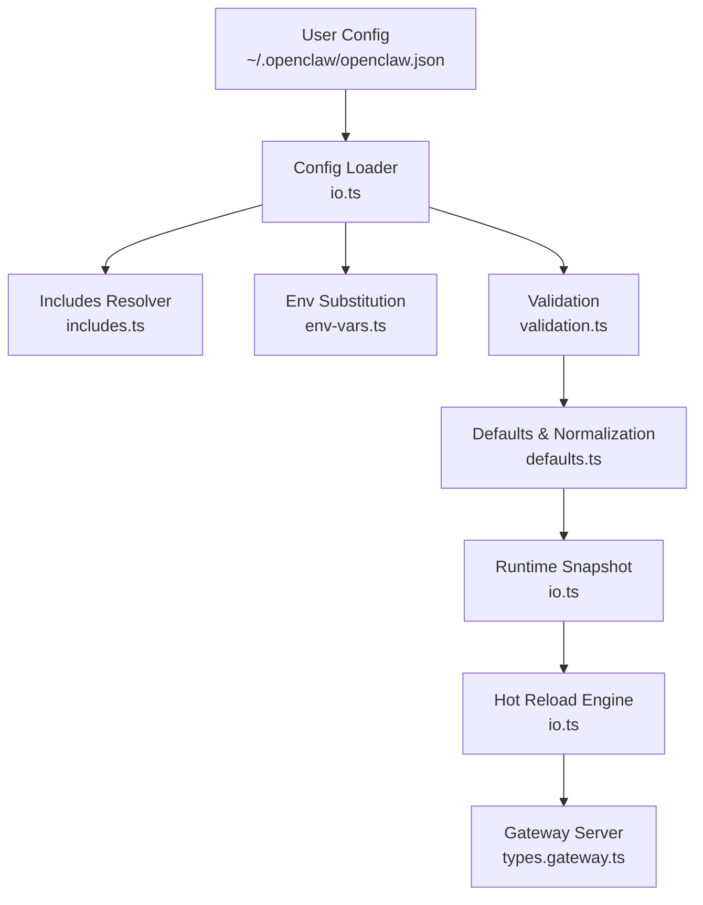

**Diagram sources**
- [io.ts](file://src/config/io.ts#L707-L800)
- [includes.ts](file://src/config/includes.ts#L340-L347)
- [env-vars.ts](file://src/config/env-vars.ts#L70-L98)
- [validation.ts](file://src/config/validation.ts#L229-L286)
- [types.gateway.ts](file://src/config/types.gateway.ts#L369-L416)

**Section sources**
- [configuration.md](file://docs/gateway/configuration.md#L10-L60)
- [io.ts](file://src/config/io.ts#L707-L800)

## Core Components
- Hierarchical configuration with JSON5 includes and deep merge semantics.
- Environment variable injection and substitution with strict safety checks.
- Strict schema validation and plugin-aware validation.
- Runtime defaults and normalization applied before validation.
- Hot-reload with four modes: hybrid, hot, restart, off.
- Authentication modes: none, token, password, trusted-proxy.
- Security headers and TLS configuration for HTTP endpoints.

**Section sources**
- [configuration.md](file://docs/gateway/configuration.md#L325-L387)
- [types.gateway.ts](file://src/config/types.gateway.ts#L123-L177)
- [schema.ts](file://src/config/schema.ts#L429-L484)

## Architecture Overview
The configuration pipeline reads, merges, substitutes, validates, normalizes, and applies configuration. It supports programmatic updates and hot-reload with controlled restarts for critical changes.

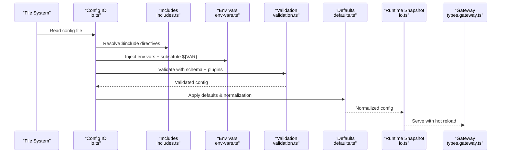

**Diagram sources**
- [io.ts](file://src/config/io.ts#L707-L800)
- [includes.ts](file://src/config/includes.ts#L340-L347)
- [env-vars.ts](file://src/config/env-vars.ts#L70-L98)
- [validation.ts](file://src/config/validation.ts#L229-L286)
- [types.gateway.ts](file://src/config/types.gateway.ts#L369-L416)

## Detailed Component Analysis

### Hierarchical Configuration and Includes
- $include supports single file replacement or array-based deep merge.
- Sibling keys merge after include resolution; later arrays concatenate.
- Nested includes up to a fixed depth; circular includes detected.
- Security guards prevent path traversal and symlink bypass.

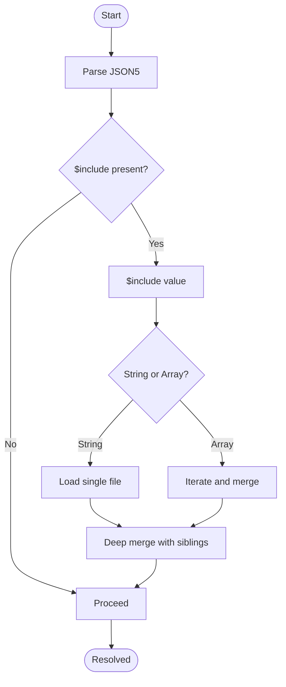

**Diagram sources**
- [includes.ts](file://src/config/includes.ts#L131-L176)
- [includes.ts](file://src/config/includes.ts#L340-L347)

**Section sources**
- [configuration.md](file://docs/gateway/configuration.md#L325-L346)
- [includes.ts](file://src/config/includes.ts#L1-L347)

### Environment Variable Precedence and Substitution
- Config-defined env vars are applied to process.env before substitution.
- ${VAR} references are substituted; missing vars produce warnings unless guarded.
- Inline env injection via env.vars and env.<key> is supported.
- Shell env import can populate missing keys when enabled.

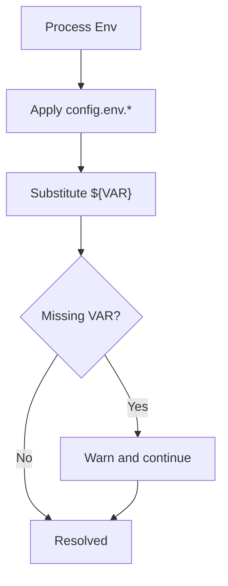

**Diagram sources**
- [io.ts](file://src/config/io.ts#L724-L734)
- [env-vars.ts](file://src/config/env-vars.ts#L70-L98)

**Section sources**
- [configuration.md](file://docs/gateway/configuration.md#L449-L539)
- [env-vars.ts](file://src/config/env-vars.ts#L1-L98)
- [io.ts](file://src/config/io.ts#L627-L634)

### Validation and Strict Schema Enforcement
- Zod-based schema validates raw config; plugin-aware validation augments diagnostics.
- Duplicate agent directories and identity avatar constraints are enforced.
- Heartbeat target validation considers built-in and plugin channels.
- Validation warnings are emitted separately from fatal issues.

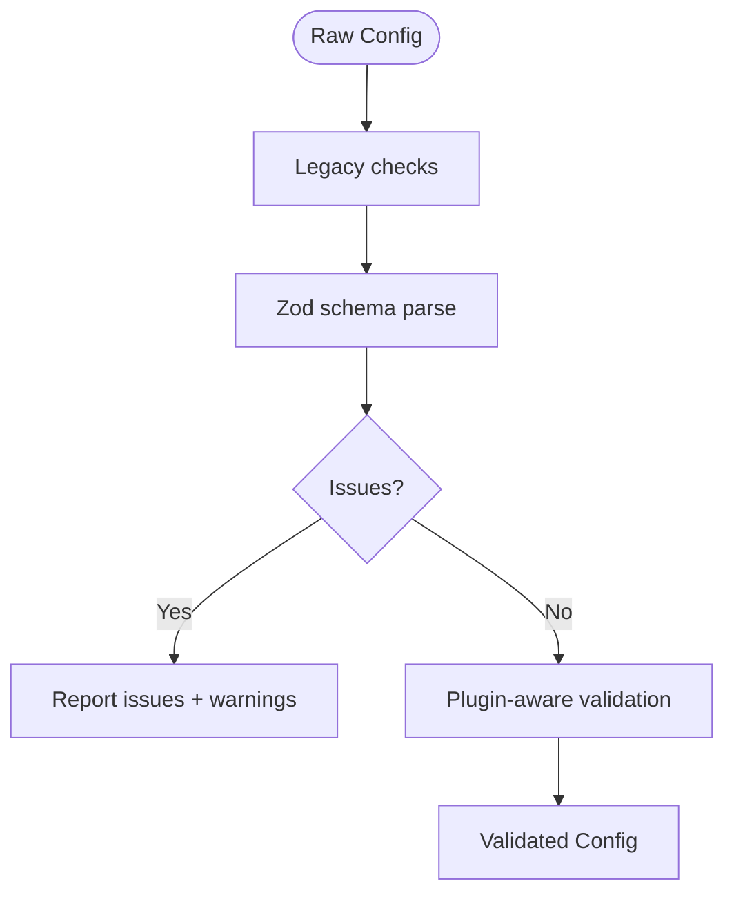

**Diagram sources**
- [validation.ts](file://src/config/validation.ts#L229-L286)
- [validation.ts](file://src/config/validation.ts#L308-L330)

**Section sources**
- [configuration.md](file://docs/gateway/configuration.md#L61-L73)
- [validation.ts](file://src/config/validation.ts#L229-L286)

### Configuration Reload Mechanisms and Modes
- Hybrid (default): hot-apply safe changes; auto-restart for critical ones.
- Hot: hot-apply only; warn when restart is needed.
- Restart: restart on any change.
- Off: disable file watching; changes take effect after manual restart.
- Debounce window controls reload frequency.

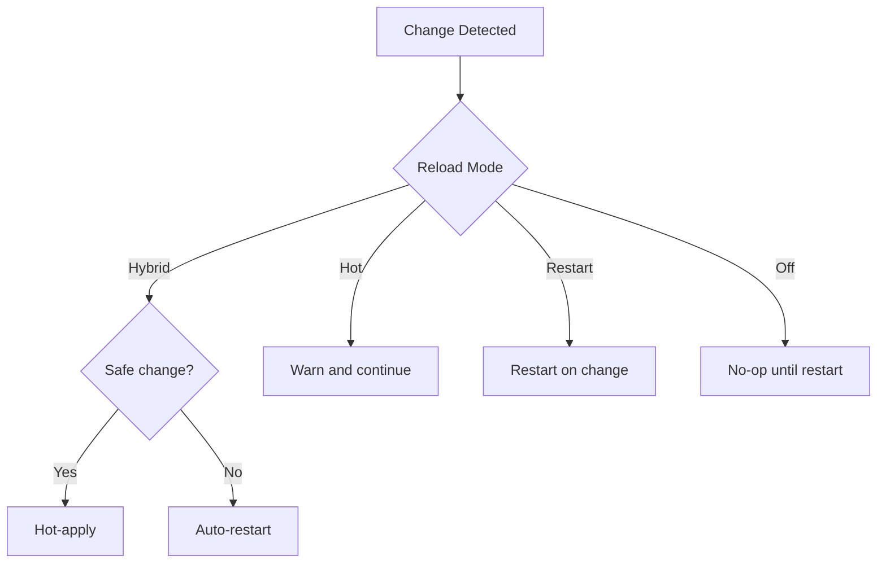

**Diagram sources**
- [configuration.md](file://docs/gateway/configuration.md#L349-L387)
- [types.gateway.ts](file://src/config/types.gateway.ts#L205-L212)

**Section sources**
- [configuration.md](file://docs/gateway/configuration.md#L349-L387)
- [types.gateway.ts](file://src/config/types.gateway.ts#L205-L212)

### Authentication Configuration and Security Settings
- Modes: none, token, password, trusted-proxy.
- Trusted-proxy requires a user header and optional allowlist; additional headers can be required for trust.
- Rate limiting for failed auth attempts; loopback exemptions supported.
- TLS configuration supports auto-generation, custom certs, and CA bundles.
- HTTP security headers include HSTS configuration.
- Control UI origins and device identity checks; optional insecure auth toggles.

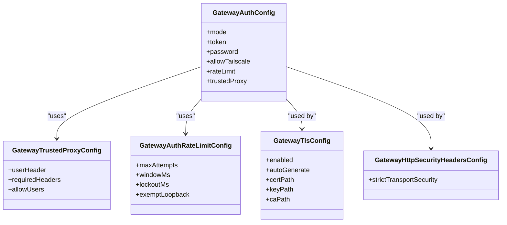

**Diagram sources**
- [types.gateway.ts](file://src/config/types.gateway.ts#L123-L177)
- [types.gateway.ts](file://src/config/types.gateway.ts#L5-L16)
- [types.gateway.ts](file://src/config/types.gateway.ts#L333-L346)

**Section sources**
- [types.gateway.ts](file://src/config/types.gateway.ts#L123-L177)
- [types.gateway.ts](file://src/config/types.gateway.ts#L5-L16)
- [types.gateway.ts](file://src/config/types.gateway.ts#L333-L346)

### Port Binding Options and Related Services
- Gateway default port is 18789; related services derive ports from the gateway port.
- Bridge, browser control, canvas host, and browser CDP ports are derived with offsets.
- Bind modes include auto, LAN, loopback, tailnet, and custom host.

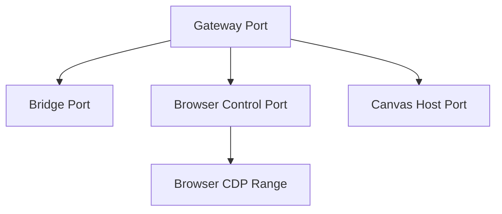

**Diagram sources**
- [port-defaults.ts](file://src/config/port-defaults.ts#L15-L43)
- [types.gateway.ts](file://src/config/types.gateway.ts#L369-L388)

**Section sources**
- [port-defaults.ts](file://src/config/port-defaults.ts#L1-L44)
- [types.gateway.ts](file://src/config/types.gateway.ts#L369-L388)

### Programmatic Updates and RPC
- config.apply: full replace with baseHash verification and optional post-restart wake-up ping.
- config.patch: JSON merge patch semantics; null deletes keys; arrays replace.
- Rate limiting applies to RPCs; restarts are coalesced and throttled.

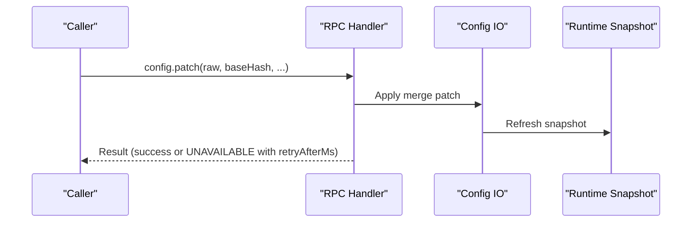

**Diagram sources**
- [configuration.md](file://docs/gateway/configuration.md#L389-L447)
- [merge-config.ts](file://src/config/merge-config.ts#L8-L39)

**Section sources**
- [configuration.md](file://docs/gateway/configuration.md#L389-L447)
- [merge-config.ts](file://src/config/merge-config.ts#L1-L39)

### Relationship Between Files, Environment Variables, and Runtime Overrides
- File-based config is the source of truth; environment variables augment or substitute values.
- Runtime overrides can adjust behavior without touching files.
- Secrets can be provided via env, file, or exec sources.

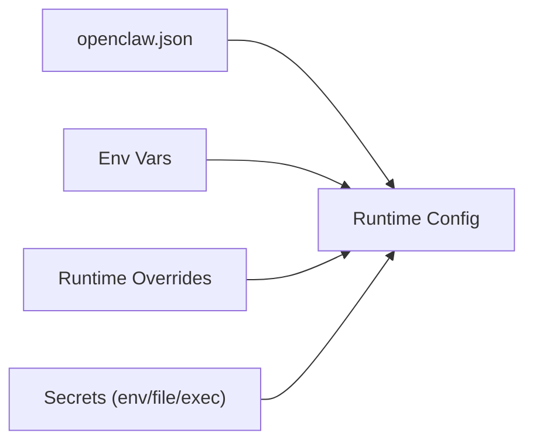

**Diagram sources**
- [io.ts](file://src/config/io.ts#L724-L734)
- [env-vars.ts](file://src/config/env-vars.ts#L70-L98)
- [configuration.md](file://docs/gateway/configuration.md#L501-L536)

**Section sources**
- [io.ts](file://src/config/io.ts#L724-L734)
- [env-vars.ts](file://src/config/env-vars.ts#L1-L98)
- [configuration.md](file://docs/gateway/configuration.md#L501-L536)

### Practical Configuration Patterns
- Minimal setup for DM access.
- Recommended starter with identity, model, and WhatsApp allowlist.
- Multi-platform setup across WhatsApp, Telegram, and Discord.
- Secure DM mode with per-channel peer scoping.
- OAuth with API key failover and Anthropic setup-token fallback.
- Local models only with LMStudio provider.

**Section sources**
- [configuration-examples.md](file://docs/gateway/configuration-examples.md#L14-L638)

### Configuration Migration, Backup Strategies, and Auditing
- Legacy migration detects and reports deprecated keys.
- Backup rotation maintains historical snapshots.
- Configuration write audit logs record changes with metadata and suspicious indicators.

**Section sources**
- [io.ts](file://src/config/io.ts#L18-L20)
- [io.ts](file://src/config/io.ts#L540-L554)

## Dependency Analysis
The configuration system integrates several modules with clear boundaries:
- io.ts orchestrates file I/O, includes, env substitution, validation, defaults, and runtime snapshot updates.
- includes.ts provides secure include resolution with guards.
- env-vars.ts manages env injection and substitution.
- validation.ts enforces schema and plugin-aware validation.
- types.gateway.ts defines gateway-specific configuration types.
- schema.ts builds UI-friendly schema and hints.
- port-defaults.ts computes derived ports.
- merge-config.ts supports programmatic partial updates.

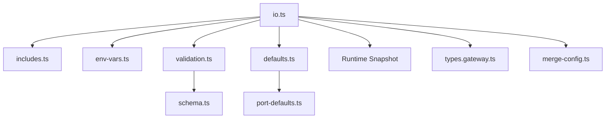

**Diagram sources**
- [io.ts](file://src/config/io.ts#L707-L800)
- [includes.ts](file://src/config/includes.ts#L340-L347)
- [env-vars.ts](file://src/config/env-vars.ts#L70-L98)
- [validation.ts](file://src/config/validation.ts#L229-L286)
- [schema.ts](file://src/config/schema.ts#L429-L484)
- [port-defaults.ts](file://src/config/port-defaults.ts#L1-L44)
- [types.gateway.ts](file://src/config/types.gateway.ts#L369-L416)
- [merge-config.ts](file://src/config/merge-config.ts#L1-L39)

**Section sources**
- [io.ts](file://src/config/io.ts#L707-L800)
- [schema.ts](file://src/config/schema.ts#L429-L484)

## Performance Considerations
- Hot reload debouncing reduces churn; tune debounceMs for environments with frequent edits.
- Validation and normalization occur once per reload; keep config modular to minimize diff size.
- Use hybrid mode to balance safety and uptime; reserve restart mode for critical changes.
- Limit concurrent RPC updates to avoid contention; respect rate-limiting.

[No sources needed since this section provides general guidance]

## Troubleshooting Guide
Common issues and resolutions:
- Invalid config prevents startup; use doctor to diagnose and fix; repair with doctor --fix.
- Missing env var references produce warnings; ensure values are present or use shell env import.
- Open DM policy requires allowFrom to include "*"; adjust accordingly.
- Gateway bind and Tailscale mode must align; use loopback or custom 127.0.0.1 when exposing via Tailscale.
- Authentication failures are rate-limited; review rateLimit settings and exempt loopback if appropriate.
- Include circularity or path traversal errors indicate misconfigured $include; fix paths and nesting.

**Section sources**
- [configuration.md](file://docs/gateway/configuration.md#L61-L73)
- [io.ts](file://src/config/io.ts#L724-L734)
- [validation.ts](file://src/config/validation.ts#L198-L223)
- [types.gateway.ts](file://src/config/types.gateway.ts#L168-L177)

## Conclusion
OpenClaw’s gateway configuration is robust, secure, and flexible. By leveraging includes, environment variables, strict validation, and hot-reload modes, operators can manage complex deployments safely. Production deployments should emphasize secure auth, TLS, and careful change management with hybrid reload mode and audit logging.

[No sources needed since this section summarizes without analyzing specific files]

## Appendices

### Appendix A: Configuration Reference Highlights
- Channels: DM and group access policies, provider-specific settings, and multi-account support.
- Agents: defaults, models, heartbeat, sandboxing, and runtime tuning.
- Hooks and cron: HTTP endpoints and scheduling with retention and logging.
- Tools and media: exec, browser, and media handling policies.
- UI and logging: console and file logging levels, redaction, and UI origins.

**Section sources**
- [configuration-reference.md](file://docs/gateway/configuration-reference.md#L18-L800)

### Appendix B: Environment Variable Injection and Substitution
- Inline env vars in config via env.vars and env.<key>.
- Shell env import enabled via env.shellEnv; supports timeouts and expected keys.
- ${VAR} substitution with escaping and safety checks.

**Section sources**
- [configuration.md](file://docs/gateway/configuration.md#L449-L539)
- [env-vars.ts](file://src/config/env-vars.ts#L70-L98)

### Appendix C: Authentication Resolution Flow (QR CLI)
- Token/password modes resolved from CLI flags and remote settings; local password secret resolution when applicable.

**Section sources**
- [qr-cli.ts](file://src/cli/qr-cli.ts#L162-L196)