# Gateway Operations

<cite>
**Referenced Files in This Document**
- [docs/gateway/index.md](file://docs/gateway/index.md)
- [docs/gateway/configuration.md](file://docs/gateway/configuration.md)
- [docs/gateway/doctor.md](file://docs/gateway/doctor.md)
- [docs/gateway/troubleshooting.md](file://docs/gateway/troubleshooting.md)
- [docs/gateway/logging.md](file://docs/gateway/logging.md)
- [docs/gateway/health.md](file://docs/gateway/health.md)
- [docs/gateway/multiple-gateways.md](file://docs/gateway/multiple-gateway.md)
- [docs/gateway/security/index.md](file://docs/gateway/security/index.md)
- [docs/cli/backup.md](file://docs/cli/backup.md)
- [docs/install/index.md](file://docs/install/index.md)
- [src/daemon/service.ts](file://src/daemon/service.ts)
- [apps/macos/Sources/OpenClaw/GatewayEndpointStore.swift](file://apps/macos/Sources/OpenClaw/GatewayEndpointStore.swift)
- [src/gateway/server-runtime-config.test.ts](file://src/gateway/server-runtime-config.test.ts)
- [docs/zh-CN/install/fly.md](file://docs/zh-CN/install/fly.md)
- [src/commands/reset.test.ts](file://src/commands/reset.test.ts)
- [src/cli/program/register.backup.ts](file://src/cli/program/register.backup.ts)
- [src/commands/backup-verify.ts](file://src/commands/backup-verify.ts)
- [src/acp/control-plane/manager.core.ts](file://src/acp/control-plane/manager.core.ts)
- [src/commands/status.scan.ts](file://src/commands/status.scan.ts)
</cite>

## Table of Contents
1. [Introduction](#introduction)
2. [Project Structure](#project-structure)
3. [Core Components](#core-components)
4. [Architecture Overview](#architecture-overview)
5. [Detailed Component Analysis](#detailed-component-analysis)
6. [Dependency Analysis](#dependency-analysis)
7. [Performance Considerations](#performance-considerations)
8. [Troubleshooting Guide](#troubleshooting-guide)
9. [Conclusion](#conclusion)
10. [Appendices](#appendices)

## Introduction
This document provides comprehensive gateway operations guidance for day-1 startup, day-2 operations, and maintenance. It covers lifecycle management, service installation and supervision, health monitoring, diagnostics, troubleshooting, operational commands, status checking, log analysis, runbook procedures, emergency response, performance tuning, clustering and high availability, operational security, backup, and disaster recovery planning.

## Project Structure
The repository organizes operational documentation and CLI/command implementations across:
- Documentation: gateway runbooks, configuration, security, logging, health, troubleshooting, and install guides
- CLI: backup, status, and gateway commands
- Daemon/service abstraction for platform-specific supervisors
- Platform-specific runtime configuration resolution

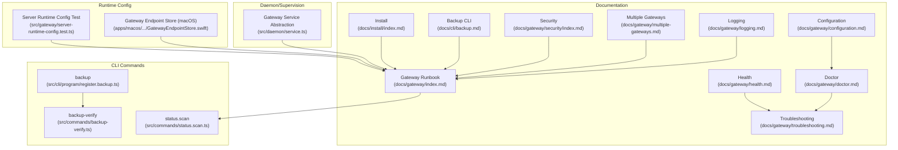

**Diagram sources**
- [docs/gateway/index.md](file://docs/gateway/index.md#L1-L262)
- [docs/gateway/configuration.md](file://docs/gateway/configuration.md#L1-L547)
- [docs/gateway/doctor.md](file://docs/gateway/doctor.md#L1-L331)
- [docs/gateway/troubleshooting.md](file://docs/gateway/troubleshooting.md#L1-L367)
- [docs/gateway/logging.md](file://docs/gateway/logging.md#L1-L114)
- [docs/gateway/health.md](file://docs/gateway/health.md#L1-L36)
- [docs/gateway/multiple-gateways.md](file://docs/gateway/multiple-gateways.md#L1-L113)
- [docs/gateway/security/index.md](file://docs/gateway/security/index.md#L1-L1199)
- [docs/cli/backup.md](file://docs/cli/backup.md#L1-L77)
- [docs/install/index.md](file://docs/install/index.md#L1-L219)
- [src/cli/program/register.backup.ts](file://src/cli/program/register.backup.ts#L1-L18)
- [src/commands/backup-verify.ts](file://src/commands/backup-verify.ts#L121-L140)
- [src/commands/status.scan.ts](file://src/commands/status.scan.ts#L157-L180)
- [src/daemon/service.ts](file://src/daemon/service.ts#L54-L119)
- [apps/macos/Sources/OpenClaw/GatewayEndpointStore.swift](file://apps/macos/Sources/OpenClaw/GatewayEndpointStore.swift#L543-L572)
- [src/gateway/server-runtime-config.test.ts](file://src/gateway/server-runtime-config.test.ts#L53-L68)

**Section sources**
- [docs/gateway/index.md](file://docs/gateway/index.md#L1-L262)
- [docs/gateway/configuration.md](file://docs/gateway/configuration.md#L1-L547)
- [docs/gateway/doctor.md](file://docs/gateway/doctor.md#L1-L331)
- [docs/gateway/troubleshooting.md](file://docs/gateway/troubleshooting.md#L1-L367)
- [docs/gateway/logging.md](file://docs/gateway/logging.md#L1-L114)
- [docs/gateway/health.md](file://docs/gateway/health.md#L1-L36)
- [docs/gateway/multiple-gateways.md](file://docs/gateway/multiple-gateways.md#L1-L113)
- [docs/gateway/security/index.md](file://docs/gateway/security/index.md#L1-L1199)
- [docs/cli/backup.md](file://docs/cli/backup.md#L1-L77)
- [docs/install/index.md](file://docs/install/index.md#L1-L219)
- [src/cli/program/register.backup.ts](file://src/cli/program/register.backup.ts#L1-L18)
- [src/commands/backup-verify.ts](file://src/commands/backup-verify.ts#L121-L140)
- [src/commands/status.scan.ts](file://src/commands/status.scan.ts#L157-L180)
- [src/daemon/service.ts](file://src/daemon/service.ts#L54-L119)
- [apps/macos/Sources/OpenClaw/GatewayEndpointStore.swift](file://apps/macos/Sources/OpenClaw/GatewayEndpointStore.swift#L543-L572)
- [src/gateway/server-runtime-config.test.ts](file://src/gateway/server-runtime-config.test.ts#L53-L68)

## Core Components
- Gateway runbook and operator commands: startup, supervision, status, logs, and doctor
- Configuration system with hot reload and RPC updates
- Health and diagnostics: status, health snapshots, and channel probes
- Logging surfaces: file logs and WebSocket log styles
- Security posture: auth modes, reverse proxy, device auth, and exposure controls
- Backup and disaster recovery: backup creation, verification, and restore guidance
- Multiple gateways: isolation, ports, profiles, and derived services
- Installation and platform-specific supervisors (macOS LaunchAgent, Linux systemd, Windows Scheduled Task)

**Section sources**
- [docs/gateway/index.md](file://docs/gateway/index.md#L27-L262)
- [docs/gateway/configuration.md](file://docs/gateway/configuration.md#L349-L447)
- [docs/gateway/health.md](file://docs/gateway/health.md#L12-L36)
- [docs/gateway/logging.md](file://docs/gateway/logging.md#L13-L114)
- [docs/gateway/security/index.md](file://docs/gateway/security/index.md#L145-L800)
- [docs/cli/backup.md](file://docs/cli/backup.md#L9-L77)
- [docs/gateway/multiple-gateways.md](file://docs/gateway/multiple-gateways.md#L9-L113)
- [src/daemon/service.ts](file://src/daemon/service.ts#L54-L119)

## Architecture Overview
The gateway operates as a single always-on process serving:
- WebSocket control/RPC
- HTTP APIs (OpenAI-compatible, Responses, tools invoke)
- Control UI and hooks

Supervision is platform-aware and integrates with:
- macOS LaunchAgent
- Linux systemd user and system services
- Windows Scheduled Tasks

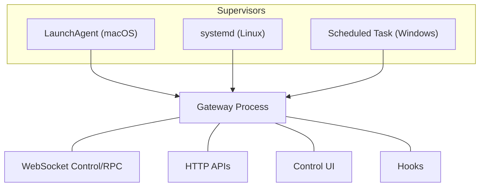

**Diagram sources**
- [docs/gateway/index.md](file://docs/gateway/index.md#L68-L93)
- [src/daemon/service.ts](file://src/daemon/service.ts#L69-L106)

**Section sources**
- [docs/gateway/index.md](file://docs/gateway/index.md#L68-L93)
- [src/daemon/service.ts](file://src/daemon/service.ts#L69-L106)

## Detailed Component Analysis

### Day-1 Startup and Initial Configuration
- Local 5-minute startup: start gateway, verify health, validate channel readiness
- Default bind mode: loopback; auth required by default
- Port and bind precedence: CLI/env/config fallback chain
- Hot reload modes: hybrid/off/hot/restart with safe/unsafe changes

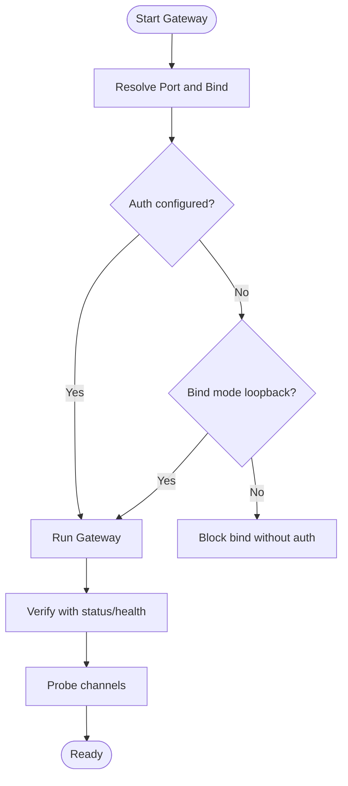

**Diagram sources**
- [docs/gateway/index.md](file://docs/gateway/index.md#L27-L93)

**Section sources**
- [docs/gateway/index.md](file://docs/gateway/index.md#L27-L93)

### Configuration Management and Hot Reload
- Strict JSON5 validation; unknown keys cause refusal to start
- Hot reload categories and restart requirements
- RPC updates: config.apply and config.patch with rate limiting and restart coalescing

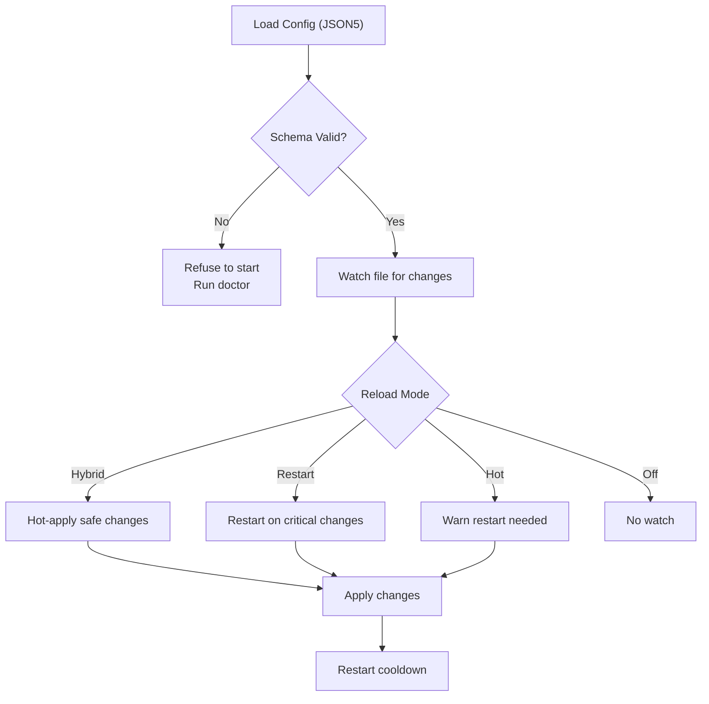

**Diagram sources**
- [docs/gateway/configuration.md](file://docs/gateway/configuration.md#L61-L84)
- [docs/gateway/configuration.md](file://docs/gateway/configuration.md#L349-L447)

**Section sources**
- [docs/gateway/configuration.md](file://docs/gateway/configuration.md#L61-L84)
- [docs/gateway/configuration.md](file://docs/gateway/configuration.md#L349-L447)

### Health Monitoring and Diagnostics
- CLI health: status, deep status, health snapshot, channel probes
- Gateway WebSocket logs: normal vs verbose modes and styles
- File logs: daily rolling JSONL, level and console configuration

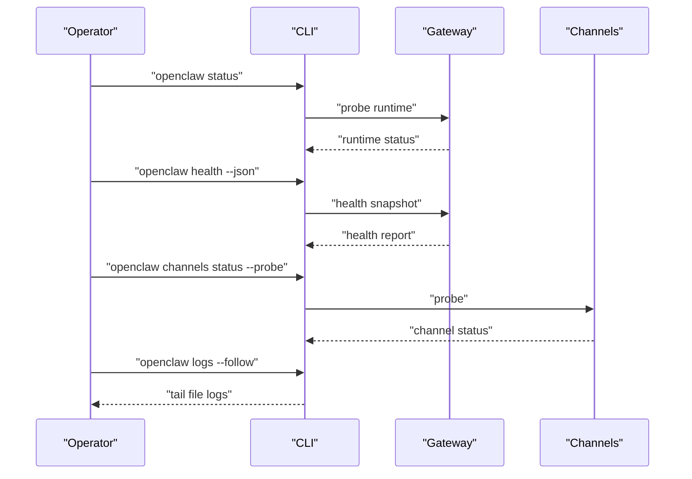

**Diagram sources**
- [docs/gateway/health.md](file://docs/gateway/health.md#L12-L36)
- [docs/gateway/logging.md](file://docs/gateway/logging.md#L64-L94)

**Section sources**
- [docs/gateway/health.md](file://docs/gateway/health.md#L12-L36)
- [docs/gateway/logging.md](file://docs/gateway/logging.md#L13-L94)

### Supervision and Service Lifecycle
- Platform-specific supervisors: LaunchAgent (macOS), systemd (Linux), Scheduled Task (Windows)
- Install, restart, stop, and status commands
- Doctor audits and repairs service config drift

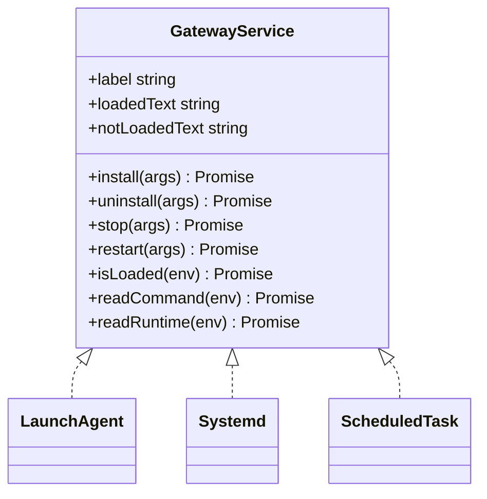

**Diagram sources**
- [src/daemon/service.ts](file://src/daemon/service.ts#L54-L119)

**Section sources**
- [src/daemon/service.ts](file://src/daemon/service.ts#L54-L119)
- [docs/gateway/index.md](file://docs/gateway/index.md#L125-L190)

### Remote Access and Binding
- Preferred: Tailscale/VPN; fallback: SSH tunnel
- Bind modes and precedence; trusted proxy auth for reverse proxies
- Loopback vs LAN/Tailnet/CUSTOM with auth requirements

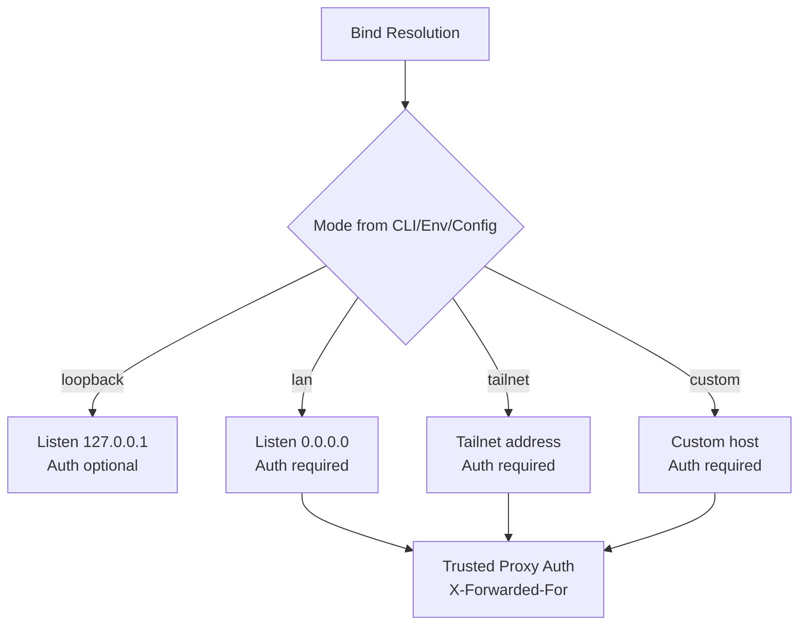

**Diagram sources**
- [docs/gateway/index.md](file://docs/gateway/index.md#L78-L84)
- [docs/gateway/security/index.md](file://docs/gateway/security/index.md#L312-L352)

**Section sources**
- [docs/gateway/index.md](file://docs/gateway/index.md#L78-L84)
- [docs/gateway/security/index.md](file://docs/gateway/security/index.md#L312-L352)

### Multiple Gateways and Isolation
- Isolation checklist: unique ports, config paths, state dirs, workspaces
- Profiles auto-scope isolation and service naming
- Port mapping: base port + derived ports for browser/canvas/CDP

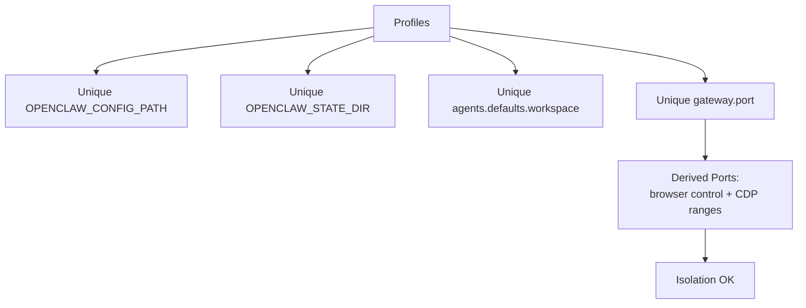

**Diagram sources**
- [docs/gateway/multiple-gateways.md](file://docs/gateway/multiple-gateways.md#L13-L21)
- [docs/gateway/multiple-gateways.md](file://docs/gateway/multiple-gateways.md#L77-L93)

**Section sources**
- [docs/gateway/multiple-gateways.md](file://docs/gateway/multiple-gateways.md#L13-L21)
- [docs/gateway/multiple-gateways.md](file://docs/gateway/multiple-gateways.md#L77-L93)

### Backup and Disaster Recovery
- Backup CLI: create, verify, dry-run, selective inclusion
- Backup scope: state, config, credentials, optional workspaces
- Disaster recovery guidance: verify archives, exclude workspaces for minimal backups

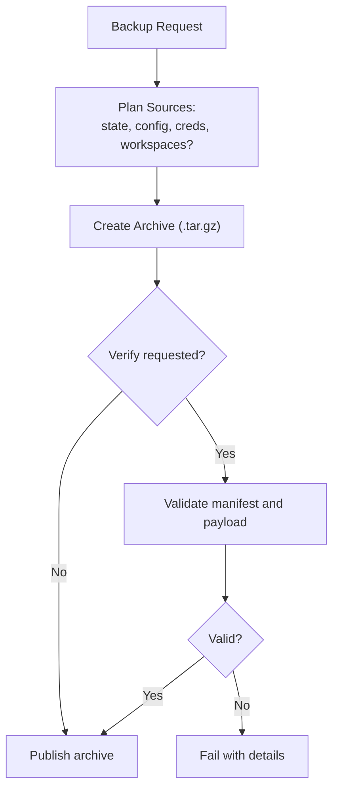

**Diagram sources**
- [docs/cli/backup.md](file://docs/cli/backup.md#L9-L77)
- [src/cli/program/register.backup.ts](file://src/cli/program/register.backup.ts#L10-L18)
- [src/commands/backup-verify.ts](file://src/commands/backup-verify.ts#L121-L140)

**Section sources**
- [docs/cli/backup.md](file://docs/cli/backup.md#L9-L77)
- [src/cli/program/register.backup.ts](file://src/cli/program/register.backup.ts#L10-L18)
- [src/commands/backup-verify.ts](file://src/commands/backup-verify.ts#L121-L140)

### Operational Security and Hardening
- Personal assistant trust model: one operator boundary
- Auth modes: token/password/trusted-proxy; device auth for Control UI
- Exposure controls: bind mode, reverse proxy trusted proxies, HSTS, mDNS minimal/full/off
- Tool policy, sandboxing, and plugin management

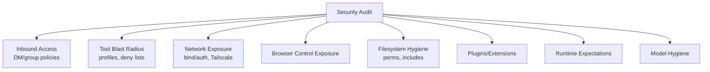

**Diagram sources**
- [docs/gateway/security/index.md](file://docs/gateway/security/index.md#L183-L196)

**Section sources**
- [docs/gateway/security/index.md](file://docs/gateway/security/index.md#L145-L800)

### Installation and Platform Guides
- Installer script, npm/pnpm, from source, Docker/Podman/Nix/Ansible/Bun
- Environment variables for custom paths
- Cloud platform notes (e.g., Fly.io)

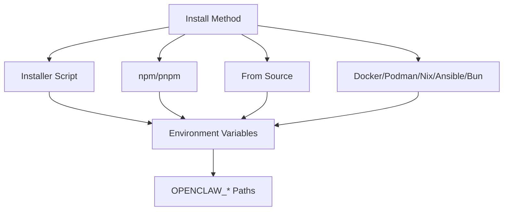

**Diagram sources**
- [docs/install/index.md](file://docs/install/index.md#L24-L180)
- [docs/zh-CN/install/fly.md](file://docs/zh-CN/install/fly.md#L51-L94)

**Section sources**
- [docs/install/index.md](file://docs/install/index.md#L24-L180)
- [docs/zh-CN/install/fly.md](file://docs/zh-CN/install/fly.md#L51-L94)

### Runbook Procedures and Emergency Response
- Command ladder: status, gateway status, logs, doctor, channel probes
- Common failure signatures and remediation steps
- Post-upgrade checks: auth/url overrides, bind/auth guardrails, pairing/device identity

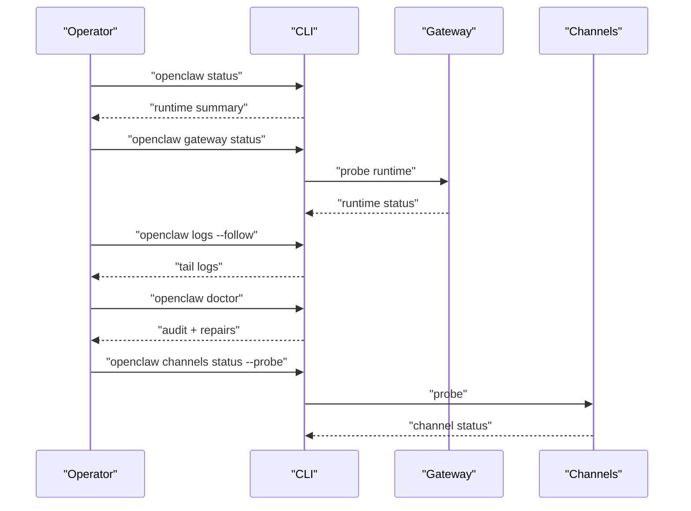

**Diagram sources**
- [docs/gateway/troubleshooting.md](file://docs/gateway/troubleshooting.md#L14-L31)

**Section sources**
- [docs/gateway/troubleshooting.md](file://docs/gateway/troubleshooting.md#L14-L31)

### Performance Tuning and ACP Runtime Controls
- ACP manager runtime mode control and idle eviction
- Memory status snapshot via status scan
- Latency stats and error code recording

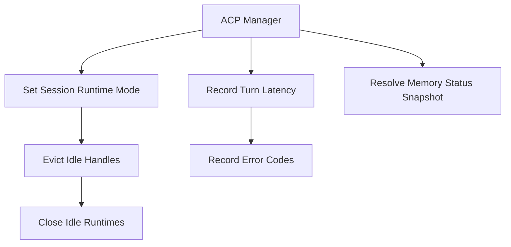

**Diagram sources**
- [src/acp/control-plane/manager.core.ts](file://src/acp/control-plane/manager.core.ts#L394-L1157)
- [src/commands/status.scan.ts](file://src/commands/status.scan.ts#L157-L180)

**Section sources**
- [src/acp/control-plane/manager.core.ts](file://src/acp/control-plane/manager.core.ts#L394-L1157)
- [src/commands/status.scan.ts](file://src/commands/status.scan.ts#L157-L180)

## Dependency Analysis
- Supervisor registry maps platform to service implementation
- Gateway runtime config resolution depends on bind mode and trusted proxy settings
- Platform-specific endpoint resolution (macOS) influences bind behavior

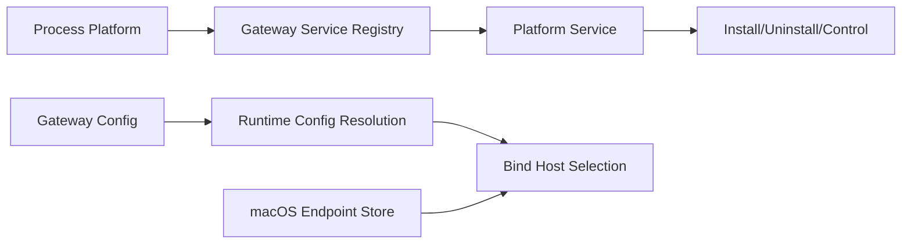

**Diagram sources**
- [src/daemon/service.ts](file://src/daemon/service.ts#L108-L119)
- [apps/macos/Sources/OpenClaw/GatewayEndpointStore.swift](file://apps/macos/Sources/OpenClaw/GatewayEndpointStore.swift#L543-L572)
- [src/gateway/server-runtime-config.test.ts](file://src/gateway/server-runtime-config.test.ts#L53-L68)

**Section sources**
- [src/daemon/service.ts](file://src/daemon/service.ts#L108-L119)
- [apps/macos/Sources/OpenClaw/GatewayEndpointStore.swift](file://apps/macos/Sources/OpenClaw/GatewayEndpointStore.swift#L543-L572)
- [src/gateway/server-runtime-config.test.ts](file://src/gateway/server-runtime-config.test.ts#L53-L68)

## Performance Considerations
- Use hybrid reload mode for safe changes with automatic restarts when required
- Monitor WebSocket log verbosity to balance observability and overhead
- Tune logging levels and console styles for operational environments
- Consider ACP runtime idle eviction to free resources when sessions are inactive
- For multi-Gateway setups, ensure sufficient port spacing to avoid derived service conflicts

[No sources needed since this section provides general guidance]

## Troubleshooting Guide
- Command ladder: status, gateway status, logs, doctor, channel probes
- Gateway service not running: check runtime, service config drift, port conflicts
- No replies: pairing, group mention gating, allowlists
- Dashboard/UI connectivity: auth mode, device auth, secure context
- Post-upgrade issues: auth/url overrides, bind/auth guardrails, pairing/device identity
- Reset safety: backup recommendation before destructive resets

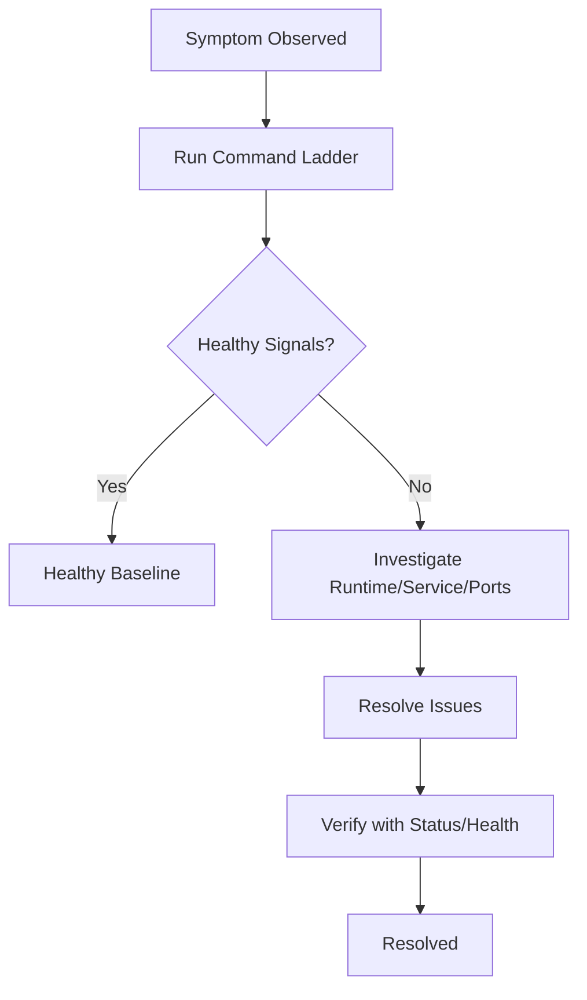

**Diagram sources**
- [docs/gateway/troubleshooting.md](file://docs/gateway/troubleshooting.md#L14-L31)

**Section sources**
- [docs/gateway/troubleshooting.md](file://docs/gateway/troubleshooting.md#L14-L31)
- [src/commands/reset.test.ts](file://src/commands/reset.test.ts#L48-L69)

## Conclusion
This runbook consolidates day-1 startup, day-2 operations, and maintenance procedures for the OpenClaw Gateway. It emphasizes secure defaults, robust supervision, comprehensive diagnostics, and resilient backup and disaster recovery practices. Operators should adopt the documented runbooks, leverage platform supervisors, and maintain strict security and logging configurations for reliable operations.

[No sources needed since this section summarizes without analyzing specific files]

## Appendices

### Operational Commands Quick Reference
- Gateway lifecycle: start, status, restart, stop, install
- Diagnostics: logs, doctor, health, status
- Configuration: config get/set/unset, onboard, configure
- Backup: backup create/verify
- Channels: channels status --probe

**Section sources**
- [docs/gateway/index.md](file://docs/gateway/index.md#L94-L106)
- [docs/gateway/doctor.md](file://docs/gateway/doctor.md#L14-L44)
- [docs/gateway/health.md](file://docs/gateway/health.md#L12-L18)
- [docs/cli/backup.md](file://docs/cli/backup.md#L13-L21)