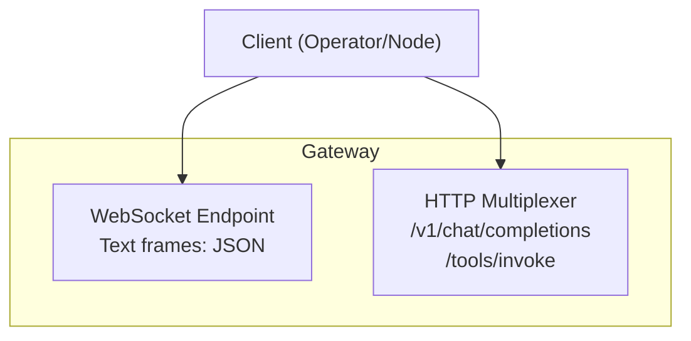
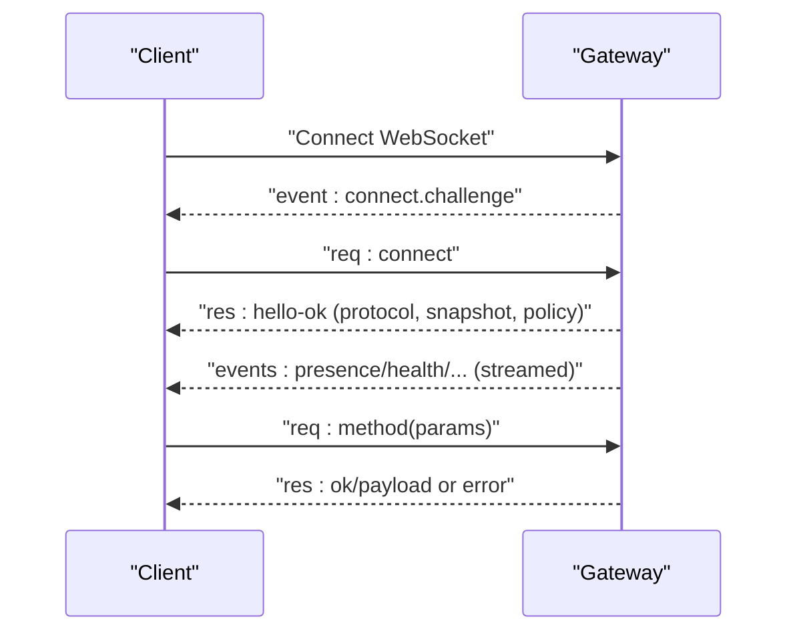
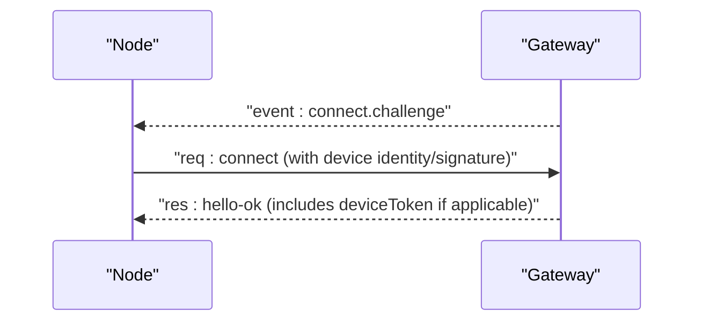
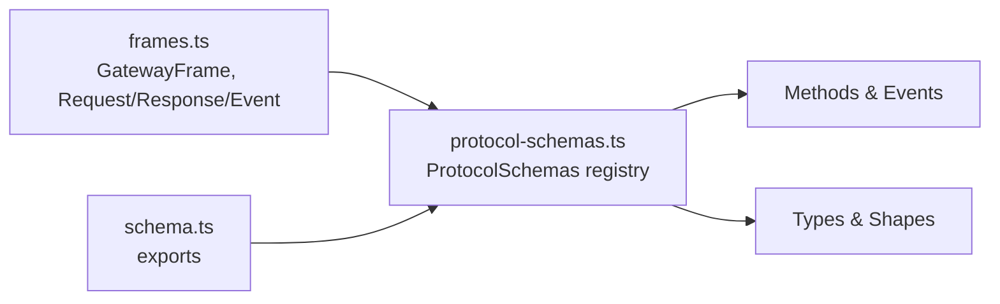

# Gateway Protocol

<cite>
**Referenced Files in This Document**
- [docs/gateway/index.md](file://docs/gateway/index.md)
- [docs/gateway/protocol.md](file://docs/gateway/protocol.md)
- [docs/gateway/openai-http-api.md](file://docs/gateway/openai-http-api.md)
- [docs/gateway/tools-invoke-http-api.md](file://docs/gateway/tools-invoke-http-api.md)
- [src/gateway/protocol/schema.ts](file://src/gateway/protocol/schema.ts)
- [src/gateway/protocol/schema/protocol-schemas.ts](file://src/gateway/protocol/schema/protocol-schemas.ts)
- [src/gateway/protocol/schema/frames.ts](file://src/gateway/protocol/schema/frames.ts)
</cite>

## Table of Contents
1. [Introduction](#introduction)
2. [Project Structure](#project-structure)
3. [Core Components](#core-components)
4. [Architecture Overview](#architecture-overview)
5. [Detailed Component Analysis](#detailed-component-analysis)
6. [Dependency Analysis](#dependency-analysis)
7. [Performance Considerations](#performance-considerations)
8. [Troubleshooting Guide](#troubleshooting-guide)
9. [Conclusion](#conclusion)
10. [Appendices](#appendices)

## Introduction
This document specifies the OpenClaw Gateway protocol for WebSocket-based control and real-time messaging, and the HTTP APIs that expose OpenAI-compatible chat completions and direct tool invocation. It covers connection handshake, message framing, event semantics, HTTP endpoint behaviors, authentication, versioning, and operational guidance for clients and operators.

## Project Structure
The Gateway exposes:
- A single WebSocket endpoint for bidirectional RPC and events
- An HTTP multiplexer sharing the same port for OpenAI-compatible chat and direct tool invocation
- A unified protocol surface defined by strongly typed schemas

**Diagram sources**
- [docs/gateway/index.md](file://docs/gateway/index.md#L70-L77)
- [docs/gateway/openai-http-api.md](file://docs/gateway/openai-http-api.md#L14-L17)
- [docs/gateway/tools-invoke-http-api.md](file://docs/gateway/tools-invoke-http-api.md#L13-L14)

**Section sources**
- [docs/gateway/index.md](file://docs/gateway/index.md#L70-L77)
- [docs/gateway/openai-http-api.md](file://docs/gateway/openai-http-api.md#L14-L17)
- [docs/gateway/tools-invoke-http-api.md](file://docs/gateway/tools-invoke-http-api.md#L13-L14)

## Core Components
- WebSocket transport with JSON text frames
- Framing primitives: requests, responses, and events
- Strongly typed protocol schemas defining the method and event surface
- HTTP endpoints for OpenAI-compatible chat and direct tool invocation

Key protocol surfaces:
- WebSocket frames: request, response, event
- Protocol versioning and schema-driven method/event registry
- HTTP endpoints: OpenAI-compatible chat completions and tools invoke

**Section sources**
- [docs/gateway/protocol.md](file://docs/gateway/protocol.md#L17-L21)
- [src/gateway/protocol/schema/frames.ts](file://src/gateway/protocol/schema/frames.ts#L125-L164)
- [src/gateway/protocol/schema/protocol-schemas.ts](file://src/gateway/protocol/schema/protocol-schemas.ts#L162-L299)
- [docs/gateway/openai-http-api.md](file://docs/gateway/openai-http-api.md#L14-L17)
- [docs/gateway/tools-invoke-http-api.md](file://docs/gateway/tools-invoke-http-api.md#L13-L14)

## Architecture Overview
The Gateway acts as a single always-on process that:
- Accepts WebSocket connections and performs a connect handshake
- Returns a hello snapshot and policy
- Streams events and handles requests
- Serves HTTP endpoints on the same port for OpenAI-compatible chat and tool invocation

**Diagram sources**
- [docs/gateway/protocol.md](file://docs/gateway/protocol.md#L22-L78)
- [src/gateway/protocol/schema/frames.ts](file://src/gateway/protocol/schema/frames.ts#L20-L112)

## Detailed Component Analysis

### WebSocket Protocol Specification
- Transport: WebSocket, text frames with JSON payloads
- First frame requirement: connect
- Framing:
  - Request: {type:"req", id, method, params}
  - Response: {type:"res", id, ok, payload|error}
  - Event: {type:"event", event, payload, seq?, stateVersion?}

Handshake:
- Pre-connect challenge: server sends connect.challenge with nonce and timestamp
- Client responds with connect containing:
  - min/max protocol version
  - client identity and mode
  - role and scopes (operator) or capabilities/commands/permissions (node)
  - auth credentials
  - device identity and signature
- Server replies with hello-ok including protocol version, features, snapshot, policy, and optional device token

Roles and scopes:
- operator: control plane access (read/write/admin/approvals/pairing)
- node: capability host (camera, canvas, screen, location, voice, etc.)

Presence:
- system-presence keyed by device identity; includes roles and scopes

Exec approvals:
- server emits exec.approval.requested
- operator resolves via exec.approval.resolve with appropriate scope

Device identity and pairing:
- Clients must include device identity and sign the server nonce
- Device tokens are issued per device+role and can be rotated or revoked

TLS and pinning:
- Optional TLS with optional certificate fingerprint pinning

Scope:
- Full gateway API exposed via the protocol; exact surface defined by schemas

**Section sources**
- [docs/gateway/protocol.md](file://docs/gateway/protocol.md#L17-L21)
- [docs/gateway/protocol.md](file://docs/gateway/protocol.md#L22-L78)
- [docs/gateway/protocol.md](file://docs/gateway/protocol.md#L92-L125)
- [docs/gateway/protocol.md](file://docs/gateway/protocol.md#L135-L190)
- [docs/gateway/protocol.md](file://docs/gateway/protocol.md#L200-L223)
- [docs/gateway/protocol.md](file://docs/gateway/protocol.md#L250-L255)
- [docs/gateway/protocol.md](file://docs/gateway/protocol.md#L256-L261)

### HTTP API Endpoints

#### OpenAI-Compatible Chat Completions
- Endpoint: POST /v1/chat/completions
- Authentication: Bearer token from Gateway auth
- Behavior:
  - Runs via the same agent path as operator actions
  - Stateless by default; stable session derivation via OpenAI user field
  - SSE streaming supported via stream=true

Selection of agent:
- model: "openclaw:<agentId>" or alias "agent:<agentId>"
- x-openclaw-agent-id header for explicit selection
- x-openclaw-session-key for full control over session routing

Security boundary:
- Treat as full operator-access surface; keep private/internal only

**Section sources**
- [docs/gateway/openai-http-api.md](file://docs/gateway/openai-http-api.md#L14-L17)
- [docs/gateway/openai-http-api.md](file://docs/gateway/openai-http-api.md#L44-L58)
- [docs/gateway/openai-http-api.md](file://docs/gateway/openai-http-api.md#L91-L104)
- [docs/gateway/openai-http-api.md](file://docs/gateway/openai-http-api.md#L105-L132)

#### Tools Invoke HTTP API
- Endpoint: POST /tools/invoke
- Authentication: Bearer token from Gateway auth
- Request body fields:
  - tool (required): tool name
  - action (optional): mapped into args if tool schema supports it
  - args (optional): tool-specific arguments
  - sessionKey (optional): target session key
  - dryRun (reserved)
- Policy and routing:
  - Filtered by the same policy chain used by agents
  - Hard deny list applies by default; configurable via gateway.tools
- Responses:
  - 200 OK with result
  - 400/401/429/404/405/500 with standardized error shapes

**Section sources**
- [docs/gateway/tools-invoke-http-api.md](file://docs/gateway/tools-invoke-http-api.md#L13-L14)
- [docs/gateway/tools-invoke-http-api.md](file://docs/gateway/tools-invoke-http-api.md#L30-L49)
- [docs/gateway/tools-invoke-http-api.md](file://docs/gateway/tools-invoke-http-api.md#L50-L83)
- [docs/gateway/tools-invoke-http-api.md](file://docs/gateway/tools-invoke-http-api.md#L89-L98)
- [docs/gateway/tools-invoke-http-api.md](file://docs/gateway/tools-invoke-http-api.md#L99-L110)

### Protocol Versioning and Backward Compatibility
- Protocol version is defined and exported from the schema registry
- Clients advertise minProtocol and maxProtocol; mismatch leads to rejection
- Schema generation targets:
  - TypeScript and Swift code generation
  - Validation and consistency checks

Migration guidance:
- Always await connect.challenge before signing
- Sign the v2 payload that includes server nonce
- Send the same nonce in connect.params.device.nonce
- Prefer v3 signature payload binding platform and device family
- Legacy v2 signatures remain accepted for compatibility

**Section sources**
- [src/gateway/protocol/schema/protocol-schemas.ts](file://src/gateway/protocol/schema/protocol-schemas.ts#L301-L302)
- [docs/gateway/protocol.md](file://docs/gateway/protocol.md#L191-L199)
- [docs/gateway/protocol.md](file://docs/gateway/protocol.md#L224-L249)

### Real-Time Communication Semantics
- Events are streamed after hello-ok; clients should refresh state on sequence gaps
- Common events include connect.challenge, agent, chat, presence, tick, health, heartbeat, shutdown
- Agent runs are two-stage: accepted ack followed by final completion with intermediate agent events

**Section sources**
- [docs/gateway/index.md](file://docs/gateway/index.md#L207-L214)
- [docs/gateway/protocol.md](file://docs/gateway/protocol.md#L296-L298)

### Request/Response Patterns and Idempotency
- Side-effecting methods require idempotency keys (as indicated by schema)
- Requests are uniquely identified by id; responses carry the same id with either payload or error

**Section sources**
- [docs/gateway/protocol.md](file://docs/gateway/protocol.md#L133-L134)
- [src/gateway/protocol/schema/frames.ts](file://src/gateway/protocol/schema/frames.ts#L125-L144)

### Device Identity and Pairing Flow

**Diagram sources**
- [docs/gateway/protocol.md](file://docs/gateway/protocol.md#L24-L78)
- [docs/gateway/protocol.md](file://docs/gateway/protocol.md#L210-L223)

## Dependency Analysis
The protocol schemas define the canonical method and event surface, enabling:
- Strong typing across clients and servers
- Consistent code generation for multiple targets
- Clear separation between frames, snapshots, and method registries

**Diagram sources**
- [src/gateway/protocol/schema/frames.ts](file://src/gateway/protocol/schema/frames.ts#L125-L164)
- [src/gateway/protocol/schema/protocol-schemas.ts](file://src/gateway/protocol/schema/protocol-schemas.ts#L162-L299)
- [src/gateway/protocol/schema.ts](file://src/gateway/protocol/schema.ts#L1-L19)

**Section sources**
- [src/gateway/protocol/schema.ts](file://src/gateway/protocol/schema.ts#L1-L19)
- [src/gateway/protocol/schema/protocol-schemas.ts](file://src/gateway/protocol/schema/protocol-schemas.ts#L162-L299)
- [src/gateway/protocol/schema/frames.ts](file://src/gateway/protocol/schema/frames.ts#L125-L164)

## Performance Considerations
- Use TLS pinning to avoid expensive certificate verification on constrained devices
- Respect server policy limits (maxPayload, maxBufferedBytes, tickIntervalMs) advertised in hello-ok
- Prefer stable session keys when repeating calls to reduce overhead
- For streaming, handle SSE efficiently and close connections promptly after [DONE]

## Troubleshooting Guide
Common failure signatures and remedies:
- Unauthorized during connect: mismatched token/password
- Another gateway instance listening: port conflict
- Refusing to bind without auth: non-loopback bind requires token/password
- Set gateway.mode=local: prevent remote binds
- Device auth errors: ensure connect.challenge is awaited and nonce/signature are correct

Operational checks:
- Liveness: connect over WS and expect hello-ok
- Readiness: use operator CLI status and channel probes
- Gap recovery: refresh health and system-presence on sequence gaps

**Section sources**
- [docs/gateway/index.md](file://docs/gateway/index.md#L235-L244)
- [docs/gateway/index.md](file://docs/gateway/index.md#L216-L234)

## Conclusion
The Gateway protocol unifies control plane operations and real-time events over a single WebSocket while exposing practical HTTP endpoints for tooling integrations. Strong schemas and explicit versioning support robust client implementations and safe evolutions. Operators should enforce strict access controls and monitor health closely.

## Appendices

### Appendix A: WebSocket Frame Reference
- Request: {type:"req", id, method, params}
- Response: {type:"res", id, ok, payload|error}
- Event: {type:"event", event, payload, seq?, stateVersion?}

**Section sources**
- [src/gateway/protocol/schema/frames.ts](file://src/gateway/protocol/schema/frames.ts#L125-L164)

### Appendix B: HTTP Endpoint Reference
- OpenAI-compatible chat completions: POST /v1/chat/completions
- Tools invoke: POST /tools/invoke

**Section sources**
- [docs/gateway/openai-http-api.md](file://docs/gateway/openai-http-api.md#L14-L17)
- [docs/gateway/tools-invoke-http-api.md](file://docs/gateway/tools-invoke-http-api.md#L13-L14)