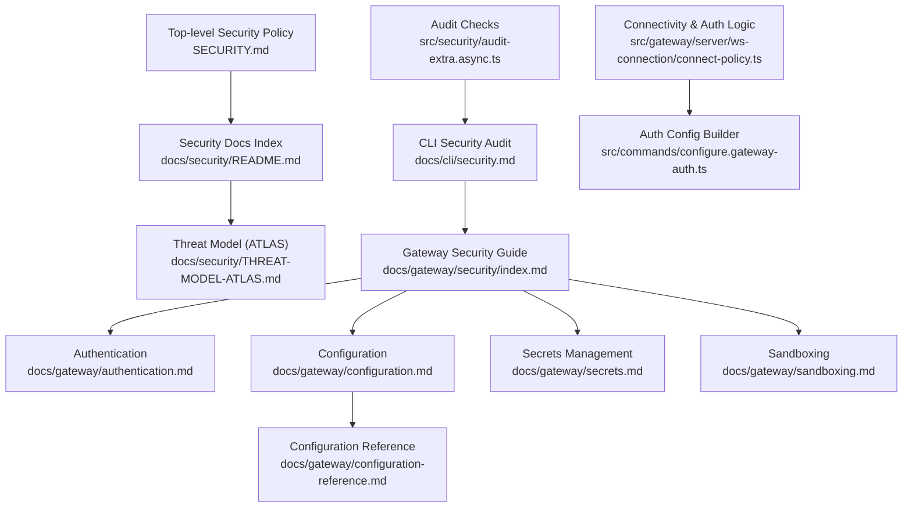
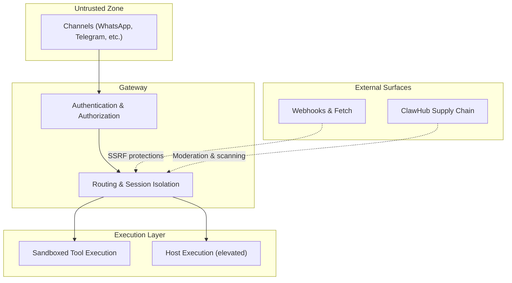
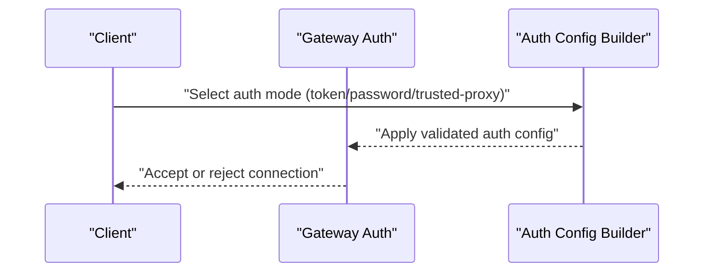
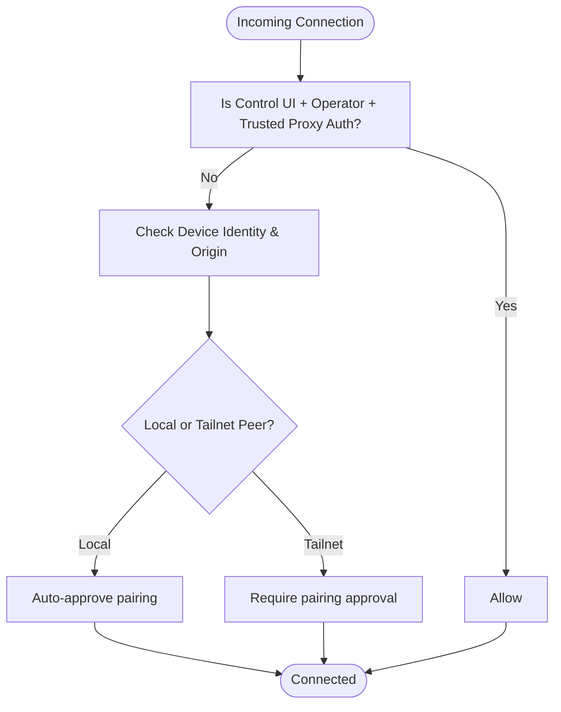
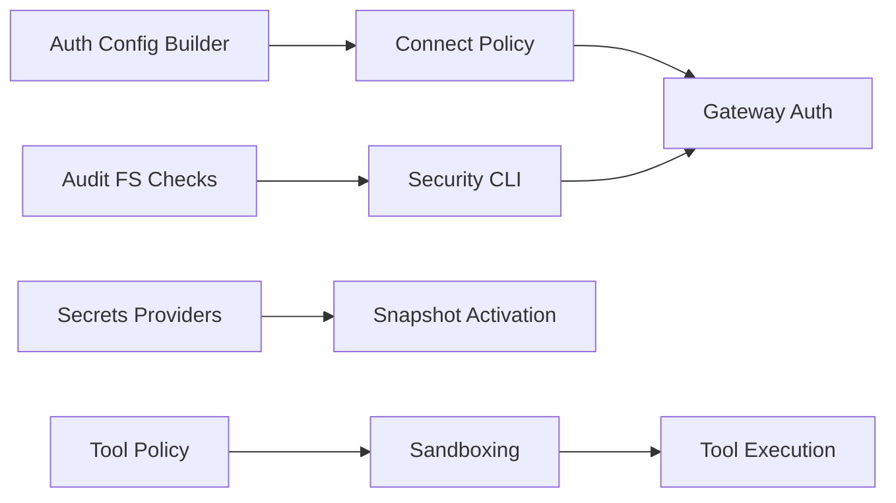

# Gateway Security

<cite>
**Referenced Files in This Document**
- [SECURITY.md](file://SECURITY.md)
- [docs/security/README.md](file://docs/security/README.md)
- [docs/security/THREAT-MODEL-ATLAS.md](file://docs/security/THREAT-MODEL-ATLAS.md)
- [docs/cli/security.md](file://docs/cli/security.md)
- [docs/gateway/authentication.md](file://docs/gateway/authentication.md)
- [docs/gateway/configuration.md](file://docs/gateway/configuration.md)
- [docs/gateway/configuration-reference.md](file://docs/gateway/configuration-reference.md)
- [docs/gateway/secrets.md](file://docs/gateway/secrets.md)
- [docs/gateway/sandboxing.md](file://docs/gateway/sandboxing.md)
- [src/gateway/server/ws-connection/connect-policy.ts](file://src/gateway/server/ws-connection/connect-policy.ts)
- [src/commands/configure.gateway-auth.ts](file://src/commands/configure.gateway-auth.ts)
- [src/commands/configure.gateway.ts](file://src/commands/configure.gateway.ts)
- [src/security/audit-extra.async.ts](file://src/security/audit-extra.async.ts)
- [src/channels/command-gating.test.ts](file://src/channels/command-gating.test.ts)
</cite>

## Table of Contents
1. [Introduction](#introduction)
2. [Project Structure](#project-structure)
3. [Core Components](#core-components)
4. [Architecture Overview](#architecture-overview)
5. [Detailed Component Analysis](#detailed-component-analysis)
6. [Dependency Analysis](#dependency-analysis)
7. [Performance Considerations](#performance-considerations)
8. [Troubleshooting Guide](#troubleshooting-guide)
9. [Conclusion](#conclusion)
10. [Appendices](#appendices)

## Introduction
This document provides comprehensive gateway security documentation for the OpenClaw platform. It covers the security model, access controls, protection mechanisms, security boundaries, path validation, origin checking, method scoping, role-based access control, privilege management, remote access policies, network isolation, secure communication, configuration examples, vulnerability assessment, incident response, hardening practices, penetration testing guidelines, compliance considerations, monitoring, threat detection, and audit procedures. The goal is to make security understandable for both technical and non-technical readers.

## Project Structure
Security-related materials are organized across:
- Top-level security policy and trust model
- Gateway configuration and authentication
- CLI security auditing and hardening
- Secrets management and credential lifecycle
- Sandboxing and tool execution isolation
- Threat model and risk analysis
- Access control and authorization logic

**Diagram sources**
- [SECURITY.md](file://SECURITY.md#L1-L286)
- [docs/security/README.md](file://docs/security/README.md#L1-L18)
- [docs/security/THREAT-MODEL-ATLAS.md](file://docs/security/THREAT-MODEL-ATLAS.md#L1-L604)
- [docs/cli/security.md](file://docs/cli/security.md#L1-L72)
- [docs/gateway/authentication.md](file://docs/gateway/authentication.md#L1-L180)
- [docs/gateway/configuration.md](file://docs/gateway/configuration.md#L1-L547)
- [docs/gateway/configuration-reference.md](file://docs/gateway/configuration-reference.md#L1-L200)
- [docs/gateway/secrets.md](file://docs/gateway/secrets.md#L1-L452)
- [docs/gateway/sandboxing.md](file://docs/gateway/sandboxing.md#L1-L260)
- [src/gateway/server/ws-connection/connect-policy.ts](file://src/gateway/server/ws-connection/connect-policy.ts#L46-L66)
- [src/commands/configure.gateway-auth.ts](file://src/commands/configure.gateway-auth.ts#L40-L76)
- [src/security/audit-extra.async.ts](file://src/security/audit-extra.async.ts#L1028-L1067)

**Section sources**
- [SECURITY.md](file://SECURITY.md#L1-L286)
- [docs/security/README.md](file://docs/security/README.md#L1-L18)
- [docs/security/THREAT-MODEL-ATLAS.md](file://docs/security/THREAT-MODEL-ATLAS.md#L1-L604)
- [docs/cli/security.md](file://docs/cli/security.md#L1-L72)
- [docs/gateway/authentication.md](file://docs/gateway/authentication.md#L1-L180)
- [docs/gateway/configuration.md](file://docs/gateway/configuration.md#L1-L547)
- [docs/gateway/configuration-reference.md](file://docs/gateway/configuration-reference.md#L1-L200)
- [docs/gateway/secrets.md](file://docs/gateway/secrets.md#L1-L452)
- [docs/gateway/sandboxing.md](file://docs/gateway/sandboxing.md#L1-L260)
- [src/gateway/server/ws-connection/connect-policy.ts](file://src/gateway/server/ws-connection/connect-policy.ts#L46-L66)
- [src/commands/configure.gateway-auth.ts](file://src/commands/configure.gateway-auth.ts#L40-L76)
- [src/security/audit-extra.async.ts](file://src/security/audit-extra.async.ts#L1028-L1067)

## Core Components
- Security trust model and operator assumptions
- Authentication and credential management
- Authorization and access control (including role-based checks)
- Remote access and secure communication
- Network exposure and isolation controls
- Secrets lifecycle and storage
- Sandboxing and tool execution boundaries
- Security auditing and hardening via CLI
- Threat model and risk prioritization

**Section sources**
- [SECURITY.md](file://SECURITY.md#L88-L170)
- [docs/gateway/authentication.md](file://docs/gateway/authentication.md#L1-L180)
- [docs/gateway/secrets.md](file://docs/gateway/secrets.md#L1-L452)
- [docs/gateway/sandboxing.md](file://docs/gateway/sandboxing.md#L1-L260)
- [docs/cli/security.md](file://docs/cli/security.md#L1-L72)
- [docs/security/THREAT-MODEL-ATLAS.md](file://docs/security/THREAT-MODEL-ATLAS.md#L1-L604)

## Architecture Overview
The gateway enforces layered protections:
- Trust boundaries separate channels, sessions, sandboxed execution, external content, and supply chain.
- Authentication and authorization gates control access to the gateway and remote clients.
- Tool policies and sandboxing constrain execution.
- Secrets management isolates credentials and rotates them safely.
- Auditing and hardening tools continuously assess and improve posture.

**Diagram sources**
- [docs/security/THREAT-MODEL-ATLAS.md](file://docs/security/THREAT-MODEL-ATLAS.md#L56-L123)
- [docs/gateway/sandboxing.md](file://docs/gateway/sandboxing.md#L1-L260)
- [docs/gateway/configuration-reference.md](file://docs/gateway/configuration-reference.md#L1-L200)

**Section sources**
- [docs/security/THREAT-MODEL-ATLAS.md](file://docs/security/THREAT-MODEL-ATLAS.md#L56-L123)
- [docs/gateway/sandboxing.md](file://docs/gateway/sandboxing.md#L1-L260)
- [docs/gateway/configuration-reference.md](file://docs/gateway/configuration-reference.md#L1-L200)

## Detailed Component Analysis

### Security Model and Trust Boundaries
- Operator trust model: authenticated gateway callers are trusted operators; session identifiers are routing controls, not per-user authorization boundaries.
- Gateway and node relationship: gateway is the control plane; pairing a node grants operator-level remote capability.
- Workspace memory and plugin trust: workspace memory files and plugins are trusted operator state; isolation between mutually untrusted users requires separate gateways and OS/user boundaries.
- Temp folder boundary: enforce absolute temp paths under managed roots; prefer OpenClaw temp helpers for media handling.

**Section sources**
- [SECURITY.md](file://SECURITY.md#L88-L179)
- [SECURITY.md](file://SECURITY.md#L161-L170)
- [SECURITY.md](file://SECURITY.md#L171-L204)

### Authentication and Authorization
- Authentication modes: token, password, and trusted-proxy. Token mode is recommended for most setups; password mode is supported via environment variable.
- Remote client credentials: separate from local auth; rotation requires updating both local and remote credentials.
- Role-based checks: trusted-proxy control UI operator auth requires specific role and method checks.
- Auth configuration builder ensures mode and credentials are valid and consistent.

**Diagram sources**
- [src/commands/configure.gateway-auth.ts](file://src/commands/configure.gateway-auth.ts#L40-L76)
- [src/gateway/server/ws-connection/connect-policy.ts](file://src/gateway/server/ws-connection/connect-policy.ts#L46-L66)

**Section sources**
- [docs/gateway/authentication.md](file://docs/gateway/authentication.md#L1-L180)
- [docs/gateway/security/index.md](file://docs/gateway/security/index.md#L748-L774)
- [src/commands/configure.gateway-auth.ts](file://src/commands/configure.gateway-auth.ts#L40-L76)
- [src/gateway/server/ws-connection/connect-policy.ts](file://src/gateway/server/ws-connection/connect-policy.ts#L46-L66)

### Access Controls and Origin Checking
- Device pairing: auto-approval for local connections; tailnet peers still require approval.
- Trusted proxy operator auth: requires operator role, trusted-proxy mode, and successful auth method.
- Control command gating: access groups toggle affects whether control commands are blocked when unauthorized.

**Diagram sources**
- [src/gateway/server/ws-connection/connect-policy.ts](file://src/gateway/server/ws-connection/connect-policy.ts#L46-L66)
- [docs/gateway/security/index.md](file://docs/gateway/security/index.md#L748-L774)

**Section sources**
- [src/gateway/server/ws-connection/connect-policy.ts](file://src/gateway/server/ws-connection/connect-policy.ts#L46-L66)
- [src/channels/command-gating.test.ts](file://src/channels/command-gating.test.ts#L1-L97)
- [docs/gateway/security/index.md](file://docs/gateway/security/index.md#L748-L774)

### Method Scoping and Privilege Management
- Tool policy: enforced before sandbox rules; denied tools cannot be executed even with sandboxing.
- Elevated exec: explicit escape hatch that runs on the host; default sandbox behavior is host-first unless sandbox is enabled.
- Exec approvals: allowlist plus ask mode to reduce accidental command execution.
- Session scoping: dmScope and thread bindings control conversation continuity and isolation.

**Section sources**
- [docs/gateway/sandboxing.md](file://docs/gateway/sandboxing.md#L218-L226)
- [SECURITY.md](file://SECURITY.md#L88-L102)
- [docs/gateway/configuration.md](file://docs/gateway/configuration.md#L178-L202)

### Remote Access, Network Isolation, and Secure Communication
- Loopback-only recommendation for the web control UI; strongly discouraged to expose publicly.
- Canvas host routes are intentionally network-visible for trusted node scenarios behind firewall/tailscale.
- Remote client credentials: separate from local auth; TLS fingerprint pinning supported for remote wss.
- Docker hardening guidance: non-root user, read-only rootfs, capability drops.

**Section sources**
- [SECURITY.md](file://SECURITY.md#L225-L242)
- [docs/gateway/security/index.md](file://docs/gateway/security/index.md#L748-L774)
- [SECURITY.md](file://SECURITY.md#L259-L274)

### Path Validation and Origin Checking Mechanisms
- Filesystem permission audits: auth-profiles.json and sessions.json must not be world/group writable/readable.
- Temp folder guardrails: enforce absolute temp paths under managed roots; discourage raw os.tmpdir() usage.
- Channel allowlists: prefer stable IDs over mutable names/emails/tags to prevent spoofing.

**Section sources**
- [src/security/audit-extra.async.ts](file://src/security/audit-extra.async.ts#L1028-L1067)
- [SECURITY.md](file://SECURITY.md#L188-L204)
- [docs/cli/security.md](file://docs/cli/security.md#L38-L39)

### Security Policies for Remote Access and Network Exposure
- Bind to loopback by default; CLI flag to force loopback binding.
- Dangerous flags summary: explicit break-glass operator overrides; enabling them is not a vulnerability by itself.
- Gateway auth mode selection and rotation checklist: generate new secret, restart gateway, update remote clients, verify old credentials revoked.

**Section sources**
- [SECURITY.md](file://SECURITY.md#L225-L242)
- [docs/cli/security.md](file://docs/cli/security.md#L40-L41)
- [docs/gateway/security/index.md](file://docs/gateway/security/index.md#L748-L774)

### Secrets Management and Credential Lifecycle
- SecretRef contract: env, file, exec sources with validation and defaults.
- Active-surface filtering: only effectively active credentials block startup/reload.
- Atomic snapshot activation: eager resolution with fail-fast on startup and atomic swap on reload.
- Audit and configure workflow: audit for plaintext, precedence shadowing, and legacy residues; configure to apply SecretRef plans safely.

**Section sources**
- [docs/gateway/secrets.md](file://docs/gateway/secrets.md#L1-L452)

### Sandboxing and Tool Execution Boundaries
- Modes: off, non-main, all; scope: session, agent, shared; workspace access: none, ro, rw.
- Browser sandbox: dedicated network, optional CDP source allowlist, noVNC password-protected.
- Dangerous binds and network joins: blocked by default; break-glass override gated.
- Tool policy and elevated exec: tool policy still applies before sandbox rules.

**Section sources**
- [docs/gateway/sandboxing.md](file://docs/gateway/sandboxing.md#L1-L260)
- [SECURITY.md](file://SECURITY.md#L88-L102)

### Security Configuration Examples
- Minimal config template for agents and channels.
- Strict validation: unknown keys or invalid values cause refusal to start; use doctor to diagnose and fix.
- Config hot reload: hybrid mode hot-applies safe changes; gateway and infrastructure changes require restart.
- Environment variables and secret refs: supported with precedence and substitution rules.

**Section sources**
- [docs/gateway/configuration.md](file://docs/gateway/configuration.md#L26-L73)
- [docs/gateway/configuration.md](file://docs/gateway/configuration.md#L349-L387)
- [docs/gateway/configuration.md](file://docs/gateway/configuration.md#L449-L539)

### Vulnerability Assessment Procedures
- Security audit CLI: run quick or deep audits; optional JSON output for CI; --fix applies safe remediations.
- Dangerous parameter inventory: explicit break-glass flags; enabling them is not a vulnerability report.
- Audit findings: groupPolicy open, logging redactSensitive, state/config permissions, sandbox settings, channel allowlists, gateway auth mode.

**Section sources**
- [docs/cli/security.md](file://docs/cli/security.md#L1-L72)
- [SECURITY.md](file://SECURITY.md#L40-L46)

### Incident Response Protocols
- Private vulnerability reporting: report via appropriate repositories or security email; include severity, impact, affected component, reproduction, demonstrated impact, environment, remediation advice.
- Report acceptance gate: exact vulnerable path, tested version, reproducible PoC, trust-boundary impact, proof of OpenClaw ownership/impact, scope check, boundary-bypass path for parity-only claims.
- Common false-positive patterns: prompt-injection-only, operator-intended features, authorized user-triggered local actions, trusted plugin behavior, multi-tenant assumptions, parity-only differences.

**Section sources**
- [SECURITY.md](file://SECURITY.md#L5-L46)
- [SECURITY.md](file://SECURITY.md#L48-L67)

### Security Hardening Practices
- Node.js version requirement: meet CVE-2025-59466 and CVE-2026-21636; verify with node --version.
- Docker hardening: non-root user, read-only filesystem, capability drops.
- Operational guidance: loopback-only control UI, tighten permissions, workspace-only tooling, sub-agent delegation hardening, web interface safety.

**Section sources**
- [SECURITY.md](file://SECURITY.md#L244-L274)
- [SECURITY.md](file://SECURITY.md#L205-L243)

### Penetration Testing Guidelines
- Use the threat model to scope tests across reconnaissance, initial access, execution, persistence, defense evasion, discovery, collection/exfiltration, and impact.
- Focus on prompt injection bypasses, exec approval bypasses, moderation pattern evasion, SSRF, and supply chain risks.
- Recommendations include VirusTotal integration, skill sandboxing, output validation, rate limiting, token encryption, improved exec approval UX, and URL allowlisting.

**Section sources**
- [docs/security/THREAT-MODEL-ATLAS.md](file://docs/security/THREAT-MODEL-ATLAS.md#L138-L527)

### Compliance Considerations
- Operator trust model: one trusted operator per gateway; multiple users require separate gateways and OS/user boundaries.
- Agent and model assumptions: model/agent is not trusted; security boundaries come from host/config trust, auth, tool policy, sandboxing, and exec approvals.
- Workspace memory trust boundary: treat as trusted operator state; isolation requires separate gateways.
- Plugin trust boundary: plugins are loaded in-process and treated as trusted code; prefer allowlists and pinning.

**Section sources**
- [SECURITY.md](file://SECURITY.md#L142-L187)

### Security Monitoring, Threat Detection, and Audit Procedures
- Security scanning: detect-secrets baseline and scanning; run locally with pip install detect-secrets.
- Audit extra: filesystem permission checks for auth-profiles.json and sessions.json; actionable remediation guidance.
- Secrets audit: find plaintext at rest, sensitive provider header residues, unresolved refs, precedence shadowing, legacy residues.

**Section sources**
- [SECURITY.md](file://SECURITY.md#L275-L286)
- [src/security/audit-extra.async.ts](file://src/security/audit-extra.async.ts#L1028-L1067)
- [docs/gateway/secrets.md](file://docs/gateway/secrets.md#L372-L381)

## Dependency Analysis
- Authentication depends on configuration builder and connect policy.
- Authorization depends on role checks and trusted-proxy configuration.
- Tool execution depends on tool policy and sandboxing configuration.
- Secrets management depends on provider configuration and snapshot activation.
- Auditing depends on filesystem inspection and configuration validation.

**Diagram sources**
- [src/commands/configure.gateway-auth.ts](file://src/commands/configure.gateway-auth.ts#L40-L76)
- [src/gateway/server/ws-connection/connect-policy.ts](file://src/gateway/server/ws-connection/connect-policy.ts#L46-L66)
- [docs/gateway/sandboxing.md](file://docs/gateway/sandboxing.md#L1-L260)
- [docs/gateway/secrets.md](file://docs/gateway/secrets.md#L1-L452)
- [src/security/audit-extra.async.ts](file://src/security/audit-extra.async.ts#L1028-L1067)
- [docs/cli/security.md](file://docs/cli/security.md#L1-L72)

**Section sources**
- [src/commands/configure.gateway-auth.ts](file://src/commands/configure.gateway-auth.ts#L40-L76)
- [src/gateway/server/ws-connection/connect-policy.ts](file://src/gateway/server/ws-connection/connect-policy.ts#L46-L66)
- [docs/gateway/sandboxing.md](file://docs/gateway/sandboxing.md#L1-L260)
- [docs/gateway/secrets.md](file://docs/gateway/secrets.md#L1-L452)
- [src/security/audit-extra.async.ts](file://src/security/audit-extra.async.ts#L1028-L1067)
- [docs/cli/security.md](file://docs/cli/security.md#L1-L72)

## Performance Considerations
- Sandboxing adds overhead; default to non-main sessions for normal chats and sandbox only when needed.
- Tool policy evaluation and sandbox checks occur before execution; keep policies minimal and precise.
- Secrets resolution is eager during activation; avoid excessive providers and large batches to minimize startup latency.

[No sources needed since this section provides general guidance]

## Troubleshooting Guide
- Authentication troubleshooting: check token/password validity, environment variables, and remote client credentials; rotate credentials following the checklist.
- Secrets troubleshooting: run secrets audit to identify plaintext, unresolved refs, and precedence issues; use configure to apply SecretRef plans.
- Audit troubleshooting: use --fix to apply safe remediations; interpret JSON output for CI checks; verify permissions and sensitive logging settings.

**Section sources**
- [docs/gateway/authentication.md](file://docs/gateway/authentication.md#L160-L180)
- [docs/gateway/secrets.md](file://docs/gateway/secrets.md#L362-L421)
- [docs/cli/security.md](file://docs/cli/security.md#L43-L72)

## Conclusion
OpenClaw’s security model centers on a personal-assistant trust model with authenticated operators, layered authorization, and strong execution isolation via sandboxing. The gateway enforces strict configuration validation, manages secrets securely, and provides robust auditing and hardening tools. By adhering to the documented trust boundaries, access controls, and operational guidance—combined with continuous monitoring and threat modeling—you can maintain a secure deployment tailored to your environment.

[No sources needed since this section summarizes without analyzing specific files]

## Appendices

### Appendix A: Security CLI Reference
- Security audit: run quick or deep audits; optional JSON output; --fix applies safe remediations.
- Dangerous parameters: explicit break-glass flags; enabling them is not a vulnerability.

**Section sources**
- [docs/cli/security.md](file://docs/cli/security.md#L1-L72)
- [SECURITY.md](file://SECURITY.md#L40-L46)

### Appendix B: Threat Model Highlights
- Critical risks: prompt injection to RCE, supply chain compromise, credential harvesting, and resource exhaustion.
- Attack chains: skill-based data theft, prompt injection to RCE, and indirect injection via fetched content.
- Recommendations: VirusTotal integration, skill sandboxing, output validation, rate limiting, token encryption, improved exec approval UX, URL allowlisting.

**Section sources**
- [docs/security/THREAT-MODEL-ATLAS.md](file://docs/security/THREAT-MODEL-ATLAS.md#L485-L556)