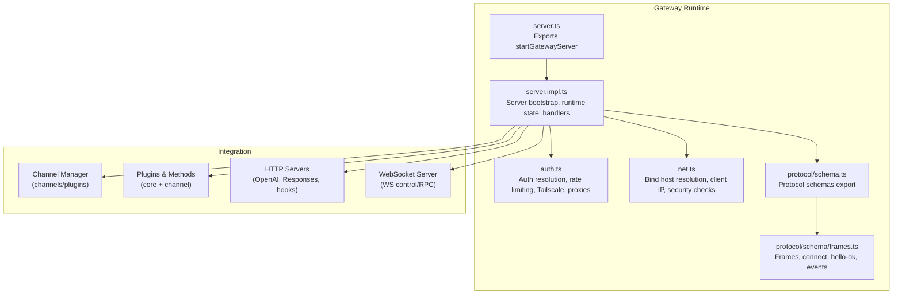
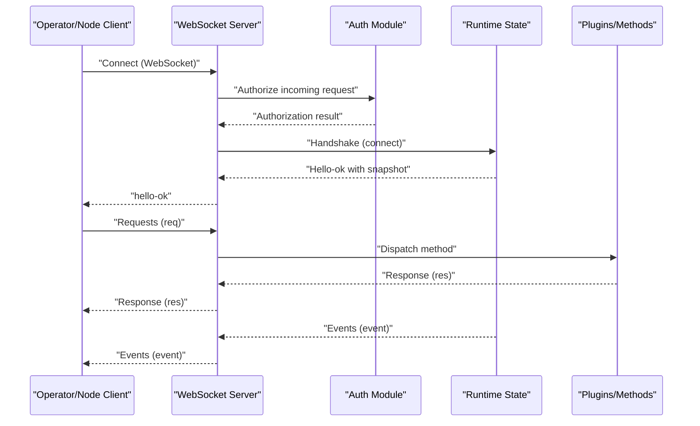
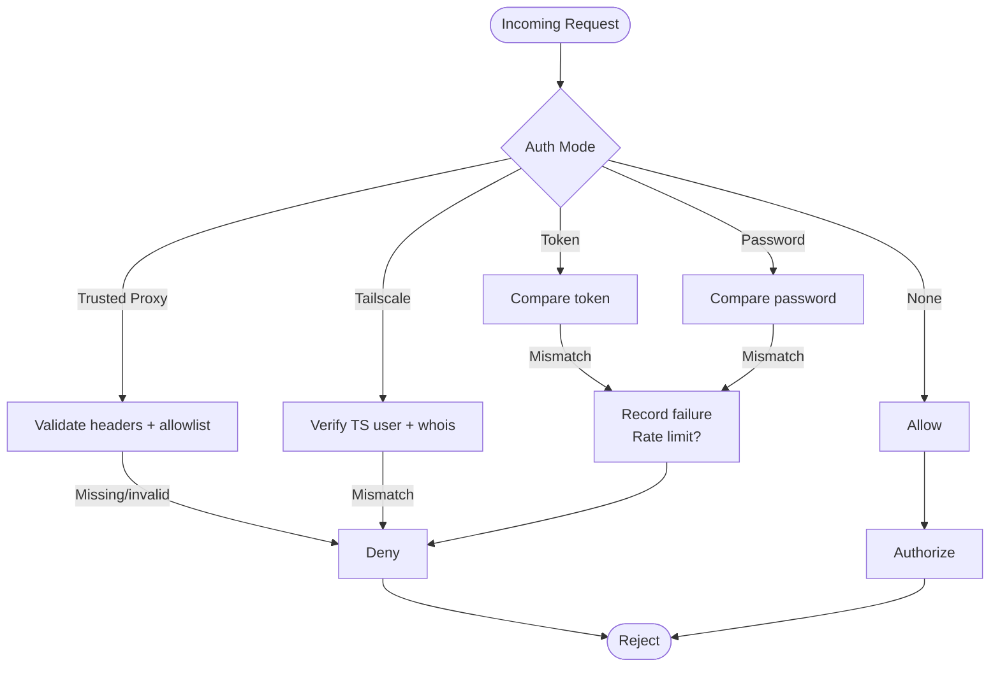
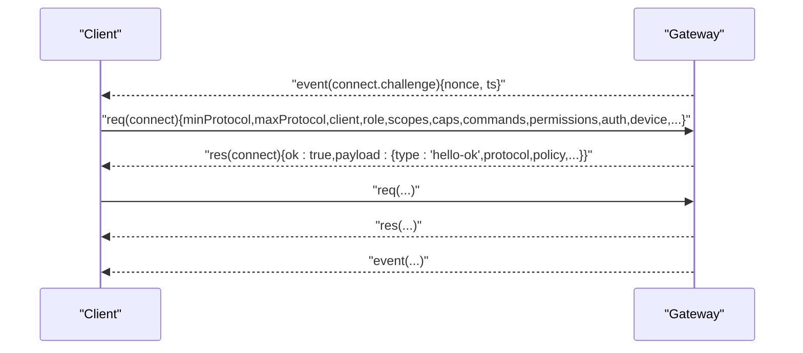
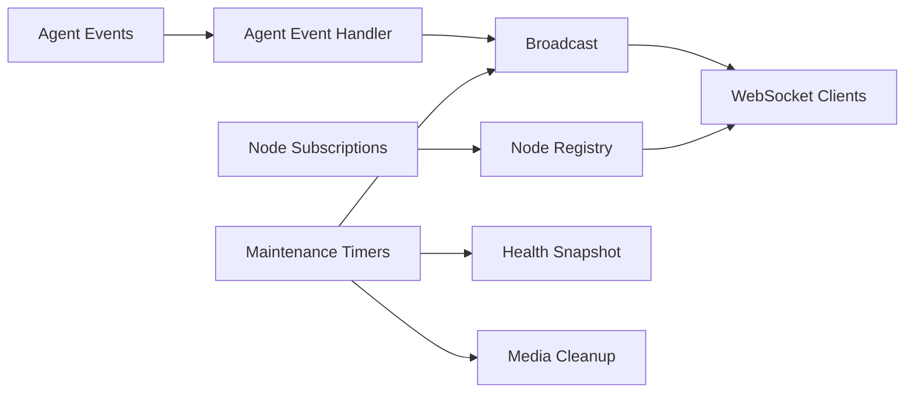
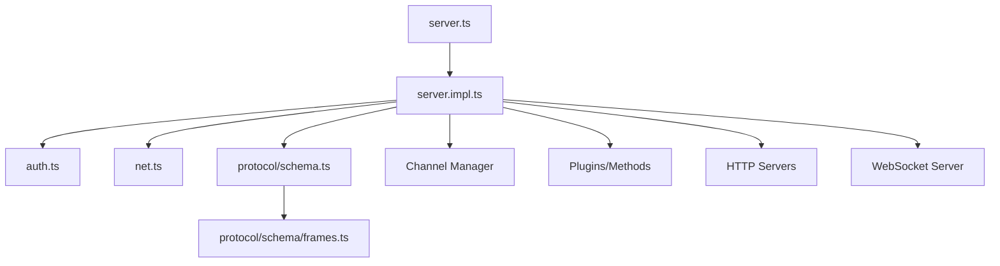

# Gateway System

<cite>
**Referenced Files in This Document**
- [docs/gateway/index.md](file://docs/gateway/index.md)
- [docs/gateway/configuration.md](file://docs/gateway/configuration.md)
- [docs/gateway/protocol.md](file://docs/gateway/protocol.md)
- [docs/gateway/authentication.md](file://docs/gateway/authentication.md)
- [src/gateway/server.ts](file://src/gateway/server.ts)
- [src/gateway/server.impl.ts](file://src/gateway/server.impl.ts)
- [src/gateway/auth.ts](file://src/gateway/auth.ts)
- [src/gateway/net.ts](file://src/gateway/net.ts)
- [src/gateway/protocol/schema.ts](file://src/gateway/protocol/schema.ts)
- [src/gateway/protocol/schema/frames.ts](file://src/gateway/protocol/schema/frames.ts)
</cite>

## Table of Contents
1. [Introduction](#introduction)
2. [Project Structure](#project-structure)
3. [Core Components](#core-components)
4. [Architecture Overview](#architecture-overview)
5. [Detailed Component Analysis](#detailed-component-analysis)
6. [Dependency Analysis](#dependency-analysis)
7. [Performance Considerations](#performance-considerations)
8. [Troubleshooting Guide](#troubleshooting-guide)
9. [Conclusion](#conclusion)
10. [Appendices](#appendices)

## Introduction
This document describes the Gateway System that serves as the central control plane for OpenClaw. The Gateway provides:
- A single always-on process hosting routing, control plane, and channel connections
- A unified WebSocket control/RPC channel for operator and node clients
- Integrated HTTP APIs (OpenAI-compatible, OpenResponses, tools invoke)
- A Control UI and hooks
- Robust authentication and authorization for operator and node roles
- Real-time eventing and session/channel/tool/event orchestration

It documents the WebSocket-based protocol, server configuration, authentication mechanisms, and operational runbooks. It also covers clustering, load balancing, and high availability considerations, along with troubleshooting guidance.

## Project Structure
The Gateway is implemented in TypeScript and organized around a modular runtime that composes:
- Server bootstrap and lifecycle
- Authentication and authorization
- Network binding and security policies
- Protocol framing and method schemas
- Channel manager and plugin integration
- Cron, maintenance timers, and discovery

**Diagram sources**
- [src/gateway/server.ts](file://src/gateway/server.ts#L1-L4)
- [src/gateway/server.impl.ts](file://src/gateway/server.impl.ts#L1-L120)
- [src/gateway/auth.ts](file://src/gateway/auth.ts#L1-L120)
- [src/gateway/net.ts](file://src/gateway/net.ts#L220-L271)
- [src/gateway/protocol/schema.ts](file://src/gateway/protocol/schema.ts#L1-L19)
- [src/gateway/protocol/schema/frames.ts](file://src/gateway/protocol/schema/frames.ts#L1-L60)

**Section sources**
- [src/gateway/server.ts](file://src/gateway/server.ts#L1-L4)
- [src/gateway/server.impl.ts](file://src/gateway/server.impl.ts#L266-L320)
- [src/gateway/auth.ts](file://src/gateway/auth.ts#L217-L292)
- [src/gateway/net.ts](file://src/gateway/net.ts#L220-L271)
- [src/gateway/protocol/schema.ts](file://src/gateway/protocol/schema.ts#L1-L19)

## Core Components
- Server bootstrap and runtime state
  - Initializes configuration, secrets, plugins, channels, cron, discovery, and maintenance timers
  - Creates HTTP servers (OpenAI-compatible, OpenResponses, hooks) and WebSocket server
  - Manages broadcast, subscriptions, and agent/node event dispatch
- Authentication and authorization
  - Supports token, password, trusted proxy, and Tailscale modes
  - Enforces rate limiting and device identity policies
- Network and security
  - Resolves bind host across loopback, LAN, tailnet, auto, and custom modes
  - Validates client IPs, trusted proxies, and secure WebSocket URLs
- Protocol and method schemas
  - Defines request/response/event frames, connect/hello-ok, and typed method surfaces
- Configuration and hot reload
  - Reads JSON5 config, validates against schema, and hot-applies safe changes

**Section sources**
- [src/gateway/server.impl.ts](file://src/gateway/server.impl.ts#L488-L520)
- [src/gateway/auth.ts](file://src/gateway/auth.ts#L378-L485)
- [src/gateway/net.ts](file://src/gateway/net.ts#L411-L456)
- [src/gateway/protocol/schema/frames.ts](file://src/gateway/protocol/schema/frames.ts#L125-L164)
- [docs/gateway/configuration.md](file://docs/gateway/configuration.md#L349-L387)

## Architecture Overview
The Gateway is a single always-on process that:
- Binds a single port for WebSocket control/RPC and HTTP APIs
- Serves the Control UI and hooks
- Manages channel connections and plugins
- Exposes a typed method surface over WebSocket and HTTP

**Diagram sources**
- [src/gateway/server.impl.ts](file://src/gateway/server.impl.ts#L600-L626)
- [src/gateway/auth.ts](file://src/gateway/auth.ts#L378-L485)
- [src/gateway/protocol/schema/frames.ts](file://src/gateway/protocol/schema/frames.ts#L125-L164)

## Detailed Component Analysis

### Server Implementation
The server bootstrap coordinates configuration loading, secrets activation, plugin loading, channel initialization, and runtime state creation. It sets up:
- HTTP servers for OpenAI-compatible chat completions, OpenResponses, and hooks
- WebSocket server for control/RPC
- Discovery, cron, heartbeat, maintenance timers, and health snapshots
- Broadcast and subscription systems for agent/node events

Key responsibilities:
- Resolve runtime configuration (bind host, ports, auth, TLS, HTTP endpoints)
- Initialize plugin registry and method surface
- Start channel manager and health monitor
- Register maintenance timers and diagnostics
- Attach WebSocket handlers and broadcast subsystem

Operational highlights:
- Supports graceful shutdown emitting a shutdown event
- Emits system events for secrets reload status
- Integrates with Tailscale exposure and discovery
- Applies lane concurrency and media cleanup policies

**Section sources**
- [src/gateway/server.impl.ts](file://src/gateway/server.impl.ts#L266-L320)
- [src/gateway/server.impl.ts](file://src/gateway/server.impl.ts#L488-L520)
- [src/gateway/server.impl.ts](file://src/gateway/server.impl.ts#L600-L626)
- [src/gateway/server.impl.ts](file://src/gateway/server.impl.ts#L706-L725)

### Authentication and Authorization
The Gateway supports multiple auth modes:
- Token-based (default)
- Password-based
- Trusted proxy (for reverse-proxy-managed identities)
- Tailscale (for loopback and tailnet contexts)

Features:
- Rate limiting for auth attempts
- Device identity and challenge-response for node/operator clients
- Local direct request detection and loopback/Tailscale policies
- Trusted proxy header validation and allowlists
- Secure WebSocket URL enforcement (wss or loopback by default)

**Diagram sources**
- [src/gateway/auth.ts](file://src/gateway/auth.ts#L378-L485)

**Section sources**
- [src/gateway/auth.ts](file://src/gateway/auth.ts#L217-L292)
- [src/gateway/auth.ts](file://src/gateway/auth.ts#L378-L485)
- [src/gateway/net.ts](file://src/gateway/net.ts#L411-L456)

### Network Binding and Security Policies
The Gateway resolves its bind host across modes:
- loopback: prefers 127.0.0.1, falls back to 0.0.0.0
- lan: binds 0.0.0.0
- tailnet: uses primary Tailnet IPv4 if available, else loopback
- auto: loopback if available, else LAN
- custom: user-specified IP with fallback to LAN

Security validations:
- Client IP resolution through trusted proxies and forwarded headers
- Localish host detection for loopback and Tailscale hostnames
- Secure WebSocket URL policy (strict loopback by default; optional private network allowance)
- SSRF and private-range checks for hostnames/IPs

**Section sources**
- [src/gateway/net.ts](file://src/gateway/net.ts#L220-L271)
- [src/gateway/net.ts](file://src/gateway/net.ts#L411-L456)

### Protocol Specification
The Gateway WebSocket protocol is the single control plane for sessions, channels, tools, and events. It uses text frames with JSON payloads and requires a connect handshake.

Handshake:
- Pre-connect challenge with nonce and timestamp
- Client connect with min/max protocol, client identity, role/scopes, capabilities, permissions, device identity, and auth
- Server responds with hello-ok including protocol version, features, snapshot, and optional device token

Framing:
- Request: req(id, method, params)
- Response: res(id, ok, payload|error)
- Event: event(event, payload, seq?, stateVersion?)

Roles and scopes:
- operator: control plane client (CLI/UI/automation)
- node: capability host (camera/screen/canvas/system.run)

Device identity and pairing:
- Nodes include a stable device identity and sign the server nonce
- Device tokens are issued per device + role and can be rotated/revoke

Versioning:
- Protocol version is defined in schema and validated by clients

**Diagram sources**
- [docs/gateway/protocol.md](file://docs/gateway/protocol.md#L22-L78)
- [src/gateway/protocol/schema/frames.ts](file://src/gateway/protocol/schema/frames.ts#L20-L69)
- [src/gateway/protocol/schema/frames.ts](file://src/gateway/protocol/schema/frames.ts#L71-L112)

**Section sources**
- [docs/gateway/protocol.md](file://docs/gateway/protocol.md#L10-L261)
- [src/gateway/protocol/schema/frames.ts](file://src/gateway/protocol/schema/frames.ts#L125-L164)

### Configuration Management and Hot Reload
The Gateway reads an optional JSON5 config from the default path and validates against a strict schema. It supports:
- Interactive wizard, CLI, Control UI, and direct editing
- Strict validation: unknown keys, malformed types, or invalid values prevent startup
- Hot reload modes:
  - hybrid (default): hot-apply safe changes, restart for critical changes
  - hot: hot-apply only safe changes
  - restart: restart on any change
  - off: disable file watching
- Programmatic config RPCs (config.apply, config.patch) with rate limiting and restart coalescing

Operational commands:
- openclaw gateway status, install, restart, stop, logs, doctor
- Secrets reload and environment variable precedence

**Section sources**
- [docs/gateway/configuration.md](file://docs/gateway/configuration.md#L1-L547)
- [docs/gateway/index.md](file://docs/gateway/index.md#L94-L123)

### Real-Time Communication Patterns
The Gateway maintains:
- Presence and system presence snapshots
- Broadcast channels for events (agent, chat, presence, tick, health, heartbeat, shutdown)
- Node subscription manager for targeted event delivery
- Dedupe and chat run buffers for reliable delivery
- Maintenance timers for periodic ticks, health refresh, and media cleanup

**Diagram sources**
- [src/gateway/server.impl.ts](file://src/gateway/server.impl.ts#L727-L740)
- [src/gateway/server.impl.ts](file://src/gateway/server.impl.ts#L706-L725)

**Section sources**
- [src/gateway/server.impl.ts](file://src/gateway/server.impl.ts#L706-L740)

### Security Policies
- Auth policies: token/password/trusted-proxy/Tailscale with rate limiting
- Device identity: challenge-response, nonce validation, signature verification, and device token issuance
- Network security: bind host resolution, client IP resolution, secure WebSocket URL enforcement
- Secrets management: runtime snapshot activation, warnings, degraded mode handling, and reload diagnostics

**Section sources**
- [src/gateway/auth.ts](file://src/gateway/auth.ts#L378-L485)
- [src/gateway/net.ts](file://src/gateway/net.ts#L411-L456)
- [src/gateway/server.impl.ts](file://src/gateway/server.impl.ts#L333-L397)

### Clustering, Load Balancing, and High Availability
- Multiple gateways on one host: use unique ports, config paths, state directories, and agent workspaces
- Remote access: Tailscale/VPN preferred; SSH tunnel as fallback
- Bind modes: loopback for local-only, LAN for multi-host, tailnet for Tailscale-only, auto for best-effort local
- Discovery: Bonjour/mDNS and optional wide-area discovery; Tailscale exposure
- Graceful restarts: SIGUSR1 policy, restart deferral checks, and coalesced restarts for config changes

Operational guidance:
- Prefer loopback bind for single-host setups
- Use tailnet or LAN bind modes for multi-host deployments
- Employ reverse proxies with trusted proxy headers for operator login
- Monitor health and readiness via CLI commands

**Section sources**
- [docs/gateway/index.md](file://docs/gateway/index.md#L108-L190)
- [src/gateway/net.ts](file://src/gateway/net.ts#L220-L271)
- [src/gateway/server.impl.ts](file://src/gateway/server.impl.ts#L660-L673)

## Dependency Analysis
The Gateway composes subsystems through a layered design:
- server.ts exports the public API for starting the server
- server.impl.ts orchestrates configuration, secrets, plugins, channels, HTTP/WS servers, and runtime state
- auth.ts and net.ts provide cross-cutting concerns for authentication and network security
- protocol/schema.ts and protocol/schema/frames.ts define the typed protocol surface

**Diagram sources**
- [src/gateway/server.ts](file://src/gateway/server.ts#L1-L4)
- [src/gateway/server.impl.ts](file://src/gateway/server.impl.ts#L1-L120)
- [src/gateway/auth.ts](file://src/gateway/auth.ts#L1-L120)
- [src/gateway/net.ts](file://src/gateway/net.ts#L1-L60)
- [src/gateway/protocol/schema.ts](file://src/gateway/protocol/schema.ts#L1-L19)
- [src/gateway/protocol/schema/frames.ts](file://src/gateway/protocol/schema/frames.ts#L1-L60)

**Section sources**
- [src/gateway/server.ts](file://src/gateway/server.ts#L1-L4)
- [src/gateway/server.impl.ts](file://src/gateway/server.impl.ts#L1-L120)

## Performance Considerations
- Hot reload: hybrid mode balances safety and convenience; critical changes trigger restarts
- Concurrency: lane concurrency applied at startup; maintenance timers batch periodic tasks
- Media cleanup: TTL-based cleanup for transient media with bounds checking
- Diagnostics: optional diagnostic heartbeat for observability
- Rate limiting: auth attempts are rate-limited to mitigate brute-force and abuse

[No sources needed since this section provides general guidance]

## Troubleshooting Guide
Common failure signatures and remedies:
- Refusing to bind without auth: ensure token/password configured for non-loopback binds
- Port conflicts: another gateway instance already listening; adjust port or force restart
- Config set to remote mode: set gateway.mode=local or configure appropriate auth
- Unauthorized during connect: mismatch between client auth and gateway configuration

Operational checks:
- Liveness: open WS and send connect; expect hello-ok snapshot
- Readiness: use CLI status and channel health probes
- Gap recovery: refresh health/system-presence on sequence gaps

**Section sources**
- [docs/gateway/index.md](file://docs/gateway/index.md#L235-L244)
- [docs/gateway/index.md](file://docs/gateway/index.md#L216-L234)

## Conclusion
The Gateway System is the central control plane for OpenClaw, providing a unified WebSocket/HTTP interface for operators and nodes, robust authentication and authorization, and a typed protocol for sessions, channels, tools, and events. Its modular runtime integrates plugins, channels, cron, discovery, and maintenance timers, while supporting secure binding modes, trusted proxies, and Tailscale exposure. The configuration system enforces strict schema validation and supports hot reload, and the operational runbooks provide practical guidance for startup, supervision, and troubleshooting.

[No sources needed since this section summarizes without analyzing specific files]

## Appendices

### Gateway Protocol Quick Reference (Operator View)
- First client frame must be connect
- Gateway returns hello-ok with snapshot, protocol version, and policy
- Requests: req(method, params) → res(ok/payload|error)
- Common events: connect.challenge, agent, chat, presence, tick, health, heartbeat, shutdown

**Section sources**
- [docs/gateway/index.md](file://docs/gateway/index.md#L202-L214)

### Authentication Quick Reference
- Token-based auth: OPENCLAW_GATEWAY_TOKEN or gateway.auth.token
- Password-based auth: OPENCLAW_GATEWAY_PASSWORD or gateway.auth.password
- Trusted proxy: requires trustedProxy config and headers
- Tailscale: loopback/Tailnet header auth for WS Control UI

**Section sources**
- [docs/gateway/authentication.md](file://docs/gateway/authentication.md#L21-L120)
- [src/gateway/auth.ts](file://src/gateway/auth.ts#L217-L292)