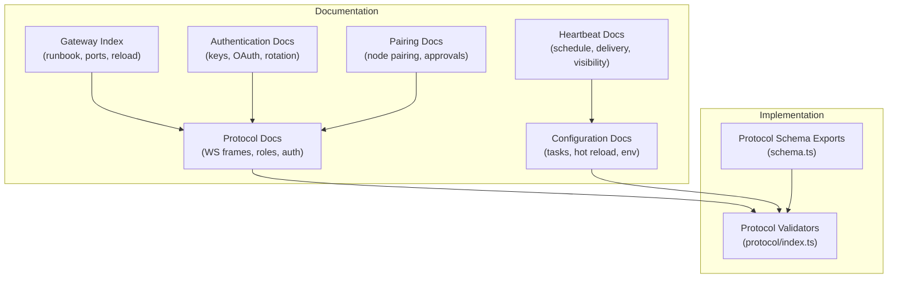
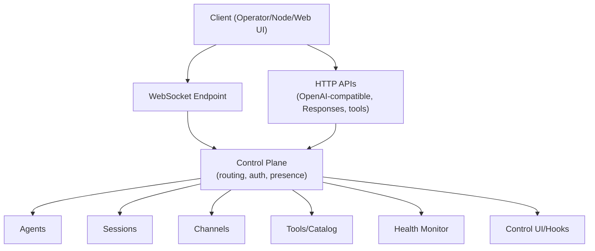
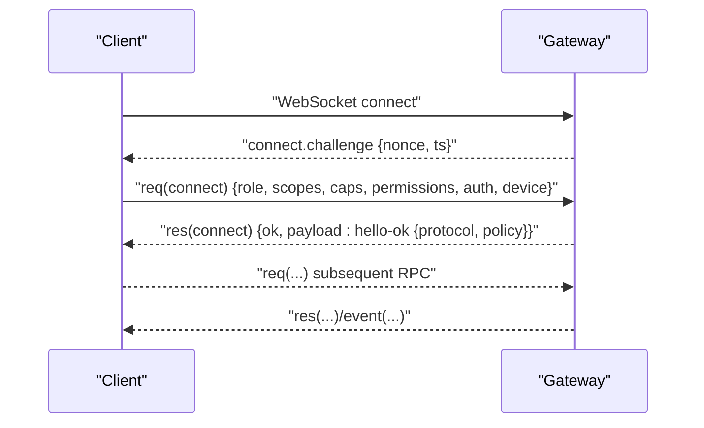
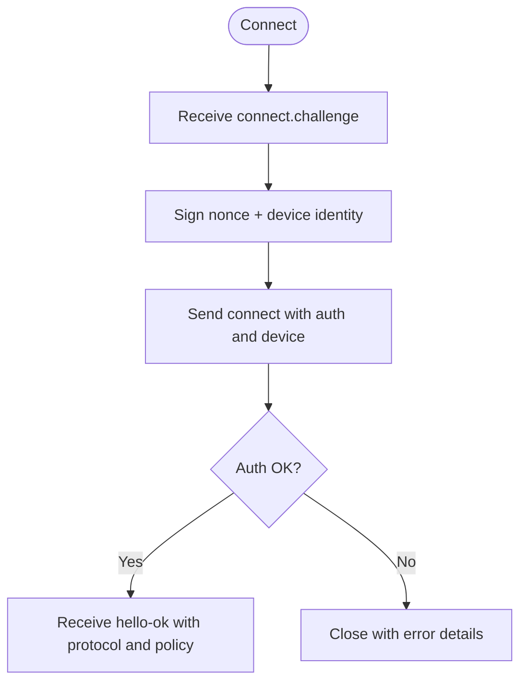
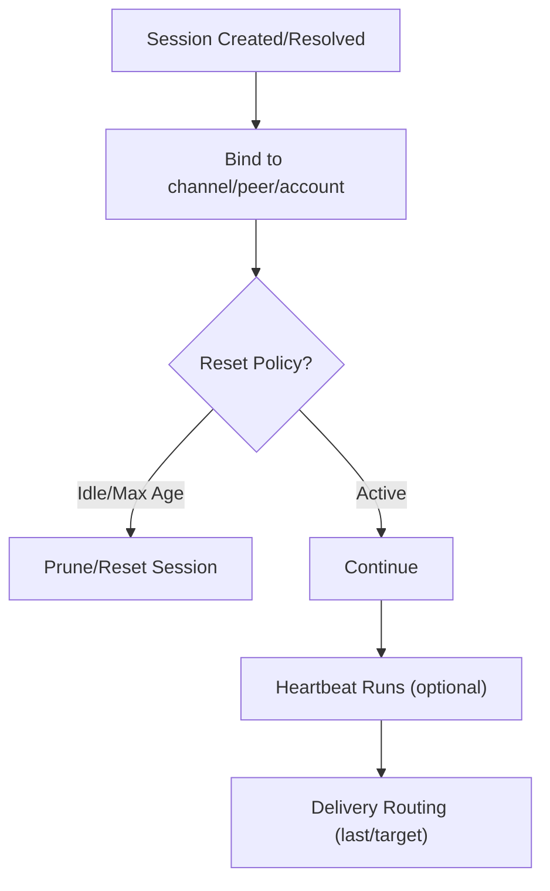
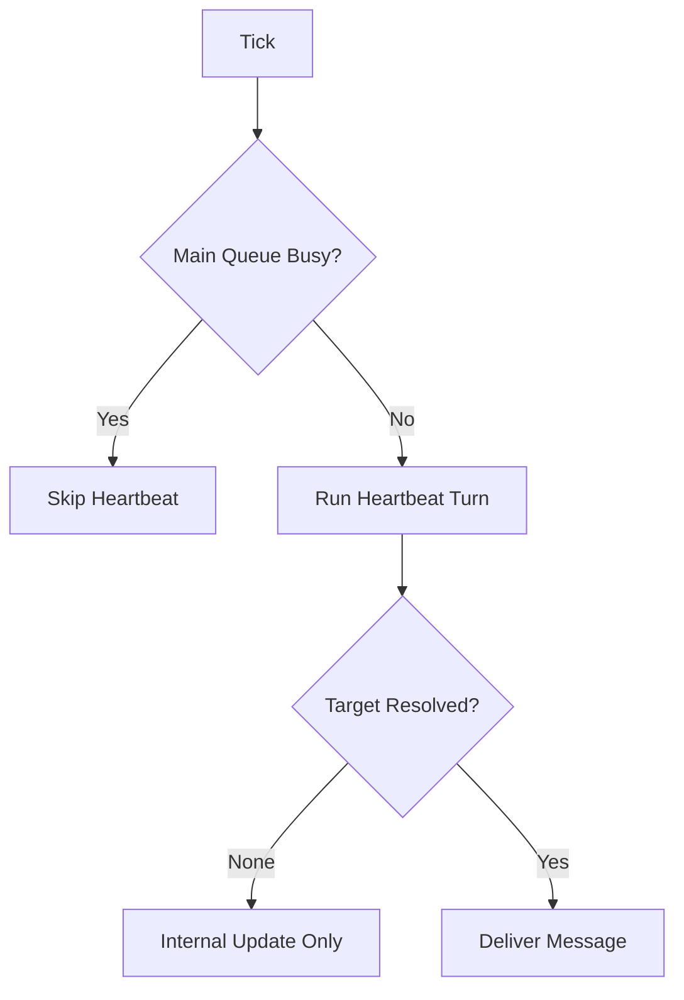
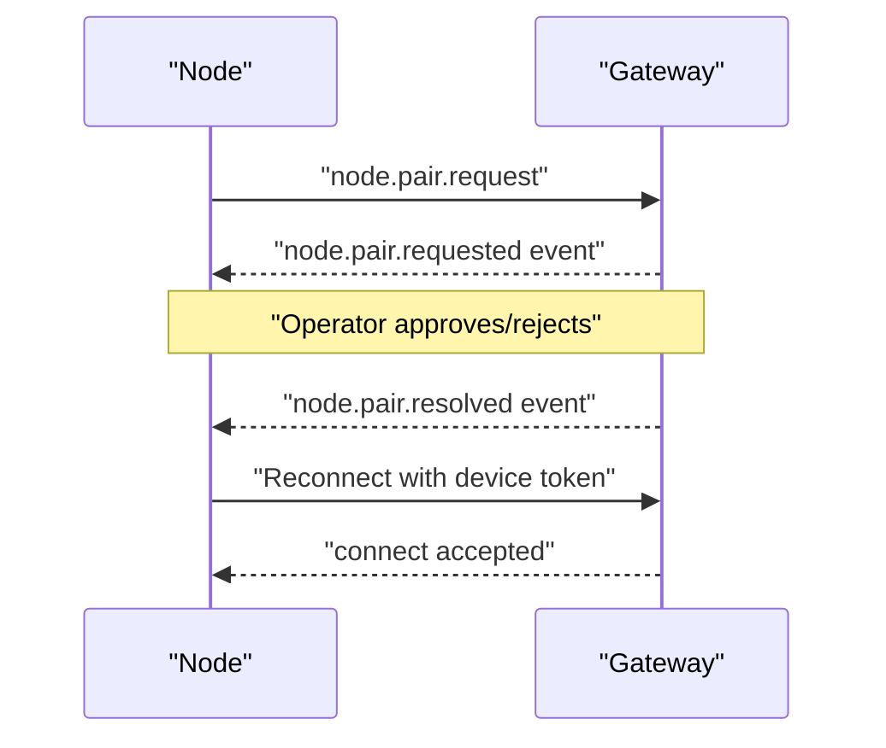
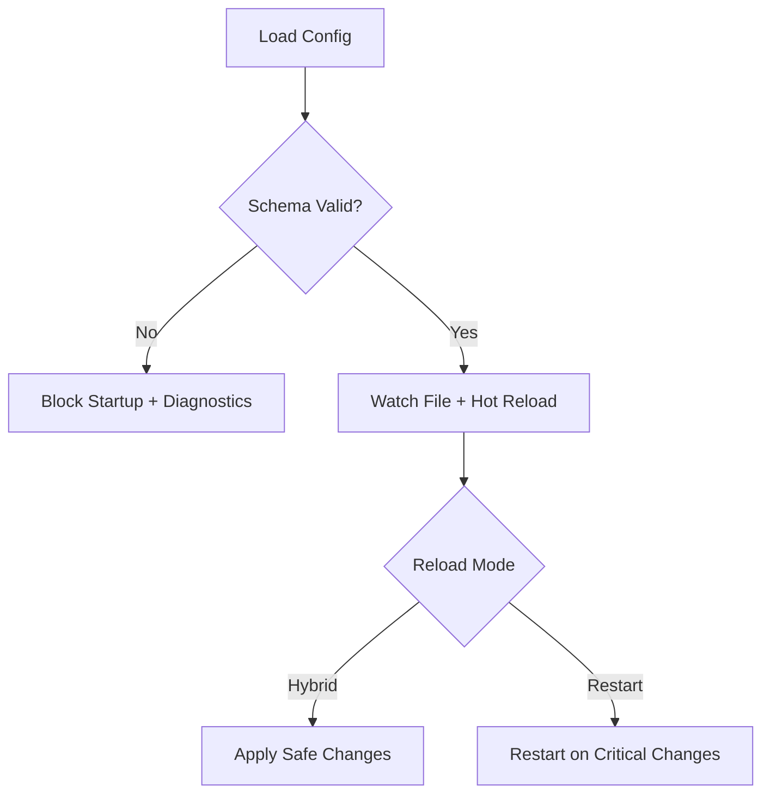
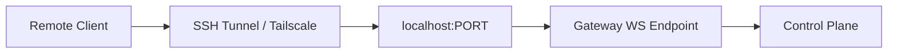
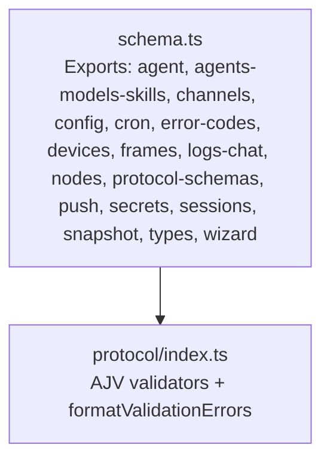

# Gateway System

<cite>
**Referenced Files in This Document**
- [index.md](file://docs/gateway/index.md)
- [protocol.md](file://docs/gateway/protocol.md)
- [configuration.md](file://docs/gateway/configuration.md)
- [authentication.md](file://docs/gateway/authentication.md)
- [heartbeat.md](file://docs/gateway/heartbeat.md)
- [pairing.md](file://docs/gateway/pairing.md)
- [schema.ts](file://src/gateway/protocol/schema.ts)
- [protocol/index.ts](file://src/gateway/protocol/index.ts)
</cite>

## Table of Contents
1. [Introduction](#introduction)
2. [Project Structure](#project-structure)
3. [Core Components](#core-components)
4. [Architecture Overview](#architecture-overview)
5. [Detailed Component Analysis](#detailed-component-analysis)
6. [Dependency Analysis](#dependency-analysis)
7. [Performance Considerations](#performance-considerations)
8. [Troubleshooting Guide](#troubleshooting-guide)
9. [Conclusion](#conclusion)
10. [Appendices](#appendices)

## Introduction
The Gateway serves as the central control plane for OpenClaw. It orchestrates all operations across clients, tools, and events through a unified WebSocket-based protocol. It provides:
- Single-port multiplexing for WebSocket control/RPC, HTTP APIs (OpenAI-compatible, Responses, tools invoke), and the Control UI/hooks
- Role-based access control and device identity-based pairing
- Presence detection, health monitoring, and heartbeat scheduling
- Remote access via Tailscale/VPN or SSH tunneling
- Robust configuration and secrets management with hot reload

This document explains the WebSocket architecture, message routing, session management, protocol specifications, and operational guidance for production deployments.

## Project Structure
The Gateway documentation and implementation are organized around:
- Protocol specification and framing
- Configuration and runtime behavior
- Authentication and device pairing
- Heartbeat and health monitoring
- Operational runbooks and troubleshooting

```mermaid
graph TB
subgraph "Documentation"
IDX["Gateway Index<br/>(runbook, ports, reload)"]
PROT["Protocol Docs<br/>(WS frames, roles, auth)"]
CONF["Configuration Docs<br/>(tasks, hot reload, env)"]
AUTHD["Authentication Docs<br/>(keys, OAuth, rotation)"]
HB["Heartbeat Docs<br/>(schedule, delivery, visibility)"]
PAIR["Pairing Docs<br/>(node pairing, approvals)"]
end
subgraph "Implementation"
SCHEMA["Protocol Schema Exports<br/>(schema.ts)"]
VALID["Protocol Validators<br/>(protocol/index.ts)"]
end
IDX --> PROT
PROT --> VALID
CONF --> VALID
AUTHD --> PROT
HB --> CONF
PAIR --> PROT
SCHEMA --> VALID
```

**Diagram sources**
- [index.md:1-262](file://docs/gateway/index.md#L1-L262)
- [protocol.md:1-268](file://docs/gateway/protocol.md#L1-L268)
- [configuration.md:1-634](file://docs/gateway/configuration.md#L1-L634)
- [authentication.md:1-180](file://docs/gateway/authentication.md#L1-L180)
- [heartbeat.md:1-394](file://docs/gateway/heartbeat.md#L1-L394)
- [pairing.md:1-100](file://docs/gateway/pairing.md#L1-L100)
- [schema.ts:1-19](file://src/gateway/protocol/schema.ts#L1-L19)
- [protocol/index.ts:1-673](file://src/gateway/protocol/index.ts#L1-L673)

**Section sources**
- [index.md:27-124](file://docs/gateway/index.md#L27-L124)
- [protocol.md:10-268](file://docs/gateway/protocol.md#L10-L268)
- [configuration.md:10-634](file://docs/gateway/configuration.md#L10-L634)
- [authentication.md:9-180](file://docs/gateway/authentication.md#L9-L180)
- [heartbeat.md:9-394](file://docs/gateway/heartbeat.md#L9-L394)
- [pairing.md:10-100](file://docs/gateway/pairing.md#L10-L100)
- [schema.ts:1-19](file://src/gateway/protocol/schema.ts#L1-L19)
- [protocol/index.ts:1-673](file://src/gateway/protocol/index.ts#L1-L673)

## Core Components
- WebSocket control plane and RPC: single-port multiplexing for WS control/RPC, HTTP APIs, and Control UI
- Protocol framing: request/response/event frames with typed schemas and validation
- Authentication and device identity: token-based auth, device challenge-response, and device token issuance
- Presence and session management: system-presence snapshots, session scoping, and reset policies
- Health monitoring and heartbeat: periodic agent turns with visibility controls and delivery routing
- Configuration and secrets: strict schema validation, hot reload, and SecretRef-based credential management

**Section sources**
- [index.md:68-124](file://docs/gateway/index.md#L68-L124)
- [protocol.md:10-268](file://docs/gateway/protocol.md#L10-L268)
- [configuration.md:10-634](file://docs/gateway/configuration.md#L10-L634)
- [heartbeat.md:9-394](file://docs/gateway/heartbeat.md#L9-L394)
- [pairing.md:10-100](file://docs/gateway/pairing.md#L10-L100)

## Architecture Overview
The Gateway is a long-running process that:
- Listens on a single port for WebSocket connections and HTTP APIs
- Enforces role-based access and device identity during connect
- Maintains presence and health snapshots
- Routes requests to internal subsystems (agents, sessions, channels, tools)
- Emits events for UIs, operators, and nodes
- Supports remote access via Tailscale/VPN or SSH tunneling

```mermaid
graph TB
Client["Client (Operator/Node/Web UI)"]
WS["WebSocket Endpoint"]
HTTP["HTTP APIs<br/>(OpenAI-compatible, Responses, tools)"]
CTRL["Control Plane<br/>(routing, auth, presence)"]
AGENTS["Agents"]
SESSIONS["Sessions"]
CHANNELS["Channels"]
TOOLS["Tools/Catalog"]
HEALTH["Health Monitor"]
UI["Control UI/Hooks"]
Client --> WS
Client --> HTTP
WS --> CTRL
HTTP --> CTRL
CTRL --> AGENTS
CTRL --> SESSIONS
CTRL --> CHANNELS
CTRL --> TOOLS
CTRL --> HEALTH
CTRL --> UI
```

**Diagram sources**
- [index.md:68-124](file://docs/gateway/index.md#L68-L124)
- [protocol.md:10-268](file://docs/gateway/protocol.md#L10-L268)

## Detailed Component Analysis

### WebSocket Protocol and Framing
- Transport: WebSocket with text frames carrying JSON payloads
- Handshake: Challenge-response before connect; clients must send a connect request with role, scopes, caps, permissions, and device identity
- Framing:
  - Request: {type:"req", id, method, params}
  - Response: {type:"res", id, ok, payload|error}
  - Event: {type:"event", event, payload, seq?, stateVersion?}
- Versioning: PROTOCOL_VERSION is defined in schema and validated by clients and server
- Auth: Token-based; device tokens may be issued and rotated per device and role

```mermaid
sequenceDiagram
participant C as "Client"
participant G as "Gateway"
C->>G : "WebSocket connect"
G-->>C : "connect.challenge {nonce, ts}"
C->>G : "req(connect) {role, scopes, caps, permissions, auth, device}"
G-->>C : "res(connect) {ok, payload : hello-ok {protocol, policy}}"
C-->>G : "req(...) subsequent RPC"
G-->>C : "res(...)/event(...)"
```

**Diagram sources**
- [protocol.md:22-90](file://docs/gateway/protocol.md#L22-L90)
- [protocol.md:127-134](file://docs/gateway/protocol.md#L127-L134)
- [protocol.md:191-206](file://docs/gateway/protocol.md#L191-L206)

**Section sources**
- [protocol.md:10-268](file://docs/gateway/protocol.md#L10-L268)
- [schema.ts:1-19](file://src/gateway/protocol/schema.ts#L1-L19)
- [protocol/index.ts:173-173](file://src/gateway/protocol/index.ts#L173-L173)

### Authentication and Device Identity
- Auth enforcement: If configured, clients must supply matching token or device token
- Device challenge-response: Clients must sign the server-provided nonce and include it during connect
- Device tokens: Issued per device and role; can be rotated or revoked
- Migration guidance: Clear error codes and recommended steps for legacy device auth behavior

```mermaid
flowchart TD
Start(["Connect"]) --> Challenge["Receive connect.challenge"]
Challenge --> SignNonce["Sign nonce + device identity"]
SignNonce --> SendConnect["Send connect with auth and device"]
SendConnect --> AuthOK{"Auth OK?"}
AuthOK --> |Yes| Hello["Receive hello-ok with protocol and policy"]
AuthOK --> |No| Error["Close with error details"]
```

**Diagram sources**
- [protocol.md:200-230](file://docs/gateway/protocol.md#L200-L230)
- [protocol.md:231-256](file://docs/gateway/protocol.md#L231-L256)

**Section sources**
- [protocol.md:200-230](file://docs/gateway/protocol.md#L200-L230)
- [protocol.md:231-256](file://docs/gateway/protocol.md#L231-L256)

### Presence Detection and Session Management
- Presence: System-presence entries keyed by device identity; UIs can show a single row per device even when connecting with multiple roles
- Sessions: Scoped per channel/peer/account; reset policies and idle/max age controls; thread binding for group chat
- Heartbeat: Periodic agent turns with visibility controls, delivery routing, and optional reasoning delivery

```mermaid
flowchart TD
A["Session Created/Resolved"] --> B["Bind to channel/peer/account"]
B --> C{"Reset Policy?"}
C --> |Idle/Max Age| D["Prune/Reset Session"]
C --> |Active| E["Continue"]
E --> F["Heartbeat Runs (optional)"]
F --> G["Delivery Routing (last/target)"]
```

**Diagram sources**
- [heartbeat.md:85-106](file://docs/gateway/heartbeat.md#L85-L106)
- [configuration.md:208-234](file://docs/gateway/configuration.md#L208-L234)

**Section sources**
- [protocol.md:166-184](file://docs/gateway/protocol.md#L166-L184)
- [heartbeat.md:85-106](file://docs/gateway/heartbeat.md#L85-L106)
- [configuration.md:208-234](file://docs/gateway/configuration.md#L208-L234)

### Health Monitoring and Heartbeat
- Heartbeat cadence and targeting: per-agent/per-channel/per-account controls
- Visibility: show/hide OK acknowledgments, alerts, and indicators
- Delivery behavior: respects direct policy and session scoping
- Cost awareness: isolated sessions and light context reduce token usage

```mermaid
flowchart TD
HBStart["Tick"] --> CheckBusy{"Main Queue Busy?"}
CheckBusy --> |Yes| Skip["Skip Heartbeat"]
CheckBusy --> |No| Run["Run Heartbeat Turn"]
Run --> Target{"Target Resolved?"}
Target --> |None| Internal["Internal Update Only"]
Target --> |Yes| Deliver["Deliver Message"]
```

**Diagram sources**
- [heartbeat.md:242-256](file://docs/gateway/heartbeat.md#L242-L256)
- [heartbeat.md:385-394](file://docs/gateway/heartbeat.md#L385-L394)

**Section sources**
- [heartbeat.md:85-106](file://docs/gateway/heartbeat.md#L85-L106)
- [heartbeat.md:242-256](file://docs/gateway/heartbeat.md#L242-L256)
- [heartbeat.md:385-394](file://docs/gateway/heartbeat.md#L385-L394)

### Node Pairing and Approvals
- Pending requests: created on pairing request; resolved on approve/reject/expiry
- Approve flow: issues a fresh device token; nodes reconnect with token
- Auto-approval: optional silent approval when conditions are met
- Storage: pairing state under the Gateway state directory

```mermaid
sequenceDiagram
participant N as "Node"
participant G as "Gateway"
N->>G : "node.pair.request"
G-->>N : "node.pair.requested event"
Note over G,N : "Operator approves/rejects"
G-->>N : "node.pair.resolved event"
N->>G : "Reconnect with device token"
G-->>N : "connect accepted"
```

**Diagram sources**
- [pairing.md:27-71](file://docs/gateway/pairing.md#L27-L71)
- [pairing.md:95-100](file://docs/gateway/pairing.md#L95-L100)

**Section sources**
- [pairing.md:27-71](file://docs/gateway/pairing.md#L27-L71)
- [pairing.md:95-100](file://docs/gateway/pairing.md#L95-L100)

### Configuration and Secrets Management
- Strict schema validation: unknown keys or invalid values prevent startup
- Hot reload: hybrid mode applies safe changes instantly; restarts for critical changes
- Environment variables and SecretRef: env, file, and exec providers for credentials
- Config RPC: programmatic apply/patch with rate limiting and restart coalescing

```mermaid
flowchart TD
Load["Load Config"] --> Validate{"Schema Valid?"}
Validate --> |No| Block["Block Startup + Diagnostics"]
Validate --> |Yes| Watch["Watch File + Hot Reload"]
Watch --> Mode{"Reload Mode"}
Mode --> |Hybrid| Safe["Apply Safe Changes"]
Mode --> |Restart| Restart["Restart on Critical Changes"]
```

**Diagram sources**
- [configuration.md:61-73](file://docs/gateway/configuration.md#L61-L73)
- [configuration.md:436-475](file://docs/gateway/configuration.md#L436-L475)

**Section sources**
- [configuration.md:61-73](file://docs/gateway/configuration.md#L61-L73)
- [configuration.md:436-475](file://docs/gateway/configuration.md#L436-L475)
- [configuration.md:536-626](file://docs/gateway/configuration.md#L536-L626)

### Remote Access and Security Policies
- Remote access: Tailscale/VPN preferred; SSH tunnel fallback
- Binding and auth: Loopback bind by default; non-loopback requires token/password
- TLS and certificate pinning: optional TLS with fingerprint pinning

```mermaid
graph LR
Remote["Remote Client"] --> Tunnel["SSH Tunnel / Tailscale"]
Tunnel --> Local["localhost:PORT"]
Local --> WS["Gateway WS Endpoint"]
WS --> CTRL["Control Plane"]
```

**Diagram sources**
- [index.md:108-123](file://docs/gateway/index.md#L108-L123)
- [protocol.md:257-262](file://docs/gateway/protocol.md#L257-L262)

**Section sources**
- [index.md:108-123](file://docs/gateway/index.md#L108-L123)
- [protocol.md:257-262](file://docs/gateway/protocol.md#L257-L262)

## Dependency Analysis
The protocol layer exports schema definitions and validation helpers used across the Gateway. The validators compile TypeBox schemas into AJV validators for runtime checks.

```mermaid
graph TB
SCHEMA["schema.ts<br/>Exports: agent, agents-models-skills, channels, config, cron, error-codes, devices, frames, logs-chat, nodes, protocol-schemas, push, secrets, sessions, snapshot, types, wizard"]
VALID["protocol/index.ts<br/>AJV validators + formatValidationErrors"]
SCHEMA --> VALID
```

**Diagram sources**
- [schema.ts:1-19](file://src/gateway/protocol/schema.ts#L1-L19)
- [protocol/index.ts:1-673](file://src/gateway/protocol/index.ts#L1-L673)

**Section sources**
- [schema.ts:1-19](file://src/gateway/protocol/schema.ts#L1-L19)
- [protocol/index.ts:253-458](file://src/gateway/protocol/index.ts#L253-L458)

## Performance Considerations
- Concurrency: Single-port multiplexing reduces overhead; WebSocket multiplexing with typed frames minimizes parsing costs
- Heartbeat tuning: Use isolated sessions and light context to reduce token usage; adjust cadence and active hours
- Config hot reload: Hybrid mode balances safety and speed; avoid frequent critical changes
- TLS and pinning: Optional TLS adds CPU overhead; pinning improves trust but requires certificate management

[No sources needed since this section provides general guidance]

## Troubleshooting Guide
Common failure signatures and remediation:
- Refusing to bind without auth: Ensure loopback bind or configure token/password
- Port conflicts: Another gateway instance is listening; free the port or change gateway.port
- Config set to remote mode: Set gateway.mode=local to allow local binds
- Unauthorized during connect: Auth mismatch; verify token/device token and device challenge-response

Operational checks:
- Liveness: Open WS and send connect; expect hello-ok snapshot
- Readiness: Use status and channel probes
- Gap recovery: Refresh state on sequence gaps before continuing

**Section sources**
- [index.md:216-244](file://docs/gateway/index.md#L216-L244)

## Conclusion
The Gateway provides a robust, protocol-driven control plane for OpenClaw. Its WebSocket-first architecture, strict schema validation, and comprehensive operational tooling enable reliable orchestration of clients, nodes, and channels. Proper configuration, authentication, and monitoring ensure secure and scalable deployments.

[No sources needed since this section summarizes without analyzing specific files]

## Appendices

### Protocol Quick Reference (Operator View)
- First client frame must be connect
- Gateway returns hello-ok snapshot (presence, health, stateVersion, uptimeMs, limits/policy)
- Requests: req(method, params) → res(ok/payload|error)
- Common events: connect.challenge, agent, chat, presence, tick, health, heartbeat, shutdown

**Section sources**
- [index.md:202-214](file://docs/gateway/index.md#L202-L214)

### Configuration Reference Highlights
- Strict validation prevents startup with unknown keys or invalid values
- Hot reload modes: hybrid (default), hot, restart, off
- Environment variables and SecretRef support for credentials
- Config RPC with rate limiting and restart coalescing

**Section sources**
- [configuration.md:61-73](file://docs/gateway/configuration.md#L61-L73)
- [configuration.md:436-475](file://docs/gateway/configuration.md#L436-L475)
- [configuration.md:536-626](file://docs/gateway/configuration.md#L536-L626)