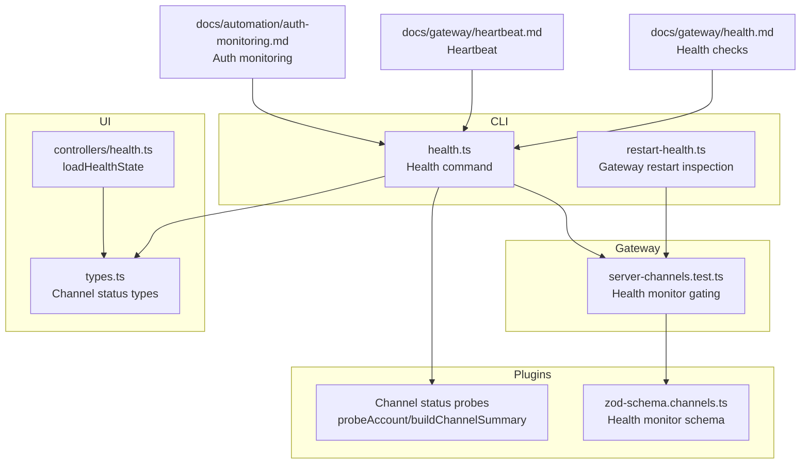
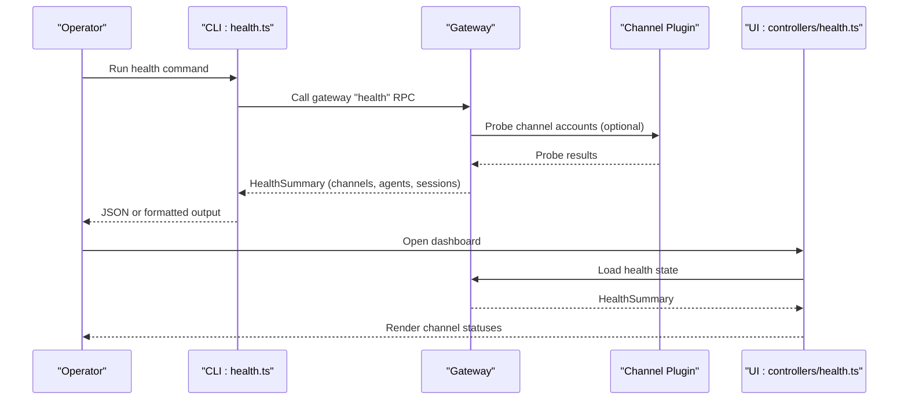
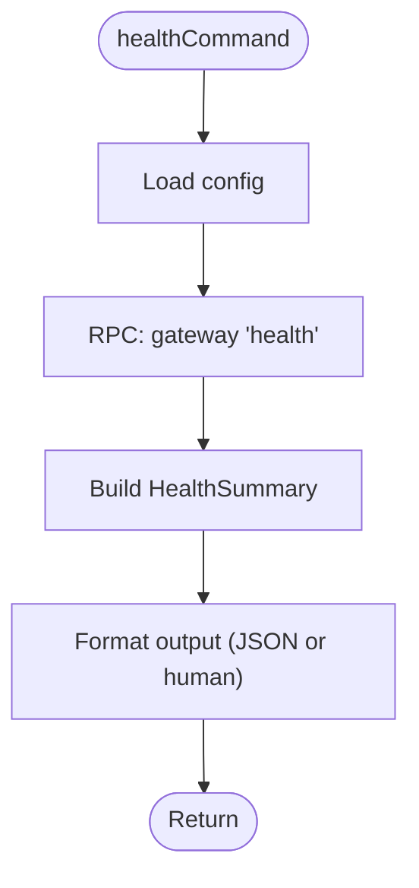
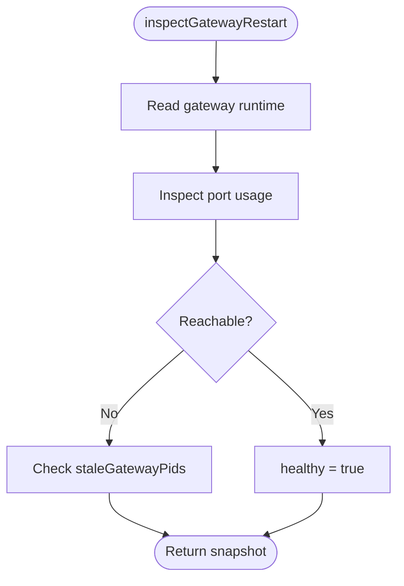
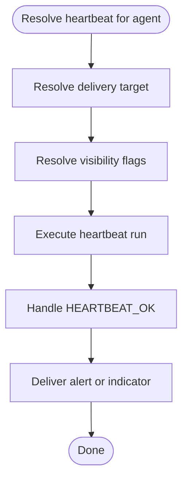
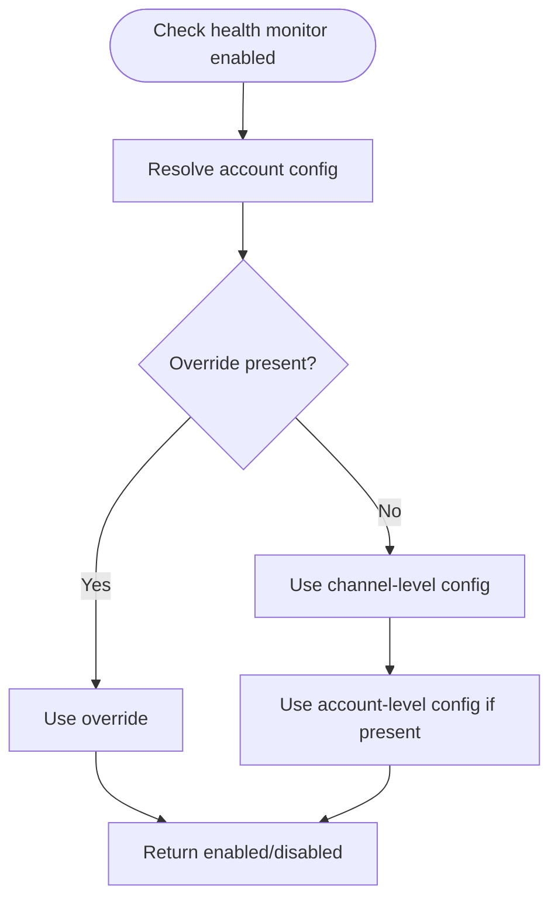
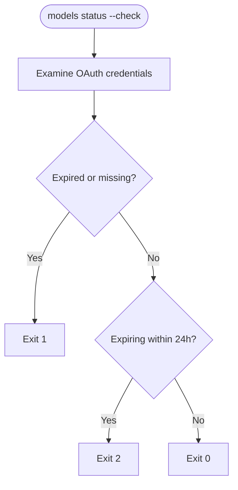
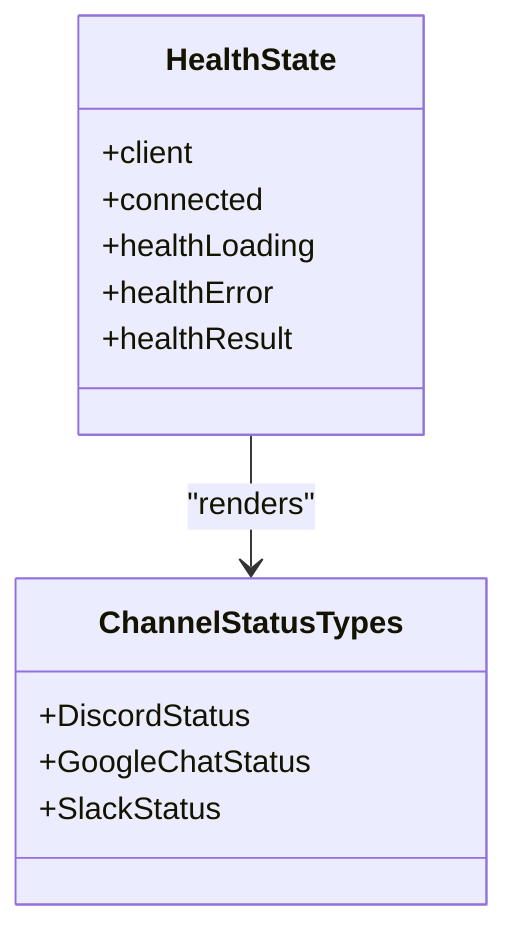
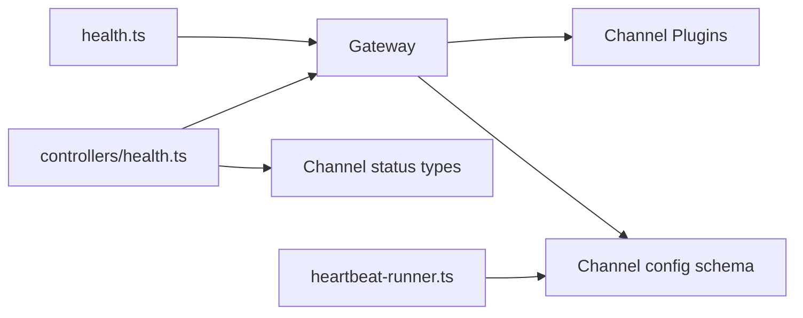

# Health Monitoring

<cite>
**Referenced Files in This Document**
- [health.md](file://docs/gateway/health.md)
- [heartbeat.md](file://docs/gateway/heartbeat.md)
- [auth-monitoring.md](file://docs/automation/auth-monitoring.md)
- [health.ts](file://src/commands/health.ts)
- [restart-health.ts](file://src/cli/daemon-cli/restart-health.ts)
- [heartbeat-runner.ts](file://src/infra/heartbeat-runner.ts)
- [zod-schema.channels.ts](file://src/config/zod-schema.channels.ts)
- [health.ts](file://src/gateway/server-channels.test.ts)
- [types.ts](file://ui/src/ui/types.ts)
- [health.ts](file://ui/src/ui/controllers/health.ts)
- [diagnostic-events.ts](file://src/infra/diagnostic-events.ts)
</cite>

## Table of Contents
1. [Introduction](#introduction)
2. [Project Structure](#project-structure)
3. [Core Components](#core-components)
4. [Architecture Overview](#architecture-overview)
5. [Detailed Component Analysis](#detailed-component-analysis)
6. [Dependency Analysis](#dependency-analysis)
7. [Performance Considerations](#performance-considerations)
8. [Troubleshooting Guide](#troubleshooting-guide)
9. [Conclusion](#conclusion)
10. [Appendices](#appendices)

## Introduction
This document explains the health monitoring capabilities of the gateway, including health check endpoints, heartbeat mechanisms, status reporting, and diagnostic tooling. It covers how to assess channel connectivity, interpret health snapshots, configure automatic restarts and throttles, and integrate monitoring and alerting. Guidance is provided for building dashboards, configuring alerting, and responding to incidents across distributed environments and external service dependencies.

## Project Structure
Health monitoring spans documentation, CLI commands, gateway internals, plugin channel status probes, and UI surfaces:
- Documentation: health checks, heartbeat scheduling, and auth monitoring
- CLI: health command and gateway restart inspection
- Gateway: channel health monitor configuration and lifecycle
- Plugins: channel-specific status probes and visibility controls
- UI: health state loading and channel status types

**Diagram sources**
- [health.md:1-45](file://docs/gateway/health.md#L1-L45)
- [heartbeat.md:1-394](file://docs/gateway/heartbeat.md#L1-L394)
- [auth-monitoring.md:1-45](file://docs/automation/auth-monitoring.md#L1-L45)
- [health.ts:1-846](file://src/commands/health.ts#L1-L846)
- [restart-health.ts:97-247](file://src/cli/daemon-cli/restart-health.ts#L97-L247)
- [heartbeat-runner.ts:687-713](file://src/infra/heartbeat-runner.ts#L687-L713)
- [zod-schema.channels.ts:1-17](file://src/config/zod-schema.channels.ts#L1-L17)
- [health.ts:220-329](file://src/gateway/server-channels.test.ts#L220-L329)
- [types.ts:140-202](file://ui/src/ui/types.ts#L140-L202)
- [health.ts:40-62](file://ui/src/ui/controllers/health.ts#L40-L62)

**Section sources**
- [health.md:1-45](file://docs/gateway/health.md#L1-L45)
- [heartbeat.md:1-394](file://docs/gateway/heartbeat.md#L1-L394)
- [auth-monitoring.md:1-45](file://docs/automation/auth-monitoring.md#L1-L45)
- [health.ts:1-846](file://src/commands/health.ts#L1-L846)
- [restart-health.ts:97-247](file://src/cli/daemon-cli/restart-health.ts#L97-L247)
- [heartbeat-runner.ts:687-713](file://src/infra/heartbeat-runner.ts#L687-L713)
- [zod-schema.channels.ts:1-17](file://src/config/zod-schema.channels.ts#L1-L17)
- [health.ts:220-329](file://src/gateway/server-channels.test.ts#L220-L329)
- [types.ts:140-202](file://ui/src/ui/types.ts#L140-L202)
- [health.ts:40-62](file://ui/src/ui/controllers/health.ts#L40-L62)

## Core Components
- Health command: queries the running gateway for a health snapshot, optionally probing channel accounts and formatting results for JSON or human-readable output.
- Gateway restart inspection: determines whether the gateway is reachable, inspects port usage, and identifies stale listeners to support automated restarts.
- Heartbeat mechanism: periodic agent turns that surface attention items without spam; includes visibility controls and optional reasoning delivery.
- Channel health monitor: configurable per-channel and per-account restart gating with thresholds and rolling caps.
- Auth monitoring: CLI-driven checks for OAuth expiry with exit codes suitable for automation and alerting.
- UI health state: loads and displays health snapshots and channel statuses.

**Section sources**
- [health.ts:597-618](file://src/commands/health.ts#L597-L618)
- [restart-health.ts:100-202](file://src/cli/daemon-cli/restart-health.ts#L100-L202)
- [heartbeat.md:18-46](file://docs/gateway/heartbeat.md#L18-L46)
- [health.md:27-34](file://docs/gateway/health.md#L27-L34)
- [auth-monitoring.md:9-26](file://docs/automation/auth-monitoring.md#L9-L26)
- [health.ts:40-62](file://ui/src/ui/controllers/health.ts#L40-L62)

## Architecture Overview
The health monitoring architecture integrates CLI, gateway, plugins, and UI:

**Diagram sources**
- [health.ts:597-618](file://src/commands/health.ts#L597-L618)
- [health.ts:40-62](file://ui/src/ui/controllers/health.ts#L40-L62)

## Detailed Component Analysis

### Health Command and Snapshot
The health command contacts the running gateway to fetch a unified health snapshot. It supports:
- JSON output for machine parsing
- Verbose mode to include detailed gateway connection info and per-channel probe metadata
- Timeout customization
- Formatting helpers for channel lines and account timings

Key behaviors:
- Gateway reachability defines success; channel-level failures are reported but do not fail the overall command
- Probes are executed per channel account when supported and enabled
- Session store summary is included for operational insight

**Diagram sources**
- [health.ts:597-618](file://src/commands/health.ts#L597-L618)

**Section sources**
- [health.ts:419-595](file://src/commands/health.ts#L419-L595)
- [health.ts:597-618](file://src/commands/health.ts#L597-L618)

### Gateway Restart Inspection
Automated restarts rely on inspecting gateway runtime and port usage:
- Reads gateway runtime state
- Inspects port usage and listener ownership
- Determines if the gateway is reachable despite a busy port
- Supports retries with configurable attempts and delays
- Returns a snapshot indicating health and stale PIDs

**Diagram sources**
- [restart-health.ts:100-202](file://src/cli/daemon-cli/restart-health.ts#L100-L202)

**Section sources**
- [restart-health.ts:100-202](file://src/cli/daemon-cli/restart-health.ts#L100-L202)
- [restart-health.ts:204-239](file://src/cli/daemon-cli/restart-health.ts#L204-L239)

### Heartbeat Mechanism
Heartbeat runs periodic agent turns to surface attention items:
- Defaults and overrides for interval, prompt, and delivery target
- Visibility controls per channel/account (show OKs, show alerts, emit indicators)
- Optional reasoning delivery and isolated sessions for cost control
- Active hours windowing and timezone-aware scheduling

**Diagram sources**
- [heartbeat-runner.ts:687-713](file://src/infra/heartbeat-runner.ts#L687-L713)
- [heartbeat.md:72-84](file://docs/gateway/heartbeat.md#L72-L84)

**Section sources**
- [heartbeat.md:18-46](file://docs/gateway/heartbeat.md#L18-L46)
- [heartbeat.md:85-106](file://docs/gateway/heartbeat.md#L85-L106)
- [heartbeat.md:257-288](file://docs/gateway/heartbeat.md#L257-L288)
- [heartbeat-runner.ts:687-713](file://src/infra/heartbeat-runner.ts#L687-L713)

### Channel Health Monitor and Overrides
The gateway enforces health monitor restart gating with:
- Global and per-channel thresholds (check interval, stale threshold, restart cap)
- Per-channel and per-account overrides
- Fallback behavior when resolvers omit fields
- Fail-closed behavior when account resolution fails

**Diagram sources**
- [health.ts:220-329](file://src/gateway/server-channels.test.ts#L220-L329)
- [zod-schema.channels.ts:12-17](file://src/config/zod-schema.channels.ts#L12-L17)

**Section sources**
- [health.md:27-34](file://docs/gateway/health.md#L27-L34)
- [health.ts:220-329](file://src/gateway/server-channels.test.ts#L220-L329)
- [zod-schema.channels.ts:12-17](file://src/config/zod-schema.channels.ts#L12-L17)

### Auth Monitoring and Alerting
OAuth expiry is monitored via CLI checks:
- Exit codes indicate OK/expired/expiring-soon
- Designed for cron/systemd timers and alerting scripts
- Scripts are available for phone workflows and systemd integration

**Diagram sources**
- [auth-monitoring.md:14-26](file://docs/automation/auth-monitoring.md#L14-L26)

**Section sources**
- [auth-monitoring.md:9-45](file://docs/automation/auth-monitoring.md#L9-L45)

### UI Health State and Channel Status Types
The UI loads health snapshots and renders channel statuses:
- Controller triggers loadHealthState and manages loading/error states
- Channel status types define configured/running/probe fields for rendering
- UI surfaces channel health alongside heartbeat visibility and agent summaries

**Diagram sources**
- [health.ts:40-62](file://ui/src/ui/controllers/health.ts#L40-L62)
- [types.ts:140-202](file://ui/src/ui/types.ts#L140-L202)

**Section sources**
- [health.ts:40-62](file://ui/src/ui/controllers/health.ts#L40-L62)
- [types.ts:140-202](file://ui/src/ui/types.ts#L140-L202)

## Dependency Analysis
- CLI health command depends on gateway RPC and channel plugin status probes
- Gateway health monitor depends on channel configuration schemas and per-account overrides
- UI health state depends on gateway-provided HealthSummary and channel status types
- Heartbeat visibility and delivery depend on channel defaults and per-account overrides

**Diagram sources**
- [health.ts:1-846](file://src/commands/health.ts#L1-L846)
- [restart-health.ts:97-247](file://src/cli/daemon-cli/restart-health.ts#L97-L247)
- [heartbeat-runner.ts:687-713](file://src/infra/heartbeat-runner.ts#L687-L713)
- [zod-schema.channels.ts:1-17](file://src/config/zod-schema.channels.ts#L1-L17)
- [health.ts:40-62](file://ui/src/ui/controllers/health.ts#L40-L62)
- [types.ts:140-202](file://ui/src/ui/types.ts#L140-L202)

**Section sources**
- [health.ts:1-846](file://src/commands/health.ts#L1-L846)
- [restart-health.ts:97-247](file://src/cli/daemon-cli/restart-health.ts#L97-L247)
- [heartbeat-runner.ts:687-713](file://src/infra/heartbeat-runner.ts#L687-L713)
- [zod-schema.channels.ts:1-17](file://src/config/zod-schema.channels.ts#L1-L17)
- [health.ts:40-62](file://ui/src/ui/controllers/health.ts#L40-L62)
- [types.ts:140-202](file://ui/src/ui/types.ts#L140-L202)

## Performance Considerations
- Heartbeat cost control: use isolated sessions and light context to reduce token usage; choose cheaper models for routine checks
- Health probes: cap timeouts and avoid unnecessary probes when accounts are disabled or unconfigured
- UI rendering: batch channel status updates and debounce frequent reloads
- Gateway restart inspection: tune retry attempts and delays to balance responsiveness with system load

[No sources needed since this section provides general guidance]

## Troubleshooting Guide
Common scenarios and actions:
- Gateway unreachable: start the gateway on the configured port; use force if the port is busy
- Logged out or status codes indicating auth issues: relink channels using logout and login flows
- No inbound messages: verify device connectivity, allowlists, and group chat rules
- Heartbeat not delivering: check visibility flags, target resolution, and active hours
- Auth expiry: use models status checks and set up automation/alerts with appropriate exit codes

**Section sources**
- [health.md:36-44](file://docs/gateway/health.md#L36-L44)
- [heartbeat.md:242-256](file://docs/gateway/heartbeat.md#L242-L256)
- [auth-monitoring.md:20-26](file://docs/automation/auth-monitoring.md#L20-L26)

## Conclusion
The system provides robust health monitoring through a CLI health command, heartbeat mechanism, channel health monitors, and auth expiry checks. Operators can integrate these capabilities with automation and alerting, and use the UI to visualize channel and agent health. Configurable thresholds, visibility controls, and diagnostic events support efficient incident response and continuous operation.

[No sources needed since this section summarizes without analyzing specific files]

## Appendices

### Health Check Endpoints and Status Reporting
- CLI health command: queries the running gateway for a health snapshot; supports JSON output and verbose diagnostics
- Gateway RPC: method "health" returns HealthSummary including channels, agents, and sessions
- Channel status: plugins provide probeAccount and buildChannelSummary for per-account health

**Section sources**
- [health.ts:597-618](file://src/commands/health.ts#L597-L618)
- [health.ts:419-595](file://src/commands/health.ts#L419-L595)

### Heartbeat Configuration Examples
- Defaults and overrides for interval, prompt, target, and visibility
- Active hours and timezone-aware scheduling
- Isolated sessions and reasoning delivery for transparency

**Section sources**
- [heartbeat.md:18-46](file://docs/gateway/heartbeat.md#L18-L46)
- [heartbeat.md:85-106](file://docs/gateway/heartbeat.md#L85-L106)
- [heartbeat.md:149-171](file://docs/gateway/heartbeat.md#L149-L171)
- [heartbeat.md:183-210](file://docs/gateway/heartbeat.md#L183-L210)
- [heartbeat.md:212-241](file://docs/gateway/heartbeat.md#L212-L241)
- [heartbeat.md:242-256](file://docs/gateway/heartbeat.md#L242-L256)
- [heartbeat.md:257-288](file://docs/gateway/heartbeat.md#L257-L288)
- [heartbeat.md:310-318](file://docs/gateway/heartbeat.md#L310-L318)
- [heartbeat.md:358-370](file://docs/gateway/heartbeat.md#L358-L370)
- [heartbeat.md:371-384](file://docs/gateway/heartbeat.md#L371-L384)
- [heartbeat.md:385-394](file://docs/gateway/heartbeat.md#L385-L394)

### Monitoring Metrics and Alerting
- Auth monitoring exit codes: 0 (OK), 1 (expired/missing), 2 (expiring soon)
- Heartbeat visibility flags: showOk, showAlerts, useIndicator
- UI health state: loading, error, and result fields for dashboard integration

**Section sources**
- [auth-monitoring.md:20-26](file://docs/automation/auth-monitoring.md#L20-L26)
- [heartbeat.md:257-288](file://docs/gateway/heartbeat.md#L257-L288)
- [health.ts:40-62](file://ui/src/ui/controllers/health.ts#L40-L62)

### Diagnostic Events and Automated Assessments
- Diagnostic event types include heartbeat, tool loops, usage, and webhook metrics
- UI can subscribe to diagnostic events for real-time monitoring

**Section sources**
- [diagnostic-events.ts:125-175](file://src/infra/diagnostic-events.ts#L125-L175)