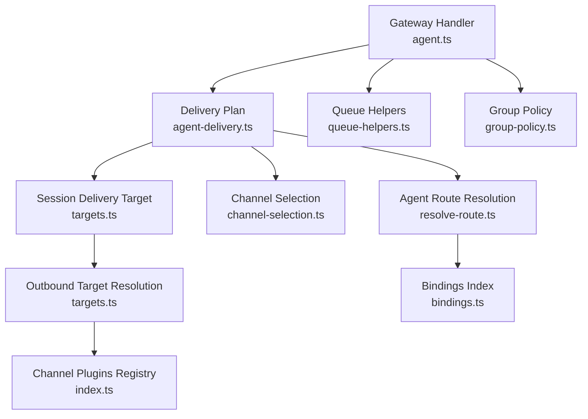
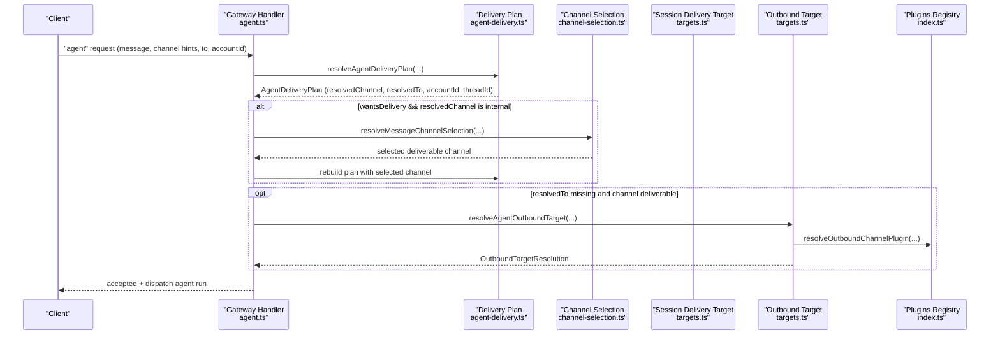
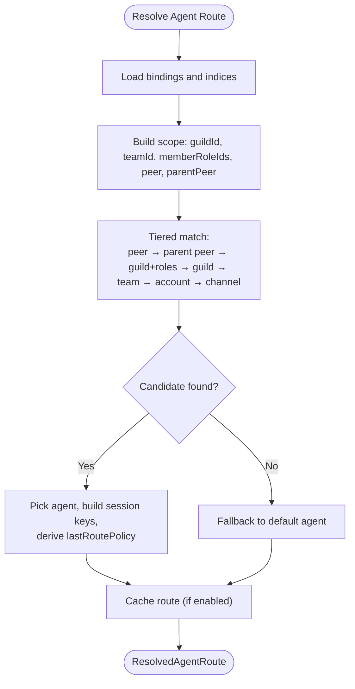
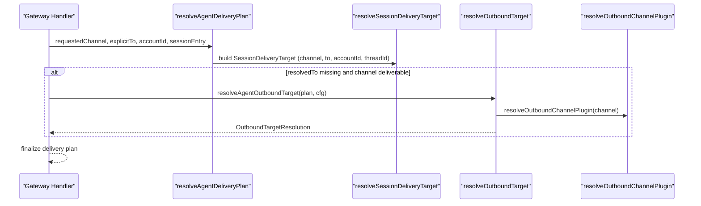
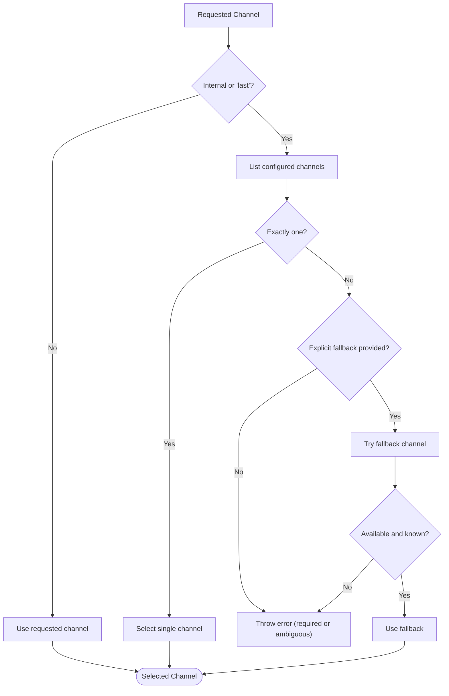
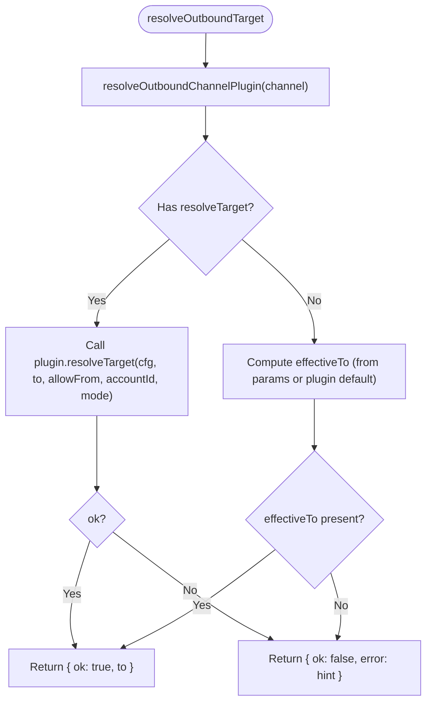
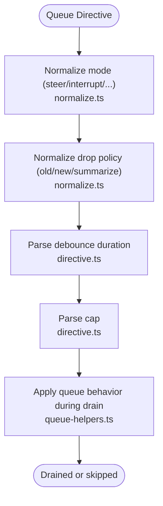
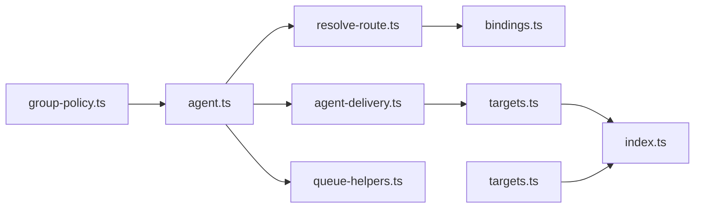

# Message Routing

<cite>
**Referenced Files in This Document**
- [resolve-route.ts](file://src/routing/resolve-route.ts)
- [bindings.ts](file://src/routing/bindings.ts)
- [agent-delivery.ts](file://src/infra/outbound/agent-delivery.ts)
- [targets.ts](file://src/infra/outbound/targets.ts)
- [channel-selection.ts](file://src/infra/outbound/channel-selection.ts)
- [agent.ts](file://src/gateway/server-methods/agent.ts)
- [index.ts](file://src/channels/plugins/index.ts)
- [resolve-route.test.ts](file://src/routing/resolve-route.test.ts)
- [group-policy.ts](file://src/config/group-policy.ts)
- [queue-helpers.ts](file://src/utils/queue-helpers.ts)
- [directive.ts](file://src/auto-reply/reply/queue/directive.ts)
- [normalize.ts](file://src/auto-reply/reply/queue/normalize.ts)
- [failover-error.test.ts](file://src/agents/failover-error.test.ts)
</cite>

## Table of Contents
1. [Introduction](#introduction)
2. [Project Structure](#project-structure)
3. [Core Components](#core-components)
4. [Architecture Overview](#architecture-overview)
5. [Detailed Component Analysis](#detailed-component-analysis)
6. [Dependency Analysis](#dependency-analysis)
7. [Performance Considerations](#performance-considerations)
8. [Troubleshooting Guide](#troubleshooting-guide)
9. [Conclusion](#conclusion)

## Introduction
This document explains the gateway’s intelligent message routing and delivery system. It covers how messages are routed to agents, how destinations are resolved per channel, how message transformation and delivery targets are computed, and how queuing, batching, and flow control are applied. It also documents channel-specific routing rules, priority handling, fallback mechanisms, and configuration options for routing policies, load balancing, and failover.

## Project Structure
Routing spans several subsystems:
- Agent routing and session scoping
- Delivery planning and outbound target resolution
- Channel selection and plugin integration
- Queueing and flow control for replies
- Group policy enforcement and access control

**Diagram sources**
- [agent.ts:148-772](file://src/gateway/server-methods/agent.ts#L148-L772)
- [agent-delivery.ts:28-180](file://src/infra/outbound/agent-delivery.ts#L28-L180)
- [targets.ts:68-241](file://src/infra/outbound/targets.ts#L68-L241)
- [channel-selection.ts:103-165](file://src/infra/outbound/channel-selection.ts#L103-L165)
- [resolve-route.ts:614-800](file://src/routing/resolve-route.ts#L614-L800)
- [bindings.ts:17-115](file://src/routing/bindings.ts#L17-L115)
- [index.ts:74-90](file://src/channels/plugins/index.ts#L74-L90)
- [queue-helpers.ts:135-175](file://src/utils/queue-helpers.ts#L135-L175)
- [group-policy.ts:325-359](file://src/config/group-policy.ts#L325-L359)

**Section sources**
- [agent.ts:148-772](file://src/gateway/server-methods/agent.ts#L148-L772)
- [agent-delivery.ts:28-180](file://src/infra/outbound/agent-delivery.ts#L28-L180)
- [targets.ts:68-241](file://src/infra/outbound/targets.ts#L68-L241)
- [channel-selection.ts:103-165](file://src/infra/outbound/channel-selection.ts#L103-L165)
- [resolve-route.ts:614-800](file://src/routing/resolve-route.ts#L614-L800)
- [bindings.ts:17-115](file://src/routing/bindings.ts#L17-L115)
- [index.ts:74-90](file://src/channels/plugins/index.ts#L74-L90)
- [queue-helpers.ts:135-175](file://src/utils/queue-helpers.ts#L135-L175)
- [group-policy.ts:325-359](file://src/config/group-policy.ts#L325-L359)

## Core Components
- Agent route resolution: Determines which agent and session key to use based on channel, account, peer, guild/team, and roles.
- Delivery planning: Builds a plan for channel, target, account, and thread from session context and request parameters.
- Outbound target resolution: Normalizes and validates the destination per channel, using plugin-specific resolvers and allow-from rules.
- Channel selection: Chooses a deliverable channel when “last” or internal channel is requested.
- Queue helpers: Drains queued replies and supports steering, interrupt, and backlog modes.
- Group policy: Enforces allowlist/disallowlist and route-level enablement for group-based access.

**Section sources**
- [resolve-route.ts:614-800](file://src/routing/resolve-route.ts#L614-L800)
- [agent-delivery.ts:28-180](file://src/infra/outbound/agent-delivery.ts#L28-L180)
- [targets.ts:68-241](file://src/infra/outbound/targets.ts#L68-L241)
- [channel-selection.ts:103-165](file://src/infra/outbound/channel-selection.ts#L103-L165)
- [queue-helpers.ts:135-175](file://src/utils/queue-helpers.ts#L135-L175)
- [group-policy.ts:325-359](file://src/config/group-policy.ts#L325-L359)

## Architecture Overview
The routing pipeline integrates inbound requests, session context, and channel plugins to produce a final delivery plan and outbound target.

**Diagram sources**
- [agent.ts:489-537](file://src/gateway/server-methods/agent.ts#L489-L537)
- [agent-delivery.ts:28-180](file://src/infra/outbound/agent-delivery.ts#L28-L180)
- [channel-selection.ts:103-165](file://src/infra/outbound/channel-selection.ts#L103-L165)
- [targets.ts:139-179](file://src/infra/outbound/agent-delivery.ts#L139-L179)
- [targets.ts:174-241](file://src/infra/outbound/targets.ts#L174-L241)
- [index.ts:74-90](file://src/channels/plugins/index.ts#L74-L90)

## Detailed Component Analysis

### Agent Route Resolution
Agent route resolution selects the appropriate agent and session keys based on bindings and contextual scope (peer, guild, team, roles). It builds a cache-friendly evaluation index and applies a tiered matching strategy.

**Diagram sources**
- [resolve-route.ts:614-800](file://src/routing/resolve-route.ts#L614-L800)
- [bindings.ts:17-115](file://src/routing/bindings.ts#L17-L115)

**Section sources**
- [resolve-route.ts:614-800](file://src/routing/resolve-route.ts#L614-L800)
- [bindings.ts:17-115](file://src/routing/bindings.ts#L17-L115)
- [resolve-route.test.ts:614-660](file://src/routing/resolve-route.test.ts#L614-L660)

### Delivery Planning and Outbound Target Resolution
Delivery planning merges request parameters with session context to determine channel, target, account, and thread. Outbound target resolution normalizes destinations per channel, using plugin resolvers and allow-from rules.

**Diagram sources**
- [agent-delivery.ts:28-180](file://src/infra/outbound/agent-delivery.ts#L28-L180)
- [targets.ts:68-241](file://src/infra/outbound/targets.ts#L68-L241)
- [index.ts:74-90](file://src/channels/plugins/index.ts#L74-L90)

**Section sources**
- [agent-delivery.ts:28-180](file://src/infra/outbound/agent-delivery.ts#L28-L180)
- [targets.ts:68-241](file://src/infra/outbound/targets.ts#L68-L241)

### Channel Selection and Fallback
When the requested channel is internal or “last”, the system selects a deliverable channel based on configuration and availability. It supports explicit selection, single-configured fallback, and tool-context fallback.

**Diagram sources**
- [channel-selection.ts:103-165](file://src/infra/outbound/channel-selection.ts#L103-L165)

**Section sources**
- [channel-selection.ts:103-165](file://src/infra/outbound/channel-selection.ts#L103-L165)

### Destination Resolution and Allow-From
Outbound target resolution prefers plugin-specific resolvers and allow-from lists. It falls back to per-channel defaults and returns a normalized target or an error with a hint.

**Diagram sources**
- [targets.ts:174-241](file://src/infra/outbound/targets.ts#L174-L241)

**Section sources**
- [targets.ts:174-241](file://src/infra/outbound/targets.ts#L174-L241)

### Priority Handling and Fallback Mechanisms
- Route resolution tiers prioritize peer matches, then parent peer, then guild+roles, guild, team, account, and finally channel-wide bindings.
- Delivery plan fallbacks to “last” channel and target when explicit values are absent.
- Channel selection fallbacks to a configured single channel or a provided fallback channel.

**Section sources**
- [resolve-route.ts:723-781](file://src/routing/resolve-route.ts#L723-L781)
- [agent-delivery.ts:78-137](file://src/infra/outbound/agent-delivery.ts#L78-L137)
- [channel-selection.ts:142-164](file://src/infra/outbound/channel-selection.ts#L142-L164)

### Message Queuing, Batch Processing, and Flow Control
Queuing supports multiple modes and drop policies:
- Modes: steer, interrupt, steer-backlog, follow-up, collect
- Drop policies: oldest, newest, summarize
- Drain helpers support per-queue draining and cross-channel collection

**Diagram sources**
- [normalize.ts:1-44](file://src/auto-reply/reply/queue/normalize.ts#L1-L44)
- [directive.ts:1-34](file://src/auto-reply/reply/queue/directive.ts#L1-L34)
- [queue-helpers.ts:135-175](file://src/utils/queue-helpers.ts#L135-L175)

**Section sources**
- [normalize.ts:1-44](file://src/auto-reply/reply/queue/normalize.ts#L1-L44)
- [directive.ts:1-34](file://src/auto-reply/reply/queue/directive.ts#L1-L34)
- [queue-helpers.ts:135-175](file://src/utils/queue-helpers.ts#L135-L175)

### Conditional Routing Logic and Multi-Hop Forwarding
- Conditional routing is driven by bindings and group policy. Group allowlists/disallowlists and route enablement are enforced.
- Multi-hop forwarding is supported by session keys and last-route policy, enabling thread continuity and DM collapsing.

**Section sources**
- [group-policy.ts:325-359](file://src/config/group-policy.ts#L325-L359)
- [resolve-route.ts:63-75](file://src/routing/resolve-route.ts#L63-L75)

### Examples of Complex Routing Scenarios
- Role-based routing: Guild + roles bindings select agents based on member role IDs.
- Group/channel compatibility: Peer kind compatibility allows group/channel interchange in matches.
- Heartbeat routing: Target “last” or explicit channel with optional accountId validation and direct-message policy.

**Section sources**
- [resolve-route.test.ts:614-660](file://src/routing/resolve-route.test.ts#L614-L660)
- [targets.ts:243-373](file://src/infra/outbound/targets.ts#L243-L373)

## Dependency Analysis
Routing depends on:
- Channel plugins for outbound resolution and allow-from rules
- Session context for “last” channel/target/threadId
- Bindings and group policy for access control and agent selection

**Diagram sources**
- [resolve-route.ts:614-800](file://src/routing/resolve-route.ts#L614-L800)
- [bindings.ts:17-115](file://src/routing/bindings.ts#L17-L115)
- [agent-delivery.ts:28-180](file://src/infra/outbound/agent-delivery.ts#L28-L180)
- [targets.ts:68-241](file://src/infra/outbound/targets.ts#L68-L241)
- [index.ts:74-90](file://src/channels/plugins/index.ts#L74-L90)
- [agent.ts:489-537](file://src/gateway/server-methods/agent.ts#L489-L537)
- [queue-helpers.ts:135-175](file://src/utils/queue-helpers.ts#L135-L175)
- [group-policy.ts:325-359](file://src/config/group-policy.ts#L325-L359)

**Section sources**
- [resolve-route.ts:614-800](file://src/routing/resolve-route.ts#L614-L800)
- [agent-delivery.ts:28-180](file://src/infra/outbound/agent-delivery.ts#L28-L180)
- [targets.ts:68-241](file://src/infra/outbound/targets.ts#L68-L241)
- [index.ts:74-90](file://src/channels/plugins/index.ts#L74-L90)
- [agent.ts:489-537](file://src/gateway/server-methods/agent.ts#L489-L537)
- [queue-helpers.ts:135-175](file://src/utils/queue-helpers.ts#L135-L175)
- [group-policy.ts:325-359](file://src/config/group-policy.ts#L325-L359)

## Performance Considerations
- Caching: Route resolution caches evaluated bindings and resolved routes to reduce repeated work.
- Indexing: Binding indices accelerate peer, guild, team, and account lookups.
- Cross-channel safety: Turn-scoped delivery avoids races in shared sessions (dmScope=“main”).
- Plugin resolution: Centralized plugin registry avoids repeated scanning.

[No sources needed since this section provides general guidance]

## Troubleshooting Guide
Common issues and resolutions:
- Unknown or unavailable channel: Channel selection throws when channel is unknown or not configured.
- Missing target: Outbound target resolution returns an error with a hint when no target is provided and plugin default is missing.
- Heartbeat failures: Heartbeat target resolution returns “no-target” reasons such as unknown-account, dm-blocked, or allowFrom-fallback.
- Failover reasons: Failover classification considers timeouts and overload conditions.

**Section sources**
- [channel-selection.ts:112-164](file://src/infra/outbound/channel-selection.ts#L112-L164)
- [targets.ts:236-241](file://src/infra/outbound/targets.ts#L236-L241)
- [targets.ts:375-388](file://src/infra/outbound/targets.ts#L375-L388)
- [failover-error.test.ts:72-83](file://src/agents/failover-error.test.ts#L72-L83)

## Conclusion
The gateway’s routing system combines agent route resolution, delivery planning, and outbound target normalization with robust fallbacks and channel plugin integration. It supports complex scenarios like role-based routing, group allowlists, heartbeat targeting, and queue-driven reply flow control. The design emphasizes caching, indexing, and cross-channel safety to maintain performance and correctness under varied configurations.