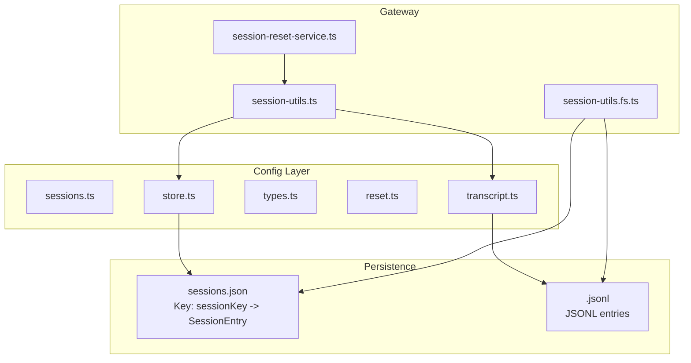
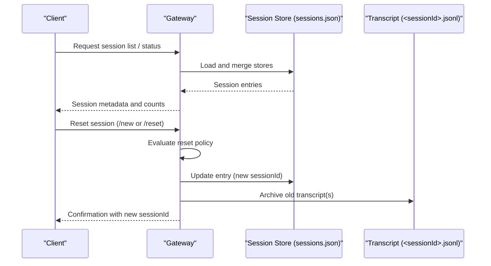
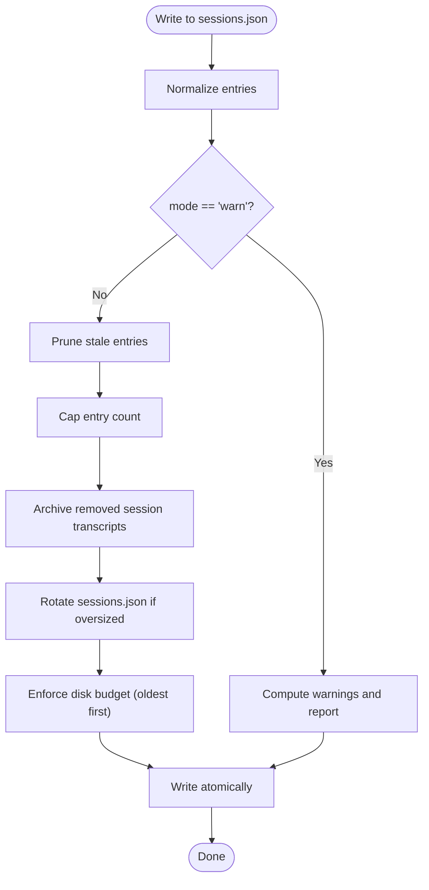
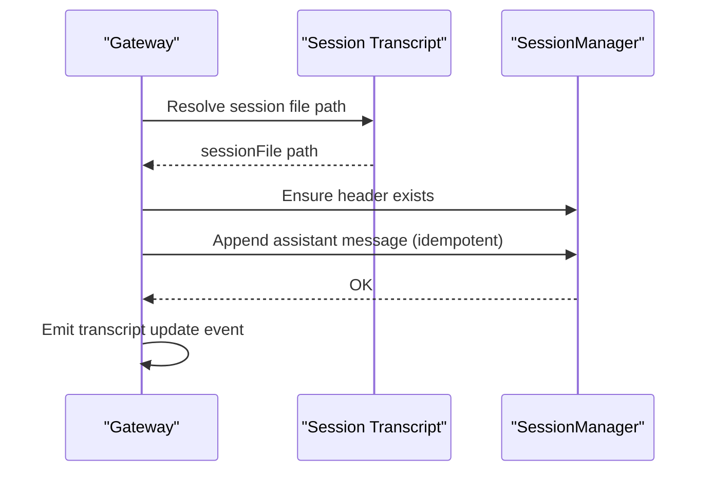
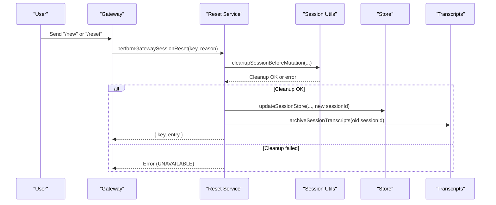
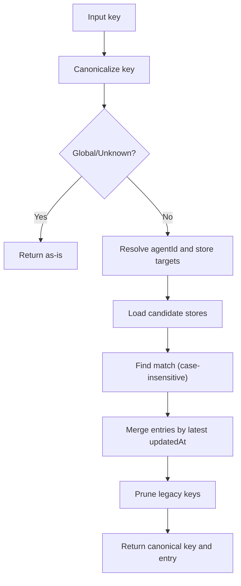
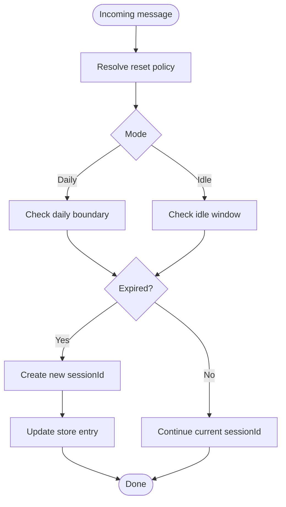
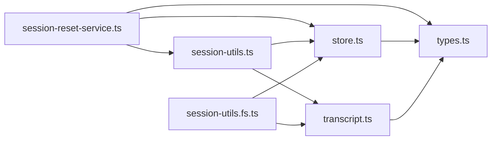

# Session Management

<cite>
**Referenced Files in This Document**
- [session-reset-service.ts](file://src/gateway/session-reset-service.ts)
- [session-utils.ts](file://src/gateway/session-utils.ts)
- [session-utils.fs.ts](file://src/gateway/session-utils.fs.ts)
- [sessions.ts](file://src/config/sessions.ts)
- [store.ts](file://src/config/sessions/store.ts)
- [types.ts](file://src/config/sessions/types.ts)
- [transcript.ts](file://src/config/sessions/transcript.ts)
- [reset.ts](file://src/config/sessions/reset.ts)
- [session.md](file://docs/concepts/session.md)
- [sessions.md](file://docs/cli/sessions.md)
- [session-management-compaction.md](file://docs/reference/session-management-compaction.md)
- [session-pruning.md](file://docs/concepts/session-pruning.md)
</cite>

## Table of Contents
1. [Introduction](#introduction)
2. [Project Structure](#project-structure)
3. [Core Components](#core-components)
4. [Architecture Overview](#architecture-overview)
5. [Detailed Component Analysis](#detailed-component-analysis)
6. [Dependency Analysis](#dependency-analysis)
7. [Performance Considerations](#performance-considerations)
8. [Troubleshooting Guide](#troubleshooting-guide)
9. [Conclusion](#conclusion)
10. [Appendices](#appendices)

## Introduction
This document explains the gateway’s session lifecycle and state persistence in OpenClaw. It covers how sessions are created, validated, and terminated; how the session store and transcripts are organized; how maintenance and disk budgets keep the system healthy; and how reset policies, concurrency, and security controls operate. It also provides practical guidance for configuration, debugging, and troubleshooting.

## Project Structure
The session management system spans three layers:
- Gateway orchestration: session reset, lifecycle hooks, and runtime cleanup
- Session store: on-disk JSON map keyed by session keys with metadata and counters
- Transcript persistence: append-only JSONL files managed by the SessionManager

**Diagram sources**
- [session-reset-service.ts:246-347](file://src/gateway/session-reset-service.ts#L246-L347)
- [session-utils.ts:554-660](file://src/gateway/session-utils.ts#L554-L660)
- [session-utils.fs.ts:188-228](file://src/gateway/session-utils.fs.ts#L188-L228)
- [sessions.ts:1-15](file://src/config/sessions.ts#L1-L15)
- [store.ts:340-509](file://src/config/sessions/store.ts#L340-L509)
- [transcript.ts:88-131](file://src/config/sessions/transcript.ts#L88-L131)
- [types.ts:68-174](file://src/config/sessions/types.ts#L68-L174)

**Section sources**
- [session.md:57-72](file://docs/concepts/session.md#L57-L72)
- [session-management-compaction.md:31-64](file://docs/reference/session-management-compaction.md#L31-L64)

## Core Components
- Session store: a JSON map keyed by session keys with metadata, runtime model info, counters, and UI labels. It is safe to edit and is authoritative for session state.
- Transcript: append-only JSONL files with a header and message entries; managed by the SessionManager.
- Reset service: orchestrates session reset and termination, ensuring runtime cleanup and archival.
- Utilities: key resolution, store lookup, maintenance, and transcript helpers.

Key responsibilities:
- Canonical key resolution and legacy key normalization
- Store maintenance (pruning, capping, rotation, disk budget enforcement)
- Transcript file resolution and idempotent append
- Reset policy evaluation and session reset lifecycle

**Section sources**
- [types.ts:68-174](file://src/config/sessions/types.ts#L68-L174)
- [store.ts:340-509](file://src/config/sessions/store.ts#L340-L509)
- [transcript.ts:88-131](file://src/config/sessions/transcript.ts#L88-L131)
- [session-reset-service.ts:246-347](file://src/gateway/session-reset-service.ts#L246-L347)

## Architecture Overview
The gateway is the source of truth for session state. UIs query the gateway for session listings and token counts. The session store and transcripts are located under the agent’s state directory. Maintenance runs on write paths and can be triggered manually.

**Diagram sources**
- [session.md:57-62](file://docs/concepts/session.md#L57-L62)
- [session-management-compaction.md:31-37](file://docs/reference/session-management-compaction.md#L31-L37)
- [session-reset-service.ts:246-347](file://src/gateway/session-reset-service.ts#L246-L347)
- [store.ts:521-533](file://src/config/sessions/store.ts#L521-L533)

## Detailed Component Analysis

### Session Store and Persistence
- Store file: per-agent JSON map keyed by session key; values are SessionEntry objects.
- Safe to edit; the gateway is authoritative and may rewrite entries.
- Maintenance includes pruning stale entries, capping entry count, rotating oversized files, and enforcing disk budgets.
- Disk budget enforcement sweeps archived and orphaned artifacts first, then evicts oldest sessions and their transcripts.

**Diagram sources**
- [store.ts:340-509](file://src/config/sessions/store.ts#L340-L509)
- [session-management-compaction.md:68-86](file://docs/reference/session-management-compaction.md#L68-L86)

**Section sources**
- [session-management-compaction.md:40-86](file://docs/reference/session-management-compaction.md#L40-L86)
- [store.ts:195-270](file://src/config/sessions/store.ts#L195-L270)

### Transcript Persistence and Hygiene
- Transcript files are JSONL with a header and message entries.
- The SessionManager handles append-only writes and compaction summaries.
- Helpers resolve transcript candidates across legacy and modern paths and provide previews and title extraction.

**Diagram sources**
- [transcript.ts:88-131](file://src/config/sessions/transcript.ts#L88-L131)
- [transcript.ts:133-218](file://src/config/sessions/transcript.ts#L133-L218)
- [session-utils.fs.ts:121-164](file://src/gateway/session-utils.fs.ts#L121-L164)

**Section sources**
- [session-management-compaction.md:163-181](file://docs/reference/session-management-compaction.md#L163-L181)
- [transcript.ts:47-65](file://src/config/sessions/transcript.ts#L47-L65)

### Session Reset and Termination
- Reset is triggered by commands or policy boundaries (daily reset, idle expiry).
- The reset service updates the session entry with a new sessionId, preserves selected runtime toggles, and archives old transcripts.
- Runtime cleanup ensures queues, subagents, and browser tabs are closed; ACP sessions are canceled and closed with timeouts.

**Diagram sources**
- [session-reset-service.ts:246-347](file://src/gateway/session-reset-service.ts#L246-L347)
- [session-utils.ts:220-244](file://src/gateway/session-utils.ts#L220-L244)

**Section sources**
- [session-reset-service.ts:246-347](file://src/gateway/session-reset-service.ts#L246-L347)
- [session-utils.ts:220-244](file://src/gateway/session-utils.ts#L220-L244)

### Key Resolution and Lookup
- Canonical key resolution normalizes aliases (e.g., main, agent:<id>:main) and supports case-insensitive matching.
- Store lookup scans configured stores and merges entries, preferring the latest updatedAt timestamp.
- Legacy keys are pruned and migrated to canonical keys.

**Diagram sources**
- [session-utils.ts:436-471](file://src/gateway/session-utils.ts#L436-L471)
- [session-utils.ts:554-602](file://src/gateway/session-utils.ts#L554-L602)
- [session-utils.ts:266-289](file://src/gateway/session-utils.ts#L266-L289)

**Section sources**
- [session-utils.ts:436-471](file://src/gateway/session-utils.ts#L436-L471)
- [session-utils.ts:554-602](file://src/gateway/session-utils.ts#L554-L602)
- [session-utils.ts:266-289](file://src/gateway/session-utils.ts#L266-L289)

### Reset Policies and Overrides
- Reset modes: daily (with atHour) and idle (with idleMinutes).
- Overrides: per-type (direct, group, thread) and per-channel.
- Legacy idle-only mode is supported for backward compatibility.
- Reset triggers include explicit commands plus configurable extras.

**Diagram sources**
- [reset.ts:84-120](file://src/config/sessions/reset.ts#L84-L120)
- [session.md:207-217](file://docs/concepts/session.md#L207-L217)

**Section sources**
- [reset.ts:84-120](file://src/config/sessions/reset.ts#L84-L120)
- [session.md:207-217](file://docs/concepts/session.md#L207-L217)

### Maintenance and Disk Budget Controls
- Maintenance settings: mode, pruneAfter, maxEntries, rotateBytes, resetArchiveRetention, maxDiskBytes, highWaterBytes.
- Enforcement order prioritizes archived/orphan artifacts, then oldest sessions and transcripts, then enforces high-water mark.
- CLI maintenance can be previewed or enforced; active session protection is supported.

**Section sources**
- [session-management-compaction.md:68-86](file://docs/reference/session-management-compaction.md#L68-L86)
- [store.ts:340-509](file://src/config/sessions/store.ts#L340-L509)
- [sessions.md:54-79](file://docs/cli/sessions.md#L54-L79)

### Session Metadata, Agent Associations, and Thread Binding
- SessionEntry includes origin metadata (label, provider, routing ids, account id, thread id), delivery context, and UI labels.
- Agent associations are resolved via agentId normalization and main key canonicalization.
- Thread binding unbinding occurs during reset/delete lifecycle events.

**Section sources**
- [types.ts:14-23](file://src/config/sessions/types.ts#L14-L23)
- [types.ts:165-171](file://src/config/sessions/types.ts#L165-L171)
- [session-reset-service.ts:67-100](file://src/gateway/session-reset-service.ts#L67-L100)

### Concurrency, Locking, and Idempotency
- Store writes are serialized via a lock queue with timeouts and staleness detection.
- Idempotency keys prevent duplicate assistant messages in transcripts.
- Read retries handle transient empty or locked files, especially on Windows.

**Section sources**
- [store.ts:541-727](file://src/config/sessions/store.ts#L541-L727)
- [transcript.ts:220-243](file://src/config/sessions/transcript.ts#L220-L243)
- [store.ts:214-249](file://src/config/sessions/store.ts#L214-L249)

### Security, Encryption, and Access Control
- Store and transcript files are written with restrictive permissions.
- Avatar resolution validates workspace-relative paths and MIME types.
- Access control is enforced via delivery context normalization and send policy rules.

**Section sources**
- [store.ts:603-609](file://src/config/sessions/store.ts#L603-L609)
- [session-utils.ts:82-128](file://src/gateway/session-utils.ts#L82-L128)
- [session.md:219-244](file://docs/concepts/session.md#L219-L244)

## Dependency Analysis

**Diagram sources**
- [session-reset-service.ts:1-34](file://src/gateway/session-reset-service.ts#L1-L34)
- [session-utils.ts:1-50](file://src/gateway/session-utils.ts#L1-L50)
- [store.ts:1-46](file://src/config/sessions/store.ts#L1-L46)
- [transcript.ts:1-15](file://src/config/sessions/transcript.ts#L1-L15)
- [session-utils.fs.ts:1-19](file://src/gateway/session-utils.fs.ts#L1-L19)

**Section sources**
- [sessions.ts:1-15](file://src/config/sessions.ts#L1-L15)

## Performance Considerations
- Large session stores increase write latency due to maintenance work on write path.
- Cost drivers: high maxEntries, long pruneAfter windows, many artifacts, and disk budgets without pruning caps.
- Recommendations: use enforce mode, combine time and count limits, set disk budget with sensible high-water thresholds, and preview maintenance impacts before enforcing.

**Section sources**
- [session.md:101-120](file://docs/concepts/session.md#L101-L120)
- [session-management-compaction.md:88-118](file://docs/reference/session-management-compaction.md#L88-L118)

## Troubleshooting Guide
- Verify session key correctness via status and inspect store path from status output.
- Confirm store vs transcript mismatch by checking the gateway host and store path.
- Investigate compaction spam by reviewing model context window, compaction settings, and tool-result bloat; enable/tune session pruning.
- Ensure silent turns do not leak by confirming replies start with the NO_REPLY marker and using builds with streaming suppression.
- Use CLI commands to list sessions, preview maintenance, and run cleanup with dry-run and JSON output.

**Section sources**
- [session-management-compaction.md:316-325](file://docs/reference/session-management-compaction.md#L316-L325)
- [sessions.md:170-111](file://docs/cli/sessions.md#L170-L111)

## Conclusion
OpenClaw’s session management centers on the gateway as the source of truth, with a robust session store and transcript persistence layer. Reset policies, maintenance, and concurrency controls ensure reliability and scalability. By tuning configuration and leveraging CLI tools, operators can maintain healthy session stores and predictable behavior across environments.

## Appendices

### Configuration Reference (selected)
- Session scope and main key: controls grouping and continuity for direct messages
- Reset policy: daily reset time and idle expiry
- Reset overrides: per-type and per-channel policies
- Maintenance: pruneAfter, maxEntries, rotateBytes, resetArchiveRetention, maxDiskBytes, highWaterBytes
- Send policy: allow/deny rules for session types and prefixes

**Section sources**
- [session.md:246-277](file://docs/concepts/session.md#L246-L277)
- [session-management-compaction.md:68-86](file://docs/reference/session-management-compaction.md#L68-L86)
- [sessions.md:54-79](file://docs/cli/sessions.md#L54-L79)