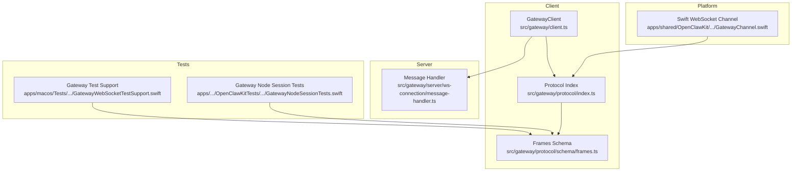
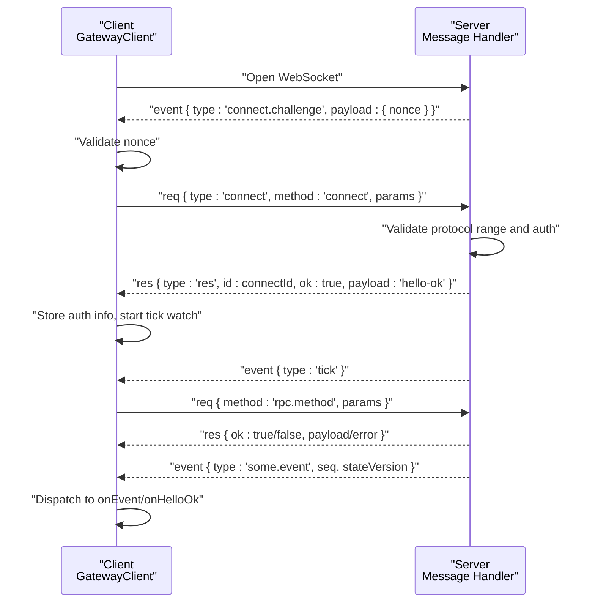
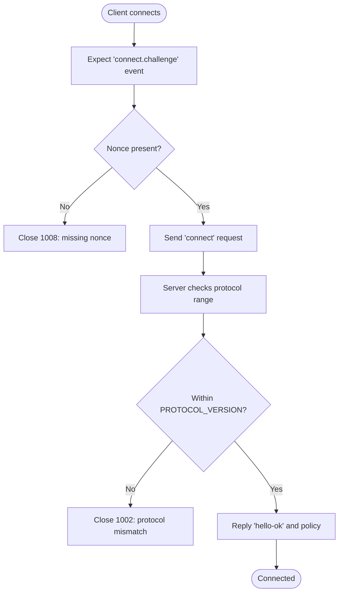
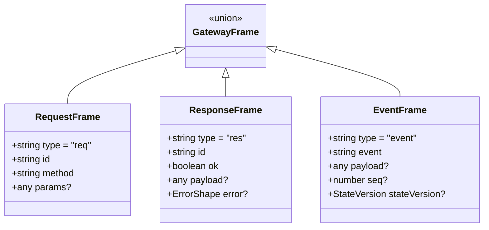
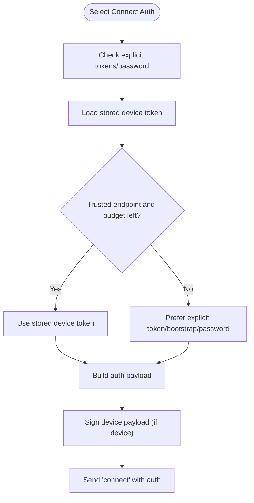
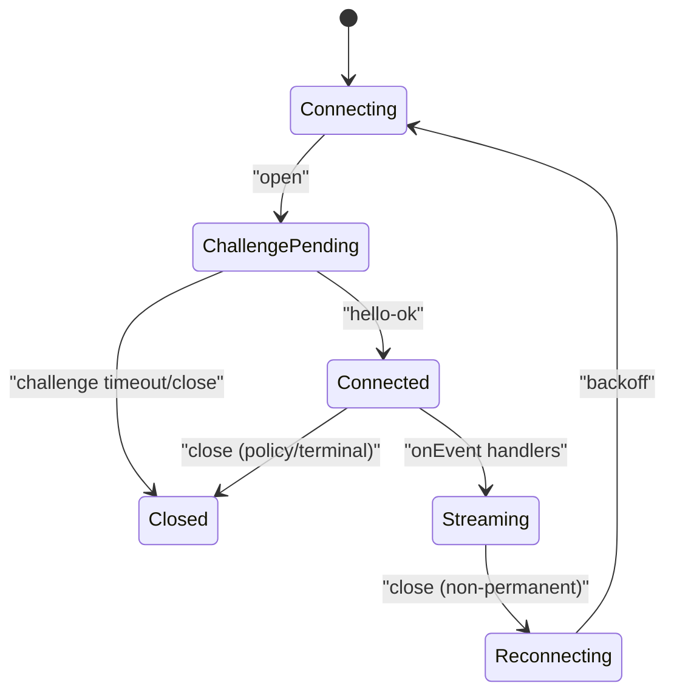
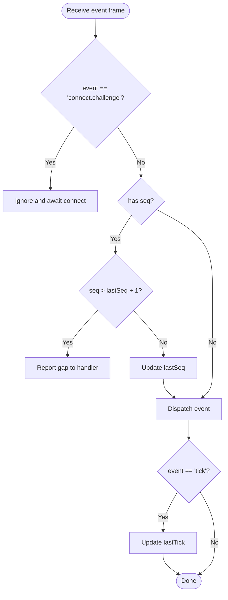
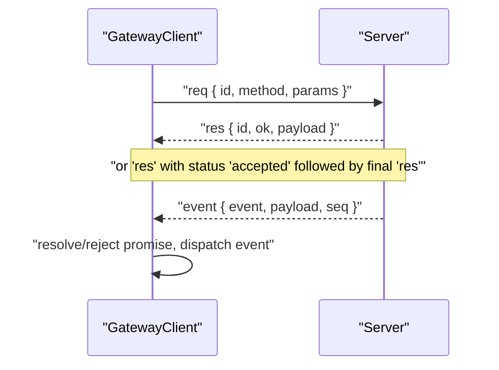
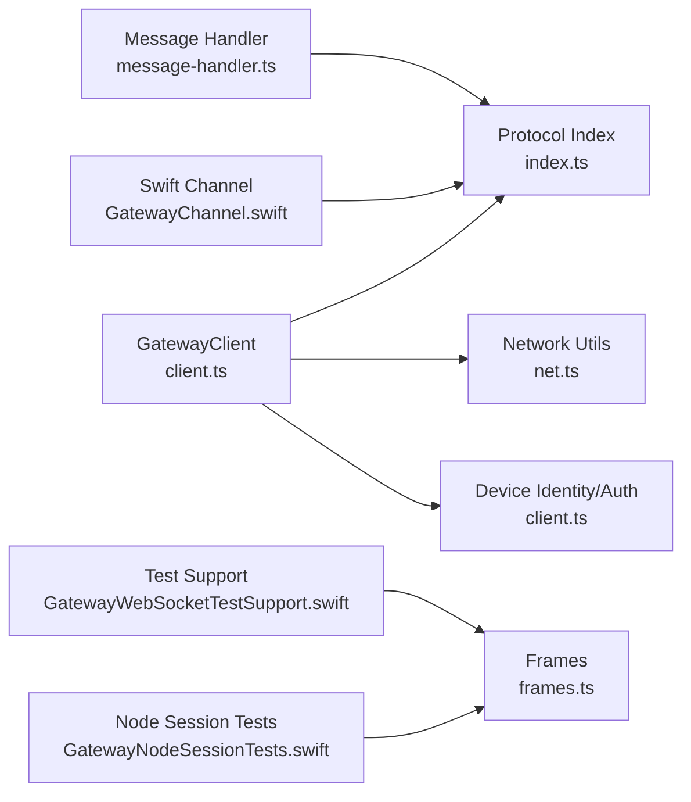

# WebSocket Protocol

<cite>
**Referenced Files in This Document**
- [client.ts](file://src/gateway/client.ts)
- [index.ts](file://src/gateway/protocol/index.ts)
- [frames.ts](file://src/gateway/protocol/schema/frames.ts)
- [message-handler.ts](file://src/gateway/server/ws-connection/message-handler.ts)
- [net.ts](file://src/gateway/net.ts)
- [GatewayChannel.swift](file://apps/shared/OpenClawKit/Sources/OpenClawKit/GatewayChannel.swift)
- [GatewayWebSocketTestSupport.swift](file://apps/macos/Tests/OpenClawIPCTests/GatewayWebSocketTestSupport.swift)
- [GatewayNodeSessionTests.swift](file://apps/shared/OpenClawKit/Tests/OpenClawKitTests/GatewayNodeSessionTests.swift)
</cite>

## Table of Contents
1. [Introduction](#introduction)
2. [Project Structure](#project-structure)
3. [Core Components](#core-components)
4. [Architecture Overview](#architecture-overview)
5. [Detailed Component Analysis](#detailed-component-analysis)
6. [Dependency Analysis](#dependency-analysis)
7. [Performance Considerations](#performance-considerations)
8. [Troubleshooting Guide](#troubleshooting-guide)
9. [Conclusion](#conclusion)

## Introduction
This document specifies the WebSocket-based real-time communication protocol between clients and the gateway. It covers the handshake process, message framing, protocol negotiation, authentication, connection lifecycle, event streaming, bidirectional RPC, and operational safeguards such as rate limiting and TLS pinning. It also documents protocol versioning and migration strategies, and outlines security considerations including transport encryption and device identity verification.

## Project Structure
The WebSocket protocol is implemented across client and server layers:
- Client-side implementation and lifecycle management
- Protocol schema and validation
- Server-side handshake and message handling
- Platform-specific WebSocket handling (Swift)
- Test utilities for protocol frames and connectivity

**Diagram sources**
- [client.ts:124-753](file://src/gateway/client.ts#L124-L753)
- [index.ts:1-673](file://src/gateway/protocol/index.ts#L1-L673)
- [frames.ts:126-164](file://src/gateway/protocol/schema/frames.ts#L126-L164)
- [message-handler.ts:343-385](file://src/gateway/server/ws-connection/message-handler.ts#L343-L385)
- [GatewayChannel.swift:622-652](file://apps/shared/OpenClawKit/Sources/OpenClawKit/GatewayChannel.swift#L622-L652)
- [GatewayWebSocketTestSupport.swift:97-130](file://apps/macos/Tests/OpenClawIPCTests/GatewayWebSocketTestSupport.swift#L97-L130)
- [GatewayNodeSessionTests.swift:104-152](file://apps/shared/OpenClawKit/Tests/OpenClawKitTests/GatewayNodeSessionTests.swift#L104-L152)

**Section sources**
- [client.ts:124-753](file://src/gateway/client.ts#L124-L753)
- [index.ts:1-673](file://src/gateway/protocol/index.ts#L1-L673)
- [frames.ts:126-164](file://src/gateway/protocol/schema/frames.ts#L126-L164)
- [message-handler.ts:343-385](file://src/gateway/server/ws-connection/message-handler.ts#L343-L385)
- [GatewayChannel.swift:622-652](file://apps/shared/OpenClawKit/Sources/OpenClawKit/GatewayChannel.swift#L622-L652)
- [GatewayWebSocketTestSupport.swift:97-130](file://apps/macos/Tests/OpenClawIPCTests/GatewayWebSocketTestSupport.swift#L97-L130)
- [GatewayNodeSessionTests.swift:104-152](file://apps/shared/OpenClawKit/Tests/OpenClawKitTests/GatewayNodeSessionTests.swift#L104-L152)

## Core Components
- GatewayClient: Implements the client-side WebSocket lifecycle, handshake, authentication, request/response RPC, event streaming, and reconnection/backoff.
- Protocol schemas and validators: Define message frames, validation, and protocol versioning.
- Server message handler: Enforces handshake ordering, validates protocol versions, and handles connect challenges.
- Swift WebSocket channel: Decodes frames, tracks sequence gaps, and forwards events.
- Test utilities: Provide mock frames and helpers for protocol testing.

Key responsibilities:
- Transport: Secure WebSocket (wss://) with optional TLS fingerprint pinning; plaintext ws:// restricted to loopback by default.
- Framing: JSON frames with discriminated union type field ("req", "res", "event").
- Authentication: Token-based (gateway token/bootstrap/password/device token), device identity signing, and optional device token caching.
- Lifecycle: Connect challenge, hello-ok, periodic ticks, graceful close, and exponential backoff.
- Streaming: Events with optional sequence numbers and state versions.

**Section sources**
- [client.ts:124-753](file://src/gateway/client.ts#L124-L753)
- [index.ts:1-673](file://src/gateway/protocol/index.ts#L1-L673)
- [frames.ts:126-164](file://src/gateway/protocol/schema/frames.ts#L126-L164)
- [message-handler.ts:343-385](file://src/gateway/server/ws-connection/message-handler.ts#L343-L385)
- [GatewayChannel.swift:622-652](file://apps/shared/OpenClawKit/Sources/OpenClawKit/GatewayChannel.swift#L622-L652)

## Architecture Overview
The WebSocket protocol follows a strict handshake and RPC pattern:
- Client initiates a WebSocket connection.
- Server responds with an event frame containing a connect challenge and nonce.
- Client sends a "connect" request with credentials and capabilities.
- Server validates protocol versions and authenticates; replies with "hello-ok".
- Client starts periodic tick monitoring and emits events to handlers.
- Bidirectional RPC uses request/response frames with per-request UUIDs.

**Diagram sources**
- [client.ts:222-434](file://src/gateway/client.ts#L222-L434)
- [message-handler.ts:343-385](file://src/gateway/server/ws-connection/message-handler.ts#L343-L385)
- [frames.ts:126-164](file://src/gateway/protocol/schema/frames.ts#L126-L164)

## Detailed Component Analysis

### Handshake and Protocol Negotiation
- The server must receive the first frame as "connect". Non-"connect" frames cause immediate rejection.
- The client waits for a connect challenge event with a nonce; absence or empty nonce terminates the connection with a policy violation close.
- Protocol negotiation enforces min/max protocol bounds against the server’s PROTOCOL_VERSION; mismatch closes with a protocol error.
- On successful negotiation, the server replies with a response carrying "hello-ok" payload and client policy (e.g., tick interval).

**Diagram sources**
- [client.ts:554-634](file://src/gateway/client.ts#L554-L634)
- [message-handler.ts:343-385](file://src/gateway/server/ws-connection/message-handler.ts#L343-L385)

**Section sources**
- [client.ts:554-634](file://src/gateway/client.ts#L554-L634)
- [message-handler.ts:343-385](file://src/gateway/server/ws-connection/message-handler.ts#L343-L385)

### Message Framing and Serialization
- Frames are JSON-encoded objects with a discriminated union type field:
  - Request: { type: "req", id, method, params? }
  - Response: { type: "res", id, ok, payload?, error? }
  - Event: { type: "event", event, payload?, seq?, stateVersion? }
- Validation uses AJV schemas compiled at runtime to ensure correctness and prevent injection of unexpected properties.
- Serialization is UTF-8 JSON; binary/string frames are supported by the Swift channel decoder.

**Diagram sources**
- [frames.ts:126-164](file://src/gateway/protocol/schema/frames.ts#L126-L164)

**Section sources**
- [frames.ts:126-164](file://src/gateway/protocol/schema/frames.ts#L126-L164)
- [index.ts:259-263](file://src/gateway/protocol/index.ts#L259-L263)
- [GatewayChannel.swift:622-632](file://apps/shared/OpenClawKit/Sources/OpenClawKit/GatewayChannel.swift#L622-L632)

### Authentication Mechanisms
- Supported credential sources (in precedence order):
  - Device token (cached/stored)
  - Bootstrap token (when no explicit gateway token)
  - Password
  - Gateway token
- Device identity signing:
  - Client signs a payload containing device metadata, client mode, role, scopes, and the connect nonce.
  - Signature is verified by the server during device-authenticated connect.
- TLS fingerprint pinning:
  - When wss:// is used with a configured fingerprint, the client validates the server certificate fingerprint before accepting the connection.
- Retry behavior:
  - On token mismatch or device token errors, the client may retry using a stored device token if the endpoint is trusted.
  - Certain auth failures pause reconnect loops until operator intervention.

**Diagram sources**
- [client.ts:518-552](file://src/gateway/client.ts#L518-L552)
- [client.ts:299-434](file://src/gateway/client.ts#L299-L434)

**Section sources**
- [client.ts:518-552](file://src/gateway/client.ts#L518-L552)
- [client.ts:299-434](file://src/gateway/client.ts#L299-L434)

### Connection Lifecycle Management
- Transport security:
  - wss:// is mandatory for remote connections; plaintext ws:// is allowed only for loopback by default.
  - Break-glass private ws:// is permitted when explicitly enabled for trusted private networks.
- TLS pinning:
  - Optional fingerprint validation for wss:// endpoints to mitigate impersonation.
- Connect challenge timeout:
  - Client sets a timer after opening the socket; failure to receive a challenge within the timeout closes with a policy violation.
- Reconnection and backoff:
  - Exponential backoff up to a cap; reconnect scheduled after close unless paused due to unrecoverable auth errors.
- Tick watch:
  - Periodic "tick" events drive liveness; absence of ticks beyond a threshold triggers a controlled close.

**Diagram sources**
- [client.ts:157-274](file://src/gateway/client.ts#L157-L274)
- [client.ts:616-681](file://src/gateway/client.ts#L616-L681)

**Section sources**
- [client.ts:157-274](file://src/gateway/client.ts#L157-L274)
- [client.ts:616-681](file://src/gateway/client.ts#L616-L681)
- [net.ts:436-481](file://src/gateway/net.ts#L436-L481)

### Event Streaming and Sequence Gaps
- Events carry optional sequence numbers; clients track last seen sequence and report gaps to handlers.
- Special handling for "tick" events updates last tick timestamp; tick watch monitors stall conditions.
- The Swift channel decodes frames and forwards events, skipping internal challenge events.

**Diagram sources**
- [client.ts:554-614](file://src/gateway/client.ts#L554-L614)
- [GatewayChannel.swift:622-652](file://apps/shared/OpenClawKit/Sources/OpenClawKit/GatewayChannel.swift#L622-L652)

**Section sources**
- [client.ts:554-614](file://src/gateway/client.ts#L554-L614)
- [GatewayChannel.swift:622-652](file://apps/shared/OpenClawKit/Sources/OpenClawKit/GatewayChannel.swift#L622-L652)

### Bidirectional Communication Patterns
- RPC:
  - Client generates a UUID per request and tracks pending promises keyed by ID.
  - Responses resolve or reject pending promises; "accepted" status may be followed by a final response.
  - Requests support timeouts; long-running operations can opt out of timeouts.
- Events:
  - Server-to-client asynchronous notifications; clients route to registered event handlers.

**Diagram sources**
- [client.ts:710-751](file://src/gateway/client.ts#L710-L751)
- [frames.ts:126-164](file://src/gateway/protocol/schema/frames.ts#L126-L164)

**Section sources**
- [client.ts:710-751](file://src/gateway/client.ts#L710-L751)
- [frames.ts:126-164](file://src/gateway/protocol/schema/frames.ts#L126-L164)

### Protocol Versioning and Migration
- Clients specify min/max protocol versions; server validates against PROTOCOL_VERSION.
- Migration strategy:
  - Gradually increase minProtocol on the server; older clients with minProtocol below expected version are rejected.
  - New features gated behind higher protocol versions; existing clients continue operating within lower bounds.
  - Backward-compatible additions allowed within the same major protocol version.

**Section sources**
- [message-handler.ts:369-385](file://src/gateway/server/ws-connection/message-handler.ts#L369-L385)
- [index.ts:561](file://src/gateway/protocol/index.ts#L561)

### Security Considerations
- Transport encryption:
  - wss:// required for remote; plaintext ws:// restricted to loopback by default.
  - Optional private ws:// allowed only when explicitly enabled for trusted private networks.
- Device identity:
  - Device payloads signed by client private key; server verifies signature and nonce.
- TLS pinning:
  - Optional fingerprint validation for wss:// to prevent man-in-the-middle impersonation.
- Policy violations:
  - Non-"connect" first frame, missing nonce, protocol mismatch, and rate limits trigger immediate closes with descriptive reasons.

**Section sources**
- [net.ts:436-481](file://src/gateway/net.ts#L436-L481)
- [client.ts:299-434](file://src/gateway/client.ts#L299-L434)
- [message-handler.ts:343-385](file://src/gateway/server/ws-connection/message-handler.ts#L343-L385)

### Rate Limiting and Operational Safeguards
- Rate limiting:
  - Authentication errors may include a detail code indicating rate limiting; clients pause reconnect loops accordingly.
- Graceful degradation:
  - Long-lived responses and large payloads are supported via increased max payload size.
  - Tick watch detects stalls and closes the connection to prevent indefinite hanging.

**Section sources**
- [client.ts:437-465](file://src/gateway/client.ts#L437-L465)
- [client.ts:193-195](file://src/gateway/client.ts#L193-L195)
- [client.ts:659-681](file://src/gateway/client.ts#L659-L681)

## Dependency Analysis
- Client depends on:
  - Protocol schemas for frame validation and protocol version constants.
  - Network utilities for URL security checks and TLS fingerprint validation.
  - Device identity utilities for signing and token storage.
- Server depends on:
  - Protocol schemas for validation and error shaping.
  - Message handler for handshake enforcement and connect challenge logic.

**Diagram sources**
- [client.ts:124-753](file://src/gateway/client.ts#L124-L753)
- [index.ts:1-673](file://src/gateway/protocol/index.ts#L1-L673)
- [net.ts:1-482](file://src/gateway/net.ts#L1-L482)
- [message-handler.ts:343-385](file://src/gateway/server/ws-connection/message-handler.ts#L343-L385)
- [GatewayChannel.swift:622-652](file://apps/shared/OpenClawKit/Sources/OpenClawKit/GatewayChannel.swift#L622-L652)
- [GatewayWebSocketTestSupport.swift:97-130](file://apps/macos/Tests/OpenClawIPCTests/GatewayWebSocketTestSupport.swift#L97-L130)
- [GatewayNodeSessionTests.swift:104-152](file://apps/shared/OpenClawKit/Tests/OpenClawKitTests/GatewayNodeSessionTests.swift#L104-L152)

**Section sources**
- [client.ts:124-753](file://src/gateway/client.ts#L124-L753)
- [index.ts:1-673](file://src/gateway/protocol/index.ts#L1-L673)
- [net.ts:1-482](file://src/gateway/net.ts#L1-L482)
- [message-handler.ts:343-385](file://src/gateway/server/ws-connection/message-handler.ts#L343-L385)
- [GatewayChannel.swift:622-652](file://apps/shared/OpenClawKit/Sources/OpenClawKit/GatewayChannel.swift#L622-L652)
- [GatewayWebSocketTestSupport.swift:97-130](file://apps/macos/Tests/OpenClawIPCTests/GatewayWebSocketTestSupport.swift#L97-L130)
- [GatewayNodeSessionTests.swift:104-152](file://apps/shared/OpenClawKit/Tests/OpenClawKitTests/GatewayNodeSessionTests.swift#L104-L152)

## Performance Considerations
- Payload sizing:
  - Max payload increased to accommodate large responses (e.g., screen snapshots).
- Timeout tuning:
  - Request timeouts configurable; long-running operations can disable timeouts.
- Backoff:
  - Exponential backoff prevents thundering herd on transient failures.
- Tick watch:
  - Periodic liveness detection avoids stuck connections.

[No sources needed since this section provides general guidance]

## Troubleshooting Guide
Common issues and remedies:
- Connection closes with policy violation:
  - Verify transport security (use wss:// for remote; loopback allowed for ws://).
  - Ensure connect challenge is received and nonce is present.
- Protocol mismatch:
  - Align client min/max protocol with server’s PROTOCOL_VERSION.
- Authentication failures:
  - Review detail codes for token issues; device token mismatches may require operator action or device identity revalidation.
- Stalled connections:
  - Absence of "tick" events beyond threshold triggers a controlled close; investigate upstream delays.

Operational hints:
- Use TLS fingerprint pinning for wss:// endpoints to harden against impersonation.
- Monitor close codes and reasons; consult client-side close code hints for diagnosis.

**Section sources**
- [client.ts:111-120](file://src/gateway/client.ts#L111-L120)
- [client.ts:234-274](file://src/gateway/client.ts#L234-L274)
- [client.ts:437-465](file://src/gateway/client.ts#L437-L465)
- [net.ts:436-481](file://src/gateway/net.ts#L436-L481)

## Conclusion
The WebSocket protocol provides a robust, versioned, and secure real-time channel between clients and the gateway. Its design emphasizes strict handshake and validation, strong authentication (including device identity), resilient lifecycle management, and safe defaults for transport security. The schema-driven framing and event sequencing enable reliable bidirectional communication, while operational safeguards ensure stability under adverse conditions.